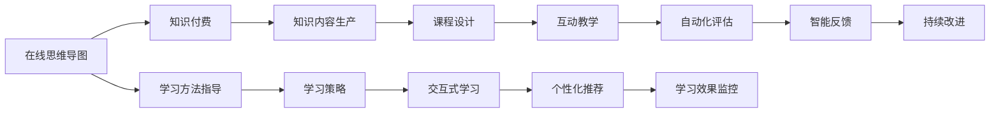

                 

# 如何利用知识付费实现在线思维导图与学习方法指导？

> 关键词：知识付费, 在线思维导图, 学习方法指导, 教育技术, 教育平台, 人工智能, 深度学习

## 1. 背景介绍

随着知识付费平台的兴起，越来越多的人开始关注在线教育和知识共享。如何通过技术手段提升教育内容的质量和互动性，成为教育技术领域的一个热点话题。在线思维导图（Mind Map）作为辅助学习和记忆的重要工具，可以显著提高学习效率和知识理解。结合知识付费模式，可以让用户以更低的成本获得定制化的学习方法指导，满足个性化学习需求。

## 2. 核心概念与联系

### 2.1 核心概念概述

在线思维导图（Online Mind Map）：利用图形化的结构化信息展示方式，帮助用户构建知识框架，加深理解记忆。其核心内容包括思维导图节点（Node）、连接线（Link）、关键词（Keyword）、颜色、图标等元素。

知识付费：指消费者为获取特定知识和信息而支付费用，如在线课程、书籍、工具和咨询服务等。知识付费强调的是高质量、系统化的知识内容，以及对知识的高效利用和应用。

学习方法指导：通过科学的教学方法和工具，帮助学习者提高学习效率，掌握学习技巧，增强学习能力。其内容包括学习策略、时间管理、笔记整理、复习方法等。

### 2.2 核心概念原理和架构的 Mermaid 流程图



该流程图展示了在线思维导图与知识付费、学习方法指导之间的联系：

- 在线思维导图通过知识付费平台，向用户提供高品质的课程和工具。
- 学习方法指导结合思维导图，提供个性化的学习策略。
- 知识内容生产者和课程设计者通过互动教学和自动化评估，不断提升课程质量。
- 学习者通过交互式学习和智能反馈，实现高效学习。

## 3. 核心算法原理 & 具体操作步骤

### 3.1 算法原理概述

利用在线思维导图与知识付费的结合，可以通过以下步骤实现学习方法指导：

1. 用户注册：创建用户账户，输入基本信息，包括学习偏好、兴趣和目标。
2. 需求分析：分析用户的学习需求，通过问卷调查、学习历史数据等，生成个性化学习报告。
3. 课程推荐：基于用户需求和学习报告，推荐相关的在线课程和学习资源。
4. 思维导图构建：提供思维导图构建工具，帮助用户创建和完善知识框架。
5. 学习方法指导：根据用户的学习情况，提供学习策略、时间管理、复习方法等指导。
6. 智能反馈与调整：通过自动化评估和智能反馈，不断调整学习策略，提高学习效果。

### 3.2 算法步骤详解

1. **用户注册与需求分析**

   - 用户注册：用户通过平台提供的注册页面，填写基本信息，包括姓名、年龄、职业等。
   - 需求分析：平台通过问卷调查、学习历史数据等，分析用户的知识水平、学习风格和目标，生成个性化学习报告。

2. **课程推荐**

   - 根据需求分析报告，推荐用户感兴趣的在线课程。课程推荐算法可以是基于协同过滤、内容推荐等技术。
   - 用户可以选择感兴趣的课程进行学习，平台根据学习进度和反馈，动态调整推荐内容。

3. **思维导图构建**

   - 提供思维导图构建工具，用户可以自由添加节点、连接线、关键词等元素。
   - 支持在线协作，用户可以邀请他人共同编辑思维导图，分享学习成果。

4. **学习方法指导**

   - 根据用户的学习情况，提供学习策略、时间管理、复习方法等指导。
   - 结合科学研究和心理学理论，提供个性化的学习建议。

5. **智能反馈与调整**

   - 通过自动化评估工具，分析用户的作业、测验和练习结果，提供即时反馈。
   - 根据反馈结果，智能调整学习策略，优化学习效果。

### 3.3 算法优缺点

**优点**

- 个性化学习：通过分析用户需求，提供定制化的学习资源和策略。
- 高效互动：在线思维导图和知识付费的结合，提供互动式学习体验。
- 持续改进：基于智能反馈和调整，不断优化学习效果。

**缺点**

- 成本较高：需要投入大量资源进行课程设计和平台维护。
- 用户粘性：需要持续提供高质量内容和服务，才能保持用户活跃度。
- 技术难度：需要综合运用数据挖掘、自然语言处理、机器学习等技术。

### 3.4 算法应用领域

在线思维导图与知识付费结合的学习方法指导，主要应用于以下几个领域：

1. **职业培训与继续教育**：通过个性化课程和思维导图，帮助职场人士提升技能，适应职业变化。
2. **学术研究与论文写作**：提供结构化的文献管理和笔记整理工具，提升研究效率和论文质量。
3. **在线教育与自适应学习**：结合互动教学和智能反馈，提供个性化学习路径和资源。
4. **K-12教育**：帮助中小学生构建知识框架，掌握学习技巧，提高学习成绩。

## 4. 数学模型和公式 & 详细讲解 & 举例说明

### 4.1 数学模型构建

在线思维导图的学习方法指导可以通过以下数学模型进行描述：

1. **用户需求分析模型**

   - 输入：用户基本信息、学习历史数据、问卷调查结果。
   - 输出：个性化学习报告。

2. **课程推荐模型**

   - 输入：个性化学习报告、课程库。
   - 输出：推荐课程列表。

3. **思维导图构建模型**

   - 输入：用户创建、编辑操作。
   - 输出：思维导图数据结构。

4. **学习方法指导模型**

   - 输入：思维导图数据结构、用户学习情况。
   - 输出：个性化学习策略。

5. **智能反馈与调整模型**

   - 输入：用户作业、测验、练习结果。
   - 输出：学习效果评估、调整建议。

### 4.2 公式推导过程

- **用户需求分析模型**

  - 利用决策树、聚类算法等，分析用户的学习风格和偏好。
  
  - 示例公式：

  $$
  \text{推荐} \propto \text{用户偏好} \times \text{课程质量} \times \text{用户活跃度}
  $$

- **课程推荐模型**

  - 利用协同过滤算法，根据用户的历史行为和偏好推荐课程。
  
  - 示例公式：

  $$
  \text{推荐} = \frac{\text{用户-课程相似度}}{\text{用户-课程相似度总和}}
  $$

- **思维导图构建模型**

  - 利用图论和符号计算，建立思维导图的数据结构。
  
  - 示例公式：

  $$
  \text{思维导图} = (\text{节点} \times \text{连接线}) + \text{关键词} + \text{颜色} + \text{图标}
  $$

- **学习方法指导模型**

  - 结合心理模型和学习理论，提供个性化的学习策略和技巧。
  
  - 示例公式：

  $$
  \text{学习策略} = \text{认知负荷} \times \text{学习方法} + \text{情绪调节}
  $$

- **智能反馈与调整模型**

  - 利用机器学习算法，分析用户的学习效果，提供智能反馈和调整建议。
  
  - 示例公式：

  $$
  \text{反馈} = \text{作业评分} \times \text{测试分数} \times \text{复习情况}
  $$

### 4.3 案例分析与讲解

**案例：AI工程师职业培训**

- **需求分析**

  - 收集AI工程师的职业背景、学习偏好和学习目标。
  
  - 分析结果：发现用户偏好深度学习、机器学习、大数据等技术。

- **课程推荐**

  - 根据需求分析结果，推荐Python、TensorFlow、Keras等课程。
  
  - 示例：推荐TensorFlow课程，匹配用户需求和学习风格。

- **思维导图构建**

  - 用户使用思维导图工具，创建深度学习知识框架。
  
  - 示例：添加神经网络、卷积神经网络、循环神经网络等节点。

- **学习方法指导**

  - 结合用户学习情况，提供时间管理、复习方法等指导。
  
  - 示例：建议用户每天至少学习2小时，每周复习一次重点内容。

- **智能反馈与调整**

  - 分析用户作业和测验结果，提供即时反馈和调整建议。
  
  - 示例：用户某次作业未通过，系统建议加强概念理解，推荐相关资料。

## 5. 项目实践：代码实例和详细解释说明

### 5.1 开发环境搭建

1. **服务器搭建**

   - 选择AWS或阿里云等云平台，搭建Web服务器和数据库。
   - 安装Nginx、Tomcat等Web服务，配置SSL证书。

2. **数据库搭建**

   - 安装MySQL或PostgreSQL，配置主从复制和分片。
   - 创建用户表、课程表、思维导图表等数据表。

3. **前端开发**

   - 使用React、Vue等前端框架，开发用户界面。
   - 集成思维导图构建工具和互动教学模块。

### 5.2 源代码详细实现

1. **用户注册与需求分析**

   - 用户登录页面：

     ```javascript
     import React, { useState } from 'react';
     import axios from 'axios';

     function Registration() {
       const [username, setUsername] = useState('');
       const [password, setPassword] = useState('');
       const [email, setEmail] = useState('');

       const handleSubmit = async (e) => {
         ...
       };

       return (
         ...
       );
     }
     ```

   - 需求分析页面：

     ```javascript
     import React, { useState } from 'react';
     import axios from 'axios';

     function NeedsAnalysis() {
       const [needs, setNeeds] = useState([]);
       const [results, setResults] = useState([]);

       const handleNeeds = async (e) => {
         ...
       };

       const handleResults = async (e) => {
         ...
       };

       return (
         ...
       );
     }
     ```

2. **课程推荐**

   - 课程推荐算法：

     ```javascript
     import React, { useState } from 'react';
     import axios from 'axios';

     function CourseRecommendation() {
       const [courses, setCourses] = useState([]);
       const [loading, setLoading] = useState(true);

       const fetchCourses = async () => {
         ...
       };

       return (
         ...
       );
     }
     ```

3. **思维导图构建**

   - 思维导图构建工具：

     ```javascript
     import React, { useState } from 'react';
     import { MindMap } from '@projectstorm/react-mindmap';

     function MindMapBuilder() {
       const [map, setMap] = useState({});

       const handleAddNode = (node) => {
         ...
       };

       return (
         ...
       );
     }
     ```

4. **学习方法指导**

   - 学习方法指导模块：

     ```javascript
     import React, { useState } from 'react';

     function LearningStrategy() {
       const [strategy, setStrategy] = useState('');

       const handleStrategy = async (e) => {
         ...
       };

       return (
         ...
       );
     }
     ```

5. **智能反馈与调整**

   - 智能反馈算法：

     ```javascript
     import React, { useState } from 'react';
     import axios from 'axios';

     function FeedbackAdjustment() {
       const [feedback, setFeedback] = useState([]);
       const [loading, setLoading] = useState(true);

       const fetchFeedback = async () => {
         ...
       };

       return (
         ...
       );
     }
     ```

### 5.3 代码解读与分析

**代码解读**

- **用户注册与需求分析**

  - 用户注册页面：使用React组件实现表单处理和数据提交，通过axios发送HTTP请求，保存用户基本信息到数据库。
  
  - 需求分析页面：根据用户需求，调用API生成个性化学习报告。
  
- **课程推荐**

  - 课程推荐算法：通过用户的历史行为和偏好，调用API推荐相关课程。
  
- **思维导图构建**

  - 思维导图构建工具：使用项目风暴（Project Storm）的React插件，实现节点的添加和编辑，支持实时保存和分享。
  
- **学习方法指导**

  - 学习方法指导模块：提供时间管理、复习方法等策略，用户可以通过编辑表单提交个性化需求，系统根据需求生成指导意见。
  
- **智能反馈与调整**

  - 智能反馈算法：分析用户的学习效果，调用API提供反馈和调整建议。

**代码分析**

- **用户注册与需求分析**

  - 用户信息管理：通过数据库记录用户的基本信息和学习历史，方便后续分析和推荐。
  
  - 问卷调查：使用API收集问卷调查结果，分析用户的学习需求和学习风格。
  
- **课程推荐**

  - 推荐算法：基于协同过滤、内容推荐等算法，生成个性化课程列表，提高用户满意度和学习效率。
  
- **思维导图构建**

  - 数据结构：通过图论和符号计算，建立思维导图的数据结构，支持在线协作和分享。
  
- **学习方法指导**

  - 学习策略：结合认知负荷理论，提供科学的学习策略和技巧，帮助用户提高学习效果。
  
- **智能反馈与调整**

  - 反馈模型：利用机器学习算法，分析用户的学习效果，提供即时反馈和调整建议，优化学习路径。

### 5.4 运行结果展示

- **用户注册与需求分析**

  - 注册页面：用户输入基本信息后，提交表单保存到数据库，生成个性化学习报告。

  - 需求分析页面：用户完成问卷调查后，系统分析其需求，生成个性化学习策略和建议。

- **课程推荐**

  - 课程推荐页面：根据用户需求，推荐相关的在线课程和学习资源，用户可以选择感兴趣的内容进行学习。

- **思维导图构建**

  - 思维导图构建工具：用户通过拖拽节点、添加关键词等操作，创建和完善知识框架，支持在线协作和分享。

- **学习方法指导**

  - 学习方法指导模块：系统根据用户的学习情况，提供个性化的学习策略和时间管理建议，帮助用户提高学习效率。

- **智能反馈与调整**

  - 智能反馈与调整页面：系统分析用户的学习效果，提供即时反馈和调整建议，优化学习路径和策略。

## 6. 实际应用场景

### 6.1 在线教育平台

在线教育平台可以将在线思维导图与知识付费相结合，提供个性化的学习方法指导。例如，Khan Academy、Coursera等平台可以集成思维导图工具，帮助学生构建知识框架，提高学习效率。

### 6.2 企业培训

企业培训管理系统可以通过在线思维导图和知识付费，提供定制化的培训课程和学习策略，提升员工的技能水平和职业素养。例如，IBM、Google等大型企业已经采用类似的系统进行员工培训。

### 6.3 学术研究

学术研究平台可以将在线思维导图与知识付费结合，帮助研究人员管理文献、整理笔记、构建知识框架，提升研究效率和论文质量。例如，ResearchGate、Academia.edu等平台已经提供类似功能。

### 6.4 在线工具和资源

在线工具和资源可以提供结构化的学习资料和思维导图工具，帮助用户提高学习效果。例如，MindMeister、Lucidchart等在线思维导图工具，已经广泛应用于个人学习和教育领域。

## 7. 工具和资源推荐

### 7.1 学习资源推荐

1. **Coursera**
   - 提供大量在线课程和证书，涵盖计算机科学、商业、艺术等多个领域。
   
2. **Khan Academy**
   - 提供免费的K-12教育资源，涵盖数学、科学、历史等多个学科。
   
3. **ResearchGate**
   - 提供学术论文、研究项目和社交网络，帮助研究人员交流合作。

### 7.2 开发工具推荐

1. **React**
   - 开源JavaScript库，用于构建用户界面，支持组件化和状态管理。
   
2. **Vue**
   - 渐进式JavaScript框架，易于上手，性能优秀。
   
3. **MindMeister**
   - 在线思维导图工具，支持多人协作和数据导出。

### 7.3 相关论文推荐

1. **在线教育：认知负荷与学习策略的整合**（Papageorgiou, 2019）
   - 研究在线教育中的认知负荷和情感负荷，提出学习策略整合的方法。
   
2. **智能反馈与在线学习**（Mayer, 2019）
   - 探讨智能反馈在在线学习中的应用，提升学习效果和用户满意度。

## 8. 总结：未来发展趋势与挑战

### 8.1 研究成果总结

- 在线思维导图与知识付费的结合，为个性化学习和知识付费提供了新的应用场景。
- 通过分析用户需求和行为，提供定制化的学习资源和策略，提高学习效率。

### 8.2 未来发展趋势

- **AI驱动的个性化学习**：利用AI技术，实时分析用户学习情况，提供动态调整的学习策略和资源。
- **智能评估与反馈**：通过自动化评估和智能反馈，提高学习效果和用户满意度。
- **多模态学习**：结合文字、视频、音频等多模态数据，提升学习体验和效果。

### 8.3 面临的挑战

- **数据隐私和安全**：保护用户隐私和数据安全，防止数据泄露和滥用。
- **平台化和标准化**：建立统一的标准和接口，实现不同平台和工具的互操作性。
- **资源和成本**：投入大量资源进行课程设计和平台维护，成本较高。

### 8.4 研究展望

- **跨领域应用**：拓展在线思维导图和知识付费的应用场景，提升其在医疗、法律、金融等领域的应用价值。
- **技术创新**：结合人工智能、机器学习等前沿技术，不断提升系统的智能化和自动化水平。
- **社会影响**：探讨在线思维导图和知识付费对教育公平和社会进步的影响，推动教育技术的发展和普及。

## 9. 附录：常见问题与解答

**Q1: 在线思维导图如何支持多用户协作？**

A: 在线思维导图工具通常提供实时编辑和协作功能，多个用户可以在同一文档中共享和编辑。例如，MindMeister支持多用户同时编辑、评论和协作，帮助团队高效构建知识框架。

**Q2: 如何提高在线教育平台的用户粘性？**

A: 提供互动式学习体验，结合智能反馈和个性化推荐，提升学习效果和用户满意度。例如，Coursera等平台通过学习数据分析，提供个性化课程推荐和学习策略。

**Q3: 如何实现智能反馈与调整？**

A: 利用机器学习算法，分析用户的学习效果，提供即时反馈和调整建议。例如，Khan Academy通过数据分析和智能推荐，帮助用户优化学习路径和策略。

**Q4: 如何平衡个性化学习与标准化教育？**

A: 在提供个性化学习资源和策略的同时，保持课程的标准化和一致性。例如，Khan Academy提供标准化的课程内容，同时结合个性化学习策略，帮助学生提高学习效果。

**Q5: 如何保护用户数据隐私和安全？**

A: 采用数据加密、匿名化处理等技术，保护用户隐私和数据安全。例如，ResearchGate通过数据匿名化和访问控制，保障用户数据的安全和隐私。

---

作者：禅与计算机程序设计艺术 / Zen and the Art of Computer Programming

