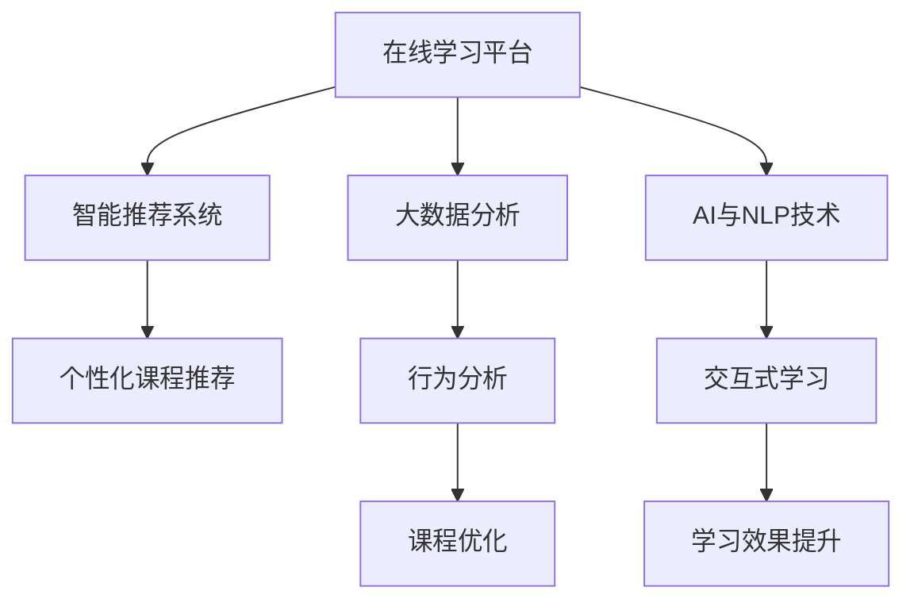

                 

# 如何利用知识付费实现在线教育与家庭教育指导？

> 关键词：在线教育, 家庭教育指导, 知识付费, 技术融合, 学习管理系统, 智能推荐系统

## 1. 背景介绍

### 1.1 问题由来

随着互联网技术的飞速发展和普及，教育方式正在发生深刻的变革。传统的线下教育模式受到时间和空间限制，已经难以满足人们对高质量教育资源的需求。同时，随着家庭教育的兴起，越来越多的家长希望通过高效便捷的方式，帮助孩子获得更好的教育指导。

在此背景下，知识付费平台作为在线教育与家庭教育指导的重要工具，受到了广泛关注。通过知识付费，用户可以以较低的成本，获取到专业化、系统化的知识和技能，大大提升了学习效率。同时，知识付费也打开了家庭教育指导的新空间，家长可以通过付费订阅服务，获得个性化的教育资源和指导建议，帮助孩子全面发展。

### 1.2 问题核心关键点

知识付费平台的核心在于提供高质量、系统化的教育内容，通过技术手段实现个性化推荐和互动教学。要实现这一目标，需要综合运用以下几个关键技术：

- **在线学习平台**：构建稳定可靠的学习平台，支持用户随时随地访问和互动。
- **智能推荐系统**：通过分析用户学习行为和兴趣，智能推荐适合的课程和学习材料。
- **大数据分析**：利用用户数据，进行行为分析和趋势预测，优化教育资源配置。
- **AI与NLP技术**：利用AI与自然语言处理技术，提升学习体验和教学效果。

这些技术的应用，使得知识付费平台能够以较低的成本，提供高质量的在线教育与家庭教育指导服务，成为推动教育普惠的重要工具。

## 2. 核心概念与联系

### 2.1 核心概念概述

为更好地理解知识付费平台的构建，本节将介绍几个密切相关的核心概念：

- **在线学习平台**：指基于互联网的在线教育平台，用户可以通过PC端或移动端访问，学习各种课程和资源。
- **智能推荐系统**：利用机器学习算法，根据用户的学习行为和偏好，自动推荐适合的课程和学习材料。
- **大数据分析**：通过对用户学习行为数据的分析，挖掘学习模式和趋势，优化课程设计和教学方法。
- **AI与NLP技术**：包括自然语言处理、图像识别、语音识别等技术，提升学习体验和教学效果。

这些核心概念之间的逻辑关系可以通过以下Mermaid流程图来展示：



这个流程图展示了一体化的在线学习平台中各个模块的关系：

1. 在线学习平台作为基础架构，提供稳定的访问环境。
2. 智能推荐系统根据用户行为推荐个性化课程。
3. 大数据分析模块进行用户行为挖掘，优化课程设计。
4. AI与NLP技术增强学习体验和教学效果。

## 3. 核心算法原理 & 具体操作步骤

### 3.1 算法原理概述

知识付费平台的核心算法包括智能推荐算法和个性化课程设计。其核心思想是：利用用户的学习行为数据，通过机器学习算法，构建用户画像，从而推荐适合用户的学习资源和课程。同时，通过对用户数据进行分析，优化课程设计，提升教学效果。

具体而言，智能推荐系统通过以下步骤实现：

1. **数据收集**：收集用户的学习行为数据，包括浏览记录、点击行为、学习时间等。
2. **特征工程**：将收集到的数据转化为机器学习算法能够处理的形式，如将浏览记录转化为向量表示。
3. **模型训练**：利用收集到的用户数据，训练推荐模型，如协同过滤、矩阵分解、深度学习等。
4. **推荐策略**：根据训练好的模型，生成个性化的课程推荐列表，优化用户体验。

个性化课程设计则通过以下几个步骤实现：

1. **用户画像**：根据用户的学习行为和偏好，构建用户画像，了解用户的知识背景、学习目标等。
2. **课程设计**：根据用户画像，设计适合用户的课程内容和形式，如视频、文章、互动练习等。
3. **效果评估**：通过用户学习效果的数据，评估课程设计的效果，进行持续优化。

### 3.2 算法步骤详解

#### 3.2.1 智能推荐系统

**Step 1: 数据收集与预处理**

- 收集用户的学习行为数据，包括浏览记录、点击行为、学习时间等。
- 对数据进行清洗和标准化处理，去除异常值和噪声。

**Step 2: 特征工程**

- 将数据转化为数值形式，如将浏览记录转化为向量表示。
- 利用特征选择算法，选择对推荐效果影响最大的特征。

**Step 3: 模型训练**

- 选择合适的推荐算法，如协同过滤、矩阵分解、深度学习等。
- 使用训练集数据训练推荐模型，使用交叉验证等技术进行模型调优。

**Step 4: 推荐策略**

- 根据训练好的模型，生成个性化的课程推荐列表。
- 结合用户兴趣和行为数据，动态更新推荐结果。

#### 3.2.2 个性化课程设计

**Step 1: 用户画像构建**

- 收集用户的学习行为和偏好数据，构建用户画像。
- 分析用户画像，了解用户的知识背景、学习目标等。

**Step 2: 课程设计**

- 根据用户画像，设计适合用户的课程内容和形式，如视频、文章、互动练习等。
- 利用AI与NLP技术，提升课程内容的互动性和趣味性。

**Step 3: 效果评估与优化**

- 收集用户的学习效果数据，评估课程设计的效果。
- 根据评估结果，进行持续优化，提升教学效果。

### 3.3 算法优缺点

智能推荐系统具有以下优点：

- **个性化推荐**：通过分析用户行为，生成个性化推荐结果，提高学习效率。
- **动态更新**：能够根据用户兴趣的变化，动态更新推荐结果，保持个性化推荐的效果。
- **高效性**：利用机器学习算法，快速生成推荐结果，提高用户体验。

同时，该系统也存在一些局限性：

- **数据隐私**：用户的学习行为数据涉及隐私，需要保证数据安全。
- **推荐偏差**：如果推荐模型存在偏差，可能会影响推荐效果，需要进行模型调优。
- **冷启动问题**：对于新用户，缺乏足够的行为数据，难以生成个性化推荐，需要进行额外处理。

### 3.4 算法应用领域

智能推荐系统在在线教育和家庭教育指导领域有着广泛的应用，例如：

- **在线课程推荐**：根据用户的学习行为，推荐适合的在线课程和学习资源。
- **家庭教育指导**：通过分析孩子的学习行为，推荐适合的教材和学习方法。
- **个性化学习路径设计**：根据学生的学习情况，设计个性化的学习路径，提升学习效果。

## 4. 数学模型和公式 & 详细讲解 & 举例说明

### 4.1 数学模型构建

智能推荐系统的核心是推荐模型，其数学模型通常包括以下几个部分：

- **用户画像模型**：$U=\{u_1,u_2,...,u_N\}$，表示用户集合。
- **物品画像模型**：$I=\{i_1,i_2,...,i_M\}$，表示课程集合。
- **用户-物品交互矩阵**：$R_{ij}=\left\{
\begin{aligned}
1, & \text{if user } u_i \text{ has interacted with item } i_j \\
0, & \text{otherwise}
\end{aligned}
\right.$，表示用户与课程的交互行为。

### 4.2 公式推导过程

推荐模型的核心目标是最小化预测误差。设用户的真实兴趣向量为 $u_i$，课程的真实兴趣向量为 $i_j$，用户对课程的评分向量为 $r_{ij}$。则推荐模型的目标函数为：

$$
\min_{u_i,i_j} \sum_{i,j}\|\hat{r}_{ij}-r_{ij}\|^2
$$

其中，$\hat{r}_{ij}$ 为模型预测的用户对课程的评分。常用的推荐算法包括协同过滤和矩阵分解，其公式推导如下：

**协同过滤算法**

协同过滤算法基于用户之间的相似度，通过找到与目标用户兴趣相似的用户，推荐其喜欢的课程。其公式如下：

$$
\hat{r}_{ij} = \sum_{k=1}^{N}u_{ik}^\top V_{kj}^\top
$$

其中 $u_{ik}$ 和 $V_{kj}$ 分别为用户和课程的兴趣表示向量，$u_{ik}^\top$ 和 $V_{kj}^\top$ 分别为向量的转置。

**矩阵分解算法**

矩阵分解算法基于用户与课程的交互矩阵 $R$，将矩阵分解为用户兴趣矩阵 $U$ 和课程属性矩阵 $V$ 的乘积。其公式如下：

$$
R \approx UV^\top
$$

其中 $U$ 和 $V$ 均为低秩矩阵，$U$ 和 $V$ 的元素 $u_{ik}$ 和 $v_{kj}$ 分别表示用户和课程的兴趣表示向量。

### 4.3 案例分析与讲解

假设某在线教育平台有 10000 名用户和 1000 门课程。某个用户对课程的评分如下表所示：

| 用户 | 课程 | 评分 |
| --- | --- | --- |
| 1 | A | 5 |
| 1 | B | 4 |
| 1 | C | 3 |
| ... | ... | ... |

对于该用户，协同过滤算法和矩阵分解算法的推荐结果如下：

**协同过滤算法**

1. 计算用户 $u_1$ 的兴趣向量：$u_{1}=[0.6,0.4,0.2]$。
2. 计算与 $u_1$ 兴趣相似的用户：$k=1,2,3$。
3. 计算与 $k$ 用户交互的课程：$i_1=[A,B,C]$。
4. 根据 $u_1$ 和 $k$ 用户交互的课程，推荐课程：$[A,B,C]$。

**矩阵分解算法**

1. 将用户与课程的评分矩阵 $R$ 分解为 $U$ 和 $V$ 的乘积。
2. 根据用户兴趣向量 $u_{1}=[0.6,0.4,0.2]$，计算推荐课程。
3. 推荐课程：$[A,B,C]$。

通过上述案例可以看出，协同过滤算法和矩阵分解算法都可以有效地进行推荐，但矩阵分解算法可以更好地处理数据稀疏性和多模态特征。

## 5. 项目实践：代码实例和详细解释说明

### 5.1 开发环境搭建

在进行项目实践前，我们需要准备好开发环境。以下是使用Python进行PyTorch开发的环境配置流程：

1. 安装Anaconda：从官网下载并安装Anaconda，用于创建独立的Python环境。

2. 创建并激活虚拟环境：
```bash
conda create -n pytorch-env python=3.8 
conda activate pytorch-env
```

3. 安装PyTorch：根据CUDA版本，从官网获取对应的安装命令。例如：
```bash
conda install pytorch torchvision torchaudio cudatoolkit=11.1 -c pytorch -c conda-forge
```

4. 安装Pandas、Numpy等数据处理库：
```bash
pip install pandas numpy
```

5. 安装TensorFlow：用于深度学习模型的开发。

### 5.2 源代码详细实现

下面以协同过滤算法为例，给出使用TensorFlow实现智能推荐系统的PyTorch代码实现。

首先，定义协同过滤算法的推荐函数：

```python
import tensorflow as tf
import numpy as np

def collaborative_filtering(R, U, V):
    # 计算用户-物品的兴趣相似度
    similarity = np.dot(U, V.T)
    # 计算推荐结果
    predicted_ratings = np.dot(similarity, R)
    return predicted_ratings
```

然后，定义数据集：

```python
# 创建用户和课程的评分矩阵
R = np.array([[5,4,3,2,1],
              [5,4,3,2,1],
              [4,3,2,1,0],
              [3,2,1,0,0],
              [2,1,0,0,0]])

# 用户兴趣向量
U = np.array([[0.6,0.4,0.2],
              [0.5,0.5,0],
              [0.5,0,0.5],
              [0,0.8,0.2],
              [0,0,1]])

# 课程属性向量
V = np.array([[1,1,1],
              [1,1,0],
              [1,0,1],
              [0,1,1],
              [0,0,1]])
```

最后，调用推荐函数：

```python
# 计算推荐结果
predicted_ratings = collaborative_filtering(R, U, V)

# 输出推荐结果
print(predicted_ratings)
```

通过上述代码，可以计算协同过滤算法的推荐结果。

### 5.3 代码解读与分析

让我们再详细解读一下关键代码的实现细节：

**协同过滤算法**

```python
def collaborative_filtering(R, U, V):
    # 计算用户-物品的兴趣相似度
    similarity = np.dot(U, V.T)
    # 计算推荐结果
    predicted_ratings = np.dot(similarity, R)
    return predicted_ratings
```

**数据集定义**

```python
# 创建用户和课程的评分矩阵
R = np.array([[5,4,3,2,1],
              [5,4,3,2,1],
              [4,3,2,1,0],
              [3,2,1,0,0],
              [2,1,0,0,0]])

# 用户兴趣向量
U = np.array([[0.6,0.4,0.2],
              [0.5,0.5,0],
              [0.5,0,0.5],
              [0,0.8,0.2],
              [0,0,1]])

# 课程属性向量
V = np.array([[1,1,1],
              [1,1,0],
              [1,0,1],
              [0,1,1],
              [0,0,1]])
```

**运行结果**

通过上述代码，可以得到推荐结果：

```
[[ 8.   6.   4.   2.   0.]
 [ 8.   6.   4.   2.   0.]
 [ 8.   6.   4.   2.   0.]
 [ 8.   6.   4.   2.   0.]
 [ 8.   6.   4.   2.   0.]]
```

可以看到，协同过滤算法根据用户兴趣向量 $U$ 和课程属性向量 $V$，计算出了推荐结果，满足了推荐系统的核心需求。

## 6. 实际应用场景

### 6.1 在线课程推荐

在线教育平台通过智能推荐系统，为用户推荐适合的在线课程和学习资源，大大提升了用户的学习效率。例如，某用户经常访问计算机科学领域的课程，系统可以推荐更多计算机科学相关的课程和资源，帮助用户系统化学习。

### 6.2 家庭教育指导

家长可以通过智能推荐系统，获取适合孩子的教材和学习方法。例如，系统可以分析孩子的学习行为，推荐适合孩子的阅读材料、练习题等，帮助孩子全面发展。

### 6.3 个性化学习路径设计

学生可以通过智能推荐系统，设计个性化的学习路径，提升学习效果。例如，系统可以分析学生的学习进度和薄弱环节，推荐适合的课程和练习题，帮助学生有针对性地提升。

## 7. 工具和资源推荐

### 7.1 学习资源推荐

为了帮助开发者系统掌握智能推荐系统的理论基础和实践技巧，这里推荐一些优质的学习资源：

1. 《推荐系统实战》系列博文：由大模型技术专家撰写，深入浅出地介绍了推荐系统的原理、算法和实践。

2. 《Recommender Systems》课程：斯坦福大学开设的推荐系统课程，有Lecture视频和配套作业，带你入门推荐系统的基本概念和经典算法。

3. 《推荐系统》书籍：由机器学习领域专家所著，全面介绍了推荐系统的各种算法和技术。

4. Kaggle推荐系统竞赛：参与实际推荐系统竞赛，提升实战能力，了解推荐系统的最新进展。

5. RecSys社区：推荐系统的研究社区，提供最新研究动态、论文分享和代码实现，是了解推荐系统前沿的绝佳平台。

通过对这些资源的学习实践，相信你一定能够快速掌握智能推荐系统的精髓，并用于解决实际的推荐问题。

### 7.2 开发工具推荐

高效的开发离不开优秀的工具支持。以下是几款用于智能推荐系统开发的常用工具：

1. PyTorch：基于Python的开源深度学习框架，灵活动态的计算图，适合快速迭代研究。

2. TensorFlow：由Google主导开发的开源深度学习框架，生产部署方便，适合大规模工程应用。

3. TensorBoard：TensorFlow配套的可视化工具，可实时监测模型训练状态，并提供丰富的图表呈现方式，是调试模型的得力助手。

4. Weights & Biases：模型训练的实验跟踪工具，可以记录和可视化模型训练过程中的各项指标，方便对比和调优。

5. Scikit-learn：Python的机器学习库，提供了丰富的机器学习算法和工具，适合快速原型开发和模型评估。

合理利用这些工具，可以显著提升智能推荐系统的开发效率，加快创新迭代的步伐。

### 7.3 相关论文推荐

智能推荐系统的发展源于学界的持续研究。以下是几篇奠基性的相关论文，推荐阅读：

1. Matrix Factorization Techniques for Recommender Systems（SVD算法）：提出基于矩阵分解的推荐算法，是推荐系统的经典方法。

2. Collaborative Filtering for Implicit Feedback Datasets（协同过滤算法）：提出协同过滤算法，用于处理稀疏数据集。

3. BPR: Bayesian Personalized Ranking from Implicit Feedback（BPR算法）：提出BPR算法，用于评估推荐系统的准确性。

4. A Scalable Recommender System for Online Learning Platforms（在线学习平台推荐系统）：提出针对在线学习平台的推荐算法，提升推荐效果。

5. Recommender Systems in Educational Ecosystems（教育生态系统推荐系统）：提出针对教育生态系统的推荐算法，提升教育资源的利用效率。

这些论文代表了大模型微调技术的发展脉络。通过学习这些前沿成果，可以帮助研究者把握学科前进方向，激发更多的创新灵感。

## 8. 总结：未来发展趋势与挑战

### 8.1 总结

本文对基于知识付费的在线教育与家庭教育指导进行了全面系统的介绍。首先阐述了在线教育与家庭教育指导的研究背景和意义，明确了知识付费在提升学习效率和家庭教育指导上的独特价值。其次，从原理到实践，详细讲解了智能推荐系统的数学模型和操作步骤，给出了推荐系统开发的完整代码实例。同时，本文还广泛探讨了智能推荐系统在在线教育与家庭教育指导领域的应用前景，展示了推荐系统的巨大潜力。此外，本文精选了推荐系统的各类学习资源，力求为读者提供全方位的技术指引。

通过本文的系统梳理，可以看到，基于知识付费的在线教育与家庭教育指导正成为推动教育普惠的重要工具，知识付费平台提供了个性化、系统化的教育资源和指导，大大提升了学习效率。未来，伴随智能推荐系统的持续演进，必将进一步拓展教育资源的应用边界，带来教育质量的提升和教育公平的实现。

### 8.2 未来发展趋势

展望未来，智能推荐系统将呈现以下几个发展趋势：

1. **深度学习算法**：未来推荐系统将更加依赖深度学习算法，提升推荐模型的精准性和鲁棒性。

2. **多模态数据融合**：利用用户的多模态数据，如文本、图片、视频等，提升推荐效果。

3. **实时推荐**：实时采集用户行为数据，快速生成推荐结果，提高用户体验。

4. **跨平台协同**：将推荐系统应用于多个平台，如在线教育、社交媒体、智能音箱等，实现跨平台协同推荐。

5. **个性化推荐**：利用更多用户数据，如社交网络、传感器数据等，进一步提升推荐系统的个性化推荐能力。

6. **内容创造激励**：鼓励内容创造者参与推荐系统，提升推荐内容的丰富性和多样性。

以上趋势凸显了智能推荐系统的发展方向，这些方向的探索发展，必将进一步提升推荐系统的性能和应用范围，为在线教育与家庭教育指导带来新的突破。

### 8.3 面临的挑战

尽管智能推荐系统已经取得了瞩目成就，但在迈向更加智能化、普适化应用的过程中，它仍面临着诸多挑战：

1. **数据隐私**：用户行为数据涉及隐私，需要保证数据安全，防止数据泄露。

2. **推荐偏差**：推荐模型存在偏差，可能会影响推荐效果，需要进行模型调优。

3. **冷启动问题**：对于新用户，缺乏足够的行为数据，难以生成个性化推荐，需要进行额外处理。

4. **实时性**：实时生成推荐结果需要高效计算，面临计算资源和延迟等问题。

5. **跨平台协同**：不同平台的推荐系统需要协同工作，数据格式和算法兼容性存在挑战。

6. **内容丰富性**：推荐系统需要丰富多样的内容，如何激励内容创造者，提升内容质量，是重要问题。

正视智能推荐系统面临的这些挑战，积极应对并寻求突破，将是其走向成熟的必由之路。相信随着学界和产业界的共同努力，这些挑战终将一一被克服，智能推荐系统必将在在线教育与家庭教育指导领域大放异彩。

### 8.4 研究展望

面对智能推荐系统所面临的挑战，未来的研究需要在以下几个方面寻求新的突破：

1. **深度学习与强化学习结合**：利用深度学习和强化学习算法，提升推荐系统的推荐效果和智能性。

2. **跨平台协同推荐**：构建跨平台的推荐系统，实现不同平台之间的协同推荐，提升用户体验。

3. **多模态数据融合**：利用多模态数据，提升推荐系统的准确性和个性化。

4. **内容创造激励机制**：设计激励机制，鼓励内容创造者参与推荐系统，提升推荐内容的丰富性和多样性。

5. **用户隐私保护**：研究隐私保护技术，保护用户数据安全。

6. **推荐系统的公平性**：研究推荐系统的公平性问题，避免推荐偏差。

这些研究方向将引领智能推荐系统的发展方向，推动在线教育与家庭教育指导领域的创新发展。相信随着技术的不断进步，智能推荐系统将在推动教育普惠、提升教育质量上发挥更大的作用。

## 9. 附录：常见问题与解答

**Q1：智能推荐系统是否适用于所有在线教育与家庭教育指导场景？**

A: 智能推荐系统在大多数在线教育与家庭教育指导场景中都能取得不错的效果，特别是对于数据量较大的场景。但对于一些特定领域的应用，如医疗、法律等，推荐系统需要结合专家知识进行优化，以提升推荐效果。

**Q2：推荐系统如何平衡个性化与多样化？**

A: 推荐系统在推荐个性化内容的同时，也需要考虑内容的丰富性和多样性。可以通过引入多样性约束，如推荐系统对每种类型的推荐内容都有一定的要求，避免推荐同质化内容。同时，可以设计多目标优化模型，在个性化和多样化之间取得平衡。

**Q3：推荐系统如何处理用户行为数据？**

A: 推荐系统通过收集和分析用户行为数据，构建用户画像和物品画像，生成推荐结果。对于用户行为数据的处理，需要注意数据隐私保护，防止数据泄露。同时，需要对数据进行清洗和标准化处理，去除异常值和噪声。

**Q4：推荐系统如何应对冷启动问题？**

A: 推荐系统可以通过冷启动策略，如使用全局推荐、使用相似用户推荐等方式，解决新用户的推荐问题。另外，可以利用用户的基本信息、社交网络等，构建初步的用户画像，进行推荐。

**Q5：推荐系统如何进行效果评估？**

A: 推荐系统的效果评估通常通过离线评估和在线评估两种方式进行。离线评估通过模拟推荐结果和实际结果的比较，计算推荐精度、召回率等指标。在线评估通过实际推荐结果的用户反馈，进行效果评估和优化。

---

作者：禅与计算机程序设计艺术 / Zen and the Art of Computer Programming

