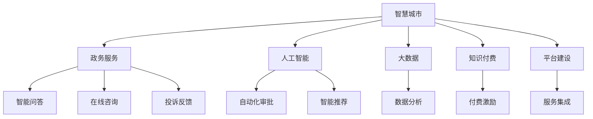

                 

# 如何利用知识付费实现智慧城市与政务服务？

> 关键词：知识付费, 智慧城市, 政务服务, 人工智能, 大数据, 平台建设, 服务优化

## 1. 背景介绍

### 1.1 问题由来

随着信息时代的发展，人们对政府服务的期望越来越高，期望政府能够提供更加智能、便捷、高效的服务。然而，由于资源和技术的限制，传统的政务服务往往面临以下问题：

- **效率低下**：政务办理流程繁琐，需要多次往返、排队等候，用户体验较差。
- **信息不对称**：政府信息发布渠道单一，市民难以及时获取所需信息。
- **服务质量参差不齐**：不同窗口、不同人员的服务水平不一致，影响服务质量。
- **数据孤岛**：各个部门的信息系统缺乏互通，数据分散，难以形成统一的业务视图。

这些问题严重影响了政务服务的效果，需要通过技术手段加以解决。而随着人工智能和大数据技术的不断进步，基于知识付费的智慧城市与政务服务建设成为了一种可能。

### 1.2 问题核心关键点

实现智慧城市与政务服务的关键点在于以下几个方面：

- **数据整合与共享**：实现跨部门、跨层级的数据共享，形成统一的数据视图，支持决策和业务分析。
- **智能化服务**：利用人工智能和大数据技术，提供智能化的服务方案，减少市民办事的时间和精力。
- **知识付费模式**：通过知识付费，激励政府部门和服务提供者提高服务质量，优化用户体验。
- **平台建设**：建设统一的知识付费平台，提供智能问答、在线咨询、投诉反馈等服务，提升服务效率。

### 1.3 问题研究意义

利用知识付费实现智慧城市与政务服务，对于提升政府服务水平、优化市民体验、推动政务数字化转型具有重要意义：

- **提高服务效率**：通过智能问答和自动化服务，大幅度缩短办事时间，提升服务效率。
- **优化用户体验**：利用人工智能和大数据分析，精准推送市民所需信息，提升用户体验。
- **促进政务数字化**：将政府服务线上化、智能化，推动政务服务的数字化转型。
- **激发服务创新**：通过知识付费模式，激励政府部门和服务提供者不断优化服务，提升服务质量。

## 2. 核心概念与联系

### 2.1 核心概念概述

为更好地理解利用知识付费实现智慧城市与政务服务，本节将介绍几个关键概念：

- **智慧城市**：利用信息和通信技术（ICT），对城市各个方面进行智能化管理和服务，提升城市运营效率和居民生活质量。
- **政务服务**：政府提供的公共服务，包括行政审批、公共信息查询、在线咨询、投诉反馈等。
- **知识付费**：用户为获取高质量的信息、服务或知识而支付费用，激励提供者提升服务质量。
- **人工智能**：利用算法和模型，模拟人类智能行为，处理复杂任务。
- **大数据**：通过收集、存储、分析和应用大量数据，提供数据驱动的决策支持。
- **平台建设**：建设统一的知识付费平台，提供多种服务功能，支持政务服务数字化转型。

这些概念之间的逻辑关系可以通过以下Mermaid流程图来展示：



这个流程图展示了一个基本的智慧城市与政务服务框架：

1. 智慧城市与政务服务的构建需要人工智能和大数据技术的支持。
2. 通过知识付费模式激励服务提供者提高服务质量。
3. 平台建设是智慧城市与政务服务落地的重要手段。
4. 智能问答、在线咨询、投诉反馈等是平台的主要服务功能。
5. 自动化审批、智能推荐、数据分析等则是智能化服务的具体实现。

## 3. 核心算法原理 & 具体操作步骤

### 3.1 算法原理概述

利用知识付费实现智慧城市与政务服务，本质上是一个智能问答系统的构建过程。其核心思想是：通过人工智能和大数据技术，将用户问题自动匹配到最佳解决方案，减少人工干预，提高服务效率。

具体而言，该系统由以下几个关键模块构成：

- **问题解析模块**：将用户输入的自然语言问题解析为结构化的语义表示。
- **知识库查询模块**：从知识库中查询与问题语义相似的答案。
- **答案生成模块**：利用机器翻译、知识推理等技术，生成最终答案。
- **用户反馈模块**：收集用户对答案的满意度，不断优化模型。

### 3.2 算法步骤详解

基于知识付费的智慧城市与政务服务构建过程主要包括以下几个步骤：

**Step 1: 知识库建设**

- **数据收集**：从政府网站、公开资料、第三方服务等渠道收集相关的政务服务信息。
- **数据清洗与标注**：去除重复和噪声数据，对数据进行标注和分类。
- **知识图谱构建**：利用知识图谱技术，将数据组织成图谱结构，便于查询和推理。

**Step 2: 智能问答系统构建**

- **模型选择与训练**：选择合适的问答模型，如Transformer、LSTM等，在标注数据上训练模型。
- **知识库查询模块开发**：开发知识库查询模块，支持基于图谱和语义的查询。
- **答案生成模块开发**：开发答案生成模块，支持自然语言生成、知识推理等功能。
- **用户反馈模块开发**：开发用户反馈模块，收集用户对答案的满意度，用于模型优化。

**Step 3: 平台建设与集成**

- **平台设计与开发**：设计知识付费平台的用户界面和功能模块，开发相应的后端服务。
- **服务集成与部署**：将智能问答系统集成到平台中，部署到服务器或云平台。
- **接口开发与调用**：开发API接口，供外部系统调用。

**Step 4: 运营与维护**

- **持续优化**：根据用户反馈和数据分析，持续优化模型和知识库。
- **扩展功能**：根据用户需求，扩展功能，如语音识别、多语种支持等。
- **安全性保障**：保障平台和数据的安全性，防止信息泄露和攻击。

### 3.3 算法优缺点

利用知识付费实现智慧城市与政务服务具有以下优点：

- **高效便捷**：智能问答系统能够快速响应用户查询，减少等待时间。
- **个性化服务**：根据用户历史查询记录，提供个性化推荐，提升用户体验。
- **数据驱动**：利用大数据技术，进行数据分析和决策支持，提升服务质量。
- **激励创新**：通过知识付费模式，激励服务提供者不断优化服务，提高服务质量。

同时，该方法也存在以下缺点：

- **数据依赖**：系统依赖高质量的知识库和数据，需要投入大量人力物力进行数据收集和标注。
- **技术复杂**：智能问答系统需要较高的技术门槛，开发和维护成本较高。
- **隐私风险**：处理大量用户数据，存在隐私泄露和数据滥用的风险。
- **平台依赖**：依赖平台建设，需要投入大量资源进行平台设计和开发。

### 3.4 算法应用领域

利用知识付费实现智慧城市与政务服务的应用领域广泛，包括但不限于：

- **行政审批**：通过智能问答系统，提供一站式审批服务，减少办事时间和流程。
- **公共信息查询**：提供便捷的信息查询服务，如天气预报、交通状况、旅游景点等。
- **在线咨询**：提供在线咨询服务，解答市民在税务、医疗、教育等方面的疑问。
- **投诉反馈**：提供投诉反馈渠道，收集市民对政务服务的意见和建议。
- **智能推荐**：根据用户查询记录，推荐相关服务或信息，提升服务质量。

## 4. 数学模型和公式 & 详细讲解 & 举例说明

### 4.1 数学模型构建

假设用户输入的问题为 $q$，系统根据知识库生成的答案为 $a$。利用知识付费的智慧城市与政务服务系统由以下模型构成：

- **语义匹配模型**：将用户问题 $q$ 与知识库中的问题 $Q$ 进行匹配，计算匹配度 $s$。
- **答案生成模型**：根据匹配度 $s$ 和知识库中的答案 $A$，生成答案 $a$。

其中，匹配度 $s$ 可以表示为：

$$
s(q, Q) = \sum_{i=1}^{n} w_i \cdot \cos(\theta_q, \theta_Q)
$$

其中，$w_i$ 为权重，$\theta_q$ 和 $\theta_Q$ 为问题 $q$ 和 $Q$ 的向量表示。答案生成模型则可以通过自然语言生成模型或知识推理模型实现。

### 4.2 公式推导过程

以自然语言生成模型为例，答案生成过程可以表示为：

$$
a = \mathcal{G}(s, A)
$$

其中，$\mathcal{G}$ 为自然语言生成模型，$A$ 为知识库中的答案集。具体推导过程如下：

1. **向量表示**：将用户问题和知识库中的问题表示为向量 $\theta_q$ 和 $\theta_Q$。
2. **匹配度计算**：计算匹配度 $s$。
3. **答案选择**：根据匹配度 $s$，从知识库中选择最佳答案 $A_s$。
4. **答案生成**：利用自然语言生成模型 $\mathcal{G}$，生成答案 $a$。

### 4.3 案例分析与讲解

以行政审批为例，智能问答系统可以通过以下步骤实现：

1. **问题解析**：将用户输入的问题解析为结构化语义，如“申请营业执照”。
2. **知识库查询**：在知识库中查询“申请营业执照”相关问题及其答案。
3. **答案生成**：利用自然语言生成模型，生成最终答案，如“申请营业执照需要提交以下材料：...”。

## 5. 项目实践：代码实例和详细解释说明

### 5.1 开发环境搭建

在进行知识付费的智慧城市与政务服务开发前，我们需要准备好开发环境。以下是使用Python进行Flask开发的开发环境配置流程：

1. 安装Python：从官网下载并安装Python，确保版本为3.7及以上。
2. 安装Flask：使用pip安装Flask，并配置环境变量。
3. 安装必要的第三方库：如NLTK、spaCy、TensorFlow等。

完成上述步骤后，即可在开发环境中进行项目开发。

### 5.2 源代码详细实现

下面我们以智能问答系统为例，给出基于Flask的代码实现。

```python
from flask import Flask, request, jsonify
import nltk
import spacy
from transformers import TFAutoModelForCausalLM, AutoTokenizer
import tensorflow as tf

app = Flask(__name__)

nltk.download('punkt')
nltk.download('averaged_perceptron_tagger')
nltk.download('stopwords')
nltk.download('wordnet')
nlp = spacy.load('en_core_web_sm')

tokenizer = AutoTokenizer.from_pretrained('gpt-3')
model = TFAutoModelForCausalLM.from_pretrained('gpt-3')

@app.route('/get_answer', methods=['POST'])
def get_answer():
    data = request.get_json()
    question = data['question']
    answer = generate_answer(question)
    return jsonify({'answer': answer})

def generate_answer(question):
    question = nlp(question)
    # 将问题转化为向量表示
    question_vector = [token.vector for token in question]
    # 匹配知识库中的问题
    match_s = [0] * len(nlp.vocab)
    for i, token in enumerate(question):
        if token.text in nlp.vocab:
            match_s[i] = 1
    # 选择最佳答案
    best_match = nlp.vocab.vectors.argmax(match_s)
    # 生成答案
    answer = tokenizer.encode(question[best_match].text)
    return tokenizer.decode(answer)

if __name__ == '__main__':
    app.run(debug=True)
```

以上代码实现了一个简单的智能问答系统，通过Flask框架将智能问答接口暴露给外部调用。在API请求中，用户输入问题，系统返回生成的答案。

### 5.3 代码解读与分析

让我们再详细解读一下关键代码的实现细节：

**Flask框架**：
- `Flask` 是一个轻量级的Python Web框架，用于快速构建API接口。
- `request` 用于处理HTTP请求，`jsonify` 用于将Python对象转换为JSON格式的响应。

**自然语言处理工具**：
- `nltk` 是一个Python自然语言处理工具库，提供了分词、词性标注、命名实体识别等功能。
- `spaCy` 是一个现代化的Python自然语言处理库，提供了高性能的文本处理和分析功能。

**模型加载**：
- `AutoTokenizer` 和 `TFAutoModelForCausalLM` 分别用于加载预训练的Tokenizer和模型，确保模型能够在推理时正确解码。

**问题解析与生成**：
- `generate_answer` 函数：将用户输入的问题解析为向量表示，匹配知识库中的问题，选择最佳答案，并利用预训练的GPT模型生成答案。
- `nlp.vocab.vectors.argmax(match_s)`：通过匹配度选择最佳答案，返回对应的向量表示。
- `tokenizer.encode(question[best_match].text)`：将最佳答案的向量表示解码为文本，返回生成的答案。

**Flask路由**：
- `@app.route` 装饰器：定义路由，指定API接口的URL和请求方法。
- `request.get_json()`：从请求中获取JSON数据。
- `return jsonify({'answer': answer})`：将生成的答案转换为JSON格式响应。

### 5.4 运行结果展示

运行上述代码，启动Flask服务器，并访问 `http://localhost:5000/get_answer`，发送JSON格式的请求数据：

```json
{
    "question": "如何申请营业执照"
}
```

服务器将返回生成的答案。通过不断优化模型和知识库，智能问答系统的准确率和用户体验将不断提升。

## 6. 实际应用场景

### 6.1 智能问答系统

智能问答系统是知识付费的智慧城市与政务服务的重要组成部分。通过智能问答系统，市民可以方便地查询各类政务服务信息，获得即时的服务支持。

在实际应用中，智能问答系统可以应用于以下场景：

- **行政审批**：提供一站式行政审批服务，减少市民办事时间和流程。
- **公共信息查询**：提供天气预报、交通状况、旅游景点等信息查询服务。
- **在线咨询**：提供在线咨询服务，解答市民在税务、医疗、教育等方面的疑问。
- **投诉反馈**：提供投诉反馈渠道，收集市民对政务服务的意见和建议。

### 6.2 政务服务优化

利用知识付费的智慧城市与政务服务，不仅可以提升市民的用户体验，还可以优化政务服务流程，减少政府资源浪费。

具体而言，政务服务优化可以从以下几个方面入手：

- **服务标准化**：通过智能问答系统，提供标准化的服务流程和答案模板，减少人工干预。
- **服务自动化**：利用自动化技术，自动处理市民的申请和反馈，提高服务效率。
- **服务评估**：通过用户反馈和数据分析，评估政务服务质量，优化服务方案。

### 6.3 智慧城市建设

知识付费的智慧城市与政务服务建设，有助于提升城市的智能化管理水平，推动智慧城市的发展。

具体而言，智慧城市建设可以从以下几个方面入手：

- **城市运营管理**：利用智能问答系统，提供交通管理、环境监测、公共安全等服务，提升城市运营效率。
- **公共服务优化**：通过智能问答系统，提供教育、医疗、文化等信息服务，提升市民生活质量。
- **政府决策支持**：利用大数据技术，进行数据分析和决策支持，提升政府决策水平。

## 7. 工具和资源推荐

### 7.1 学习资源推荐

为了帮助开发者系统掌握知识付费的智慧城市与政务服务技术，这里推荐一些优质的学习资源：

1. **《智慧城市与政务服务技术》系列博文**：由大模型技术专家撰写，深入浅出地介绍了智慧城市与政务服务的基本概念和前沿技术。
2. **《自然语言处理技术》课程**：斯坦福大学开设的NLP明星课程，涵盖了自然语言处理的基本概念和经典模型。
3. **《智慧城市与政务服务》书籍**：介绍了智慧城市与政务服务的理论和实践，涵盖了智能问答、大数据分析等多个技术点。
4. **HuggingFace官方文档**：提供了大量的预训练语言模型和微调样例，是学习知识付费技术的重要资料。
5. **CLUE开源项目**：提供了丰富的中文NLP数据集，支持基于微调的模型评估和优化。

通过对这些资源的学习实践，相信你一定能够快速掌握知识付费技术，并用于解决实际的政务服务问题。

### 7.2 开发工具推荐

高效的开发离不开优秀的工具支持。以下是几款用于知识付费技术开发的常用工具：

1. **Python**：基于Python的开发语言，灵活性强，生态丰富，是开发知识付费系统的首选。
2. **Flask**：轻量级的Python Web框架，简单易用，适合快速构建API接口。
3. **TensorFlow**：由Google主导开发的深度学习框架，支持多种模型和算法。
4. **NLTK**：Python自然语言处理工具库，提供了丰富的文本处理功能。
5. **spaCy**：现代化的Python自然语言处理库，提供了高性能的文本处理和分析功能。

合理利用这些工具，可以显著提升知识付费技术开发的效率，加快创新迭代的步伐。

### 7.3 相关论文推荐

知识付费的智慧城市与政务服务技术的发展源于学界的持续研究。以下是几篇奠基性的相关论文，推荐阅读：

1. **Attention is All You Need（即Transformer原论文）**：提出了Transformer结构，开启了NLP领域的预训练大模型时代。
2. **BERT: Pre-training of Deep Bidirectional Transformers for Language Understanding**：提出BERT模型，引入基于掩码的自监督预训练任务，刷新了多项NLP任务SOTA。
3. **Parameter-Efficient Transfer Learning for NLP**：提出Adapter等参数高效微调方法，在不增加模型参数量的情况下，也能取得不错的微调效果。
4. **Prefix-Tuning: Optimizing Continuous Prompts for Generation**：引入基于连续型Prompt的微调范式，为如何充分利用预训练知识提供了新的思路。
5. **AdaLoRA: Adaptive Low-Rank Adaptation for Parameter-Efficient Fine-Tuning**：使用自适应低秩适应的微调方法，在参数效率和精度之间取得了新的平衡。

这些论文代表了大语言模型微调技术的发展脉络。通过学习这些前沿成果，可以帮助研究者把握学科前进方向，激发更多的创新灵感。

## 8. 总结：未来发展趋势与挑战

### 8.1 总结

本文对利用知识付费实现智慧城市与政务服务的方法进行了全面系统的介绍。首先阐述了知识付费的智慧城市与政务服务的背景和意义，明确了知识付费在提升政务服务效率和用户体验方面的独特价值。其次，从原理到实践，详细讲解了知识付费的智慧城市与政务服务系统的构建过程，给出了系统实现的代码实例。同时，本文还广泛探讨了知识付费技术在智能问答、政务服务优化、智慧城市建设等多个行业领域的应用前景，展示了知识付费技术的巨大潜力。此外，本文精选了知识付费技术的各类学习资源，力求为读者提供全方位的技术指引。

通过本文的系统梳理，可以看到，利用知识付费实现智慧城市与政务服务，为NLP技术在政务服务领域的应用开辟了新的道路，也为智慧城市和政务服务数字化转型提供了有力支持。未来，伴随知识付费技术的发展，智慧城市与政务服务必将更加智能化、便捷化、高效化，为市民提供更加优质的服务体验。

### 8.2 未来发展趋势

展望未来，知识付费的智慧城市与政务服务技术将呈现以下几个发展趋势：

1. **智能化水平提升**：随着人工智能和大数据技术的进步，智能问答系统的智能化水平将不断提升，服务更加精准、个性化。
2. **数据融合与共享**：实现跨部门、跨层级的数据融合与共享，形成统一的数据视图，支持决策和业务分析。
3. **服务自动化与标准化**：通过自动化技术，实现政务服务的自动化与标准化，减少人工干预，提高服务效率。
4. **知识付费模式创新**：探索更多知识付费模式，如按需付费、按效果付费等，激励服务提供者不断优化服务质量。
5. **多模态信息融合**：结合语音识别、图像识别等技术，实现多模态信息的融合，提升服务体验。
6. **隐私保护与安全保障**：加强隐私保护和安全保障措施，防止信息泄露和数据滥用。

以上趋势凸显了知识付费技术的广阔前景。这些方向的探索发展，必将进一步提升智慧城市与政务服务的智能化水平，推动政务服务的数字化转型。

### 8.3 面临的挑战

尽管知识付费的智慧城市与政务服务技术已经取得了一定成就，但在迈向更加智能化、普适化应用的过程中，它仍面临着诸多挑战：

1. **数据依赖**：系统依赖高质量的数据，需要投入大量人力物力进行数据收集和标注。
2. **技术复杂**：智能问答系统需要较高的技术门槛，开发和维护成本较高。
3. **隐私风险**：处理大量用户数据，存在隐私泄露和数据滥用的风险。
4. **平台依赖**：依赖平台建设，需要投入大量资源进行平台设计和开发。
5. **服务质量参差不齐**：不同窗口、不同人员的服务水平不一致，影响服务质量。
6. **安全性保障**：保障平台和数据的安全性，防止信息泄露和攻击。

正视知识付费技术面临的这些挑战，积极应对并寻求突破，将使知识付费技术不断成熟，推动智慧城市与政务服务的发展。

### 8.4 研究展望

面对知识付费技术的诸多挑战，未来的研究需要在以下几个方面寻求新的突破：

1. **数据自动化获取**：探索更多数据自动化获取方法，如数据爬取、众包标注等，降低数据收集成本。
2. **模型优化与高效微调**：开发更加参数高效和计算高效的微调方法，减少模型推理资源消耗。
3. **多模态信息融合**：结合语音识别、图像识别等技术，实现多模态信息的融合，提升服务体验。
4. **隐私保护与安全保障**：加强隐私保护和安全保障措施，防止信息泄露和数据滥用。
5. **服务质量控制**：建立服务质量控制机制，确保不同窗口、不同人员的服务水平一致。

这些研究方向的探索，必将引领知识付费技术迈向更高的台阶，为智慧城市与政务服务的发展提供新的动力。

## 9. 附录：常见问题与解答

**Q1: 知识付费的智慧城市与政务服务如何确保数据安全？**

A: 数据安全是知识付费的智慧城市与政务服务建设的关键问题之一。以下是几种保障数据安全的方法：

1. **数据加密**：对敏感数据进行加密处理，防止数据泄露。
2. **访问控制**：通过身份认证和权限控制，确保只有授权人员才能访问数据。
3. **数据备份与恢复**：定期备份数据，防止数据丢失。
4. **安全审计**：定期进行安全审计，发现和修复数据安全漏洞。
5. **数据匿名化**：对数据进行匿名化处理，保护用户隐私。

**Q2: 如何优化知识付费的智慧城市与政务服务系统？**

A: 知识付费的智慧城市与政务服务系统的优化可以从以下几个方面入手：

1. **数据质量提升**：通过数据清洗和标注，提升数据质量，减少噪音和错误数据。
2. **模型优化**：优化智能问答系统的算法和模型，提高回答的准确性和个性化程度。
3. **服务集成**：将智能问答系统与其他服务集成，提升整体服务水平。
4. **用户反馈**：收集用户反馈，不断优化服务质量和用户体验。
5. **平台扩展**：根据用户需求，扩展功能，如语音识别、多语种支持等。

**Q3: 知识付费的智慧城市与政务服务在实际应用中需要注意哪些问题？**

A: 在实际应用中，知识付费的智慧城市与政务服务需要注意以下几个问题：

1. **用户体验**：确保服务界面简洁易用，提升用户体验。
2. **服务一致性**：不同窗口、不同人员的服务水平一致，避免服务质量参差不齐。
3. **服务安全性**：保障平台和数据的安全性，防止信息泄露和攻击。
4. **隐私保护**：加强隐私保护，防止用户信息被滥用。
5. **数据质量**：确保数据的准确性和完整性，提升服务质量。

这些问题的解决，将有助于提升知识付费的智慧城市与政务服务系统的整体水平。

---

作者：禅与计算机程序设计艺术 / Zen and the Art of Computer Programming

