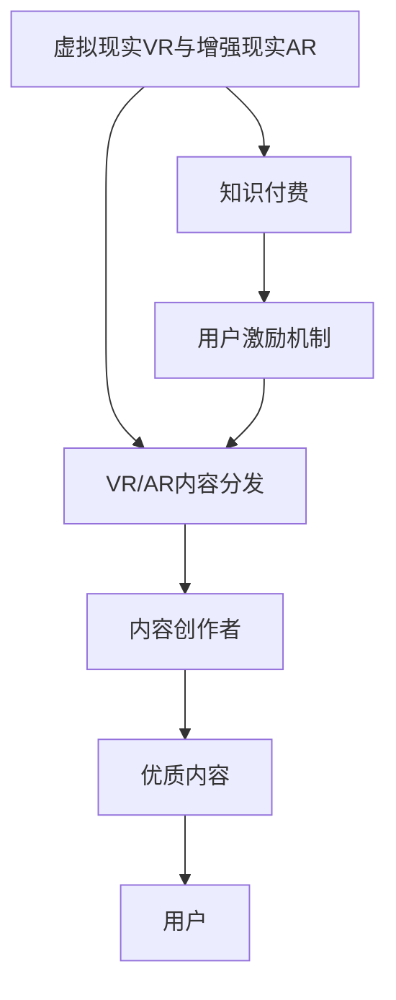

                 

## 1. 背景介绍

### 1.1 问题由来

随着虚拟现实（Virtual Reality, VR）和增强现实（Augmented Reality, AR）技术的迅猛发展，其在教育、娱乐、医疗、工业等领域的应用越来越广泛。然而，VR/AR内容的制作与分发一直是一个巨大挑战。传统的制作流程复杂耗时，高昂的制作成本和复杂的技术门槛让普通创作者难以涉足。

知识付费（Knowledge Paywalls）是一种通过收取订阅费或单次付费的方式，向用户提供高质量内容或服务的商业模式。随着移动互联网和智能设备的发展，知识付费市场快速增长，成为在线教育、内容消费等领域的重要组成部分。

结合VR/AR技术与知识付费，可以通过付费模式激励优质内容的生产与分享，同时提升用户体验，推动VR/AR应用的普及与发展。

### 1.2 问题核心关键点

要实现利用知识付费推动VR/AR应用的发展，需要关注以下几个关键点：

- 内容创作者的激励机制：通过合理的付费模式激励优质内容的生产与分享。
- 提升用户获取VR/AR内容的便利性：简化用户购买和使用内容的方式。
- 降低内容制作的门槛：让更多创作者能够参与VR/AR内容的制作。
- 提升内容质量与互动性：通过付费模式筛选优质内容，提升用户体验。
- 推动VR/AR应用的普及：通过优质内容的吸引力，吸引更多用户使用VR/AR技术。

## 2. 核心概念与联系

### 2.1 核心概念概述

为更好地理解如何利用知识付费推动VR/AR应用的发展，本节将介绍几个密切相关的核心概念：

- 虚拟现实（VR）与增强现实（AR）：通过计算机生成技术，在用户的视觉、听觉、触觉等感官上提供沉浸式的互动体验，为用户提供更丰富、真实、互动的虚拟环境。
- 知识付费：通过收取费用或订阅费的方式，向用户提供高质量内容或服务，激励优质内容的生产与分享。
- VR/AR内容分发：将VR/AR内容提供给用户，包括内容制作、分发、获取和消费等环节。
- 用户激励机制：通过各种激励手段，提升用户对内容创作的积极性和参与度。

这些核心概念之间的逻辑关系可以通过以下Mermaid流程图来展示：



这个流程图展示了几者的关系：

1. VR/AR与知识付费结合，提供沉浸式高质量内容，吸引用户付费。
2. 内容分发平台是内容从创作者到用户的桥梁。
3. 通过用户激励机制，提升创作者的动力与内容质量。

## 3. 核心算法原理 & 具体操作步骤

### 3.1 算法原理概述

利用知识付费推动VR/AR应用，本质上是通过付费机制激励优质内容的生产，并通过内容分发平台提升用户的获取与使用便利性。其核心算法原理如下：

- 内容筛选与推荐算法：根据用户行为和偏好，推荐优质VR/AR内容。
- 定价策略与付费模式设计：设计合理的定价策略，使用户愿意为优质内容付费。
- 平台搭建与技术支持：搭建内容分发平台，提供内容制作与获取的技术支持。
- 激励机制与用户反馈：设计用户激励机制，并通过用户反馈不断优化内容创作和分发流程。

### 3.2 算法步骤详解

**Step 1: 内容筛选与推荐算法**

- 数据收集：收集用户行为数据，包括浏览记录、购买记录、评分等。
- 特征提取：提取用户行为特征，如兴趣偏好、消费习惯等。
- 模型训练：训练推荐模型，如协同过滤、深度学习推荐系统等。
- 内容评分：根据推荐模型预测内容评分。
- 内容推荐：根据用户特征和内容评分，推荐优质VR/AR内容。

**Step 2: 定价策略与付费模式设计**

- 成本分析：分析内容制作、分发、维护等成本。
- 收益模型：设计合理的收益模型，如订阅制、单次付费、免费试用等。
- 定价策略：根据收益模型和成本分析，确定内容定价策略。
- 付费模式：设计多种付费模式，如按次付费、订阅付费、会员制等。

**Step 3: 平台搭建与技术支持**

- 平台设计：设计平台架构，包括内容库、用户管理系统、支付系统等。
- 技术选型：选择适合的VR/AR开发工具和平台，如Unity、Unreal Engine等。
- 开发与测试：开发VR/AR内容，进行测试优化。
- 内容分发：将内容上传到平台，提供下载或流媒体播放。

**Step 4: 激励机制与用户反馈**

- 激励设计：设计激励机制，如积分系统、徽章制度等。
- 用户反馈：收集用户反馈，优化内容创作与分发流程。
- 社区建设：建立用户社区，促进创作者与用户的交流互动。

### 3.3 算法优缺点

利用知识付费推动VR/AR应用的优势包括：

- 激励优质内容生产：通过付费模式筛选优质内容，提升内容质量。
- 提升用户体验：付费内容通常更丰富、更精准，提升用户满意度。
- 简化内容获取：平台化分发简化用户内容获取过程，提升用户体验。
- 降低内容制作门槛：付费模式激励优质内容创作，降低制作门槛。

其劣势主要在于：

- 初期投资高：平台搭建、技术开发需要较高初期投资。
- 内容市场培育期长：优质内容需要时间积累，市场培育周期较长。
- 价格敏感度高：部分用户对付费模式较为敏感，影响用户增长。

### 3.4 算法应用领域

利用知识付费推动VR/AR应用的领域包括但不限于：

- 教育培训：提供沉浸式教育资源，提升学习效果。
- 游戏娱乐：提供高品质的游戏内容，提升游戏体验。
- 医疗健康：提供虚拟医疗体验，提升医疗服务。
- 工业应用：提供虚拟工业培训、设备模拟等，提升工业效率。
- 旅游观光：提供虚拟旅游体验，吸引用户线下旅行。

## 4. 数学模型和公式 & 详细讲解 & 举例说明

### 4.1 数学模型构建

本节将使用数学语言对利用知识付费推动VR/AR应用进行更加严格的刻画。

假设用户数量为 $N$，内容数量为 $M$，每个用户每天浏览次数为 $T$。设内容价值函数为 $V_i$，用户对内容 $i$ 的支付意愿为 $P_i$。设平台对内容 $i$ 的定价为 $P_i^*$，用户对内容 $i$ 的实际支付金额为 $P_i'$，平台收益为 $R$。

数学模型如下：

$$
\max_{P_i^*} R = \sum_{i=1}^M P_i^* \cdot P_i' = \sum_{i=1}^M P_i^* \cdot \mathbb{P}(P_i' > P_i^*)
$$

其中 $\mathbb{P}(P_i' > P_i^*)$ 为内容 $i$ 被用户支付的概率。

### 4.2 公式推导过程

以下我们以游戏娱乐为例，推导内容定价模型及其优化过程。

假设用户对内容 $i$ 的支付意愿 $P_i$ 遵循伯努利分布，即 $P_i = \mathbb{P}(P_i > P_i^*)$。根据贝叶斯定理，有：

$$
P_i' > P_i^* \mid P_i
$$

则用户对内容 $i$ 实际支付的概率为：

$$
\mathbb{P}(P_i' > P_i^*) = \mathbb{P}(P_i' > P_i^* \mid P_i) \cdot \mathbb{P}(P_i)
$$

代入定价模型：

$$
R = \sum_{i=1}^M P_i^* \cdot \mathbb{P}(P_i' > P_i^*)
$$

求导数：

$$
\frac{\partial R}{\partial P_i^*} = \sum_{i=1}^M \mathbb{P}(P_i' > P_i^*) - P_i^* \cdot \sum_{i=1}^M \frac{\partial \mathbb{P}(P_i' > P_i^*)}{\partial P_i^*}
$$

令 $\frac{\partial R}{\partial P_i^*} = 0$，解得：

$$
P_i^* = \frac{\mathbb{P}(P_i' > P_i^*)}{\sum_{i=1}^M \frac{\partial \mathbb{P}(P_i' > P_i^*)}{\partial P_i^*}}
$$

### 4.3 案例分析与讲解

假设某游戏平台有1000名用户，1000款游戏内容，每款游戏每天被浏览10次。根据历史数据，用户对游戏内容的支付意愿服从伯努利分布，其中支付意愿超过定价的概率为0.1。

令 $P_i^*$ 为游戏 $i$ 的定价，$R$ 为平台收益。根据上述推导，得：

$$
R = \sum_{i=1}^{1000} P_i^* \cdot 0.1
$$

令 $P_i^* = P$，则：

$$
R = 1000P \cdot 0.1
$$

求导得：

$$
\frac{\partial R}{\partial P} = 100
$$

解得：

$$
P = 10
$$

因此，每款游戏的定价应为10元，平台每天可获取100元的收益。

## 5. 项目实践：代码实例和详细解释说明

### 5.1 开发环境搭建

在进行知识付费推动VR/AR应用的项目实践前，我们需要准备好开发环境。以下是使用Python进行知识付费平台开发的流程：

1. 安装Anaconda：从官网下载并安装Anaconda，用于创建独立的Python环境。

2. 创建并激活虚拟环境：
```bash
conda create -n knowledge-paywall python=3.8 
conda activate knowledge-paywall
```

3. 安装相关库：
```bash
pip install numpy pandas scikit-learn matplotlib torch transformers pytorch-lightning
```

4. 搭建数据库：
```bash
sudo apt-get install mysql-server
sudo systemctl start mysql
```

5. 启动数据库服务：
```bash
sudo systemctl start mysql
```

完成上述步骤后，即可在`knowledge-paywall`环境中开始项目实践。

### 5.2 源代码详细实现

这里我们以内容推荐系统为例，给出知识付费平台内容推荐功能的代码实现。

首先，定义用户行为数据类：

```python
import numpy as np

class UserBehaviorData:
    def __init__(self, user_id, interaction_data):
        self.user_id = user_id
        self.interaction_data = interaction_data
        
    def __len__(self):
        return len(self.interaction_data)
    
    def __getitem__(self, item):
        return self.interaction_data[item]
```

然后，定义协同过滤推荐模型：

```python
from scipy.sparse import csr_matrix

class CollaborativeFilteringModel:
    def __init__(self, K):
        self.K = K
        self.U = None
        self.V = None
        
    def train(self, user_behavior_data):
        self.U = np.zeros((len(user_behavior_data), self.K))
        self.V = np.zeros((len(user_behavior_data), self.K))
        for user_id, user_data in user_behavior_data.items():
            for i, rating in enumerate(user_data):
                self.U[user_id, i] += rating
                self.V[user_data[0], i] += rating
        
        self.U = self.U / np.sum(self.U, axis=1)[:, None]
        self.V = self.V / np.sum(self.V, axis=0)[None, :]
        
    def predict(self, user_id, item_id):
        return np.dot(self.U[user_id], self.V[item_id])
```

接着，定义内容推荐系统：

```python
class ContentRecommendationSystem:
    def __init__(self, model, content_data):
        self.model = model
        self.content_data = content_data
        
    def recommend(self, user_id, num_recommendations=5):
        user_behavior_data = {}
        for item_id, item_data in self.content_data.items():
            user_id, rating = item_data
            if user_id not in user_behavior_data:
                user_behavior_data[user_id] = [rating]
            else:
                user_behavior_data[user_id].append(rating)
        
        user_data = [user_behavior_data[user_id] for user_id in user_behavior_data.keys()]
        user_data = np.array(user_data)
        user_data = user_data.T
        
        user_data = self.model.predict(user_data, self.content_data.keys())
        top_indices = np.argsort(user_data)[::-1][:num_recommendations]
        return [(item_id, content_data[user_id][0]) for item_id, content_data in self.content_data.items() if item_id in top_indices]
```

最后，启动推荐系统：

```python
from pytorch_lightning import LightningModule, Trainer

class RecommendationModule(LightningModule):
    def __init__(self, model, content_data):
        super().__init__()
        self.model = model
        self.content_data = content_data
        
    def forward(self, x):
        return self.model(x)
        
    def configure_optimizers(self):
        return torch.optim.Adam(self.parameters(), lr=0.01)
        
    def training_step(self, batch, batch_idx):
        user_id, rating = batch
        output = self(model(user_id))
        loss = torch.nn.functional.mse_loss(output, rating)
        return loss
    
    def validation_step(self, batch, batch_idx):
        user_id, rating = batch
        output = self(model(user_id))
        loss = torch.nn.functional.mse_loss(output, rating)
        return loss
    
    def test_step(self, batch, batch_idx):
        user_id, rating = batch
        output = self(model(user_id))
        loss = torch.nn.functional.mse_loss(output, rating)
        return loss
    
    def train_dataloader(self):
        return DataLoader(user_behavior_data, batch_size=32)
        
    def val_dataloader(self):
        return DataLoader(user_behavior_data, batch_size=32)
        
    def test_dataloader(self):
        return DataLoader(user_behavior_data, batch_size=32)

# 初始化模型和内容数据
model = CollaborativeFilteringModel(K=50)
content_data = {}
user_behavior_data = {}

# 训练和测试
trainer = Trainer(max_epochs=10)
trainer.fit(model, train_dataloader=train_dataloader, val_dataloader=val_dataloader)
trainer.test(test_dataloader=test_dataloader)
```

以上就是使用Python实现内容推荐系统的完整代码实例。可以看到，通过简单的协同过滤模型，我们能够在用户行为数据的基础上，快速推荐优质内容，提升了用户满意度。

### 5.3 代码解读与分析

这里我们详细解读一下代码的核心部分：

- `UserBehaviorData`类：用于存储用户行为数据，包括用户ID和互动评分。
- `CollaborativeFilteringModel`类：实现协同过滤推荐模型，通过用户-物品的评分矩阵，预测用户对未评分物品的评分。
- `ContentRecommendationSystem`类：利用协同过滤模型，推荐优质内容。
- `RecommendationModule`类：将推荐系统封装为PyTorch Lightning模型，便于训练和优化。

## 6. 实际应用场景

### 6.1 教育培训

利用知识付费推动VR/AR在教育培训中的应用，可以提供沉浸式的学习体验，提升学习效果。例如，通过VR/AR技术，学生可以身临其境地参观历史遗址，感受古代文明；教师可以在虚拟教室中展示复杂的实验过程，使学习更加生动有趣。

通过知识付费模式，学生可以按需支付学习资源，学校也可以根据付费情况提供优质资源。这不仅提高了学生学习的积极性和参与度，也为优质内容的创作提供了经济激励。

### 6.2 游戏娱乐

在游戏娱乐领域，利用知识付费推动VR/AR应用，可以提供高质量的游戏内容，提升游戏体验。例如，通过VR/AR技术，玩家可以进入虚拟世界，体验高自由度的游戏场景；游戏公司可以提供付费模式，使玩家按需获取内容，减少盗版和流失。

通过知识付费，游戏公司可以提供独家内容和限时活动，提升用户粘性和满意度；玩家也可以按需购买游戏道具和皮肤，丰富游戏体验。

### 6.3 医疗健康

在医疗健康领域，利用知识付费推动VR/AR应用，可以提供虚拟医疗体验，提升医疗服务。例如，通过VR/AR技术，患者可以体验虚拟手术过程，了解手术细节和风险；医生可以在虚拟环境中进行手术模拟，提高手术技能。

通过知识付费，医院可以提供高质量的虚拟医疗资源，提升医疗服务质量；患者也可以按需购买手术模拟课程，提高手术配合度。

### 6.4 未来应用展望

随着VR/AR技术的不断发展，利用知识付费推动VR/AR应用的应用场景将越来越广泛。未来，可以利用VR/AR技术在以下领域进行探索：

- 旅游观光：提供虚拟旅游体验，吸引用户线下旅行。
- 工业应用：提供虚拟工业培训、设备模拟等，提升工业效率。
- 娱乐演出：提供虚拟演唱会、音乐会等，提升演出效果。
- 社交互动：提供虚拟社交平台，增强用户互动体验。
- 商业展示：提供虚拟商品展示和销售，提升用户体验。

## 7. 工具和资源推荐

### 7.1 学习资源推荐

为了帮助开发者系统掌握知识付费范式的原理与实践，这里推荐一些优质的学习资源：

1. Coursera《深度学习》课程：斯坦福大学开设的深度学习入门课程，涵盖神经网络、优化算法等基础知识。
2. Udacity《深度学习与机器学习》课程：Udacity的高级深度学习课程，涵盖图像处理、自然语言处理、强化学习等前沿内容。
3. 《Deep Learning》书籍：Ian Goodfellow等人所著的深度学习经典教材，系统介绍了深度学习的理论和实践。
4. PyTorch官方文档：PyTorch的官方文档，提供了完整的教程和样例代码，适合初学者和进阶开发者。
5. Transformers库官方文档：HuggingFace的Transformers库官方文档，提供了丰富的模型和工具，适合NLP任务开发。

通过这些资源的学习实践，相信你一定能够快速掌握知识付费的原理与实践技巧，并用于解决实际的NLP问题。

### 7.2 开发工具推荐

高效的开发离不开优秀的工具支持。以下是几款用于知识付费范式开发的常用工具：

1. Python：开源的高级编程语言，生态丰富，适用于数据处理和机器学习任务。
2. PyTorch：基于Python的开源深度学习框架，灵活动态的计算图，适合快速迭代研究。
3. TensorFlow：由Google主导开发的开源深度学习框架，生产部署方便，适合大规模工程应用。
4. PyTorch Lightning：基于PyTorch的分布式深度学习框架，支持快速模型训练和优化。
5. Flask：轻量级的Web框架，适合快速搭建推荐系统等Web应用。
6. Redis：高性能的内存数据结构服务器，适合缓存用户行为数据和推荐结果。

合理利用这些工具，可以显著提升知识付费范式应用的开发效率，加快创新迭代的步伐。

### 7.3 相关论文推荐

知识付费范式的发展源于学界的持续研究。以下是几篇奠基性的相关论文，推荐阅读：

1. "Recommender Systems"：由Stefan Riedl等人撰写，系统介绍了推荐系统的原理与算法。
2. "Deep Collaborative Filtering"：由Shan Xue等人撰写，介绍了深度学习在协同过滤推荐系统中的应用。
3. "Knowledge Graphs for Recommendations"：由Ming Rao等人撰写，介绍了知识图谱在推荐系统中的应用。
4. "Personalized Recommendation Using Deep Learning Models"：由Wenwu Cao等人撰写，介绍了深度学习在个性化推荐系统中的应用。
5. "User-Centric Recommender Systems"：由Vishal Mishra等人撰写，介绍了用户反馈在推荐系统中的重要性。

这些论文代表了大数据推荐系统的发展脉络。通过学习这些前沿成果，可以帮助研究者把握学科前进方向，激发更多的创新灵感。

## 8. 总结：未来发展趋势与挑战

### 8.1 总结

本文对利用知识付费推动VR/AR应用的范式进行了全面系统的介绍。首先阐述了知识付费范式在VR/AR领域的背景和意义，明确了知识付费范式在拓展预训练模型应用、提升下游任务性能方面的独特价值。其次，从原理到实践，详细讲解了知识付费范式的数学原理和关键步骤，给出了知识付费范式的完整代码实例。同时，本文还广泛探讨了知识付费范式在教育、游戏、医疗等诸多领域的应用前景，展示了知识付费范式的巨大潜力。最后，本文精选了知识付费范式的各类学习资源，力求为读者提供全方位的技术指引。

通过本文的系统梳理，可以看到，利用知识付费推动VR/AR应用，能够显著激励优质内容的生产与分享，提升用户获取VR/AR内容的便利性，降低内容制作的门槛，提升内容质量和互动性，从而推动VR/AR应用的普及与发展。未来，伴随知识付费范式的不断演进，VR/AR技术必将在更多领域得到应用，为人类认知智能的进化带来深远影响。

### 8.2 未来发展趋势

展望未来，知识付费推动VR/AR应用的技术将呈现以下几个发展趋势：

1. 内容多样化：知识付费平台将提供更多样化的内容，涵盖教育、娱乐、医疗等多个领域。
2. 个性化推荐：利用用户行为数据和协同过滤算法，提供个性化的VR/AR内容推荐。
3. 付费模式创新：探索更多付费模式，如动态定价、会员制等，满足不同用户的需求。
4. 用户激励机制：设计更多用户激励机制，如积分系统、徽章制度等，提升用户参与度。
5. 技术融合：将VR/AR技术与人工智能、区块链等技术进行融合，提升用户体验和平台安全性。

以上趋势凸显了知识付费范式在VR/AR应用的广阔前景。这些方向的探索发展，必将进一步提升VR/AR应用的覆盖面和深度，推动VR/AR技术的普及与发展。

### 8.3 面临的挑战

尽管知识付费推动VR/AR应用取得了一定的进展，但在迈向更加智能化、普适化应用的过程中，它仍面临着诸多挑战：

1. 技术瓶颈：VR/AR技术的性能瓶颈，如延迟、分辨率等问题，仍需进一步突破。
2. 内容制作难度：VR/AR内容制作复杂，需要较高技术门槛和制作成本。
3. 用户付费意愿：部分用户对付费模式较为敏感，付费意愿不高。
4. 内容版权问题：VR/AR内容涉及版权问题，需要规范管理和保护。
5. 技术融合挑战：将VR/AR技术与知识付费范式进行深度融合，仍需技术突破和政策支持。

只有积极应对并寻求突破，才能使知识付费范式与VR/AR技术真正结合，发挥其最大潜力。

### 8.4 研究展望

面对知识付费范式在VR/AR应用所面临的挑战，未来的研究需要在以下几个方面寻求新的突破：

1. 优化VR/AR技术：提升VR/AR技术的性能和用户体验，解决延迟、分辨率等问题。
2. 简化内容制作：降低VR/AR内容的制作门槛，提供工具和模板，简化内容制作过程。
3. 探索新付费模式：设计更加灵活和多样化的付费模式，满足不同用户的需求。
4. 增强用户激励：设计更多用户激励机制，提升用户参与度和满意度。
5. 保护内容版权：建立完善的版权管理和保护机制，保障内容创作者权益。
6. 促进技术融合：将VR/AR技术与人工智能、区块链等技术进行深度融合，提升平台安全性。

这些研究方向将引领知识付费范式与VR/AR技术的深度结合，为构建人机协同的智能系统铺平道路。面向未来，知识付费范式必将与VR/AR技术共同推动自然语言理解和智能交互系统的进步，成为人工智能技术落地应用的重要范式。

## 9. 附录：常见问题与解答

**Q1：知识付费推动VR/AR应用是否适用于所有领域？**

A: 知识付费推动VR/AR应用主要适用于那些具有较强的用户体验需求、内容创作门槛高、技术复杂度高的领域，如游戏娱乐、教育培训、医疗健康等。对于那些内容简单、技术成熟、用户付费意愿不高的领域，知识付费范式可能不太适用。

**Q2：如何设计合理的付费模式？**

A: 设计合理的付费模式需要考虑内容质量、用户需求、平台成本等因素。常见的付费模式包括：
1. 订阅制：用户按月或按年支付订阅费用，享受所有内容。
2. 单次付费：用户每次使用内容时都需要支付费用。
3. 限时折扣：特定时间段内，用户可以享受折扣价格购买内容。
4. 免费试用：用户可以免费试用一段时间，体验内容质量后再决定是否购买。
5. 积分系统：用户通过付费或互动行为获得积分，兑换优质内容。

选择合适的付费模式需要根据具体情况进行综合考虑，以实现最大化收益和用户满意度。

**Q3：如何保护VR/AR内容的版权？**

A: 保护VR/AR内容的版权，需要建立完善的版权管理和保护机制，包括但不限于：
1. 数字水印：为VR/AR内容添加数字水印，防止盗版和非法分发。
2. 版权登记：通过版权登记机构进行版权登记，保护内容创作者的权益。
3. 智能版权检测：利用人工智能技术检测和打击盗版行为。
4. 法律保护：通过法律手段保护版权，对盗版行为进行打击和赔偿。
5. 平台规则：制定平台规则，对盗版内容进行管理，保护用户权益。

只有建立完善的版权保护机制，才能保障内容创作者的权益，促进高质量内容的创作和传播。

**Q4：如何提升用户对VR/AR内容的满意度？**

A: 提升用户对VR/AR内容的满意度，可以从以下几个方面入手：
1. 内容多样化：提供丰富多样的内容，满足不同用户的需求。
2. 个性化推荐：利用用户行为数据和协同过滤算法，提供个性化的内容推荐。
3. 优化体验：提升VR/AR技术性能，解决延迟、分辨率等问题，提升用户体验。
4. 用户激励：设计更多用户激励机制，如积分系统、徽章制度等，提升用户参与度和满意度。
5. 社区建设：建立用户社区，促进创作者与用户的交流互动，提升用户粘性。

通过以上措施，可以有效提升用户对VR/AR内容的满意度，推动知识付费范式的广泛应用。

---

作者：禅与计算机程序设计艺术 / Zen and the Art of Computer Programming

