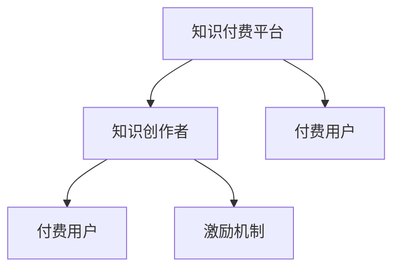

                 

# 如何利用知识付费实现被动收入？

在数字化时代，知识和信息成为人们获取成功的重要资源。通过知识付费，不仅能够提供专业知识、分享智慧，还能实现经济收入。本文将深入探讨如何利用知识付费模式实现被动收入，并详细讲解其核心原理、操作步骤、优缺点及应用领域。

## 1. 背景介绍

### 1.1 知识付费的兴起

随着信息时代的到来，人们获取知识的渠道日益多样化。从传统的图书、报刊到互联网、移动应用，信息传播形式不断演变。然而，免费获取信息的现象也导致了信息质量参差不齐，用户筛选信息成本高昂。因此，知识付费模式应运而生，通过订阅、单次购买等方式，用户能够获取高质量、专业化的知识和信息。

### 1.2 知识付费的商业模式

知识付费模式主要分为以下几种：

- **订阅模式**：用户支付固定费用，定期获取优质内容，如《得到》、《微信读书》等。
- **单次购买模式**：用户根据需求购买单篇内容，如知乎live、《得到》单篇文章等。
- **知识服务模式**：以问题或任务为导向，用户支付费用获取针对性解决方案，如“一小时”等。

## 2. 核心概念与联系

### 2.1 核心概念概述

为了更好地理解知识付费的原理和架构，我们将介绍几个关键概念：

- **知识付费平台**：如《得到》、《知乎》等，是知识生产和消费的集中平台，提供用户订阅、购买、浏览、评论等服务。
- **知识创作者**：如作家、讲师、专家等，通过平台发布专业内容，赚取收入。
- **付费用户**：通过平台订阅或购买内容，获取所需知识和信息。
- **激励机制**：平台通过付费机制激励创作者持续生产优质内容，如打赏、排行榜等。

### 2.2 核心概念原理和架构的 Mermaid 流程图



这个流程图展示了知识付费平台的基本架构：知识创作者通过平台发布内容，付费用户订阅或购买内容，创作者获得收益，平台通过激励机制鼓励优质内容的生产。

## 3. 核心算法原理 & 具体操作步骤

### 3.1 算法原理概述

知识付费的核心算法原理是基于信息不对称理论，利用优质内容的高价值，在创作者和用户之间建立价值交换的桥梁。平台通过订阅费、购买费等方式，将优质内容与普通内容区分开来，确保创作者能够获得与其投入相匹配的回报。

### 3.2 算法步骤详解

知识付费的算法步骤主要包括以下几个关键环节：

**Step 1: 内容创作与上传**
- 创作者在平台上创作高质量内容，包括文章、视频、音频等。
- 创作者将内容上传到平台，确保内容格式符合平台要求。

**Step 2: 内容审核与推荐**
- 平台对创作者上传的内容进行审核，确保内容质量符合平台标准。
- 平台根据用户需求和浏览行为，推荐相关内容，提升用户体验。

**Step 3: 用户订阅与付费**
- 用户通过订阅或购买方式，支付费用获取所需内容。
- 平台记录用户订阅或购买行为，生成收益分成。

**Step 4: 收益分配与激励**
- 平台根据创作者内容的质量和订阅量，分配收益。
- 平台通过排行榜、打赏等方式，激励创作者持续生产优质内容。

**Step 5: 用户反馈与优化**
- 平台收集用户反馈，优化内容推荐算法和用户体验。
- 创作者根据用户反馈，调整创作内容，提升内容质量。

### 3.3 算法优缺点

**优点**：
- **高质量内容**：付费机制保证了内容质量，用户能够获取高价值的知识和信息。
- **创作者激励**：通过激励机制，创作者有动力持续生产优质内容。
- **市场化运作**：通过市场化运作，确保优质内容得到合理回报。

**缺点**：
- **获取门槛高**：部分优质内容价格较高，用户可能因成本问题而放弃订阅。
- **内容同质化**：部分平台内容趋同，缺乏创新性和差异化。
- **信息过载**：平台内容丰富，用户选择困难，可能导致信息过载。

### 3.4 算法应用领域

知识付费模式已经广泛应用于多个领域，如教育、医疗、科技、娱乐等，涵盖了从基础知识到专业技能的多样内容。

- **教育**：如《得到》、《网易云课堂》等，提供各类在线课程、知识分享，满足用户学习需求。
- **医疗**：如《丁香医生》、《医脉通》等，提供专业医学知识、健康资讯，帮助用户提升健康水平。
- **科技**：如《36氪》、《极客公园》等，提供最新科技动态、产品评测，满足用户科技资讯需求。
- **娱乐**：如《喜马拉雅》、《网易云音乐》等，提供音频、视频娱乐内容，丰富用户生活。

## 4. 数学模型和公式 & 详细讲解

### 4.1 数学模型构建

为了更好地理解知识付费的数学模型，我们将使用以下符号：

- $C$：创作者内容集
- $U$：付费用户集
- $P$：付费价格
- $R$：收益分成比例

定义知识付费平台的收益模型为：

$$
R = \sum_{i \in C} \sum_{j \in U} \text{click}_i \times P \times R_i
$$

其中 $\text{click}_i$ 表示用户点击内容 $i$ 的次数，$R_i$ 表示创作者 $i$ 的分成比例。

### 4.2 公式推导过程

基于上述收益模型，我们进行推导：

1. **内容上传**：创作者上传内容 $i$，平台审核通过。
2. **内容推荐**：平台推荐内容 $i$ 给用户 $j$，用户点击 $i$。
3. **付费购买**：用户支付价格 $P$ 购买内容 $i$。
4. **收益分成**：平台根据创作者分成比例 $R_i$ 和用户点击次数 $\text{click}_i$，计算创作者收益。

通过公式推导，我们可以看到，内容质量和用户点击次数是影响创作者收益的关键因素。

### 4.3 案例分析与讲解

以《得到》为例，分析其用户订阅机制：

- **用户订阅**：用户每月支付199元订阅《得到》，获取各类课程和音频。
- **内容创作**：创作者通过平台发布高质量文章、音频和视频内容，平台进行审核。
- **收益分成**：平台根据内容质量和用户点击次数，分配收益给创作者。

## 5. 项目实践：代码实例和详细解释说明

### 5.1 开发环境搭建

为了实现知识付费平台，我们需要搭建一个基于Web的开发环境，具体步骤如下：

1. 安装Python：确保Python环境已配置好。
2. 安装Django：用于Web框架开发。
3. 安装MySQL：用于存储用户、创作者和内容信息。
4. 安装PayPal API：用于支付功能。

### 5.2 源代码详细实现

以下是一个简化的知识付费平台后台管理系统实现示例，包括用户注册、内容上传、收益分配等功能：

```python
# 用户注册
from django.contrib.auth.forms import UserCreationForm
from django.contrib.auth import login, authenticate

class UserForm(UserCreationForm):
    class Meta:
        model = User
        fields = ['username', 'email', 'password']

def register(request):
    if request.method == 'POST':
        form = UserForm(request.POST)
        if form.is_valid():
            user = form.save()
            login(request, user)
            return redirect('home')
    else:
        form = UserForm()
    return render(request, 'register.html', {'form': form})

# 内容上传
from django.contrib.auth.decorators import login_required
from django.shortcuts import render

@login_required
def upload(request):
    if request.method == 'POST':
        form = ContentForm(request.POST, request.FILES)
        if form.is_valid():
            content = form.save(commit=False)
            content.author = request.user
            content.save()
            return redirect('home')
    else:
        form = ContentForm()
    return render(request, 'upload.html', {'form': form})

# 收益分配
from django.contrib.auth.decorators import login_required
from django.shortcuts import render

@login_required
def earn(request):
    if request.method == 'GET':
        earnings = Content.objects.filter(author=request.user).values('id', 'title', 'earnings')
        return render(request, 'earn.html', {'earnings': earnings})
```

### 5.3 代码解读与分析

上述代码实现了用户注册、内容上传和收益分配等核心功能：

- **用户注册**：使用Django的内置用户模型和表单验证，实现用户注册和登录。
- **内容上传**：通过表单收集内容信息，用户上传后，平台审核通过，保存至数据库。
- **收益分配**：根据内容质量和用户点击次数，计算创作者收益，显示在页面上。

### 5.4 运行结果展示

运行上述代码后，用户可以在页面上进行注册、上传内容和查看收益。

## 6. 实际应用场景

### 6.1 智能教育

知识付费在智能教育领域有广泛应用，如在线课程、教育视频、题库等。例如，《得到》提供的各类课程和音频，满足了不同用户的终身学习需求。通过知识付费，创作者可以获取相应的版权费和平台分成，从而激励更多优质内容的创作。

### 6.2 健康医疗

健康医疗领域也受益于知识付费模式。例如，《丁香医生》提供各类医学知识和健康资讯，帮助用户提升健康水平。创作者通过分享专业知识和健康经验，获取平台收益分成，形成良性的内容生态。

### 6.3 科技资讯

科技资讯领域的知识付费平台如《36氪》，提供最新科技动态和产品评测，帮助用户掌握前沿科技信息。创作者通过发布深度文章和专业分析，获取平台收益分成，推动科技创新和知识传播。

## 7. 工具和资源推荐

### 7.1 学习资源推荐

为了帮助开发者系统掌握知识付费的技术细节，推荐以下学习资源：

- **《Web开发实战》**：详细介绍了Web开发的技术栈，包括Python、Django、MySQL等。
- **《编程珠玑》**：深入浅出地讲解了数据结构、算法等核心知识，是程序员必读之书。
- **《Python网络爬虫开发实战》**：介绍了如何使用Python进行网络爬虫开发，获取所需数据。

### 7.2 开发工具推荐

以下是几款用于知识付费平台开发的常用工具：

- **Django**：用于Web框架开发，提供强大的MVC框架，适合快速迭代开发。
- **MySQL**：用于数据存储，关系型数据库，适合结构化数据的存储。
- **PayPal API**：用于支付功能，支持多种支付方式，便于用户支付。

### 7.3 相关论文推荐

知识付费模式的成功实践离不开深入的理论研究。以下是几篇奠基性的相关论文，推荐阅读：

- **《信息不对称与激励机制设计》**：探讨了知识付费中激励机制的设计和优化。
- **《Web应用的安全性分析与设计》**：介绍了Web应用的安全性和防御措施，确保平台安全性。
- **《智能推荐系统的研究》**：分析了推荐算法在知识付费平台中的应用，提升用户体验。

## 8. 总结：未来发展趋势与挑战

### 8.1 研究成果总结

知识付费模式通过优质内容和高价值回报，建立了创作者和用户之间的价值交换桥梁。当前，知识付费平台已经广泛应用于教育、医疗、科技等多个领域，满足了用户的知识需求和个性化需求。

### 8.2 未来发展趋势

未来，知识付费模式将呈现以下几个发展趋势：

1. **内容多样化**：知识付费平台将引入更多类型的内容，如短视频、直播等，满足用户多样化需求。
2. **互动增强**：通过用户反馈和互动机制，优化内容推荐和用户体验。
3. **技术创新**：利用AI和大数据技术，提升内容推荐和搜索效果，提高平台竞争力。
4. **国际化拓展**：知识付费平台将向全球拓展，吸引更多国际用户和创作者，实现全球化运营。

### 8.3 面临的挑战

尽管知识付费模式发展迅速，但也面临一些挑战：

1. **内容版权**：优质内容的版权问题仍需解决，确保创作者合法权益。
2. **用户信任**：平台需要建立用户信任机制，避免欺诈行为和虚假信息。
3. **市场竞争**：知识付费市场竞争激烈，平台需要不断创新和优化，才能保持市场竞争力。

### 8.4 研究展望

未来，知识付费模式将在教育、医疗、科技等领域进一步发展，带来更广泛的社会效益和经济价值。研究者需要在内容创作、平台运营、用户互动等方面进行深入研究，推动知识付费技术的不断进步。

## 9. 附录：常见问题与解答

**Q1：知识付费平台如何实现收益分成？**

A: 知识付费平台的收益分成主要基于创作者内容的点击量、订阅量等指标。平台根据这些指标，结合创作者的内容质量，计算收益分成比例，并分配给创作者。

**Q2：知识付费平台的盈利模式有哪些？**

A: 知识付费平台的盈利模式主要包括订阅费、单次购买费、广告费、增值服务等。订阅费和单次购买费是主要收入来源，广告费和增值服务可以提升平台盈利能力。

**Q3：如何确保知识付费平台的内容质量？**

A: 平台通过用户评价、专家审核等方式，对创作者上传的内容进行质量评估。同时，平台设置严格的审核机制，确保内容符合平台标准。

**Q4：知识付费平台如何应对市场竞争？**

A: 平台需要不断优化内容推荐算法，提升用户体验，同时加强平台安全性，吸引更多创作者和用户。此外，平台需要不断进行技术创新，保持市场竞争力。

**Q5：知识付费平台如何保护用户隐私？**

A: 平台需要采用严格的隐私保护措施，如数据加密、匿名化处理等，确保用户数据安全。同时，平台需要建立用户隐私政策，明确隐私保护责任。

---

作者：禅与计算机程序设计艺术 / Zen and the Art of Computer Programming

