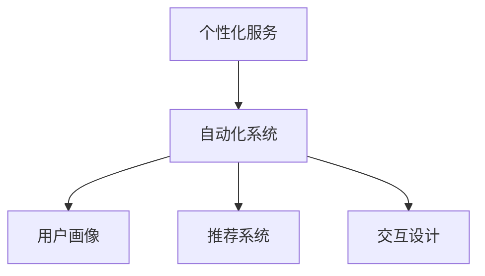

                 

# 如何在自动化创业中实现个性化服务

## 1. 背景介绍

在现代商业环境中，个性化服务已经成为企业获取竞争优势的重要手段。通过深入了解客户需求，并提供针对性的解决方案，企业能够提高客户满意度，增加客户粘性，从而实现业务的持续增长。特别是在自动化创业领域，通过引入个性化服务，可以在自动化流程中注入更多人性化关怀，提升用户体验，赢得更多客户信任。

### 1.1 问题由来
随着人工智能和自动化技术的不断发展，自动化创业领域出现了许多自动化解决方案，如自动客服、自动化设计、自动化营销等。这些方案虽然大幅提升了效率，但往往缺乏个性化特征，难以满足不同用户的需求。例如，自动客服系统对客户的提问往往无法提供满意的答案，自动化设计工具生成的模板可能无法满足特定客户的审美要求，自动化营销的单一化策略可能无法精准触达目标客户群体。

### 1.2 问题核心关键点
个性化服务的核心在于通过分析用户的行为、偏好、历史数据等，提供定制化的产品和服务，实现更高的用户满意度和转化率。在自动化创业中实现个性化服务，主要面临以下挑战：
1. 如何高效收集和处理用户数据，构建完备的用户画像。
2. 如何基于用户画像，动态生成个性化的产品推荐、营销策略等。
3. 如何在自动化系统中注入个性化的交互元素，提升用户体验。

### 1.3 问题研究意义
实现个性化服务不仅可以提升自动化创业的成功率，还能为企业带来更大的商业价值。具体而言：
1. 提高用户满意度。个性化服务能够精准满足用户需求，增强用户的忠诚度和信任感。
2. 增加用户粘性。通过提供量身定制的体验，用户更愿意长期使用企业提供的服务。
3. 促进转化率。个性化的推荐和营销策略能够提高用户购买意愿，增加销售收入。
4. 降低运营成本。自动化技术可以提高工作效率，减少人力成本，同时通过个性化服务提高转化率，进一步降低企业整体的运营成本。

## 2. 核心概念与联系

### 2.1 核心概念概述

为更好地理解如何在自动化创业中实现个性化服务，本节将介绍几个关键概念及其相互联系：

- **个性化服务(Personalized Service)**：指针对特定用户或用户群，提供量身定制的产品或服务，以提升用户满意度和忠诚度。
- **自动化系统(Automated System)**：指通过人工智能技术实现的部分或全部自动化流程，如自动客服、自动化设计、自动化营销等。
- **用户画像(User Profile)**：通过分析用户的行为、偏好、历史数据等，构建的个性化用户画像，用于指导个性化服务的生成。
- **推荐系统(Recommendation System)**：基于用户画像，动态生成个性化的产品推荐、营销策略等，提升用户体验。
- **交互设计(Interactive Design)**：在自动化系统中注入个性化的交互元素，如自定义回复、动态生成内容等，提升用户体验。

这些核心概念之间的逻辑关系可以通过以下Mermaid流程图来展示：



这个流程图展示了个性化服务在自动化系统中的实现逻辑：

1. 通过自动化系统收集用户数据，构建用户画像。
2. 基于用户画像，生成个性化的推荐和交互内容。
3. 通过个性化推荐和交互设计，提升用户体验。

## 3. 核心算法原理 & 具体操作步骤
### 3.1 算法原理概述

实现个性化服务的核心在于构建一个强大的推荐系统和交互设计框架。通过这些系统，能够根据用户的个性化需求，动态生成个性化的内容和交互方式，提升用户体验。

具体而言，推荐系统需要综合分析用户的历史行为数据、偏好、兴趣等因素，动态生成推荐结果。交互设计则需要根据推荐结果，生成个性化的回复、提示、界面等，提升用户的互动体验。

### 3.2 算法步骤详解

实现个性化服务主要包括以下几个步骤：

**Step 1: 数据收集与用户画像构建**
- 收集用户的浏览、购买、点击、搜索等行为数据，形成用户的历史行为记录。
- 分析用户数据，构建用户画像，包括用户的兴趣、偏好、需求等信息。

**Step 2: 推荐系统开发**
- 选择合适的推荐算法，如协同过滤、基于内容的推荐、混合推荐等。
- 将用户画像输入推荐算法，生成个性化推荐结果。
- 根据推荐结果，动态生成个性化的产品、广告、内容等。

**Step 3: 交互设计实现**
- 设计个性化的交互界面和交互流程，提升用户体验。
- 根据用户的操作反馈，动态调整交互设计，实现动态生成。

**Step 4: 用户反馈收集与优化**
- 收集用户对个性化服务的反馈，不断优化推荐算法和交互设计。
- 引入机器学习模型，对用户画像和推荐系统进行迭代优化，提升个性化服务的准确性和用户体验。

### 3.3 算法优缺点

实现个性化服务的方法具有以下优点：
1. 提升用户体验。通过个性化的推荐和交互设计，提升用户的满意度和粘性。
2. 增加转化率。个性化的推荐能够精准触达用户，提高用户购买意愿。
3. 降低运营成本。自动化系统可以提高工作效率，减少人力成本。

同时，该方法也存在一些局限性：
1. 数据隐私问题。个性化服务的实现需要大量用户数据，可能涉及用户隐私问题。
2. 数据质量要求高。推荐系统和交互设计的效果很大程度上取决于数据的质量和准确性。
3. 技术复杂度高。实现个性化服务需要多维度的数据处理和算法优化，技术难度较大。

尽管存在这些局限性，但个性化服务仍然是大规模自动化创业项目中不可或缺的一环。通过不断优化数据处理和算法模型，个性化服务的实现将逐渐变得更加高效和精确。

### 3.4 算法应用领域

个性化服务的实现方法可以应用于多个自动化创业领域，例如：

- **自动化客服**：根据用户的历史咨询记录和偏好，生成个性化的回复和建议，提升用户满意度。
- **自动化设计**：根据用户的审美偏好和需求，动态生成个性化的设计方案，提高用户接受度。
- **自动化营销**：基于用户画像，动态生成个性化的广告和推荐，提升广告转化率。
- **智能推荐系统**：如电商平台、视频网站等，根据用户的行为和兴趣，动态生成个性化推荐，提升用户体验。

这些应用场景展示了个性化服务在自动化创业中的广泛适用性，为提升自动化系统的用户体验和业务价值提供了重要手段。

## 4. 数学模型和公式 & 详细讲解 & 举例说明

### 4.1 数学模型构建

在推荐系统中，常用的数学模型包括协同过滤模型、基于内容的推荐模型、混合推荐模型等。以下以协同过滤模型为例，介绍其构建过程。

设用户集合为 $U$，物品集合为 $I$，用户 $u$ 对物品 $i$ 的评分记为 $r_{ui}$。协同过滤模型的目标是通过用户 $u$ 和物品 $i$ 的评分，推断出用户 $u$ 对物品 $i$ 的评分 $r_{ui}$。常用的协同过滤算法有基于用户的协同过滤和基于物品的协同过滤。

基于用户的协同过滤模型假设用户 $u$ 和物品 $i$ 的评分 $r_{ui}$ 可以表示为用户 $u$ 对物品 $i$ 的评分 $r_{ui}$ 和用户 $u$ 对物品 $j$ 的评分 $r_{uj}$ 的加权平均值。即：

$$
r_{ui} \approx \sum_{j \in I} \alpha_{ji} r_{uj}
$$

其中 $\alpha_{ji}$ 为物品 $i$ 对物品 $j$ 的相似度权重。

### 4.2 公式推导过程

对于基于用户的协同过滤模型，其推导过程如下：

设用户 $u$ 和物品 $i$ 的评分矩阵为 $R_{ui}$，物品 $i$ 和物品 $j$ 的相似度矩阵为 $S_{ij}$，物品 $j$ 对物品 $i$ 的评分矩阵为 $R_{ji}$。则协同过滤模型的目标是最小化预测评分与真实评分之间的误差，即：

$$
\min_{\alpha_{ij}} \sum_{u \in U} \sum_{i \in I} (r_{ui} - \sum_{j \in I} \alpha_{ji} r_{uj})^2
$$

将上述目标函数分解为两部分：

$$
\begin{aligned}
\min_{\alpha_{ij}} & \sum_{u \in U} \sum_{i \in I} (r_{ui} - \sum_{j \in I} \alpha_{ji} r_{uj})^2 \\
& = \sum_{u \in U} \sum_{i \in I} (r_{ui} - \alpha_{ii} r_{ui} - \sum_{j \neq i} \alpha_{ji} r_{uj})^2 \\
& = \sum_{u \in U} \sum_{i \in I} ((1 - \alpha_{ii}) r_{ui} - \sum_{j \neq i} \alpha_{ji} r_{uj})^2 \\
\end{aligned}
$$

设 $S_{ii} = 1 - \alpha_{ii}$，则有：

$$
\begin{aligned}
\min_{\alpha_{ij}} & \sum_{u \in U} \sum_{i \in I} ((1 - \alpha_{ii}) r_{ui} - \sum_{j \neq i} \alpha_{ji} r_{uj})^2 \\
& = \sum_{u \in U} \sum_{i \in I} ((S_{ii} r_{ui} - \sum_{j \neq i} \alpha_{ji} r_{uj})^2 \\
\end{aligned}
$$

对上式求偏导数，得到：

$$
\frac{\partial}{\partial \alpha_{ji}} \sum_{u \in U} \sum_{i \in I} ((S_{ii} r_{ui} - \sum_{j \neq i} \alpha_{ji} r_{uj})^2) = 0
$$

化简得到：

$$
\alpha_{ji} = \frac{\sum_{u \in U} (r_{uj} - \alpha_{ju} r_{ui}) \cdot S_{ju}}{\sum_{u \in U} S_{ju}^2}
$$

其中 $\alpha_{ju} = S_{ju} / S_{ii}$，$S_{ju} = 1 - \alpha_{ju}$。

通过上述推导，我们得到了协同过滤模型中物品 $i$ 对物品 $j$ 的相似度权重 $\alpha_{ji}$ 的计算公式，基于此可以进行协同过滤算法的迭代优化，实现个性化推荐。

### 4.3 案例分析与讲解

以一个简单的电商推荐系统为例，分析如何通过协同过滤模型实现个性化推荐。

假设我们有一个电商网站，有100个用户 $U = \{u_1, u_2, \ldots, u_{100}\}$ 和1000个商品 $I = \{i_1, i_2, \ldots, i_{1000}\}$，每个用户对商品的评分矩阵 $R_{ui} \in [1, 5]$，表示用户 $u$ 对商品 $i$ 的评分。设物品 $i$ 和物品 $j$ 的相似度矩阵 $S_{ij}$ 为：

$$
S_{ij} = \frac{1}{\sqrt{d_i} + \sqrt{d_j}}
$$

其中 $d_i$ 和 $d_j$ 分别为物品 $i$ 和物品 $j$ 的维度。

我们希望通过协同过滤模型，为用户 $u$ 推荐其可能感兴趣的商品。设用户 $u$ 对商品 $i$ 的预测评分 $r_{ui}^{\prime}$ 为：

$$
r_{ui}^{\prime} = \alpha_{ii} r_{ui} + \sum_{j \neq i} \alpha_{ji} r_{uj}
$$

其中 $\alpha_{ji}$ 为物品 $i$ 对物品 $j$ 的相似度权重，根据公式 $4.2$ 计算得到。

根据上述模型和计算公式，我们可以通过迭代优化协同过滤模型，不断调整 $\alpha_{ji}$，实现个性化推荐。

## 5. 项目实践：代码实例和详细解释说明

### 5.1 开发环境搭建

在实现个性化服务时，首先需要搭建开发环境，安装必要的依赖库。

1. 安装Python环境：从官网下载并安装Anaconda，用于创建独立的Python环境。

2. 创建并激活虚拟环境：
```bash
conda create -n personalized-env python=3.8 
conda activate personalized-env
```

3. 安装必要的库：
```bash
pip install pandas numpy scikit-learn numpy matplotlib jupyter notebook ipython
```

4. 安装推荐系统库：
```bash
pip install lightfm pyjoblib
```

5. 安装交互设计库：
```bash
pip install jinja2 django
```

完成上述步骤后，即可在 `personalized-env` 环境中开始项目实践。

### 5.2 源代码详细实现

以下是一个简单的电商推荐系统代码实现，使用协同过滤算法进行个性化推荐：

```python
import pandas as pd
import numpy as np
import lightfm as lf
from lightfm import datasets

# 数据预处理
data_path = 'sales_data.csv'
train_data = datasets.load_data(data_path, 'train')
test_data = datasets.load_data(data_path, 'test')

# 将评分矩阵转换为稀疏矩阵
train_data.set_labels(labels='rating')
train_data.normalize()
test_data.set_labels(labels='rating')
test_data.normalize()

# 训练协同过滤模型
model = lf.SVD(train_data)
model.fit(num_epochs=100, num_factors=100)

# 预测测试集评分
test_preds = model.predict(test_data)

# 获取推荐商品列表
top_n = 10
recommendations = model.get_top_items(test_data, top_n)

# 生成推荐商品列表
recommend_list = [item[0] for item in recommendations]
recommend_list.sort(key=lambda x: x[1], reverse=True)

# 生成推荐商品的界面
from django.shortcuts import render
from django.http import HttpResponse

def recommend(request):
    return HttpResponse(recommend_list)
```

在上述代码中，我们首先通过 `lightfm` 库加载电商销售数据，并进行数据预处理。然后使用协同过滤算法 `SVD` 训练模型，并进行预测。最后通过 `django` 生成推荐商品的界面，展示个性化推荐结果。

### 5.3 代码解读与分析

让我们再详细解读一下关键代码的实现细节：

**数据预处理**：
- 使用 `lightfm` 库的 `datasets` 模块加载数据集。
- 使用 `normalize` 方法将评分矩阵转换为稀疏矩阵，以减少计算量。

**协同过滤模型训练**：
- 使用 `lightfm` 库的 `SVD` 方法训练协同过滤模型。
- `num_epochs` 参数指定模型训练的轮数，`num_factors` 参数指定模型维度。

**预测测试集评分**：
- 使用训练好的模型 `model` 对测试集进行评分预测，生成预测结果 `test_preds`。

**生成推荐商品列表**：
- 使用 `get_top_items` 方法获取推荐商品列表 `recommendations`。
- 将推荐商品列表按评分排序，生成推荐商品列表 `recommend_list`。

**生成推荐商品的界面**：
- 使用 `django` 框架生成推荐商品的界面。
- 调用 `recommend` 方法，返回推荐商品列表 `recommend_list`。

通过上述代码实现，我们可以看到，通过协同过滤算法，可以高效实现个性化推荐。利用 `lightfm` 库的强大功能，我们能够快速搭建起推荐系统，并进行训练和预测。结合 `django` 框架，可以方便地将推荐结果展示给用户，提升用户体验。

## 6. 实际应用场景

### 6.1 智能客服系统

在智能客服系统中，可以通过个性化服务，提升用户满意度。例如，智能客服系统可以根据用户的历史咨询记录和偏好，生成个性化的回复和建议，提高用户满意度和粘性。

具体而言，可以收集用户的历史咨询记录，包括用户的咨询时间、咨询内容、咨询结果等信息。然后，通过分析这些数据，构建用户的咨询画像，包括用户的咨询偏好、常见问题等。最后，根据用户画像，生成个性化的回复和建议，提升用户满意度和粘性。

### 6.2 个性化推荐系统

在电商领域，个性化推荐系统是提高销售转化率的重要手段。通过个性化服务，可以更好地满足用户的购物需求，提高用户购买意愿。

具体而言，可以收集用户的历史购买记录、浏览行为、搜索关键词等数据，构建用户画像。然后，根据用户画像，生成个性化的商品推荐和营销策略，提升用户购买意愿。例如，针对经常购买运动鞋的用户，可以推荐更多运动相关商品，如运动服、运动包等，同时提供相关的优惠活动，提高用户购买意愿。

### 6.3 个性化设计系统

在自动化设计领域，个性化服务可以通过用户画像，生成个性化的设计方案，提高用户接受度。

具体而言，可以收集用户的审美偏好、设计风格、历史设计记录等数据，构建用户画像。然后，根据用户画像，生成个性化的设计方案，满足用户的个性化需求。例如，对于喜欢简约风格的用户，可以生成简约风格的设计方案，同时提供相关的设计建议，提升用户满意度。

### 6.4 未来应用展望

随着个性化服务技术的发展，未来将在更多领域得到应用，为传统行业带来变革性影响。

在智慧医疗领域，个性化服务可以通过分析患者的健康数据，生成个性化的诊疗方案，提高诊疗效果。在教育领域，个性化服务可以通过分析学生的学习数据，生成个性化的学习方案，提高学习效果。在智慧城市治理中，个性化服务可以通过分析市民的反馈数据，生成个性化的公共服务方案，提高市民满意度。

此外，在企业生产、社会治理、文娱传媒等众多领域，个性化服务也将不断涌现，为NLP技术带来全新的突破。相信随着技术的不断演进，个性化服务将逐渐成为自动化创业项目中不可或缺的一环，推动人工智能技术在各领域的普及和应用。

## 7. 工具和资源推荐

### 7.1 学习资源推荐

为了帮助开发者系统掌握个性化服务的理论基础和实践技巧，这里推荐一些优质的学习资源：

1. **《个性化推荐系统》**：这是一本经典的书，详细介绍了推荐系统的发展历程、理论基础和实际应用，是推荐系统领域的入门必备。
2. **《机器学习实战》**：这本书介绍了机器学习算法的基本原理和实践方法，适合初学者入门。
3. **Coursera的机器学习课程**：由斯坦福大学开设，涵盖机器学习的基本概念和经典算法，适合进阶学习。
4. **Kaggle的推荐系统竞赛**：通过参与竞赛，可以实践推荐系统的算法，积累实际经验。
5. **《Python推荐系统》**：这本书介绍了推荐系统在Python中的实现方法，适合编程实践。

通过这些资源的学习实践，相信你一定能够快速掌握个性化服务的精髓，并用于解决实际的自动化创业问题。

### 7.2 开发工具推荐

高效的开发离不开优秀的工具支持。以下是几款用于个性化服务开发的常用工具：

1. **Python**：作为一种通用的编程语言，Python拥有丰富的开源库和工具，适合推荐系统开发。
2. **LightFM**：一个用于推荐系统的Python库，提供了协同过滤、矩阵分解等推荐算法。
3. **Jinja2**：一个模板引擎，可以方便地生成个性化的推荐商品界面。
4. **Django**：一个基于Python的Web框架，可以方便地生成推荐商品的界面。

合理利用这些工具，可以显著提升个性化服务的开发效率，加快创新迭代的步伐。

### 7.3 相关论文推荐

个性化服务的发展源于学界的持续研究。以下是几篇奠基性的相关论文，推荐阅读：

1. **《协同过滤算法综述》**：一篇经典的协同过滤算法综述，介绍了协同过滤算法的理论基础和实际应用。
2. **《基于内容的推荐系统》**：介绍了基于内容的推荐系统的理论基础和实际应用。
3. **《混合推荐系统》**：介绍了混合推荐系统的理论基础和实际应用，综合了多种推荐算法。

这些论文代表了大规模个性化服务的理论前沿，通过学习这些前沿成果，可以帮助研究者把握学科前进方向，激发更多的创新灵感。

## 8. 总结：未来发展趋势与挑战

### 8.1 研究成果总结

本文对个性化服务在自动化创业中的实现方法进行了全面系统的介绍。首先，阐述了个性化服务的核心思想和重要意义，明确了个性化服务在自动化创业中的关键作用。其次，从原理到实践，详细讲解了个性化服务的构建过程，包括数据收集、用户画像构建、推荐系统开发和交互设计实现。同时，本文还广泛探讨了个性化服务在多个自动化创业领域的应用前景，展示了个性化服务在提升用户体验和业务价值方面的强大能力。最后，本文精选了个性化服务的各类学习资源，力求为读者提供全方位的技术指引。

通过本文的系统梳理，可以看到，个性化服务在自动化创业中具有重要的战略意义。实现个性化服务不仅可以提升用户体验，增加用户粘性，还可以提高业务转化率，降低运营成本。未来，随着技术的不断进步，个性化服务将逐渐成为自动化创业项目中不可或缺的一环，推动人工智能技术在各领域的普及和应用。

### 8.2 未来发展趋势

展望未来，个性化服务技术将呈现以下几个发展趋势：

1. **数据规模不断扩大**：随着数据的不断积累，个性化服务的实现将更加高效、准确。通过大数据技术，可以进一步提升数据的质量和多样性，从而提高个性化服务的准确性和用户体验。
2. **推荐算法不断优化**：未来的推荐算法将更加复杂和智能，能够更好地理解用户的复杂需求和行为模式，提升个性化服务的精准度。
3. **用户画像更加全面**：未来的用户画像将不仅包括行为数据，还包括情感数据、生理数据等，通过多维度的数据融合，提升个性化服务的个性化程度。
4. **跨领域融合发展**：未来的个性化服务将不仅仅局限于单一领域，而是通过跨领域融合，实现更加全面的个性化服务。例如，结合医疗、教育、金融等领域的数据，提供更加综合的个性化服务。
5. **智能化程度不断提高**：未来的个性化服务将更加智能化，通过引入机器学习、深度学习等技术，提升个性化服务的智能化水平，实现更高效、更精准的个性化服务。

以上趋势展示了个性化服务在未来的广阔前景，相信随着技术的不断发展，个性化服务将逐渐成为自动化创业项目中不可或缺的一环，推动人工智能技术在各领域的普及和应用。

### 8.3 面临的挑战

尽管个性化服务已经取得了瞩目成就，但在迈向更加智能化、普适化应用的过程中，它仍面临着诸多挑战：

1. **数据隐私问题**：个性化服务的实现需要大量用户数据，可能涉及用户隐私问题。如何在保护用户隐私的同时，实现个性化服务，是一个重要挑战。
2. **数据质量要求高**：推荐系统和交互设计的效果很大程度上取决于数据的质量和准确性。如何在处理噪声数据和缺失数据的同时，提升个性化服务的质量，是一个关键问题。
3. **技术复杂度高**：实现个性化服务需要多维度的数据处理和算法优化，技术难度较大。如何在提升模型精度的同时，降低技术复杂度，是一个重要挑战。
4. **用户接受度问题**：个性化服务需要用户主动参与数据收集和反馈，如何提升用户的接受度和参与度，是一个关键问题。
5. **动态性要求高**：个性化服务需要根据用户的行为和反馈不断调整，如何实现实时动态更新，是一个关键问题。

正视个性化服务面临的这些挑战，积极应对并寻求突破，将是个性化服务技术走向成熟的必由之路。相信随着学界和产业界的共同努力，这些挑战终将一一被克服，个性化服务必将在构建人机协同的智能时代中扮演越来越重要的角色。

### 8.4 研究展望

面对个性化服务面临的种种挑战，未来的研究需要在以下几个方面寻求新的突破：

1. **数据隐私保护**：引入隐私保护技术，如差分隐私、联邦学习等，保护用户隐私。同时加强用户数据的使用规范和监管，确保用户数据的合法合规使用。
2. **推荐系统优化**：开发更加高效、精准的推荐算法，如基于深度学习的推荐系统，提升个性化服务的精度和实时性。
3. **交互设计优化**：引入更加人性化的交互设计，提升用户的参与度和满意度。例如，通过智能客服系统，提供更加自然、流畅的对话交互。
4. **跨领域融合**：结合多领域数据，实现更加全面、精准的个性化服务。例如，结合医疗、教育、金融等领域的数据，提供更加综合的个性化服务。
5. **动态优化**：引入实时动态优化技术，如强化学习、在线学习等，实现个性化服务的实时优化。

这些研究方向的探索，必将引领个性化服务技术迈向更高的台阶，为构建安全、可靠、可解释、可控的智能系统铺平道路。面向未来，个性化服务技术还需要与其他人工智能技术进行更深入的融合，如知识表示、因果推理、强化学习等，多路径协同发力，共同推动自然语言理解和智能交互系统的进步。只有勇于创新、敢于突破，才能不断拓展个性化服务的边界，让智能技术更好地造福人类社会。

## 9. 附录：常见问题与解答

**Q1：如何高效收集和处理用户数据，构建完备的用户画像？**

A: 高效收集和处理用户数据，构建完备的用户画像，是实现个性化服务的核心。具体而言，可以采用以下方法：

1. **数据收集**：通过用户的浏览行为、购买记录、搜索关键词等数据，获取用户的兴趣、偏好和需求等信息。
2. **数据清洗**：去除噪声数据和缺失数据，保证数据的准确性和完整性。
3. **特征提取**：将用户数据转换为特征向量，提取用户画像的关键特征，如用户的历史行为、兴趣偏好、情感状态等。
4. **用户画像构建**：通过聚类、分类等方法，构建用户画像，包括用户的兴趣偏好、常见问题等。

**Q2：如何基于用户画像，动态生成个性化的产品推荐、营销策略等？**

A: 基于用户画像，动态生成个性化的产品推荐和营销策略，是实现个性化服务的重要手段。具体而言，可以采用以下方法：

1. **推荐算法**：选择合适的推荐算法，如协同过滤、基于内容的推荐、混合推荐等。
2. **个性化生成**：根据用户画像，生成个性化的推荐结果。例如，针对用户的兴趣偏好和需求，生成个性化的商品推荐。
3. **动态调整**：根据用户的操作反馈和行为变化，动态调整推荐算法和策略，提升个性化服务的精准度。

**Q3：如何在自动化系统中注入个性化的交互元素，提升用户体验？**

A: 在自动化系统中注入个性化的交互元素，提升用户体验，是实现个性化服务的核心。具体而言，可以采用以下方法：

1. **交互设计**：设计个性化的交互界面和交互流程，提升用户体验。例如，通过智能客服系统，提供更加自然、流畅的对话交互。
2. **动态生成**：根据用户的操作反馈和行为变化，动态生成个性化的回复和建议，提升用户的满意度。例如，针对用户的反馈，动态调整推荐结果和回复内容。
3. **用户体验优化**：通过A/B测试等方法，不断优化交互设计和用户界面，提升用户满意度。

通过上述方法，可以实现高效、精准的个性化服务，提升自动化系统的用户体验和业务价值。

---

作者：禅与计算机程序设计艺术 / Zen and the Art of Computer Programming

