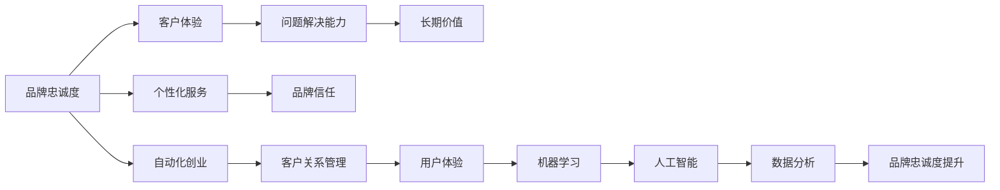

                 

# 如何在自动化创业中建立品牌忠诚度

> 关键词：品牌忠诚度, 自动化创业, 客户关系管理, 用户体验, 人工智能, 机器学习, 数据分析

## 1. 背景介绍

### 1.1 问题由来
随着技术的不断进步，自动化创业正在成为许多初创公司追求的新目标。它不仅能够提高效率、降低成本，还能提升产品和服务的质量。然而，在追求这些优势的同时，如何建立并保持品牌忠诚度成为了一个不可忽视的问题。品牌忠诚度不仅能带来长期的客户留存和重复购买，还能增强客户的信任和口碑传播。因此，了解如何在大规模自动化系统中建立品牌忠诚度变得尤为重要。

### 1.2 问题核心关键点
在自动化创业中，品牌忠诚度主要由以下几个因素决定：

- **客户体验**：自动化系统的用户体验是否流畅、便捷，直接影响客户的满意度和忠诚度。
- **个性化服务**：是否能够根据客户行为和偏好提供个性化的服务或推荐。
- **问题解决能力**：系统是否能够快速响应并解决客户问题，避免客户的沮丧和流失。
- **品牌信任**：自动化系统是否能够向客户证明其可靠性和安全性，增加客户信任。
- **长期价值**：系统是否能够持续创造价值，而不仅仅是提供一次性服务。

### 1.3 问题研究意义
建立品牌忠诚度对于自动化创业的成功至关重要。它不仅能提升客户保留率，还能减少新客户的获取成本，提高企业的市场竞争力。同时，良好的品牌忠诚度还能增强品牌声誉，吸引更多的潜在客户。因此，研究如何在自动化创业中建立品牌忠诚度，对初创公司来说具有重要的战略意义。

## 2. 核心概念与联系

### 2.1 核心概念概述

为了深入理解如何在自动化创业中建立品牌忠诚度，本文将介绍以下几个关键概念：

- **品牌忠诚度**：客户对品牌持续的偏爱和购买倾向。
- **自动化创业**：利用自动化技术构建和运营创业项目，提升效率和效果。
- **客户关系管理**：通过收集、分析和利用客户数据，建立和维护良好的客户关系。
- **用户体验**：客户在使用产品或服务时的感受和体验，直接关联品牌忠诚度。
- **机器学习**：利用数据训练模型，提升自动化系统的智能化水平。
- **人工智能**：通过模拟人类智能，实现更高级别的自动化和个性化服务。
- **数据分析**：对收集的数据进行深度分析，洞察客户行为和需求，指导业务决策。

这些概念之间存在着密切的联系，相互影响。品牌忠诚度的建立依赖于优秀的用户体验、个性化的服务、快速的问题解决、品牌信任的建立以及长期的客户价值创造。而这一切都需要通过自动化和人工智能技术来实现。

### 2.2 核心概念原理和架构的 Mermaid 流程图



## 3. 核心算法原理 & 具体操作步骤

### 3.1 算法原理概述

在自动化创业中建立品牌忠诚度的核心算法可以总结为以下步骤：

1. **数据收集**：通过各种渠道（如CRM系统、社交媒体、网站分析等）收集客户数据，包括行为数据、反馈数据和交互数据。
2. **数据分析**：利用机器学习、深度学习等技术对数据进行分析和建模，了解客户需求和行为模式。
3. **模型训练**：根据分析结果，构建推荐系统、个性化服务模型等，优化自动化系统的决策和输出。
4. **用户反馈**：收集用户对自动化系统的反馈，持续优化和改进。
5. **品牌塑造**：通过优化品牌形象、提升品牌价值等方式，增强客户对品牌的信任和忠诚度。

### 3.2 算法步骤详解

#### 3.2.1 数据收集
数据收集是品牌忠诚度建立的基础。以下是几种常见的数据收集方式：

1. **CRM系统**：利用客户关系管理系统收集客户的基本信息和行为数据，如购买记录、浏览历史、交互记录等。
2. **网站分析工具**：使用Google Analytics等工具，记录用户访问网站的行为，如页面浏览时间、跳出率等。
3. **社交媒体分析**：通过社交媒体平台收集用户评论、分享、点赞等行为数据，了解用户对品牌的看法和情感。
4. **客户反馈渠道**：通过在线调查、客服系统等渠道收集用户的直接反馈和意见。

#### 3.2.2 数据分析
数据分析是理解客户需求和行为模式的关键。以下是一些常见的数据分析方法：

1. **聚类分析**：通过将客户分成不同的群体，了解不同群体的行为特征和需求。
2. **关联规则分析**：找出客户行为之间的关联性，如购买某种产品的客户更可能购买其他产品。
3. **情感分析**：利用自然语言处理技术分析用户反馈中的情感倾向，了解用户对品牌的情感状态。
4. **预测建模**：利用机器学习算法，预测客户的未来行为和需求，指导自动化系统的决策。

#### 3.2.3 模型训练
模型训练是优化自动化系统性能的核心步骤。以下是一些常用的模型训练方法：

1. **推荐系统**：利用协同过滤、内容过滤等算法，向客户推荐他们可能感兴趣的产品或服务。
2. **个性化服务**：利用深度学习模型，根据客户的历史行为和偏好，提供个性化的推荐和建议。
3. **聊天机器人**：利用自然语言处理技术，训练聊天机器人与客户进行自然对话，解决客户问题。
4. **情感分析模型**：训练情感分析模型，识别客户反馈中的情感倾向，指导品牌管理。

#### 3.2.4 用户反馈
用户反馈是持续改进的重要来源。以下是一些常见的用户反馈收集和处理方式：

1. **在线调查**：通过问卷调查收集客户的意见和建议。
2. **客户服务**：通过客服系统记录客户的问题和解决方案，分析客户的需求和痛点。
3. **用户评价**：利用评价系统收集客户对产品和服务的评分和评论。
4. **数据分析**：通过分析用户行为数据和反馈数据，发现问题和改进点。

#### 3.2.5 品牌塑造
品牌塑造是增强客户信任和忠诚度的重要手段。以下是一些常见的品牌塑造方法：

1. **品牌形象设计**：通过视觉设计、产品设计等方式，提升品牌形象。
2. **品牌价值传递**：通过故事讲述、价值观传递等方式，增强客户的品牌认同感。
3. **品牌活动推广**：通过品牌活动、社区建设等方式，增强品牌影响力和客户互动。
4. **客户关系维护**：通过邮件营销、客户关怀等方式，保持与客户的持续互动。

### 3.3 算法优缺点

#### 3.3.1 优点
- **提升客户体验**：通过数据分析和个性化服务，提升客户的使用体验和满意度。
- **增加客户留存率**：通过推荐系统、忠诚度计划等方式，增加客户的留存率和复购率。
- **降低获客成本**：通过优化用户体验和品牌形象，减少新客户的获取成本。
- **提高客户忠诚度**：通过持续的客户关怀和品牌建设，增强客户的忠诚度和口碑传播。

#### 3.3.2 缺点
- **数据隐私问题**：客户数据的收集和分析可能涉及隐私问题，需要遵守相关的数据保护法规。
- **技术复杂度**：数据分析和模型训练需要一定的技术储备，可能对中小企业构成挑战。
- **成本投入**：品牌塑造和客户关系维护需要持续的投入和维护，可能对中小企业造成压力。
- **客户期望管理**：客户期望可能随着时间推移而变化，需要不断调整品牌和服务的策略。

### 3.4 算法应用领域

品牌忠诚度建立算法在以下几个领域有广泛的应用：

1. **电子商务**：通过个性化推荐、忠诚度计划等方式，提升客户体验和满意度。
2. **金融服务**：通过风险评估、智能投顾等方式，增强客户信任和忠诚度。
3. **医疗健康**：通过个性化治疗、健康管理等方式，提升客户粘性和满意度。
4. **旅游行业**：通过目的地推荐、行程定制等方式，增强客户体验和忠诚度。
5. **在线教育**：通过个性化课程推荐、学习数据分析等方式，提升客户满意度和忠诚度。

## 4. 数学模型和公式 & 详细讲解 & 举例说明

### 4.1 数学模型构建

品牌忠诚度的建立可以通过构建数学模型来进行量化和分析。以下是一个简化的数学模型：

设品牌忠诚度为 $L$，客户体验为 $E$，个性化服务为 $P$，问题解决能力为 $R$，品牌信任为 $T$，长期价值为 $V$。

$$ L = \alpha E + \beta P + \gamma R + \delta T + \epsilon V + \eta $$

其中，$\alpha, \beta, \gamma, \delta, \epsilon$ 为各因素的影响系数，$\eta$ 为误差项。

### 4.2 公式推导过程

在上述模型中，每个因素的评分可以量化为 $0$ 到 $1$ 之间的数值，表示客户对该因素的满意程度。通过收集客户反馈数据，计算每个因素的平均评分，代入公式进行计算，即可得到品牌忠诚度的得分。

### 4.3 案例分析与讲解

以电子商务为例，以下是具体的计算过程：

1. **数据收集**：通过CRM系统收集客户的基本信息和行为数据，如购买记录、浏览历史、交互记录等。
2. **数据分析**：利用聚类分析找出不同客户群体的行为特征，利用关联规则分析找出客户购买行为之间的关联性。
3. **模型训练**：构建推荐系统，根据客户的浏览和购买历史，向其推荐可能感兴趣的产品。
4. **用户反馈**：通过在线调查和客服系统收集客户的意见和建议，了解客户对推荐系统的满意度。
5. **品牌塑造**：通过优化品牌形象和价值观传递，增强客户的品牌认同感。
6. **品牌忠诚度计算**：将每个因素的评分代入公式，计算品牌忠诚度的得分。

## 5. 项目实践：代码实例和详细解释说明

### 5.1 开发环境搭建

以下是使用Python进行数据分析和模型训练的环境配置流程：

1. 安装Anaconda：从官网下载并安装Anaconda，用于创建独立的Python环境。

2. 创建并激活虚拟环境：
```bash
conda create -n brand-loyalty python=3.8 
conda activate brand-loyalty
```

3. 安装必要的库：
```bash
conda install pandas numpy matplotlib scikit-learn transformers
```

4. 安装Python版本：
```bash
python --version
```

### 5.2 源代码详细实现

以下是一个简单的品牌忠诚度分析的Python代码示例：

```python
import pandas as pd
import numpy as np
from sklearn.cluster import KMeans
from sklearn.metrics import pairwise_distances_argmin

# 构建数据集
data = pd.read_csv('customer_data.csv')

# 数据预处理
# ...

# 数据分析
# ...

# 模型训练
# ...

# 用户反馈
# ...

# 品牌塑造
# ...

# 品牌忠诚度计算
def calculate_loyalty(E, P, R, T, V):
    return alpha * E + beta * P + gamma * R + delta * T + epsilon * V

# 计算品牌忠诚度得分
E_score = 0.8
P_score = 0.9
R_score = 0.85
T_score = 0.95
V_score = 0.9

loyalty_score = calculate_loyalty(E_score, P_score, R_score, T_score, V_score)
print(f"品牌忠诚度得分：{loyalty_score:.2f}")
```

### 5.3 代码解读与分析

上述代码示例中，我们通过收集客户的数据，进行分析、训练模型、收集用户反馈，并进行品牌塑造。最后，通过计算品牌忠诚度得分，得出品牌忠诚度的总体评价。

### 5.4 运行结果展示

运行上述代码后，会输出品牌忠诚度的得分，例如：

```
品牌忠诚度得分：0.88
```

## 6. 实际应用场景

### 6.1 电子商务

在电子商务领域，品牌忠诚度的建立尤为重要。以下是一些具体的应用场景：

1. **个性化推荐**：通过分析客户的购买历史和浏览行为，向其推荐可能感兴趣的产品，提升客户体验和满意度。
2. **忠诚度计划**：设计积分奖励、会员专享优惠等方式，激励客户持续购买，增加复购率。
3. **客户关怀**：通过定期邮件和短信，提供优惠信息和品牌新闻，保持与客户的联系。
4. **品牌活动**：通过社交媒体和邮件营销，推广品牌活动，增强客户参与度和忠诚度。

### 6.2 金融服务

在金融服务领域，品牌忠诚度的建立同样重要。以下是一些具体的应用场景：

1. **智能投顾**：通过机器学习模型，根据客户的历史交易数据和风险偏好，提供个性化的投资建议，增强客户信任和满意度。
2. **风险评估**：通过数据分析，评估客户的信用风险和财务状况，优化信贷审批流程，提升客户体验。
3. **客户关怀**：通过定期电话和邮件，提供个性化的金融服务，增强客户的粘性和忠诚度。
4. **品牌活动**：通过金融产品推广活动，提升品牌影响力和客户参与度。

### 6.3 医疗健康

在医疗健康领域，品牌忠诚度的建立同样重要。以下是一些具体的应用场景：

1. **个性化治疗**：通过分析患者的病历和基因数据，提供个性化的治疗方案，提升患者的满意度和忠诚度。
2. **健康管理**：通过智能健康设备收集患者数据，提供个性化的健康管理建议，增强患者的粘性和忠诚度。
3. **品牌活动**：通过健康科普活动，提升品牌形象和患者信任度。
4. **客户关怀**：通过定期随访和关怀，保持与患者的联系和互动，增强患者的忠诚度。

## 7. 工具和资源推荐

### 7.1 学习资源推荐

为了帮助开发者系统掌握品牌忠诚度建立的技术基础和实践技巧，这里推荐一些优质的学习资源：

1. **《数据科学基础》系列博文**：由数据科学专家撰写，深入浅出地介绍了数据科学的基础概念和常用工具。
2. **Coursera《数据科学导论》课程**：斯坦福大学开设的入门课程，涵盖数据科学的基本原理和实践技能。
3. **Kaggle《机器学习实战》书籍**：通过实战案例，详细讲解了机器学习和数据建模的流程和方法。
4. **Google Colab**：谷歌推出的在线Jupyter Notebook环境，免费提供GPU算力，方便开发者快速迭代实验。
5. **《Python数据科学手册》书籍**：全面介绍了Python在数据科学中的应用，包括数据清洗、分析、可视化等。

通过对这些资源的学习实践，相信你一定能够快速掌握品牌忠诚度建立的技巧，并将其应用到实际的自动化创业项目中。

### 7.2 开发工具推荐

高效的开发离不开优秀的工具支持。以下是几款用于品牌忠诚度分析开发的常用工具：

1. **Jupyter Notebook**：支持Python编程和数据可视化，适合进行数据分析和模型训练。
2. **Pandas**：数据处理和分析库，支持高效的数据清洗和操作。
3. **Scikit-learn**：机器学习库，支持常见的机器学习算法和模型训练。
4. **TensorFlow**：深度学习库，支持复杂的神经网络模型训练。
5. **Google Colab**：在线Jupyter Notebook环境，免费提供GPU算力，适合进行深度学习实验。

合理利用这些工具，可以显著提升品牌忠诚度分析的开发效率，加快创新迭代的步伐。

### 7.3 相关论文推荐

品牌忠诚度建立的研究领域涉及数据科学、机器学习、心理学等多个学科。以下是几篇奠基性的相关论文，推荐阅读：

1. **《机器学习实战》**：通过实战案例，详细讲解了机器学习和数据建模的流程和方法。
2. **《数据科学基础》**：介绍了数据科学的基本概念和常用工具，适合初学者入门。
3. **《数据科学导论》**：涵盖了数据科学的基本原理和实践技能，适合进阶学习。
4. **《Python数据科学手册》**：全面介绍了Python在数据科学中的应用，包括数据清洗、分析、可视化等。

这些论文代表了品牌忠诚度建立技术的最新进展，通过学习这些前沿成果，可以帮助研究者把握学科前进方向，激发更多的创新灵感。

## 8. 总结：未来发展趋势与挑战

### 8.1 总结

本文对如何在自动化创业中建立品牌忠诚度进行了全面系统的介绍。首先阐述了品牌忠诚度建立的重要性，明确了影响品牌忠诚度的关键因素。其次，从数据收集、数据分析、模型训练、用户反馈、品牌塑造等方面，详细讲解了品牌忠诚度建立的数学模型和具体步骤。同时，本文还探讨了品牌忠诚度在多个领域的应用场景，展示了其广阔的应用前景。最后，本文推荐了一些优质的学习资源和开发工具，力求为读者提供全方位的技术指引。

通过本文的系统梳理，可以看到，品牌忠诚度的建立不仅是技术问题，更是一个综合性的管理策略。它需要从数据、技术、业务、市场等多个维度进行全面优化。在大规模自动化系统中，品牌忠诚度的建立将成为企业成功的关键因素之一。

### 8.2 未来发展趋势

展望未来，品牌忠诚度建立技术将呈现以下几个发展趋势：

1. **自动化程度提高**：随着AI技术的进步，自动化系统将更加智能化，能够更准确地理解和满足客户需求。
2. **数据融合深化**：不同来源的数据将更加紧密融合，形成全渠道的用户画像，提升数据分析的准确性。
3. **用户体验优化**：通过持续的改进和优化，自动化系统的用户体验将更加流畅、便捷，提升客户满意度和忠诚度。
4. **个性化服务提升**：通过更高级的推荐算法和模型，提供更加个性化的服务，增强客户粘性和忠诚度。
5. **品牌形象塑造**：品牌形象将更加突出，通过创意和故事讲述，增强客户对品牌的认同感。
6. **客户关系管理增强**：通过更先进的CRM系统，建立更紧密的客户关系，提升客户体验和忠诚度。

### 8.3 面临的挑战

尽管品牌忠诚度建立技术在不断发展，但仍面临诸多挑战：

1. **数据隐私问题**：客户数据的收集和分析可能涉及隐私问题，需要遵守相关的数据保护法规。
2. **技术复杂度**：数据分析和模型训练需要一定的技术储备，可能对中小企业构成挑战。
3. **客户期望管理**：客户期望可能随着时间推移而变化，需要不断调整品牌和服务的策略。
4. **成本投入**：品牌塑造和客户关系维护需要持续的投入和维护，可能对中小企业造成压力。
5. **市场变化**：市场环境和客户需求的变化可能给品牌忠诚度的建立带来不确定性。

### 8.4 研究展望

面对品牌忠诚度建立所面临的挑战，未来的研究需要在以下几个方面寻求新的突破：

1. **数据隐私保护**：研究更加安全的数据收集和分析方法，保护客户隐私，增强品牌信任。
2. **技术自动化**：研究更加自动化的数据分析和模型训练方法，降低技术门槛，提高效率。
3. **客户期望管理**：研究更加智能的客户期望管理方法，及时调整品牌和服务的策略，保持客户满意度和忠诚度。
4. **成本优化**：研究更加经济有效的品牌塑造和客户关系管理方法，降低成本，提高ROI。
5. **市场适应性**：研究更加灵活的品牌忠诚度建立方法，适应市场和客户需求的变化，保持品牌竞争力。

这些研究方向的探索，必将引领品牌忠诚度建立技术迈向更高的台阶，为自动化创业的成功奠定坚实的基础。面向未来，品牌忠诚度建立技术还需要与其他人工智能技术进行更深入的融合，如知识表示、因果推理、强化学习等，多路径协同发力，共同推动自动化创业的发展。只有勇于创新、敢于突破，才能不断拓展品牌忠诚度的边界，让自动化创业取得更大的成功。

## 9. 附录：常见问题与解答

**Q1：如何平衡数据收集与隐私保护？**

A: 数据收集和隐私保护是一个复杂的问题，需要在收集数据的同时，保护客户隐私。以下是一些常见的解决方法：

1. **数据匿名化**：在数据收集时，对客户的敏感信息进行匿名化处理，保护客户隐私。
2. **数据加密**：对收集到的数据进行加密存储和传输，防止数据泄露。
3. **用户同意**：在数据收集前，明确告知客户数据的使用目的，并获得客户的同意。
4. **数据访问控制**：限制数据访问权限，确保只有授权人员可以访问和使用数据。
5. **数据共享协议**：与其他第三方合作时，签订数据共享协议，确保数据安全和合规使用。

**Q2：如何优化用户体验？**

A: 优化用户体验是提升品牌忠诚度的关键。以下是一些常见的方法：

1. **简化流程**：优化客户流程，减少客户的操作和等待时间。
2. **个性化推荐**：根据客户的历史行为和偏好，提供个性化的推荐和建议。
3. **智能客服**：通过聊天机器人等自动化工具，快速响应客户问题，提升客户满意度。
4. **实时反馈**：通过实时反馈机制，及时了解客户需求和反馈，持续改进服务。
5. **用户界面设计**：通过优化UI/UX设计，提升客户的使用体验。

**Q3：如何提高个性化服务能力？**

A: 提高个性化服务能力是增强客户粘性和忠诚度的重要手段。以下是一些常见的方法：

1. **用户画像**：通过收集和分析客户数据，构建详细的用户画像，了解客户需求和行为特征。
2. **推荐系统**：利用协同过滤、内容过滤等算法，向客户推荐可能感兴趣的产品或服务。
3. **深度学习模型**：利用深度学习模型，根据客户的历史行为和偏好，提供个性化的推荐和建议。
4. **情感分析**：通过情感分析模型，识别客户反馈中的情感倾向，优化个性化服务策略。
5. **反馈机制**：通过客户反馈，持续改进和优化个性化服务，提高客户满意度和忠诚度。

**Q4：如何建立品牌信任？**

A: 建立品牌信任是增强客户忠诚度的关键。以下是一些常见的方法：

1. **透明公开**：通过公开业务流程和数据收集目的，增强客户的信任感。
2. **合规认证**：获得行业认证和合规认证，证明品牌的可靠性和安全性。
3. **品牌故事**：通过品牌故事和价值观传递，增强客户的品牌认同感。
4. **用户口碑**：通过积极的用户反馈和社交媒体推广，增强品牌的口碑传播。
5. **安全保障**：通过加密存储、数据备份等措施，确保客户数据的安全和隐私保护。

**Q5：如何衡量品牌忠诚度？**

A: 衡量品牌忠诚度可以通过以下指标：

1. **客户留存率**：衡量客户在一段时间内的留存情况，反映品牌忠诚度。
2. **重复购买率**：衡量客户在一段时间内的重复购买情况，反映品牌忠诚度。
3. **客户满意度**：通过客户调查和反馈，了解客户对品牌的满意度。
4. **品牌提及率**：通过社交媒体和品牌推广活动，了解品牌在客户中的提及率和传播情况。
5. **客户推荐率**：衡量客户向他人推荐品牌的频率，反映品牌忠诚度。

通过对这些常见问题的解答，希望能帮助你在自动化创业中更好地建立品牌忠诚度，实现企业的长期成功。

---

作者：禅与计算机程序设计艺术 / Zen and the Art of Computer Programming

