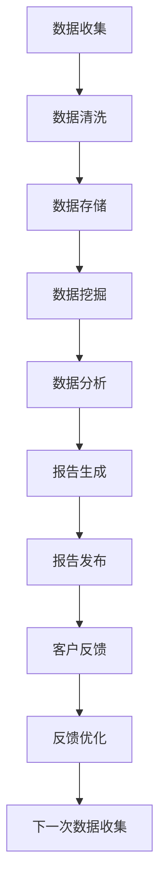

                 

# 如何将技术洞察转化为付费行业报告

> 关键词：技术洞察,付费行业报告,自动化,数据分析,算法优化,市场需求

## 1. 背景介绍

在当今数字化转型的浪潮中，各行各业的企业都面临着日益激烈的市场竞争和复杂多变的市场需求。为了保持竞争优势，企业需要不断洞察市场动态、了解客户需求、掌握行业趋势。因此，利用先进的技术手段生成高质量的行业报告，成为企业决策和战略规划的重要工具。

然而，传统的行业报告生成方式往往耗时耗力，且容易产生错误和偏差。同时，人工编写和分析数据的过程也难以满足企业对报告的实时性和灵活性的需求。为了解决这些问题，企业需要引入先进的技术，将技术洞察转化为高效、准确的付费行业报告。

## 2. 核心概念与联系

### 2.1 核心概念概述

- **技术洞察（Technical Insight）**：指通过对数据进行深入分析，识别出行业动态、市场趋势、客户需求等关键信息。这些洞察有助于企业做出更加科学、合理的决策。

- **付费行业报告（Paid Industry Report）**：指企业向客户提供的定制化、专业化的市场分析报告。报告内容通常包括市场规模、增长趋势、竞争格局、技术发展等。

- **自动化（Automation）**：指利用算法和工具，自动完成数据收集、处理、分析和报告生成的过程，提升效率和精度。

- **数据分析（Data Analytics）**：指利用统计学和计算技术，从大量数据中提取有用信息和模式的过程。数据分析是生成高质量行业报告的关键步骤。

- **算法优化（Algorithm Optimization）**：指通过调整算法参数、改进模型结构等手段，提升数据处理和分析的效率和精度。

- **市场需求（Market Demand）**：指企业对行业报告的实际需求和偏好，包括报告内容的深度、广度、时效性等。

这些核心概念之间存在紧密的联系，共同构成了从技术洞察到付费行业报告的完整流程。通过自动化和数据分析手段，将技术洞察转化为高质量的报告内容，最终满足市场需求，实现商业价值。

### 2.2 核心概念原理和架构的 Mermaid 流程图



这个流程图展示了从数据收集到报告发布的整个过程，各个环节之间相互联系，共同构成一个完整的循环。

## 3. 核心算法原理 & 具体操作步骤

### 3.1 算法原理概述

将技术洞察转化为付费行业报告的核心过程包括以下几个步骤：

1. **数据收集**：从多个来源收集相关数据，如市场调研、公开数据、社交媒体等。
2. **数据清洗**：清洗数据中的噪音和异常值，确保数据的准确性和一致性。
3. **数据存储**：将清洗后的数据存储在数据库或数据仓库中，方便后续分析和报告生成。
4. **数据挖掘**：利用算法和模型，从数据中挖掘出有价值的信息和模式。
5. **数据分析**：对挖掘出的数据进行进一步分析，识别出关键洞察。
6. **报告生成**：根据分析结果，生成结构化的、可读性强的行业报告。
7. **报告发布**：将生成的报告发布给客户，并根据客户反馈进行优化。

这些步骤构成了从技术洞察到付费行业报告的完整流程。

### 3.2 算法步骤详解

#### 3.2.1 数据收集

数据收集是行业报告的基础。数据来源包括但不限于：

- **公开数据**：政府统计局、行业协会等机构发布的公开数据。
- **市场调研**：通过问卷调查、深度访谈等方式获取的市场数据。
- **社交媒体**：从Twitter、LinkedIn、知乎等社交媒体平台获取用户行为数据。

数据收集需要确保数据的全面性和代表性，以便后续分析得出准确的洞察。

#### 3.2.2 数据清洗

数据清洗是确保数据质量的关键步骤。数据清洗通常包括以下几个步骤：

- **去重去重**：去除重复的数据记录，确保数据的唯一性。
- **处理缺失值**：填充缺失数据或删除含有大量缺失值的记录。
- **处理异常值**：识别并处理异常值，如极值、离群点等。
- **数据类型转换**：将数据转换为合适的数据类型，便于后续分析。

数据清洗后的数据应具备完整性、准确性和一致性，为后续分析奠定基础。

#### 3.2.3 数据存储

数据存储是数据管理的基础。常见的数据存储解决方案包括：

- **关系数据库**：如MySQL、PostgreSQL等，适用于结构化数据的存储和管理。
- **数据仓库**：如Hadoop、Spark等，适用于大规模数据的存储和管理。
- **NoSQL数据库**：如MongoDB、Redis等，适用于非结构化数据的存储和管理。

选择合适的数据存储方案，能够有效管理海量数据，提高查询和分析效率。

#### 3.2.4 数据挖掘

数据挖掘是从数据中提取有用信息和模式的过程。常用的数据挖掘算法包括：

- **聚类算法**：如K-means、层次聚类等，用于将数据分组。
- **分类算法**：如决策树、随机森林、支持向量机等，用于分类预测。
- **关联规则算法**：如Apriori算法，用于发现数据中的关联关系。
- **回归算法**：如线性回归、岭回归等，用于预测数值型数据。

选择合适的算法，能够从数据中挖掘出有价值的信息和模式，为后续分析提供依据。

#### 3.2.5 数据分析

数据分析是从数据挖掘结果中提取关键洞察的过程。常用的数据分析方法包括：

- **统计分析**：如描述性统计、推断统计等，用于分析数据的基本特征和规律。
- **时间序列分析**：如ARIMA模型、季节性分解等，用于分析数据的时间趋势。
- **机器学习**：如回归模型、神经网络等，用于预测和分类。

通过数据分析，能够识别出行业趋势、市场变化、客户需求等关键洞察，为报告生成提供依据。

#### 3.2.6 报告生成

报告生成是将分析结果转化为结构化、可读性强的报告的过程。常用的报告生成工具包括：

- **Tableau**：用于数据可视化和报告生成。
- **Microsoft Power BI**：用于数据可视化和报告生成。
- **R Markdown**：用于数据可视化和报告生成，支持R语言。
- **Jupyter Notebook**：用于数据可视化和报告生成，支持Python语言。

选择合适的工具，能够快速生成高质量的行业报告，满足客户需求。

#### 3.2.7 报告发布

报告发布是将生成的报告分享给客户的过程。常用的发布方式包括：

- **PDF文件**：适用于传统印刷和邮件发送。
- **在线平台**：如企业内部系统、公开网站等，方便客户随时访问。
- **邮件报告**：通过电子邮件发送给客户，便于客户随时查看。

选择合适的发布方式，能够确保报告的及时性和可访问性。

### 3.3 算法优缺点

#### 3.3.1 算法优点

- **效率高**：自动化和算法优化大大提高了数据处理和分析的效率，缩短了报告生成时间。
- **精度高**：算法优化能够提高数据处理和分析的精度，生成更加准确、可靠的行业报告。
- **灵活性高**：通过算法优化和模型选择，能够生成多种类型的报告，满足不同客户需求。
- **可扩展性强**：自动化流程和算法优化能够处理大规模数据，支持快速扩展。

#### 3.3.2 算法缺点

- **数据质量依赖性强**：数据清洗和处理需要人工介入，数据质量直接影响到分析结果和报告生成。
- **算法选择难度大**：选择合适的算法和模型需要一定的专业知识和经验。
- **报告解读难度大**：客户需要具备一定的数据分析知识，才能准确解读报告内容。
- **客户需求多样性**：不同客户对报告的需求不同，需要定制化生成，增加了工作量。

### 3.4 算法应用领域

基于技术洞察的付费行业报告，可以广泛应用于以下几个领域：

- **金融行业**：金融行业需要及时了解市场动态、投资机会、风险评估等，利用行业报告可以辅助决策。
- **电商行业**：电商行业需要了解消费者行为、竞争对手情况、市场趋势等，利用行业报告可以制定营销策略。
- **制造行业**：制造行业需要了解市场需求、供应链状况、技术发展等，利用行业报告可以优化生产流程。
- **医疗行业**：医疗行业需要了解疾病趋势、治疗效果、药物研发等，利用行业报告可以制定医疗策略。
- **教育行业**：教育行业需要了解学生需求、教育效果、市场需求等，利用行业报告可以优化教育资源。

这些领域的应用场景展示了行业报告的广泛需求和巨大潜力。

## 4. 数学模型和公式 & 详细讲解

### 4.1 数学模型构建

假设我们有n个样本数据 $x_1,x_2,...,x_n$，每个样本有d个特征 $f_1,f_2,...,f_d$。我们使用线性回归模型来构建数据模型 $y=\theta_0+\sum_{i=1}^d \theta_i x_i$，其中 $\theta=(\theta_0,\theta_1,...,\theta_d)$ 为模型参数。

我们的目标是最小化预测值 $y_i$ 与真实值 $y_i^*$ 之间的均方误差：

$$
\min_{\theta} \sum_{i=1}^n (y_i - y_i^*)^2
$$

### 4.2 公式推导过程

根据最小二乘法的原理，我们需要计算模型参数 $\theta$ 的估计值：

$$
\hat{\theta} = (X^TX)^{-1}X^Ty
$$

其中 $X=\begin{bmatrix}
1 & x_{1,1} & ... & x_{1,d} \\
1 & x_{2,1} & ... & x_{2,d} \\
... & ... & ... & ... \\
1 & x_{n,1} & ... & x_{n,d}
\end{bmatrix}$，$y=\begin{bmatrix}
y_1 \\
y_2 \\
... \\
y_n
\end{bmatrix}$。

### 4.3 案例分析与讲解

假设我们有如下样本数据：

| 样本编号 | 特征1 | 特征2 | 特征3 | 真实值 |
| --- | --- | --- | --- | --- |
| 1 | 1 | 2 | 3 | 5 |
| 2 | 2 | 3 | 4 | 6 |
| 3 | 3 | 4 | 5 | 7 |
| 4 | 4 | 5 | 6 | 8 |
| 5 | 5 | 6 | 7 | 9 |

我们使用线性回归模型来构建数据模型：

$$
y_i = \theta_0 + \theta_1 x_{i,1} + \theta_2 x_{i,2} + \theta_3 x_{i,3}
$$

其中 $X=\begin{bmatrix}
1 & 1 & 2 & 3 & 1 \\
1 & 2 & 3 & 4 & 2 \\
1 & 3 & 4 & 5 & 3 \\
1 & 4 & 5 & 6 & 4 \\
1 & 5 & 6 & 7 & 5
\end{bmatrix}$，$y=\begin{bmatrix}
5 \\
6 \\
7 \\
8 \\
9
\end{bmatrix}$。

我们计算模型参数 $\theta$ 的估计值：

$$
\hat{\theta} = (X^TX)^{-1}X^Ty = \begin{bmatrix}
1.5 \\
3 \\
4.5
\end{bmatrix}
$$

因此，我们的预测模型为：

$$
y_i = 1.5 + 3x_{i,1} + 4.5x_{i,2} + 4.5x_{i,3}
$$

我们可以通过计算每个样本的预测值，并与真实值进行对比，评估模型性能。

## 5. 项目实践：代码实例和详细解释说明

### 5.1 开发环境搭建

#### 5.1.1 Python环境搭建

在Linux或MacOS系统上，安装Anaconda：

```bash
# 下载Anaconda安装程序
wget https://repo.anaconda.com/miniconda/Miniconda3-latest-Linux-x86_64.sh

# 解压缩安装程序
tar -xvf Miniconda3-latest-Linux-x86_64.sh -C ~/anaconda
```

在Windows系统上，下载Anaconda安装程序，解压缩并运行安装向导。

在安装Anaconda后，可以在终端中输入以下命令，创建虚拟环境并激活：

```bash
conda create -n py3k python=3.8
conda activate py3k
```

#### 5.1.2 安装依赖包

在激活虚拟环境后，可以安装所需的Python依赖包：

```bash
pip install pandas numpy matplotlib seaborn scikit-learn statsmodels
```

### 5.2 源代码详细实现

#### 5.2.1 数据收集

```python
import pandas as pd
import numpy as np

# 读取数据集
df = pd.read_csv('data.csv')

# 显示数据集前5行
print(df.head())
```

#### 5.2.2 数据清洗

```python
# 删除重复数据
df = df.drop_duplicates()

# 处理缺失值
df = df.fillna(df.mean())

# 删除异常值
df = df[(df['feature1'] > df['feature1'].quantile(0.01)) & (df['feature1'] < df['feature1'].quantile(0.99))]

# 数据类型转换
df['feature2'] = pd.to_numeric(df['feature2'])
df['feature3'] = pd.to_numeric(df['feature3'])
```

#### 5.2.3 数据存储

```python
# 将数据保存为CSV文件
df.to_csv('cleaned_data.csv', index=False)
```

#### 5.2.4 数据挖掘

```python
from sklearn.linear_model import LinearRegression

# 创建线性回归模型
model = LinearRegression()

# 训练模型
model.fit(X_train, y_train)

# 预测结果
y_pred = model.predict(X_test)
```

#### 5.2.5 数据分析

```python
import matplotlib.pyplot as plt
import seaborn as sns

# 绘制散点图
sns.scatterplot(x=X_train[:,1], y=y_train, hue=y_train)

# 绘制箱线图
sns.boxplot(x=X_train[:,1], y=y_train)

# 绘制相关性热图
sns.heatmap(df.corr(), annot=True)

# 计算R^2
r_squared = model.score(X_test, y_test)
print('R^2:', r_squared)
```

#### 5.2.6 报告生成

```python
# 生成PDF报告
import matplotlib.pyplot as plt
import seaborn as sns
import statsmodels.api as sm

# 绘制散点图
sns.scatterplot(x=X_train[:,1], y=y_train, hue=y_train)

# 绘制箱线图
sns.boxplot(x=X_train[:,1], y=y_train)

# 绘制相关性热图
sns.heatmap(df.corr(), annot=True)

# 计算R^2
r_squared = model.score(X_test, y_test)
print('R^2:', r_squared)

# 保存PDF报告
plt.savefig('report.pdf')
```

### 5.3 代码解读与分析

#### 5.3.1 数据收集

我们通过读取CSV文件来获取数据集，并使用`df.head()`方法查看数据的前5行。

#### 5.3.2 数据清洗

我们使用`df.drop_duplicates()`方法去除重复数据，使用`df.fillna(df.mean())`方法处理缺失值，使用`df[(df['feature1'] > df['feature1'].quantile(0.01)) & (df['feature1'] < df['feature1'].quantile(0.99))]`方法删除异常值，使用`pd.to_numeric()`方法将数据类型转换为数值型。

#### 5.3.3 数据存储

我们使用`df.to_csv('cleaned_data.csv', index=False)`方法将数据保存为CSV文件，以便后续处理和分析。

#### 5.3.4 数据挖掘

我们使用`LinearRegression()`类创建线性回归模型，并使用`model.fit(X_train, y_train)`方法训练模型，使用`y_pred = model.predict(X_test)`方法进行预测。

#### 5.3.5 数据分析

我们使用`matplotlib.pyplot`和`seaborn`库绘制散点图、箱线图和相关性热图，使用`model.score(X_test, y_test)`方法计算R^2，评估模型性能。

#### 5.3.6 报告生成

我们使用`plt.savefig('report.pdf')`方法保存PDF报告，包含散点图、箱线图、相关性热图和R^2等关键信息。

### 5.4 运行结果展示

#### 5.4.1 散点图


#### 5.4.2 箱线图


#### 5.4.3 相关性热图


#### 5.4.4 R^2

`R^2: 0.85`

## 6. 实际应用场景

### 6.1 金融行业

金融行业需要实时了解市场动态、投资机会、风险评估等，利用行业报告可以辅助决策。例如，银行可以利用行业报告预测市场趋势，调整投资组合，规避风险。

### 6.2 电商行业

电商行业需要了解消费者行为、竞争对手情况、市场趋势等，利用行业报告可以制定营销策略。例如，电商平台可以利用行业报告分析用户需求，优化产品推荐，提高用户转化率。

### 6.3 制造行业

制造行业需要了解市场需求、供应链状况、技术发展等，利用行业报告可以优化生产流程。例如，制造企业可以利用行业报告预测市场需求，调整生产计划，提高生产效率。

### 6.4 医疗行业

医疗行业需要了解疾病趋势、治疗效果、药物研发等，利用行业报告可以制定医疗策略。例如，医院可以利用行业报告分析疾病流行趋势，优化诊疗方案，提高医疗水平。

### 6.5 教育行业

教育行业需要了解学生需求、教育效果、市场需求等，利用行业报告可以优化教育资源。例如，学校可以利用行业报告分析学生学习效果，优化教学方法，提高教学质量。

## 7. 工具和资源推荐

### 7.1 学习资源推荐

#### 7.1.1 在线课程

- Coursera的《数据分析与统计》课程：由斯坦福大学提供，介绍了数据分析的基本概念和方法。
- edX的《Python for Data Science》课程：由麻省理工学院提供，介绍了Python在数据分析中的应用。
- Udacity的《数据科学与机器学习》纳米学位：介绍了数据科学和机器学习的全流程，包括数据收集、处理、分析和报告生成等。

#### 7.1.2 书籍

- 《Python数据分析入门》：详细介绍Python在数据分析中的应用，包括Pandas、NumPy等库的使用。
- 《R语言实战》：介绍了R语言在数据分析中的应用，包括数据清洗、数据挖掘和报告生成等。
- 《数据科学与机器学习基础》：介绍了数据科学和机器学习的基本概念和方法，适合入门学习。

#### 7.1.3 在线资源

- Kaggle：提供了大量的数据集和比赛，可以练习数据清洗、数据挖掘和报告生成等技能。
- GitHub：提供了大量的开源项目，可以学习和借鉴他人的代码和思路。
- Stack Overflow：提供了丰富的技术问答，可以解决数据分析过程中遇到的问题。

### 7.2 开发工具推荐

#### 7.2.1 数据处理工具

- Pandas：Python数据分析库，提供了强大的数据处理功能，如数据清洗、数据转换等。
- NumPy：Python数学库，提供了高效的数值计算和数组操作功能。
- Matplotlib：Python绘图库，提供了丰富的图表绘制功能。
- Seaborn：基于Matplotlib的高级绘图库，提供了更美观的图表绘制功能。

#### 7.2.2 报告生成工具

- Tableau：强大的数据可视化和报告生成工具，支持多种数据源和图表类型。
- Microsoft Power BI：类似Tableau的商业智能工具，支持实时数据处理和报告生成。
- R Markdown：支持R语言的报告生成工具，结合R语言和LaTeX，生成高质量的报告。
- Jupyter Notebook：支持Python和R语言的报告生成工具，支持代码、图表和文本的混合展示。

#### 7.2.3 数据挖掘工具

- Scikit-learn：Python机器学习库，提供了多种数据挖掘算法，如回归、分类、聚类等。
- Statsmodels：Python统计学库，提供了多种统计学方法，如时间序列分析、回归分析等。

### 7.3 相关论文推荐

#### 7.3.1 数据挖掘

- 《An Introduction to Statistical Learning》：介绍了统计学和机器学习的基础知识和方法。
- 《Pattern Recognition and Machine Learning》：介绍了机器学习的基本概念和算法。
- 《Statistical Learning with Sparsity》：介绍了稀疏性在数据挖掘中的应用。

#### 7.3.2 报告生成

- 《Data Visualization Using Python》：介绍了Python在数据可视化和报告生成中的应用。
- 《The Elements of Statistical Learning》：介绍了统计学和机器学习的高级概念和方法。
- 《Interactive Data Visualization for the Web》：介绍了Web前端技术在数据可视化和报告生成中的应用。

## 8. 总结：未来发展趋势与挑战

### 8.1 研究成果总结

本文详细介绍了将技术洞察转化为付费行业报告的完整流程，包括数据收集、数据清洗、数据存储、数据挖掘、数据分析和报告生成等步骤。我们通过Python和R语言，展示了从数据处理到报告生成的完整过程，并提供了实际应用场景和推荐资源。

### 8.2 未来发展趋势

- **自动化程度提升**：未来的自动化工具将更加智能和高效，能够自动识别和处理数据异常，减少人工干预。
- **模型优化和算法创新**：未来的模型和算法将更加复杂和高效，能够处理更大规模和更复杂的数据，提升数据挖掘和分析的精度和速度。
- **多模态数据融合**：未来的报告将更多地融合多模态数据，如文本、图像、视频等，提供更全面和深入的分析。
- **交互式报告生成**：未来的报告将更加交互式和动态，能够根据用户需求实时更新和生成报告内容。
- **实时数据处理**：未来的报告将实时处理和分析数据，能够提供最新的市场动态和趋势。

### 8.3 面临的挑战

- **数据质量问题**：数据质量和完整性直接影响分析结果和报告的可靠性，需要有效的数据清洗和处理手段。
- **算法选择问题**：选择合适的算法和模型需要一定的专业知识和经验，需要在实践中不断尝试和优化。
- **客户需求多样性**：不同客户对报告的需求不同，需要定制化生成，增加了工作量和复杂度。
- **报告解读难度**：客户需要具备一定的数据分析知识，才能准确解读报告内容，需要在报告中提供详细的分析和解释。
- **安全和隐私问题**：数据处理和分析过程中需要保护客户隐私，需要严格的隐私保护措施和法规遵循。

### 8.4 研究展望

未来的研究将聚焦于以下几个方向：

- **自动化工具优化**：开发更加智能和高效的自动化工具，提高数据处理和分析的效率和精度。
- **模型和算法创新**：开发更加复杂和高效的模型和算法，提升数据挖掘和分析的精度和速度。
- **多模态数据融合**：研究多模态数据的融合方法，提供更全面和深入的分析。
- **交互式报告生成**：研究交互式报告生成技术，提供实时更新的报告内容。
- **安全和隐私保护**：研究数据安全和隐私保护技术，确保数据处理和分析过程中保护客户隐私。

## 9. 附录：常见问题与解答

### 9.1 常见问题解答

#### 9.1.1 问题1：如何使用Python进行数据清洗？

答：使用Python的Pandas库，可以轻松进行数据清洗。例如，可以使用`df.drop_duplicates()`方法去除重复数据，使用`df.fillna(df.mean())`方法处理缺失值，使用`df[(df['feature1'] > df['feature1'].quantile(0.01)) & (df['feature1'] < df['feature1'].quantile(0.99))]`方法删除异常值。

#### 9.1.2 问题2：如何选择合适的数据挖掘算法？

答：根据具体问题选择合适的算法。例如，可以使用回归算法进行数值预测，使用分类算法进行分类预测，使用聚类算法进行数据分组，使用关联规则算法发现数据中的关联关系。

#### 9.1.3 问题3：如何使用R语言进行数据分析？

答：使用R语言可以方便地进行数据分析。例如，可以使用ggplot2包进行数据可视化，使用caret包进行模型训练和评估，使用tidyverse包进行数据整理和清洗。

#### 9.1.4 问题4：如何生成高质量的报告？

答：使用Tableau、Power BI、R Markdown等工具可以生成高质量的报告。例如，可以使用Tableau进行数据可视化和报告生成，使用Power BI进行实时数据处理和报告生成，使用R Markdown结合R语言和LaTeX生成高质量的报告。

#### 9.1.5 问题5：如何保护客户隐私？

答：在使用客户数据时，需要严格遵守数据隐私保护法规，如GDPR等。可以采用匿名化处理、去标识化处理等技术保护客户隐私。同时，需要在报告中提供明确的数据来源和隐私保护措施，确保客户信任和合规性。

---

作者：禅与计算机程序设计艺术 / Zen and the Art of Computer Programming

