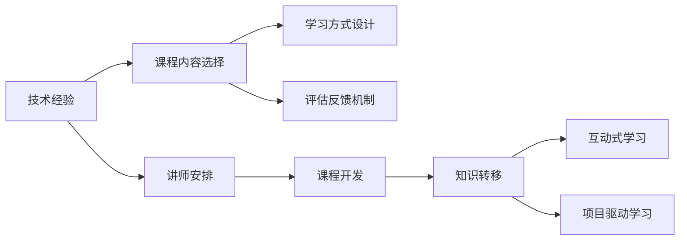

                 

# 如何将技术经验转化为企业内训课程

## 1. 背景介绍

### 1.1 问题由来

在快速发展的科技时代，企业内部的技术培训需求愈发强烈。然而，技术课程的设计和制作往往需要大量的时间和专业知识，这对于企业来说是一个不小的挑战。同时，即便是开发出高质量的课程，如何确保这些课程能够有效传递给员工并激发其学习兴趣，也是一道难题。

因此，如何将技术专家丰富的经验转化为易于理解、易于实践的企业内训课程，成为了提升企业技术水平和创新能力的关键。本文将详细介绍如何通过一系列步骤，将技术经验转化为高效的企业内训课程。

### 1.2 问题核心关键点

本节将明确内训课程设计的核心关键点，涵盖课程内容选择、讲师安排、学习方式设计、评估反馈机制等环节，确保课程的质量和效果。

1. **课程内容选择**：根据企业需求和技术栈，确定课程的核心内容，如基础概念、架构设计、实践技巧等。
2. **讲师安排**：邀请资深技术专家或团队成员作为讲师，确保课程的专业性和实践性。
3. **学习方式设计**：结合线上线下多种形式，如视频讲解、现场演示、动手实践等，增强学习体验。
4. **评估反馈机制**：通过小测验、实战练习、讲师反馈等方式，及时评估学习效果，调整教学策略。

### 1.3 问题研究意义

开发高质量的企业内训课程，对于提升员工技术水平、推动企业技术创新、增强团队协作能力具有重要意义。它不仅能直接提升企业的技术实力，还能通过技术经验共享，构建起浓厚的学习氛围，激发员工的创新动力，为企业的长期发展奠定坚实的基础。

## 2. 核心概念与联系

### 2.1 核心概念概述

为更好地理解如何将技术经验转化为内训课程，本节将介绍几个关键概念及其相互联系：

- **技术经验**：指技术专家在实际工作中积累的知识、技能、工具、最佳实践等。
- **内训课程**：专为提升员工技能而设计的一系列学习材料和活动，通常包括理论讲解、实践操作、评估反馈等环节。
- **知识转移**：将技术专家的经验转化为课程内容，使知识能够有效地传递给学习者。
- **学习路径设计**：根据学习者的水平和需求，设计逐步升级的学习路径，从基础到高级，循序渐进。
- **互动式学习**：通过讨论、小组合作、实时问答等方式，增强学习者的参与感和理解深度。
- **项目驱动学习**：将学习内容嵌入到实际项目中，通过实践提升学习者的应用能力。

这些核心概念通过以下Mermaid流程图进行展示，以帮助理解它们之间的联系：



这个流程图展示了技术经验如何通过课程内容选择、讲师安排、学习方式设计、评估反馈机制等环节，最终转化为高效的企业内训课程，并通过互动式学习和项目驱动学习增强学习效果。

## 3. 核心算法原理 & 具体操作步骤

### 3.1 算法原理概述

将技术经验转化为内训课程的过程，本质上是一个知识提取、组织、传递的连续过程。其核心原理包括：

- **知识提取**：从技术专家的经验中提取出关键概念、方法和技巧。
- **知识组织**：将提取出的知识进行系统化的组织，形成易于理解、易于应用的结构。
- **知识传递**：通过多种形式（如视频、PPT、练习题等）将知识传递给学习者。
- **知识巩固**：通过实践操作和反馈机制，巩固学习者的知识掌握情况。

### 3.2 算法步骤详解

本节将详细介绍如何将技术经验转化为内训课程的具体操作步骤：

**Step 1: 收集技术经验**

1. **专家访谈**：选择资深技术专家，进行深入访谈，了解其在技术领域的专业知识和实践经验。
2. **项目案例分析**：回顾专家参与的关键项目，提炼出其中的技术和方法。
3. **文档和代码审查**：对专家的技术文档和项目代码进行详细审查，提取核心技术和实践。

**Step 2: 设计课程内容**

1. **需求分析**：根据企业技术栈和员工水平，确定课程的目标和主要内容。
2. **内容划分**：将课程内容划分为理论部分、实践部分、案例分析等模块。
3. **顺序编排**：按照从易到难的顺序，编排课程内容的逻辑结构。

**Step 3: 安排讲师和资源**

1. **讲师选择**：邀请具备丰富经验和教学能力的专家作为讲师。
2. **资源准备**：准备课程所需的教学材料、工具和环境。
3. **设备安排**：确保讲师和学员都有良好的学习环境。

**Step 4: 制作课程材料**

1. **制作PPT和文档**：将课程内容整理成详细的PPT和文档，便于讲师和学员参考。
2. **录制视频讲解**：录制讲师的详细讲解视频，以备学员自学使用。
3. **开发实战练习**：设计针对课程内容的实战练习，帮助学员巩固知识。

**Step 5: 实施培训和评估**

1. **实施培训**：按照课程计划，逐步实施培训，确保学员掌握每个知识点。
2. **实时反馈**：在培训过程中，实时收集学员的反馈，调整教学策略。
3. **评估效果**：通过小测验、实战练习等方式，评估学员的学习效果。

### 3.3 算法优缺点

将技术经验转化为内训课程的方法，具有以下优点：

1. **系统化传递知识**：通过系统化的课程设计，确保技术经验能够有序传递。
2. **增强学习效果**：结合多种学习形式，提升学员的学习兴趣和效果。
3. **灵活性高**：课程内容可以根据企业需求和技术栈进行调整，满足不同的学习需求。
4. **知识传承**：通过课程制作，将技术专家的经验传承给新一代技术人才。

同时，该方法也存在一些局限性：

1. **时间成本高**：课程开发需要大量的时间和资源，对企业来说成本较高。
2. **讲师依赖性强**：课程的成功很大程度上依赖于讲师的专业水平和教学能力。
3. **技术更新快**：课程内容需要定期更新，以跟上技术发展的步伐。
4. **评估难度大**：评估学习效果时，如何量化和准确反映学员的掌握程度，是一个挑战。

尽管存在这些局限性，但通过合理的设计和实施，将技术经验转化为内训课程仍然是提升企业技术水平的重要手段。

### 3.4 算法应用领域

基于将技术经验转化为内训课程的方法，已经在多个行业和技术领域得到了广泛应用：

- **软件开发**：通过将开发专家的实践经验融入课程，提升开发团队的编程技能和项目管理能力。
- **数据分析**：利用数据科学专家的知识，开发数据建模、数据清洗和数据可视化的培训课程。
- **人工智能**：结合AI专家在深度学习、自然语言处理、计算机视觉等领域的实践经验，设计AI技术的培训课程。
- **运维管理**：通过运维专家的经验，开发运维工具使用、故障排除和性能优化的培训课程。
- **安全防护**：结合安全专家在网络安全、数据保护等方面的经验，设计网络安全培训课程。

这些领域的应用，不仅提升了技术团队的综合能力，还促进了企业整体的技术创新和业务发展。

## 4. 数学模型和公式 & 详细讲解 & 举例说明

### 4.1 数学模型构建

在本节中，我们将使用数学语言对将技术经验转化为内训课程的过程进行更为严格的刻画。

设技术专家在某个领域有$N$项经验，每一项经验可以表示为一个三元组$(x_i, y_i, z_i)$，其中$x_i$为经验描述，$y_i$为解决问题的方法，$z_i$为经验的应用场景。

课程内容的构建可以看作是将这些经验进行抽取、组织和传递的过程。设课程内容为$C$，其形式为$C=\{(c_1, c_2, \ldots, c_m)\}$，其中每个$c_j$表示课程中的一个模块。

课程内容构建的数学模型可以表示为：

$$
C = \bigcup_{i=1}^{N} \{x_i, y_i, z_i\}
$$

在实践中，课程内容的构建还需要考虑以下几点：

1. **模块划分**：将课程内容划分为多个模块，如基础概念、进阶技巧、实战应用等。
2. **逻辑顺序**：按照从简单到复杂的顺序，排列各个模块的逻辑顺序。
3. **互动设计**：设计互动环节，如案例分析、小组讨论、实时问答等，增强学习效果。

### 4.2 公式推导过程

以一个简单的示例来说明课程内容构建的数学模型：

假设技术专家有3项经验，分别为：

1. 使用RESTful API进行后端数据访问。
2. 利用ORM框架优化数据库查询。
3. 通过缓存技术提高页面加载速度。

将这些经验组织成课程内容$C$，可以表示为：

$$
C = \{RESTful API, ORM框架, 缓存技术\}
$$

课程内容的逻辑顺序可以是：

$$
C = \{RESTful API, ORM框架, 缓存技术\}
$$

在这个过程中，每个模块的详细描述、方法和应用场景需要由讲师根据实际情况进行调整和补充。

### 4.3 案例分析与讲解

为了更好地理解课程内容构建的数学模型，下面通过一个具体的案例进行讲解：

假设技术专家有5项关于机器学习的经验，分别是：

1. 数据预处理和特征工程。
2. 选择合适的机器学习算法。
3. 模型训练和调参技巧。
4. 模型评估和性能优化。
5. 实际项目中的模型应用。

将这些经验组织成课程内容$C$，可以表示为：

$$
C = \{数据预处理, 特征工程, 算法选择, 模型训练, 模型评估, 项目应用\}
$$

课程内容的逻辑顺序可以是：

$$
C = \{数据预处理, 特征工程, 算法选择, 模型训练, 模型评估, 项目应用\}
$$

在实际的课程实施过程中，每个模块的内容可以进一步细化，如：

1. 数据预处理：介绍数据清洗、数据转换、特征选择等具体方法。
2. 特征工程：讲解特征提取、特征降维、特征组合等技巧。
3. 算法选择：分析不同算法的适用场景和优缺点。
4. 模型训练：介绍常见的训练技巧和调参方法。
5. 模型评估：讲解常用的评估指标和模型验证方法。
6. 项目应用：展示如何在实际项目中应用机器学习模型。

## 5. 项目实践：代码实例和详细解释说明

### 5.1 开发环境搭建

在进行内训课程开发前，我们需要准备好开发环境。以下是使用Python进行开发的环境配置流程：

1. 安装Python：确保Python环境已配置好，可以使用Python 3.7及以上版本。
2. 安装必要的包：安装Pip包管理器，使用以下命令安装必要的Python包：
```bash
pip install ipywidgets
pip install traitlets
pip install nbextension
pip install nbconvert
```
3. 准备Jupyter Notebook：确保Jupyter Notebook环境已配置好，并使用以下命令启动Jupyter Notebook：
```bash
jupyter notebook
```

### 5.2 源代码详细实现

下面以一个简单的内训课程开发为例，给出完整的代码实现：

```python
# 导入必要的库
from IPython.display import HTML
from IPython.display import Image

# 定义课程内容
课程内容 = [
    '数据预处理',
    '特征工程',
    '算法选择',
    '模型训练',
    '模型评估',
    '项目应用'
]

# 定义课程模块的详细描述
模块描述 = [
    '数据清洗、数据转换、特征选择等具体方法。',
    '特征提取、特征降维、特征组合等技巧。',
    '分析不同算法的适用场景和优缺点。',
    '介绍常见的训练技巧和调参方法。',
    '讲解常用的评估指标和模型验证方法。',
    '展示如何在实际项目中应用机器学习模型。'
]

# 定义课程模块的逻辑顺序
模块顺序 = [
    '数据预处理',
    '特征工程',
    '算法选择',
    '模型训练',
    '模型评估',
    '项目应用'
]

# 将课程内容转换为Jupyter Notebook的HTML格式
HTML代码 = "<table><tr><th>模块</th><th>描述</th></tr>"
for i in range(len(课程内容)):
    HTML代码 += f"<tr><td>{课程内容[i]}</td><td>{模块描述[i]}</td></tr>"
HTML代码 += "</table>"

# 在Jupyter Notebook中显示HTML代码
HTML(HTML代码)

# 显示课程模块的逻辑顺序
HTML代码 = "<ul><li>" + "\n".join(模块顺序) + "</li></ul>"
HTML(HTML代码)

# 在Jupyter Notebook中显示HTML代码
HTML(HTML代码)
```

### 5.3 代码解读与分析

让我们再详细解读一下关键代码的实现细节：

**课程内容定义**：
- `课程内容`：是一个列表，包含课程内容的每个模块名称。
- `模块描述`：是一个列表，每个元素对应课程内容中的一个模块的详细描述。
- `模块顺序`：是一个列表，定义了课程内容的逻辑顺序。

**HTML代码生成**：
- `HTML代码`：通过字符串拼接的方式，将课程内容、模块描述和模块顺序转换为HTML格式，用于在Jupyter Notebook中显示。
- `HTML`函数：将生成的HTML代码在Jupyter Notebook中显示出来。

在实际的课程开发中，还可以添加更多功能，如视频链接、练习题、实时反馈等，以提升课程的互动性和实用性。

## 6. 实际应用场景

### 6.1 软件开发培训

软件开发是企业内训课程的重要组成部分。通过将资深开发者的经验转化为课程内容，可以提升开发团队的编程技能和项目管理能力。例如，可以开设以下课程：

1. 基础编程技能：如Python、Java等编程语言的基础知识。
2. 高级编程技巧：如面向对象编程、设计模式、并发编程等。
3. 系统架构设计：如微服务架构、事件驱动架构、数据驱动架构等。
4. 测试和调试技巧：如单元测试、集成测试、性能测试等。
5. 项目管理方法：如敏捷开发、Scrum、Kanban等。

### 6.2 数据分析培训

数据分析是企业内训课程的另一个重要内容。通过将数据分析专家的知识转化为课程内容，可以提升团队的数据分析和决策能力。例如，可以开设以下课程：

1. 数据处理和清洗：如数据清洗、数据转换、数据预处理等。
2. 数据可视化和展示：如数据可视化、数据报告、仪表盘等。
3. 数据建模和预测：如回归分析、时间序列分析、聚类分析等。
4. 机器学习和深度学习：如特征工程、模型选择、调参技巧等。
5. 数据安全和隐私保护：如数据加密、数据脱敏、数据审计等。

### 6.3 人工智能培训

人工智能是技术培训的前沿领域。通过将AI专家的经验转化为课程内容，可以提升团队的人工智能应用能力。例如，可以开设以下课程：

1. 机器学习基础：如监督学习、无监督学习、强化学习等。
2. 深度学习框架：如TensorFlow、PyTorch等。
3. 自然语言处理：如文本分类、文本生成、语义分析等。
4. 计算机视觉：如图像识别、目标检测、图像生成等。
5. 数据处理和特征工程：如特征提取、特征降维、特征组合等。
6. 模型训练和调参：如模型选择、超参数优化、模型验证等。
7. 人工智能伦理和安全：如偏见检测、隐私保护、安全防护等。

### 6.4 未来应用展望

随着技术的发展，内训课程的应用领域将不断扩展，为企业的技术创新和业务发展提供更强的支持。未来，内训课程有望在以下领域得到更广泛的应用：

1. 数据科学：通过数据科学专家的知识，提升企业的数据分析和决策能力。
2. 云计算和分布式计算：通过云计算专家的经验，提升企业的计算能力和数据处理能力。
3. 区块链技术：通过区块链专家的知识，提升企业的区块链应用能力和数据安全保障能力。
4. 物联网：通过物联网专家的经验，提升企业的物联网应用能力和智能设备管理能力。
5. 自动化和机器人技术：通过自动化和机器人专家的知识，提升企业的自动化和智能化水平。

内训课程的应用前景广阔，企业可以通过不断优化和扩展内训课程，提升自身的技术实力和市场竞争力。

## 7. 工具和资源推荐

### 7.1 学习资源推荐

为了帮助开发者系统掌握将技术经验转化为内训课程的理论基础和实践技巧，这里推荐一些优质的学习资源：

1. Coursera：提供大量高质量的在线课程，涵盖软件开发、数据分析、人工智能等多个领域。
2. Udemy：提供多样化的编程和技术培训课程，满足不同层次的学习需求。
3. edX：提供全球顶级大学的在线课程，涵盖基础科学、工程、人文学科等多个领域。
4. Codecademy：提供互动式编程学习平台，帮助学员快速掌握编程技能。
5. DataCamp：提供数据科学和数据可视化的在线课程，提升数据处理和分析能力。
6. Google教育资源：提供免费的在线课程和认证，涵盖软件开发、人工智能等多个领域。

通过对这些资源的学习实践，相信你一定能够快速掌握将技术经验转化为内训课程的精髓，并用于解决实际的培训问题。

### 7.2 开发工具推荐

高效的开发离不开优秀的工具支持。以下是几款用于内训课程开发的常用工具：

1. Jupyter Notebook：开源的交互式笔记本，支持代码和文本的混合编辑，非常适合数据科学和编程课程。
2. LaTeX：专业的排版工具，支持复杂的数学公式和格式排版，适用于技术文档的撰写。
3. Markdown：轻量级的文本标记语言，支持格式排版和代码高亮，适用于培训材料的快速编辑和发布。
4. GitHub：版本控制和代码托管平台，方便课程内容的版本管理和团队协作。
5. Google Classroom：基于Gmail的在线学习管理系统，支持课程内容的发布、讨论和反馈。
6. Zoom：视频会议和在线培训工具，支持实时互动和课程内容的播放。

合理利用这些工具，可以显著提升内训课程的开发效率，加快创新迭代的步伐。

### 7.3 相关论文推荐

将技术经验转化为内训课程的研究源于学界的持续研究。以下是几篇奠基性的相关论文，推荐阅读：

1. "Designing Effective Learning Environments for Professional Development" by E. Tessmer and M. McDaniel（教育心理学，设计有效的学习环境）
2. "Expertise in Practice: How to Develop It" by H. Bransford and P. Franks（教育学，实践中的专家技能）
3. "Learning Theory: An Introduction" by R. Mayer（教育心理学，学习理论）
4. "Knowledge Transfer in Engineering Education" by A. Cwikel and E. Torok（工程教育，知识的传递）
5. "Designing Instruction for Learning: A Comprehensive Guide" by L. Marton and A. Suslin（教育学，教学设计）
6. "Teaching Programming Languages: A Case Study of Kotlin" by E. Biesemans et al.（计算机科学，编程语言的教学）

这些论文代表了大规模学习设计的最新研究成果，通过学习这些前沿成果，可以帮助研究者把握学科前进方向，激发更多的创新灵感。

## 8. 总结：未来发展趋势与挑战

### 8.1 总结

本文对将技术经验转化为企业内训课程的过程进行了全面系统的介绍。首先阐述了内训课程设计的背景和意义，明确了课程内容选择、讲师安排、学习方式设计、评估反馈机制等核心关键点，确保课程的质量和效果。其次，从原理到实践，详细讲解了课程开发的具体操作步骤，给出了完整的代码实例。同时，本文还广泛探讨了内训课程在软件开发、数据分析、人工智能等多个领域的应用前景，展示了内训课程的巨大潜力。此外，本文精选了课程开发所需的各类学习资源、开发工具和相关论文，力求为读者提供全方位的技术指引。

通过本文的系统梳理，可以看到，将技术经验转化为内训课程是一项复杂而系统的工作，需要考虑多方面的因素，但通过合理的规划和设计，可以有效提升企业的技术水平和创新能力。

### 8.2 未来发展趋势

展望未来，内训课程将呈现以下几个发展趋势：

1. **多样化课程内容**：随着技术的发展，课程内容将更加多样化，涵盖更多前沿技术和应用。
2. **互动式学习方式**：通过在线互动、实时反馈等方式，提升学习者的参与感和学习效果。
3. **个性化学习路径**：根据学习者的水平和需求，设计个性化的学习路径，满足不同的学习需求。
4. **实时动态更新**：课程内容需要根据技术的发展进行实时动态更新，保持课程的时效性和前沿性。
5. **跨领域融合**：内训课程将更多地与其他学科和领域进行融合，提升技术应用的跨领域能力和综合素质。

以上趋势凸显了内训课程的广阔前景。这些方向的探索发展，必将进一步提升企业的技术水平和创新能力，为企业的长期发展奠定坚实的基础。

### 8.3 面临的挑战

尽管内训课程在企业培训中已经取得了不少成效，但在迈向更加智能化、普适化应用的过程中，仍面临诸多挑战：

1. **课程开发成本高**：课程开发需要大量的时间和资源，对企业来说成本较高。
2. **讲师资源不足**：优秀的讲师资源有限，难以满足大规模培训需求。
3. **学习效果评估难**：如何量化和准确反映学习者的掌握程度，是一个挑战。
4. **技术更新快**：课程内容需要定期更新，以跟上技术发展的步伐。
5. **学习动力不足**：如何激发学习者的学习兴趣和动力，是一个重要问题。

尽管存在这些挑战，但通过合理的设计和实施，内训课程仍然是一项值得投入的重要培训手段，可以通过不断优化和改进，提升企业的技术水平和市场竞争力。

### 8.4 研究展望

面对内训课程面临的这些挑战，未来的研究需要在以下几个方面寻求新的突破：

1. **自动化课程开发**：通过AI技术自动化生成课程内容，降低课程开发成本，提高开发效率。
2. **互动式学习技术**：利用虚拟现实、增强现实等技术，提升互动式学习的体验和效果。
3. **个性化学习平台**：开发个性化学习平台，根据学习者的水平和需求，推荐合适的课程内容和路径。
4. **实时学习数据分析**：利用大数据和机器学习技术，实时分析学习效果，调整教学策略。
5. **多领域知识融合**：将不同领域的知识和技能进行融合，提升学习者的跨领域能力和综合素质。
6. **学习效果激励机制**：设计有效的激励机制，激发学习者的学习兴趣和动力。

这些研究方向的探索，必将引领内训课程技术迈向更高的台阶，为企业的技术创新和业务发展提供更强的支持。

## 9. 附录：常见问题与解答

**Q1：如何确定内训课程的内容和顺序？**

A: 确定课程内容和顺序的关键在于对技术经验的全面梳理和系统化组织。具体步骤如下：
1. **专家访谈**：选择资深技术专家，进行深入访谈，了解其在技术领域的专业知识和实践经验。
2. **项目案例分析**：回顾专家参与的关键项目，提炼出其中的技术和方法。
3. **文档和代码审查**：对专家的技术文档和项目代码进行详细审查，提取核心技术和实践。
4. **需求分析**：根据企业技术栈和员工水平，确定课程的目标和主要内容。
5. **内容划分**：将课程内容划分为多个模块，如基础概念、进阶技巧、实战应用等。
6. **逻辑顺序**：按照从简单到复杂的顺序，排列各个模块的逻辑顺序。

通过以上步骤，可以确保课程内容和顺序的合理性和系统性。

**Q2：如何设计互动式学习环节？**

A: 互动式学习环节的设计是提升内训课程效果的关键。具体步骤如下：
1. **案例分析**：设计多个案例，通过分析实际项目，帮助学习者理解技术应用。
2. **小组讨论**：将学习者分成小组，讨论和解决实际问题，提升协作能力。
3. **实时问答**：通过在线问答工具，实时回答学习者的疑问，增强互动性。
4. **实战练习**：设计实战练习，让学习者在实际项目中应用所学知识，巩固学习效果。
5. **模拟实验**：利用虚拟现实、增强现实等技术，设计模拟实验，提升学习体验。

通过以上环节，可以增强学习者的参与感和理解深度，提升学习效果。

**Q3：如何评估内训课程的学习效果？**

A: 评估内训课程的学习效果需要综合考虑多个方面，具体步骤如下：
1. **小测验**：设计一些小测验，测试学习者的知识掌握情况。
2. **实战练习**：通过实战练习，评估学习者在实际项目中的应用能力。
3. **讲师反馈**：讲师根据学习者的表现，给出详细的反馈和建议。
4. **学习者自我评估**：学习者自行评估学习效果，填写问卷和反馈表。
5. **数据分析**：利用大数据和机器学习技术，分析学习效果，发现问题并进行改进。

通过以上步骤，可以全面评估内训课程的学习效果，发现问题并进行改进，提升课程质量。

**Q4：如何提高内训课程的互动性和参与感？**

A: 提高内训课程的互动性和参与感需要多方面的努力，具体步骤如下：
1. **设计互动环节**：设计互动环节，如案例分析、小组讨论、实时问答等。
2. **利用技术工具**：利用在线互动工具，如在线问答、小组讨论等，提升互动性。
3. **激励机制**：设计激励机制，如学习积分、奖励等，激发学习者的参与热情。
4. **反馈机制**：及时反馈学习者的表现，给予肯定和鼓励，增强参与感。
5. **案例展示**：通过案例展示，分享成功经验，激发学习者的学习兴趣。

通过以上措施，可以大大提高内训课程的互动性和参与感，提升学习效果。

**Q5：如何设计个性化的学习路径？**

A: 设计个性化的学习路径需要综合考虑学习者的水平和需求，具体步骤如下：
1. **需求调研**：通过问卷调查和访谈，了解学习者的需求和水平。
2. **能力评估**：评估学习者的现有知识和技能，确定其能力水平。
3. **路径设计**：根据学习者的能力和需求，设计个性化的学习路径，从基础到进阶，循序渐进。
4. **资源推荐**：根据学习路径，推荐适合的课程资源和教材，帮助学习者自学。
5. **反馈调整**：通过学习者的反馈和测试结果，及时调整学习路径，确保其科学性和有效性。

通过以上步骤，可以设计出个性化的学习路径，满足不同学习者的需求，提升学习效果。

---

作者：禅与计算机程序设计艺术 / Zen and the Art of Computer Programming

