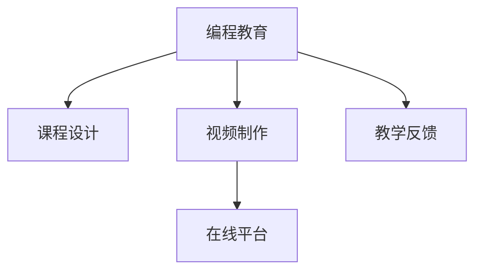

                 

## 1. 背景介绍

### 1.1 问题由来

在互联网和在线教育日益兴盛的今天，编程技能已成为许多岗位的必备技能之一。越来越多的个人和企业投身于在线编程教育市场，通过视频课程的形式，传授编程技巧和实践经验。然而，将编程技巧转化为易于理解、行之有效的视频课程，却是一个挑战重重的过程。

### 1.2 问题核心关键点

将编程技巧转化为视频课程，需要深入理解编程的原理和实践，将其系统化、结构化地呈现给观众。这不仅涉及到编程知识本身，还包括教学设计、视频制作等多个环节。

### 1.3 问题研究意义

开发高质量编程视频课程，对提升编程教育水平、推动编程知识普及、促进产业发展具有重要意义：

1. **知识共享**：视频课程可以跨越时间和空间的限制，将编程知识传递给全球各地的学习者。
2. **技能提升**：通过系统学习编程课程，学习者可以快速提升编程技能，适应技术发展的需要。
3. **职业发展**：高质量的视频课程是职业发展的催化剂，能够帮助求职者在激烈的竞争中脱颖而出。
4. **教育公平**：在线视频课程为偏远地区和资源匮乏地区的学习者提供了平等的学习机会。

## 2. 核心概念与联系

### 2.1 核心概念概述

为更好地理解如何将编程技巧转化为视频课程，本节将介绍几个密切相关的核心概念：

- **编程教育**：通过视频、互动等方式教授编程知识和技能的教学活动。
- **课程设计**：从课程目标、内容、结构、评估等方面，系统规划教学内容的过程。
- **视频制作**：从脚本撰写、剪辑、配乐到视频发布，整个视频内容的制作流程。
- **教学反馈**：通过学员互动、测试、反馈等机制，评估课程效果并持续改进的过程。
- **在线平台**：支持视频课程上传、播放、互动的在线平台，如Coursera、Udemy、Bilibili等。

这些核心概念之间的逻辑关系可以通过以下Mermaid流程图来展示：



这个流程图展示了几大核心概念之间的关系：

1. **编程教育**：是整个视频课程的核心目标，围绕编程知识展开。
2. **课程设计**：为编程教育提供结构化的知识框架和教学策略。
3. **视频制作**：将课程设计的内容转化为可理解的视频形式，是课程传播的重要媒介。
4. **教学反馈**：通过学员互动、测试等手段评估课程效果，指导课程改进。
5. **在线平台**：为视频课程的发布、传播和互动提供支持，是实现编程教育的重要载体。

## 3. 核心算法原理 & 具体操作步骤

### 3.1 算法原理概述

将编程技巧转化为视频课程，本质上是一个将知识结构化和传达的过程。其核心思想是：将复杂、抽象的编程知识和技能，通过系统化、结构化、易于理解的方式，传递给学习者。

形式化地，假设编程技巧为 $S$，学习者为 $L$，课程设计者为 $D$，视频制作者为 $V$，教学反馈者为 $F$，在线平台为 $P$。转化过程的目标是最大化 $L$ 对 $S$ 的掌握程度。

$$
\max_{D, V, F, P} \text{掌握度}(L|S, D, V, F, P)
$$

在实践中，我们通常通过以下几个步骤来实现这一目标：

1. **课程设计**：将编程技巧 $S$ 分解为可理解的模块，形成系统化的知识结构。
2. **视频制作**：将课程内容 $D$ 转化为易于理解的视频形式 $V$。
3. **教学反馈**：通过互动、测试等方式 $F$，收集学习者 $L$ 的反馈，调整优化课程内容。
4. **在线平台发布**：将视频课程 $V$ 上传到在线平台 $P$，方便学习者 $L$ 随时随地学习。

### 3.2 算法步骤详解

#### 3.2.1 课程设计

课程设计是编程视频课程的核心环节，其目的是将复杂的编程技巧系统化、结构化，使之易于学习者掌握。以下是一个基本的课程设计步骤：

1. **确定课程目标**：明确课程的学习目标和预期成果，例如掌握某种编程语言、完成特定项目等。
2. **分解课程内容**：将课程目标分解为多个小模块，每个模块涵盖特定的编程知识和技能。
3. **设计教学结构**：决定每个模块的教学顺序、时长、难度等，确保内容的逻辑性和连贯性。
4. **编写教学大纲**：详细列出每个模块的知识点、学习目标、所需前置知识等，形成结构化的教学指南。

#### 3.2.2 视频制作

视频制作是将课程内容转化为易于理解的视频形式的过程。以下是一个基本的视频制作步骤：

1. **脚本撰写**：编写详细的课程脚本，包括开场白、知识点讲解、示例演示、互动环节等。
2. **录制视频**：根据脚本录制视频内容，可以采用屏幕录制、白板绘图、现场讲授等多种形式。
3. **剪辑制作**：对录制的视频进行剪辑和后期处理，添加字幕、配乐、动画效果等，提升观看体验。
4. **上传平台**：将处理后的视频上传到在线平台，设置课程简介、课时、价格等，供学习者观看。

#### 3.2.3 教学反馈

教学反馈是评估课程效果、指导课程改进的重要手段。以下是一个基本的学习反馈步骤：

1. **设置互动环节**：在视频课程中设置问答、讨论、编程练习等互动环节，鼓励学习者积极参与。
2. **收集学员反馈**：通过在线问卷、论坛讨论、一对一辅导等方式，收集学习者的反馈意见。
3. **分析反馈结果**：对收集到的反馈进行整理和分析，识别出课程的优点和不足。
4. **调整优化课程**：根据反馈结果，调整课程内容、教学方法、视频制作等方面，持续改进课程质量。

#### 3.2.4 在线平台发布

在线平台是编程视频课程发布和传播的重要载体。以下是一个基本的在线平台发布步骤：

1. **选择平台**：根据课程需求和目标受众，选择适合的在线平台，如Coursera、Udemy、Bilibili等。
2. **注册账号**：在选定的平台上注册账号，上传视频和相关资料。
3. **设置课程参数**：设置课程标题、描述、价格、课时等，确保课程信息的准确性和吸引力。
4. **发布课程**：将课程发布到平台上，开始接受学习者的报名和支付。

### 3.3 算法优缺点

将编程技巧转化为视频课程，具有以下优点：

1. **灵活性高**：课程设计可以针对不同层次、不同需求的学习者进行定制。
2. **易于传播**：视频课程可以方便地上传到在线平台，覆盖全球范围内的学习者。
3. **互动性强**：通过互动环节和反馈机制，学习者能够及时获取学习反馈，提升学习效果。

然而，这一过程也存在一些缺点：

1. **制作成本高**：视频制作需要投入大量时间和资源，成本较高。
2. **个性化不足**：课程设计可能难以完全符合每个学习者的个性化需求。
3. **依赖平台**：课程的发布和传播依赖于在线平台的支持和维护。

### 3.4 算法应用领域

将编程技巧转化为视频课程的应用领域广泛，包括但不限于以下几个方面：

1. **在线编程教育**：如Coursera、Udemy、edX等平台上的编程课程。
2. **企业培训**：企业内部或通过外部平台提供的定制化编程培训课程。
3. **个人开发**：面向个人自学者的编程学习视频课程。
4. **学术研究**：大学课程、学术讲座等形式的视频课程。
5. **开源社区**：在开源项目和社区中发布的技术讲解视频。

## 4. 数学模型和公式 & 详细讲解 & 举例说明

### 4.1 数学模型构建

本节将使用数学语言对编程技巧转化为视频课程的过程进行更加严格的刻画。

记编程技巧为 $S$，学习者为 $L$，课程设计者为 $D$，视频制作者为 $V$，教学反馈者为 $F$，在线平台为 $P$。转化过程的目标是最大化 $L$ 对 $S$ 的掌握程度。

假设每个模块的知识点数量为 $n_i$，学习者为 $L_i$，课程设计后的知识点掌握度为 $p_i$，视频制作后的知识点掌握度为 $q_i$，教学反馈后的知识点掌握度为 $r_i$，在线平台传播后的知识点掌握度为 $t_i$。转化过程可以表示为：

$$
\max_{D, V, F, P} \sum_{i=1}^N p_iq_ir_it_i
$$

其中 $N$ 表示模块数量。

### 4.2 公式推导过程

为了使上述模型更具操作性，我们引入损失函数 $L$，最小化学习者对编程技巧 $S$ 掌握不足的部分：

$$
\min_{D, V, F, P} L = \sum_{i=1}^N (1-p_i)q_ir_it_i
$$

即最大化 $L$ 的补集，通过最小化未掌握部分，间接最大化掌握度。

通过优化算法，如梯度下降、遗传算法等，不断调整 $D$、$V$、$F$、$P$ 的参数，逐步减小 $L$ 的值，直至接近0。此时，学习者对编程技巧 $S$ 的掌握度接近100%。

### 4.3 案例分析与讲解

以Python编程语言的入门课程为例，展示如何将编程技巧转化为视频课程：

1. **课程目标**：掌握Python编程基础，包括基本语法、数据结构、函数、文件操作等。
2. **课程设计**：将课程内容分为6个模块，每个模块1周，每日学习1小时。
3. **视频制作**：采用屏幕录制和现场讲授相结合的方式，录制每周的视频课程，每段视频时长30分钟。
4. **教学反馈**：在课程中加入编程练习和问答环节，每周进行一次学员反馈调查。
5. **在线平台发布**：将视频课程上传到Udemy平台，设置每周更新一课，价格为$9.9。

通过以上步骤，课程设计者 $D$、视频制作者 $V$、教学反馈者 $F$、在线平台 $P$ 共同协作，将编程技巧 $S$ 转化为易于理解、行之有效的视频课程，供学习者 $L$ 学习。

## 5. 项目实践：代码实例和详细解释说明

### 5.1 开发环境搭建

在进行视频课程开发前，我们需要准备好开发环境。以下是使用Python进行开发的环境配置流程：

1. 安装Anaconda：从官网下载并安装Anaconda，用于创建独立的Python环境。
2. 创建并激活虚拟环境：
```bash
conda create -n video-course python=3.8 
conda activate video-course
```

3. 安装必要的Python库：
```bash
pip install numpy pandas matplotlib tqdm jupyter notebook
```

完成上述步骤后，即可在`video-course`环境中开始视频课程的开发。

### 5.2 源代码详细实现

下面我们以Python编程语言的入门课程为例，给出使用Jupyter Notebook进行课程开发的PyTorch代码实现。

首先，我们需要设计课程大纲：

```python
from IPython.display import Image, HTML

# 课程大纲设计
def course大纲():
    course大纲 = [
        {
            "周数": 1,
            "模块": "Python基础",
            "内容": [
                "Python安装与配置",
                "基本语法与变量",
                "数据类型与操作",
                "条件语句与循环",
                "函数与模块",
                "异常处理与文件操作"
            ]
        },
        {
            "周数": 2,
            "模块": "数据结构",
            "内容": [
                "列表与字典",
                "集合与元组",
                "迭代器与生成器",
                "递归与装饰器"
            ]
        },
        {
            "周数": 3,
            "模块": "面向对象编程",
            "内容": [
                "类与对象",
                "继承与多态",
                "静态方法与属性",
                "魔术方法与元类"
            ]
        },
        {
            "周数": 4,
            "模块": "函数式编程",
            "内容": [
                "高阶函数与lambda表达式",
                "函数式数据结构",
                "偏函数与部分应用",
                "map、reduce与filter"
            ]
        },
        {
            "周数": 5,
            "模块": "并发与异步",
            "内容": [
                "多线程与多进程",
                "并发控制与同步",
                "异步编程与事件驱动",
                "协程与异步io"
            ]
        },
        {
            "周数": 6,
            "模块": "项目实战",
            "内容": [
                "Web开发基础",
                "SQL数据库与ORM",
                "Web框架与RESTful API",
                "版本控制与测试"
            ]
        }
    ]
    return course大纲

# 输出课程大纲
HTML(course大纲())
```

然后，我们需要录制并剪辑视频课程：

```python
from moviepy.editor import VideoFileClip, concatenate_videoclips

# 视频录制与剪辑
def 录制视频课程():
    video_clips = []
    for i in range(1, 7):
        video_path = f"module_{i}.mp4"
        video_clips.append(VideoFileClip(video_path))
    concatenated_video = concatenate_videoclips(video_clips)
    concatenated_video.write_videofile("final_course.mp4")

# 录制视频课程
录制视频课程()
```

接着，我们需要设置课程参数并发布到Udemy平台：

```python
# Udemy平台设置
def Udemy发布课程():
    # 设置课程参数
    course_title = "Python编程入门"
    course_description = "本课程介绍Python基础、数据结构、面向对象编程、并发与异步等核心知识点，通过实际项目进行实战演练，帮助初学者快速入门Python。"
    course_price = 9.9
    course_weeks = 6
    course_hours_per_week = 3
    
    # 发布课程
    # Udemy API调用代码，实现课程发布
    # ...

# 发布课程
Udemy发布课程()
```

### 5.3 代码解读与分析

让我们再详细解读一下关键代码的实现细节：

**course大纲函数**：
- 设计了一个包含课程大纲的字典列表，每个字典表示一个模块。
- 字典中包含了模块的周数、模块名、以及每周的学习内容列表。
- 使用IPython.display库中的HTML方法，将课程大纲以网页形式展示。

**录制视频课程函数**：
- 使用MoviePy库的VideoFileClip类，将多个视频文件剪辑成最终的视频课程。
- 使用concatenate_videoclips方法，将多个视频文件按顺序拼接成一个完整的视频。
- 使用write_videofile方法，将拼接好的视频保存为最终的课程视频。

**Udemy发布课程函数**：
- 定义了课程的标题、描述、价格和周数等关键参数。
- 实际发布课程时，需要使用Udemy API将参数传入Udemy平台，实现课程发布。

通过以上代码，我们展示了从课程设计到视频制作，再到平台发布的完整过程。开发者可以根据实际需求，对各个环节进行定制和优化。

## 6. 实际应用场景

### 6.1 企业内部培训

企业可以通过将编程技巧转化为视频课程，帮助员工快速掌握新技术和新工具，提升工作效率。例如，某公司计划引入大数据技术，可以开发一个面向全体员工的数据分析课程，涵盖数据采集、数据清洗、数据建模、数据分析等核心知识点。课程视频可以在公司内部网或外部平台发布，供员工随时随地学习。

### 6.2 在线教育平台

在线教育平台如Coursera、Udemy等，可以借助编程技巧转化为视频课程，丰富其课程资源，吸引更多学习者。例如，某平台可以与Python编程语言社区合作，推出一系列Python编程入门到进阶的课程，涵盖Python基础、数据科学、机器学习等方向，帮助学习者系统化地掌握Python编程技能。

### 6.3 个人开发者社区

个人开发者社区如GitHub、Stack Overflow等，可以借助编程技巧转化为视频课程，分享编程经验和知识，帮助其他开发者提升技能。例如，某社区可以邀请知名开发者录制一系列视频课程，介绍其常用的工具和框架，以及编程技巧和实践经验。

### 6.4 学术研究与教学

大学和科研机构可以通过将编程技巧转化为视频课程，提升教学质量，扩大影响力。例如，某大学可以开发一系列编程语言与算法的课程，涵盖基础理论与实战项目，帮助学生系统化地掌握编程技能，同时吸引更多科研人员参与教学与研究。

## 7. 工具和资源推荐

### 7.1 学习资源推荐

为了帮助开发者系统掌握编程视频课程的开发技巧，这里推荐一些优质的学习资源：

1. **《Python编程：从入门到实践》**：适合初学者，涵盖Python基础、数据结构、算法等核心内容，提供大量的实战项目和案例。
2. **《编程珠玑》**：通过丰富的案例和实例，深入浅出地讲解编程技巧和实践经验，适合有一定编程基础的学习者。
3. **Coursera平台**：提供全球顶尖大学的在线课程，涵盖计算机科学、数据科学、人工智能等方向，丰富的视频资源和学习社区。
4. **edX平台**：与顶尖学术机构合作，提供高质量的编程课程，涵盖Python、Java、C++等主流编程语言。
5. **Udemy平台**：提供丰富的编程课程，涵盖入门到进阶的各个层次，视频制作和课程发布资源丰富。

通过这些资源的学习实践，相信你一定能够快速掌握将编程技巧转化为视频课程的精髓，并用于解决实际的编程教育问题。

### 7.2 开发工具推荐

高效的开发离不开优秀的工具支持。以下是几款用于编程视频课程开发的常用工具：

1. **Jupyter Notebook**：轻量级的交互式开发环境，支持代码编写、结果展示、视频剪辑等多种功能，适合编程视频课程的开发。
2. **MoviePy**：开源的视频剪辑库，支持多种视频格式和剪辑操作，适合视频课程的录制和剪辑。
3. **Python IPython库**：支持IPython环境下的交互式编程，适合编程视频课程的脚本编写和调试。
4. **ScratchX Live**：支持视频录制、屏幕录制、音频录制等多种功能，适合在线编程教育的互动环节制作。
5. **Vimeo**：支持高质量的视频上传和播放，适合发布编程视频课程，覆盖全球范围内的学习者。

合理利用这些工具，可以显著提升编程视频课程的开发效率，加快创新迭代的步伐。

### 7.3 相关论文推荐

编程视频课程的研究源于学界的持续研究。以下是几篇奠基性的相关论文，推荐阅读：

1. **“Learning to Program with Procedural Play”**：提出了通过游戏化学习编程的方法，通过编程挑战和互动任务，提升学习者的编程技能。
2. **“A Survey of Programming Educational Games”**：综述了当前编程教育游戏的研究进展，提供了丰富的案例和分析。
3. **“Towards a New Paradigm for Programming Education”**：提出了编程教育的未来方向，包括编程课程设计、在线平台应用等。
4. **“Teaching Programming with Interactive Storytelling”**：通过故事化编程教学，提高学习者的兴趣和参与度。
5. **“The Impact of Interactive Programming Environments on Programming Skill Acquisition”**：评估了交互式编程环境对编程技能的影响，提供了数据和案例支持。

这些论文代表了大规模编程视频课程的研究进展，通过学习这些前沿成果，可以帮助研究者把握学科前进方向，激发更多的创新灵感。

## 8. 总结：未来发展趋势与挑战

### 8.1 总结

本文对将编程技巧转化为视频课程的过程进行了全面系统的介绍。首先阐述了编程教育的重要性，明确了视频课程在编程教育中的独特价值。其次，从原理到实践，详细讲解了视频课程的开发过程，包括课程设计、视频制作、教学反馈和平台发布等关键步骤。最后，展示了视频课程在企业培训、在线教育、个人开发者社区、学术研究等多个领域的应用前景，以及未来发展的趋势和挑战。

通过本文的系统梳理，可以看到，将编程技巧转化为视频课程不仅是一种技术，更是一种教育理念和创新手段。开发高质量编程视频课程，对提升编程教育水平、推动编程知识普及、促进产业发展具有重要意义。未来，伴随技术的不断进步，编程视频课程必将为编程教育带来新的变革，为技术人才的培养提供更多元、更高效、更灵活的方式。

### 8.2 未来发展趋势

展望未来，编程视频课程的发展将呈现以下几个趋势：

1. **多模态教学**：结合文字、视频、音频等多种教学形式，提升学习效果。例如，通过动画、实验演示、互动环节等多种方式，丰富学习体验。
2. **个性化学习**：利用人工智能技术，根据学习者的知识水平、学习习惯等，动态调整课程内容和进度，实现个性化学习。
3. **社区互动**：通过在线论坛、学习小组等社区形式，促进学习者之间的交流和互动，共同解决问题，提升学习效果。
4. **实时反馈**：利用实时反馈技术，及时收集学习者的反馈，调整课程内容和教学方法，确保学习效果最大化。
5. **跨平台融合**：将视频课程与学习管理系统、社交网络、移动应用等平台融合，提供全方位的学习支持。
6. **国际化扩展**：开发多语言的编程视频课程，提升全球范围内的学习者访问和使用。

这些趋势将进一步丰富编程视频课程的形式和内容，提升学习体验和效果，推动编程教育的普及和发展。

### 8.3 面临的挑战

尽管编程视频课程已经取得了显著进展，但在迈向更加智能化、普适化应用的过程中，它仍面临着诸多挑战：

1. **内容更新速度慢**：编程语言和工具不断更新，课程内容需要频繁更新，以保持与时俱进。
2. **课程质量参差不齐**：大量免费课程和开源资源鱼龙混杂，难以评估课程质量和效果。
3. **学习动力不足**：部分学习者缺乏持续学习的动力，难以坚持完成课程。
4. **交互性不足**：视频课程缺乏实时互动和即时反馈，难以激发学习者的兴趣和参与度。
5. **平台依赖性强**：课程的发布和传播依赖于特定平台，可能面临平台迁移和接口变化的风险。
6. **版权与知识产权问题**：课程内容涉及大量的代码和素材，版权和知识产权问题亟待解决。

正视编程视频课程面临的这些挑战，积极应对并寻求突破，将是大规模编程视频课程走向成熟的必由之路。相信随着学界和产业界的共同努力，这些挑战终将一一被克服，编程视频课程必将在教育领域发挥更大的作用。

### 8.4 研究展望

面对编程视频课程所面临的种种挑战，未来的研究需要在以下几个方面寻求新的突破：

1. **自动生成课程**：利用人工智能技术，自动生成编程视频课程，通过自然语言处理、语义理解等技术，生成易于理解的视频内容。
2. **智能互动设计**：引入游戏化、交互式设计，设计多种互动环节，提升学习者的参与度和学习效果。
3. **知识图谱与知识图**：将知识图谱与编程视频课程结合，提供更全面、准确的知识整合和检索功能。
4. **元学习与自适应学习**：通过元学习技术，实现学习者自动选择课程和学习路径，提升学习效果。
5. **跨平台学习支持**：开发跨平台的编程视频课程，提供多种学习方式和平台支持，提升学习者的灵活性和便捷性。
6. **情感计算与用户画像**：利用情感计算技术，分析学习者的情感状态，提供个性化的学习建议和支持。

这些研究方向将推动编程视频课程向更加智能化、个性化、互动化的方向发展，提升编程教育的效率和质量，助力更多学习者掌握编程技能，迈向技术创新与发展的未来。

## 9. 附录：常见问题与解答

**Q1：如何将编程技巧转化为视频课程？**

A: 将编程技巧转化为视频课程，需要经历课程设计、视频制作、教学反馈、平台发布等多个环节。具体步骤如下：

1. **课程设计**：将编程技巧分解为可理解的模块，形成系统化的知识结构。
2. **视频制作**：采用屏幕录制和现场讲授相结合的方式，录制每周的视频课程，每段视频时长30分钟。
3. **教学反馈**：在课程中加入编程练习和问答环节，每周进行一次学员反馈调查。
4. **平台发布**：将视频课程上传到Udemy平台，设置每周更新一课，价格为$9.9。

**Q2：如何选择视频制作工具？**

A: 选择合适的视频制作工具，需要根据实际需求和制作水平进行选择。以下是几款常用的视频制作工具：

1. **MoviePy**：开源的视频剪辑库，支持多种视频格式和剪辑操作，适合视频课程的录制和剪辑。
2. **Adobe Premiere Pro**：专业的视频编辑软件，支持高质量的视频制作和复杂编辑操作。
3. **Final Cut Pro**：Mac平台的视频编辑软件，支持高质量的视频制作和实时预览。
4. **Vimeo**：支持高质量的视频上传和播放，适合发布编程视频课程，覆盖全球范围内的学习者。

**Q3：如何提升视频课程的质量？**

A: 提升视频课程的质量，需要从多个方面入手：

1. **课程设计**：精心设计课程大纲和内容，确保知识点系统化和结构化。
2. **视频制作**：采用高分辨率录制，清晰表达知识点，适当加入动画、实验演示等元素。
3. **教学反馈**：通过互动环节和测试，及时收集学习者的反馈，调整优化课程内容。
4. **平台发布**：选择适合的在线平台，设置合理的价格和课时，吸引更多学习者参与。

通过以上措施，可以显著提升视频课程的质量，确保学习者能够高效、便捷地掌握编程技巧。

**Q4：如何评估视频课程的效果？**

A: 评估视频课程的效果，需要从多个维度进行衡量：

1. **学习者反馈**：通过在线调查、问卷、论坛等手段，收集学习者的反馈意见，评估课程的受欢迎程度和学习效果。
2. **学习成果**：通过编程测试、项目实战等方式，评估学习者对编程技巧的掌握程度。
3. **课程完成率**：统计课程的完成率和学员互动情况，评估学习者的参与度和学习效果。
4. **知识掌握度**：利用编程测试、实际项目等方式，评估学习者对编程技巧的掌握程度和应用能力。

通过以上措施，可以全面评估视频课程的效果，指导课程改进和优化。

**Q5：如何实现跨平台学习支持？**

A: 实现跨平台学习支持，需要开发多平台的课程发布和互动机制，提供多种学习方式和平台支持。具体步骤如下：

1. **选择平台**：根据学习者的需求和平台特性，选择适合的在线平台，如Coursera、Udemy、edX等。
2. **多平台发布**：在多个平台上发布视频课程，提供多种学习方式和互动机制。
3. **跨平台互动**：在多个平台上提供统一的登录和互动界面，方便学习者跨平台学习。
4. **跨平台数据同步**：在多个平台上实现学习数据的同步和共享，便于学习者跟踪学习进度和成果。

通过以上措施，可以提供跨平台的编程视频课程支持，提升学习者的灵活性和便捷性。

通过以上附录解答，可以看到，将编程技巧转化为视频课程是一个复杂而系统的过程，需要从多个方面进行设计和优化。希望通过本文的学习，你能够掌握将编程技巧转化为视频课程的精髓，为编程教育的普及和提升做出贡献。

---

作者：禅与计算机程序设计艺术 / Zen and the Art of Computer Programming

