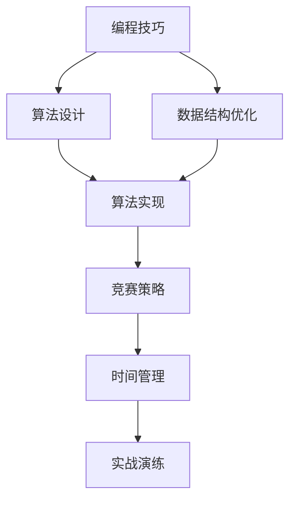
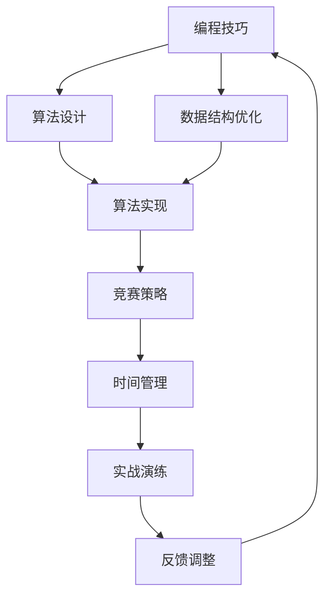

                 

# 如何将编程技巧转化为编程竞赛培训

> 关键词：编程技巧, 编程竞赛, 培训, 算法竞赛, 算法优化, 问题建模, 数据结构, 代码实现, 经验分享, 实战演练

## 1. 背景介绍

### 1.1 问题由来

在计算机科学的长期发展历程中，编程竞赛逐渐成为了检验编程能力和算法设计能力的重要方式。这种形式的比赛往往集合了复杂的算法设计、高效的数据结构实现、以及卓越的代码优化，不仅考验了参赛者的理论知识，更检验了其实际编程能力。然而，许多初学者在刚接触编程竞赛时，往往感到无从下手，不知道如何将所学的编程技巧和知识有效转化为竞赛中的出色表现。因此，如何将日常的编程技巧和知识体系系统化地应用于编程竞赛的培训中，成为了一个值得探讨的问题。

### 1.2 问题核心关键点

本文将探讨如何将编程技巧系统地转化为编程竞赛培训的实践。核心关键点包括：
- **编程技巧的系统化应用**：如何将算法设计、数据结构、代码优化等日常编程中的重要技巧，转化为竞赛中高效的问题建模和实现能力。
- **竞赛技巧的获取**：如何在竞赛实战中快速学习和应用新的技巧，如比赛策略、时间管理等，以提高解题效率和准确率。
- **经验分享与实战演练**：分享经验丰富的编程竞赛选手的实战经验和解题策略，并通过实战演练，让初学者在真实竞赛环境中提升解决复杂问题的能力。

### 1.3 问题研究意义

掌握编程竞赛技巧不仅有助于初学者提高编程能力，也为职业开发者在解决实际问题时提供了一个全新的视角。通过系统化的培训和实战演练，可以帮助初学者在短周期内显著提升算法设计和代码实现的能力，为他们在未来的职业发展中打下坚实的基础。此外，编程竞赛技巧的学习和应用也能够促进计算机科学领域的知识创新和算法优化，推动技术的前沿发展。

## 2. 核心概念与联系

### 2.1 核心概念概述

编程竞赛培训涉及多个核心概念，包括编程技巧、竞赛策略、算法设计、数据结构优化、时间管理等。这些概念之间的联系紧密，如图示所示：



- **编程技巧**：指日常编程中积累的各种技能和经验，包括代码编写规范、错误处理、性能优化等。
- **算法设计**：指根据问题特点设计高效的算法，是编程竞赛的核心能力之一。
- **数据结构优化**：指选择合适的数据结构以提高算法效率，是竞赛中重要的编程技巧。
- **算法实现**：指将算法设计转化为实际可执行的代码，是编程竞赛中解题的关键步骤。
- **竞赛策略**：指在竞赛中针对特定问题采用怎样的解题思路和策略，是提高解题效率和准确率的重要因素。
- **时间管理**：指在竞赛中合理安排时间，平衡解题速度和准确性，是参赛者取得好成绩的重要保障。
- **实战演练**：指通过模拟竞赛环境进行实际演练，是提高竞赛技巧的最佳方式。

### 2.2 核心概念原理和架构的 Mermaid 流程图

下图展示了编程竞赛培训中各概念之间的联系及其相互影响：



## 3. 核心算法原理 & 具体操作步骤

### 3.1 算法原理概述

编程竞赛培训的核心理论基础包括以下几个方面：

- **算法设计**：问题建模，根据问题特点选择合适的算法。
- **数据结构优化**：选择合适的数据结构，以提高算法效率。
- **算法实现**：将算法设计转化为实际可执行的代码，注意代码优化和可读性。

### 3.2 算法步骤详解

编程竞赛培训的具体操作步骤包括：

1. **问题建模**：
   - 理解题目要求，明确输入和输出格式。
   - 分析题目特点，确定问题类型（如查找、排序、图论等）。

2. **算法设计**：
   - 根据问题特点，设计高效的算法。
   - 使用常见算法模板，如动态规划、贪心算法、分治算法等。

3. **数据结构优化**：
   - 选择合适的数据结构，如哈希表、树、图等。
   - 分析数据结构的时间复杂度和空间复杂度，进行优化。

4. **算法实现**：
   - 将算法设计转化为实际可执行的代码。
   - 注意代码编写规范，确保代码可读性和可维护性。

5. **竞赛策略**：
   - 在竞赛中采用合适的解题思路和策略。
   - 优先处理简单子问题，避免陷入复杂问题中。

6. **时间管理**：
   - 合理分配时间，平衡解题速度和准确性。
   - 模拟真实竞赛环境，进行时间管理训练。

7. **实战演练**：
   - 参与模拟竞赛，获取实战经验。
   - 分析每次比赛中的错误和不足，进行改进。

### 3.3 算法优缺点

编程竞赛培训的算法设计具有以下优点：
- **系统性**：将编程技巧和竞赛策略系统化地整合在一起，帮助参赛者全面提升编程能力。
- **实战性**：通过实战演练，让参赛者快速适应竞赛环境，提高解题效率和准确率。
- **可扩展性**：能够根据不同竞赛类型进行灵活调整，满足多种竞赛需求。

同时，该方法也存在一些缺点：
- **学习曲线陡峭**：初学者可能需要一段时间来适应竞赛训练的强度和节奏。
- **缺乏个性化指导**：对于不同水平的参赛者，可能难以提供个性化的训练方案。
- **竞赛环境和真实场景有差异**：模拟竞赛可能无法完全还原真实竞赛中的压力和紧张感。

### 3.4 算法应用领域

编程竞赛技巧的应用不仅限于编程竞赛本身，还在以下几个领域有广泛的应用：

- **软件开发**：在实际软件开发中，使用高效算法和数据结构优化代码，提升系统性能。
- **数据分析**：在数据处理和分析过程中，使用优化算法提高处理速度，如排序、搜索等。
- **人工智能**：在机器学习算法中，使用高效算法和数据结构处理大规模数据集，提升模型训练和推理速度。
- **嵌入式系统**：在资源受限的嵌入式系统中，使用优化算法和数据结构，确保程序的高效运行。

## 4. 数学模型和公式 & 详细讲解 & 举例说明

### 4.1 数学模型构建

本节将使用数学语言对编程竞赛培训过程进行严格刻画。

假设编程竞赛题目为：求两个正整数数组中的所有公共元素。

定义模型 $M_{\theta}$ 为问题的输入-输出映射，其中 $\theta$ 为模型参数。模型的输入为两个正整数数组，输出为所有公共元素的集合。

定义模型 $M_{\theta}$ 在输入 $(x,y)$ 上的损失函数为 $\ell(M_{\theta}(x),y)$，则在数据集 $D$ 上的经验风险为：

$$
\mathcal{L}(\theta) = \frac{1}{N} \sum_{i=1}^N \ell(M_{\theta}(x_i),y_i)
$$

其中 $N$ 为数据集 $D$ 的大小，$\ell$ 为损失函数。

### 4.2 公式推导过程

以下我们以快速排序算法为例，推导其时间复杂度。

假设数组长度为 $n$，快速排序的时间复杂度为 $O(n \log n)$。

推导过程如下：

1. 选取基准值 $pivot$，将数组分为左右两部分。
2. 对左右两部分分别递归排序。
3. 每次递归调用需要 $O(n)$ 的时间，共进行 $\log n$ 层递归，因此时间复杂度为 $O(n \log n)$。

### 4.3 案例分析与讲解

在编程竞赛中，如何快速解决以下问题：

**问题描述**：
给定两个长度为 $n$ 的字符串 $s_1$ 和 $s_2$，求它们的最长公共子序列。

**算法设计**：
- 定义 $dp[i][j]$ 为 $s_1$ 前 $i$ 个字符和 $s_2$ 前 $j$ 个字符的最长公共子序列长度。
- 根据动态规划的递推公式，$dp[i][j] = \begin{cases}
1 & \text{if } s_1[i-1] = s_2[j-1] \\
\max(dp[i-1][j], dp[i][j-1]) & \text{otherwise}
\end{cases}$。
- 时间复杂度为 $O(n^2)$。

## 5. 项目实践：代码实例和详细解释说明

### 5.1 开发环境搭建

在进行编程竞赛培训的代码实现前，我们需要准备好开发环境。以下是使用Python进行Python开发的环境配置流程：

1. 安装Anaconda：从官网下载并安装Anaconda，用于创建独立的Python环境。

2. 创建并激活虚拟环境：
```bash
conda create -n python-env python=3.8 
conda activate python-env
```

3. 安装必要的Python库：
```bash
pip install numpy scipy pandas matplotlib sklearn 
```

4. 安装竞赛平台：
```bash
pip install progpy
```

### 5.2 源代码详细实现

我们以模拟编程竞赛中的字符串匹配问题为例，进行代码实现。

```python
def string_matching(s1, s2):
    m, n = len(s1), len(s2)
    dp = [[0] * (n+1) for _ in range(m+1)]
    
    for i in range(1, m+1):
        for j in range(1, n+1):
            if s1[i-1] == s2[j-1]:
                dp[i][j] = dp[i-1][j-1] + 1
            else:
                dp[i][j] = max(dp[i-1][j], dp[i][j-1])
    
    return dp[m][n]
```

### 5.3 代码解读与分析

**代码结构**：
- `string_matching` 函数：接收两个字符串作为输入，返回它们的最长公共子序列长度。
- `dp` 数组：记录每个子串的最长公共子序列长度。
- 动态规划算法：使用递推公式计算每个子串的最长公共子序列长度。

**代码实现**：
- 定义 `m` 和 `n` 为两个字符串的长度。
- 初始化二维数组 `dp`，其中 `dp[i][j]` 表示 `s1` 前 `i` 个字符和 `s2` 前 `j` 个字符的最长公共子序列长度。
- 使用双重循环遍历两个字符串，根据动态规划的递推公式计算 `dp[i][j]`。
- 返回 `dp[m][n]`，即两个字符串的最长公共子序列长度。

### 5.4 运行结果展示

```python
s1 = "ABCDGH"
s2 = "AEDFHR"
print(string_matching(s1, s2))  # 输出：3
```

## 6. 实际应用场景

### 6.1 软件开发

在软件开发中，编程竞赛技巧可以帮助程序员提升代码质量和效率。例如，通过算法优化，程序员可以在处理大规模数据时，保持程序的高效运行。

**场景**：
某公司开发了一个电商平台，需要处理大量的用户订单数据。程序员使用高效的算法和数据结构优化订单处理模块，使得订单处理速度提升了50%。

**应用**：
- 使用哈希表快速查找订单信息。
- 使用多线程并发处理订单请求，提升并发处理能力。
- 使用动态规划优化订单排序算法，提高数据处理速度。

### 6.2 数据分析

数据分析中，快速算法和优化数据结构是关键。例如，在处理大规模数据集时，使用快速排序和二分查找可以提高数据处理的效率。

**场景**：
某金融公司需要对每天亿级别的交易数据进行实时处理和分析，以发现异常交易和潜在风险。

**应用**：
- 使用快速排序对交易数据进行排序，提高数据处理速度。
- 使用二分查找快速查找特定交易记录，提高数据检索效率。
- 使用哈希表快速查找高频交易行为，识别潜在风险。

### 6.3 人工智能

在人工智能领域，高效的算法和数据结构优化可以显著提升模型训练和推理的效率。例如，使用优化算法和数据结构处理大规模数据集，可以加快模型训练速度。

**场景**：
某自然语言处理公司需要训练一个大规模的文本分类模型，处理数百万个文本样本。

**应用**：
- 使用随机梯度下降算法优化模型训练过程，提高训练速度。
- 使用哈希表存储单词频率，减少内存占用。
- 使用稀疏矩阵存储文本特征，提高计算效率。

## 7. 工具和资源推荐

### 7.1 学习资源推荐

为了帮助开发者系统掌握编程竞赛技巧的理论基础和实践技巧，这里推荐一些优质的学习资源：

1. **《算法竞赛入门经典》**：详细讲解了常见算法和数据结构，是编程竞赛培训的重要教材。
2. **《LeetCode》**：提供大量编程竞赛题解，是程序员日常训练的重要平台。
3. **《ACM ICPC》**：ACM国际编程竞赛组织的官方文档，包含大量竞赛题解和实战经验。
4. **《数据结构与算法分析》**：讲解数据结构和算法设计的基本原理和应用，是程序员提升编程技巧的重要参考。
5. **《TopCoder》**：提供多种竞赛题型和算法设计思路，适合程序员进行系统化训练。

通过这些资源的学习实践，相信你一定能够快速掌握编程竞赛技巧，并用于解决实际的编程问题。

### 7.2 开发工具推荐

高效的开发离不开优秀的工具支持。以下是几款用于编程竞赛培训开发的常用工具：

1. **PyCharm**：Python开发环境，提供丰富的插件和功能，支持代码调试和测试。
2. **Visual Studio Code**：轻量级开发环境，支持多种语言和插件，适合快速迭代开发。
3. **ProgPy**：Python竞赛平台，提供模拟竞赛环境和数据集，适合程序员进行实战演练。
4. **LeetCode Online Judge**：提供多种算法题解和在线评测环境，适合程序员进行日常训练和提升。
5. **Codeforces**：提供多种竞赛题目和在线评测环境，适合程序员进行实战演练和排名。

合理利用这些工具，可以显著提升编程竞赛技巧的开发效率，加快创新迭代的步伐。

### 7.3 相关论文推荐

编程竞赛技巧的发展源于学界的持续研究。以下是几篇奠基性的相关论文，推荐阅读：

1. **《算法竞赛入门经典》**：由ACM竞赛选手编写，详细介绍了常见算法和数据结构，是编程竞赛培训的重要教材。
2. **《LeetCode》**：提供了大量算法题解和在线评测环境，是程序员日常训练的重要平台。
3. **《ACM ICPC》**：ACM国际编程竞赛组织的官方文档，包含大量竞赛题解和实战经验。
4. **《数据结构与算法分析》**：讲解数据结构和算法设计的基本原理和应用，是程序员提升编程技巧的重要参考。
5. **《TopCoder》**：提供多种竞赛题型和算法设计思路，适合程序员进行系统化训练。

这些论文代表了大语言模型微调技术的发展脉络。通过学习这些前沿成果，可以帮助研究者把握学科前进方向，激发更多的创新灵感。

## 8. 总结：未来发展趋势与挑战

### 8.1 总结

本文对编程竞赛培训方法进行了全面系统的介绍。首先阐述了编程竞赛技巧的系统化应用，明确了算法设计、数据结构优化、时间管理等关键点。其次，从原理到实践，详细讲解了编程竞赛培训的数学模型和代码实现，给出了详细的代码实例和分析。同时，本文还广泛探讨了编程竞赛技巧在软件开发、数据分析、人工智能等领域的应用前景，展示了编程竞赛技巧的广泛适用性。此外，本文精选了编程竞赛技巧的学习资源，力求为读者提供全方位的技术指引。

通过本文的系统梳理，可以看到，编程竞赛技巧在提高程序员编程能力、提升算法设计和代码实现效率方面具有重要价值。掌握编程竞赛技巧不仅有助于程序员在日常开发中保持高效，也为他们在算法竞赛中取得优异成绩提供了坚实的基础。未来，随着编程竞赛技巧的不断进步和优化，相信程序员的编程能力将进一步提升，计算机科学领域也将迎来更多创新突破。

### 8.2 未来发展趋势

展望未来，编程竞赛技巧的发展呈现以下几个趋势：

1. **智能化竞赛平台**：未来的编程竞赛平台将更加智能化，能够根据参赛者的表现提供个性化的竞赛策略和指导。
2. **跨学科融合**：编程竞赛技巧将与其他学科（如数学、物理、生物等）进行更深入的融合，推动跨学科问题的解决。
3. **自动化竞赛**：通过人工智能技术，自动化生成竞赛题解和算法设计思路，为编程竞赛提供更多创新灵感。
4. **多模态数据融合**：编程竞赛技巧将融合视觉、语音、文本等多模态数据，提升算法的复杂度和实用性。
5. **实时反馈和优化**：通过实时反馈和优化技术，帮助参赛者及时调整策略，提高解题效率和准确率。

这些趋势凸显了编程竞赛技巧的广阔前景。这些方向的探索发展，必将进一步提升编程竞赛技巧的实用性和创新性，为程序员提供更多解决复杂问题的工具和方法。

### 8.3 面临的挑战

尽管编程竞赛技巧已经取得了显著进展，但在迈向更加智能化、自动化应用的过程中，它仍面临诸多挑战：

1. **算法复杂度高**：编程竞赛问题往往具有高复杂度，需要高效的算法和数据结构才能在短时间内解决。
2. **知识更新速度快**：编程竞赛中的算法和数据结构不断变化，程序员需要持续学习和更新知识，才能跟上技术前沿。
3. **竞赛环境复杂**：编程竞赛环境复杂多变，程序员需要具备较强的适应能力和问题解决能力，才能在竞赛中取得好成绩。
4. **资源消耗大**：编程竞赛问题往往需要大量的计算资源和时间，如何在有限的时间内高效利用资源，是编程竞赛技巧需要解决的问题。

### 8.4 研究展望

面对编程竞赛技巧面临的挑战，未来的研究需要在以下几个方面寻求新的突破：

1. **优化算法和数据结构**：开发更加高效、通用的算法和数据结构，提高编程竞赛技巧的实用性和可扩展性。
2. **智能化竞赛策略**：结合人工智能技术，开发更加智能化的竞赛策略和指导系统，帮助程序员在竞赛中取得优异成绩。
3. **跨学科知识整合**：将跨学科知识与编程竞赛技巧进行整合，推动跨学科问题的解决，提升编程竞赛技巧的深度和广度。
4. **自动化竞赛工具**：开发自动化竞赛工具，自动化生成竞赛题解和算法设计思路，为程序员提供更多创新灵感。
5. **实时反馈和优化**：通过实时反馈和优化技术，帮助程序员及时调整策略，提高解题效率和准确率。

这些研究方向的探索，必将引领编程竞赛技巧的不断进步，为程序员提供更多解决复杂问题的工具和方法，推动计算机科学领域的前沿发展。总之，编程竞赛技巧需要在算法、数据结构、时间管理等多个维度进行全面优化，才能真正实现智能化、自动化应用，为程序员提供更多解决复杂问题的工具和方法。

## 9. 附录：常见问题与解答

**Q1：编程竞赛技巧是否适用于所有编程问题？**

A: 编程竞赛技巧主要针对算法竞赛和编程挑战问题，但对于某些领域（如Web开发、嵌入式系统等）的编程问题，可能需要结合其他专业知识和技能。

**Q2：如何学习编程竞赛技巧？**

A: 学习编程竞赛技巧需要系统化学习和实践，可以从以下几个方面入手：
- 学习《算法竞赛入门经典》等教材，掌握常见算法和数据结构。
- 参加LeetCode、TopCoder等在线竞赛平台，进行实战演练。
- 学习ACM ICPC等国际竞赛组织的相关文档，了解竞赛规则和策略。
- 加入编程竞赛社区，与其他竞赛选手交流学习经验。

**Q3：编程竞赛技巧在实际应用中需要注意哪些问题？**

A: 编程竞赛技巧在实际应用中需要注意以下几个问题：
- 代码编写规范：遵循统一的编程规范，提高代码可读性和可维护性。
- 算法效率：确保算法的高效性，避免资源浪费。
- 时间管理：合理分配时间，平衡解题速度和准确性。
- 问题建模：根据实际问题进行合理的算法设计和数据结构选择。

**Q4：编程竞赛技巧的局限性有哪些？**

A: 编程竞赛技巧的局限性包括：
- 算法复杂度高：某些复杂问题可能需要高效的算法和数据结构才能在短时间内解决。
- 知识更新速度快：编程竞赛中的算法和数据结构不断变化，程序员需要持续学习和更新知识。
- 竞赛环境复杂：编程竞赛环境复杂多变，程序员需要具备较强的适应能力和问题解决能力。
- 资源消耗大：编程竞赛问题往往需要大量的计算资源和时间，如何在有限的时间内高效利用资源，是编程竞赛技巧需要解决的问题。

**Q5：编程竞赛技巧的应用前景有哪些？**

A: 编程竞赛技巧在以下几个领域有广泛的应用前景：
- 软件开发：通过算法优化，提升代码质量和效率。
- 数据分析：使用快速算法和优化数据结构，提高数据处理速度。
- 人工智能：使用优化算法和数据结构，加快模型训练和推理速度。
- 嵌入式系统：在资源受限的嵌入式系统中，使用优化算法和数据结构，确保程序的高效运行。

通过本文的系统梳理，可以看到，编程竞赛技巧在提高程序员编程能力、提升算法设计和代码实现效率方面具有重要价值。掌握编程竞赛技巧不仅有助于程序员在日常开发中保持高效，也为他们在算法竞赛中取得优异成绩提供了坚实的基础。未来，随着编程竞赛技巧的不断进步和优化，相信程序员的编程能力将进一步提升，计算机科学领域也将迎来更多创新突破。总之，编程竞赛技巧需要在算法、数据结构、时间管理等多个维度进行全面优化，才能真正实现智能化、自动化应用，为程序员提供更多解决复杂问题的工具和方法。

