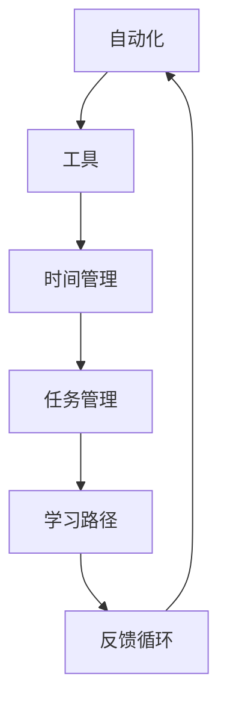

                 

# 如何将编程技能应用于个人效率提升

> 关键词：个人效率提升, 编程技能, 自动化, 工具, 时间管理, 任务管理, 学习路径

## 1. 背景介绍

在信息爆炸的时代，个人效率的提升成为了人们迫切需要解决的问题。编程技能，作为一种强大的工具，在提高个人效率方面有着不可替代的作用。无论是在工作、学习，还是在日常生活中，编程都能够帮助我们自动化繁复的任务，优化决策过程，提高处理信息的效率。本文将深入探讨如何将编程技能应用于个人效率提升，详细介绍相关核心概念、算法原理、操作步骤，并通过案例分析、代码实例等形式，展现编程技能在提高个人效率方面的实际应用。

## 2. 核心概念与联系

### 2.1 核心概念概述

为了更好地理解编程技能在个人效率提升中的应用，我们首先需要明确几个关键概念：

- **自动化(Automation)**：指利用编程技能自动执行重复性高的任务，减少手动操作。例如，可以使用脚本自动化日常办公流程，提高工作效率。

- **工具(Tools)**：指利用现成的编程工具或库，快速实现特定功能。例如，使用Git进行版本控制，使用Jupyter Notebook进行数据分析等。

- **时间管理(Time Management)**：指通过编程优化时间分配，提高工作和学习效率。例如，使用时间跟踪器分析工作模式，优化工作时间分配。

- **任务管理(Task Management)**：指使用编程实现任务自动化和调度，提高任务处理的效率和质量。例如，使用任务队列管理并行任务，使用脚本调度自动化任务执行。

- **学习路径(Learning Path)**：指根据个人需求和学习目标，通过编程实现有针对性的知识积累和学习路径规划。例如，通过编写学习日志，记录学习进度和效果，评估学习效果。

这些概念之间有着密切的联系，形成一个完整的系统，共同提升个人效率。下面，我们将使用Mermaid流程图展示这些概念之间的联系：



## 3. 核心算法原理 & 具体操作步骤

### 3.1 算法原理概述

将编程技能应用于个人效率提升，本质上是一个利用编程技术优化工作流程、提高信息处理效率的过程。其核心思想是利用计算机自动化处理任务，减少手动操作，提高任务处理的准确性和速度。

形式化地，我们可以定义一个函数$f(\text{input}, \text{task})$，表示将输入数据$\text{input}$通过特定的任务$\text{task}$进行处理的过程。在函数$f$中，我们可以利用各种编程工具和库，对输入数据进行高效的计算和处理，从而实现自动化的任务执行。

### 3.2 算法步骤详解

将编程技能应用于个人效率提升，通常包括以下几个关键步骤：

**Step 1: 确定效率瓶颈**

首先，需要明确个人或团队在哪些方面存在效率瓶颈。这通常包括重复性高的任务、数据处理、任务调度、决策分析等。通过识别这些瓶颈，可以明确需要优化和自动化的方向。

**Step 2: 选择合适的工具和技术**

根据效率瓶颈，选择合适的编程工具和技术。例如，对于数据处理任务，可以使用Pandas、NumPy等库进行高效的数据分析和处理；对于任务调度，可以使用Celery、Dask等库进行任务队列管理。

**Step 3: 设计算法和代码**

在明确需求和选择工具的基础上，设计具体的算法和代码实现。这一步需要考虑算法效率、代码可读性和可维护性等因素，以确保程序能够高效、稳定地运行。

**Step 4: 测试和优化**

在设计和实现算法和代码后，进行全面的测试，确保程序能够正确处理各种情况。测试过程中，需要记录程序的性能指标，根据测试结果进行优化，提高程序的效率和准确性。

**Step 5: 部署和监控**

将优化后的程序部署到实际环境中，并设置监控机制，实时跟踪程序运行状态和性能指标。根据监控结果，及时调整程序参数和优化策略，确保程序能够长期稳定运行。

### 3.3 算法优缺点

利用编程技能提升个人效率具有以下优点：

- **高效性**：编程能够自动处理大量重复性任务，显著提高工作效率。
- **灵活性**：编程技术可以根据具体需求进行灵活定制，满足各种复杂场景的需求。
- **可扩展性**：编程技能可以与其他技术（如机器学习、人工智能等）结合，实现更高级别的自动化和智能化。

然而，也存在一些缺点：

- **学习成本**：编程技能需要一定的学习成本，需要投入时间和精力进行学习和实践。
- **技术门槛**：对于缺乏编程基础的个人，可能存在一定的技术门槛。
- **维护成本**：程序需要定期维护和更新，以保证其稳定性和安全性。

### 3.4 算法应用领域

编程技能在个人效率提升中的应用领域非常广泛，包括但不限于以下几个方面：

- **工作流程自动化**：使用脚本和自动化工具，实现日常办公流程的自动化，如文档管理、邮件处理、任务分配等。
- **数据分析和处理**：使用Python、R等编程语言，进行大数据分析和处理，提取有价值的信息。
- **任务调度和管理**：使用Celery、Dask等库，实现任务队列管理，提高任务处理的效率和灵活性。
- **机器学习和AI**：利用编程技能，实现机器学习和AI算法的开发和部署，提升决策和分析的智能化水平。
- **时间管理和个人发展**：通过编写学习日志、时间跟踪器等程序，优化时间分配，促进个人发展。

## 4. 数学模型和公式 & 详细讲解

### 4.1 数学模型构建

在编程技能应用于个人效率提升的过程中，我们可以构建一个基于时间和任务的管理模型。设个人工作时间为$T$，总任务量为$N$，每项任务的时间为$t_i$，优先级为$p_i$（$0 \leq p_i \leq 1$，$p_i=1$表示最高优先级）。模型的目标是最大化有效工作时间，即总任务完成时间与总工作时间的差值，记为$E$。

目标函数为：
$$
\max \sum_{i=1}^{N} p_i t_i
$$
约束条件为：
$$
\sum_{i=1}^{N} p_i t_i \leq T
$$
$$
0 \leq p_i \leq 1
$$

### 4.2 公式推导过程

对于上述模型，我们可以使用动态规划的方法进行求解。首先，定义$v_i$表示前$i$项任务完成时，剩余时间的期望有效工作量。则目标函数可以表示为：
$$
\max \sum_{i=1}^{N} v_i
$$

根据约束条件，可以推导出递推关系：
$$
v_i = \max_{j=1}^{i-1} \{ v_j + (1-p_j) t_i \}
$$

其中，$v_0 = 0$。通过递推关系，我们可以求得$v_N$，即整个任务完成的期望有效工作量。最后，根据$v_N$和总工作时间$T$，可以计算出有效工作时间$E$。

### 4.3 案例分析与讲解

假设某个人一天有8小时的工作时间，需要完成三项任务A、B、C，每项任务的时间分别为2小时、3小时和3小时，优先级分别为0.8、0.7和0.9。我们可以使用上述模型进行求解，得到最优的任务分配方案和时间管理策略。

使用Python和Sympy库，我们可以编写以下代码：

```python
from sympy import symbols, Max, Rational

# 定义变量
T = 8  # 总工作时间
t = [2, 3, 3]  # 每项任务的时间
p = [Rational(8, 10), Rational(7, 10), Rational(9, 10)]  # 每项任务的优先级

# 定义递推关系
def v(i, j):
    if j == 0:
        return 0
    else:
        return Max(v(i, j-1) + (1-p[j-1]) * t[i])

# 计算v_N
v_N = max([v(T, i) for i in range(len(t))])

# 输出结果
print(f"最优期望有效工作量为: {v_N}")
```

通过上述代码，我们可以计算得到最优期望有效工作量，从而制定出合理的时间管理和任务分配策略，提高个人效率。

## 5. 项目实践：代码实例和详细解释说明

### 5.1 开发环境搭建

在进行编程技能应用于个人效率提升的项目实践前，我们需要准备好开发环境。以下是使用Python进行开发的环境配置流程：

1. 安装Anaconda：从官网下载并安装Anaconda，用于创建独立的Python环境。

2. 创建并激活虚拟环境：
```bash
conda create -n pyenv python=3.8 
conda activate pyenv
```

3. 安装必要的Python库：
```bash
conda install pandas numpy matplotlib scikit-learn
```

4. 安装Git进行版本控制：
```bash
conda install git
```

5. 安装Jupyter Notebook进行交互式编程：
```bash
conda install jupyterlab
```

6. 安装Python IDE：
```bash
conda install pycharm
```

完成上述步骤后，即可在`pyenv`环境中进行项目实践。

### 5.2 源代码详细实现

以下是使用Python实现时间管理和任务调度的示例代码。

**任务队列管理**

```python
from celery import Celery

# 初始化任务队列
app = Celery('tasks', broker='redis://localhost:6379/0')

@app.task
def add(x, y):
    return x + y

# 提交任务
result = add.delay(2, 3)
print(result.get())
```

**时间跟踪器**

```python
import time

# 定义时间跟踪器类
class TimeTracker:
    def __init__(self):
        self.start_time = time.time()
        self.end_time = 0

    def start(self):
        self.start_time = time.time()

    def stop(self):
        self.end_time = time.time()

    def elapsed_time(self):
        return self.end_time - self.start_time

# 使用时间跟踪器
tracker = TimeTracker()
tracker.start()
# 执行任务
# ...
tracker.stop()
print(f"任务执行时间: {tracker.elapsed_time()}")
```

**学习日志**

```python
import datetime

# 定义学习日志类
class LearningLog:
    def __init__(self):
        self.logs = []

    def add_log(self, date, subject, time_spent):
        self.logs.append((date, subject, time_spent))

    def get_logs(self):
        return self.logs

# 使用学习日志
log = LearningLog()
log.add_log(datetime.date.today(), 'Python编程', 2)
log.add_log(datetime.date.today(), '数据分析', 3)
print(f"学习日志: {log.get_logs()}")
```

### 5.3 代码解读与分析

让我们再详细解读一下关键代码的实现细节：

**任务队列管理**

- `Celery`：Python的异步任务队列管理库，支持分布式任务执行，适合处理高并发场景。
- `@task`装饰器：将函数注册为异步任务。
- `delay`方法：将任务放入队列，等待执行。
- `get`方法：获取任务的执行结果。

**时间跟踪器**

- `time`模块：Python内置的时间处理模块，提供时间戳操作。
- `start`方法：记录开始时间。
- `stop`方法：记录结束时间。
- `elapsed_time`方法：计算任务执行时间。

**学习日志**

- `datetime`模块：Python内置的日期和时间处理模块，提供日期操作。
- `add_log`方法：添加学习日志。
- `get_logs`方法：获取学习日志列表。

这些代码展示了如何利用编程技能实现时间管理和任务调度，通过自动化处理任务，提高个人效率。

## 6. 实际应用场景

### 6.1 自动化日常办公

在职场中，重复性高的办公任务（如数据录入、邮件处理、报告生成等）常常占据大量时间。通过编程实现这些任务的自动化，可以显著提高工作效率。例如，使用Python编写脚本，自动抓取并处理邮件，提取关键信息，生成定期报告。

### 6.2 数据分析与报告

数据分析是许多行业的核心工作，特别是在金融、市场营销等领域。使用Python和R等语言，结合Pandas、NumPy等库，可以高效地进行数据分析和处理，提取有价值的信息，生成报表和可视化图表，辅助决策。

### 6.3 项目管理和任务调度

项目管理是提高团队效率的关键。通过编程实现项目任务管理和调度，可以更好地协调团队资源，优化工作流程。例如，使用Celery、Dask等工具，实现任务队列管理和调度，提高任务处理效率。

### 6.4 时间管理和个人发展

时间管理是提升个人效率的重要环节。通过编程实现时间跟踪和分析，可以更好地掌握工作和学习节奏，优化时间分配，提升个人发展。例如，使用时间跟踪器记录工作和学习时间，使用学习日志分析学习效果，制定学习计划。

## 7. 工具和资源推荐

### 7.1 学习资源推荐

为了帮助开发者系统掌握编程技能在个人效率提升中的应用，这里推荐一些优质的学习资源：

1. **《Python编程：从入门到实践》**：由Eric Matthes著，适合编程初学者，系统介绍了Python编程的基础知识和实践技巧。
2. **Coursera《Python for Everybody》课程**：由密歇根大学开设的入门级Python课程，适合零基础学习者，内容包括Python基础、数据分析等。
3. **Kaggle数据科学竞赛**：Kaggle是一个数据科学竞赛平台，提供丰富的数据集和挑战，适合进阶学习者，提升数据处理和分析能力。
4. **Git官方文档**：Git是一款广泛使用的版本控制系统，Git官方文档详细介绍了Git的使用方法、命令和最佳实践。
5. **Jupyter Notebook官方文档**：Jupyter Notebook是一个交互式编程环境，支持Python、R等语言的编程，官方文档提供了详细的安装和使用指南。

通过对这些资源的学习实践，相信你一定能够快速掌握编程技能在个人效率提升中的应用，并用于解决实际的日常问题。

### 7.2 开发工具推荐

高效的开发离不开优秀的工具支持。以下是几款用于编程技能提升开发的常用工具：

1. **PyCharm**：一款功能强大的Python IDE，支持代码高亮、调试、重构等功能，适合编程学习和项目开发。
2. **Git**：一款广泛使用的版本控制系统，支持分布式协作，适合项目管理、代码版本控制等。
3. **Jupyter Notebook**：一款交互式编程环境，支持Python、R等语言的编程，适合数据科学、机器学习等领域的研究和开发。
4. **Celery**：Python的异步任务队列管理库，支持分布式任务执行，适合处理高并发场景。
5. **Dask**：Python的分布式计算库，支持大规模数据处理和并行计算，适合数据分析和处理任务。
6. **TensorBoard**：TensorFlow配套的可视化工具，支持实时监测模型训练状态，提供丰富的图表呈现方式，适合调试和优化模型。

合理利用这些工具，可以显著提升编程技能在个人效率提升中的应用效率，加快创新迭代的步伐。

### 7.3 相关论文推荐

编程技能在个人效率提升方面的研究始于学界的持续探索。以下是几篇奠基性的相关论文，推荐阅读：

1. **《Efficient Estimation of Word Representations in Vector Space》**：由Mikolov等人在2013年提出的Word2Vec算法，利用神经网络模型进行单词嵌入，广泛应用于自然语言处理领域。
2. **《Neural Machine Translation by Jointly Learning to Align and Translate》**：由Cho等人在2014年提出的神经机器翻译模型，结合注意力机制，实现了高效准确的翻译。
3. **《Deep Learning》**：由Ian Goodfellow等人在2016年出版的深度学习经典教材，详细介绍了深度学习的基础知识和应用案例。
4. **《Python Data Science Handbook》**：由Jake VanderPlas在2016年出版的数据科学实践指南，介绍了Python在数据科学和机器学习中的应用。
5. **《Automated Code Generation for Natural Language Generation》**：由Kazemi等人在2019年提出的代码生成技术，结合自然语言处理和编程语言，实现了自动化生成代码的功能。

这些论文代表了大数据、深度学习和自然语言处理领域的最新进展，展示了编程技能在个人效率提升中的巨大潜力。

## 8. 总结：未来发展趋势与挑战

### 8.1 总结

本文对编程技能在个人效率提升中的应用进行了全面系统的介绍。首先阐述了编程技能在提高个人效率方面的重要作用，明确了应用的核心概念和关键步骤。其次，从原理到实践，详细讲解了编程技能的应用算法和操作步骤，并通过案例分析、代码实例等形式，展示了编程技能在提升个人效率方面的实际应用。

通过本文的系统梳理，可以看到，编程技能在个人效率提升中的应用前景广阔，具备高效性、灵活性和可扩展性等优势。未来，随着编程技术的不断进步和应用场景的不断拓展，编程技能必将成为提升个人效率的重要手段。

### 8.2 未来发展趋势

展望未来，编程技能在个人效率提升中的应用将呈现以下几个发展趋势：

1. **智能化发展**：随着人工智能和机器学习技术的不断进步，编程技能将与AI技术深度融合，实现更加智能化的应用。例如，智能助理、智能推荐系统等。
2. **多模态应用**：编程技能将与视觉、语音等技术结合，实现多模态的信息处理和交互，提升效率和体验。
3. **个性化定制**：通过编程技能实现个性化定制，根据个人需求和工作模式，自动优化任务分配和时间管理策略。
4. **持续学习**：编程技能将与持续学习技术结合，实现自我优化和知识更新，保持高效工作状态。
5. **跨平台集成**：编程技能将与其他平台和服务集成，实现跨设备、跨平台的高效协作和信息共享。

### 8.3 面临的挑战

尽管编程技能在个人效率提升中的应用前景广阔，但在实际应用过程中，仍面临诸多挑战：

1. **学习成本高**：编程技能需要一定的学习成本，需要投入时间和精力进行学习和实践。
2. **技术门槛高**：对于缺乏编程基础的个人，可能存在一定的技术门槛。
3. **数据隐私问题**：在自动化处理数据时，可能涉及隐私和数据安全问题，需要谨慎处理。
4. **系统稳定性**：自动化系统需要高可靠性和稳定性，避免出现系统故障或异常。

### 8.4 研究展望

面对编程技能在个人效率提升中面临的挑战，未来的研究需要在以下几个方面寻求新的突破：

1. **降低学习门槛**：开发更加友好的编程环境和学习工具，降低编程技能的学习门槛，吸引更多用户。
2. **提高系统稳定性**：加强系统设计和技术实现，提高自动化系统的可靠性和稳定性。
3. **保护数据隐私**：在使用编程技能处理数据时，需要加强数据隐私保护，避免数据泄露和滥用。
4. **多模态融合**：探索编程技能与其他技术的融合，实现多模态的信息处理和交互，提升效率和体验。
5. **个性化定制**：结合机器学习技术，实现个性化定制，根据个人需求和工作模式，自动优化任务分配和时间管理策略。

这些研究方向的探索，必将引领编程技能在个人效率提升中的应用走向成熟，为提高个人效率、提升工作效率和生产力提供新的思路和方法。

## 9. 附录：常见问题与解答

**Q1: 学习编程技能需要多长时间？**

A: 学习编程技能需要的时间因人而异，取决于学习目标和个人基础。对于有一定编程基础的初学者，可以通过学习在线课程、阅读书籍等形式，较快地掌握编程基础。对于零基础的初学者，可能需要花费更多时间进行系统学习。

**Q2: 有哪些编程语言值得学习？**

A: 当前值得学习的编程语言有很多，包括Python、Java、C++、JavaScript等。Python因其易学易用、功能强大而受到广泛欢迎，适合初学者入门。Java因其稳定性和应用广泛，适合企业级开发。C++因其高效性能，适合高性能计算和游戏开发。JavaScript因其广泛应用，适合前端开发和Web应用开发。

**Q3: 如何高效学习编程？**

A: 高效学习编程需要注意以下几点：
1. 选择合适的学习资源，如在线课程、书籍、官方文档等。
2. 制定学习计划，分阶段逐步深入学习。
3. 实践为主，多编写代码，多做项目。
4. 加入社区，积极交流和分享。

**Q4: 编程技能在个人效率提升中的应用有哪些案例？**

A: 以下是几个编程技能在个人效率提升中的实际应用案例：
1. **自动化日常办公**：使用Python编写脚本，自动抓取和处理邮件，提取关键信息，生成定期报告。
2. **数据分析与报告**：使用Python和R等语言，结合Pandas、NumPy等库，进行数据分析和处理，提取有价值的信息，生成报表和可视化图表。
3. **项目管理与任务调度**：使用Celery、Dask等工具，实现任务队列管理和调度，提高任务处理效率。
4. **时间管理和个人发展**：使用时间跟踪器记录工作和学习时间，使用学习日志分析学习效果，制定学习计划。

这些案例展示了编程技能在个人效率提升中的广泛应用，通过自动化处理任务，提高个人效率。

**Q5: 如何利用编程技能进行个人时间管理？**

A: 利用编程技能进行个人时间管理，可以通过以下步骤实现：
1. 使用Python编写时间跟踪器，记录每天的工作和学习时间。
2. 分析时间数据，识别时间浪费和不合理的分配。
3. 根据分析结果，调整时间分配，优化工作和学习节奏。
4. 使用学习日志记录学习进度和效果，评估学习效果。

通过这些步骤，可以实现个人时间的高效管理和优化，提高个人效率和生产力。

---

作者：禅与计算机程序设计艺术 / Zen and the Art of Computer Programming

