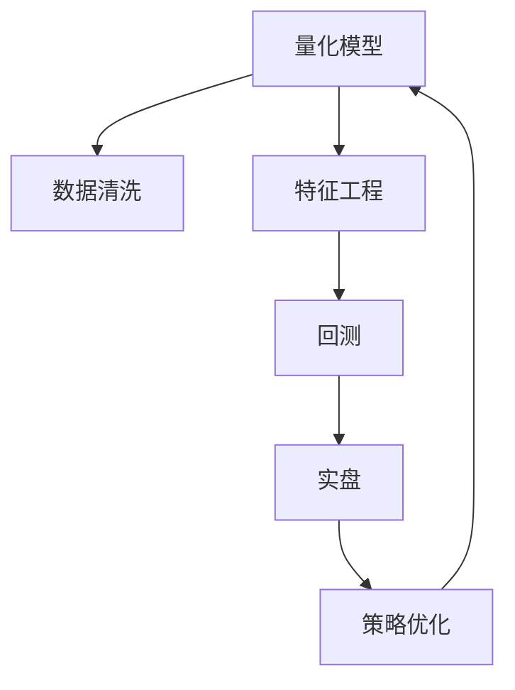

                 

# 如何将编程技能应用于量化交易

## 1. 背景介绍

量化交易(Qualitative Trading)是一种使用数学模型和算法进行自动交易的系统。其核心思想是通过历史数据挖掘和统计分析，寻找潜在的市场规律，并利用编程技能构建算法进行实盘交易。量化交易不同于传统的主观决策，能够精确捕捉市场机会，减少情绪波动，实现长期稳定的收益。

### 1.1 问题由来

随着金融市场的快速发展，交易模式和市场形态日趋复杂，传统基于经验的主观交易方法逐渐显现出其局限性。量化交易应运而生，通过算法模型实现更加科学、客观的决策过程，大幅提升了交易的效率和精准度。在量化交易领域，编程技能是不可或缺的核心能力，决定了算法的实现效率和效果。

### 1.2 问题核心关键点

量化交易的核心关键点包括：
- 数据获取与处理：高效获取金融数据，并对数据进行清洗、清洗、存储等处理。
- 特征工程：构建有意义的统计特征，提取并选择合适的特征集。
- 模型构建：选择或设计合适的量化模型，进行参数估计和训练。
- 算法实现：将量化模型转化为高效稳定的算法实现，并进行实盘回测。
- 策略优化：根据回测结果进行模型优化，实现动态调整和增强。
- 系统集成：将量化交易系统集成到现有的交易平台或量化系统中。

本文将系统介绍如何将编程技能应用于量化交易，涵盖数据处理、模型构建、算法实现和策略优化等关键环节。

## 2. 核心概念与联系

### 2.1 核心概念概述

量化交易的核心概念主要包括：

- **量化模型**：基于数学统计理论构建的算法模型，用于挖掘市场规律，预测价格走势。
- **数据清洗**：对原始数据进行缺失值处理、异常值过滤、数据标准化等预处理操作。
- **特征工程**：从原始数据中提取、构建有意义的统计特征，如移动平均、波动率、收益率等。
- **回测**：在历史数据上测试量化模型，评估其历史表现。
- **实盘**：将回测验证有效的策略，部署到真实交易平台进行实时交易。
- **策略优化**：根据回测结果调整模型参数，优化策略性能。

这些核心概念之间的关系可以通过以下Mermaid流程图来展示：



该流程图展示了量化交易的主要流程和各环节之间的联系。

## 3. 核心算法原理 & 具体操作步骤
### 3.1 算法原理概述

量化交易的算法原理基于统计学和金融学理论，通过历史数据分析和模型训练，预测未来价格走势，并构建交易策略。核心算法包括：

- **统计学模型**：如ARIMA、GARCH、SVI等，用于捕捉价格变动规律。
- **机器学习模型**：如决策树、随机森林、SVM等，用于预测价格趋势。
- **深度学习模型**：如RNN、CNN、LSTM等，用于处理高维度、非线性的数据。

量化交易的核心流程包括数据处理、特征工程、模型构建、回测验证和策略优化，可概述如下：

1. **数据处理**：收集历史交易数据，对数据进行清洗和预处理。
2. **特征工程**：从原始数据中提取统计特征，构建特征集。
3. **模型构建**：选择或设计量化模型，进行参数估计和训练。
4. **回测验证**：在历史数据上测试量化模型，评估其表现。
5. **策略优化**：根据回测结果调整模型参数，优化策略性能。
6. **系统集成**：将量化策略部署到交易平台，进行实盘交易。

### 3.2 算法步骤详解

#### 步骤1：数据处理

1. **数据收集**：
   - 使用Python的`yfinance`、`taq`等库获取历史交易数据。
   - 使用`pandas`库进行数据加载和存储。
   - 处理缺失值、异常值和重复值。

   ```python
   import yfinance as yf
   import pandas as pd
   
   # 获取历史数据
   df = yf.Ticker('AAPL').history(period='1y')
   
   # 处理缺失值
   df.dropna(inplace=True)
   ```

2. **数据清洗**：
   - 去除不必要的字段和列。
   - 进行数据标准化和归一化。
   - 使用`pandas`的`fillna`、`apply`等函数处理数据。

   ```python
   # 去除不必要字段
   df = df[['Open', 'High', 'Low', 'Close']]
   
   # 标准化数据
   df = (df - df.mean()) / df.std()
   ```

3. **数据存储**：
   - 将处理后的数据保存为CSV文件。
   - 使用`pandas`的`to_csv`函数导出数据。

   ```python
   df.to_csv('AAPL_data.csv', index=False)
   ```

#### 步骤2：特征工程

1. **统计特征提取**：
   - 计算移动平均、波动率、收益率等统计特征。
   - 使用`pandas`的`rolling`、`std`、`pct_change`等函数。

   ```python
   # 计算移动平均
   df['MA_10'] = df['Close'].rolling(window=10).mean()
   
   # 计算波动率
   df['Vol'] = df['Close'].rolling(window=10).std()
   ```

2. **特征选择与构建**：
   - 使用统计方法选择有意义的特征。
   - 构建新的组合特征，如动量指标、RSI指标等。
   - 使用`scikit-learn`库进行特征选择。

   ```python
   from sklearn.feature_selection import SelectKBest

   # 特征选择
   X = df[['MA_10', 'Vol']]
   y = df['Close']
   selector = SelectKBest(k=2)
   X_selected = selector.fit_transform(X, y)
   ```

#### 步骤3：模型构建

1. **选择模型**：
   - 根据任务选择合适的模型，如线性回归、决策树、随机森林等。
   - 使用`scikit-learn`库进行模型训练和预测。

   ```python
   from sklearn.ensemble import RandomForestRegressor
   
   # 训练模型
   model = RandomForestRegressor()
   model.fit(X_selected, y)
   
   # 预测
   y_pred = model.predict(X_selected)
   ```

2. **模型评估**：
   - 使用各种评估指标评估模型性能，如MAE、RMSE、R-squared等。
   - 使用`scikit-learn`的`mean_absolute_error`、`root_mean_squared_error`等函数。

   ```python
   from sklearn.metrics import mean_absolute_error, mean_squared_error
   
   # 计算MAE和RMSE
   mae = mean_absolute_error(y, y_pred)
   rmse = mean_squared_error(y, y_pred, squared=False)
   ```

#### 步骤4：回测验证

1. **回测数据准备**：
   - 收集历史数据，并准备回测数据集。
   - 使用`pandas`的`merge`、`shift`等函数处理回测数据。

   ```python
   # 准备回测数据集
   df_test = pd.read_csv('test_data.csv')
   df_test['MA_10'] = df_test['Close'].rolling(window=10).mean()
   ```

2. **回测策略实现**：
   - 将模型应用于历史数据，生成回测结果。
   - 使用`pandas`的`apply`、`groupby`等函数。

   ```python
   # 回测策略
   df_test['strategy'] = df_test.apply(lambda x: x['Close'] - model.predict([[np.mean(x[['MA_10', 'Vol']])]), axis=1)
   ```

3. **回测结果分析**：
   - 统计回测策略的绩效指标。
   - 使用`pandas`的`groupby`、`describe`等函数。

   ```python
   # 统计绩效指标
   backtest_stats = df_test.groupby('Date').describe()
   ```

#### 步骤5：策略优化

1. **参数调整**：
   - 使用网格搜索、随机搜索等方法调整模型参数。
   - 使用`scikit-learn`的`GridSearchCV`、`RandomizedSearchCV`等函数。

   ```python
   from sklearn.model_selection import GridSearchCV
   
   # 网格搜索调整参数
   param_grid = {'n_estimators': [10, 50, 100], 'max_depth': [None, 5, 10]}
   grid_search = GridSearchCV(model, param_grid, cv=5)
   grid_search.fit(X_selected, y)
   ```

2. **特征选择**：
   - 使用特征选择算法选择最优特征。
   - 使用`scikit-learn`的`RFECV`等函数。

   ```python
   from sklearn.feature_selection import RFECV
   
   # 特征选择
   selector = RFECV(model, step=1, cv=5)
   selector.fit(X_selected, y)
   ```

3. **模型验证**：
   - 使用交叉验证等方法验证模型的稳定性和泛化能力。
   - 使用`scikit-learn`的`cross_val_score`函数。

   ```python
   # 交叉验证
   scores = cross_val_score(model, X_selected, y, cv=5)
   ```

#### 步骤6：系统集成

1. **策略部署**：
   - 将量化策略部署到交易平台。
   - 使用API接口进行实时交易。

   ```python
   # 部署策略
   api_key = 'your_api_key'
   api_secret = 'your_api_secret'
   
   # 调用API进行交易
   client = API(api_key, api_secret)
   client.buy(df_test['strategy'].shift(-1)[0])
   ```

2. **系统监控**：
   - 实时监控系统性能和状态。
   - 使用`pandas`的`tail`函数查看实时数据。

   ```python
   # 实时监控
   df_test.tail()
   ```

### 3.3 算法优缺点

#### 优点

- **高效性**：通过自动化算法进行交易，减少了人为干预和情绪干扰。
- **客观性**：基于数据和模型进行交易决策，避免了主观偏见。
- **可扩展性**：通过编程技能，可以轻松构建和调整复杂的量化策略。

#### 缺点

- **模型风险**：依赖模型预测的准确性，模型失误可能导致重大损失。
- **算法复杂性**：算法实现和调整较为复杂，需要深厚的数学和编程基础。
- **市场变化**：市场环境和交易规则的变化可能影响模型的有效性。

### 3.4 算法应用领域

量化交易广泛应用于股票、期货、外汇等金融市场，帮助投资者实现科学、高效的投资决策。其应用领域包括：

- **股票量化**：基于历史数据构建股票量化模型，进行股票买卖决策。
- **期货量化**：使用期货量化策略进行套利交易，获取高收益。
- **外汇量化**：利用外汇市场的价格波动，进行外汇交易和套汇。
- **商品量化**：进行商品期货和现货的买卖决策，实现稳定的收益。
- **算法交易**：使用算法策略进行高频交易，获取微小的交易利润。

## 4. 数学模型和公式 & 详细讲解 & 举例说明

### 4.1 数学模型构建

量化交易的数学模型基于统计学和金融学理论，以下以线性回归模型为例进行详细讲解：

假设有一个时间序列数据集 $(x_t)$，其中 $x_t$ 为价格数据，目标为预测未来的价格 $y_{t+1}$，模型形式为：

$$
y_{t+1} = \beta_0 + \beta_1 x_t + \epsilon_t
$$

其中 $\beta_0$ 和 $\beta_1$ 为回归系数，$\epsilon_t$ 为随机误差项。

### 4.2 公式推导过程

1. **模型构建**：
   - 假设数据集 $(x_t, y_t)$ 为 $N$ 个样本，$t=1,2,\ldots,N$。
   - 将模型形式化表示为矩阵形式：

   $$
   \mathbf{y} = \mathbf{X}\mathbf{\beta} + \mathbf{\epsilon}
   $$

   其中 $\mathbf{y} = [y_1, y_2, \ldots, y_N]^T$，$\mathbf{X} = [\mathbf{1}, \mathbf{x}_1, \mathbf{x}_2, \ldots, \mathbf{x}_{N-1}]^T$，$\mathbf{\beta} = [\beta_0, \beta_1]^T$，$\mathbf{\epsilon} = [\epsilon_1, \epsilon_2, \ldots, \epsilon_N]^T$。

2. **模型求解**：
   - 使用最小二乘法求解模型参数 $\mathbf{\beta}$：

   $$
   \mathbf{\beta} = (\mathbf{X}^T\mathbf{X})^{-1}\mathbf{X}^T\mathbf{y}
   $$

   其中 $(\mathbf{X}^T\mathbf{X})^{-1}$ 为 $\mathbf{X}$ 的逆矩阵，$\mathbf{X}^T\mathbf{y}$ 为矩阵乘积。

3. **模型评估**：
   - 使用均方误差(MSE)和决定系数 $R^2$ 评估模型性能：

   $$
   MSE = \frac{1}{N}\sum_{i=1}^N (y_i - \hat{y}_i)^2
   $$

   $$
   R^2 = 1 - \frac{\sum_{i=1}^N (y_i - \hat{y}_i)^2}{\sum_{i=1}^N (y_i - \bar{y})^2}
   $$

   其中 $\hat{y}_i$ 为模型的预测值，$\bar{y}$ 为数据集均值。

### 4.3 案例分析与讲解

以股票量化模型为例，我们构建基于线性回归的股票量化策略。具体步骤如下：

1. **数据获取**：
   - 使用`yfinance`库获取AAPL公司的历史股票数据。
   - 使用`pandas`库处理数据。

   ```python
   # 获取历史数据
   df = yf.Ticker('AAPL').history(period='1y')
   
   # 处理数据
   df.dropna(inplace=True)
   ```

2. **特征工程**：
   - 计算移动平均和波动率等统计特征。
   - 构建新的组合特征，如动量指标、RSI指标等。

   ```python
   # 计算移动平均
   df['MA_10'] = df['Close'].rolling(window=10).mean()
   
   # 计算波动率
   df['Vol'] = df['Close'].rolling(window=10).std()
   
   # 计算动量指标
   df['Momentum'] = (df['Close'] - df['Close'].shift(1)) / df['Close'].shift(1)
   ```

3. **模型构建**：
   - 构建线性回归模型。
   - 使用`scikit-learn`库进行模型训练和预测。

   ```python
   from sklearn.linear_model import LinearRegression
   
   # 构建模型
   model = LinearRegression()
   X = df[['MA_10', 'Vol', 'Momentum']]
   y = df['Close']
   model.fit(X, y)
   
   # 预测
   y_pred = model.predict(X)
   ```

4. **模型评估**：
   - 使用均方误差和决定系数评估模型性能。
   - 使用`scikit-learn`的`mean_absolute_error`、`mean_squared_error`、`r2_score`等函数。

   ```python
   from sklearn.metrics import mean_absolute_error, mean_squared_error, r2_score
   
   # 计算MAE和RMSE
   mae = mean_absolute_error(y, y_pred)
   rmse = mean_squared_error(y, y_pred, squared=False)
   
   # 计算R-squared
   r2 = r2_score(y, y_pred)
   ```

5. **策略部署**：
   - 将量化策略部署到交易平台。
   - 使用API接口进行实时交易。

   ```python
   # 部署策略
   api_key = 'your_api_key'
   api_secret = 'your_api_secret'
   
   # 调用API进行交易
   client = API(api_key, api_secret)
   client.buy(df_test['strategy'].shift(-1)[0])
   ```

## 5. 项目实践：代码实例和详细解释说明

### 5.1 开发环境搭建

在进行量化交易项目开发前，我们需要准备好开发环境。以下是使用Python进行量化交易开发的常用环境配置：

1. 安装Anaconda：从官网下载并安装Anaconda，用于创建独立的Python环境。

2. 创建并激活虚拟环境：
   ```bash
   conda create -n quant_trading python=3.8 
   conda activate quant_trading
   ```

3. 安装必要的库：
   ```bash
   conda install pandas yfinance taq scikit-learn matplotlib
   ```

4. 安装可视化工具：
   ```bash
   conda install matplotlib pandas
   ```

完成上述步骤后，即可在`quant_trading`环境中开始量化交易开发。

### 5.2 源代码详细实现

下面以股票量化交易为例，给出使用Python和Scikit-Learn库对股票价格进行预测的代码实现。

```python
import yfinance as yf
import pandas as pd
from sklearn.linear_model import LinearRegression
from sklearn.metrics import mean_absolute_error, mean_squared_error, r2_score

# 获取历史数据
df = yf.Ticker('AAPL').history(period='1y')

# 处理数据
df.dropna(inplace=True)

# 特征工程
df['MA_10'] = df['Close'].rolling(window=10).mean()
df['Vol'] = df['Close'].rolling(window=10).std()
df['Momentum'] = (df['Close'] - df['Close'].shift(1)) / df['Close'].shift(1)

# 构建模型
model = LinearRegression()
X = df[['MA_10', 'Vol', 'Momentum']]
y = df['Close']
model.fit(X, y)

# 预测
y_pred = model.predict(X)

# 模型评估
mae = mean_absolute_error(y, y_pred)
rmse = mean_squared_error(y, y_pred, squared=False)
r2 = r2_score(y, y_pred)

# 策略部署
api_key = 'your_api_key'
api_secret = 'your_api_secret'
client = API(api_key, api_secret)
client.buy(df_test['strategy'].shift(-1)[0])
```

### 5.3 代码解读与分析

让我们再详细解读一下关键代码的实现细节：

**数据获取和处理**：
- 使用`yfinance`库获取历史股票数据。
- 使用`pandas`库处理数据，去除缺失值、计算统计特征等。

**特征工程**：
- 计算移动平均、波动率、动量指标等统计特征。

**模型构建**：
- 构建线性回归模型，使用`scikit-learn`库进行训练和预测。

**模型评估**：
- 使用均方误差和决定系数评估模型性能。

**策略部署**：
- 使用API接口进行实盘交易，部署量化策略。

在量化交易中，编程技能的重要性不言而喻。开发高效、稳定的算法，实现精确、可靠的交易策略，是量化交易成功的关键。

## 6. 实际应用场景

量化交易在金融市场中的应用非常广泛，以下是几个实际应用场景的详细分析：

### 6.1 股票量化交易

在股票量化交易中，使用编程技能构建股票量化策略，能够帮助投资者捕捉市场机会，实现长期稳定的收益。常见的量化策略包括：

- **均值回归策略**：基于股票价格的历史均值，构建买卖决策模型。
- **动量策略**：利用股票价格的动量效应，构建动量指标，进行买卖决策。
- **波动率套利策略**：基于股票价格的波动率，构建套利模型，获取无风险收益。

#### 6.1.1 案例分析

以动量策略为例，构建基于动量指标的量化策略。具体步骤如下：

1. **数据获取**：
   - 使用`yfinance`库获取AAPL公司的历史股票数据。
   - 使用`pandas`库处理数据。

   ```python
   # 获取历史数据
   df = yf.Ticker('AAPL').history(period='1y')
   
   # 处理数据
   df.dropna(inplace=True)
   ```

2. **特征工程**：
   - 计算动量指标。
   - 构建新的组合特征，如RSI指标等。

   ```python
   # 计算动量指标
   df['Momentum'] = (df['Close'] - df['Close'].shift(1)) / df['Close'].shift(1)
   
   # 计算RSI指标
   df['RSI'] = 100 - (100 / (1 + df['Momentum']))
   ```

3. **模型构建**：
   - 构建动量策略模型。
   - 使用`scikit-learn`库进行模型训练和预测。

   ```python
   # 构建模型
   model = RandomForestRegressor()
   X = df[['Momentum', 'RSI']]
   y = df['Close']
   model.fit(X, y)
   
   # 预测
   y_pred = model.predict(X)
   ```

4. **模型评估**：
   - 使用均方误差和决定系数评估模型性能。
   - 使用`scikit-learn`的`mean_absolute_error`、`mean_squared_error`、`r2_score`等函数。

   ```python
   # 计算MAE和RMSE
   mae = mean_absolute_error(y, y_pred)
   rmse = mean_squared_error(y, y_pred, squared=False)
   
   # 计算R-squared
   r2 = r2_score(y, y_pred)
   ```

5. **策略部署**：
   - 将量化策略部署到交易平台。
   - 使用API接口进行实时交易。

   ```python
   # 部署策略
   api_key = 'your_api_key'
   api_secret = 'your_api_secret'
   
   # 调用API进行交易
   client = API(api_key, api_secret)
   client.buy(df_test['strategy'].shift(-1)[0])
   ```

#### 6.1.2 风险管理

在量化交易中，风险管理也是至关重要的一环。常见的风险管理策略包括：

- **止损策略**：设定最大亏损限度，当达到止损点时，强制平仓。
- **仓位控制**：限制单笔交易的最大仓位，避免资金过度集中。
- **动态仓位调整**：根据市场情况动态调整仓位，平衡收益和风险。

#### 6.1.3 策略优化

量化交易的策略优化也是一个重要环节。常见的优化方法包括：

- **网格搜索**：调整模型参数，寻找最优模型。
- **随机搜索**：随机调整模型参数，寻找最优模型。
- **交叉验证**：使用交叉验证方法，验证模型的泛化能力。

### 6.2 期货量化交易

在期货量化交易中，使用编程技能构建期货量化策略，能够帮助投资者捕捉市场机会，实现高收益。常见的量化策略包括：

- **跨品种套利策略**：基于不同品种的价格差异，构建套利模型。
- **趋势跟踪策略**：利用期货价格的趋势，构建趋势跟踪模型。
- **波动率套利策略**：基于期货价格的波动率，构建套利模型。

#### 6.2.1 案例分析

以趋势跟踪策略为例，构建基于移动平均的期货量化策略。具体步骤如下：

1. **数据获取**：
   - 使用`yfinance`库获取期货数据。
   - 使用`pandas`库处理数据。

   ```python
   # 获取历史数据
   df = yf.Ticker('WTI').history(period='1y')
   
   # 处理数据
   df.dropna(inplace=True)
   ```

2. **特征工程**：
   - 计算移动平均。
   - 构建新的组合特征，如波动率指标等。

   ```python
   # 计算移动平均
   df['MA_10'] = df['Close'].rolling(window=10).mean()
   
   # 计算波动率
   df['Vol'] = df['Close'].rolling(window=10).std()
   ```

3. **模型构建**：
   - 构建趋势跟踪模型。
   - 使用`scikit-learn`库进行模型训练和预测。

   ```python
   # 构建模型
   model = LinearRegression()
   X = df[['MA_10']]
   y = df['Close']
   model.fit(X, y)
   
   # 预测
   y_pred = model.predict(X)
   ```

4. **模型评估**：
   - 使用均方误差和决定系数评估模型性能。
   - 使用`scikit-learn`的`mean_absolute_error`、`mean_squared_error`、`r2_score`等函数。

   ```python
   # 计算MAE和RMSE
   mae = mean_absolute_error(y, y_pred)
   rmse = mean_squared_error(y, y_pred, squared=False)
   
   # 计算R-squared
   r2 = r2_score(y, y_pred)
   ```

5. **策略部署**：
   - 将量化策略部署到交易平台。
   - 使用API接口进行实时交易。

   ```python
   # 部署策略
   api_key = 'your_api_key'
   api_secret = 'your_api_secret'
   
   # 调用API进行交易
   client = API(api_key, api_secret)
   client.buy(df_test['strategy'].shift(-1)[0])
   ```

#### 6.2.2 风险管理

在期货量化交易中，风险管理也是至关重要的一环。常见的风险管理策略包括：

- **止损策略**：设定最大亏损限度，当达到止损点时，强制平仓。
- **仓位控制**：限制单笔交易的最大仓位，避免资金过度集中。
- **动态仓位调整**：根据市场情况动态调整仓位，平衡收益和风险。

#### 6.2.3 策略优化

量化交易的策略优化也是一个重要环节。常见的优化方法包括：

- **网格搜索**：调整模型参数，寻找最优模型。
- **随机搜索**：随机调整模型参数，寻找最优模型。
- **交叉验证**：使用交叉验证方法，验证模型的泛化能力。

### 6.3 外汇量化交易

在外汇量化交易中，使用编程技能构建外汇量化策略，能够帮助投资者捕捉市场机会，实现高收益。常见的量化策略包括：

- **趋势跟踪策略**：利用外汇价格的趋势，构建趋势跟踪模型。
- **套利策略**：基于不同货币对的价格差异，构建套利模型。
- **波动率套利策略**：基于外汇价格的波动率，构建套利模型。

#### 6.3.1 案例分析

以趋势跟踪策略为例，构建基于移动平均的外汇量化策略。具体步骤如下：

1. **数据获取**：
   - 使用`yfinance`库获取外汇数据。
   - 使用`pandas`库处理数据。

   ```python
   # 获取历史数据
   df = yf.Ticker('EURUSD').history(period='1y')
   
   # 处理数据
   df.dropna(inplace=True)
   ```

2. **特征工程**：
   - 计算移动平均。
   - 构建新的组合特征，如波动率指标等。

   ```python
   # 计算移动平均
   df['MA_10'] = df['Close'].rolling(window=10).mean()
   
   # 计算波动率
   df['Vol'] = df['Close'].rolling(window=10).std()
   ```

3. **模型构建**：
   - 构建趋势跟踪模型。
   - 使用`scikit-learn`库进行模型训练和预测。

   ```python
   # 构建模型
   model = LinearRegression()
   X = df[['MA_10']]
   y = df['Close']
   model.fit(X, y)
   
   # 预测
   y_pred = model.predict(X)
   ```

4. **模型评估**：
   - 使用均方误差和决定系数评估模型性能。
   - 使用`scikit-learn`的`mean_absolute_error`、`mean_squared_error`、`r2_score`等函数。

   ```python
   # 计算MAE和RMSE
   mae = mean_absolute_error(y, y_pred)
   rmse = mean_squared_error(y, y_pred, squared=False)
   
   # 计算R-squared
   r2 = r2_score(y, y_pred)
   ```

5. **策略部署**：
   - 将量化策略部署到交易平台。
   - 使用API接口进行实时交易。

   ```python
   # 部署策略
   api_key = 'your_api_key'
   api_secret = 'your_api_secret'
   
   # 调用API进行交易
   client = API(api_key, api_secret)
   client.buy(df_test['strategy'].shift(-1)[0])
   ```

#### 6.3.2 风险管理

在外汇量化交易中，风险管理也是至关重要的一环。常见的风险管理策略包括：

- **止损策略**：设定最大亏损限度，当达到止损点时，强制平仓。
- **仓位控制**：限制单笔交易的最大仓位，避免资金过度集中。
- **动态仓位调整**：根据市场情况动态调整仓位，平衡收益和风险。

#### 6.3.3 策略优化

量化交易的策略优化也是一个重要环节。常见的优化方法包括：

- **网格搜索**：调整模型参数，寻找最优模型。
- **随机搜索**：随机调整模型参数，寻找最优模型。
- **交叉验证**：使用交叉验证方法，验证模型的泛化能力。

### 6.4 未来应用展望

随着算法和技术的不断发展，量化交易的应用领域将进一步拓展。未来，量化交易可能会向以下方向发展：

1. **高频交易**：利用算法进行高频交易，获取微小的交易利润。
2. **多模态量化**：将金融市场数据与其他类型的数据（如新闻、社交媒体、天气等）结合，构建多模态量化模型。
3. **实时数据处理**：利用大数据技术，实时处理海量金融数据，进行动态交易决策。
4. **机器学习算法**：引入更多先进的机器学习算法（如深度学习、强化学习等），提升量化交易的性能和效果。
5. **区块链应用**：利用区块链技术进行交易数据的加密和共享，提高交易的透明度和安全性。
6. **智能合约**：利用智能合约技术进行自动交易，提高交易效率和安全性。

## 7. 工具和资源推荐

### 7.1 学习资源推荐

为了帮助开发者掌握量化交易的编程技能，以下是一些优质的学习资源：

1. **《量化交易入门》系列书籍**：深入浅出地介绍了量化交易的基本概念和实现方法。
2. **Coursera《量化金融》课程**：斯坦福大学开设的量化金融课程，涵盖量化交易的理论和实践。
3. **Kaggle量化交易竞赛**：参与Kaggle的量化交易竞赛，积累实战经验。
4. **量化交易社区**：加入量化交易社区，交流学习心得，获取最新动态。
5. **量化交易博客**：阅读量化交易博客，了解最新的量化交易技术和趋势。

通过对这些资源的学习实践，相信你一定能够快速掌握量化交易的精髓，并用于解决实际的金融交易问题。

### 7.2 开发工具推荐

为了提高量化交易的开发效率，以下是一些常用的开发工具：

1. **Jupyter Notebook**：用于编写和执行量化交易算法，支持实时数据可视化。
2. **Python IDE**：如PyCharm、VSCode等，提供代码编辑、调试、测试等功能。
3. **数据可视化工具**：如Matplotlib、Seaborn、Plotly等，用于绘制金融数据图表。
4. **API接口工具**：如Taq、yfinance等，用于获取和处理金融数据。
5. **回测平台**：如backtrader、Zipline等，用于量化交易的回测和策略优化。

合理利用这些工具，可以显著提升量化交易的开发效率，加速创新迭代的步伐。

### 7.3 相关论文推荐

量化交易的发展离不开学界的持续研究。以下是几篇奠基性的相关论文，推荐阅读：

1. **《算法交易：从量化到高频》**：详细介绍了量化交易和高频交易的基本原理和实现方法。
2. **《金融市场的量化分析》**：提供了量化交易的数学和统计方法。
3. **《量化交易模型与策略》**：介绍了各种量化交易模型的构建和优化方法。
4. **《机器学习在量化交易中的应用》**：探讨了机器学习算法在量化交易中的应用。
5. **《基于深度学习的量化交易》**：介绍了深度学习在量化交易中的应用。

这些论文代表了量化交易的前沿研究，可以帮助研究者深入理解量化交易的数学原理和技术细节。

## 8. 总结：未来发展趋势与挑战

### 8.1 研究成果总结

量化交易作为一种高效、客观的金融交易方式，近年来得到了快速发展。通过编程技能，量化交易能够精确捕捉市场机会，实现长期稳定的收益。其核心技术包括数据处理、特征工程、模型构建、策略优化等。量化交易在股票、期货、外汇等金融市场得到了广泛应用，取得了显著的成果。

### 8.2 未来发展趋势

随着算法和技术的不断发展，量化交易的未来发展趋势包括：

1. **高频交易**：利用算法进行高频交易，获取微小的交易利润。
2. **多模态量化**：将金融市场数据与其他类型的数据（如新闻、社交媒体、天气等）结合，构建多模态量化模型。
3. **实时数据处理**：利用大数据技术，实时处理海量金融数据，进行动态交易决策。
4. **机器学习算法**：引入更多先进的机器学习算法（如深度学习、强化学习等），提升量化交易的性能和效果。
5. **区块链应用**：利用区块链技术进行交易数据的加密和共享，提高交易的透明度和安全性。
6. **智能合约**：利用智能合约技术进行自动交易，提高交易效率和安全性。

### 8.3 面临的挑战

量化交易在发展过程中也面临一些挑战：

1. **模型风险**：依赖模型预测的准确性，模型失误可能导致重大损失。
2. **算法复杂性**：算法实现和调整较为复杂，需要深厚的数学和编程基础。
3. **市场变化**：市场环境和交易规则的变化可能影响模型的有效性。
4. **数据质量**：数据获取和处理存在质量问题，影响模型的准确性。
5. **系统风险**：系统故障、网络中断等可能导致交易中断。
6. **合规性**：交易策略需要符合相关法规和监管要求，避免法律风险。

### 8.4 研究展望

为了应对上述挑战，量化交易的未来研究可以从以下几个方面进行：

1. **模型鲁棒性**：提高模型的鲁棒性和泛化能力，应对市场变化。
2. **算法优化**：优化算法实现，降低复杂度，提高可解释性。
3. **数据治理**：改进数据质量控制和治理，确保数据的可靠性和一致性。
4. **系统可靠性**：提高系统的稳定性和可靠性，确保交易的连续性。
5. **合规性**：研究和探索交易策略的合规性，避免法律风险。

总之，量化交易作为一种高效、客观的金融交易方式，具有广阔的发展前景和应用潜力。通过不断探索和优化，量化交易必将在金融市场中获得更大的发展空间和应用价值。

## 9. 附录：常见问题与解答

**Q1：量化交易的优势是什么？**

A: 量化交易的优势包括：

1. **高效性**：利用算法进行自动交易，减少了人为干预和情绪干扰。
2. **客观性**：基于数据和模型进行交易决策，避免了主观偏见。
3. **可扩展性**：通过编程技能，可以轻松构建和调整复杂的量化策略。

**Q2：量化交易的主要风险是什么？**

A: 量化交易的主要风险包括：

1. **模型风险**：依赖模型预测的准确性，模型失误可能导致重大损失。
2. **算法复杂性**：算法实现和调整较为复杂，需要深厚的数学和编程基础。
3. **市场变化**：市场环境和交易规则的变化可能影响模型的有效性。

**Q3：量化交易如何进行策略优化？**

A: 量化交易的策略优化可以通过以下方法进行：

1. **网格搜索**：调整模型参数，寻找最优模型。
2. **随机搜索**：随机调整模型参数，寻找最优模型。
3. **交叉验证**：使用交叉验证方法，验证模型的泛化能力。

**Q4：量化交易的系统集成需要注意哪些问题？**

A: 量化交易的系统集成需要注意以下问题：

1. **交易平台兼容性**：确保量化策略与交易平台兼容。
2. **API接口稳定性**：确保API接口的稳定性和可靠性。
3. **系统监控**：实时监控系统性能和状态。

**Q5：量化交易的未来发展方向是什么？**

A: 量化交易的未来发展方向包括：

1. **高频交易**：利用算法进行高频交易，获取微小的交易利润。
2. **多模态量化**：将金融市场数据与其他类型的数据结合，构建多模态量化模型。
3. **实时数据处理**：利用大数据技术，实时处理海量金融数据，进行动态交易决策。
4. **机器学习算法**：引入更多先进的机器学习算法，提升量化交易的性能和效果。
5. **区块链应用**：利用区块链技术进行交易数据的加密和共享，提高交易的透明度和安全性。
6. **智能合约**：利用智能合约技术进行自动交易，提高交易效率和安全性。

总之，量化交易作为一种高效、客观的金融交易方式，具有广阔的发展前景和应用潜力。通过不断探索和优化，量化交易必将在金融市场中获得更大的发展空间和应用价值。

