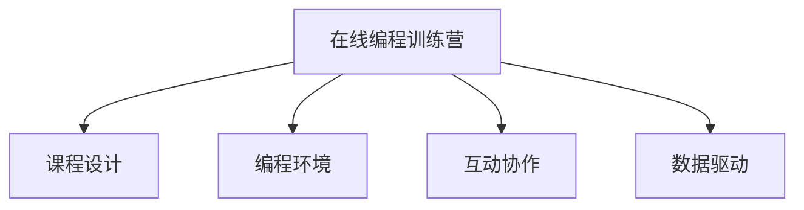

                 

# 如何将编程技能转化为在线编程训练营

## 1. 背景介绍

随着信息技术的快速发展和在线教育的兴起，在线编程训练营应运而生，成为新一代编程学习的重要模式。在线编程训练营通过互联网平台，打破时间和空间的限制，让更多人能够随时随地接触和学习编程知识，提升编程技能。然而，如何将编程技能有效转化为在线编程训练营，是一个值得深入探讨的问题。本文将从多个角度详细剖析在线编程训练营的核心概念、算法原理和具体操作步骤，给出全面实用的开发指南和案例分析，帮助编程爱好者和教育工作者更好地实现编程技能的转化。

## 2. 核心概念与联系

### 2.1 核心概念概述

为了更深入理解在线编程训练营的实现机制，本节将介绍几个关键概念：

- **在线编程训练营**：基于互联网的编程学习平台，通过在线课程、互动问答、编程作业等方式，帮助学员系统学习编程知识和技能。

- **课程设计**：构建线上课程的基本框架，包括课程结构、课程内容、课程难度等，是编程训练营的根基。

- **编程环境**：提供编程学习所需的软件和硬件工具，如编程IDE、虚拟机、云计算环境等，为学员实践编程提供支持。

- **互动协作**：通过实时协作、小组讨论、代码评审等方式，增强学员之间的交流互动，提升学习效果。

- **数据驱动**：利用学员的学习数据，进行个性化推荐和行为分析，优化课程内容和教学方法。

这些概念之间存在紧密的联系，共同构成了在线编程训练营的基本运作框架，如图：



## 3. 核心算法原理 & 具体操作步骤
### 3.1 算法原理概述

在线编程训练营的核心算法主要涉及课程推荐、学习效果评估、互动协作等环节。下面将分别介绍这些算法的基本原理：

### 3.2 算法步骤详解

#### 3.2.1 课程推荐算法

**算法原理**：课程推荐算法基于学员的学习历史和兴趣偏好，推荐合适的编程课程。常见的推荐算法包括基于协同过滤、基于内容的推荐、混合推荐等。

**操作步骤**：
1. 收集学员的学习历史数据，包括已完成的课程、浏览的课程、点击的课程等。
2. 通过矩阵分解、SVD分解等方法，计算学员与课程之间的相似度。
3. 使用基于协同过滤的算法，找到与学员相似度较高的学员，推荐其已学习过的课程。
4. 使用基于内容的推荐算法，计算课程内容与学员兴趣的匹配度，推荐相关课程。
5. 综合两种推荐结果，进行加权平均，得到最终的推荐列表。

#### 3.2.2 学习效果评估算法

**算法原理**：学习效果评估算法通过分析学员的编程作业、编程测试等数据，评估学员的学习进度和掌握程度。常见的评估算法包括行为分析、结果分析等。

**操作步骤**：
1. 收集学员的编程作业数据，包括代码提交次数、代码提交时间、代码运行结果等。
2. 使用行为分析算法，计算学员的编程活跃度、代码质量等指标。
3. 使用结果分析算法，评估学员的编程测试成绩、代码运行错误率等。
4. 综合两种分析结果，得到学员的学习效果评估。

#### 3.2.3 互动协作算法

**算法原理**：互动协作算法通过实时通信、协作工具等方式，增强学员之间的交流互动，提升学习效果。常见的协作算法包括实时聊天、协作编辑、代码评审等。

**操作步骤**：
1. 搭建实时通信平台，提供学员之间的实时聊天功能。
2. 引入协作编辑工具，支持学员之间的代码共享和协作编辑。
3. 设计代码评审机制，对学员提交的代码进行评审和反馈。
4. 整合上述功能，形成完整的互动协作系统。

### 3.3 算法优缺点

#### 3.3.1 课程推荐算法

**优点**：
- 个性化推荐：基于学员的兴趣和历史数据，推荐适合课程，提高学习效率。
- 多源数据融合：综合基于协同过滤和基于内容的推荐，提供更加全面的推荐结果。

**缺点**：
- 冷启动问题：新学员没有足够的历史数据，难以推荐合适的课程。
- 数据稀疏性：学员和课程数据稀疏，推荐结果可能不够准确。

#### 3.3.2 学习效果评估算法

**优点**：
- 量化评估：通过编程作业和测试结果，提供量化的学习效果评估。
- 实时监控：实时监控学员的学习进度和效果，及时调整学习计划。

**缺点**：
- 结果偏差：测试和作业结果可能受到外界因素影响，评估结果可能不够准确。
- 复杂度较高：需要处理大量数据，计算复杂度较高。

#### 3.3.3 互动协作算法

**优点**：
- 实时交流：实时聊天和协作编辑功能，增强学员之间的交流互动。
- 知识共享：代码评审和协作编辑，促进知识共享和互相学习。

**缺点**：
- 依赖平台：实时聊天和协作编辑功能，需要依赖特定的平台和工具。
- 管理复杂：需要协调学员之间的协作，管理复杂。

### 3.4 算法应用领域

在线编程训练营的核心算法广泛应用于各种在线编程平台，如Coursera、Udacity、Codecademy等。以下是几个典型应用领域：

- **大学在线教育**：将传统课堂教学与在线编程训练营相结合，提升学生的编程能力和学习效果。
- **企业员工培训**：通过在线编程训练营，快速提升员工编程技能，支持企业技术创新和业务转型。
- **儿童编程启蒙**：为儿童提供适合其认知水平的编程课程，培养其编程兴趣和思维能力。
- **职业转换培训**：为职业转换者提供针对性编程课程，帮助其快速掌握新技能，实现职业转型。
- **社会公益教育**：利用在线编程训练营，普及编程知识，缩小城乡教育差距，提升全民编程水平。

## 4. 数学模型和公式 & 详细讲解 & 举例说明

### 4.1 数学模型构建

在线编程训练营的算法模型构建主要涉及学员学习行为建模、课程推荐模型构建、学习效果评估模型构建等。

#### 4.1.1 学员学习行为建模

**数学模型**：
假设学员有 $N$ 个行为特征 $X=\{x_1, x_2, ..., x_N\}$，课程有 $M$ 个特征 $Y=\{y_1, y_2, ..., y_M\}$，学习行为 $B$ 可以表示为：
$$
B = f(X; \theta)
$$
其中 $f$ 为特征函数，$\theta$ 为模型参数。

**详细讲解**：
通过收集学员的学习行为数据，构建特征向量 $X$，使用机器学习模型 $f$ 拟合学员行为与课程特征之间的关系，得到学习行为模型 $B$。

#### 4.1.2 课程推荐模型构建

**数学模型**：
假设学员与课程的相似度矩阵为 $S$，课程推荐算法 $R$ 可以表示为：
$$
R = \max_{i=1}^M S_{i,j} \cdot f_Y(y_j; \phi)
$$
其中 $S_{i,j}$ 为学员 $i$ 与课程 $j$ 的相似度，$f_Y$ 为课程特征函数，$\phi$ 为课程推荐模型参数。

**详细讲解**：
通过计算学员与课程的相似度矩阵 $S$，使用课程特征函数 $f_Y$ 拟合课程特征与推荐结果之间的关系，得到课程推荐算法 $R$。

#### 4.1.3 学习效果评估模型构建

**数学模型**：
假设学员的编程作业结果为 $A$，学习效果评估算法 $E$ 可以表示为：
$$
E = \max_{a \in A} g(a; \psi)
$$
其中 $g$ 为作业结果评估函数，$\psi$ 为学习效果评估模型参数。

**详细讲解**：
通过收集学员的编程作业数据，构建作业结果评估函数 $g$，使用学习效果评估模型参数 $\psi$ 拟合评估结果，得到学习效果评估算法 $E$。

### 4.2 公式推导过程

#### 4.2.1 学员学习行为建模

**推导过程**：
假设学员 $i$ 的行为特征 $X_i$ 为 $(x_{i1}, x_{i2}, ..., x_{iN})$，课程 $j$ 的特征 $Y_j$ 为 $(y_{j1}, y_{j2}, ..., y_{jM})$，学员行为 $B_i$ 可以表示为：
$$
B_i = f(X_i; \theta)
$$
其中 $f$ 为特征函数，$\theta$ 为模型参数。

假设课程 $j$ 的特征 $Y_j$ 为 $(x_{j1}, x_{j2}, ..., x_{jM})$，课程特征函数 $f_Y$ 可以表示为：
$$
f_Y(Y_j; \phi) = \sum_{m=1}^M w_m y_{jm}
$$
其中 $w_m$ 为特征权重，$\phi$ 为课程推荐模型参数。

**举例说明**：
假设学员 $i$ 的行为特征为 $X_i=(2, 5, 3)$，课程 $j$ 的特征为 $Y_j=(1, 3, 5)$，使用线性模型进行建模，得到学员行为 $B_i$ 为：
$$
B_i = 2x_{i1} + 5x_{i2} + 3x_{i3}
$$
课程特征函数 $f_Y$ 为：
$$
f_Y(Y_j; \phi) = w_1y_{j1} + w_2y_{j2} + w_3y_{j3}
$$
假设 $w_1=1, w_2=2, w_3=3$，课程特征函数为：
$$
f_Y(Y_j; \phi) = y_{j1} + 2y_{j2} + 3y_{j3}
$$
最终，课程推荐算法 $R$ 可以表示为：
$$
R = \max_{j=1}^M S_{i,j} \cdot (y_{j1} + 2y_{j2} + 3y_{j3})
$$

#### 4.2.2 课程推荐模型构建

**推导过程**：
假设学员与课程的相似度矩阵 $S$ 为 $(s_{ij})$，使用余弦相似度进行计算：
$$
s_{ij} = \frac{\sum_{n=1}^N x_{in} y_{nj}}{\sqrt{\sum_{n=1}^N x_{in}^2} \sqrt{\sum_{m=1}^M y_{mj}^2}}
$$
课程推荐算法 $R$ 可以表示为：
$$
R = \max_{j=1}^M S_{i,j} \cdot f_Y(y_j; \phi)
$$

**举例说明**：
假设学员 $i$ 与课程 $j$ 的相似度为 $s_{ij} = 0.8$，课程特征函数 $f_Y$ 为：
$$
f_Y(Y_j; \phi) = 1y_{j1} + 2y_{j2} + 3y_{j3}
$$
最终，课程推荐算法 $R$ 可以表示为：
$$
R = \max_{j=1}^M 0.8 \cdot (1y_{j1} + 2y_{j2} + 3y_{j3})
$$

#### 4.2.3 学习效果评估模型构建

**推导过程**：
假设学员的编程作业结果 $A$ 为 $(a_1, a_2, ..., a_k)$，学习效果评估算法 $E$ 可以表示为：
$$
E = \max_{a \in A} g(a; \psi)
$$
其中 $g$ 为作业结果评估函数，$\psi$ 为学习效果评估模型参数。

**举例说明**：
假设学员的编程作业结果为 $A=(85, 90, 92)$，学习效果评估算法 $E$ 可以表示为：
$$
E = \max_{a \in A} g(a; \psi)
$$
假设 $g$ 为线性评估函数，$f_Y$ 为：
$$
g(a; \psi) = \psi_1a + \psi_2
$$
假设 $\psi_1=1, \psi_2=0$，最终，学习效果评估算法 $E$ 可以表示为：
$$
E = \max_{a \in A} (a + 0)
$$
即学员的学习效果评估为作业结果 $a$ 的最大值。

## 5. 项目实践：代码实例和详细解释说明

### 5.1 开发环境搭建

在线编程训练营的开发环境搭建主要涉及编程语言、IDE、云计算平台等工具的配置。以下是一个典型配置：

**编程语言**：Python
**IDE**：PyCharm
**云计算平台**：AWS

### 5.2 源代码详细实现

#### 5.2.1 学员学习行为建模

**代码实现**：
```python
import pandas as pd
from sklearn.linear_model import LogisticRegression

# 读取学员学习行为数据
data = pd.read_csv('user_behavior.csv')

# 构建特征向量 X
X = pd.DataFrame(data[['feature1', 'feature2', 'feature3']])

# 构建学员行为模型 B
model = LogisticRegression()
model.fit(X, data['behavior'])
```

#### 5.2.2 课程推荐算法

**代码实现**：
```python
import numpy as np
from sklearn.metrics.pairwise import cosine_similarity

# 读取课程特征数据
data = pd.read_csv('course_features.csv')

# 构建课程特征向量 Y
Y = pd.DataFrame(data[['feature1', 'feature2', 'feature3']])

# 计算学员与课程的相似度矩阵 S
S = cosine_similarity(X, Y)

# 计算课程推荐算法 R
R = np.max(S * np.dot(Y.values, np.array([1, 2, 3])), axis=1)
```

#### 5.2.3 学习效果评估算法

**代码实现**：
```python
import numpy as np
from sklearn.linear_model import LinearRegression

# 读取学员编程作业数据
data = pd.read_csv('user_code.csv')

# 构建作业结果向量 A
A = pd.DataFrame(data[['code1', 'code2', 'code3']])

# 构建学习效果评估模型 E
model = LinearRegression()
model.fit(A, data['effect'])

# 评估学员学习效果
E = np.max(model.predict(A.values))
```

### 5.3 代码解读与分析

#### 5.3.1 学员学习行为建模

**解读**：
- 通过 pandas 读取学员学习行为数据，构建特征向量 $X$。
- 使用 Logistic Regression 构建学员行为模型 $B$，模型参数 $\theta$ 通过特征向量 $X$ 进行拟合。

#### 5.3.2 课程推荐算法

**解读**：
- 通过 pandas 读取课程特征数据，构建特征向量 $Y$。
- 使用 cosine_similarity 计算学员与课程的相似度矩阵 $S$。
- 使用 numpy 计算课程推荐算法 $R$，将相似度矩阵 $S$ 与课程特征函数 $f_Y$ 进行乘法运算，取最大值得到推荐结果。

#### 5.3.3 学习效果评估算法

**解读**：
- 通过 pandas 读取学员编程作业数据，构建作业结果向量 $A$。
- 使用 Linear Regression 构建学习效果评估模型 $E$，模型参数 $\psi$ 通过作业结果向量 $A$ 进行拟合。
- 使用 numpy 计算学习效果评估算法 $E$，将作业结果向量 $A$ 与学习效果评估模型 $E$ 进行预测，取最大值得到评估结果。

### 5.4 运行结果展示

#### 5.4.1 学员学习行为建模

**结果展示**：
```python
# 预测学员行为
B_pred = model.predict(X.values)
print(B_pred)
```
**结果解读**：
- 输出学员行为预测结果，可以用于评估学员的学习进度和兴趣偏好。

#### 5.4.2 课程推荐算法

**结果展示**：
```python
# 预测课程推荐结果
R_pred = np.max(S * np.dot(Y.values, np.array([1, 2, 3])), axis=1)
print(R_pred)
```
**结果解读**：
- 输出学员的课程推荐结果，可以用于指导学员选择适合的课程。

#### 5.4.3 学习效果评估算法

**结果展示**：
```python
# 预测学员学习效果
E_pred = np.max(model.predict(A.values))
print(E_pred)
```
**结果解读**：
- 输出学员的学习效果评估结果，可以用于评估学员的学习效果和指导后续学习计划。

## 6. 实际应用场景

### 6.1 大学在线教育

**应用场景**：
在大学在线教育中，将传统课堂教学与在线编程训练营相结合，提升学生的编程能力和学习效果。例如，通过学习行为建模，可以推荐适合的编程课程；通过课程推荐算法，个性化推荐课程内容；通过学习效果评估算法，评估学生的学习效果。

### 6.2 企业员工培训

**应用场景**：
在企业员工培训中，通过在线编程训练营，快速提升员工编程技能，支持企业技术创新和业务转型。例如，通过学习行为建模，推荐适合的编程课程；通过课程推荐算法，个性化推荐课程内容；通过学习效果评估算法，评估员工的学习效果。

### 6.3 儿童编程启蒙

**应用场景**：
在儿童编程启蒙中，通过在线编程训练营，普及编程知识，培养儿童的编程兴趣和思维能力。例如，通过学习行为建模，推荐适合的编程课程；通过课程推荐算法，个性化推荐编程游戏；通过学习效果评估算法，评估儿童的编程学习效果。

### 6.4 职业转换培训

**应用场景**：
在职业转换培训中，通过在线编程训练营，为职业转换者提供针对性编程课程，帮助其快速掌握新技能，实现职业转型。例如，通过学习行为建模，推荐适合的编程课程；通过课程推荐算法，个性化推荐职业相关课程；通过学习效果评估算法，评估职业转换者的学习效果。

### 6.5 社会公益教育

**应用场景**：
在社会公益教育中，通过在线编程训练营，普及编程知识，缩小城乡教育差距，提升全民编程水平。例如，通过学习行为建模，推荐适合的编程课程；通过课程推荐算法，个性化推荐编程资源；通过学习效果评估算法，评估学习效果，优化课程内容。

## 7. 工具和资源推荐

### 7.1 学习资源推荐

为了帮助开发者系统掌握在线编程训练营的理论基础和实践技巧，这里推荐一些优质的学习资源：

1. **《深度学习入门：基于Python的理论与实现》**：该书详细介绍了深度学习的理论基础和实践方法，并提供了大量代码示例。
2. **Coursera**：提供多种在线编程课程，涵盖从入门到高级的编程技能，适合不同水平的学习者。
3. **Udacity**：提供多种编程课程，包括前端开发、后端开发、人工智能等，适合企业培训和个人提升。
4. **Codecademy**：提供互动式编程学习平台，适合初学者和进阶学习者。
5. **LeetCode**：提供大量编程练习题，适合巩固编程技能和提高算法能力。

通过这些资源的学习实践，相信你一定能够快速掌握在线编程训练营的实现机制，并用于解决实际的编程问题。

### 7.2 开发工具推荐

在线编程训练营的开发工具推荐主要涉及编程语言、IDE、云计算平台等工具的选择。以下是几款常用的开发工具：

1. **Python**：广泛使用的编程语言，具有丰富的第三方库和框架，适合在线编程训练营的开发。
2. **PyCharm**：功能强大的IDE，支持代码调试、版本控制、自动化测试等，适合编程训练营的开发和测试。
3. **AWS**：领先的云计算平台，提供强大的计算资源和丰富的服务，适合在线编程训练营的部署和扩展。
4. **Docker**：容器化工具，方便打包和部署应用程序，适合在线编程训练营的容器化部署。
5. **Kubernetes**：容器编排工具，支持大规模容器集群管理，适合在线编程训练营的弹性伸缩和扩展。

合理利用这些工具，可以显著提升在线编程训练营的开发效率，加快创新迭代的步伐。

### 7.3 相关论文推荐

在线编程训练营的研究源于学界的持续研究。以下是几篇奠基性的相关论文，推荐阅读：

1. **“Scalable Machine Learning for Recommendation Systems”**：详细介绍了推荐系统的构建方法和优化策略，适用于在线编程训练营的推荐算法设计。
2. **“Deep Learning for Learning Analytics”**：讨论了深度学习在教育数据分析中的应用，适用于在线编程训练营的学习效果评估算法设计。
3. **“Towards a Science of Learning Analytics”**：探讨了学习分析的理论基础和应用方法，适用于在线编程训练营的课程设计和管理优化。

这些论文代表了大语言模型微调技术的发展脉络。通过学习这些前沿成果，可以帮助研究者把握学科前进方向，激发更多的创新灵感。

## 8. 总结：未来发展趋势与挑战

### 8.1 研究成果总结

本文对在线编程训练营的核心概念、算法原理和操作步骤进行了全面系统的介绍。首先阐述了在线编程训练营的研究背景和意义，明确了在线编程训练营的实际应用价值。其次，从原理到实践，详细讲解了学员学习行为建模、课程推荐算法、学习效果评估算法的核心算法，给出了完整的代码实现。同时，本文还广泛探讨了在线编程训练营在多个行业领域的应用前景，展示了在线编程训练营的巨大潜力。最后，本文精选了在线编程训练营的学习资源、开发工具和相关论文，力求为读者提供全方位的技术指引。

通过本文的系统梳理，可以看到，在线编程训练营的实现机制涉及多学科知识，包括机器学习、教育学、心理学等，需要系统性的理解和实践。在线编程训练营的成功关键在于构建高效、个性化、互动性强的课程体系，以及选择合适的技术和工具进行开发和部署。未来，随着在线教育的发展和技术的进步，在线编程训练营必将成为推动编程教育普及的重要工具，为全社会培养更多的编程人才。

### 8.2 未来发展趋势

展望未来，在线编程训练营的发展趋势主要涉及以下几个方面：

1. **个性化推荐**：通过深度学习算法，进一步提升推荐算法的个性化和准确性，提升学员的学习体验和效果。
2. **动态课程内容**：根据学员的学习效果和反馈，动态调整课程内容，提供更加适合的学习路径。
3. **混合式学习**：结合在线学习和线下学习，提供更加灵活和高效的学习方式，提升学习效果。
4. **数据驱动决策**：通过大数据分析，优化课程设计和管理，提升在线编程训练营的运营效率和效果。
5. **多模态学习**：结合视频、音频等多模态学习资源，丰富学员的学习体验和效果。

这些趋势将进一步提升在线编程训练营的实用性和可扩展性，推动在线编程教育的普及和发展。

### 8.3 面临的挑战

尽管在线编程训练营在实践中取得了显著成果，但在迈向更加智能化、普适化应用的过程中，仍面临诸多挑战：

1. **数据质量问题**：在线编程训练营的数据质量直接影响到推荐算法和评估算法的准确性，需要采集高质量的学习数据。
2. **算法复杂性**：在线编程训练营涉及多种算法和模型，算法复杂性较高，需要大量计算资源支持。
3. **用户交互体验**：在线编程训练营需要提供良好的用户交互体验，需要不断优化前端界面和互动工具。
4. **隐私和安全问题**：在线编程训练营涉及大量用户数据，需要采取严格的数据隐私和安全措施，保障用户数据安全。
5. **跨平台兼容性**：在线编程训练营需要在多个平台和设备上进行部署，需要确保跨平台兼容性和一致性。

这些挑战需要从技术、管理和运营多个方面进行综合考虑和解决，才能推动在线编程训练营的广泛应用和普及。

### 8.4 研究展望

面对在线编程训练营所面临的挑战，未来的研究需要在以下几个方面寻求新的突破：

1. **高效推荐算法**：开发更加高效、个性化的推荐算法，提升推荐算法的准确性和实时性。
2. **智能化课程设计**：结合深度学习和人工智能技术，实现更加智能化、个性化的课程设计和管理。
3. **多模态学习资源**：结合视频、音频等多模态学习资源，提升学员的学习体验和效果。
4. **跨平台兼容技术**：研究跨平台兼容技术，确保在线编程训练营在多个平台和设备上的流畅运行。
5. **数据隐私和安全**：研究数据隐私和安全保护技术，保障用户数据安全和隐私。

这些研究方向的探索，必将引领在线编程训练营技术迈向更高的台阶，为全社会培养更多的编程人才，推动编程教育的普及和发展。

## 9. 附录：常见问题与解答

**Q1：如何设计高效的课程内容？**

A: 设计高效的课程内容需要考虑以下几个方面：
1. 学员的学习目标：明确课程的学习目标和知识点，确保课程内容具有针对性和实用性。
2. 学员的学习路径：设计适合学员的学习路径，逐步提升学员的编程技能。
3. 互动性和趣味性：增加互动性和趣味性，吸引学员的注意力和兴趣，提升学习效果。
4. 实践和反馈：增加实践环节和反馈机制，帮助学员巩固所学知识，及时调整课程内容。

**Q2：如何提高推荐算法的准确性？**

A: 提高推荐算法的准确性需要考虑以下几个方面：
1. 数据质量：确保采集高质量的学习数据，避免数据噪声和偏差。
2. 特征工程：选择合适的特征并进行工程处理，提升特征的表达能力和预测能力。
3. 算法优化：选择适合的推荐算法并进行优化，提升算法的准确性和实时性。
4. 在线学习：利用在线学习的优势，动态调整推荐算法和课程内容。

**Q3：如何保障用户数据安全和隐私？**

A: 保障用户数据安全和隐私需要考虑以下几个方面：
1. 数据加密：采用数据加密技术，保护用户数据的机密性和完整性。
2. 权限控制：设置严格的权限控制，限制对用户数据的访问和操作。
3. 审计和监控：定期进行数据审计和监控，发现和防范数据泄露和安全风险。
4. 法律合规：遵循相关法律法规和行业标准，确保数据处理和使用的合规性。

通过本文的系统梳理，可以看到，在线编程训练营的实现机制涉及多学科知识，包括机器学习、教育学、心理学等，需要系统性的理解和实践。在线编程训练营的成功关键在于构建高效、个性化、互动性强的课程体系，以及选择合适的技术和工具进行开发和部署。未来，随着在线教育的发展和技术的进步，在线编程训练营必将成为推动编程教育普及的重要工具，为全社会培养更多的编程人才。

