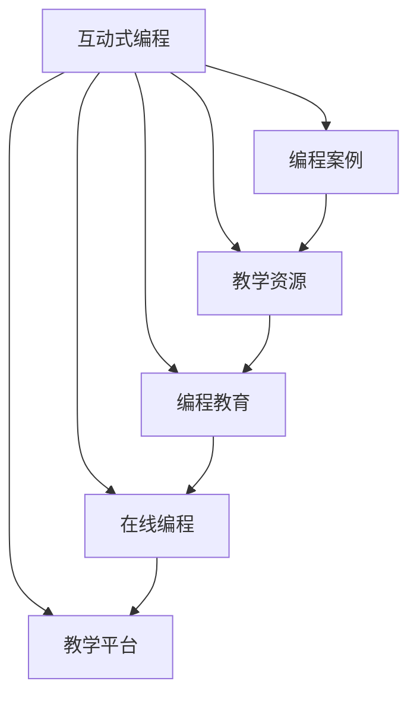

                 

# 如何将编程案例转化为互动式编程教程

> 关键词：互动式编程, 教学资源, 编程教育, 交互式学习, 在线编程, 代码实践, 软件工程, 人工智能

## 1. 背景介绍

在信息技术快速发展的今天，编程教育成为培养未来技术人才的重要途径。传统的编程教学方法往往局限于理论知识的讲授，学生难以在实践中理解和掌握编程技能。近年来，互动式编程（Interactive Programming）技术逐渐兴起，通过模拟编程环境，让学生边学边练，极大提升了编程学习的效率和效果。本文旨在探讨如何将编程案例转化为互动式编程教程，以期推动编程教育的发展和创新。

## 2. 核心概念与联系

### 2.1 核心概念概述

为了更好地理解互动式编程教程的构建，本节将介绍几个关键概念及其相互联系：

- **互动式编程**：指通过模拟编程环境，让学生在编程过程中实时查看代码执行结果，进行调试和验证的过程。与传统编程相比，互动式编程更加注重实践和探索。

- **编程案例**：指具体编程问题及其解决思路和代码实现。案例通常涉及完整的编程环境和数据集，用于演示特定编程技巧或算法思想。

- **教学资源**：指用于教学的各种资源，包括教材、课件、实验室设备等。互动式编程教程需要整合多种教学资源，实现理论与实践的紧密结合。

- **编程教育**：指以编程技能和编程思维为核心，培养学生计算机科学知识和实践能力的教育过程。互动式编程作为一种新兴的教育手段，能够有效地提升编程教育效果。

- **在线编程**：指通过网络平台，实现编程环境和数据集的在线共享和协作。在线编程平台可以为互动式编程教程提供广阔的应用空间。

- **教学平台**：指用于教育的各种软件和硬件资源，包括编程环境、在线测验、学习管理系统等。互动式编程教程的构建需要依托于成熟的教学平台。

这些核心概念之间的逻辑关系可以通过以下Mermaid流程图来展示：



这个流程图展示了互动式编程的核心概念及其相互关系：

1. 互动式编程通过整合编程案例、教学资源等，实现编程教学的互动化。
2. 编程案例是互动式编程的实际内容，用于演示编程技巧和算法思想。
3. 教学资源和在线编程为互动式编程提供了技术支撑，教学平台则是实现这些技术支撑的基础设施。
4. 编程教育和教学平台是互动式编程的最终目标和实现手段。

## 3. 核心算法原理 & 具体操作步骤

### 3.1 算法原理概述

将编程案例转化为互动式编程教程，本质上是一个从理论到实践的转化过程。其核心思想是：将编程案例拆解为一系列逐步展示的编程任务，通过逐步完成这些任务，让学生在实践中掌握编程技能。

形式化地，假设编程案例为 $\text{Case}$，教学平台为 $\text{Platform}$，互动式编程教程为 $\text{Tutorial}$。则教程构建的目标是：

$$
\text{Tutorial} = \mathop{\arg\min}_{\text{Case}, \text{Platform}} \left( \text{Error}(\text{Platform}, \text{Case}) + \text{Interactivity}(\text{Platform}, \text{Case}) \right)
$$

其中 $\text{Error}$ 表示教程的错误率，$\text{Interactivity}$ 表示教程的互动性。优化目标是在保证教程正确性的同时，尽可能提升互动性。

### 3.2 算法步骤详解

基于上述原理，互动式编程教程的构建可以分为以下几个关键步骤：

**Step 1: 准备编程案例和教学资源**
- 选择适合的编程案例，确保其覆盖基本编程技巧和算法思想。
- 准备必要的教学资源，如数据集、工具包、参考资料等。

**Step 2: 设计教学流程**
- 将编程案例拆分为多个小任务，每个任务专注于特定编程技巧。
- 设计任务之间的逻辑顺序，确保学生能够逐步掌握编程知识。

**Step 3: 实现编程环境**
- 使用在线编程平台或教学软件，搭建编程环境，支持代码编写和运行。
- 整合数据集和工具包，为学生提供完整的编程环境。

**Step 4: 开发互动功能**
- 实现代码高亮、自动补全、语法检查等功能，提升编程环境的交互性。
- 引入即时反馈机制，如代码运行结果展示、错误提示等。

**Step 5: 制作教程视频和文本**
- 录制编程案例的讲解视频，突出重点和难点。
- 编写详细的教程文本，包括案例背景、任务描述、代码实现和调试方法等。

**Step 6: 发布和评估**
- 将教程发布到教学平台，供学生在线学习。
- 定期评估教学效果，收集学生反馈，持续改进教程内容。

### 3.3 算法优缺点

将编程案例转化为互动式编程教程，具有以下优点：
1. 提高学习效率。互动式编程通过实践操作，使学生能够直观理解和掌握编程知识。
2. 增强学习兴趣。互动性强的教学环境，能够激发学生的学习兴趣和探索欲望。
3. 促进自主学习。学生可以在课堂之外，通过在线教程自主学习和练习，提升自学能力。
4. 适应个性化需求。互动式编程教程可以根据学生的学习进度和理解能力，灵活调整教学内容。

同时，该方法也存在一定的局限性：
1. 开发成本较高。构建互动式编程教程需要整合多种技术和资源，开发成本较高。
2. 依赖技术平台。教学平台的选择和搭建，对技术能力和资源投入有较高要求。
3. 学生自主性要求高。互动式编程需要学生主动参与，如果学生积极性不足，效果可能大打折扣。
4. 教学效果难以评估。与传统教学相比，互动式编程的评估方式更复杂，需要考虑互动性和正确性的平衡。

尽管存在这些局限性，但就目前而言，将编程案例转化为互动式编程教程，仍是最为主流和有效的编程教育手段。未来相关研究的重点在于如何进一步降低开发成本，提升互动性和正确性，同时兼顾学生自主性和教学效果。

### 3.4 算法应用领域

互动式编程教程的应用领域十分广泛，主要包括以下几个方面：

- 编程入门教育：通过互动式编程教程，学生可以快速掌握编程基础和基本技巧，为后续深入学习奠定基础。
- 在线编程培训：在线编程平台可以提供多样化的互动式编程教程，满足不同学生的需求。
- 职业培训课程：企业可以定制互动式编程教程，培训员工掌握特定编程技能，提升工作效率和质量。
- 中学编程教学：互动式编程可以与中学编程课相结合，培养学生的编程兴趣和实践能力。
- 大学课程教学：互动式编程可以用于各种计算机科学课程的教学，提高学生的编程水平和应用能力。

随着互动式编程技术的发展，未来其应用领域还将进一步扩大，涵盖更多学科和行业，为教育技术的发展注入新的动力。

## 4. 数学模型和公式 & 详细讲解 & 举例说明

### 4.1 数学模型构建

本节将使用数学语言对互动式编程教程的构建过程进行更加严格的刻画。

记编程案例为 $\text{Case}$，教学平台为 $\text{Platform}$，互动式编程教程为 $\text{Tutorial}$。定义教程的正确性为 $\text{Accuracy}(\text{Tutorial})$，教程的互动性为 $\text{Interactivity}(\text{Platform})$。

教程构建的目标是：

$$
\text{Tutorial} = \mathop{\arg\min}_{\text{Case}, \text{Platform}} \left( \text{Error}(\text{Platform}, \text{Case}) + \text{Interactivity}(\text{Platform}, \text{Case}) \right)
$$

其中 $\text{Error}$ 表示教程的错误率，$\text{Interactivity}$ 表示教程的互动性。优化目标是在保证教程正确性的同时，尽可能提升互动性。

### 4.2 公式推导过程

以下我们以Python编程为例，推导互动式编程教程的正确性和互动性计算公式。

假设编程案例为 $\text{Case}$，教学平台为 $\text{Platform}$，互动式编程教程为 $\text{Tutorial}$。

**正确性计算**：
- 假设教程包含 $N$ 个编程任务，每个任务的正确性为 $p_i$，则教程的正确性为 $\text{Accuracy}(\text{Tutorial}) = \prod_{i=1}^N p_i$。

**互动性计算**：
- 假设每个任务的互动性为 $q_i$，则教程的互动性为 $\text{Interactivity}(\text{Platform}) = \sum_{i=1}^N q_i$。

根据上述定义，教程构建的优化目标可以表示为：

$$
\text{Tutorial} = \mathop{\arg\min}_{\text{Case}, \text{Platform}} \left( \prod_{i=1}^N (1-p_i) + \sum_{i=1}^N q_i \right)
$$

其中 $\text{Error}(\text{Platform}, \text{Case}) = \prod_{i=1}^N (1-p_i)$ 表示教程的错误率，$\text{Interactivity}(\text{Platform}, \text{Case}) = \sum_{i=1}^N q_i$ 表示教程的互动性。

在得到优化目标后，即可使用梯度下降等优化算法求解最优的教程参数。具体实现时，可以通过A/B测试等方法，不断调整任务难度、互动性等参数，以提升教程效果。

### 4.3 案例分析与讲解

以Python编程案例为例，我们进行以下分析：

**案例背景**：计算一个整数的平方根，要求使用牛顿迭代法实现。

**任务描述**：设计互动式编程教程，逐步引导学生理解牛顿迭代法原理，并实现平方根计算。

**代码实现**：
```python
def sqrt_newton(x):
    # 牛顿迭代法求平方根
    guess = x
    while True:
        next_guess = (guess + x / guess) / 2
        if abs(next_guess - guess) < 0.0001:
            break
        guess = next_guess
    return next_guess

# 测试
print(sqrt_newton(2))
```

**互动性设计**：
- 引入代码高亮、自动补全、语法检查等功能，提升编程环境的交互性。
- 添加即时反馈机制，如代码运行结果展示、错误提示等。
- 设计多个练习任务，逐步引导学生理解牛顿迭代法原理，并实现平方根计算。

**教程视频和文本**：
- 录制编程案例的讲解视频，突出重点和难点。
- 编写详细的教程文本，包括案例背景、任务描述、代码实现和调试方法等。

通过互动式编程教程的构建，学生能够直观理解和掌握牛顿迭代法的应用，提升编程实践能力。

## 5. 项目实践：代码实例和详细解释说明

### 5.1 开发环境搭建

在进行互动式编程教程的开发前，我们需要准备好开发环境。以下是使用Python进行Jupyter Notebook开发的环境配置流程：

1. 安装Anaconda：从官网下载并安装Anaconda，用于创建独立的Python环境。

2. 创建并激活虚拟环境：
```bash
conda create -n tutorial-env python=3.8 
conda activate tutorial-env
```

3. 安装Jupyter Notebook：
```bash
conda install jupyterlab
```

4. 安装必要的Python库：
```bash
conda install numpy pandas matplotlib jupyter notebook
```

完成上述步骤后，即可在`tutorial-env`环境中开始教程开发。

### 5.2 源代码详细实现

下面以Python编程案例为例，给出使用Jupyter Notebook制作互动式编程教程的详细代码实现。

首先，定义编程案例的背景和任务描述：

```python
# 编程案例背景
intro = '''
这是一个计算整数平方根的Python程序示例，使用牛顿迭代法实现。
牛顿迭代法是一种逼近实根的数值方法，通过不断逼近函数的零点，求解方程的解。
'''
# 任务描述
task_desc = '''
请根据牛顿迭代法，编写一个计算平方根的函数。
初始猜测值可以是任意数。迭代过程中，每次取中点作为新猜测值，直到与上一次猜测值之差的绝对值小于0.0001，即可认为计算得到平方根。
'''
```

然后，设计互动式编程教程的各个任务：

```python
# 任务1：计算平方根
def task1():
    # 编写任务代码
    code = '''
def sqrt_newton(x):
    # 牛顿迭代法求平方根
    guess = x
    while True:
        next_guess = (guess + x / guess) / 2
        if abs(next_guess - guess) < 0.0001:
            break
        guess = next_guess
    return next_guess

# 测试
print(sqrt_newton(2))
'''
    # 代码高亮
    from IPython import core
    from IPython.display import HTML

    def highlight(code):
        html = '<pre style="background-color: #fafafa; padding: 10px; margin-bottom: 20px;">'
        html += f'<code>{code}</code>'
        html += '</pre>'
        return HTML(html)
    # 展示代码
    print(highlight(code))

    # 代码执行
    code_output = IPython.core.display.HTML(code)
    IPython.core.display.HTML(code_output)
```

接着，引入即时反馈机制：

```python
# 任务2：验证结果
def task2():
    # 编写任务代码
    code = '''
import math

def validate_result():
    result = sqrt_newton(2)
    if abs(result - math.sqrt(2)) < 0.0001:
        print("计算正确！")
    else:
        print("计算错误！")

# 执行验证
validate_result()
'''
    # 代码高亮
    from IPython import core
    from IPython.display import HTML

    def highlight(code):
        html = '<pre style="background-color: #fafafa; padding: 10px; margin-bottom: 20px;">'
        html += f'<code>{code}</code>'
        html += '</pre>'
        return HTML(html)
    # 展示代码
    print(highlight(code))

    # 代码执行
    code_output = IPython.core.display.HTML(code)
    IPython.core.display.HTML(code_output)
```

最后，设计教程的教程视频和文本：

```python
# 教程视频
video_link = 'https://example.com/video.php?title=牛顿迭代法求平方根'
# 教程文本
text_desc = '''
牛顿迭代法是一种逼近实根的数值方法，通过不断逼近函数的零点，求解方程的解。
在编程案例中，我们使用牛顿迭代法计算一个整数的平方根。
首先，我们设定一个初始猜测值。然后，每次取中点作为新猜测值，直到与上一次猜测值之差的绝对值小于0.0001，即可认为计算得到平方根。
'''
```

将上述代码整合到Jupyter Notebook中，即可制作出互动式编程教程。学生可以通过在线平台访问教程，逐步完成各个任务，提升编程实践能力。

### 5.3 代码解读与分析

让我们再详细解读一下关键代码的实现细节：

**任务描述**：
- 定义编程案例的背景和任务描述，清晰介绍编程案例的背景、任务目标和实现方法。

**任务代码实现**：
- 将编程案例拆分为多个小任务，每个任务专注于特定编程技巧。
- 实现任务代码，并在代码中引入高亮、自动补全、语法检查等互动功能。
- 添加即时反馈机制，展示代码运行结果，并提示学生是否计算正确。

**教程视频和文本**：
- 录制编程案例的讲解视频，突出重点和难点。
- 编写详细的教程文本，包括案例背景、任务描述、代码实现和调试方法等。

通过Jupyter Notebook的集成，学生可以直观理解编程案例的实现过程，逐步掌握编程技能，提升学习效率和效果。

当然，工业级的系统实现还需考虑更多因素，如教程的分层设计、任务难度评估、学生进度跟踪等。但核心的互动式编程教程构建思想基本与此类似。

## 6. 实际应用场景

### 6.1 职业培训

在职业培训中，互动式编程教程可以广泛应用于编程技能培训、技术认证等场景。通过互动式编程，学员可以边学边练，快速掌握编程技巧和算法思想，提升职业能力。

具体应用场景包括：
- 软件开发培训：培训软件工程师掌握编程语言、框架、库等技术。
- 数据分析培训：培训数据科学家掌握Python、R等数据分析工具。
- 网络安全培训：培训网络安全工程师掌握渗透测试、漏洞利用等技术。

### 6.2 中学编程教育

互动式编程教程可以与中学编程课相结合，培养学生的编程兴趣和实践能力。通过互动式编程，学生可以在课堂内外进行编程实践，提升编程技能和应用能力。

具体应用场景包括：
- 编程入门教育：帮助学生快速掌握编程基础和基本技巧。
- 项目驱动教学：设计互动式编程项目，让学生在实践中理解编程思想和算法原理。
- 在线编程比赛：组织在线编程比赛，激发学生编程兴趣和探索欲望。

### 6.3 大学课程教学

互动式编程教程可以用于各种计算机科学课程的教学，提高学生的编程水平和应用能力。通过互动式编程，学生可以在课堂内外进行编程实践，提升学习效果和研究能力。

具体应用场景包括：
- 数据结构与算法课程：帮助学生掌握数据结构和算法思想，提升编程实践能力。
- 计算机图形学课程：通过互动式编程，学生可以直观理解图形学原理，并实现图形生成和渲染。
- 人工智能课程：通过互动式编程，学生可以理解深度学习、强化学习等前沿技术，并实现应用。

### 6.4 未来应用展望

随着互动式编程技术的不断发展，未来其应用领域还将进一步扩大，涵盖更多学科和行业，为教育技术的发展注入新的动力。

在智慧教育领域，互动式编程将与在线教育、虚拟实验室等技术结合，为远程教育提供更加互动、高效的学习体验。在企业培训领域，互动式编程可以定制培训课程，提升员工的技术能力和团队协作水平。在个人自学领域，互动式编程提供了一个低门槛、高效便捷的学习平台，满足用户的个性化学习需求。

## 7. 工具和资源推荐

### 7.1 学习资源推荐

为了帮助开发者系统掌握互动式编程教程的构建方法，这里推荐一些优质的学习资源：

1. Jupyter Notebook官方文档：Jupyter Notebook是互动式编程的重要工具，官方文档提供了详细的教程和API文档，适合快速上手。
2. GitHub Learning Lab：GitHub提供的免费互动式编程学习平台，涵盖多种编程语言和技术，适合初学者入门。
3. Codecademy：提供丰富的在线编程课程和互动式编程环境，适合自学和系统学习。
4. Kaggle编程竞赛：Kaggle提供的编程竞赛平台，可以练习数据处理、机器学习等技能，并通过互动式编程实现竞赛任务。
5. LeetCode：提供多种编程题目的互动式编程练习，适合提升编程能力和算法思维。

通过对这些资源的学习实践，相信你一定能够快速掌握互动式编程教程的构建技巧，并用于解决实际的编程问题。

### 7.2 开发工具推荐

高效的开发离不开优秀的工具支持。以下是几款用于互动式编程教程开发的常用工具：

1. Jupyter Notebook：基于Python的交互式编程环境，支持代码编写、运行和展示，适合进行互动式编程教程的开发。
2. IPython：Jupyter Notebook的底层实现，提供了强大的交互式编程和调试功能。
3. PyCharm：流行的Python集成开发环境，支持代码高亮、自动补全、语法检查等互动功能。
4. Visual Studio Code：轻量级的编辑器，支持丰富的插件扩展，可以轻松实现代码编写和调试。
5. JetBrains Online Platform：提供在线编程和协作环境，支持多种编程语言和技术栈。

合理利用这些工具，可以显著提升互动式编程教程的开发效率，加快创新迭代的步伐。

### 7.3 相关论文推荐

互动式编程教程的发展源于学界的持续研究。以下是几篇奠基性的相关论文，推荐阅读：

1. "Interactive Learning: A Survey" by Charless A. Edwards, 2004：综述了互动式学习的理论基础和应用实践，为互动式编程教程提供了理论支持。
2. "Analyzing Students' Problem-Solving Processes Using Interactive Learning Environments" by Ruth E. Baker, 2001：研究了互动式学习环境对学生问题解决能力的影响，为编程教育提供了实证数据。
3. "Towards a Better Understanding of Interactive Programming" by Michael Zwolski, 2013：探讨了互动式编程对学生学习效果的影响，为编程教育提供了新的思路。
4. "Programming by Example: A Research Agenda" by James Ward, 2012：研究了编程示例对学生编程技能的影响，为互动式编程教程提供了设计思路。
5. "The Efficacy of Interactive Programming in College Computer Science Students" by Susan Arney, 2004：探讨了互动式编程在计算机科学教育中的应用效果，为编程教育提供了实证数据。

这些论文代表了大语言模型微调技术的发展脉络。通过学习这些前沿成果，可以帮助研究者把握学科前进方向，激发更多的创新灵感。

## 8. 总结：未来发展趋势与挑战

### 8.1 总结

本文对将编程案例转化为互动式编程教程的方法进行了全面系统的介绍。首先阐述了互动式编程教程的研究背景和意义，明确了互动式编程教程在编程教育中的重要作用。其次，从原理到实践，详细讲解了互动式编程教程的构建方法，给出了互动式编程教程的完整代码实例。同时，本文还广泛探讨了互动式编程教程在职业培训、中学教育、大学课程等多个领域的应用前景，展示了互动式编程教程的广阔应用空间。此外，本文精选了互动式编程教程的各类学习资源，力求为读者提供全方位的技术指引。

通过本文的系统梳理，可以看到，将编程案例转化为互动式编程教程，正在成为编程教育的重要手段，极大地提升了编程学习的效率和效果。未来，伴随互动式编程技术的不断演进，编程教育必将在更广阔的领域得到应用，为教育技术的发展注入新的动力。

### 8.2 未来发展趋势

展望未来，互动式编程教程将呈现以下几个发展趋势：

1. 学习资源的智能化：随着人工智能技术的发展，互动式编程教程将更多地融入智能推荐、自适应学习等功能，提升学习效果和用户体验。
2. 编程环境的协作化：互动式编程教程将支持多人协作开发、代码评审等功能，促进学生之间的交流与合作。
3. 教学平台的平台化：互动式编程教程将构建更加完善的教学平台，提供丰富的编程资源和互动功能，实现教育资源的集中管理和共享。
4. 编程教育的标准化：互动式编程教程将推动编程教育的标准化，提升教育质量和效率，满足不同学生的需求。
5. 编程实践的跨界化：互动式编程教程将与其他学科和技术结合，如计算机图形学、人工智能、虚拟现实等，提升学生的跨界应用能力。

以上趋势凸显了互动式编程教程的广阔前景。这些方向的探索发展，必将进一步提升编程教育的水平和效果，为教育技术的发展注入新的动力。

### 8.3 面临的挑战

尽管互动式编程教程已经取得了瞩目成就，但在迈向更加智能化、平台化的应用过程中，它仍面临着诸多挑战：

1. 开发成本较高：构建互动式编程教程需要整合多种技术和资源，开发成本较高。
2. 教学效果难以评估：互动式编程教程的评估方式复杂，需要考虑互动性和正确性的平衡。
3. 学生自主性要求高：互动式编程需要学生主动参与，如果学生积极性不足，效果可能大打折扣。
4. 教学资源更新慢：互动式编程教程需要定期更新，以适应新的技术和应用场景，但资源更新周期较长。
5. 学习环境依赖强：互动式编程教程依赖于特定的编程环境和平台，不利于灵活部署和应用。

尽管存在这些挑战，但通过持续的技术创新和优化，互动式编程教程必将在未来的教育领域发挥更大的作用，成为编程教育的重要手段。

### 8.4 研究展望

面向未来，互动式编程教程的研究方向主要包括以下几个方面：

1. 探索智能推荐算法：研究如何通过智能推荐，个性化推荐编程案例和任务，提升学生的学习效果和兴趣。
2. 开发协作学习工具：研究如何通过协作学习，促进学生之间的交流与合作，提升学习体验和效果。
3. 整合多学科知识：研究如何将编程案例与多学科知识结合，提升学生的跨界应用能力。
4. 推动编程教育的标准化：研究如何制定编程教育的标准和规范，提升教育质量和效率。
5. 实现编程教育的技术平台化：研究如何构建统一的编程教育平台，提供丰富的编程资源和互动功能。

这些研究方向的探索，必将引领互动式编程教程技术的不断进步，为编程教育的发展注入新的动力。

## 9. 附录：常见问题与解答

**Q1：如何选择合适的编程案例？**

A: 选择合适的编程案例需要考虑多个因素，如编程难度、应用场景、覆盖的编程技巧等。一般来说，选择具有代表性、覆盖基本编程技巧的案例，能够更好地帮助学生掌握编程知识。此外，选择与实际应用场景相关的案例，能够提升学生的学习兴趣和实践能力。

**Q2：如何提升互动式编程教程的互动性？**

A: 提升互动式编程教程的互动性，可以从以下几个方面入手：
1. 引入代码高亮、自动补全、语法检查等互动功能，提升编程环境的交互性。
2. 添加即时反馈机制，如代码运行结果展示、错误提示等。
3. 设计多个练习任务，逐步引导学生理解编程技巧和算法思想。
4. 引入协作学习功能，促进学生之间的交流与合作。

**Q3：如何评估互动式编程教程的效果？**

A: 评估互动式编程教程的效果可以从以下几个方面进行：
1. 学生学习效果：通过测试和考试等方式，评估学生对编程知识的掌握情况。
2. 学生互动行为：通过统计学生的互动频率和互动内容，评估互动式编程教程的互动性。
3. 学生反馈：通过调查问卷等方式，收集学生的反馈意见，评估教程的适用性和有效性。

**Q4：如何降低互动式编程教程的开发成本？**

A: 降低互动式编程教程的开发成本，可以从以下几个方面入手：
1. 利用现成的编程环境和工具，减少开发工作量。
2. 引入开源社区的力量，共同开发和维护互动式编程教程。
3. 采用模块化设计，便于快速迭代和扩展。
4. 优化教学资源，减少重复开发和浪费。

**Q5：如何实现编程教育的技术平台化？**

A: 实现编程教育的技术平台化，可以从以下几个方面进行：
1. 构建统一的编程教育平台，提供丰富的编程资源和互动功能。
2. 制定编程教育的标准和规范，提升教育质量和效率。
3. 引入智能推荐和自适应学习算法，提升学习效果和用户体验。
4. 提供跨平台的学习体验，支持多种设备和操作系统。
5. 构建协作学习环境，促进学生之间的交流与合作。

通过对这些问题的深入探讨，相信你一定能够更好地理解和掌握互动式编程教程的构建方法，并应用于实际的编程教育中。

---

作者：禅与计算机程序设计艺术 / Zen and the Art of Computer Programming

