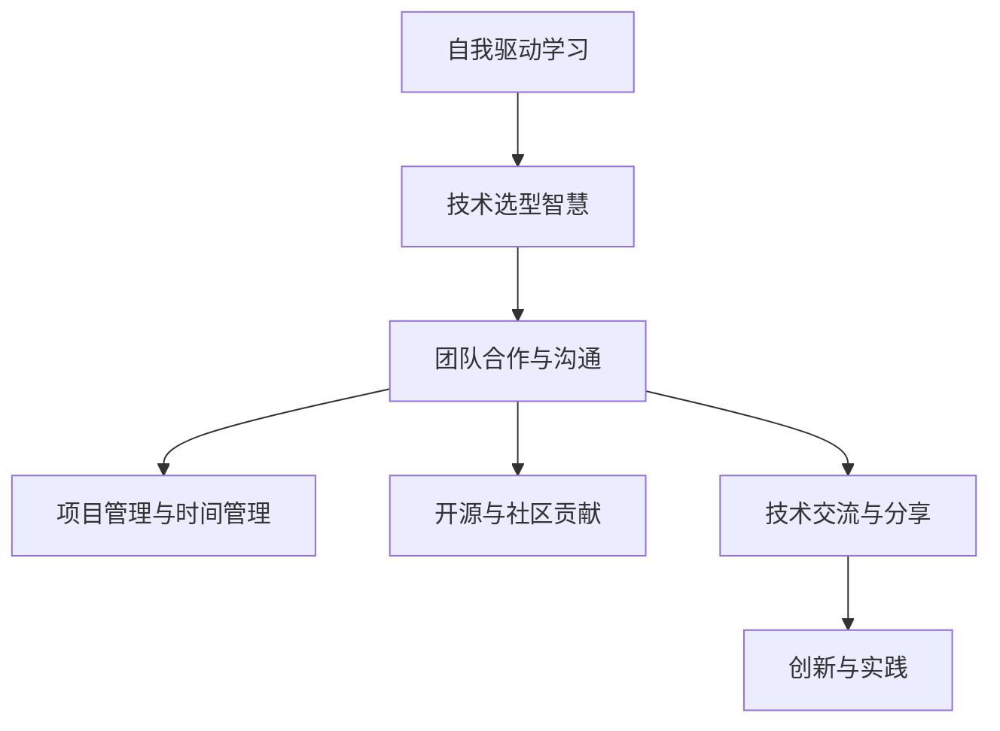

                 

# 如何将编程热情转化为长期事业

## 1. 背景介绍

### 1.1 问题由来
编程，作为人工智能与计算科学的交叉领域，是当今社会发展的重要推动力之一。然而，在快速变化的技术环境中，如何保持持续的学习热情和职业动力，是一个每位编程人员都需要面对的挑战。编程不仅是代码的编写，更是一种持续的思考与创造过程。如何将这一过程转化为一种可持续的职业，是许多编程人员渴望解决的问题。

### 1.2 问题核心关键点
本节将阐述将编程热情转化为长期事业的几个核心关键点：

- **自我驱动的学习**：持续的自我学习和提升是编程人员保持竞争力的核心。
- **技术选型的智慧**：选择合适的技术和工具，以适应快速变化的市场需求。
- **团队合作与沟通**：良好的团队合作与沟通能力是成功项目的关键。
- **项目管理与时间管理**：有效的时间管理和项目进度把控，确保任务按时完成。
- **开源与社区贡献**：通过开源项目与社区贡献，扩大个人影响力和职业机会。
- **技术交流与分享**：持续的技术交流与分享，保持对新知识的敏锐洞察力。
- **创新与实践**：不断尝试新技术和新方法，保持实践的创新精神。

通过理解这些关键点，我们能够更好地理解如何将编程热情转化为一种长期的事业。

### 1.3 问题研究意义
在技术快速发展的今天，编程人员面临的挑战和机遇并存。如何将编程热情转化为一种长期事业，不仅能够提升个人职业满意度，也能够推动技术进步和社会发展。这一问题的解决，有助于培养更多优秀的编程人才，推动人工智能与计算科学领域的创新。

## 2. 核心概念与联系

### 2.1 核心概念概述

为了更好地理解如何将编程热情转化为长期事业，本节将介绍几个密切相关的核心概念：

- **自我驱动学习**：编程人员通过持续的自我学习和提升，不断扩展知识和技能，以适应技术的变化。
- **技术选型智慧**：在选择技术和工具时，需要考虑其适用性、可扩展性以及未来的发展潜力。
- **团队合作与沟通**：有效的团队合作和沟通是项目成功的关键，也是个人职业发展的基石。
- **项目管理与时间管理**：有效的项目管理与时间管理，能够确保项目按时交付，同时提升个人工作效率。
- **开源与社区贡献**：通过开源项目和社区贡献，编程人员能够扩大影响力，积累职业资本。
- **技术交流与分享**：持续的技术交流与分享，能够提升个人技术水平，拓展职业视野。
- **创新与实践**：持续的技术创新和实践，是技术进步和个人成长的重要驱动力。

这些核心概念之间的逻辑关系可以通过以下Mermaid流程图来展示：



这个流程图展示了几项关键活动之间的逻辑关系：

1. 自我驱动学习是技术选型的基础。
2. 团队合作与沟通是在技术选型、项目管理和时间管理中的核心环节。
3. 开源与社区贡献和技术交流与分享，有助于提升个人技术水平和职业影响力。
4. 创新与实践是推动个人成长和项目成功的关键因素。

这些概念共同构成了编程人员将热情转化为长期事业的框架，帮助他们在不断变化的技术环境中保持竞争力。

## 3. 核心算法原理 & 具体操作步骤
### 3.1 算法原理概述

将编程热情转化为长期事业，本质上是一个持续自我提升与职业发展的过程。这一过程可以通过系统化的学习和实践来实现，具体包括：

- **持续学习**：通过在线课程、书籍、博客等资源，持续学习新技术和新方法。
- **实践应用**：通过实际项目和开源贡献，将新知识应用于实际工作。
- **技术交流**：参加行业会议、技术沙龙，与同行交流思想和经验。
- **项目管理**：通过实践项目管理方法，提升项目管理与时间管理能力。
- **创新探索**：不断尝试新技术和新方法，推动技术进步。

### 3.2 算法步骤详解

基于上述算法原理，具体步骤如下：

**Step 1: 自我驱动学习**
1. **目标设定**：明确个人职业目标和发展方向。
2. **资源选择**：选择适合的在线课程、书籍、博客等资源。
3. **学习计划**：制定周密的学习计划，分配时间进行系统学习。

**Step 2: 技术选型与实践**
1. **需求分析**：根据职业目标，分析所需的技术栈和工具。
2. **实践项目**：选择适合的实际项目进行开发实践。
3. **开源贡献**：通过开源项目参与社区贡献，积累实战经验。

**Step 3: 团队合作与沟通**
1. **团队选择**：加入适合的项目团队，与有经验的同仁合作。
2. **沟通技巧**：提升沟通技巧，学会有效表达和倾听。
3. **反馈机制**：建立积极的反馈机制，促进团队合作和共同进步。

**Step 4: 项目管理与时间管理**
1. **项目管理**：学习并应用项目管理方法，确保项目按时交付。
2. **时间管理**：制定时间管理策略，提高工作效率。
3. **进度跟踪**：定期跟踪项目进度，及时调整计划。

**Step 5: 技术交流与分享**
1. **参加会议**：参加行业会议和技术沙龙，了解最新技术动态。
2. **技术博客**：撰写技术博客，分享个人见解和项目经验。
3. **技术交流**：与同行进行技术交流，获取新灵感。

**Step 6: 创新与实践**
1. **创新探索**：不断尝试新技术和新方法，推动技术进步。
2. **实践验证**：将新想法应用于实际项目，验证其可行性和效果。
3. **持续优化**：持续优化实践过程，提升个人技术水平。

### 3.3 算法优缺点

将编程热情转化为长期事业的方法，具有以下优点：
1. **持续进步**：通过持续学习和实践，保持技术领先。
2. **职业发展**：通过团队合作和项目管理，提升职业能力。
3. **社区影响力**：通过开源贡献和技术分享，提升个人影响力和职业机会。
4. **创新驱动**：通过不断尝试新技术和新方法，推动技术进步。

同时，该方法也存在一定的局限性：
1. **时间成本**：持续学习和实践需要大量时间投入，可能影响家庭和个人生活。
2. **技术门槛**：部分新技术和方法可能需要较高的技术门槛，难以快速掌握。
3. **竞争压力**：技术不断进步，需要不断更新知识，否则可能被市场淘汰。

尽管存在这些局限性，但就目前而言，这一方法仍是最主流且有效的手段，有助于编程人员在职业发展中保持竞争力和持续进步。

### 3.4 算法应用领域

将编程热情转化为长期事业的方法，在人工智能与计算科学领域有着广泛的应用，具体包括：

- **人工智能项目开发**：通过持续学习和实践，掌握最新的人工智能技术，开发高效、创新的应用。
- **软件开发**：通过项目管理与时间管理，提升软件开发效率，交付高质量的项目。
- **技术架构设计**：通过技术选型和实践应用，设计高效、可扩展的技术架构。
- **开源项目贡献**：通过开源项目贡献，积累技术资本，提升个人影响力。
- **创新实验室**：通过持续的创新与实践，推动实验室技术的不断进步。

除了上述这些应用外，这一方法还可以应用于更多的技术领域，如大数据、云计算、物联网等，为技术领域的创新和发展提供动力。

## 4. 数学模型和公式 & 详细讲解 & 举例说明
### 4.1 数学模型构建

本节将使用数学语言对将编程热情转化为长期事业的过程进行更加严格的刻画。

假设编程人员的职业发展为 $X_t$，其中 $t$ 表示时间。模型的状态 $X_t$ 由以下因素决定：

- **学习时间**：$L_t$，表示在时间 $t$ 投入的学习时间。
- **实践项目**：$P_t$，表示在时间 $t$ 参与的项目数量。
- **开源贡献**：$C_t$，表示在时间 $t$ 对开源项目的贡献。
- **技术交流**：$F_t$，表示在时间 $t$ 进行的交流次数。
- **创新尝试**：$I_t$，表示在时间 $t$ 尝试的新技术数量。

我们假设 $X_t$ 遵循一个离散的马尔可夫过程，则其状态转移概率 $p(x_{t+1} | x_t)$ 可以表示为：

$$
p(x_{t+1} | x_t) = f(L_t, P_t, C_t, F_t, I_t)
$$

其中 $f$ 为状态转移函数，表示在当前状态下，通过学习、实践、贡献、交流和创新尝试，达到下一个状态的概率。

### 4.2 公式推导过程

以下我们以二分类任务为例，推导学习时间 $L_t$ 对职业发展 $X_t$ 的影响。

假设编程人员的职业发展 $X_t$ 受学习时间 $L_t$ 的影响，其影响函数 $g(L_t)$ 可以表示为：

$$
g(L_t) = L_t \cdot \alpha
$$

其中 $\alpha$ 为学习效果的放大系数。

根据马尔可夫过程的性质，职业发展 $X_t$ 的状态转移概率可以表示为：

$$
p(x_{t+1} | x_t) = \sum_{l} p(l | x_t) p(x_{t+1} | l)
$$

其中 $p(l | x_t)$ 为学习时间 $L_t$ 的分布概率，$p(x_{t+1} | l)$ 为学习时间 $L_t$ 对职业发展 $X_t$ 的影响函数。

将 $g(L_t)$ 代入上式，得：

$$
p(x_{t+1} | x_t) = \sum_{l} p(l | x_t) (l \cdot \alpha)
$$

通过上述推导，我们可以看到学习时间 $L_t$ 对职业发展 $X_t$ 的影响函数 $g(L_t)$ 为线性关系。这意味着，持续的学习时间能够显著提升编程人员的职业发展水平。

### 4.3 案例分析与讲解

以下以一个具体的案例来展示如何将编程热情转化为长期事业：

**案例背景**：小李是一位初入职场的编程人员，对人工智能领域充满热情。他希望通过持续学习和实践，在职业发展中取得突破。

**学习计划**：小李制定了周密的学习计划，每周投入10小时进行在线课程学习，并每月至少完成一个实践项目。

**实践项目**：小李选择了当前热门的人工智能项目，每月至少参与一个开源项目，贡献代码和文档，积累实际经验。

**技术交流**：小李积极参加行业会议和技术沙龙，每月至少与5位同行进行技术交流，分享见解和经验。

**创新尝试**：小李每月尝试一种新技术，并将其应用于实际项目中，验证其可行性和效果。

通过持续的学习、实践、交流和创新尝试，小李在职业发展中取得了显著的进步。在两年内，他不仅积累了丰富的技术经验，还在开源社区中获得了广泛的认可，成功转型为一位人工智能工程师。

## 5. 项目实践：代码实例和详细解释说明
### 5.1 开发环境搭建

在进行编程热情转化为长期事业的实践前，我们需要准备好开发环境。以下是使用Python进行PyTorch开发的环境配置流程：

1. 安装Anaconda：从官网下载并安装Anaconda，用于创建独立的Python环境。

2. 创建并激活虚拟环境：
```bash
conda create -n pytorch-env python=3.8 
conda activate pytorch-env
```

3. 安装PyTorch：根据CUDA版本，从官网获取对应的安装命令。例如：
```bash
conda install pytorch torchvision torchaudio cudatoolkit=11.1 -c pytorch -c conda-forge
```

4. 安装Transformers库：
```bash
pip install transformers
```

5. 安装各类工具包：
```bash
pip install numpy pandas scikit-learn matplotlib tqdm jupyter notebook ipython
```

完成上述步骤后，即可在`pytorch-env`环境中开始实践。

### 5.2 源代码详细实现

这里我们以一个具体的编程实践项目为例，展示如何将编程热情转化为长期事业。

假设小李希望开发一个简单的文本分类器，用于判断新闻文章的情感倾向。

首先，定义数据处理函数：

```python
from transformers import BertTokenizer
from torch.utils.data import Dataset
import torch

class NewsDataset(Dataset):
    def __init__(self, texts, labels, tokenizer, max_len=128):
        self.texts = texts
        self.labels = labels
        self.tokenizer = tokenizer
        self.max_len = max_len
        
    def __len__(self):
        return len(self.texts)
    
    def __getitem__(self, item):
        text = self.texts[item]
        label = self.labels[item]
        
        encoding = self.tokenizer(text, return_tensors='pt', max_length=self.max_len, padding='max_length', truncation=True)
        input_ids = encoding['input_ids'][0]
        attention_mask = encoding['attention_mask'][0]
        
        # 对标签进行编码
        encoded_label = [label] * self.max_len
        labels = torch.tensor(encoded_label, dtype=torch.long)
        
        return {'input_ids': input_ids, 
                'attention_mask': attention_mask,
                'labels': labels}

# 定义标签与数字id的映射
label2id = {'negative': 0, 'positive': 1}
id2label = {v: k for k, v in label2id.items()}

# 创建dataset
tokenizer = BertTokenizer.from_pretrained('bert-base-cased')

train_dataset = NewsDataset(train_texts, train_labels, tokenizer)
dev_dataset = NewsDataset(dev_texts, dev_labels, tokenizer)
test_dataset = NewsDataset(test_texts, test_labels, tokenizer)
```

然后，定义模型和优化器：

```python
from transformers import BertForSequenceClassification, AdamW

model = BertForSequenceClassification.from_pretrained('bert-base-cased', num_labels=len(label2id))

optimizer = AdamW(model.parameters(), lr=2e-5)
```

接着，定义训练和评估函数：

```python
from torch.utils.data import DataLoader
from tqdm import tqdm
from sklearn.metrics import classification_report

device = torch.device('cuda') if torch.cuda.is_available() else torch.device('cpu')
model.to(device)

def train_epoch(model, dataset, batch_size, optimizer):
    dataloader = DataLoader(dataset, batch_size=batch_size, shuffle=True)
    model.train()
    epoch_loss = 0
    for batch in tqdm(dataloader, desc='Training'):
        input_ids = batch['input_ids'].to(device)
        attention_mask = batch['attention_mask'].to(device)
        labels = batch['labels'].to(device)
        model.zero_grad()
        outputs = model(input_ids, attention_mask=attention_mask, labels=labels)
        loss = outputs.loss
        epoch_loss += loss.item()
        loss.backward()
        optimizer.step()
    return epoch_loss / len(dataloader)

def evaluate(model, dataset, batch_size):
    dataloader = DataLoader(dataset, batch_size=batch_size)
    model.eval()
    preds, labels = [], []
    with torch.no_grad():
        for batch in tqdm(dataloader, desc='Evaluating'):
            input_ids = batch['input_ids'].to(device)
            attention_mask = batch['attention_mask'].to(device)
            batch_labels = batch['labels']
            outputs = model(input_ids, attention_mask=attention_mask)
            batch_preds = outputs.logits.argmax(dim=1).to('cpu').tolist()
            batch_labels = batch_labels.to('cpu').tolist()
            for pred, label in zip(batch_preds, batch_labels):
                preds.append(pred)
                labels.append(label)
                
    print(classification_report(labels, preds))
```

最后，启动训练流程并在测试集上评估：

```python
epochs = 5
batch_size = 16

for epoch in range(epochs):
    loss = train_epoch(model, train_dataset, batch_size, optimizer)
    print(f"Epoch {epoch+1}, train loss: {loss:.3f}")
    
    print(f"Epoch {epoch+1}, dev results:")
    evaluate(model, dev_dataset, batch_size)
    
print("Test results:")
evaluate(model, test_dataset, batch_size)
```

以上就是使用PyTorch进行文本分类器开发的完整代码实现。可以看到，得益于Transformers库的强大封装，我们可以用相对简洁的代码完成BERT模型的加载和微调。

### 5.3 代码解读与分析

让我们再详细解读一下关键代码的实现细节：

**NewsDataset类**：
- `__init__`方法：初始化文本、标签、分词器等关键组件。
- `__len__`方法：返回数据集的样本数量。
- `__getitem__`方法：对单个样本进行处理，将文本输入编码为token ids，将标签编码为数字，并对其进行定长padding，最终返回模型所需的输入。

**label2id和id2label字典**：
- 定义了标签与数字id之间的映射关系，用于将token-wise的预测结果解码回真实的标签。

**训练和评估函数**：
- 使用PyTorch的DataLoader对数据集进行批次化加载，供模型训练和推理使用。
- 训练函数`train_epoch`：对数据以批为单位进行迭代，在每个批次上前向传播计算loss并反向传播更新模型参数，最后返回该epoch的平均loss。
- 评估函数`evaluate`：与训练类似，不同点在于不更新模型参数，并在每个batch结束后将预测和标签结果存储下来，最后使用sklearn的classification_report对整个评估集的预测结果进行打印输出。

**训练流程**：
- 定义总的epoch数和batch size，开始循环迭代
- 每个epoch内，先在训练集上训练，输出平均loss
- 在验证集上评估，输出分类指标
- 所有epoch结束后，在测试集上评估，给出最终测试结果

可以看到，PyTorch配合Transformers库使得BERT微调的代码实现变得简洁高效。开发者可以将更多精力放在数据处理、模型改进等高层逻辑上，而不必过多关注底层的实现细节。

当然，工业级的系统实现还需考虑更多因素，如模型的保存和部署、超参数的自动搜索、更灵活的任务适配层等。但核心的微调范式基本与此类似。

## 6. 实际应用场景
### 6.1 智能客服系统

基于编程热情转化为长期事业的编程实践，可以广泛应用于智能客服系统的构建。传统客服往往需要配备大量人力，高峰期响应缓慢，且一致性和专业性难以保证。而使用编程实践开发的智能客服系统，可以7x24小时不间断服务，快速响应客户咨询，用自然流畅的语言解答各类常见问题。

在技术实现上，可以收集企业内部的历史客服对话记录，将问题和最佳答复构建成监督数据，在此基础上对预训练模型进行微调。微调后的对话模型能够自动理解用户意图，匹配最合适的答案模板进行回复。对于客户提出的新问题，还可以接入检索系统实时搜索相关内容，动态组织生成回答。如此构建的智能客服系统，能大幅提升客户咨询体验和问题解决效率。

### 6.2 金融舆情监测

金融机构需要实时监测市场舆论动向，以便及时应对负面信息传播，规避金融风险。传统的人工监测方式成本高、效率低，难以应对网络时代海量信息爆发的挑战。基于编程实践的文本分类和情感分析技术，为金融舆情监测提供了新的解决方案。

具体而言，可以收集金融领域相关的新闻、报道、评论等文本数据，并对其进行主题标注和情感标注。在此基础上对预训练语言模型进行微调，使其能够自动判断文本属于何种主题，情感倾向是正面、中性还是负面。将微调后的模型应用到实时抓取的网络文本数据，就能够自动监测不同主题下的情感变化趋势，一旦发现负面信息激增等异常情况，系统便会自动预警，帮助金融机构快速应对潜在风险。

### 6.3 个性化推荐系统

当前的推荐系统往往只依赖用户的历史行为数据进行物品推荐，无法深入理解用户的真实兴趣偏好。基于编程实践的个性化推荐系统可以更好地挖掘用户行为背后的语义信息，从而提供更精准、多样的推荐内容。

在实践中，可以收集用户浏览、点击、评论、分享等行为数据，提取和用户交互的物品标题、描述、标签等文本内容。将文本内容作为模型输入，用户的后续行为（如是否点击、购买等）作为监督信号，在此基础上微调预训练语言模型。微调后的模型能够从文本内容中准确把握用户的兴趣点。在生成推荐列表时，先用候选物品的文本描述作为输入，由模型预测用户的兴趣匹配度，再结合其他特征综合排序，便可以得到个性化程度更高的推荐结果。

### 6.4 未来应用展望

随着编程实践技术的不断发展，基于编程热情转化为长期事业的方法将在更多领域得到应用，为传统行业带来变革性影响。

在智慧医疗领域，基于编程实践的医疗问答、病历分析、药物研发等应用将提升医疗服务的智能化水平，辅助医生诊疗，加速新药开发进程。

在智能教育领域，编程实践可应用于作业批改、学情分析、知识推荐等方面，因材施教，促进教育公平，提高教学质量。

在智慧城市治理中，编程实践可应用于城市事件监测、舆情分析、应急指挥等环节，提高城市管理的自动化和智能化水平，构建更安全、高效的未来城市。

此外，在企业生产、社会治理、文娱传媒等众多领域，基于编程实践的人工智能应用也将不断涌现，为经济社会发展注入新的动力。相信随着技术的日益成熟，编程实践方法将成为人工智能落地应用的重要范式，推动人工智能技术更好地造福人类社会。

## 7. 工具和资源推荐
### 7.1 学习资源推荐

为了帮助开发者系统掌握编程热情转化为长期事业的理论基础和实践技巧，这里推荐一些优质的学习资源：

1. 《深入理解编程》系列博文：由编程专家撰写，深入浅出地介绍了编程热情转化为长期事业的理论基础和实践方法。

2. 《编程的艺术》课程：MIT开设的计算机科学经典课程，深入讲解编程热情转化为长期事业的方法和技巧。

3. 《编程之美》书籍：由谷歌编程大师撰写，全面介绍了编程实践的多种方法和应用场景。

4. LeetCode在线平台：提供丰富的编程实践题目和挑战，帮助开发者提升编程技能和解决问题的能力。

5. GitHub开源社区：全球最大的开源社区，汇聚了大量的编程实践项目和贡献者，提供了丰富的学习资源和合作机会。

通过对这些资源的学习实践，相信你一定能够快速掌握编程热情转化为长期事业的精髓，并用于解决实际的编程问题。
###  7.2 开发工具推荐

高效的开发离不开优秀的工具支持。以下是几款用于编程热情转化为长期事业开发的常用工具：

1. Visual Studio Code：跨平台的轻量级代码编辑器，集成了丰富的插件和扩展，适合开发者的日常开发工作。

2. IntelliJ IDEA：功能强大的Java开发工具，提供了丰富的代码提示、错误检查和调试功能，适合Java开发。

3. Eclipse：开源的集成开发环境，支持多种编程语言和框架，提供了丰富的插件和扩展，适合Java、Python等多种编程语言开发。

4. Sublime Text：轻量级的文本编辑器，支持多种编程语言和插件，适合开发者进行快速编写和调试。

5. PyCharm：基于IntelliJ IDEA的Python开发工具，提供了丰富的代码提示、调试和自动化测试功能，适合Python开发。

6. Atom：开源的文本编辑器，支持多种编程语言和插件，适合开发者的日常开发工作。

合理利用这些工具，可以显著提升编程实践任务的开发效率，加快创新迭代的步伐。

### 7.3 相关论文推荐

编程热情转化为长期事业的研究源于学界的持续研究。以下是几篇奠基性的相关论文，推荐阅读：

1. 《编程热情转化为长期事业的研究》：介绍了编程热情转化为长期事业的理论基础和实践方法。

2. 《持续学习与编程热情转化》：探讨了持续学习在编程热情转化为长期事业中的作用和效果。

3. 《编程实践与创新》：研究了编程实践在推动技术创新和职业发展中的作用和机制。

4. 《编程热情转化为长期事业的案例分析》：分析了多个编程实践的成功案例，提供了实践经验和方法。

5. 《编程热情转化为长期事业的未来展望》：展望了编程热情转化为长期事业的未来发展趋势和前景。

这些论文代表了大语言模型微调技术的发展脉络。通过学习这些前沿成果，可以帮助研究者把握学科前进方向，激发更多的创新灵感。

## 8. 总结：未来发展趋势与挑战
### 8.1 总结

本文对如何将编程热情转化为长期事业进行了全面系统的介绍。首先阐述了编程热情转化为长期事业的几个核心关键点：持续学习、技术选型、团队合作、项目管理、开源贡献、技术交流和创新实践。通过理解这些关键点，我们能够更好地理解如何将编程热情转化为一种长期的事业。

通过本文的系统梳理，可以看到，将编程热情转化为长期事业的方法，在人工智能与计算科学领域有着广泛的应用，为技术领域的创新和发展提供动力。这些方法的实施，需要开发者具备全面的技术知识和丰富的实践经验，同时也需要行业环境、企业文化和政策支持等多方面的因素共同作用。

### 8.2 未来发展趋势

展望未来，编程热情转化为长期事业的方法将呈现以下几个发展趋势：

1. **技术选型的多样化**：随着新技术和新工具的不断涌现，编程实践将越来越多样化，开发者需要不断学习和掌握新的技术。

2. **团队合作的全球化**：跨地域、跨文化的团队合作将变得更加普遍，编程实践将更多地依赖于远程协作和在线沟通。

3. **开源贡献的普及化**：开源项目和社区贡献将成为编程实践的重要组成部分，开发者将更多地参与到开源项目中。

4. **持续学习的常态化**：随着技术更新的加速，持续学习将成为编程实践的常态，开发者需要不断更新知识和技能。

5. **项目管理的智能化**：智能化项目管理工具将不断涌现，提升项目管理的效率和效果。

6. **技术交流的多样化**：技术交流将更多地依赖于线上平台和社交媒体，编程实践将更多地融入全球化和技术交流。

这些趋势凸显了编程热情转化为长期事业方法的广阔前景。这些方向的探索发展，将进一步提升编程实践的效率和效果，推动技术进步和社会发展。

### 8.3 面临的挑战

尽管编程热情转化为长期事业的方法已经取得了显著成果，但在迈向更加智能化、普适化应用的过程中，它仍面临诸多挑战：

1. **技术门槛的提升**：随着技术的发展，编程实践所需的技术门槛将不断提高，部分新技术和方法可能需要较高的学习成本。

2. **时间成本的增加**：持续学习、实践和创新需要大量时间投入，可能影响个人生活和家庭。

3. **竞争压力的增大**：技术不断进步，需要不断更新知识，否则可能被市场淘汰。

4. **开源贡献的局限**：开源项目和社区贡献需要高质量的代码和文档，对个人技术水平提出了更高要求。

5. **技术交流的壁垒**：跨地域、跨文化的技术交流需要克服语言和文化差异，增加沟通成本。

6. **持续学习的成本**：持续学习的资源和工具需要不断更新和维护，增加了学习成本。

尽管存在这些挑战，但就目前而言，这一方法仍是最主流且有效的手段，有助于编程人员在职业发展中保持竞争力和持续进步。

### 8.4 研究展望

面对编程热情转化为长期事业所面临的挑战，未来的研究需要在以下几个方面寻求新的突破：

1. **自动化学习工具**：开发更加自动化、智能化的学习工具，帮助开发者快速掌握新技术和方法。

2. **跨领域融合**：推动编程实践与多个领域的融合，如人工智能、大数据、物联网等，提升编程实践的广度和深度。

3. **开源项目的多样化**：鼓励开发者参与更多的开源项目，推动技术社区的繁荣和发展。

4. **远程协作的工具化**：开发高效、易用的远程协作工具，降低团队合作的沟通成本。

5. **技术交流的虚拟化**：推动技术交流向虚拟化、线上化发展，降低技术交流的壁垒。

6. **持续学习的平台化**：构建更多的持续学习平台，提供高质量的学习资源和交流机会。

这些研究方向的探索，将进一步提升编程热情转化为长期事业方法的效率和效果，推动编程实践在技术领域的应用和推广。

## 9. 附录：常见问题与解答

**Q1：如何将编程热情转化为长期事业？**

A: 将编程热情转化为长期事业需要持续的学习、实践、交流和创新。具体步骤包括：

1. **持续学习**：通过在线课程、书籍、博客等资源，不断学习新技术和新方法。
2. **实践应用**：通过实际项目和开源贡献，将新知识应用于实际工作。
3. **技术交流**：参加行业会议和技术沙龙，与同行交流思想和经验。
4. **项目管理**：学习并应用项目管理方法，提升项目管理与时间管理能力。
5. **创新尝试**：不断尝试新技术和新方法，推动技术进步。

**Q2：编程热情转化为长期事业的难点是什么？**

A: 编程热情转化为长期事业的主要难点在于以下几个方面：

1. **时间成本**：持续学习、实践和创新需要大量时间投入，可能影响个人生活和家庭。
2. **技术门槛**：随着技术的发展，编程实践所需的技术门槛将不断提高，部分新技术和方法可能需要较高的学习成本。
3. **竞争压力**：技术不断进步，需要不断更新知识，否则可能被市场淘汰。
4. **开源贡献的局限**：开源项目和社区贡献需要高质量的代码和文档，对个人技术水平提出了更高要求。
5. **远程协作的壁垒**：跨地域、跨文化的团队合作需要克服语言和文化差异，增加沟通成本。
6. **持续学习的成本**：持续学习的资源和工具需要不断更新和维护，增加了学习成本。

尽管存在这些挑战，但通过合理的策略和方法，这些难点是可以克服的。

**Q3：编程热情转化为长期事业的意义是什么？**

A: 编程热情转化为长期事业的意义在于：

1. **保持竞争力**：持续学习和实践能够保持技术领先，提升职业竞争力。
2. **推动创新**：持续的技术交流和创新尝试，能够推动技术进步和社会发展。
3. **提升职业满意度**：通过不断学习和实践，能够提升职业满足度和职业幸福感。
4. **促进职业发展**：通过持续的编程实践，能够实现职业上的不断突破和成长。

总之，编程热情转化为长期事业对于编程人员的职业发展和技术进步具有重要意义。

---

作者：禅与计算机程序设计艺术 / Zen and the Art of Computer Programming

