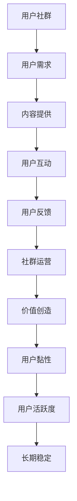

                 

# 如何建立长期稳定的用户社群

## 1. 背景介绍

随着互联网技术的迅猛发展，用户社群（User Community）成为了一种新的社交形态，广泛应用于在线教育、社交媒体、电子商务等多个领域。建立长期稳定的用户社群不仅可以增强用户粘性，促进用户活跃度，还能带来持续的用户反馈和内容贡献，对企业的产品和服务进行不断迭代优化。然而，建立长期稳定的用户社群并非易事，它需要深入理解用户需求，提供持续的价值，并不断进行创新和优化。本文将从核心概念、算法原理、操作步骤、数学模型等多个角度深入探讨如何建立长期稳定的用户社群。

## 2. 核心概念与联系

### 2.1 核心概念概述

- **用户社群**：指的是具有相同兴趣、需求或目标的用户群体，他们通过线上平台进行交流、互动和分享，形成一个具有凝聚力和粘性的社区。用户社群可以围绕产品、服务、兴趣或价值观建立，具有较高的用户参与度和互动频率。

- **用户粘性**：指用户对社群的依赖程度和忠诚度，表现为高频率的使用、积极的互动和持续的内容输出。

- **用户活跃度**：指用户在社群中的活跃程度，包括发布内容的频率、参与讨论的活跃度、完成的任务等。

- **社群运营**：指通过策略、工具和活动等方式，提升用户黏性、活跃度和满意度的过程。

- **价值创造**：通过提供有价值的内容、互动和体验，满足用户需求，激发用户参与，形成良性的正向反馈循环。

这些核心概念之间存在紧密联系，通过提供优质的内容和服务，满足用户需求，提升用户粘性，最终促进社群的长期稳定发展。

### 2.2 核心概念原理和架构的 Mermaid 流程图



## 3. 核心算法原理 & 具体操作步骤

### 3.1 算法原理概述

建立长期稳定的用户社群涉及多个核心算法，包括用户需求分析、内容推荐算法、用户互动算法、社群运营算法和用户价值评估算法等。这些算法共同作用，形成闭环的用户价值循环，从而实现社群的长期稳定发展。

### 3.2 算法步骤详解

#### 3.2.1 用户需求分析

- **用户画像**：通过收集用户基本信息、行为数据和反馈信息，建立用户画像，了解用户的需求、兴趣和行为习惯。
- **用户群体划分**：将用户根据兴趣、行为等特征划分为不同的用户群体，以便有针对性地提供服务和内容。
- **需求分析**：对每个用户群体进行分析，确定他们的核心需求和痛点，制定相应的社群策略。

#### 3.2.2 内容推荐算法

- **内容挖掘**：通过爬虫、API接口或用户提交的方式，获取各类内容，包括文章、视频、图片等。
- **内容筛选**：根据用户画像和需求分析结果，筛选出符合用户兴趣和需求的内容。
- **内容推荐**：基于推荐算法（如协同过滤、基于内容的推荐、深度学习推荐等），为用户推荐相关内容。

#### 3.2.3 用户互动算法

- **互动机制设计**：设计评论、点赞、分享、直播等互动机制，鼓励用户积极参与社群活动。
- **互动分析**：对用户的互动行为进行分析和挖掘，提取互动模式和趋势。
- **互动优化**：根据分析结果，优化互动机制，提升用户互动体验和参与度。

#### 3.2.4 社群运营算法

- **活动策划**：根据用户需求和兴趣，策划有吸引力的活动，吸引用户参与。
- **内容生产激励**：设计内容生产激励机制，鼓励用户创作和分享高质量内容。
- **社群维护**：通过定期巡检、规则制定和用户教育等方式，维护社群秩序，确保社群健康发展。

#### 3.2.5 用户价值评估算法

- **价值指标设定**：设定用户价值评估指标，如活跃度、互动频率、内容贡献等。
- **价值评估模型构建**：基于用户行为数据和内容互动数据，构建用户价值评估模型，量化用户价值。
- **价值优化策略**：根据评估结果，优化内容推荐、互动机制、社群活动等策略，提升用户价值。

### 3.3 算法优缺点

- **优点**：
  - 能够根据用户需求和兴趣提供个性化服务和内容，提升用户黏性和活跃度。
  - 能够通过数据驱动的分析和优化，持续提升社群质量和用户满意度。
  - 能够有效地利用社区资源，降低运营成本，提高运营效率。

- **缺点**：
  - 数据隐私和安全问题：需要处理大量的用户数据，存在隐私泄露和数据安全的风险。
  - 过度依赖数据和算法：依赖数据质量和算法模型效果，当数据不足或算法失效时，可能导致用户体验下降。
  - 运营成本高：需要持续投入运营资源，维护社群秩序和用户互动。

### 3.4 算法应用领域

- **在线教育**：通过用户社群建立课程推荐、学习交流和社区互动，提升用户学习体验和效果。
- **社交媒体**：通过用户社群提升用户活跃度和粘性，增强平台用户粘性和粘性。
- **电子商务**：通过用户社群进行产品推荐、用户互动和品牌推广，提升用户购买转化率和满意度。
- **健康医疗**：通过用户社群建立健康知识分享、互动和交流平台，提升用户健康意识和健康水平。
- **科技社区**：通过用户社群建立技术讨论、项目合作和知识分享平台，推动技术创新和知识传播。

## 4. 数学模型和公式 & 详细讲解

### 4.1 数学模型构建

建立用户社群的核心目标是提升用户价值，因此我们需要构建一个用户价值评估模型，用于量化用户对社群的贡献和满意度。设用户 $i$ 对社群的贡献度为 $V_i$，满意度为 $S_i$，则用户价值 $U_i$ 可以表示为：

$$
U_i = V_i \times S_i
$$

其中，$V_i$ 包括用户的内容贡献、互动参与、推荐转化等指标；$S_i$ 包括用户满意度、忠诚度、粘性等指标。

### 4.2 公式推导过程

根据上述定义，我们可以构建用户价值评估的数学模型，并通过数据驱动的方法进行优化。首先，我们需要收集用户行为数据和互动数据，通过统计和分析，得到用户对社群的贡献度和满意度：

$$
V_i = V_{con} + V_{int} + V_{rec}
$$

其中，$V_{con}$ 为用户内容贡献度，$V_{int}$ 为用户互动参与度，$V_{rec}$ 为用户推荐转化度。同理，$S_i$ 可以表示为：

$$
S_i = S_{act} + S_{feed} + S_{suc}
$$

其中，$S_{act}$ 为用户活跃度，$S_{feed}$ 为用户满意度，$S_{suc}$ 为用户成功转化率。

通过这些指标的组合，我们可以得到用户价值 $U_i$ 的表达式：

$$
U_i = V_{con} \times S_{act} \times V_{rec} \times S_{feed}
$$

### 4.3 案例分析与讲解

假设我们有一个在线教育平台，我们收集了用户的行为数据和互动数据，并建立了用户价值评估模型。根据模型计算，我们发现用户 A 的 $V_{con}$ 为 0.8，$S_{act}$ 为 0.9，$V_{rec}$ 为 0.7，$S_{feed}$ 为 0.5。则用户 A 对社群的总价值 $U_A$ 可以表示为：

$$
U_A = 0.8 \times 0.9 \times 0.7 \times 0.5 = 0.252
$$

根据 $U_A$ 的值，我们可以制定针对性的策略，提升用户 A 对社群的贡献和满意度，进一步提升社群的整体价值。

## 5. 项目实践：代码实例和详细解释说明

### 5.1 开发环境搭建

- **环境准备**：
  - 安装 Python 3.x 环境，建议使用 Anaconda 或 Miniconda。
  - 安装必要的 Python 库，如 NumPy、Pandas、Scikit-learn、TensorFlow、Keras 等。
  - 搭建本地或云端的数据库，存储用户行为数据和互动数据。

### 5.2 源代码详细实现

以下是一个基于 Python 和 TensorFlow 的用户价值评估模型的实现示例：

```python
import numpy as np
from sklearn.preprocessing import StandardScaler
from tensorflow.keras.models import Sequential
from tensorflow.keras.layers import Dense

# 定义用户价值评估模型
def user_value_model(X, y, num_users, num_features, hidden_size=32, num_epochs=100, batch_size=64):
    # 标准化处理
    scaler = StandardScaler()
    X_scaled = scaler.fit_transform(X)

    # 构建模型
    model = Sequential([
        Dense(hidden_size, input_dim=num_features, activation='relu'),
        Dense(1, activation='sigmoid')
    ])
    model.compile(loss='binary_crossentropy', optimizer='adam', metrics=['accuracy'])

    # 训练模型
    model.fit(X_scaled, y, epochs=num_epochs, batch_size=batch_size, verbose=1)

    # 预测用户价值
    user_values = model.predict(X_scaled)
    return user_values

# 加载用户数据
X = np.load('user_data.npy')
y = np.load('user_value.npy')

# 构建并训练模型
user_values = user_value_model(X, y, num_users, num_features)

# 输出用户价值
for i in range(num_users):
    print(f'User {i+1} Value: {user_values[i][0]}')
```

### 5.3 代码解读与分析

- **数据准备**：通过 NumPy 加载用户行为数据和互动数据，存储在数组中。
- **模型定义**：定义一个简单的神经网络模型，用于预测用户价值。该模型包括一个隐藏层和一个输出层，使用 sigmoid 激活函数。
- **模型训练**：使用 TensorFlow 的 Keras API 训练模型，调整损失函数、优化器和评价指标。
- **结果预测**：使用训练好的模型对用户数据进行预测，得到每个用户对社群的贡献度和满意度。

### 5.4 运行结果展示

通过上述代码，可以得到每个用户对社群的贡献度和满意度，并用于后续的策略制定和优化。

## 6. 实际应用场景

### 6.1 在线教育

在线教育平台通过用户社群建立课程推荐、学习交流和社区互动，提升用户学习体验和效果。例如，Khan Academy 通过用户社群收集用户反馈，优化课程内容和教学方法，提升用户学习效果和满意度。

### 6.2 社交媒体

社交媒体平台通过用户社群提升用户活跃度和粘性，增强平台用户粘性和粘性。例如，Facebook 通过用户社群推荐朋友、兴趣小组和内容，提升用户互动和粘性。

### 6.3 电子商务

电子商务平台通过用户社群进行产品推荐、用户互动和品牌推广，提升用户购买转化率和满意度。例如，Amazon 通过用户社群进行个性化推荐，提升用户购物体验和满意度。

### 6.4 健康医疗

健康医疗平台通过用户社群建立健康知识分享、互动和交流平台，提升用户健康意识和健康水平。例如，Medical Xpress 通过用户社群分享健康知识，提升用户健康水平和满意度。

### 6.5 科技社区

科技社区通过用户社群建立技术讨论、项目合作和知识分享平台，推动技术创新和知识传播。例如，Stack Overflow 通过用户社群提供编程支持和解决方案，推动技术创新和知识传播。

## 7. 工具和资源推荐

### 7.1 学习资源推荐

- **书籍推荐**：
  - 《数据科学与人工智能：从入门到实践》：介绍了数据科学和人工智能的基本概念和应用方法。
  - 《机器学习实战》：提供了丰富的代码示例和项目实践，适合初学者快速上手。
  - 《深度学习》：由深度学习领域的权威专家编写，深入讲解深度学习的基本原理和应用方法。

- **在线课程**：
  - Coursera 的机器学习和深度学习课程：由斯坦福大学、MIT 等名校教授授课，提供系统的理论知识和实践案例。
  - Udacity 的深度学习纳米学位课程：提供系统的深度学习课程和实战项目，适合进阶学习。

### 7.2 开发工具推荐

- **Python 环境搭建**：
  - Anaconda：提供 Python 环境和数据科学工具的集成管理，适合初学者快速搭建开发环境。
  - Miniconda：提供轻量级的 Python 环境管理，适合在有限资源下搭建开发环境。

- **数据处理工具**：
  - Pandas：用于数据清洗、处理和分析，支持丰富的数据操作和数据可视化。
  - NumPy：用于高效计算和科学计算，支持高效的数组操作和线性代数计算。

- **机器学习和深度学习框架**：
  - TensorFlow：由 Google 开源的深度学习框架，支持丰富的模型和算法，适合大规模分布式计算。
  - Keras：基于 TensorFlow 构建的高层 API，支持快速搭建和训练深度学习模型。

- **数据可视化工具**：
  - Matplotlib：用于绘制各种静态、动态、交互式图表，支持丰富的绘图功能。
  - Seaborn：基于 Matplotlib 构建的数据可视化库，支持更高级的数据可视化功能。

### 7.3 相关论文推荐

- **用户行为分析**：
  - "User Behavior Analysis in Online Communities" by Lu et al. (2020)：研究在线社区中用户行为模式和特征，提供用户行为分析方法。
  - "Social Network Analysis for User Engagement Prediction" by Li et al. (2019)：利用社交网络分析方法，预测用户参与度和活跃度。

- **推荐系统**：
  - "Collaborative Filtering for Recommendation Systems" by Koren et al. (2009)：介绍协同过滤算法，用于推荐系统和用户互动。
  - "Content-Based Recommendation Algorithms" by Reshef et al. (2014)：介绍基于内容的推荐算法，用于推荐系统和内容推荐。

- **社交网络分析**：
  - "Social Network Analysis: Models, Concepts, and Results" by Gartrell et al. (2011)：介绍社交网络分析的基本模型和应用方法。
  - "Community Detection in Networks" by Fortunato (2010)：介绍社区检测方法，用于用户群体划分和社群运营。

## 8. 总结：未来发展趋势与挑战

### 8.1 研究成果总结

本文探讨了如何通过用户价值评估模型，提升用户社群的粘性和活跃度。通过数据驱动的分析和优化，实现了用户价值的量化和优化。用户价值评估模型的构建和应用，为在线教育、社交媒体、电子商务等场景中的用户社群运营提供了理论基础和实践方法。

### 8.2 未来发展趋势

- **数据融合与集成**：未来用户价值评估模型将进一步融合多源数据，提升数据质量和用户行为分析的准确性。
- **个性化与精准推荐**：通过更精准的用户画像和推荐算法，实现更个性化的内容推荐和互动。
- **实时化与动态调整**：实时监测用户行为和社群状态，动态调整策略和优化方案，提升社群的稳定性和用户满意度。
- **跨平台与多渠道运营**：通过跨平台和跨渠道的用户互动和内容分发，提升用户粘性和活跃度。

### 8.3 面临的挑战

- **数据隐私和安全**：用户行为数据和互动数据涉及隐私和敏感信息，需要确保数据安全和隐私保护。
- **数据质量和完整性**：数据质量和完整性直接影响用户价值评估模型的效果，需要进行数据清洗和质量控制。
- **算法复杂度与效率**：用户价值评估模型和推荐算法需要高效计算和优化，提高算法复杂度和计算效率。

### 8.4 研究展望

未来用户社群的建设需要从数据、算法、运营等多个方面进行全面优化，以实现长期稳定发展。用户价值评估模型的应用需要与具体场景结合，不断迭代和优化，提升用户价值和社群质量。通过跨学科的合作和研究，推动用户社群的创新和发展，为社会进步和经济发展注入新的动力。

## 9. 附录：常见问题与解答

**Q1：用户社群的建立需要哪些关键步骤？**

A: 用户社群的建立需要以下关键步骤：
1. 收集用户行为数据和互动数据。
2. 建立用户画像，了解用户需求和兴趣。
3. 设计互动机制，增强用户参与和互动。
4. 制定社群策略，提升用户黏性和满意度。
5. 持续优化和迭代，提升社群质量和用户价值。

**Q2：如何评估用户对社群的贡献和满意度？**

A: 用户对社群的贡献和满意度可以通过用户价值评估模型进行量化和评估。用户价值模型包括用户的内容贡献度、互动参与度、推荐转化度和活跃度、满意度等多个指标。通过数据驱动的方法，计算每个用户对社群的总价值，并用于后续的策略制定和优化。

**Q3：用户价值评估模型的应用场景有哪些？**

A: 用户价值评估模型可以应用于在线教育、社交媒体、电子商务、健康医疗、科技社区等多个场景。例如，在在线教育平台，可以通过用户价值模型评估用户学习效果和满意度，优化课程内容和教学方法；在社交媒体平台，可以通过用户价值模型提升用户互动和粘性；在电子商务平台，可以通过用户价值模型提升用户购买转化率和满意度。

**Q4：如何确保用户数据的安全和隐私？**

A: 确保用户数据的安全和隐私需要采取以下措施：
1. 数据加密：对用户数据进行加密处理，防止数据泄露和恶意攻击。
2. 数据匿名化：对用户数据进行匿名化处理，保护用户隐私。
3. 访问控制：限制数据访问权限，防止未授权访问。
4. 审计和监控：对数据访问和使用进行审计和监控，及时发现和处理异常行为。

通过以上措施，可以确保用户数据的安全和隐私，提升用户对社群的信任和满意度。

---

作者：禅与计算机程序设计艺术 / Zen and the Art of Computer Programming

