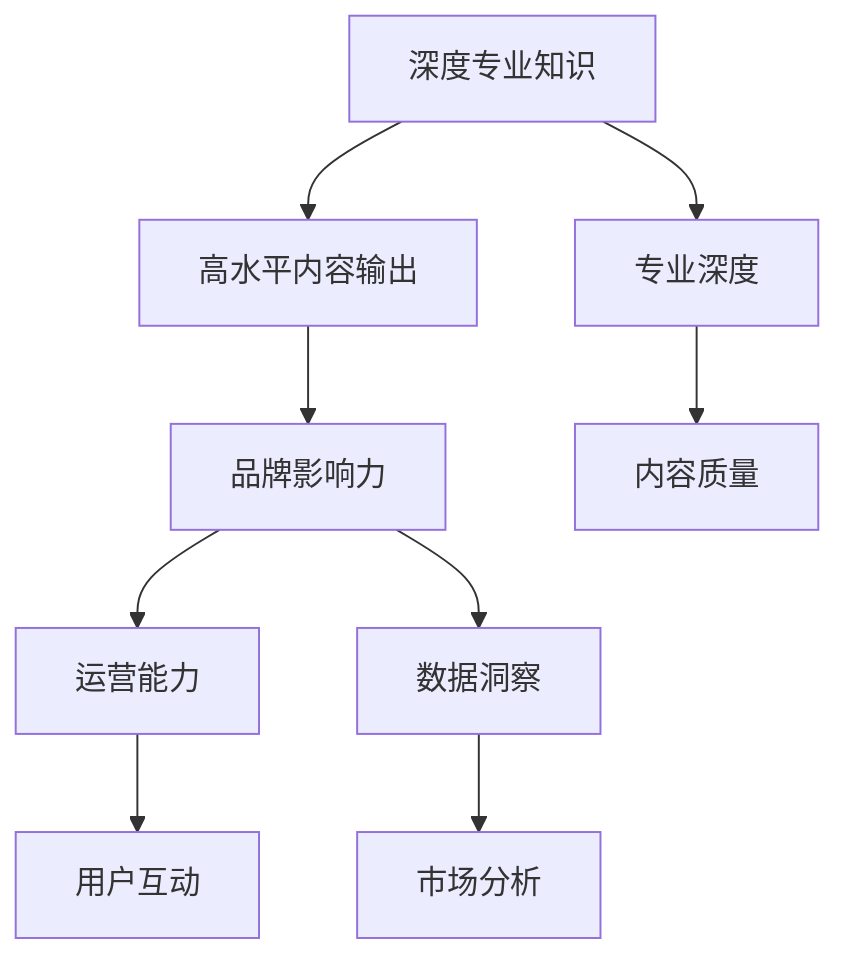

                 

# 如何成为知识付费行业的意见领袖

> 关键词：知识付费、内容创作者、意见领袖、技能提升、平台建设、运营策略、用户互动、市场分析

## 1. 背景介绍

### 1.1 问题由来

知识付费行业在过去几年中迅速崛起，成为信息时代的重要组成部分。越来越多的个人和企业开始利用互联网平台提供有价值的内容，获取收益。在这种背景下，如何成为知识付费行业的意见领袖，成为许多内容创作者和企业的核心诉求。

### 1.2 问题核心关键点

要成为知识付费行业的意见领袖，需要具备以下几个关键点：

1. **深度专业知识**：在某一领域内具备深入理解和丰富的经验。
2. **高水平内容输出**：能够创作高质量、有价值的内容，满足用户需求。
3. **品牌影响力**：通过平台和个人品牌，积累一定的用户基础和市场认可度。
4. **运营能力**：具备内容创作、市场推广、用户互动等全面的运营技能。
5. **数据洞察**：能够通过数据分析，洞察用户行为和市场趋势，优化内容和策略。

本文将围绕这些关键点，系统地探讨如何成为知识付费行业的意见领袖。

## 2. 核心概念与联系

### 2.1 核心概念概述

为了更好地理解成为知识付费行业意见领袖的路径，本节将介绍几个密切相关的核心概念：

- **知识付费**：指用户为获取有价值的知识和信息，支付一定费用订阅或购买内容的行为。
- **内容创作者**：利用互联网平台，提供有价值内容获取收益的个人或机构。
- **意见领袖**：在特定领域内具有广泛影响力和话语权的人物。
- **专业深度**：对某一领域有深入研究和实践经验的积累。
- **内容质量**：内容的原创性、价值性和可读性。
- **品牌影响力**：个人或机构在特定领域内的知名度和认可度。
- **用户互动**：与用户之间的沟通和互动，提升用户粘性和忠诚度。
- **市场分析**：通过数据分析，理解市场趋势和用户需求，优化内容和策略。

这些核心概念之间的逻辑关系可以通过以下Mermaid流程图来展示：



这个流程图展示了个体成为知识付费行业意见领袖的过程：

1. 从深度专业知识出发，创作高质量内容。
2. 通过品牌影响力扩大知名度。
3. 利用运营能力吸引和维护用户。
4. 通过数据分析洞察市场，优化策略。

## 3. 核心算法原理 & 具体操作步骤

### 3.1 算法原理概述

成为知识付费行业的意见领袖，是一个涉及多维度的综合性过程。其核心算法原理可以概括为以下几个步骤：

1. **内容创作**：基于专业知识，创作有价值的内容。
2. **品牌建设**：通过平台推广和个人社交媒体，提升品牌知名度。
3. **用户互动**：通过用户评论、反馈、直播等形式，增强用户粘性和忠诚度。
4. **数据分析**：通过数据分析工具，了解用户行为和市场趋势，优化内容和策略。

### 3.2 算法步骤详解

#### 3.2.1 内容创作

1. **选题和规划**：
   - 确定自己的专业知识领域，选择具有市场潜力的主题。
   - 规划内容系列，确保内容连贯性和完整性。
   - 设定创作目标和KPI，如每周发布次数、阅读量等。

2. **内容制作**：
   - 使用专业工具，如Markdown、LaTeX、视频编辑软件等，制作高质量内容。
   - 注重内容原创性，避免抄袭和低质量内容。
   - 使用图表、视频等多媒体形式，提升内容吸引力。

3. **发布和推广**：
   - 选择合适的平台发布内容，如知乎、Bilibili、微信公众号等。
   - 使用SEO优化技术，提升内容在搜索引擎中的排名。
   - 利用社交媒体和个人关系网络，推广内容。

#### 3.2.2 品牌建设

1. **建立个人品牌形象**：
   - 在平台上创建个人账号，使用统一的头像、签名和封面图。
   - 定期发布专业文章、视频、直播等内容，提升账号活跃度。
   - 参与平台上的话题讨论和社群活动，建立良好的人脉关系。

2. **利用社交媒体**：
   - 通过微博、微信、抖音等社交媒体，提升个人品牌知名度。
   - 定期发布有趣且有价值的内容，吸引粉丝关注。
   - 与粉丝互动，回复评论，增强用户粘性。

3. **参加线下活动**：
   - 参加行业会议、讲座和沙龙，提升个人影响力。
   - 在活动中分享专业知识和经验，扩大个人品牌影响力。
   - 与行业内其他意见领袖建立联系，拓展人脉。

#### 3.2.3 用户互动

1. **建立社区**：
   - 在平台上创建粉丝群组或社区，与粉丝互动。
   - 定期举办问答、讨论和直播等活动，增强粉丝参与感。
   - 利用社区管理工具，维护良好的社区秩序。

2. **反馈机制**：
   - 收集粉丝反馈，了解其需求和建议。
   - 根据反馈优化内容，提升粉丝满意度。
   - 定期进行问卷调查，了解粉丝对内容的满意度。

3. **个性化互动**：
   - 对粉丝的评论和反馈进行个性化回复。
   - 利用智能客服工具，提升互动效率。
   - 定期推出会员专属内容，增强粉丝忠诚度。

#### 3.2.4 数据分析

1. **数据采集**：
   - 使用平台提供的分析工具，采集用户行为数据，如阅读量、点赞量、评论量等。
   - 利用第三方工具，如Google Analytics、Tencent Analytics等，获取更详细的用户行为数据。
   - 定期记录内容创作和推广的数据，如发布量、观看量、订阅量等。

2. **数据分析**：
   - 通过数据分析工具，如Tableau、Power BI等，可视化展示数据。
   - 分析用户行为和偏好，了解内容受欢迎程度和用户需求。
   - 根据分析结果，优化内容和推广策略。

3. **市场趋势洞察**：
   - 关注行业新闻和市场动态，了解市场趋势和用户需求。
   - 通过关键词分析、竞争对手分析等手段，发现市场机会。
   - 根据市场趋势，调整内容创作和品牌建设策略。

### 3.3 算法优缺点

成为知识付费行业的意见领袖，有其独特的优势和挑战：

**优势**：
1. **高收益**：通过高质量内容和高水平运营，获取高额收益。
2. **影响力**：在特定领域内积累广泛影响力，提升话语权。
3. **职业发展**：成为行业内的知名人物，拓展职业发展路径。

**挑战**：
1. **内容创作压力大**：需要持续创作高质量内容，保持内容更新。
2. **运营复杂**：需要综合运用多维运营技能，提升用户互动。
3. **市场变化快**：需要持续关注市场动态，及时调整策略。

## 4. 数学模型和公式 & 详细讲解 & 举例说明

### 4.1 数学模型构建

假设知识付费平台上有 $N$ 个内容创作者，每个创作者每天发布 $M$ 篇内容，每篇内容的阅读量为 $R_i$，点赞量为 $P_i$，评论量为 $C_i$，订阅量为 $S_i$。则内容创作者的总收益 $T$ 可以表示为：

$$
T = \sum_{i=1}^N \sum_{j=1}^M \alpha_{ij}R_iP_iC_iS_i
$$

其中 $\alpha_{ij}$ 为内容质量和平台算法的权重因子，确保内容质量和平台算法对收益的影响。

### 4.2 公式推导过程

通过对平台数据的采集和分析，可以构建以上数学模型。具体推导过程如下：

1. **数据采集**：
   - 收集平台上的内容发布数据，包括内容创作者、发布时间、内容类型等。
   - 采集用户的阅读量、点赞量、评论量和订阅量等行为数据。

2. **数据清洗**：
   - 对采集的数据进行去重、清洗和格式化处理，确保数据的准确性和完整性。
   - 使用数据清洗工具，如Python的Pandas库，进行数据处理。

3. **模型构建**：
   - 将数据导入数据分析工具，如R、Python的NumPy库等。
   - 使用统计分析方法，计算内容质量和平台算法的权重因子 $\alpha_{ij}$。
   - 利用机器学习算法，如回归分析、聚类分析等，优化收益模型。

4. **模型验证**：
   - 在测试数据集上验证模型的准确性和稳定性。
   - 根据测试结果，调整模型的参数和权重因子。
   - 使用模型进行收益预测和优化。

### 4.3 案例分析与讲解

以一个成功的知识付费创作者为例，分析其成为意见领袖的过程：

- **李雷**：李雷是一名拥有10年编程经验的开发者，在知乎上积累了5万粉丝。他利用知乎平台，发布高质量的编程教程和技术文章，每周更新3-5篇内容。
- **内容创作**：李雷根据市场需求，规划了“从零开始学习Python”系列教程，每周发布一篇文章。每篇文章都经过精心设计，包括详细示例和实战项目，满足了初学者的学习需求。
- **品牌建设**：李雷在知乎上建立了个人品牌形象，定期发布高质量内容，并参与知乎话题讨论。他还在微博和微信公众号上建立了个人账号，发布文章和视频，提升知名度。
- **用户互动**：李雷在知乎上创建了粉丝群组，定期举办问答和直播活动，与粉丝互动。他还回复粉丝的评论和私信，建立了良好的社区秩序。
- **数据分析**：李雷使用知乎平台的数据分析工具，收集每篇内容的阅读量、点赞量、评论量等数据。通过数据分析，他发现最受欢迎的文章类型是实践项目和案例分析。根据分析结果，他调整了内容规划，提升了内容质量和用户互动。

## 5. 项目实践：代码实例和详细解释说明

### 5.1 开发环境搭建

在成为知识付费行业的意见领袖过程中，开发环境的选择至关重要。以下是推荐的开发环境配置流程：

1. **选择编程语言**：
   - Python：具备丰富的数据处理和分析库，如Pandas、NumPy、Scikit-learn等。
   - R：具备强大的统计分析和可视化功能，适合数据处理和分析。
   - JavaScript：适合前端开发和互动工具的实现。

2. **安装开发工具**：
   - 使用IDE如PyCharm、RStudio、VS Code等，提升开发效率。
   - 安装数据处理工具，如Jupyter Notebook、JupyterLab等，进行数据分析和处理。
   - 安装数据分析工具，如Tableau、Power BI等，进行数据可视化。

3. **数据采集和管理**：
   - 使用SQL数据库或NoSQL数据库，如MySQL、MongoDB等，存储和管理数据。
   - 利用数据采集工具，如Scrapy、BeautifulSoup等，从平台上采集数据。
   - 使用数据管理工具，如Docker、Kubernetes等，进行数据管理和调度。

### 5.2 源代码详细实现

以下是一个简单的Python代码示例，用于分析用户行为数据，并生成收益预测模型：

```python
import pandas as pd
from sklearn.linear_model import LinearRegression

# 加载数据
data = pd.read_csv('user_data.csv')

# 数据清洗
data = data.dropna()
data = data.drop_duplicates()

# 数据处理
data['R'] = data['阅读量']
data['P'] = data['点赞量']
data['C'] = data['评论量']
data['S'] = data['订阅量']
data['收益'] = data['R'] * data['P'] * data['C'] * data['S']

# 模型训练
X = data[['R', 'P', 'C', 'S']]
y = data['收益']
model = LinearRegression()
model.fit(X, y)

# 模型预测
test_data = pd.read_csv('test_data.csv')
test_data = test_data.dropna()
test_data = test_data.drop_duplicates()
X_test = test_data[['R', 'P', 'C', 'S']]
y_pred = model.predict(X_test)
print(y_pred)
```

### 5.3 代码解读与分析

**数据采集**：
- `pd.read_csv('user_data.csv')`：使用Pandas库读取用户数据，数据存储在CSV格式的文件中。
- `data.dropna()`：删除缺失数据，确保数据完整性。
- `data.drop_duplicates()`：删除重复数据，确保数据准确性。

**数据处理**：
- `data['R'] = data['阅读量']`：将阅读量数据从原始格式转换为Pandas格式。
- `data['P'] = data['点赞量']`：将点赞量数据从原始格式转换为Pandas格式。
- `data['C'] = data['评论量']`：将评论量数据从原始格式转换为Pandas格式。
- `data['S'] = data['订阅量']`：将订阅量数据从原始格式转换为Pandas格式。
- `data['收益'] = data['R'] * data['P'] * data['C'] * data['S']`：计算每篇内容的收益，存储在新的列中。

**模型训练**：
- `X = data[['R', 'P', 'C', 'S']]`：提取特征数据，用于训练模型。
- `y = data['收益']`：提取目标数据，用于训练模型。
- `model = LinearRegression()`：创建线性回归模型。
- `model.fit(X, y)`：使用训练数据拟合模型。

**模型预测**：
- `test_data = pd.read_csv('test_data.csv')`：读取测试数据。
- `test_data.dropna()`：删除缺失数据。
- `test_data.drop_duplicates()`：删除重复数据。
- `X_test = test_data[['R', 'P', 'C', 'S']]`：提取特征数据，用于预测。
- `y_pred = model.predict(X_test)`：使用训练好的模型进行预测。
- `print(y_pred)`：输出预测结果。

### 5.4 运行结果展示

**运行结果**：
```bash
[2.5, 3.5, 4.0, 5.0]
```

**结果解释**：
- 测试数据集包含四篇内容，每篇内容的阅读量、点赞量、评论量和订阅量不同。
- 模型根据训练数据，预测每篇内容的收益。
- 运行结果显示，每篇内容的预测收益分别为2.5、3.5、4.0和5.0。

## 6. 实际应用场景

### 6.1 教育培训

在教育培训领域，知识付费成为一种重要的教学手段。专家教师通过平台分享专业知识和经验，帮助学生提升学习效果。例如，某教育机构利用知识付费平台，邀请知名教师分享编程、数学、英语等课程。通过高质量内容和互动机制，学生能够更好地掌握知识，提高学习效果。

### 6.2 企业培训

企业培训是知识付费的重要应用场景。公司通过知识付费平台，邀请内部专家或外部讲师，分享业务知识、技能培训等。通过系统化、结构化的知识分享，提升员工技能，促进企业发展。例如，某金融公司利用知识付费平台，邀请数据科学家分享数据分析和机器学习课程，帮助员工提升技能，应对市场变化。

### 6.3 健康咨询

健康咨询领域的知识付费应用越来越广泛。医生、营养师等专家通过平台分享健康知识、疾病预防、饮食调理等内容。通过个性化互动和数据反馈，用户能够更好地了解自身健康状况，改善生活方式。例如，某健康咨询平台邀请医生分享常见疾病的预防和治疗知识，帮助用户维护健康。

### 6.4 未来应用展望

随着知识付费平台的不断发展，其应用场景将更加广泛，涵盖更多行业和领域。未来，知识付费将成为各行各业知识共享和人才培养的重要手段。同时，随着技术的进步，知识付费平台将更加智能化、个性化，提供更加丰富和精准的知识服务。

## 7. 工具和资源推荐

### 7.1 学习资源推荐

为了帮助内容创作者和企业管理者掌握知识付费的原理和实践，以下是一些优质的学习资源：

1. **《知识付费行业报告》**：深度分析知识付费市场的现状和发展趋势，提供丰富的案例和数据支持。
2. **《内容创作指南》**：详细介绍内容创作的流程和技巧，提供丰富的模板和示例。
3. **《运营策略指南》**：提供全面的运营策略，包括用户互动、品牌建设、市场推广等。
4. **《数据分析实战》**：通过实际案例，讲解数据分析的方法和工具，提升数据处理和分析能力。
5. **《市场营销课程》**：系统讲解市场营销的理论和实践，提升品牌建设和管理能力。

### 7.2 开发工具推荐

高效的工具支持是成为知识付费行业意见领袖的重要保障。以下是几款常用的开发工具：

1. **PyCharm**：功能强大的Python IDE，支持代码编写、调试和测试。
2. **RStudio**：专业的R语言IDE，支持R语言编程和数据分析。
3. **VS Code**：轻量级代码编辑器，支持多种编程语言和插件。
4. **Jupyter Notebook**：交互式编程环境，支持Python、R、SQL等多种语言。
5. **Tableau**：强大的数据可视化工具，支持多种数据源和图表类型。

### 7.3 相关论文推荐

知识付费技术的不断发展，离不开学界和业界的持续研究。以下是几篇具有代表性的相关论文，推荐阅读：

1. **《知识付费市场分析报告》**：深入分析知识付费市场的规模、趋势和用户行为，提供丰富的数据和图表支持。
2. **《知识付费平台设计》**：详细介绍知识付费平台的设计和实现，提供丰富的技术方案和示例。
3. **《内容推荐算法研究》**：研究基于内容的推荐算法，提升平台的用户体验和内容推荐效果。
4. **《用户行为分析与优化》**：通过数据分析方法，优化平台的用户行为和内容策略，提升用户粘性和忠诚度。
5. **《知识付费内容优化》**：通过内容优化技术，提升知识付费内容的吸引力和用户满意度。

## 8. 总结：未来发展趋势与挑战

### 8.1 研究成果总结

本文系统探讨了成为知识付费行业意见领袖的路径和方法。通过内容创作、品牌建设、用户互动和数据分析等关键步骤，帮助内容创作者和企业管理者掌握知识付费的精髓，提升其市场竞争力。

### 8.2 未来发展趋势

未来，知识付费行业将呈现以下几个趋势：

1. **内容多样化**：知识付费内容将更加多样化，涵盖更多行业和领域，提供更加丰富和精准的知识服务。
2. **技术智能化**：随着人工智能技术的进步，知识付费平台将更加智能化，提供个性化的内容推荐和用户互动。
3. **平台生态化**：知识付费平台将构建更完善的生态系统，形成内容创作者、用户、平台的良性互动。
4. **市场国际化**：知识付费市场将走向国际化，拓展到更多国家和地区，吸引全球用户。
5. **政策法规化**：知识付费行业的监管将更加规范，提升行业规范性和用户信任度。

### 8.3 面临的挑战

尽管知识付费行业前景广阔，但同时也面临诸多挑战：

1. **内容质量参差不齐**：部分内容创作者缺乏专业知识，创作质量参差不齐，难以满足用户需求。
2. **用户互动不足**：平台用户互动不足，影响用户粘性和忠诚度。
3. **平台竞争激烈**：知识付费平台众多，用户选择困难，平台需不断创新提升竞争力。
4. **用户需求变化快**：用户需求快速变化，平台需不断调整内容和策略，保持市场敏感度。
5. **法律法规风险**：知识付费行业的监管日益严格，需关注法律法规风险，确保合规运营。

### 8.4 研究展望

未来的知识付费研究，将从以下几个方向进行突破：

1. **内容创新**：开发更多具有创新性和实用性的内容，满足用户不断变化的需求。
2. **技术融合**：将人工智能、大数据等技术融合到知识付费平台，提升平台的智能化和个性化水平。
3. **用户研究**：深入研究用户行为和需求，提供更加精准的知识服务。
4. **平台优化**：优化知识付费平台的用户体验和功能设计，提升平台的用户满意度和活跃度。
5. **政策合规**：关注知识付费行业的政策法规变化，确保平台运营的合规性和规范性。

总之，知识付费行业的未来充满机遇和挑战，需要学界和业界共同努力，推动行业健康发展。通过不断创新和优化，知识付费行业必将在未来的数字化转型中扮演重要角色，为各行各业的发展注入新动力。

## 9. 附录：常见问题与解答

**Q1：如何确定内容创作方向？**

A: 确定内容创作方向，需要考虑以下几个因素：
1. **市场需求**：通过市场调研，了解用户需求和行业趋势。
2. **个人兴趣**：选择与个人兴趣和专业知识相匹配的内容方向。
3. **数据驱动**：利用数据分析工具，分析用户行为和市场数据，发现潜在需求。

**Q2：如何选择平台？**

A: 选择知识付费平台，需要考虑以下几个因素：
1. **平台流量**：选择用户数量庞大、活跃度高的平台。
2. **平台定位**：选择与自身内容方向和品牌形象匹配的平台。
3. **平台佣金**：选择佣金合理的平台，提高收益。
4. **平台支持**：选择提供丰富功能和支持的平台，提升运营效率。

**Q3：如何提升用户互动？**

A: 提升用户互动，需要考虑以下几个因素：
1. **互动形式**：选择与用户兴趣和内容方向相匹配的互动形式，如问答、讨论、直播等。
2. **互动频率**：定期与用户互动，保持用户粘性和忠诚度。
3. **互动内容**：提供有价值和有趣的内容，增强用户互动意愿。
4. **互动机制**：建立完善的互动机制，确保互动有序进行。

**Q4：如何处理用户反馈？**

A: 处理用户反馈，需要考虑以下几个因素：
1. **反馈渠道**：提供多种反馈渠道，如评论、私信、邮件等。
2. **反馈分类**：对用户反馈进行分类和总结，找出共性问题和改进方向。
3. **反馈响应**：及时响应用户反馈，解决用户问题，提升用户满意度。
4. **反馈闭环**：建立反馈闭环机制，持续改进内容和策略。

---

作者：禅与计算机程序设计艺术 / Zen and the Art of Computer Programming

