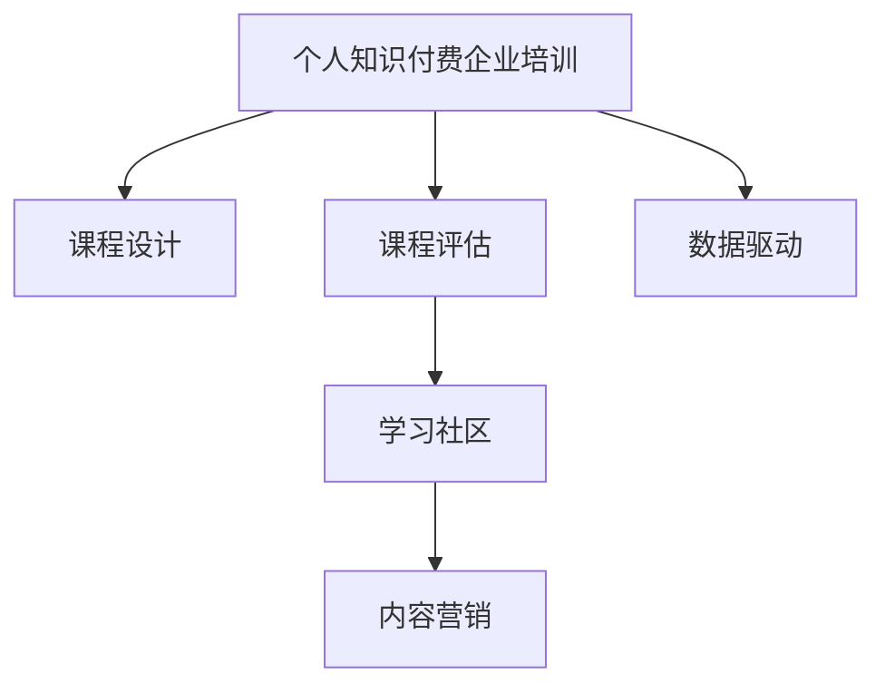

                 

# 如何打造个人知识付费企业培训

## 1. 背景介绍

### 1.1 问题由来

随着信息时代的到来，知识付费已逐渐成为互联网行业的新常态。个人知识付费企业培训，凭借其内容专业、形式灵活、易于传播等优势，受到越来越多用户的青睐。近年来，知识付费平台如喜马拉雅、得到、付费QQ群等层出不穷，竞争激烈。如何在激烈的竞争中脱颖而出，打造高效的个人知识付费企业培训，成为企业和个人关注的焦点。

### 1.2 问题核心关键点

构建个人知识付费企业培训的核心在于如何搭建高质量的课程内容、如何吸引和维持学员的持续学习兴趣、以及如何提升课程的实际应用价值。只有在这三个方面都做到极致，才能真正打造出受到市场认可的知识付费企业培训品牌。

### 1.3 问题研究意义

构建个人知识付费企业培训，对于提升企业的知识传播效率、增强企业的市场竞争力、促进个人职业发展、激发社区学习氛围具有重要意义：

1. 提高知识传播效率：通过个人知识付费企业培训，企业可以将有价值的知识高效传播给目标用户，节省时间和人力成本。
2. 增强市场竞争力：高质量的培训内容可以提升企业品牌形象，增强市场竞争力，吸引更多优质客户。
3. 促进个人职业发展：优秀的课程可以加速个人知识积累，帮助学员提升职业技能，在职业发展中占据优势。
4. 激发社区学习氛围：知识付费企业培训通常以社区形式进行，可以营造良好的学习氛围，促进学员间的交流与合作。

## 2. 核心概念与联系

### 2.1 核心概念概述

为更好地理解如何构建个人知识付费企业培训，本节将介绍几个密切相关的核心概念：

- 个人知识付费企业培训：指以个人或小团队为核心，面向企业用户提供的，以知识传播为目的的付费培训服务。
- 课程设计：指根据培训目标和学员需求，设计合理的课程内容、教学形式和评估方式，以实现知识传播效果最大化。
- 课程评估：指对培训课程的效果进行评估，通过收集学员反馈、测试成绩等指标，评估课程的教学效果和学员的学习成果。
- 学习社区：指由学员、讲师、助教等共同构建的学习平台，提供课程互动、知识交流、问题答疑等服务，增强学习体验。
- 内容营销：指通过高质量的课程内容吸引学员，利用社交媒体、搜索引擎等渠道进行推广，扩大课程影响力和用户覆盖面。

这些核心概念之间的逻辑关系可以通过以下Mermaid流程图来展示：



这个流程图展示了个体知识付费企业培训的核心概念及其之间的关系：

1. 培训项目以课程设计为核心。
2. 课程设计需要结合学员反馈进行评估和改进。
3. 评估和改进过程得到学习社区的参与和支持。
4. 课程内容和效果通过内容营销传播出去。
5. 数据驱动是整个培训项目优化迭代的重要依据。

这些概念共同构成了个人知识付费企业培训的学习框架，确保课程内容能够持续优化，适应学员需求，同时提升品牌知名度和市场竞争力。

## 3. 核心算法原理 & 具体操作步骤
### 3.1 算法原理概述

构建个人知识付费企业培训，本质上是一个内容营销和知识传播的过程。其核心思想是：通过高质量的课程内容、灵活的学习形式和有效的评估机制，吸引并维持学员的学习兴趣，实现知识的有效传播。

形式化地，假设培训项目为 $P$，学员群体为 $S$，课程内容为 $C$，内容营销策略为 $M$，则培训项目的目标可以表示为：

$$
P = \max_{C, M} \sum_{s \in S} \left( U(s; C) + W(s; M) \right)
$$

其中 $U(s; C)$ 表示学员 $s$ 在课程 $C$ 上的学习效果和满意度，$W(s; M)$ 表示通过内容营销策略 $M$ 对学员 $s$ 的吸引力。

培训项目的目标是通过最大化学员的满意度和吸引力，实现知识的有效传播和应用。

### 3.2 算法步骤详解

构建个人知识付费企业培训一般包括以下几个关键步骤：

**Step 1: 需求调研与课程设计**
- 调研目标学员群体的知识需求和兴趣点，制定课程大纲和教学计划。
- 设计课程内容，确保内容新颖、实用，能够解决实际问题。
- 规划课程形式，如视频讲座、在线讨论、实践案例等，提升学员的学习体验。
- 制定评估指标，如课程完成率、学员反馈、测试成绩等，监控和评估课程效果。

**Step 2: 内容制作与课程优化**
- 制作高质量的课程内容，如录制视频、编写讲义、设计作业等。
- 利用内容营销策略吸引学员，如通过社交媒体推广、举办线上活动等。
- 通过学员反馈收集和数据分析，优化课程内容、教学形式和评估机制，确保课程效果的持续提升。

**Step 3: 学习社区建设与互动**
- 构建学习社区，提供课程互动、知识交流、问题答疑等服务，增强学员的学习体验。
- 组织学习活动，如在线讨论、学员论坛、实践分享等，促进学员间的交流与合作。
- 设立助教和讲师团队，提供一对一的辅导和答疑，提升学员的学习效果。

**Step 4: 数据驱动与持续优化**
- 利用数据分析技术，监控课程效果和学员反馈，及时发现问题并进行优化。
- 通过A/B测试等方法，探索和验证不同教学策略和内容形式的效果，持续提升课程质量。
- 收集学员的反馈和建议，不断改进和丰富课程内容，满足学员的个性化需求。

以上步骤是构建个人知识付费企业培训的基本流程。在实际应用中，还需要针对具体任务的特点，对各个环节进行优化设计，以进一步提升培训效果。

### 3.3 算法优缺点

构建个人知识付费企业培训，其优点在于：

1. 灵活高效。可以根据市场和学员需求灵活调整课程内容和形式，快速响应市场变化。
2. 资源丰富。可以利用互联网技术和外部知识资源，汇聚各类优质内容，增强课程的吸引力。
3. 形式多样。课程形式可以多样化，满足不同学员的学习偏好和需求。
4. 用户体验好。通过社区互动和个性化服务，提升学员的学习体验，增强课程的黏性。

同时，该方法也存在一定的局限性：

1. 依赖学员主动性。需要学员具备较强的自主学习能力，才能真正受益于课程内容。
2. 缺乏系统性。个人知识付费企业培训往往局限于特定领域，难以涵盖全面的知识体系。
3. 质量参差不齐。部分课程内容可能不够专业，难以满足高要求学员的需求。
4. 缺乏标准化。由于缺乏统一的标准和规范，课程质量难以得到统一的衡量和保障。

尽管存在这些局限性，但就目前而言，构建个人知识付费企业培训仍是最有效的知识传播方式之一。未来相关研究的重点在于如何进一步提高课程的质量和标准化程度，同时兼顾学员的个性化需求和体验。

### 3.4 算法应用领域

个人知识付费企业培训已经在企业培训、在线教育、职业发展等多个领域得到广泛应用，具体应用场景包括：

1. 企业培训：通过培训课程提升员工的技能水平和职业素养，增强企业竞争力。
2. 在线教育：面向大众用户提供优质的教育资源，满足不同学员的学习需求。
3. 职业发展：通过技能培训和知识分享，帮助学员提升职业竞争力，实现职业发展。
4. 学术研究：提供研究方法、技术工具等方面的培训，促进学术交流和知识传播。

除了上述这些经典应用外，个人知识付费企业培训还被创新性地应用到更多场景中，如远程医疗、公益教育、健身教练等，为各行各业的知识传播和人才培养提供了新的手段。

## 4. 数学模型和公式 & 详细讲解 & 举例说明
### 4.1 数学模型构建

本节将使用数学语言对个人知识付费企业培训的构建过程进行更加严格的刻画。

假设学员群体 $S$ 的满意度函数为 $U(s; C)$，内容营销策略 $M$ 的吸引力函数为 $W(s; M)$。则培训项目的目标可以表示为：

$$
P = \max_{C, M} \sum_{s \in S} \left( U(s; C) + W(s; M) \right)
$$

### 4.2 公式推导过程

为简化问题，假设满意度和吸引力函数都是线性函数。

设满意度和吸引力函数分别为：

$$
U(s; C) = \alpha_1 + \beta_1 c_1 + \gamma_1 c_2 + \delta_1 c_3
$$

$$
W(s; M) = \alpha_2 + \beta_2 m_1 + \gamma_2 m_2 + \delta_2 m_3
$$

其中 $\alpha_i, \beta_i, \gamma_i, \delta_i$ 为系数，$c_i$ 和 $m_i$ 分别表示课程内容和营销策略的不同属性。

将满意度和吸引力函数代入目标函数，得：

$$
P = \max_{c_1, c_2, c_3, m_1, m_2, m_3} \sum_{s \in S} \left( \alpha_1 + \beta_1 c_1 + \gamma_1 c_2 + \delta_1 c_3 + \alpha_2 + \beta_2 m_1 + \gamma_2 m_2 + \delta_2 m_3 \right)
$$

为了简化问题，我们假设学员群体 $S$ 的人数为 $N$。则目标函数变为：

$$
P = \max_{c_1, c_2, c_3, m_1, m_2, m_3} \left( \alpha_1 N + \beta_1 c_1 N + \gamma_1 c_2 N + \delta_1 c_3 N + \alpha_2 N + \beta_2 m_1 N + \gamma_2 m_2 N + \delta_2 m_3 N \right)
$$

显然，目标函数中的学员人数 $N$ 是一个常数，因此可以忽略。此时，目标函数变为：

$$
P = \max_{c_1, c_2, c_3, m_1, m_2, m_3} \left( \beta_1 c_1 + \gamma_1 c_2 + \delta_1 c_3 + \beta_2 m_1 + \gamma_2 m_2 + \delta_2 m_3 \right)
$$

将目标函数拆分为两部分，分别对课程内容和营销策略进行优化，可得：

$$
P_1 = \max_{c_1, c_2, c_3} \left( \beta_1 c_1 + \gamma_1 c_2 + \delta_1 c_3 \right)
$$

$$
P_2 = \max_{m_1, m_2, m_3} \left( \beta_2 m_1 + \gamma_2 m_2 + \delta_2 m_3 \right)
$$

通过最大化目标函数 $P_1$ 和 $P_2$，分别得到最优的课程内容和营销策略。

### 4.3 案例分析与讲解

以下以在线编程课程为例，分析如何构建个人知识付费企业培训。

假设在线编程课程的课程内容 $C$ 包括：

- $c_1$：基础编程语言（如Python、Java等）
- $c_2$：高级编程技巧（如数据结构、算法优化等）
- $c_3$：编程实践案例（如实际项目开发、开源项目贡献等）

课程的营销策略 $M$ 包括：

- $m_1$：课程内容概述视频
- $m_2$：课程精彩片段剪辑
- $m_3$：学员的成功案例和评价

则课程的满意度函数和吸引力函数可表示为：

$$
U(s; C) = \beta_1 c_1 + \gamma_1 c_2 + \delta_1 c_3
$$

$$
W(s; M) = \beta_2 m_1 + \gamma_2 m_2 + \delta_2 m_3
$$

通过优化目标函数，可以得到最优的课程内容和营销策略。例如，当课程内容以基础编程语言和高级编程技巧为主，营销策略以课程内容概述视频和学员成功案例为重点，可以最大化满意度函数和吸引力函数，提升课程效果。

## 5. 项目实践：代码实例和详细解释说明
### 5.1 开发环境搭建

在进行个人知识付费企业培训的实践前，我们需要准备好开发环境。以下是使用Python进行Flask框架开发的环境配置流程：

1. 安装Python：确保Python 3.8或以上版本已经安装。
2. 安装Flask：运行 `pip install flask` 命令，安装Flask框架。
3. 创建项目目录：使用 `mkdir project` 命令创建项目目录。
4. 创建Flask应用：在项目目录中，运行 `python` 命令，进入交互式Shell，输入 `from flask import Flask` 创建Flask应用。

完成上述步骤后，即可在项目目录中开始个人知识付费企业培训的开发。

### 5.2 源代码详细实现

下面是构建一个简单的在线编程课程的Flask应用示例：

```python
from flask import Flask, render_template, request
import random

app = Flask(__name__)

@app.route('/')
def index():
    courses = [
        {'name': 'Python基础', 'content': 'Python编程基础', 'prerequisites': '无', 'length': '4周'},
        {'name': 'Java高级', 'content': 'Java高级编程技巧', 'prerequisites': 'Python基础', 'length': '6周'},
        {'name': '数据结构与算法', 'content': '数据结构与算法优化', 'prerequisites': 'Java高级', 'length': '8周'},
        {'name': '项目开发', 'content': '实际项目开发案例', 'prerequisites': '数据结构与算法', 'length': '10周'}
    ]
    return render_template('index.html', courses=courses)

@app.route('/register', methods=['POST'])
def register():
    name = request.form['name']
    email = request.form['email']
    course = request.form['course']
    return render_template('register.html', name=name, email=email, course=course)

@app.route('/login', methods=['POST'])
def login():
    username = request.form['username']
    password = request.form['password']
    return render_template('login.html', username=username, password=password)

@app.route('/logout')
def logout():
    return render_template('logout.html')

if __name__ == '__main__':
    app.run(debug=True)
```

### 5.3 代码解读与分析

上述代码展示了Flask应用的实现，包括：

- `index()` 函数：显示课程列表页面，包含课程名称、内容、先决条件和时长等信息。
- `register()` 函数：用户注册页面，收集用户姓名、邮箱和选择课程信息。
- `login()` 函数：用户登录页面，收集用户名和密码。
- `logout()` 函数：用户注销页面。

Flask框架通过路由机制将请求映射到不同的函数处理，同时提供了丰富的模板引擎，方便构建页面。通过简单的代码实现，可以实现基本的用户注册、登录和课程列表展示功能。

## 6. 实际应用场景
### 6.1 智能教育

个人知识付费企业培训在智能教育领域具有广泛应用前景。在线教育平台可以通过高质量的课程内容，吸引学生参与学习，提升教育质量。

具体而言，可以收集学生学习过程中的反馈和数据，利用机器学习技术对课程进行优化，提升学习效果。同时，利用智能推荐系统，根据学生的学习习惯和偏好，推荐适合的课程和内容，增强学习体验。

### 6.2 企业培训

企业可以通过个人知识付费企业培训，提升员工的技能水平和职业素养，增强企业竞争力。

例如，可以提供定制化的技能培训课程，如编程技术、项目管理、市场营销等，帮助员工掌握新技能，适应岗位需求。通过课程评估和反馈，及时了解员工的培训效果和需求，优化课程内容和形式，提升培训效果。

### 6.3 在线编程

在线编程课程是个人知识付费企业培训的重要应用场景。通过高质量的课程内容，帮助学员掌握编程技能，提升编程实践能力。

例如，可以提供Python、Java、C++等编程语言的课程，以及数据结构、算法优化、项目开发等方面的实践案例。通过课程评估和反馈，及时了解学员的学习效果和需求，优化课程内容和形式，提升培训效果。

### 6.4 未来应用展望

未来，个人知识付费企业培训将在更多领域得到应用，为各行各业带来变革性影响。

在医疗健康领域，可以通过在线培训课程，帮助医护人员掌握新技能，提升医疗水平。例如，可以提供医学基础课程、临床操作技巧、护理技能等方面的培训。

在金融科技领域，可以通过在线课程，帮助金融从业者掌握新知识，提升专业水平。例如，可以提供金融市场分析、风险管理、量化交易等方面的培训。

在环保科技领域，可以通过在线培训课程，提升公众的环保意识和技能，促进可持续发展。例如，可以提供环保法律法规、污染治理技术、可持续发展等方面的培训。

此外，在教育、艺术、音乐、运动等多个领域，个人知识付费企业培训也将得到广泛应用，为各行各业的知识传播和人才培养提供新的手段。

## 7. 工具和资源推荐
### 7.1 学习资源推荐

为了帮助开发者系统掌握个人知识付费企业培训的理论基础和实践技巧，这里推荐一些优质的学习资源：

1. Udemy平台：提供各种在线课程，涵盖编程、数据科学、商业管理等多个领域，适合初学者和进阶用户。
2. Coursera平台：与顶尖大学和机构合作，提供高质量的在线课程，涵盖计算机科学、社会科学、人文艺术等多个领域。
3. edX平台：提供全球范围内的在线课程，涵盖编程、数据科学、人工智能等多个领域，适合学生和专业人士。
4. Khan Academy平台：提供免费的在线课程，涵盖数学、科学、人文等多个领域，适合K-12学生和教师。
5. Codecademy平台：专注于编程语言和技能的在线学习平台，适合编程初学者和进阶用户。

通过这些资源的学习实践，相信你一定能够快速掌握个人知识付费企业培训的精髓，并用于解决实际的业务问题。

### 7.2 开发工具推荐

高效的开发离不开优秀的工具支持。以下是几款用于个人知识付费企业培训开发的常用工具：

1. Flask框架：轻量级的Web框架，适合快速开发Web应用，易于学习和使用。
2. Django框架：功能强大的Web框架，适合开发复杂Web应用，提供丰富的ORM、模板引擎等工具。
3. PyTorch框架：基于Python的深度学习框架，支持动态计算图和GPU加速，适合构建神经网络模型。
4. TensorFlow框架：由Google开发的深度学习框架，支持分布式计算和GPU加速，适合大规模工程应用。
5. VSCode编辑器：功能强大的代码编辑器，支持多种编程语言和框架，提供丰富的扩展和插件。

合理利用这些工具，可以显著提升个人知识付费企业培训的开发效率，加快创新迭代的步伐。

### 7.3 相关论文推荐

个人知识付费企业培训的研究源于学界的持续研究。以下是几篇奠基性的相关论文，推荐阅读：

1. Intelligent Tutoring Systems: An Overview（《智能辅导系统综述》）：介绍了智能辅导系统的原理和应用，为构建个性化培训提供了理论基础。
2. Learning to Recommend at Scale（《大规模推荐学习》）：介绍了推荐系统的发展历程和最新技术，为推荐课程提供了理论支持。
3. Deep Learning for Programming Education（《深度学习在编程教育中的应用》）：介绍了深度学习技术在编程教育中的应用，为编程课程设计提供了新的思路。
4. Towards Explainable AI for Programming Education（《编程教育的可解释人工智能》）：介绍了可解释AI在编程教育中的应用，为课程评估和反馈提供了新的方法。
5. Online Learning Analytics（《在线学习分析》）：介绍了在线学习数据的收集和分析方法，为优化课程内容提供了数据支持。

这些论文代表了大规模在线培训技术的发展脉络。通过学习这些前沿成果，可以帮助研究者把握学科前进方向，激发更多的创新灵感。

## 8. 总结：未来发展趋势与挑战
### 8.1 总结

本文对如何构建个人知识付费企业培训进行了全面系统的介绍。首先阐述了个人知识付费企业培训的研究背景和意义，明确了培训项目的目标和优化方向。其次，从原理到实践，详细讲解了课程设计和内容营销的过程，给出了具体的代码实例和分析。同时，本文还广泛探讨了个人知识付费企业培训在教育、企业培训、在线编程等多个领域的应用前景，展示了微调范式的巨大潜力。最后，本文精选了微调技术的各类学习资源，力求为读者提供全方位的技术指引。

通过本文的系统梳理，可以看到，构建个人知识付费企业培训是一个系统性的工程，需要从课程设计、内容制作、社区建设等多个方面进行全面优化，方能得到理想的效果。未来，伴随技术的不断进步，个人知识付费企业培训必将在更多的领域得到应用，为各行各业的知识传播和人才培养带来新的机遇。

### 8.2 未来发展趋势

展望未来，个人知识付费企业培训将呈现以下几个发展趋势：

1. 课程内容更丰富。随着技术的进步，课程内容将更加多样化和全面化，涵盖更广泛的领域和知识点。
2. 学习形式更灵活。利用在线视频、互动问答、实时直播等形式，提升学员的学习体验。
3. 学习效果更可控。通过个性化推荐、智能评估等技术，提升课程的针对性和个性化程度。
4. 数据驱动更深入。利用大数据和机器学习技术，实时监控和优化课程效果，提升学员的学习效果。
5. 社区互动更紧密。通过构建学习社区，促进学员之间的交流与合作，增强学习效果。

以上趋势凸显了个人知识付费企业培训的广阔前景。这些方向的探索发展，必将进一步提升培训项目的质量和服务水平，满足学员的多样化需求，提升企业竞争力和市场影响力。

### 8.3 面临的挑战

尽管个人知识付费企业培训已经取得了瞩目成就，但在迈向更加智能化、普适化应用的过程中，它仍面临诸多挑战：

1. 内容质量难以保障。课程内容的质量很大程度上依赖于讲师的能力和资源，难以保证每门课程都是高水平。
2. 学员动力不足。需要设计更具吸引力的课程内容和形式，激发学员的学习兴趣和动力。
3. 资源获取困难。优质的讲师和课程资源有限，难以满足大量的培训需求。
4. 数据隐私问题。收集学员数据进行分析和评估时，需要确保数据的安全和隐私保护。
5. 效果评估复杂。需要设计合理的评估指标和机制，准确评估课程的效果和学员的收获。

尽管存在这些挑战，但未来的研究需要在以下几个方面寻求新的突破：

1. 开发优质课程资源。引入更多的讲师和专家参与课程制作，提升课程质量。
2. 设计高效的学习策略。通过数据驱动和个性化推荐，提升学员的学习效果。
3. 利用先进技术。利用大数据、机器学习等技术，提升课程分析和评估的精度。
4. 保护学员隐私。采用隐私保护技术，确保学员数据的隐私安全。
5. 完善效果评估机制。设计合理的评估指标和机制，客观评估课程效果和学员收获。

这些研究方向的探索，必将引领个人知识付费企业培训技术迈向更高的台阶，为构建安全、可靠、可解释、可控的智能系统铺平道路。面向未来，个人知识付费企业培训技术还需要与其他人工智能技术进行更深入的融合，如知识表示、因果推理、强化学习等，多路径协同发力，共同推动自然语言理解和智能交互系统的进步。只有勇于创新、敢于突破，才能不断拓展语言模型的边界，让智能技术更好地造福人类社会。

### 8.4 研究展望

未来，个人知识付费企业培训将进一步推动知识传播和人才培养的发展。随着技术的不断进步，我们将看到更多的智能化、普适化应用场景，为各行各业的知识传播和人才培养带来新的机遇。

在教育领域，个人知识付费企业培训将成为教育行业的重要组成部分，为教育公平、个性化教育提供新的手段。

在企业培训领域，个人知识付费企业培训将成为提升员工技能和素质的重要工具，为企业的可持续发展提供支持。

在在线编程领域，个人知识付费企业培训将成为编程学习的最佳选择，为程序员提供持续学习和成长的机会。

在在线教育领域，个人知识付费企业培训将成为在线教育的重要组成部分，为大众用户提供高质量的教育资源。

此外，在医疗健康、金融科技、环保科技等多个领域，个人知识付费企业培训也将得到广泛应用，为各行各业的知识传播和人才培养提供新的手段。

总之，个人知识付费企业培训将在未来的发展中不断拓展其应用边界，为各行各业的知识传播和人才培养带来新的机遇和挑战。只有不断探索和创新，才能在激烈的市场竞争中立于不败之地，为社会进步贡献自己的力量。

## 9. 附录：常见问题与解答

**Q1：如何提高课程内容的吸引力？**

A: 提高课程内容吸引力的方法有以下几种：

1. 制定合理的课程大纲。确保课程内容体系完整、逻辑清晰，满足学员的学习需求。
2. 制作高质量的课程内容。录制清晰的讲解视频、编写详细的讲义和习题，提升学员的学习效果。
3. 设计互动式学习体验。利用在线讨论、实时答疑等功能，增加学员的互动机会，提升学习兴趣。
4. 引入学员的成功案例。展示学员的学习成果和成功经验，激发其他学员的学习动力。

**Q2：如何优化课程内容？**

A: 优化课程内容的方法有以下几种：

1. 收集学员反馈。通过问卷调查、在线讨论等方式，收集学员的反馈和建议，及时发现课程中的不足和问题。
2. 分析学习数据。利用数据分析技术，分析学员的学习行为和效果，发现课程内容的薄弱环节，进行优化和改进。
3. 引入最新的知识和技术。根据行业发展趋势，引入最新的知识和技术，保持课程内容的先进性和实用性。
4. 设计多种学习形式。利用视频讲解、互动讨论、实践案例等多种形式，丰富课程内容，提升学员的学习效果。

**Q3：如何提升课程的个性化程度？**

A: 提升课程个性化程度的方法有以下几种：

1. 设计个性化学习路径。根据学员的学习进度和兴趣，设计个性化的学习路径，满足不同学员的需求。
2. 利用推荐系统。利用机器学习技术，根据学员的学习数据和偏好，推荐适合的课程和内容，提升学习效果。
3. 提供定制化服务。根据学员的具体需求，提供定制化的课程内容和辅导服务，提升学习体验。
4. 利用数据分析。利用数据分析技术，分析学员的学习数据，发现个性化需求，进行优化和改进。

这些方法可以帮助你设计出更具吸引力和实用性的课程内容，满足不同学员的需求，提升学习效果。

---

作者：禅与计算机程序设计艺术 / Zen and the Art of Computer Programming

