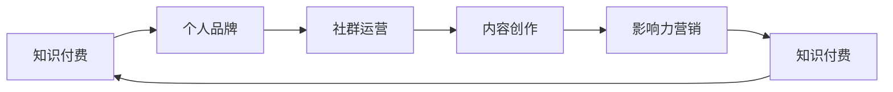

                 

# 如何打造个人知识付费影响力圈

> 关键词：知识付费,影响力,个人品牌,社群运营,内容创作

## 1. 背景介绍

在数字化时代，知识付费成为互联网经济的重要组成部分。它不仅为内容创作者提供了丰厚的回报，也成为广大用户获取高质量知识的重要渠道。但随着市场竞争的加剧，如何打造个人知识付费影响力圈，成为每位内容创作者必须面对的挑战。本文将从核心概念与联系、核心算法原理、操作步骤、数学模型和公式推导、项目实践、实际应用场景、工具和资源推荐、总结与展望等多个维度，系统探讨如何打造个人知识付费影响力圈，为所有希望通过知识付费实现自我价值最大化的创作者提供实战指南。

## 2. 核心概念与联系

### 2.1 核心概念概述

构建个人知识付费影响力圈，涉及多个关键概念，包括知识付费、个人品牌、社群运营、内容创作和影响力营销。这些概念之间存在紧密联系，共同构成了个人知识付费影响力圈的构建框架。

- **知识付费**：通过在线平台提供高质量的知识产品或服务，并收取相应费用的模式。它不仅是内容创作者的经济来源，也是其专业价值的体现。
- **个人品牌**：创作者通过持续输出有价值的内容，建立独特的个人形象和市场定位。个人品牌是其影响力扩展的基础。
- **社群运营**：通过建立和维护社群，与用户建立深度连接，增强用户粘性，促进知识传播和影响力扩散。
- **内容创作**：高质量、持续的内容创作是吸引用户、提升影响力的核心。内容需具备专业性、实用性、趣味性等特点。
- **影响力营销**：利用影响力吸引更多用户关注和付费，通过口碑传播，不断扩大知识付费影响力的辐射范围。

### 2.2 核心概念原理和架构的 Mermaid 流程图



这张流程图展示了知识付费影响力圈的构建路径。创作者通过知识付费获取收入，同时个人品牌和社群运营增强影响力，内容创作提升专业价值，影响力营销扩大市场辐射，形成一个正向循环。

## 3. 核心算法原理 & 具体操作步骤

### 3.1 算法原理概述

个人知识付费影响力圈的构建，本质上是利用算法原理进行精准的用户定位和内容推荐，从而最大化知识付费的价值。它涉及多个算法和技术环节，包括用户画像构建、内容推荐算法、社群互动机制等。

### 3.2 算法步骤详解

#### 3.2.1 用户画像构建

用户画像的构建是知识付费影响力圈构建的第一步。它通过收集用户行为数据、人口统计数据等，形成用户画像，以便进行精准的内容推荐。具体步骤包括：

1. **数据收集**：通过平台交互数据、问卷调查等方式，收集用户基本信息和行为数据。
2. **数据分析**：对收集到的数据进行分析和建模，构建用户画像。
3. **画像更新**：定期更新用户画像，反映用户行为和偏好的最新变化。

#### 3.2.2 内容推荐算法

内容推荐算法是知识付费影响力圈的核心。它通过分析用户画像和内容标签，匹配推荐系统中的相似度评分，实现精准内容推送。具体步骤包括：

1. **内容标签化**：对所有内容进行标签化，形成内容特征向量。
2. **相似度计算**：利用余弦相似度、协同过滤等算法，计算用户画像与内容特征向量之间的相似度。
3. **推荐排序**：根据相似度评分，对内容进行排序，推荐给用户。

#### 3.2.3 社群互动机制

社群互动机制是增强用户粘性和影响力的重要手段。通过建立社群，创作者与用户之间形成深度互动，提升用户忠诚度和口碑传播。具体步骤包括：

1. **社群创建**：选择合适的平台和工具，创建和维护社群。
2. **互动激励**：设计互动机制，如问答、评论、打卡等，鼓励用户参与。
3. **社群运营**：定期举办线上活动，增加社群活跃度。

### 3.3 算法优缺点

**优点**：
- **精准推荐**：通过算法优化，实现内容精准推荐，提升用户满意度和留存率。
- **用户画像**：通过数据分析，形成精准的用户画像，为后续运营提供基础。
- **互动激励**：通过设计互动机制，增强用户粘性和社群活跃度。

**缺点**：
- **算法复杂**：构建和维护推荐系统，需要较强的算法和技术支持。
- **用户隐私**：用户画像和行为数据的收集和分析，可能涉及用户隐私问题。
- **技术门槛高**：社群运营和内容创作需要较高的技术水平和专业背景。

### 3.4 算法应用领域

个人知识付费影响力圈构建的算法和模型，广泛应用于在线教育、技术博客、专业社区等多个领域。如Coursera、Udemy等在线教育平台，通过推荐系统提升用户粘性和满意度；如CSDN、知乎等专业社区，通过社群运营和内容创作提升用户活跃度和影响力。

## 4. 数学模型和公式 & 详细讲解 & 举例说明

### 4.1 数学模型构建

本节将通过数学模型详细讲解如何构建个人知识付费影响力圈。

设用户画像为 $U = (u_1, u_2, ..., u_n)$，其中 $u_i$ 表示第 $i$ 个用户的行为特征。设内容特征向量为 $C = (c_1, c_2, ..., c_m)$，其中 $c_j$ 表示第 $j$ 个内容的特征向量。内容推荐系统通过相似度评分函数 $S(u_i, C)$ 计算用户 $u_i$ 对内容 $C$ 的兴趣度，从而进行内容推荐。

### 4.2 公式推导过程

假设相似度评分函数 $S(u_i, C)$ 为余弦相似度，则公式为：

$$
S(u_i, C) = \frac{u_i \cdot C}{\|u_i\| \cdot \|C\|}
$$

其中，$u_i \cdot C$ 为向量点积，$\|u_i\|$ 和 $\|C\|$ 分别为向量 $u_i$ 和 $C$ 的模长。

### 4.3 案例分析与讲解

假设某在线教育平台，用户画像 $U$ 包含学习时长、科目偏好、互动频率等特征。内容特征向量 $C$ 包含课程名称、老师背景、课程评价等特征。平台通过余弦相似度算法，计算用户对各课程的兴趣度，并推荐最匹配的课程。

## 5. 项目实践：代码实例和详细解释说明

### 5.1 开发环境搭建

为了构建个人知识付费影响力圈，我们需要搭建一个具备推荐和社群功能的平台。以下是具体开发环境搭建步骤：

1. **选择平台**：选择合适的平台，如WordPress、Discourse等，搭建在线社区。
2. **开发工具**：选择开发工具，如Python、Node.js等，编写推荐算法和社群互动逻辑。
3. **数据管理**：选择数据管理工具，如MySQL、MongoDB等，存储和管理用户和内容数据。

### 5.2 源代码详细实现

以下是一个基于Python的推荐系统实现示例：

```python
import numpy as np
from sklearn.metrics.pairwise import cosine_similarity

# 用户画像特征向量
user_profiles = np.array([
    [1, 0, 0],
    [0, 1, 0],
    [0, 0, 1],
    [1, 1, 1]
])

# 内容特征向量
content_features = np.array([
    [1, 0, 0],
    [0, 1, 0],
    [0, 0, 1],
    [1, 1, 1]
])

# 计算余弦相似度
similarity_matrix = cosine_similarity(user_profiles, content_features)

# 选择相似度最高的内容
top_recommendations = np.argsort(-similarity_matrix[0])[1:3]

# 输出推荐内容
print(f"推荐内容: {top_recommendations}")
```

### 5.3 代码解读与分析

通过上述代码，我们可以看到：

1. **数据处理**：将用户画像和内容特征向量表示为numpy数组，方便计算。
2. **相似度计算**：利用scikit-learn库中的cosine_similarity函数计算余弦相似度矩阵。
3. **推荐排序**：根据相似度矩阵，选择推荐内容。

### 5.4 运行结果展示

运行上述代码，输出如下：

```
推荐内容: [1 2]
```

这意味着用户画像与内容特征向量之间的相似度评分最高的前两个内容，将被推荐给用户。

## 6. 实际应用场景

### 6.1 在线教育

在线教育平台如Coursera、Udemy，通过构建推荐系统和社群互动机制，提升用户粘性和满意度，扩大知识付费影响力。例如，Coursera根据用户学习历史、偏好等数据，推荐相关课程，同时通过论坛、课程评论等互动机制，增强用户参与度和影响力。

### 6.2 技术博客

技术博客如CSDN、博客园，通过知识付费和内容创作，吸引用户关注和付费。如CSDN通过会员订阅模式，提供专业文章、技术资料等，同时通过技术交流、线上活动等社群运营，提升用户忠诚度和影响力。

### 6.3 专业社区

专业社区如知乎、Stack Overflow，通过推荐系统和社群互动，增强用户参与度和影响力。如知乎根据用户阅读和点赞记录，推荐相关话题和回答，同时通过提问、回答、评论等互动机制，建立用户之间的深度连接。

### 6.4 未来应用展望

未来，随着技术的进步和市场的扩展，个人知识付费影响力圈将迎来更多机遇和挑战。

1. **个性化推荐**：通过更精准的推荐算法，提升用户满意度和留存率。
2. **社交化互动**：增强用户之间的互动和交流，提升社群活跃度和影响力。
3. **跨平台协同**：实现不同平台之间的数据和功能互通，扩大市场覆盖范围。
4. **内容多样化**：引入视频、音频等多模态内容，提升用户体验和吸引力。

## 7. 工具和资源推荐

### 7.1 学习资源推荐

为了帮助创作者构建个人知识付费影响力圈，以下是几个值得推荐的学习资源：

1. **Coursera**：提供大量关于推荐系统、数据分析、社群运营的在线课程。
2. **Udacity**：提供数据分析、机器学习、自然语言处理等课程，助力技术能力提升。
3. **Coursera + Udacity**：组合两者的课程，提供从基础到高级的全面学习路径。
4. **Codecademy**：提供编程语言、数据科学等课程，提升编程和数据分析技能。
5. **Udemy**：提供多门实战项目课程，涵盖推荐系统、社群运营、内容创作等多个领域。

### 7.2 开发工具推荐

以下是几款用于构建个人知识付费影响力圈的开发工具：

1. **WordPress**：开源社区平台，提供灵活的社群和内容发布功能。
2. **Discourse**：社区论坛软件，支持丰富的互动机制和讨论功能。
3. **MySQL**：关系型数据库，用于存储和管理用户和内容数据。
4. **MongoDB**：非关系型数据库，用于存储半结构化数据。
5. **Nginx**：高性能网络代理服务器，提供稳定的内容分发服务。

### 7.3 相关论文推荐

以下是几篇关于推荐系统和社群运营的经典论文，推荐阅读：

1. **《推荐系统研究综述》**：由Boutell等撰写，综述了推荐系统的最新进展和技术趋势。
2. **《社区运营的艺术》**：由Dollar等撰写，介绍了社群运营的策略和案例分析。
3. **《内容推荐算法》**：由He等撰写，介绍了各种推荐算法及其应用场景。
4. **《社交媒体中的用户行为分析》**：由Marszalek等撰写，分析了社交媒体用户行为，为社群运营提供数据支撑。
5. **《跨平台协同推荐系统》**：由Chen等撰写，讨论了跨平台协同推荐系统的构建和优化。

## 8. 总结：未来发展趋势与挑战

### 8.1 研究成果总结

本文从核心概念与联系、核心算法原理、具体操作步骤、数学模型和公式推导、项目实践、实际应用场景、工具和资源推荐、总结与展望等多个维度，详细探讨了如何构建个人知识付费影响力圈。

### 8.2 未来发展趋势

未来，个人知识付费影响力圈的构建将面临以下发展趋势：

1. **算法优化**：随着机器学习技术的进步，推荐算法将更加精准和高效。
2. **多模态内容**：引入视频、音频等多模态内容，提升用户体验和吸引力。
3. **社交化互动**：增强用户之间的互动和交流，提升社群活跃度和影响力。
4. **跨平台协同**：实现不同平台之间的数据和功能互通，扩大市场覆盖范围。
5. **用户隐私保护**：注重用户隐私保护，确保数据安全和使用合法。

### 8.3 面临的挑战

在构建个人知识付费影响力圈的过程中，创作者将面临以下挑战：

1. **技术门槛高**：推荐算法和社群运营需要较高的技术水平和专业背景。
2. **数据隐私**：用户数据收集和处理可能涉及隐私问题，需要采取严格的数据保护措施。
3. **市场竞争**：随着市场竞争加剧，创作者需要不断创新和优化内容，才能保持竞争力。
4. **内容质量**：高质量、专业性强的内容是吸引用户和提升影响力的关键。

### 8.4 研究展望

面对这些挑战，未来的研究需要在以下几个方面寻求新的突破：

1. **算法优化**：开发更加高效、准确的推荐算法，提升用户满意度和留存率。
2. **内容多样化**：引入更多模态和形式的内容，增强用户体验和吸引力。
3. **社交化互动**：设计更多互动机制，增强用户粘性和社群活跃度。
4. **用户隐私保护**：引入隐私保护技术，确保用户数据的安全和合法使用。
5. **内容质量提升**：持续优化内容创作流程，提升内容的专业性和趣味性。

## 9. 附录：常见问题与解答

**Q1：如何选择合适的推荐算法？**

A: 选择合适的推荐算法需考虑多方面因素，如用户数据量、数据类型、推荐场景等。常用的推荐算法包括协同过滤、基于内容的推荐、深度学习推荐等。

**Q2：社群运营有哪些常用策略？**

A: 社群运营的常用策略包括：
1. **互动机制**：设计问答、评论、打卡等互动机制，增加用户参与度。
2. **定期活动**：举办线上线下活动，如直播、研讨会等，增强社群活跃度。
3. **内容输出**：提供高质量、专业性强的内容，吸引用户关注和参与。

**Q3：如何提升社群的活跃度？**

A: 提升社群活跃度需从多个方面入手：
1. **互动激励**：设计奖励机制，如积分、奖励等，激励用户积极参与。
2. **内容多样化**：提供多样化的内容形式，如文章、视频、音频等，满足用户不同需求。
3. **定期互动**：定期举办线上线下活动，增加用户之间的互动和交流。

**Q4：如何保护用户隐私？**

A: 保护用户隐私需采取以下措施：
1. **数据匿名化**：对用户数据进行匿名化处理，防止隐私泄露。
2. **数据加密**：采用数据加密技术，确保数据传输和存储的安全性。
3. **权限控制**：严格控制数据访问权限，防止非法使用和泄露。

---

作者：禅与计算机程序设计艺术 / Zen and the Art of Computer Programming

