                 

## 1. 背景介绍

在当今信息爆炸的时代，如何有效地管理和利用知识，成为许多个人和企业的重要课题。随着知识付费的兴起，通过在线课程、视频讲座、电子书等形式，将自己的知识经验转化为经济收益，已成为越来越多人的选择。然而，许多知识付费者常常在内容创作、用户获取、商业模式等方面遇到瓶颈，难以实现规模化和盈利。本文将通过打造个人知识付费矩阵，帮助知识付费者系统性地提升其运营效率和盈利能力。

### 1.1 问题由来

在知识付费领域，常见的问题包括：
1. **内容同质化严重**：很多知识付费平台上的内容相似度很高，缺乏特色和深度。
2. **用户获取困难**：如何吸引更多精准用户，提高用户粘性，成为难题。
3. **盈利模式单一**：主要依靠订阅和单次购买，收入来源有限。
4. **运营成本高**：内容生产、推广、技术维护等成本较高，利润空间被压缩。

### 1.2 问题核心关键点

要想解决这些问题，关键在于构建一个全面、高效、可持续的知识付费矩阵。该矩阵应包括但不限于内容生产、用户获取、用户留存、商业模式、技术支持等环节。通过优化这些关键环节，可以实现知识付费的良性循环，从而提升整体效益。

## 2. 核心概念与联系

### 2.1 核心概念概述

构建知识付费矩阵涉及多个关键概念，包括但不限于：
- **内容生产**：即内容的创作和生产。可以是原创、翻译、整合等形式。
- **用户获取**：吸引和获取用户，可以通过社交媒体、搜索引擎优化、广告投放等手段实现。
- **用户留存**：提高用户粘性，保持用户长期关注和消费。可以通过互动性、个性化推荐、会员制度等手段实现。
- **商业模式**：确定盈利模式，包括订阅、单次购买、知识星球、付费社群等多种形式。
- **技术支持**：提供稳定的技术平台和工具，支持内容的发布、管理和推广。

这些概念之间存在紧密的联系，通过合理组合和优化，可以实现整体效应的最大化。

### 2.2 核心概念原理和架构的 Mermaid 流程图(Mermaid 流程节点中不要有括号、逗号等特殊字符)

```mermaid
graph LR
    A[内容生产] --> B[用户获取]
    B --> C[用户留存]
    C --> D[商业模式]
    D --> E[技术支持]
    E --> F[内容生产]
    F --> G[用户获取]
    G --> H[用户留存]
    H --> I[商业模式]
    I --> J[技术支持]
    J --> K[内容生产]
    K --> L[用户获取]
    L --> M[用户留存]
    M --> N[商业模式]
    N --> O[技术支持]
```



该图展示了内容生产与用户获取、用户留存、商业模式、技术支持之间的循环关系，说明了各环节的相互依赖和影响。

## 3. 核心算法原理 & 具体操作步骤

### 3.1 算法原理概述

知识付费矩阵的构建，本质上是基于用户需求和行为的数据驱动优化过程。其核心在于通过数据分析和算法优化，提升各个环节的运营效率和用户体验。

### 3.2 算法步骤详解

构建知识付费矩阵的步骤如下：
1. **用户需求分析**：通过调研、访谈等方式，了解用户的学习需求、习惯、痛点等，作为内容创作的依据。
2. **内容筛选和设计**：根据用户需求，筛选和设计适合的内容形式和主题，制定内容日历。
3. **用户获取策略**：选择合适的渠道和策略，吸引目标用户。
4. **用户留存策略**：通过互动、个性化推荐、会员制度等手段，提高用户粘性。
5. **商业模式设计**：确定合适的盈利模式，并进行合理的定价策略。
6. **技术平台搭建**：选择合适的技术栈和工具，搭建稳定可靠的平台。

### 3.3 算法优缺点

知识付费矩阵的优点包括：
- **系统化运营**：通过矩阵结构，系统化地优化各环节，提高整体效率。
- **精准定位**：通过数据分析，精准识别目标用户，提供更符合需求的内容。
- **动态调整**：通过实时监控数据，动态调整运营策略，提升用户体验。

缺点包括：
- **数据需求高**：需要大量的用户行为数据进行分析和优化。
- **技术门槛高**：搭建和维护技术平台需要较高的技术能力和资源投入。
- **灵活性受限**：一旦矩阵结构确定，调整难度较大。

### 3.4 算法应用领域

知识付费矩阵不仅适用于个人知识付费，也适用于企业知识管理、在线教育等场景。通过系统化运营，可以实现内容的高效生产和精准分发，提升整体效益。

## 4. 数学模型和公式 & 详细讲解 & 举例说明

### 4.1 数学模型构建

知识付费矩阵的数学模型可以通过用户行为数据进行分析。假设用户数量为 $N$，访问次数为 $T$，每次访问停留时间为 $D$，购买次数为 $B$，每次购买金额为 $P$，则总收益 $R$ 可以表示为：

$$
R = B \times P + \sum_{i=1}^T P_i \times D_i
$$

其中 $P_i$ 为第 $i$ 次购买金额，$D_i$ 为第 $i$ 次访问停留时间。

### 4.2 公式推导过程

为了最大化总收益 $R$，可以通过优化定价策略、访问停留时间、购买次数等变量。例如，可以通过A/B测试等方法，优化每次购买金额 $P$ 和停留时间 $D$，提高总收益。

### 4.3 案例分析与讲解

以在线教育平台为例，通过分析用户的学习数据，发现购买课程的平均停留时间为45分钟，购买课程的平均金额为99元。通过调整课程内容和定价策略，将停留时间提高到60分钟，购买金额提高到199元，最终提高了总收益。

## 5. 项目实践：代码实例和详细解释说明

### 5.1 开发环境搭建

1. **选择技术栈**：可以选择Python、Django、MySQL等技术栈进行开发。
2. **搭建开发环境**：安装Python、Django、MySQL、Redis等工具。
3. **配置数据库**：配置MySQL数据库，创建课程表、用户表等。
4. **配置缓存**：配置Redis缓存，提高系统性能。
5. **配置Web服务**：配置Django Web服务，支持课程发布、用户注册、登录等功能。

### 5.2 源代码详细实现

```python
# 用户模型
from django.db import models

class User(models.Model):
    username = models.CharField(max_length=50, unique=True)
    email = models.EmailField(unique=True)
    password = models.CharField(max_length=100)

# 课程模型
class Course(models.Model):
    name = models.CharField(max_length=100)
    description = models.TextField()
    price = models.DecimalField(max_digits=10, decimal_places=2)
    duration = models.DurationField()

# 用户与课程关系
class UserCourse(models.Model):
    user = models.ForeignKey(User, on_delete=models.CASCADE)
    course = models.ForeignKey(Course, on_delete=models.CASCADE)
    is_paid = models.BooleanField(default=False)
    created_at = models.DateTimeField(auto_now_add=True)

# 数据迁移
from django.db import migrations

class Migration(migrations.Migration):

    dependencies = [
        ('myapp', '0001_initial'),
    ]

    operations = [
        migrations.AddField(
            model_name='course',
            name='duration',
            field=models.DurationField(),
        ),
    ]
```

### 5.3 代码解读与分析

上述代码展示了用户、课程、用户与课程关系等模型的定义。通过Django的ORM框架，可以快速进行数据管理和操作。

## 6. 实际应用场景

### 6.1 在线教育平台

在线教育平台通过知识付费矩阵，可以实现高效的内容生产、精准的用户获取和留存、灵活的盈利模式，为用户提供优质的学习体验。

### 6.2 企业知识管理

企业知识管理通过知识付费矩阵，可以实现知识的高效生产和传播，提升员工的协作效率和学习能力，推动企业创新。

### 6.3 个人知识付费

个人知识付费通过知识付费矩阵，可以实现个性化内容生产、精准用户获取和留存，提升盈利能力和用户满意度。

### 6.4 未来应用展望

未来，知识付费矩阵将进一步发展，涵盖更多场景和形式，如直播课程、互动讨论、虚拟现实等。通过技术创新，将知识付费矩阵推向新的高度。

## 7. 工具和资源推荐

### 7.1 学习资源推荐

1. **Django官方文档**：详细介绍了Django框架的使用和开发。
2. **MySQL官方文档**：详细介绍了MySQL数据库的操作和优化。
3. **Redis官方文档**：详细介绍了Redis缓存的使用和优化。
4. **在线教育平台案例分析**：如Coursera、Udacity等平台的用户数据和运营策略。
5. **企业知识管理案例分析**：如LinkedIn Learning、企业内部知识库等。

### 7.2 开发工具推荐

1. **PyCharm**：强大的Python开发工具，支持Django、MySQL、Redis等。
2. **Django**：流行的Web框架，支持快速开发和管理。
3. **MySQL Workbench**：MySQL数据库管理工具，支持数据库设计和操作。
4. **Redis Desktop**：Redis缓存管理工具，支持数据可视化和操作。
5. **Git**：版本控制系统，支持团队协作和代码管理。

### 7.3 相关论文推荐

1. **知识付费平台用户行为分析**：探讨知识付费平台的用户行为特征和数据挖掘方法。
2. **知识付费矩阵优化策略**：提出基于知识付费矩阵的运营优化策略和方法。
3. **在线教育平台课程设计**：介绍在线教育平台的课程设计和运营策略。
4. **企业知识管理策略**：探讨企业知识管理的策略和工具。

## 8. 总结：未来发展趋势与挑战

### 8.1 研究成果总结

知识付费矩阵通过系统化、数据驱动的运营策略，显著提升了内容生产和用户管理的效率和效果，为知识付费领域带来了新的发展机遇。

### 8.2 未来发展趋势

1. **数据驱动的运营优化**：通过数据分析和算法优化，提升各环节的运营效率和用户体验。
2. **个性化推荐系统**：引入个性化推荐算法，提高用户粘性和满意度。
3. **多模态内容生产**：结合文字、视频、音频等多种形式，提供更丰富的学习体验。
4. **虚拟现实和增强现实**：引入虚拟现实和增强现实技术，提升互动性和沉浸感。
5. **人工智能辅助**：引入AI技术，自动生成课程、进行内容审核和推荐。

### 8.3 面临的挑战

1. **数据隐私保护**：如何保护用户数据隐私，避免信息泄露和滥用。
2. **内容质量控制**：如何保证内容的准确性和权威性，避免误导用户。
3. **技术资源投入**：如何高效利用技术资源，平衡成本和效益。
4. **用户口碑管理**：如何处理用户反馈，提升用户满意度。
5. **市场竞争**：如何在激烈的市场竞争中脱颖而出，保持领先地位。

### 8.4 研究展望

未来，知识付费矩阵将更多地融合人工智能、大数据、虚拟现实等技术，提升整体运营效率和用户满意度。通过持续优化和创新，知识付费矩阵将为知识付费领域带来新的突破和发展。

## 9. 附录：常见问题与解答

**Q1：知识付费矩阵如何实现个性化推荐？**

A: 个性化推荐系统可以通过用户行为数据（如学习时间、点击次数、购买历史等）进行分析，建立用户画像，从而推荐适合的内容。可以使用协同过滤、内容推荐、基于模型的推荐算法等方法。

**Q2：如何平衡知识付费矩阵中的各环节？**

A: 可以通过数据驱动和用户反馈，动态调整各环节的策略。例如，根据用户停留时间，调整课程长度和内容质量，提升用户满意度和留存率。

**Q3：如何提高知识付费矩阵的运营效率？**

A: 通过自动化工具和系统优化，提高各环节的运营效率。例如，使用自动化工具进行内容发布、用户管理等，减少人工操作。

**Q4：知识付费矩阵的技术实现难点有哪些？**

A: 技术实现难点包括：
1. **数据处理**：需要处理大量的用户行为数据，进行清洗、存储和分析。
2. **系统架构**：需要设计高效、可扩展的系统架构，支持高并发和大数据量的处理。
3. **用户隐私保护**：需要确保用户数据的安全性和隐私性，防止信息泄露和滥用。

**Q5：知识付费矩阵有哪些成功案例？**

A: 成功的知识付费矩阵案例包括：
1. **Coursera**：提供全球领先的在线课程，覆盖多个领域和学科。
2. **Udacity**：提供职业技能培训课程，帮助用户提升技能和就业竞争力。
3. **LinkedIn Learning**：提供在线课程和认证，支持职业发展和技能提升。

通过这些成功案例，可以看出知识付费矩阵在实际应用中的可行性和效果。

---

作者：禅与计算机程序设计艺术 / Zen and the Art of Computer Programming

