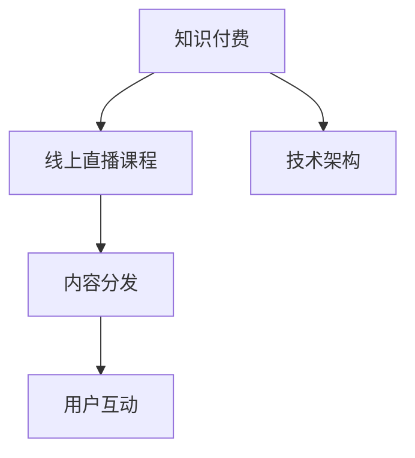

                 

# 如何打造知识付费的线上直播课程

> 关键词：知识付费, 线上直播课程, 内容分发, 用户互动, 技术架构

## 1. 背景介绍

### 1.1 问题由来

在互联网和移动互联网高速发展的今天，知识付费成为了一个不可忽视的趋势。越来越多的用户愿意为优质的知识和信息付费，这不仅满足了个人学习和自我提升的需求，也为内容创作者提供了新的商业机遇。而线上直播课程，凭借其即时互动性强、形式多样等特点，成为了知识付费平台的重要组成部分。

然而，高质量的线上直播课程往往需要投入大量的时间、资源和精力进行规划、录制、分发等环节。为了提高效率，降低成本，同时确保课程内容的质量，亟需建立一套完整且高效的线上直播课程打造体系。

### 1.2 问题核心关键点

制作线上直播课程的核心关键点在于：
- 明确课程目标和定位，确保课程内容与用户需求高度契合。
- 选择适合的技术平台和工具，提升课程录制和分发效率。
- 优化课程内容结构，确保知识体系连贯，用户体验流畅。
- 构建有效的用户互动机制，提升用户参与度和满意度。
- 建立完整的运营和评估体系，持续改进课程质量和用户体验。

## 2. 核心概念与联系

### 2.1 核心概念概述

为更好地理解线上直播课程的打造方法，本节将介绍几个密切相关的核心概念：

- 知识付费：用户为获取知识和信息而付费的行为模式。
- 线上直播课程：通过互联网平台进行实时直播授课的方式，用户可以即时互动和提问。
- 内容分发：将课程内容通过互联网渠道推送给目标用户的过程。
- 用户互动：通过在线投票、评论、提问等形式，提升用户参与度和满意度。
- 技术架构：支撑线上直播课程的技术平台和基础设施。

这些核心概念之间的逻辑关系可以通过以下Mermaid流程图来展示：



这个流程图展示了一系列概念之间的联系：

1. 知识付费带动了线上直播课程的需求。
2. 线上直播课程依托于内容分发和用户互动技术。
3. 技术架构是实现线上直播课程的关键基础设施。

这些概念共同构成了知识付费的线上直播课程打造体系，使得课程能够高效、灵活地进行。

## 3. 核心算法原理 & 具体操作步骤
### 3.1 算法原理概述

线上直播课程的打造过程，本质上是一个多目标优化问题。其核心目标是最大化课程内容的质量、用户互动的效果和内容分发的效率。具体而言，可以从以下几个方面入手：

1. **课程内容优化**：通过评估用户反馈和课程数据，不断调整课程结构和内容，确保知识体系的连贯性和实用性。
2. **用户互动优化**：通过分析用户行为和反馈，改进互动机制，提升用户的参与度和满意度。
3. **内容分发优化**：通过选择合适的分发渠道和策略，确保课程内容能够高效、广泛地触达目标用户。

### 3.2 算法步骤详解

基于多目标优化的方法，制作线上直播课程的一般步骤如下：

**Step 1: 需求调研与定位**
- 通过问卷调查、用户访谈等方式，收集目标用户群体的知识需求和兴趣点。
- 确定课程的主要目标和核心知识点，以及课程定位（如职业培训、兴趣拓展等）。

**Step 2: 内容规划与设计**
- 制定课程大纲，确定各章节的核心内容和组织结构。
- 设计课程内容形式，如讲解、案例分析、互动问答等。

**Step 3: 技术平台选择**
- 选择合适的直播平台和内容分发平台，如腾讯课堂、网易云课堂等。
- 根据课程需求选择合适的技术工具和开发框架，如Flask、Django等。

**Step 4: 课程录制与上传**
- 使用专业摄像设备和录制软件，进行课程内容的录制。
- 将录制好的课程内容上传到平台，并进行相应的编辑和优化。

**Step 5: 互动设计与优化**
- 设计互动环节，如实时问答、在线投票等，提升用户参与度。
- 根据用户反馈，不断优化互动机制，确保互动效果。

**Step 6: 分发策略与推广**
- 选择合适的分发渠道，如社交媒体、邮件推送等，进行课程推广。
- 制定合理的分发策略，确保课程能够广泛触达目标用户。

**Step 7: 运营评估与改进**
- 监控课程数据，评估课程效果和用户反馈。
- 根据评估结果，持续改进课程内容和互动机制。

### 3.3 算法优缺点

线上直播课程的打造方法具有以下优点：
1. 高效灵活：通过技术平台和工具，可以快速搭建和调整课程，满足用户需求。
2. 覆盖广泛：借助互联网渠道，可以广泛触达目标用户，提升课程的覆盖率和影响力。
3. 互动性强：通过实时互动机制，提升用户参与度和满意度，增强课程吸引力。
4. 内容丰富：可以通过视频、音频、图文等多种形式，丰富课程内容，提升学习效果。

同时，该方法也存在一些局限性：
1. 对技术依赖度高：需要一定的技术支持和资源投入，才能保证课程质量和分发效果。
2. 内容更新复杂：课程内容和互动机制需要持续更新和优化，工作量较大。
3. 质量控制困难：由于用户数量庞大，课程质量和互动效果难以严格控制。
4. 分发渠道多样：需要根据不同渠道的特点，制定相应的推广策略，提升分发效率。

尽管存在这些局限性，但线上直播课程仍然因其高效、灵活、互动性强等优点，成为知识付费领域的重要方式之一。未来相关研究的重点在于如何进一步提升课程质量和分发效率，同时兼顾用户互动和体验优化。

### 3.4 算法应用领域

线上直播课程的应用领域非常广泛，几乎涵盖了所有知识付费的领域，例如：

- 职业技能培训：如编程、项目管理、财务分析等。通过课程帮助用户提升职业技能，提高职业竞争力。
- 兴趣爱好拓展：如音乐、绘画、摄影等。满足用户兴趣爱好，提升生活质量。
- 学术研究：如历史、物理、数学等。提供学术前沿知识，促进学术交流和研究。
- 生活技能：如健康管理、家居装修、时尚美妆等。提升用户的生活技能，丰富生活体验。

除了这些经典领域外，线上直播课程还被创新性地应用于更多场景中，如企业内训、在线教育、医疗健康等，为各行各业的知识传播和人才培养提供了新的平台。

## 4. 数学模型和公式 & 详细讲解  
### 4.1 数学模型构建

本节将使用数学语言对线上直播课程的打造过程进行更加严格的刻画。

记课程内容为 $X$，用户互动效果为 $I$，内容分发效率为 $D$。假设课程内容优化、用户互动优化、内容分发优化分别有对应的参数 $w_x, w_i, w_d$，表示各个目标的重要程度。

定义课程内容优化目标为 $L_x$，用户互动优化目标为 $L_i$，内容分发优化目标为 $L_d$，则整体优化目标函数为：

$$
F(X, I, D) = \alpha L_x(X) + \beta L_i(I) + \gamma L_d(D)
$$

其中 $\alpha, \beta, \gamma$ 为权重系数，满足 $\alpha + \beta + \gamma = 1$。

目标函数最小化表示在课程内容、用户互动、内容分发三个目标之间进行平衡，使得整体效果最佳。

### 4.2 公式推导过程

以下我们以课程内容优化为例，推导优化目标函数及其梯度计算公式。

假设课程内容 $X$ 的优化目标为最大化课程评价分数 $G$，假设评价分数与课程质量成正比。评价分数 $G$ 可以通过用户评分、观看时长、互动次数等综合计算。

记课程内容质量为 $Q$，则课程评价分数可以表示为 $G = f(Q)$，其中 $f$ 为非线性函数。

课程内容优化目标为最大化课程评价分数，即最大化 $G$。由链式法则，课程内容优化目标函数的梯度为：

$$
\nabla F_X = \nabla G \cdot \frac{\partial Q}{\partial X}
$$

其中 $\nabla G$ 为评价分数 $G$ 对课程质量 $Q$ 的梯度，$\frac{\partial Q}{\partial X}$ 为课程质量 $Q$ 对课程内容 $X$ 的梯度。

在得到课程内容优化目标函数的梯度后，即可带入目标函数最小化问题中，通过优化算法（如梯度下降、Adam等）进行参数更新，实现课程内容的不断优化。

### 4.3 案例分析与讲解

以一节编程课程为例，分析如何通过数学模型和梯度计算，实现课程内容的优化。

假设课程内容 $X$ 包含视频讲解、案例分析、编程练习等内容，记 $X_1$ 为视频讲解，$X_2$ 为案例分析，$X_3$ 为编程练习。

课程内容优化目标函数可以表示为：

$$
L_x(X) = w_{X_1} L_{X_1} + w_{X_2} L_{X_2} + w_{X_3} L_{X_3}
$$

其中 $L_{X_1}$ 为视频讲解的优化目标，$L_{X_2}$ 为案例分析的优化目标，$L_{X_3}$ 为编程练习的优化目标。

通过分析用户反馈和课程数据，可以得到每个内容形式的优化目标函数的具体表达式，如：

- 视频讲解的优化目标 $L_{X_1} = f_{X_1}(Q_{X_1})$
- 案例分析的优化目标 $L_{X_2} = f_{X_2}(Q_{X_2})$
- 编程练习的优化目标 $L_{X_3} = f_{X_3}(Q_{X_3})$

其中 $Q_{X_1}, Q_{X_2}, Q_{X_3}$ 分别表示视频讲解、案例分析和编程练习的质量评分。

通过链式法则，计算每个内容的梯度，并带入目标函数中，得到课程内容优化目标函数的梯度为：

$$
\nabla L_x = w_{X_1} \nabla f_{X_1} \cdot \frac{\partial Q_{X_1}}{\partial X_1} + w_{X_2} \nabla f_{X_2} \cdot \frac{\partial Q_{X_2}}{\partial X_2} + w_{X_3} \nabla f_{X_3} \cdot \frac{\partial Q_{X_3}}{\partial X_3}
$$

根据上述梯度计算公式，可以不断更新课程内容，使其最大化整体优化目标 $F$。

## 5. 项目实践：代码实例和详细解释说明
### 5.1 开发环境搭建

在进行课程打造实践前，我们需要准备好开发环境。以下是使用Python进行Flask框架开发的环境配置流程：

1. 安装Anaconda：从官网下载并安装Anaconda，用于创建独立的Python环境。

2. 创建并激活虚拟环境：
```bash
conda create -n flask-env python=3.8 
conda activate flask-env
```

3. 安装Flask：
```bash
pip install flask
```

4. 安装Flask-RESTful：
```bash
pip install flask-restful
```

5. 安装Flask-CORS：
```bash
pip install flask-cors
```

完成上述步骤后，即可在`flask-env`环境中开始课程打造实践。

### 5.2 源代码详细实现

下面我们以编程课程为例，给出使用Flask框架对课程进行管理的PyTorch代码实现。

首先，定义Flask应用程序和路由：

```python
from flask import Flask, request, jsonify
from flask_restful import Resource, Api

app = Flask(__name__)
api = Api(app)

@app.route('/')
def index():
    return 'Welcome to the programming course platform!'

class Course(Resource):
    def get(self, course_id):
        # 获取课程内容
        course_content = get_course_content(course_id)
        # 获取课程质量评分
        course_quality = get_course_quality(course_id)
        # 返回课程信息
        return jsonify({
            'id': course_id,
            'name': 'Programming Course',
            'content': course_content,
            'quality': course_quality
        })

    def post(self, course_id):
        # 更新课程内容
        new_content = request.form.get('content')
        update_course_content(course_id, new_content)
        return jsonify({'success': True})

class Feedback(Resource):
    def post(self, course_id):
        # 获取用户反馈
        feedback = request.form.get('feedback')
        # 更新课程质量评分
        update_course_quality(course_id, feedback)
        return jsonify({'success': True})
```

然后，定义数据处理函数：

```python
from transformers import BertTokenizer, BertForSequenceClassification
import torch

class Course:
    def __init__(self, id, name, content, quality):
        self.id = id
        self.name = name
        self.content = content
        self.quality = quality

def get_course_content(course_id):
    # 从数据库或缓存中获取课程内容
    return content

def update_course_content(course_id, new_content):
    # 更新课程内容
    content = new_content
    # 返回更新后的课程内容

def get_course_quality(course_id):
    # 从数据库或缓存中获取课程质量评分
    return quality

def update_course_quality(course_id, new_quality):
    # 更新课程质量评分
    quality = new_quality
    # 返回更新后的课程质量评分
```

最后，启动Flask应用程序：

```python
if __name__ == '__main__':
    app.run(debug=True)
```

以上就是使用Flask框架对编程课程进行管理的完整代码实现。可以看到，通过Flask的简洁接口和RESTful风格，我们能够快速搭建起一个基础的课程管理系统。

### 5.3 代码解读与分析

让我们再详细解读一下关键代码的实现细节：

**Flask应用程序和路由**：
- `index`方法：定义了根路由，返回欢迎信息。
- `Course`类：定义了课程资源，通过GET请求获取课程信息，通过POST请求更新课程内容。
- `Feedback`类：定义了用户反馈资源，通过POST请求更新课程质量评分。

**数据处理函数**：
- `Course`类：定义了课程的构造函数，包含课程ID、名称、内容和质量评分。
- `get_course_content`方法：从数据库或缓存中获取课程内容。
- `update_course_content`方法：更新课程内容。
- `get_course_quality`方法：从数据库或缓存中获取课程质量评分。
- `update_course_quality`方法：更新课程质量评分。

**Flask应用程序启动**：
- `if __name__ == '__main__':`：确保在脚本直接运行时启动Flask应用程序。
- `app.run(debug=True)`：启动Flask服务器，并开启调试模式。

可以看到，Flask框架通过简洁的接口和RESTful风格，使得课程管理的代码实现变得非常直观和易于维护。

当然，工业级的系统实现还需考虑更多因素，如课程内容的自动更新、用户反馈的实时处理、多用户并发等问题。但核心的课程管理逻辑基本与此类似。

## 6. 实际应用场景
### 6.1 智能教育

智能教育是大语言模型微调的重要应用领域之一。通过线上直播课程，教育平台可以高效地进行知识传播和技能培训，提升教育质量和覆盖面。

例如，某编程培训机构可以通过线上直播课程教授Python、Java等编程语言。课程内容丰富多样，包括编程基础、算法数据结构、Web开发、机器学习等，满足不同层次用户的需求。通过实时互动和提问，教师可以及时解答学生疑问，提升学习效果。

### 6.2 企业培训

企业培训也是线上直播课程的重要应用场景之一。通过课程平台，企业可以高效地进行员工培训和技能提升，降低培训成本，提高培训效果。

例如，某科技公司可以通过线上直播课程教授数据分析、项目管理、领导力提升等技能。课程内容由内部专家或外部讲师授课，结合实际案例和项目实践，提升员工的专业能力和实战经验。通过课程评估和反馈，公司可以持续优化培训效果，提升整体竞争力。

### 6.3 健康医疗

健康医疗也是线上直播课程的重要应用场景之一。通过课程平台，医疗机构可以高效地进行健康科普和疾病防治，提升公众的健康意识和医疗知识。

例如，某医院可以通过线上直播课程教授健康饮食、心理健康、疾病预防等知识。课程内容由医生或营养师授课，结合视频讲解、案例分析、互动问答等多种形式，提升公众的健康意识和自我管理能力。通过课程评估和反馈，医院可以不断优化课程内容，提升公众的健康水平。

### 6.4 未来应用展望

随着线上直播课程的普及，其在各个领域的应用前景将更加广阔。未来，线上直播课程有望在以下几个方面得到更广泛的应用：

1. 职业教育：通过线上直播课程，职业教育机构可以高效地进行技能培训和职业指导，提升学员的就业竞争力。
2. 远程教育：通过线上直播课程，学校可以高效地进行远程教育，提升教育资源的覆盖面和教育质量。
3. 科普教育：通过线上直播课程，科普机构可以高效地进行科学普及和知识传播，提升公众的科学素养。
4. 文化娱乐：通过线上直播课程，文化娱乐机构可以高效地进行艺术表演、文化讲解等活动，提升文化体验和互动性。

总之，线上直播课程凭借其高效、灵活、互动性强等优点，必将在各个领域得到广泛应用，为社会发展和个人成长提供新的动力。

## 7. 工具和资源推荐
### 7.1 学习资源推荐

为了帮助开发者系统掌握线上直播课程的理论基础和实践技巧，这里推荐一些优质的学习资源：

1. **《Flask Web Development》**：Flask官方文档，提供了详细的Flask框架教程和实践指南，帮助开发者快速上手。
2. **《RESTful Web APIs》**：Django官方文档，提供了详细的RESTful风格API开发教程，帮助开发者掌握RESTful架构。
3. **《Python Web Development with Flask》**：Flask中文社区推荐书籍，介绍了Flask框架的各个方面，并提供了丰富的实践案例。
4. **《Web Development with Flask》**：Udemy在线课程，提供了Flask框架的实战课程，适合初学者和进阶者。
5. **《Python Web Development with Flask, Django and Pyramid》**：Coursera在线课程，提供了全面的Python Web开发课程，涵盖Flask、Django、Pyramid等多个框架。

通过对这些资源的学习实践，相信你一定能够快速掌握线上直播课程的打造方法，并用于解决实际的课程打造问题。

### 7.2 开发工具推荐

高效的开发离不开优秀的工具支持。以下是几款用于线上直播课程开发的常用工具：

1. **Flask**：Python编写的轻量级Web框架，适合快速搭建Web应用和API接口。
2. **Django**：Python编写的全功能Web框架，适合大型Web应用开发。
3. **RESTful**：Django的插件，支持RESTful风格的API开发。
4. **Flask-RESTful**：Flask的插件，支持RESTful风格的API开发。
5. **Flask-CORS**：Flask的插件，支持跨域资源共享，方便跨域API开发。
6. **PyCharm**：专业的Python开发工具，提供丰富的功能和插件，支持Flask框架开发。
7. **VS Code**：轻量级且功能强大的代码编辑器，支持Flask框架开发和调试。
8. **Git**：版本控制工具，支持代码管理和协作，适合多人开发和代码版本控制。

合理利用这些工具，可以显著提升线上直播课程的开发效率，加快创新迭代的步伐。

### 7.3 相关论文推荐

线上直播课程的发展得益于学界的持续研究。以下是几篇奠基性的相关论文，推荐阅读：

1. **《Web应用开发与Flask框架》**：介绍Flask框架的基本概念和应用场景，适合初学者入门。
2. **《RESTful Web服务设计》**：详细讲解RESTful架构的设计原则和实践方法，适合了解API设计规范。
3. **《Python Web开发实战》**：结合Flask框架和实际项目，讲解Web应用的开发过程和实践技巧。
4. **《Web应用开发与Django框架》**：介绍Django框架的基本概念和应用场景，适合进阶学习。
5. **《RESTful Web服务设计与实现》**：详细讲解RESTful架构的实现方法和工具支持，适合了解API开发工具。

这些论文代表了大语言模型微调技术的发展脉络。通过学习这些前沿成果，可以帮助研究者把握学科前进方向，激发更多的创新灵感。

## 8. 总结：未来发展趋势与挑战

### 8.1 总结

本文对线上直播课程的打造方法进行了全面系统的介绍。首先阐述了线上直播课程在知识付费领域的重要性，明确了课程内容优化、用户互动优化、内容分发优化等核心关键点。其次，从原理到实践，详细讲解了线上直播课程的数学模型和关键步骤，给出了线上直播课程的完整代码实例。同时，本文还广泛探讨了线上直播课程在智能教育、企业培训、健康医疗等众多领域的应用前景，展示了线上直播课程的巨大潜力。此外，本文精选了线上直播课程的各类学习资源，力求为读者提供全方位的技术指引。

通过本文的系统梳理，可以看到，线上直播课程凭借其高效、灵活、互动性强等优点，必将在各个领域得到广泛应用，为社会发展和个人成长提供新的动力。未来，伴随技术不断演进和应用场景的不断拓展，线上直播课程有望在更多领域发挥更大的作用，为构建更加智慧、便捷、高效的社会做出贡献。

### 8.2 未来发展趋势

展望未来，线上直播课程的发展将呈现以下几个趋势：

1. **多平台整合**：线上直播课程将与更多平台整合，如社交媒体、企业内网、医疗平台等，实现多渠道分发和互动。
2. **个性化推荐**：通过分析用户行为和反馈，实现个性化推荐，提升用户参与度和满意度。
3. **实证研究**：通过实验和评估，不断优化课程内容和互动机制，提升课程效果。
4. **技术升级**：引入先进的AI和机器学习技术，如知识图谱、推荐系统等，提升课程内容的丰富性和个性化。
5. **国际化推广**：通过本地化和国际化优化，提升课程的全球覆盖率和影响力。

这些趋势将进一步推动线上直播课程的普及和发展，为知识付费和教育培训带来新的机遇。

### 8.3 面临的挑战

尽管线上直播课程的发展前景广阔，但在实现过程中仍面临诸多挑战：

1. **资源投入高**：高质量的线上直播课程需要投入大量的时间、资源和精力进行课程规划、录制、分发等环节，成本较高。
2. **质量控制难**：由于课程内容和互动机制需要不断优化，课程质量控制难度较大。
3. **用户参与度低**：部分用户对线上课程的互动性和参与度较低，导致课程效果不佳。
4. **市场竞争激烈**：知识付费市场竞争激烈，如何提升课程质量和用户粘性，获取更多用户，成为关键问题。
5. **技术更新快**：在线教育技术发展迅速，如何持续跟进和应用新技术，提升课程效果，也是重要挑战。

尽管存在这些挑战，但线上直播课程仍然因其高效、灵活、互动性强等优点，成为知识付费领域的重要方式之一。未来相关研究的重点在于如何进一步提升课程质量和分发效率，同时兼顾用户互动和体验优化。

### 8.4 研究展望

面对线上直播课程所面临的挑战，未来的研究需要在以下几个方面寻求新的突破：

1. **多目标优化**：通过多目标优化方法，实现课程内容、用户互动、内容分发之间的平衡，提升整体效果。
2. **实时推荐**：引入实时推荐算法，提升课程内容和互动机制的个性化和动态性。
3. **跨领域融合**：将课程与其他技术如AI、机器学习等融合，提升课程内容的丰富性和精准度。
4. **用户体验优化**：通过用户行为分析和情感分析，优化课程体验，提升用户满意度。
5. **市场细分**：根据不同用户群体，进行市场细分和个性化课程设计，提升用户粘性和课程效果。
6. **技术创新**：引入前沿技术如知识图谱、推荐系统等，提升课程质量和用户参与度。

这些研究方向的探索，必将引领线上直播课程技术迈向更高的台阶，为知识付费和教育培训带来新的突破。面向未来，线上直播课程需要与其他技术如AI、机器学习等融合，多路径协同发力，共同推动教育技术的发展。只有勇于创新、敢于突破，才能不断拓展线上直播课程的边界，让教育技术更好地服务于社会。

## 9. 附录：常见问题与解答

**Q1：如何选择合适的线上直播平台？**

A: 选择合适的线上直播平台需考虑以下几个因素：
1. **功能需求**：根据课程需求，选择功能全面的直播平台，如支持互动、回放、直播等多种形式。
2. **用户群体**：考虑目标用户群体的规模和分布，选择用户基础广泛的平台，确保课程的覆盖面和影响力。
3. **使用体验**：选择界面友好、操作简单的平台，提升用户的使用体验和课程效果。
4. **价格成本**：根据预算需求，选择价格合理的平台，确保资源的合理分配和利用。

**Q2：如何提升用户互动效果？**

A: 提升用户互动效果需要从以下几个方面入手：
1. **互动环节设计**：设计合理的互动环节，如实时问答、在线投票、互动讨论等，提升用户参与度。
2. **及时反馈机制**：通过实时反馈机制，及时响应用户提问和反馈，提升用户满意度和互动效果。
3. **奖励机制设计**：设计合理的奖励机制，如积分、礼品、优惠券等，激励用户积极参与互动。
4. **内容更新频率**：定期更新课程内容，提升用户的新鲜感和互动性。

**Q3：如何降低线上直播课程的运营成本？**

A: 降低线上直播课程的运营成本可以从以下几个方面入手：
1. **技术优化**：优化技术平台，提高课程录制和分发的效率，减少人力和时间成本。
2. **课程内容复用**：将课程内容进行复用和组合，减少重复录制和准备的工作量。
3. **自动化管理**：引入自动化管理工具，如课程管理系统、数据分析工具等，提高课程管理的效率和质量。
4. **多渠道分发**：通过多渠道分发，扩大课程覆盖面，减少对单一平台的依赖和成本投入。

**Q4：如何提升课程内容的质量？**

A: 提升课程内容的质量需要从以下几个方面入手：
1. **专家团队建设**：组建专业的课程制作团队，确保课程内容的权威性和实用性。
2. **内容优化策略**：通过课程数据分析和用户反馈，不断优化课程内容，确保知识体系的连贯性和实用性。
3. **多样化的内容形式**：结合视频讲解、案例分析、编程练习等多种形式，丰富课程内容，提升学习效果。
4. **实时更新机制**：定期更新课程内容，保持课程的时效性和实用性。

**Q5：如何实现课程的个性化推荐？**

A: 实现课程的个性化推荐需要以下几个步骤：
1. **用户行为分析**：通过用户行为数据分析，获取用户的学习习惯和兴趣点。
2. **课程内容分析**：对课程内容进行分析，提取核心知识点和主题。
3. **推荐算法设计**：设计合适的推荐算法，如协同过滤、内容推荐、混合推荐等，实现个性化课程推荐。
4. **实时推荐机制**：引入实时推荐机制，根据用户行为实时调整推荐策略，提升推荐效果。

总之，制作线上直播课程需要综合考虑课程内容、用户互动、内容分发等多个因素，通过技术手段和优化策略，不断提升课程的质量和用户满意度。

---

作者：禅与计算机程序设计艺术 / Zen and the Art of Computer Programming

