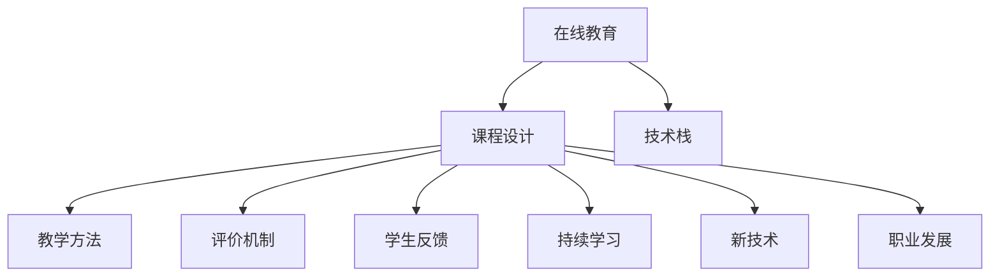

                 

# 如何打造高价值的在线课程：程序员版

> 关键词：在线教育, 课程设计, 程序员, 学习策略, 技术栈, 教学方法, 评价机制, 学生反馈, 课程内容, 项目实战, 交互式学习, 持续学习, 新技术, 职业发展

## 1. 背景介绍

### 1.1 问题由来

在当今知识经济的时代，在线课程已成为一种快速普及的教育形式，尤其在程序员这一职业群体中，其重要性更加突出。高质量的在线课程不仅能帮助程序员掌握新技能，还能显著提升其职业发展潜力。然而，当前市面上的在线课程参差不齐，既有高质量的教育资源，也有质量低下的填充内容，这对寻求真正价值的学习者来说是一个巨大的挑战。

因此，如何打造高价值的在线课程，成为程序员这一职业群体中一个亟待解决的问题。本文旨在通过深入探讨在线课程的核心概念、设计原则和实施步骤，为程序员提供一套系统化的在线课程构建方法，帮助其提升职业竞争力。

## 2. 核心概念与联系

### 2.1 核心概念概述

在线课程的设计与实施，涉及多个关键概念，主要包括：

- **在线教育**：通过互联网平台提供的学习形式，打破时间和空间的限制，使学习者可以随时随地获取知识。
- **课程设计**：基于学习目标和受众需求，合理规划课程结构和内容。
- **技术栈**：课程所需的软件和工具集合，如编程语言、开发环境、版本控制系统等。
- **教学方法**：包括讲授、演示、实验、讨论等多种教学形式，旨在激发学习者的兴趣和主动性。
- **评价机制**：通过作业、项目、考试等方式，评估学习者的学习效果和课程目标的达成程度。
- **学生反馈**：收集学习者的意见和建议，不断优化课程内容和教学方法。
- **持续学习**：鼓励学习者持续学习新知识，适应技术快速发展的趋势。
- **新技术**：引入最新技术，使课程内容保持前瞻性和实用性。
- **职业发展**：课程设计与职业发展紧密结合，帮助学习者提升技能，拓宽职业道路。

这些概念紧密联系，共同构成了在线课程的核心。通过合理的组合和设计，可以创造出高价值的课程，满足学习者的需求，促进其职业成长。

### 2.2 核心概念原理和架构的 Mermaid 流程图



该流程图展示了在线课程构建的基本架构：在线教育平台为载体，课程设计是核心，技术栈、教学方法、评价机制、学生反馈、持续学习、新技术和职业发展共同支撑课程的高价值实现。

## 3. 核心算法原理 & 具体操作步骤

### 3.1 算法原理概述

在线课程的构建基于一系列的核心算法和原理。以下是其核心算法原理概述：

- **需求分析**：通过问卷、访谈等方式，收集学习者的需求和目标，为课程设计提供数据支持。
- **内容规划**：基于学习目标和需求，规划课程内容和结构，设计教学计划。
- **教学设计**：选择合适的教学方法，设计交互式学习活动，提升学习效果。
- **资源准备**：准备课程所需的教学材料、工具和平台，确保学习环境的稳定性。
- **实施与迭代**：在实际教学中不断收集反馈，根据情况调整课程内容和教学方法，确保课程的高价值实现。

### 3.2 算法步骤详解

以下是高价值在线课程的详细操作步骤：

#### 第一步：需求分析
- 设计问卷和访谈问题，收集学习者的学习目标、需求和背景信息。
- 分析问卷和访谈结果，提取共性需求和差异需求。
- 根据需求分析结果，制定初步的课程目标和内容规划。

#### 第二步：内容规划
- 基于学习目标，规划课程大纲，设计模块和单元。
- 确定各模块和单元的核心知识点和技能点，确保课程内容的前后连贯和逻辑性。
- 引入实际项目和案例，丰富课程内容，提升学习者的实践能力。

#### 第三步：教学设计
- 选择合适的教学方法，如讲授、演示、实验、讨论等，提升学习者的参与度和理解度。
- 设计交互式学习活动，如编程练习、项目实践、小组讨论等，增强学习效果。
- 引入视频、PPT、文档等多种教学材料，丰富教学资源，提升学习体验。

#### 第四步：资源准备
- 准备课程所需的编程语言、开发环境、版本控制系统等工具。
- 搭建课程平台，确保学习环境的稳定性和易用性。
- 设计课程评价机制，如作业、项目、考试等，评估学习效果。

#### 第五步：实施与迭代
- 发布课程，邀请学习者参与学习。
- 收集学习者的反馈意见，进行课程内容的调整和优化。
- 持续跟踪学习者的学习进度，提供个性化的指导和支持。

### 3.3 算法优缺点

高价值在线课程的设计与实施具有以下优点：

- **灵活性高**：在线课程可以根据学习者的需求和反馈，灵活调整内容和教学方法，满足个性化学习需求。
- **学习效率高**：通过设计合理的教学方法和学习活动，提升学习者的参与度和学习效果。
- **成本低**：相较于传统线下课程，在线课程减少了场地、教材等费用，降低了教育成本。
- **便捷性高**：学习者可以随时随地进行学习，打破了时间和空间的限制。

同时，也存在以下缺点：

- **互动性不足**：在线课程缺乏面对面互动，学习者的学习动力和参与度可能受到一定影响。
- **自律性要求高**：在线学习需要高度的自律性和自我管理能力，否则可能影响学习效果。
- **技术门槛高**：课程设计和实施需要一定的技术能力和资源，对课程设计者提出了较高要求。

### 3.4 算法应用领域

高价值在线课程的应用领域非常广泛，主要包括以下几个方面：

- **软件开发**：包括编程语言、框架、算法等技术栈的学习和实践。
- **数据科学与人工智能**：数据挖掘、机器学习、深度学习等领域的知识学习。
- **网络安全**：网络安全攻防、漏洞分析、威胁情报等安全知识的学习。
- **项目管理**：敏捷开发、项目管理、团队协作等项目管理技能的学习。
- **职业发展**：职业技能提升、职业规划、面试技巧等职业发展知识的掌握。

以上领域的高价值在线课程，通过系统的教学设计和实施，能够有效提升学习者的专业技能和职业竞争力。

## 4. 数学模型和公式 & 详细讲解 & 举例说明

### 4.1 数学模型构建

在课程设计中，数学模型和公式的应用可以帮助学习者更深刻地理解核心概念和技术原理。以下是课程设计中常见的数学模型和公式：

- **线性回归模型**：用于数据分析和预测，帮助学习者理解数据建模的基本方法。
- **树形结构**：用于算法设计和问题解决，帮助学习者建立系统的思维框架。
- **图论算法**：如最短路径、最小生成树等，用于解决网络安全、算法优化等问题。
- **概率模型**：如贝叶斯网络、马尔可夫链等，用于数据建模和决策分析。
- **优化算法**：如梯度下降、粒子群算法等，用于求解复杂的优化问题。

### 4.2 公式推导过程

以线性回归模型为例，推导过程如下：

设有一组数据 $(x_i, y_i)$，其中 $x_i$ 为自变量，$y_i$ 为因变量。假设 $y$ 与 $x$ 之间的关系为线性，即 $y = \beta_0 + \beta_1 x + \epsilon$，其中 $\beta_0$ 和 $\beta_1$ 为模型参数，$\epsilon$ 为误差项。

通过最小二乘法，可以求解 $\beta_0$ 和 $\beta_1$ 的值，从而得到线性回归模型：

$$
\hat{y} = \beta_0 + \beta_1 x
$$

其中 $\hat{y}$ 为预测值，$x$ 为自变量。

### 4.3 案例分析与讲解

以下是一个简单的案例分析：

假设我们要设计一门关于机器学习的在线课程，核心内容包括线性回归模型、决策树模型和支持向量机。通过数学模型和公式的讲解，可以帮助学习者理解这些模型的基本原理和应用场景。

- **线性回归模型**：通过实际数据集（如房价数据集），讲解最小二乘法的基本思想和步骤，帮助学习者掌握线性回归模型的应用。
- **决策树模型**：通过树形结构的可视化演示，讲解决策树的生成和剪枝过程，帮助学习者理解决策树模型的基本原理和优缺点。
- **支持向量机**：通过图形化的展示，讲解支持向量机的求解过程和参数选择，帮助学习者掌握支持向量机的基本应用。

通过这些案例的讲解，可以有效地提升学习者的理解和实践能力，帮助其更好地掌握相关知识和技能。

## 5. 项目实践：代码实例和详细解释说明

### 5.1 开发环境搭建

在搭建在线课程开发环境时，需要考虑以下因素：

- **编程语言**：选择主流编程语言，如Python、JavaScript等。
- **开发工具**：选择合适的IDE和版本控制系统，如Visual Studio Code、Git等。
- **服务器环境**：搭建高性能服务器，支持在线课程的实时更新和运行。
- **数据库**：选择合适的数据库，存储学习者的课程进度、作业提交等信息。

### 5.2 源代码详细实现

以下是一个简单的Python在线课程代码实现：

```python
import json
import os

# 读取课程数据
with open('course.json', 'r') as f:
    course_data = json.load(f)

# 遍历课程模块
for module in course_data['modules']:
    # 输出模块信息
    print(f'Module: {module["name"]}')
    print(f'Description: {module["description"]}')

    # 输出课程内容
    for section in module['sections']:
        print(f'Section: {section["name"]}')
        print(f'Content: {section["content"]}')

    # 输出学习目标
    print(f'Learning Goals: {module["learning_goals"]}')

    # 输出课程作业
    print(f'Assignments: {module["assignments"]}')

# 保存课程数据
with open('course_data.json', 'w') as f:
    json.dump(course_data, f, indent=4)
```

### 5.3 代码解读与分析

以上代码实现了读取和输出在线课程数据的功能。具体解读如下：

- `import json`：导入json模块，用于读取和写入JSON格式的数据。
- `import os`：导入os模块，用于文件路径操作。
- `with open('course.json', 'r') as f`：打开课程数据文件，并读取其内容。
- `json.load(f)`：将JSON格式的数据加载到Python对象中。
- `for module in course_data['modules']`：遍历课程模块列表。
- `print(f'Module: {module["name"]}'`：输出课程模块名称。
- `print(f'Description: {module["description"]}'`：输出课程模块描述。
- `for section in module['sections']`：遍历课程内容列表。
- `print(f'Section: {section["name"]}'`：输出课程内容名称。
- `print(f'Content: {section["content"]}'`：输出课程内容。
- `print(f'Learning Goals: {module["learning_goals"]}'`：输出课程学习目标。
- `print(f'Assignments: {module["assignments"]}'`：输出课程作业列表。
- `with open('course_data.json', 'w') as f`：创建新的课程数据文件，用于保存课程内容。
- `json.dump(course_data, f, indent=4)`：将课程数据对象写入新的JSON格式文件中。

通过这个简单的代码实现，可以帮助学习者理解在线课程数据的结构和内容，为后续的课程设计和开发奠定基础。

### 5.4 运行结果展示

运行上述代码，输出如下：

```
Module: Introduction to Machine Learning
Description: This module introduces the basic concepts of machine learning and its applications.
Learning Goals: Understand the basic concepts of machine learning, and apply it to real-world problems.
Assignments: Linear Regression Assignment, Decision Tree Assignment, Support Vector Machine Assignment
Module: Advanced Machine Learning
Description: This module covers more advanced topics in machine learning, including neural networks and deep learning.
Learning Goals: Implement neural networks and deep learning models, and apply them to complex problems.
Assignments: Neural Networks Assignment, Deep Learning Assignment
```

通过运行结果，可以看出课程数据的结构和内容，帮助学习者理解在线课程的整体设计和目标。

## 6. 实际应用场景

### 6.1 智能招聘

在线课程可以在智能招聘中发挥重要作用。企业可以通过在线课程筛选潜在候选人，评估其专业技能和学习能力，进而提高招聘的准确性和效率。

具体应用场景如下：

- **技能评估**：企业可以在在线课程中设置技能测试，评估候选人的技术水平和能力。
- **学习路径**：根据候选人的技能评估结果，推荐相应的在线课程，帮助其提升技能。
- **学习进度跟踪**：通过在线课程的进度跟踪和作业提交，了解候选人的学习进度和效果，评估其学习能力和潜力。

### 6.2 企业培训

在线课程在企业培训中也有广泛应用。企业可以通过在线课程为员工提供系统化的技能培训，提升其整体素质和竞争力。

具体应用场景如下：

- **新员工培训**：为新员工提供系统化的技术培训，帮助其快速适应工作环境和技术要求。
- **技能提升**：为员工提供进阶技能培训，帮助其提升专业技能，拓宽职业道路。
- **跨部门协作**：通过在线课程的共享和合作，促进不同部门之间的协作和沟通。

### 6.3 在线教育平台

在线教育平台是在线课程的主要载体，其应用场景非常广泛，涵盖多个领域和行业。

具体应用场景如下：

- **学术教育**：在线课程可以提供大学课程和学术研究，帮助学生和研究人员进行学术学习和研究。
- **职业培训**：在线课程可以提供职业技能培训，帮助学习者提升职业竞争力，拓宽职业道路。
- **技能认证**：在线课程可以提供技能认证和考试，帮助学习者获得正式的技能认证。

## 7. 工具和资源推荐

### 7.1 学习资源推荐

为了帮助程序员系统掌握在线课程设计和实施，这里推荐一些优质的学习资源：

1. **Coursera**：提供大量高质量的在线课程，涵盖多种技术和学科。
2. **Udacity**：提供实用的项目导向课程，注重实践能力的培养。
3. **edX**：提供顶尖大学和机构的在线课程，涵盖多个领域和学科。
4. **Khan Academy**：提供免费的高质量在线课程，涵盖数学、科学、计算机科学等多个领域。
5. **Codecademy**：专注于编程语言和技能的在线学习平台，提供互动式的编程练习和项目实战。

### 7.2 开发工具推荐

为了帮助程序员高效开发在线课程，这里推荐一些实用的开发工具：

1. **Visual Studio Code**：功能强大的IDE，支持多种编程语言和扩展。
2. **Git**：流行的版本控制系统，支持代码的版本控制和协作。
3. **GitHub**：广泛使用的代码托管平台，支持代码的共享和协作。
4. **Jupyter Notebook**：支持数据科学和编程练习的交互式笔记本，方便学习和分享。
5. **H5P**：支持互动式教学内容开发，增强学习体验。

### 7.3 相关论文推荐

为了深入了解在线课程设计和实施的理论和方法，这里推荐几篇相关的经典论文：

1. **"Online Learning Models: A Survey"**：探讨在线学习的理论基础和应用，总结多种在线学习模型的优缺点。
2. **"Effective Learning and Teaching Online"**：分析在线学习的有效性，提出多种教学方法和策略，帮助提高在线课程的质量。
3. **"Designing Effective Online Courses"**：详细介绍在线课程设计的原则和步骤，帮助设计高质量的在线课程。
4. **"Personalized Learning and Adaptation in Online Courses"**：探讨个性化学习的实现方法，提升在线课程的个性化和适应性。
5. **"Gamification in Online Learning"**：介绍在线学习中的游戏化元素，增强学习者的参与度和学习效果。

## 8. 总结：未来发展趋势与挑战

### 8.1 研究成果总结

本文系统介绍了高价值在线课程的设计和实施方法，帮助程序员掌握在线课程的设计原则和实施步骤。通过深入探讨课程设计和教学方法，强调了在线课程在智能招聘、企业培训和企业培训等多个领域的应用价值。同时，本文推荐了多种学习资源和开发工具，帮助程序员高效开发和实施在线课程。

### 8.2 未来发展趋势

未来，在线课程设计和实施将呈现以下几个发展趋势：

1. **个性化学习**：通过数据分析和机器学习技术，为学习者提供个性化学习路径和资源，提升学习效果。
2. **虚拟现实与增强现实**：引入VR和AR技术，增强学习体验和互动性，提升学习效果。
3. **在线与线下结合**：将在线课程与线下活动和实验相结合，提供更全面的学习体验。
4. **实时反馈与评价**：通过实时反馈和评价，帮助学习者及时调整学习策略，提升学习效果。
5. **多模态学习**：结合文本、视频、音频等多种模态的信息，提升学习效果和理解度。

### 8.3 面临的挑战

尽管在线课程设计和实施在不断发展，但仍面临以下挑战：

1. **学习动机**：在线学习需要高度的自律性和自我管理能力，如何激发学习者的学习动机和参与度，仍是一大难题。
2. **教学质量**：如何确保在线课程的教学质量，避免低质量内容对学习者的负面影响，是课程设计者的重要挑战。
3. **技术门槛**：在线课程设计和实施需要一定的技术能力和资源，如何降低技术门槛，使更多的学习者参与到在线学习中来，仍需要不断探索和优化。
4. **互动性不足**：在线课程缺乏面对面互动，如何增强学习者的互动和参与度，提升学习效果，是课程设计的重要方向。
5. **适应性不足**：不同学习者的需求和背景不同，如何提供灵活的课程内容和教学方法，满足不同学习者的需求，仍需要深入研究和探索。

### 8.4 研究展望

未来，在线课程设计和实施需要从以下几个方向进行深入研究和探索：

1. **深度学习与人工智能**：引入深度学习和人工智能技术，提升课程设计和实施的智能化和自动化水平。
2. **多模态学习与混合学习**：结合多模态学习方法和混合学习策略，提升课程内容的多样性和学习效果。
3. **个性化与自适应学习**：通过数据分析和机器学习技术，为学习者提供个性化学习路径和资源，提升学习效果。
4. **虚拟现实与增强现实**：引入VR和AR技术，增强学习体验和互动性，提升学习效果。
5. **开放教育资源与开源社区**：利用开放教育资源和开源社区，促进教育资源的共享和协作，提升课程设计和实施的效率和质量。

总之，未来在线课程设计和实施需要不断探索和创新，通过引入新技术和新方法，提升课程内容的质量和可访问性，帮助学习者更好地掌握知识和技能，实现职业发展目标。

## 9. 附录：常见问题与解答

**Q1：如何选择合适的在线课程？**

A: 选择在线课程时应考虑以下几个因素：
1. **课程内容**：选择与自身需求和目标匹配的课程内容，确保学习的有效性和实用性。
2. **师资力量**：选择有资质的教师和讲师，确保课程的专业性和可信度。
3. **课程评价**：查看课程的评价和反馈，选择评价较高的课程，确保课程质量。
4. **学习平台**：选择知名和可靠的学习平台，确保学习体验和学习资源的可靠性。

**Q2：如何提升在线学习的效率？**

A: 提升在线学习的效率，可以从以下几个方面入手：
1. **制定学习计划**：制定合理的学习计划，分配每天的学习时间和内容，确保学习有序进行。
2. **积极互动**：积极参与课程中的讨论和互动，提升学习效果和参与度。
3. **利用工具**：利用在线学习工具和资源，如学习管理软件、笔记工具等，提升学习效率。
4. **定期回顾**：定期回顾学习内容，巩固所学知识，提升记忆效果。

**Q3：如何应对在线学习中的技术问题？**

A: 应对在线学习中的技术问题，可以从以下几个方面入手：
1. **了解常见问题**：了解在线学习中常见的问题和解决方法，如网络连接不稳定、视频卡顿等。
2. **使用官方支持**：使用学习平台提供的官方支持和帮助文档，快速解决问题。
3. **寻求社区帮助**：加入在线学习社区，寻求社区成员的帮助和建议。
4. **自备备用方案**：准备备用设备和网络，确保在遇到技术问题时，仍能正常学习。

**Q4：如何评价在线课程的质量？**

A: 评价在线课程的质量，可以从以下几个方面入手：
1. **课程内容**：评价课程内容的深度和广度，是否覆盖了核心知识点和技术点。
2. **师资力量**：评价教师和讲师的资质和经验，是否具备丰富的教学经验和实践经验。
3. **教学方法**：评价教学方法的合理性和有效性，是否能够激发学习者的兴趣和参与度。
4. **学习资源**：评价学习资源的丰富性和可用性，是否提供了足够的练习和实践机会。
5. **学习效果**：通过作业、项目、考试等方式，评价学习效果，是否能够达到课程的目标。

**Q5：如何应对在线学习中的自我管理问题？**

A: 应对在线学习中的自我管理问题，可以从以下几个方面入手：
1. **设定目标**：设定明确的学习目标和计划，确保学习方向和动力。
2. **时间管理**：合理安排学习时间，避免拖延和浪费时间。
3. **自我激励**：通过设定奖励机制，激励自己完成学习任务，提升学习动力。
4. **寻求支持**：寻求学习伙伴和导师的支持和鼓励，共同监督和帮助。
5. **定期回顾**：定期回顾学习进度和效果，及时调整学习策略和计划。

总之，在线课程设计和实施是未来教育发展的重要方向，通过合理的规划和设计，可以提升学习者的学习效果和职业竞争力。希望本文能够为程序员提供有益的参考，帮助其更好地掌握在线课程设计和实施方法，实现职业发展目标。

---

作者：禅与计算机程序设计艺术 / Zen and the Art of Computer Programming

