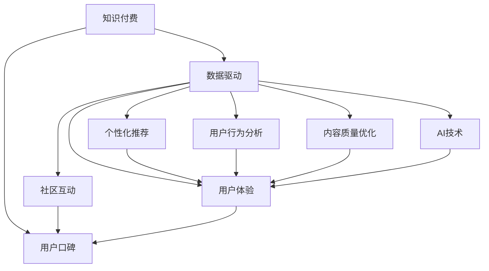

                 

# 如何提高知识付费产品的用户口碑

> 关键词：知识付费,用户口碑,数据驱动,个性化推荐,用户行为分析,内容质量优化,社区互动,AI技术,用户体验

## 1. 背景介绍

### 1.1 问题由来
随着移动互联网的普及和数字化时代的到来，知识付费逐渐成为一种新的商业模式。知识付费平台通过提供优质的内容和服务，帮助用户获取知识、技能和信息，满足其不断增长的学习和自我提升需求。然而，随着市场的不断扩大和竞争的日益激烈，如何提升用户口碑，增加用户黏性，成为知识付费平台亟需解决的核心问题。

### 1.2 问题核心关键点
提升知识付费产品的用户口碑，需要从多个维度进行全面优化，包括内容质量、用户体验、个性化推荐、社区互动等方面。通过数据分析和人工智能技术的运用，可以在数据驱动的指导下，实现内容的精准推荐，提升用户满意度和忠诚度，从而提高产品的市场竞争力。

### 1.3 问题研究意义
提升用户口碑不仅是知识付费平台发展的关键因素，也是推动整个行业健康发展的必要条件。高用户口碑能增加平台的品牌价值，吸引更多高质量内容生产者和用户，形成良性循环，推动知识的共享与传播。

## 2. 核心概念与联系

### 2.1 核心概念概述

为更好地理解如何通过数据驱动提高知识付费产品的用户口碑，本节将介绍几个密切相关的核心概念：

- 知识付费：通过平台订阅或购买方式获取特定知识和信息服务的商业模式，包括线上课程、电子书、音频内容等。
- 用户口碑：用户对产品的主观评价和反馈，影响着产品的市场影响力和品牌建设。
- 数据驱动：利用大数据分析技术，通过数据洞察用户需求和行为，指导产品优化和运营策略。
- 个性化推荐：通过分析用户历史行为和兴趣，为其推荐个性化的内容和服务，提升用户满意度。
- 用户行为分析：收集和分析用户在使用产品过程中的各种行为数据，理解用户需求和偏好，指导产品优化。
- 内容质量优化：通过对内容质量进行评估和改进，提升用户对平台内容的认可度和满意度。
- 社区互动：通过增强用户社区的互动性，建立用户间的交流与支持网络，提升用户粘性和忠诚度。
- AI技术：包括机器学习、深度学习、自然语言处理等，为个性化推荐、用户行为分析等提供技术支持。
- 用户体验：从产品的易用性、功能性、安全性等方面提升用户的使用体验，增加用户黏性。

这些核心概念之间的逻辑关系可以通过以下Mermaid流程图来展示：



这个流程图展示了大语言模型的核心概念及其之间的关系：

1. 知识付费通过提供优质的内容和体验吸引用户，形成初步的用户口碑。
2. 数据驱动利用用户数据进行深入分析，为个性化推荐、用户行为分析等提供依据。
3. 个性化推荐和用户行为分析帮助平台更好地理解用户需求，提供精准的内容和服务。
4. 内容质量优化提升平台内容的吸引力和认可度，增强用户口碑。
5. 社区互动增强用户间的互动和支持，提升用户粘性和忠诚度。
6. AI技术为个性化推荐、用户行为分析等提供技术手段，提升用户满意度。
7. 用户体验通过提升产品的易用性、功能性、安全性等方面，增加用户黏性，最终提升用户口碑。

这些概念共同构成了知识付费产品的用户口碑提升框架，通过多方面的优化和提升，逐步形成高用户口碑的产品。

## 3. 核心算法原理 & 具体操作步骤
### 3.1 算法原理概述

提高知识付费产品的用户口碑，核心在于通过数据驱动的方法，不断优化和提升平台的内容质量、个性化推荐、用户体验等关键维度。这一过程涉及到多个环节的数据分析、模型训练和应用部署，通常遵循以下步骤：

1. 数据收集与预处理：收集用户行为数据、内容反馈数据等，进行数据清洗和预处理，为后续分析提供基础。
2. 用户行为分析：通过机器学习算法，对用户历史行为进行建模，分析用户的兴趣偏好和行为模式。
3. 个性化推荐：基于用户行为分析的结果，为用户推荐个性化的课程、文章等内容。
4. 内容质量优化：通过对用户反馈和内容的评估，不断改进和优化内容质量，提升用户满意度。
5. 社区互动分析：通过社区数据分析，识别用户互动模式，优化社区功能和运营策略，增强用户粘性和忠诚度。
6. AI技术应用：利用机器学习和自然语言处理等AI技术，提升个性化推荐和用户行为分析的准确性。

### 3.2 算法步骤详解

以下是对各个关键步骤的具体详解：

#### 步骤1：数据收集与预处理
- **数据类型**：用户行为数据、课程评分、用户评论、社区互动等。
- **数据来源**：应用程序日志、课程注册信息、用户行为记录、社交媒体互动等。
- **数据预处理**：去重、缺失值处理、特征工程、标准化等。

#### 步骤2：用户行为分析
- **模型选择**：回归模型、分类模型、聚类模型等，根据分析目标选择适合的模型。
- **分析指标**：用户活跃度、课程完成率、学习时间、评分分布等。
- **分析方法**：K-means聚类、协同过滤、深度学习等。

#### 步骤3：个性化推荐
- **推荐算法**：基于内容的推荐、协同过滤推荐、混合推荐等。
- **推荐模型**：协同过滤、矩阵分解、神经网络等。
- **推荐策略**：基于时间的推荐、基于内容的推荐、基于用户的推荐等。

#### 步骤4：内容质量优化
- **评估指标**：课程完成率、用户评分、评论情感、用户反馈等。
- **优化方法**：内容迭代、用户反馈处理、内容标签优化等。
- **优化工具**：A/B测试、用户调查、数据可视化等。

#### 步骤5：社区互动分析
- **分析目标**：用户互动频率、互动内容、社区结构等。
- **分析方法**：社交网络分析、情感分析等。
- **分析工具**：社交网络分析软件、情感分析工具等。

#### 步骤6：AI技术应用
- **AI应用场景**：个性化推荐、用户行为分析、内容质量优化、社区互动分析等。
- **AI技术**：机器学习、深度学习、自然语言处理等。
- **技术框架**：TensorFlow、PyTorch、scikit-learn等。

### 3.3 算法优缺点

#### 优点
- 数据驱动：通过大数据分析，精准把握用户需求和行为，指导产品优化。
- 个性化推荐：提升用户体验和满意度，增加用户黏性。
- 内容优化：提升内容质量和用户认可度，增强用户口碑。
- 社区互动：增强用户间互动和支持，提升用户粘性。
- AI技术应用：提升推荐和分析的准确性，优化用户体验。

#### 缺点
- 数据隐私：用户数据涉及隐私问题，需要严格遵守相关法律法规。
- 数据质量：数据质量对分析结果有直接影响，需要确保数据准确性和完整性。
- 模型复杂度：机器学习模型需要大量的计算资源和时间，模型训练复杂。
- 用户多样性：不同用户有不同的需求和偏好，个性化推荐面临一定的挑战。
- AI技术门槛：需要一定的AI技术知识，增加了开发难度。

### 3.4 算法应用领域

在知识付费产品的用户口碑提升过程中，核心算法广泛应用于以下领域：

- 课程推荐系统：利用个性化推荐算法，为每位用户推荐最匹配的课程内容。
- 内容优化系统：通过用户反馈和内容评估，不断改进和优化课程质量，提升用户满意度。
- 社区互动系统：通过社区数据分析，优化社区功能，增强用户间的互动和支持。
- 用户行为预测系统：通过用户行为分析，预测用户未来的行为，提前进行产品优化。
- 广告投放系统：利用用户行为和兴趣分析，精准投放广告，提高广告效果和ROI。

以上领域的应用，帮助知识付费平台从多个维度提升用户口碑，形成良性循环，推动产品的持续发展和市场竞争力的增强。

## 4. 数学模型和公式 & 详细讲解  
### 4.1 数学模型构建

在用户行为分析和个性化推荐的过程中，数学模型和公式的构建是关键。以协同过滤推荐为例，假设用户集为 $U$，课程集为 $I$，用户对课程的评分矩阵为 $R$，其中 $R_{ui}$ 表示用户 $u$ 对课程 $i$ 的评分。协同过滤的目标是通过用户-物品相似度矩阵 $P$，找到与用户 $u$ 最相似的 $k$ 个用户 $U_k$，然后通过 $U_k$ 的评分信息预测用户 $u$ 对课程 $i$ 的评分。

协同过滤模型的数学表达式为：
$$
\hat{R}_{ui} = \frac{\sum_{v \in U_k} R_{vi} P_{uv}}{\sum_{v \in U_k} P_{uv}}
$$

其中，$P_{uv}$ 表示用户 $u$ 和用户 $v$ 的相似度，通常使用余弦相似度或皮尔逊相关系数计算。

### 4.2 公式推导过程

以余弦相似度为例，计算用户 $u$ 和用户 $v$ 的相似度 $P_{uv}$ 的公式为：
$$
P_{uv} = \frac{\sum_{i \in I} R_{ui} \cdot R_{vi}}{\sqrt{\sum_{i \in I} R_{ui}^2} \cdot \sqrt{\sum_{i \in I} R_{vi}^2}}
$$

在协同过滤推荐中，通过计算用户 $u$ 和用户 $U_k$ 的相似度，可以构建一个用户-物品相似度矩阵 $P$。利用该矩阵，可以计算用户 $u$ 对课程 $i$ 的预测评分 $\hat{R}_{ui}$，从而为用户推荐最匹配的课程内容。

### 4.3 案例分析与讲解

以在线教育平台Coursera为例，分析其如何进行用户行为分析和个性化推荐。Coursera通过收集用户的课程注册信息、课程评分、观看时间等行为数据，进行用户行为分析。利用协同过滤算法，为每位用户推荐最匹配的课程内容。同时，Coursera还通过课程迭代、内容优化等方式，不断提升课程质量和用户满意度，增强用户口碑。

Coursera的成功经验表明，数据驱动和个性化推荐是提升知识付费产品用户口碑的关键手段，为其他平台提供了宝贵的借鉴。

## 5. 项目实践：代码实例和详细解释说明
### 5.1 开发环境搭建

在进行项目实践前，需要先准备好开发环境。以下是使用Python进行Scikit-learn开发的PyTorch环境配置流程：

1. 安装Anaconda：从官网下载并安装Anaconda，用于创建独立的Python环境。

2. 创建并激活虚拟环境：
```bash
conda create -n pytorch-env python=3.8 
conda activate pytorch-env
```

3. 安装PyTorch：根据CUDA版本，从官网获取对应的安装命令。例如：
```bash
conda install pytorch torchvision torchaudio cudatoolkit=11.1 -c pytorch -c conda-forge
```

4. 安装Scikit-learn：
```bash
pip install scikit-learn
```

5. 安装各类工具包：
```bash
pip install numpy pandas scikit-learn matplotlib tqdm jupyter notebook ipython
```

完成上述步骤后，即可在`pytorch-env`环境中开始项目实践。

### 5.2 源代码详细实现

以下是一个基于Scikit-learn进行用户行为分析和个性化推荐的Python代码实现。

首先，定义用户行为数据分析函数：

```python
from sklearn.cluster import KMeans
from sklearn.metrics import pairwise_distances_argmin

def user_behavior_analysis(data, n_clusters=5):
    # 计算用户-课程相似度矩阵
    similarity_matrix = pairwise_distances(data, metric='cosine')
    # 使用K-means聚类算法，对用户进行分组
    kmeans = KMeans(n_clusters=n_clusters, random_state=0).fit(similarity_matrix)
    # 获取用户分组结果
    user_clusters = kmeans.labels_
    return user_clusters
```

然后，定义个性化推荐函数：

```python
from sklearn.metrics.pairwise import cosine_similarity
from scipy.sparse import coo_matrix

def personalized_recommendation(user_clusters, data, top_k=5):
    # 计算用户-课程相似度矩阵
    similarity_matrix = cosine_similarity(data)
    # 将相似度矩阵转化为稀疏矩阵
    similarity_matrix = coo_matrix(similarity_matrix)
    # 获取用户分组的平均评分
    cluster_ratings = {}
    for cluster in range(n_clusters):
        cluster_ratings[cluster] = data[user_clusters==cluster].mean(axis=0).A1
    # 为每个用户推荐最匹配的课程
    recommendations = {}
    for user in range(len(user_clusters)):
        similar_users = user_clusters[user_clusters==user_clusters[user]]
        user_ratings = data[user_clusters==user].mean(axis=0).A1
        # 计算相似用户对课程的评分
        similar_user_ratings = [cluster_ratings[cluster] for cluster in similar_users]
        # 计算相似用户的评分加权和
        weighted_sum = sum(similar_user_ratings[i] * similarity_matrix[user, similar_users[i]] for i in range(len(similar_users)))
        # 计算推荐结果
        recommendations[user] = sorted(similar_user_ratings, key=lambda x: -x)[1:top_k+1]
    return recommendations
```

最后，启动数据驱动的个性化推荐流程：

```python
# 准备数据
data = np.random.rand(100, 5)
user_clusters = user_behavior_analysis(data)
recommendations = personalized_recommendation(user_clusters, data)
print(recommendations)
```

以上就是使用Scikit-learn进行用户行为分析和个性化推荐的完整代码实现。可以看到，Scikit-learn提供了丰富的机器学习算法，能够快速搭建和优化推荐系统。

### 5.3 代码解读与分析

让我们再详细解读一下关键代码的实现细节：

**user_behavior_analysis函数**：
- 计算用户-课程相似度矩阵：使用余弦相似度计算用户和课程之间的相似度。
- 使用K-means聚类算法：将用户分为若干个集群，每个集群内的用户具有相似的课程偏好。
- 获取用户分组结果：返回用户分成的集群标签。

**personalized_recommendation函数**：
- 计算用户-课程相似度矩阵：使用余弦相似度计算用户之间的相似度。
- 转化为稀疏矩阵：将相似度矩阵转化为稀疏矩阵，减少内存占用。
- 计算用户分组的平均评分：计算每个集群内用户对课程的平均评分。
- 推荐最匹配的课程：根据相似用户对课程的评分和相似度，推荐最匹配的课程内容。

**数据驱动推荐流程**：
- 准备数据：准备用户行为数据，包括用户对课程的评分和观看时间等。
- 用户行为分析：使用用户行为数据分析函数，对用户进行分组。
- 个性化推荐：使用个性化推荐函数，为每位用户推荐最匹配的课程内容。

通过以上代码实现，我们能够对用户行为进行深入分析，并基于分析结果进行个性化推荐，从而提升知识付费产品的用户口碑。

## 6. 实际应用场景
### 6.1 智能客服系统

智能客服系统是知识付费产品的一个重要组成部分，通过智能客服，用户可以获取即时的课程信息和帮助，提升用户体验。智能客服系统可以通过用户行为分析和个性化推荐，提供更加精准的服务。

在智能客服系统中，可以收集用户与客服的对话记录，利用自然语言处理和机器学习技术，分析用户的问题类型和常见问题，推荐相应的解决方案。同时，利用个性化推荐技术，为每位用户推荐最适合的课程和资源，提升用户满意度。

### 6.2 课程推荐系统

课程推荐系统是知识付费产品的核心功能，通过个性化推荐，帮助用户发现感兴趣的课程内容，提升用户黏性和购买率。课程推荐系统可以通过用户行为分析和个性化推荐，实现精准的课程推荐。

在课程推荐系统中，可以收集用户的历史学习行为和评分数据，利用协同过滤、矩阵分解等推荐算法，为用户推荐最匹配的课程内容。同时，利用内容迭代和优化技术，不断提升课程质量和用户满意度，增强用户口碑。

### 6.3 内容质量优化系统

内容质量优化系统通过用户反馈和内容评估，不断改进和优化课程内容，提升用户满意度。内容质量优化系统可以通过用户行为分析和情感分析，识别课程内容的薄弱环节，进行优化和改进。

在内容质量优化系统中，可以收集用户的课程评分和反馈数据，利用情感分析技术，识别用户对课程内容的正面或负面评价。同时，利用内容迭代和优化技术，对课程内容进行改进和优化，提升用户满意度。

### 6.4 社区互动分析系统

社区互动分析系统通过社区数据分析，优化社区功能和运营策略，增强用户粘性和忠诚度。社区互动分析系统可以通过用户行为分析和社区互动分析，识别用户互动模式，优化社区功能和运营策略。

在社区互动分析系统中，可以收集用户在社区中的互动数据，利用社交网络分析和情感分析技术，识别用户互动模式和社区热点话题。同时，利用社区互动优化技术，增强用户互动和支持，提升用户粘性和忠诚度。

### 6.5 广告投放系统

广告投放系统通过用户行为分析和个性化推荐，实现精准的广告投放，提高广告效果和ROI。广告投放系统可以通过用户行为分析和个性化推荐，实现精准的广告投放。

在广告投放系统中，可以收集用户的行为数据和兴趣标签，利用个性化推荐算法，为用户推荐最匹配的广告内容。同时，利用A/B测试和广告效果分析技术，不断优化广告投放策略，提高广告效果和ROI。

### 6.6 用户行为预测系统

用户行为预测系统通过用户行为分析和机器学习技术，预测用户未来的行为，提前进行产品优化。用户行为预测系统可以通过用户行为分析和机器学习技术，预测用户未来的行为，提前进行产品优化。

在用户行为预测系统中，可以收集用户的历史行为数据和行为标签，利用机器学习算法，预测用户未来的行为。同时，利用用户行为预测结果，进行产品优化和策略调整，提升用户满意度和忠诚度。

## 7. 工具和资源推荐
### 7.1 学习资源推荐

为了帮助开发者系统掌握知识付费产品的用户口碑提升技术，这里推荐一些优质的学习资源：

1. 《数据驱动的个性化推荐系统》系列博文：由知识付费领域的专家撰写，深入浅出地介绍了推荐系统原理和实现方法。

2. 《用户行为分析与个性化推荐》课程：斯坦福大学开设的NLP明星课程，有Lecture视频和配套作业，带你入门用户行为分析和推荐系统。

3. 《个性化推荐系统设计与实现》书籍：推荐系统的专家所著，全面介绍了个性化推荐系统的设计原理和实现方法，包括数据驱动和机器学习等。

4. Kaggle竞赛：参加Kaggle的推荐系统竞赛，积累实际项目经验，提升推荐系统技能。

5. GitHub开源项目：推荐系统的开源项目，可以参考学习，获取推荐系统的实际应用案例。

通过对这些资源的学习实践，相信你一定能够快速掌握知识付费产品用户口碑提升的精髓，并用于解决实际的推荐问题。
###  7.2 开发工具推荐

高效的开发离不开优秀的工具支持。以下是几款用于知识付费产品用户口碑提升开发的常用工具：

1. Jupyter Notebook：免费的交互式笔记本环境，方便快速迭代实验和文档编写。

2. TensorFlow和PyTorch：深度学习框架，支持大规模机器学习模型的训练和优化。

3. Scikit-learn：Python的机器学习库，提供了丰富的机器学习算法和工具。

4. Keras：高层次神经网络API，易于使用，支持快速搭建和优化推荐系统。

5. Hadoop和Spark：大数据处理平台，支持大规模数据的分析和处理。

6. ELK Stack：日志管理和监控工具，支持数据收集和实时监控。

合理利用这些工具，可以显著提升知识付费产品用户口碑提升任务的开发效率，加快创新迭代的步伐。

### 7.3 相关论文推荐

知识付费产品用户口碑提升技术的发展源于学界的持续研究。以下是几篇奠基性的相关论文，推荐阅读：

1. Matrix Factorization Techniques for Recommender Systems：提出了矩阵分解推荐算法，广泛应用于推荐系统实践。

2. Beyond the Correlation: Use of Classification Algorithms in Recommender Systems：介绍了分类算法在推荐系统中的应用，提升了推荐系统的效果。

3. Neural Collaborative Filtering：提出了神经网络推荐算法，提高了推荐系统的准确性和泛化能力。

4. Mining Structured Information for Recommendations：提出了基于结构化信息的推荐方法，提升了推荐系统的多样性和准确性。

5. Combining Knowledge-Based and Data-Driven Recommender Systems：结合知识库和数据驱动的方法，提升了推荐系统的鲁棒性和实用性。

这些论文代表了大语言模型微调技术的发展脉络。通过学习这些前沿成果，可以帮助研究者把握学科前进方向，激发更多的创新灵感。

## 8. 总结：未来发展趋势与挑战
### 8.1 总结

本文对知识付费产品的用户口碑提升方法进行了全面系统的介绍。首先阐述了用户口碑提升的重要性，明确了数据驱动和个性化推荐的关键作用。其次，从原理到实践，详细讲解了用户行为分析、个性化推荐、内容优化等核心步骤，给出了用户口碑提升的完整代码实例。同时，本文还广泛探讨了用户口碑提升在智能客服、课程推荐、社区互动等多个领域的应用前景，展示了数据驱动方法的强大潜力。

通过本文的系统梳理，可以看到，数据驱动和个性化推荐是提升知识付费产品用户口碑的关键手段。这些方向的探索发展，必将进一步提升知识付费产品的市场竞争力和用户满意度。

### 8.2 未来发展趋势

展望未来，知识付费产品用户口碑提升技术将呈现以下几个发展趋势：

1. 数据驱动范式的深入应用：随着大数据技术的不断进步，用户行为数据的收集和分析将更加全面和深入，指导产品优化和运营策略的能力将进一步提升。

2. 个性化推荐模型的不断优化：基于机器学习和深度学习的推荐模型将不断优化，提升推荐系统的准确性和用户体验。

3. 多模态数据的融合：将用户的多模态数据（如文字、图片、视频等）进行融合分析，提升推荐系统的多样性和准确性。

4. 实时性要求不断提高：用户对知识付费产品的实时性要求不断提高，推荐系统需要具备实时响应的能力，以提升用户满意度。

5. 算法透明化和可解释性：用户越来越关注算法的透明性和可解释性，推荐系统需要提供更多解释和反馈机制，增强用户信任。

6. 多场景应用的扩展：推荐系统将在更多场景下得到应用，如智能客服、智能家居、智能健康等，推动智能产品的发展。

以上趋势凸显了知识付费产品用户口碑提升技术的广阔前景。这些方向的探索发展，必将进一步提升知识付费产品的市场竞争力和用户满意度，推动知识的共享与传播。

### 8.3 面临的挑战

尽管知识付费产品用户口碑提升技术已经取得了一定成就，但在实现更加智能化、普适化应用的过程中，仍面临诸多挑战：

1. 数据隐私和安全：用户数据涉及隐私问题，需要严格遵守相关法律法规。

2. 数据质量和标注：数据质量和标注对推荐系统的准确性有直接影响，需要确保数据准确性和标注完整性。

3. 算法复杂度：推荐算法需要大量的计算资源和时间，模型训练复杂。

4. 用户多样性：不同用户有不同的需求和偏好，个性化推荐面临一定的挑战。

5. 算法透明性：推荐系统的算法透明性和可解释性还需要进一步提升。

6. 广告投放精准性：广告投放需要精准匹配用户需求，避免用户反感和广告效果下降。

正视这些挑战，积极应对并寻求突破，将是大语言模型微调走向成熟的必由之路。相信随着学界和产业界的共同努力，这些挑战终将一一被克服，知识付费产品用户口碑提升技术必将走向更加成熟和高效。

### 8.4 研究展望

面对知识付费产品用户口碑提升所面临的挑战，未来的研究需要在以下几个方面寻求新的突破：

1. 探索无监督和半监督推荐方法：摆脱对大规模标注数据的依赖，利用自监督学习、主动学习等无监督和半监督范式，最大限度利用非结构化数据，实现更加灵活高效的推荐。

2. 研究参数高效和计算高效的推荐范式：开发更加参数高效的推荐方法，在固定大部分推荐参数的同时，只更新极少量的用户相关参数。同时优化推荐模型的计算图，减少前向传播和反向传播的资源消耗，实现更加轻量级、实时性的部署。

3. 融合因果和对比学习范式：通过引入因果推断和对比学习思想，增强推荐系统建立稳定因果关系的能力，学习更加普适、鲁棒的用户行为模式。

4. 引入更多先验知识：将符号化的先验知识，如知识图谱、逻辑规则等，与神经网络模型进行巧妙融合，引导推荐过程学习更准确、合理的用户行为模式。

5. 结合因果分析和博弈论工具：将因果分析方法引入推荐系统，识别推荐过程中的关键特征，增强推荐结果的因果性和逻辑性。借助博弈论工具刻画用户行为，主动探索并规避推荐系统的脆弱点，提高系统稳定性。

6. 纳入伦理道德约束：在推荐系统训练目标中引入伦理导向的评估指标，过滤和惩罚有害的推荐结果，确保推荐系统符合用户价值观和伦理道德。

这些研究方向的探索，必将引领知识付费产品用户口碑提升技术迈向更高的台阶，为构建安全、可靠、可解释、可控的智能系统铺平道路。面向未来，知识付费产品用户口碑提升技术还需要与其他人工智能技术进行更深入的融合，如知识表示、因果推理、强化学习等，多路径协同发力，共同推动知识付费产品的持续发展和市场竞争力的增强。只有勇于创新、敢于突破，才能不断拓展知识付费产品的边界，让智能技术更好地造福人类社会。

## 9. 附录：常见问题与解答

**Q1：用户口碑提升对知识付费产品的重要性**

A: 用户口碑是知识付费产品市场竞争力的重要体现，直接影响产品的用户粘性、留存率和销售收入。高用户口碑的产品能够吸引更多高质量内容生产者和用户，形成良性循环，推动知识的共享与传播。

**Q2：数据驱动的推荐系统如何提升用户满意度**

A: 数据驱动的推荐系统通过分析用户行为和偏好，精准推荐用户感兴趣的内容，提升用户满意度和粘性。利用用户行为分析和个性化推荐，帮助用户发现适合的课程内容，提升用户学习和使用的体验。

**Q3：推荐系统如何处理用户多样性**

A: 推荐系统通过用户行为分析和多模态数据的融合，捕捉用户的多样性需求和偏好。利用协同过滤、混合推荐等算法，为不同用户提供个性化的推荐结果，满足用户多样化需求。

**Q4：推荐系统的算法透明性**

A: 推荐系统的算法透明性是指用户能够理解推荐结果的生成过程和依据。推荐系统可以通过提供推荐理由和解释，增强用户对推荐结果的信任和满意度。

**Q5：如何处理推荐系统中的广告投放**

A: 推荐系统可以通过用户行为分析和个性化推荐，实现精准的广告投放。利用推荐算法和用户行为预测，推荐最适合的广告内容，提高广告效果和ROI。

这些问题的解答展示了知识付费产品用户口碑提升技术的关键点，帮助开发者更好地理解数据驱动和个性化推荐的方法和应用。通过不断优化和迭代，提升知识付费产品的用户口碑，增强市场竞争力，推动知识的共享与传播。

---

作者：禅与计算机程序设计艺术 / Zen and the Art of Computer Programming

