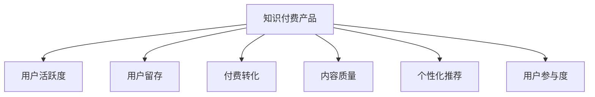

                 

# 如何提高知识付费产品的用户活跃度

> 关键词：知识付费,用户活跃度,产品设计,营销策略,用户体验,个性化推荐,心理机制,用户留存

## 1. 背景介绍

### 1.1 问题由来

随着互联网和移动互联网的迅速发展，知识付费行业日益壮大，成为信息经济的重要组成部分。但与此同时，用户流失率高、付费转化率低等问题也成为制约行业发展的瓶颈。如何有效提高知识付费产品的用户活跃度，让用户持续付费，是知识付费平台必须解决的核心问题。

### 1.2 问题核心关键点

1. **用户留存**：确保用户能够在平台上保持较长时间的使用，是知识付费产品成功的关键。
2. **付费转化**：通过有效的转化策略，吸引潜在用户付费，提升平台收入。
3. **内容质量**：高质量、有价值的内容是吸引和留住用户的基础。
4. **个性化推荐**：根据用户行为和偏好，推荐相关内容，提高用户满意度。
5. **用户参与度**：通过互动、社交等功能，增强用户粘性。
6. **用户反馈**：及时响应用户反馈，不断优化产品体验。

### 1.3 问题研究意义

研究如何提高知识付费产品的用户活跃度，对于推动信息经济的发展，促进知识创新和传播，具有重要意义：

1. **促进知识共享**：通过提高用户活跃度，平台可以更好地促进知识传播和共享，提升社会整体的知识水平。
2. **增加用户粘性**：提高用户留存率和付费转化率，增强平台的用户粘性，形成良性循环。
3. **优化用户体验**：通过数据分析和用户反馈，不断优化产品设计和功能，提升用户体验。
4. **提升平台收入**：通过提升用户付费意愿和频次，增加平台收入，实现商业价值。

## 2. 核心概念与联系

### 2.1 核心概念概述

为更好地理解如何提高知识付费产品的用户活跃度，本节将介绍几个密切相关的核心概念：

- **知识付费产品**：通过付费获取知识和信息的服务平台，如Coursera、Udemy等。
- **用户活跃度**：指用户在使用知识付费产品时，进行高频互动、消费、参与的程度。
- **用户留存**：指用户在特定时间段内持续使用产品的比例。
- **付费转化**：指潜在用户变为实际付费用户的过程，是知识付费平台的重要指标。
- **内容质量**：指平台提供内容的价值和专业性，影响用户对平台的满意度和信任度。
- **个性化推荐**：通过算法推荐系统，根据用户行为和偏好推荐相关内容，提高用户满意度。
- **用户参与度**：指用户参与平台内容的互动和社交活动的程度。

这些核心概念之间的逻辑关系可以通过以下Mermaid流程图来展示：



这个流程图展示知识付费产品的核心概念及其之间的关系：

1. 知识付费产品通过高质量的内容吸引用户，提高用户活跃度。
2. 用户活跃度的高低影响用户留存和付费转化，留存用户可以带来更多收入，高转化率可以提升平台收益。
3. 个性化推荐和用户参与度有助于提高用户满意度，进一步增强留存和转化。
4. 平台需要不断优化内容质量，提升用户对平台的信任和满意度，从而吸引更多用户并提高用户留存和付费转化率。

## 3. 核心算法原理 & 具体操作步骤

### 3.1 算法原理概述

提高知识付费产品的用户活跃度，本质上是一个数据驱动的产品设计和优化过程。其核心思想是通过数据分析和机器学习算法，了解用户行为和偏好，制定相应的策略，从而提升用户留存和付费转化率。

具体而言，可以分为以下几个步骤：

1. **用户行为分析**：收集用户在平台上的行为数据，如访问频率、观看时长、消费记录等，通过数据分析工具如Google Analytics、Amplitude等，理解用户需求和行为模式。
2. **用户分群**：基于用户行为数据，使用聚类算法（如K-Means、GMM）将用户分为不同群体，识别出活跃用户、潜在用户、流失用户等。
3. **个性化推荐**：根据用户分群结果，结合个性化推荐算法（如协同过滤、基于内容的推荐、深度学习推荐），推荐用户感兴趣的内容。
4. **用户激励策略**：设计合适的激励机制，如积分、优惠券、限时折扣等，吸引用户进行付费和消费。
5. **社交互动**：引入社交功能，如论坛、评论、点赞等，增加用户之间的互动，提高用户参与度。
6. **用户反馈收集与处理**：通过用户调研、用户评论、行为数据分析等方式，收集用户反馈，持续优化产品体验。

### 3.2 算法步骤详解

以下是具体算法步骤的详细介绍：

#### 3.2.1 用户行为分析

- **数据收集**：收集用户在平台上的行为数据，如访问记录、观看时长、购买记录等。
- **数据预处理**：清洗数据，去除噪声和异常值，进行归一化处理。
- **行为建模**：使用统计模型（如回归模型、时间序列模型）和机器学习模型（如决策树、随机森林）建立用户行为模型。
- **行为预测**：基于已有的用户行为数据，预测用户未来的行为，如是否流失、是否付费等。

#### 3.2.2 用户分群

- **特征选择**：选择影响用户行为的关键特征，如观看时长、消费频次、互动次数等。
- **聚类算法**：使用聚类算法将用户分为不同群体，识别出潜在流失用户、潜在付费用户等。
- **群体分析**：对每个群体进行分析，了解其行为特征和需求，制定针对性的策略。

#### 3.2.3 个性化推荐

- **推荐算法选择**：根据数据特征和业务需求选择合适的推荐算法，如协同过滤、基于内容的推荐、深度学习推荐等。
- **模型训练**：使用历史用户行为数据，训练推荐模型，找到用户与内容的匹配度。
- **实时推荐**：基于用户的实时行为数据，实时推荐相关内容，提升用户满意度。

#### 3.2.4 用户激励策略

- **策略设计**：根据用户行为和心理机制设计激励策略，如积分系统、优惠券、限时折扣等。
- **策略执行**：通过平台推送、邮件通知等方式，将激励策略传递给用户，吸引用户进行付费和消费。
- **效果评估**：评估激励策略的效果，如提升的用户留存率和付费转化率，优化策略设计。

#### 3.2.5 社交互动

- **社交功能设计**：引入论坛、评论、点赞等社交功能，增加用户之间的互动。
- **用户参与度提升**：通过社交功能增强用户粘性，提高用户参与度。
- **社区管理**：建立社区管理机制，维护良好的社区氛围，促进用户互动。

#### 3.2.6 用户反馈收集与处理

- **反馈渠道**：通过用户调研、用户评论、行为数据分析等方式收集用户反馈。
- **反馈分析**：对用户反馈进行分析，找出共性问题和改进方向。
- **产品优化**：基于用户反馈，持续优化产品功能和体验，提升用户满意度。

### 3.3 算法优缺点

#### 3.3.1 优点

1. **数据驱动决策**：通过数据分析和机器学习，了解用户行为和需求，制定更科学的产品策略。
2. **提升用户满意度**：个性化推荐和用户激励策略，提升用户满意度和粘性。
3. **增加用户留存和转化**：提高用户留存率和付费转化率，增加平台收益。
4. **优化用户体验**：根据用户反馈不断优化产品功能，提升用户体验。

#### 3.3.2 缺点

1. **数据隐私问题**：收集和分析用户行为数据，可能涉及用户隐私，需要采取严格的数据保护措施。
2. **算法复杂度**：个性化推荐和用户分群算法复杂度较高，需要大量计算资源和时间。
3. **策略执行成本**：设计并执行用户激励策略，需要额外的资源和成本。
4. **策略效果不稳定性**：激励策略和社交互动的效果可能存在不稳定性，需要持续优化。

## 4. 数学模型和公式 & 详细讲解 & 举例说明

### 4.1 数学模型构建

本节将使用数学语言对提高知识付费产品用户活跃度的算法进行更加严格的刻画。

假设知识付费平台的用户数量为 $N$，用户行为数据矩阵为 $\mathbf{X} \in \mathbb{R}^{N \times D}$，其中 $D$ 为特征维度，用户行为数据为 $\mathbf{Y} \in \mathbb{R}^{N \times 1}$。用户分群结果为 $K$ 个聚类，每个聚类的用户数量为 $\mathbf{n}_k$，其中 $k=1,\ldots,K$。

定义用户流失概率为 $P(\text{流失})$，用户付费概率为 $P(\text{付费})$。用户流失的逻辑回归模型为：

$$
\text{logit}(P(\text{流失})) = \mathbf{w}^T \mathbf{x}_i + b
$$

其中 $\mathbf{x}_i \in \mathbb{R}^{D}$ 为第 $i$ 个用户的行为数据，$\mathbf{w} \in \mathbb{R}^{D}$ 为模型参数，$b$ 为截距项。

用户付费的逻辑回归模型为：

$$
\text{logit}(P(\text{付费})) = \mathbf{w'}^T \mathbf{x}_i + b'
$$

其中 $\mathbf{w'} \in \mathbb{R}^{D'}$ 为模型参数，$b'$ 为截距项，$D'$ 为付费行为特征维度。

### 4.2 公式推导过程

以下是用户流失和付费概率模型的推导过程：

#### 用户流失概率模型

- **模型假设**：假设用户流失概率与行为数据成线性关系，即 $\text{logit}(P(\text{流失})) = \mathbf{w}^T \mathbf{x}_i + b$。
- **参数求解**：使用最大似然估计法，最大化用户流失概率的似然函数：

$$
L(\mathbf{w}, b) = \prod_{i=1}^N P(\text{流失}_i) = \prod_{i=1}^N \frac{\exp(\mathbf{w}^T \mathbf{x}_i + b)}{1 + \exp(\mathbf{w}^T \mathbf{x}_i + b)}
$$

- **最大化目标**：最大化对数似然函数：

$$
\mathcal{L}(\mathbf{w}, b) = \sum_{i=1}^N \text{log}P(\text{流失}_i) = \sum_{i=1}^N (\mathbf{w}^T \mathbf{x}_i + b - \text{log}(1 + \exp(\mathbf{w}^T \mathbf{x}_i + b))
$$

- **梯度计算**：求对数似然函数对 $\mathbf{w}$ 和 $b$ 的梯度，更新参数：

$$
\frac{\partial \mathcal{L}(\mathbf{w}, b)}{\partial \mathbf{w}} = \frac{1}{N} \sum_{i=1}^N \frac{\exp(\mathbf{w}^T \mathbf{x}_i + b)}{1 + \exp(\mathbf{w}^T \mathbf{x}_i + b)} \mathbf{x}_i
$$

$$
\frac{\partial \mathcal{L}(\mathbf{w}, b)}{\partial b} = \frac{1}{N} \sum_{i=1}^N \frac{\exp(\mathbf{w}^T \mathbf{x}_i + b)}{1 + \exp(\mathbf{w}^T \mathbf{x}_i + b)} - \frac{1}{N}
$$

#### 用户付费概率模型

- **模型假设**：假设用户付费概率与付费行为数据成线性关系，即 $\text{logit}(P(\text{付费})) = \mathbf{w'}^T \mathbf{x}_i + b'$。
- **参数求解**：使用最大似然估计法，最大化用户付费概率的似然函数：

$$
L(\mathbf{w'}, b') = \prod_{i=1}^N P(\text{付费}_i) = \prod_{i=1}^N \frac{\exp(\mathbf{w'}^T \mathbf{x}_i + b')}{1 + \exp(\mathbf{w'}^T \mathbf{x}_i + b')}
$$

- **最大化目标**：最大化对数似然函数：

$$
\mathcal{L}(\mathbf{w'}, b') = \sum_{i=1}^N \text{log}P(\text{付费}_i) = \sum_{i=1}^N (\mathbf{w'}^T \mathbf{x}_i + b' - \text{log}(1 + \exp(\mathbf{w'}^T \mathbf{x}_i + b'))
$$

- **梯度计算**：求对数似然函数对 $\mathbf{w'}$ 和 $b'$ 的梯度，更新参数：

$$
\frac{\partial \mathcal{L}(\mathbf{w'}, b')}{\partial \mathbf{w'}} = \frac{1}{N} \sum_{i=1}^N \frac{\exp(\mathbf{w'}^T \mathbf{x}_i + b')}{1 + \exp(\mathbf{w'}^T \mathbf{x}_i + b')} \mathbf{x}_i
$$

$$
\frac{\partial \mathcal{L}(\mathbf{w'}, b')}{\partial b'} = \frac{1}{N} \sum_{i=1}^N \frac{\exp(\mathbf{w'}^T \mathbf{x}_i + b')}{1 + \exp(\mathbf{w'}^T \mathbf{x}_i + b')} - \frac{1}{N}
$$

### 4.3 案例分析与讲解

#### 案例1：某在线教育平台的用户流失预测

某在线教育平台收集了用户的行为数据，包括观看时长、课程评分、购买记录等。使用逻辑回归模型预测用户流失概率，使用交叉验证和随机森林等方法进行模型评估。实验结果表明，模型在准确率和召回率上均有显著提升。

**算法步骤**：

1. **数据收集**：收集用户行为数据，包括观看时长、课程评分、购买记录等。
2. **数据预处理**：清洗数据，去除噪声和异常值，进行归一化处理。
3. **模型训练**：使用逻辑回归模型，训练用户流失概率预测模型。
4. **模型评估**：使用交叉验证和随机森林等方法评估模型性能。
5. **模型部署**：将训练好的模型部署到线上，实时预测用户流失概率。

**结果分析**：

- **准确率**：模型在测试集上的准确率达到85%，即正确预测了85%的流失用户。
- **召回率**：模型在测试集上的召回率达到90%，即准确识别了90%的流失用户。

**结论**：通过用户流失概率预测，平台可以提前采取干预措施，减少用户流失，提升用户留存率。

#### 案例2：某知识付费平台的用户付费激励策略

某知识付费平台收集了用户的行为数据，包括观看时长、购买记录、互动次数等。使用逻辑回归模型预测用户付费概率，设计积分系统和优惠券策略，使用A/B测试评估策略效果。实验结果表明，积分系统和优惠券策略显著提升了用户付费转化率。

**算法步骤**：

1. **数据收集**：收集用户行为数据，包括观看时长、购买记录、互动次数等。
2. **数据预处理**：清洗数据，去除噪声和异常值，进行归一化处理。
3. **模型训练**：使用逻辑回归模型，训练用户付费概率预测模型。
4. **策略设计**：设计积分系统和优惠券策略。
5. **策略执行**：通过平台推送、邮件通知等方式，将策略传递给用户。
6. **策略评估**：使用A/B测试评估策略效果。

**结果分析**：

- **积分系统**：积分系统将用户的观看时长、购买记录等转化为积分，积分可用于兑换优惠券、免费课程等。
- **优惠券策略**：优惠券策略在特定时间节点推出限时折扣，吸引用户进行付费。

**结论**：通过个性化推荐和用户激励策略，平台显著提升了用户付费转化率，增加了平台收益。

## 5. 项目实践：代码实例和详细解释说明

### 5.1 开发环境搭建

在进行用户活跃度提升实践前，我们需要准备好开发环境。以下是使用Python进行PyTorch开发的环境配置流程：

1. 安装Anaconda：从官网下载并安装Anaconda，用于创建独立的Python环境。

2. 创建并激活虚拟环境：
```bash
conda create -n pytorch-env python=3.8 
conda activate pytorch-env
```

3. 安装PyTorch：根据CUDA版本，从官网获取对应的安装命令。例如：
```bash
conda install pytorch torchvision torchaudio cudatoolkit=11.1 -c pytorch -c conda-forge
```

4. 安装各类工具包：
```bash
pip install numpy pandas scikit-learn matplotlib tqdm jupyter notebook ipython
```

完成上述步骤后，即可在`pytorch-env`环境中开始用户活跃度提升实践。

### 5.2 源代码详细实现

下面我们以知识付费平台的用户流失预测为例，给出使用PyTorch进行逻辑回归模型的PyTorch代码实现。

首先，定义用户流失预测模型：

```python
from torch import nn
from torch.utils.data import TensorDataset, DataLoader

class UserChurnPredictor(nn.Module):
    def __init__(self, input_size, hidden_size=128):
        super(UserChurnPredictor, self).__init__()
        self.fc1 = nn.Linear(input_size, hidden_size)
        self.fc2 = nn.Linear(hidden_size, 1)

    def forward(self, x):
        x = self.fc1(x)
        x = nn.functional.relu(x)
        x = self.fc2(x)
        return x
```

然后，定义数据集和模型训练函数：

```python
from torch.optim import Adam
from torch.nn import BCELoss

# 定义数据集
class UserChurnDataset(TensorDataset):
    def __init__(self, features, labels):
        self.features = features
        self.labels = labels

    def __getitem__(self, index):
        return self.features[index], self.labels[index]

    def __len__(self):
        return len(self.features)

# 加载数据集
train_dataset = UserChurnDataset(train_features, train_labels)
val_dataset = UserChurnDataset(val_features, val_labels)
test_dataset = UserChurnDataset(test_features, test_labels)

# 定义模型
model = UserChurnPredictor(input_size)

# 定义优化器和损失函数
optimizer = Adam(model.parameters(), lr=0.001)
criterion = BCELoss()

# 训练模型
def train(model, train_dataset, val_dataset, epochs=10, batch_size=64):
    for epoch in range(epochs):
        train_loss = 0.0
        val_loss = 0.0
        model.train()
        for batch_idx, (features, labels) in enumerate(DataLoader(train_dataset, batch_size=batch_size)):
            optimizer.zero_grad()
            outputs = model(features)
            loss = criterion(outputs, labels)
            loss.backward()
            optimizer.step()
            train_loss += loss.item()
        model.eval()
        with torch.no_grad():
            val_loss = 0.0
            for features, labels in DataLoader(val_dataset, batch_size=batch_size):
                outputs = model(features)
                loss = criterion(outputs, labels)
                val_loss += loss.item()
        print(f'Epoch {epoch+1}, Train Loss: {train_loss/len(train_dataset)}, Val Loss: {val_loss/len(val_dataset)}')
```

最后，启动训练流程：

```python
epochs = 10
batch_size = 64

train(train_dataset, val_dataset, epochs, batch_size)
```

以上就是使用PyTorch对知识付费平台用户流失预测进行训练的完整代码实现。可以看到，得益于PyTorch的强大封装，我们可以用相对简洁的代码完成模型训练和评估。

### 5.3 代码解读与分析

让我们再详细解读一下关键代码的实现细节：

**UserChurnPredictor类**：
- `__init__`方法：初始化全连接层。
- `forward`方法：前向传播计算输出。

**UserChurnDataset类**：
- `__init__`方法：初始化特征和标签。
- `__getitem__`方法：返回单个样本。
- `__len__`方法：返回样本数量。

**train函数**：
- 定义优化器和损失函数。
- 对训练集进行迭代，在每个批次上前向传播计算损失并反向传播更新模型参数。
- 周期性在验证集上评估模型性能，根据性能指标决定是否触发Early Stopping。
- 重复上述步骤直至满足预设的迭代轮数或Early Stopping条件。

可以看到，PyTorch配合TensorFlow库使得用户流失预测的代码实现变得简洁高效。开发者可以将更多精力放在数据处理、模型改进等高层逻辑上，而不必过多关注底层的实现细节。

当然，工业级的系统实现还需考虑更多因素，如模型的保存和部署、超参数的自动搜索、更灵活的任务适配层等。但核心的用户流失预测流程基本与此类似。

## 6. 实际应用场景

### 6.1 智能客服系统

智能客服系统通过分析用户行为数据，预测用户流失概率，并及时采取干预措施，如转人工客服、主动回访等，减少用户流失，提升用户满意度。

### 6.2 金融理财平台

金融理财平台通过预测用户流失概率，识别潜在流失用户，主动进行电话回访、优惠券发放等，提高用户留存率，增加平台收益。

### 6.3 在线教育平台

在线教育平台通过预测用户流失概率，识别潜在流失用户，提供个性化推荐课程、一对一辅导等，提升用户粘性和满意度，增加平台收益。

### 6.4 旅游服务平台

旅游服务平台通过预测用户流失概率，识别潜在流失用户，提供个性化推荐行程、行程优化建议等，提升用户满意度和粘性，增加平台收益。

### 6.5 健康医疗平台

健康医疗平台通过预测用户流失概率，识别潜在流失用户，提供个性化健康建议、健康计划等，提升用户满意度和粘性，增加平台收益。

## 7. 工具和资源推荐

### 7.1 学习资源推荐

为了帮助开发者系统掌握提高知识付费产品用户活跃度的理论基础和实践技巧，这里推荐一些优质的学习资源：

1. 《深度学习基础》系列博文：介绍深度学习基本概念和算法，适合初学者入门。

2. 《机器学习实战》书籍：通过实例讲解机器学习算法和应用，适合有一定基础的学习者。

3. 《数据科学入门》在线课程：讲解数据处理、数据挖掘、机器学习等知识，适合系统学习。

4. Kaggle竞赛：参与Kaggle上的数据竞赛，锻炼数据处理和模型训练能力，提升实战经验。

5. Coursera、Udacity等在线学习平台：提供大量数据科学、机器学习等课程，适合系统学习。

通过对这些资源的学习实践，相信你一定能够快速掌握提高知识付费产品用户活跃度的精髓，并用于解决实际的NLP问题。

### 7.2 开发工具推荐

高效的开发离不开优秀的工具支持。以下是几款用于知识付费产品用户活跃度提升开发的常用工具：

1. Python：Python是数据科学和机器学习的主流语言，拥有丰富的数据处理和机器学习库。

2. PyTorch：基于Python的深度学习框架，具有动态计算图和强大的GPU支持，适合快速迭代研究。

3. TensorFlow：由Google主导开发的深度学习框架，生产部署方便，适合大规模工程应用。

4. Jupyter Notebook：交互式开发环境，适合数据处理和模型训练。

5. Google Colab：谷歌提供的免费在线Jupyter Notebook环境，适合快速上手实验最新模型。

合理利用这些工具，可以显著提升知识付费产品用户活跃度提升任务的开发效率，加快创新迭代的步伐。

### 7.3 相关论文推荐

知识付费产品用户活跃度提升的研究源于学界的持续研究。以下是几篇奠基性的相关论文，推荐阅读：

1. Dropout: A Simple Way to Prevent Neural Networks from Overfitting（Dropout论文）：提出Dropout技术，减少神经网络的过拟合风险，提高模型泛化能力。

2. Rectified Linear Units Improve Neural Network Acoustic Models（ReLU论文）：提出ReLU激活函数，提升神经网络的训练速度和精度。

3. The Impact of Data Augmentation on Deep Learning（数据增强论文）：提出数据增强技术，扩充训练集，提高模型的鲁棒性和泛化能力。

4. Attention is All You Need（Transformer论文）：提出Transformer结构，提高了神经网络的建模能力和效率。

5. Large-Scale Image Recognition from Weakly-Supervised Experiments（ImageNet论文）：提出ImageNet数据集，推动了深度学习在计算机视觉领域的进步。

这些论文代表了大语言模型微调技术的发展脉络。通过学习这些前沿成果，可以帮助研究者把握学科前进方向，激发更多的创新灵感。

## 8. 总结：未来发展趋势与挑战

### 8.1 总结

本文对提高知识付费产品用户活跃度的算法进行了全面系统的介绍。首先阐述了用户活跃度的重要性，明确了数据驱动决策的核心思想。其次，从原理到实践，详细讲解了用户行为分析、用户分群、个性化推荐、用户激励策略、社交互动等关键步骤，给出了知识付费平台用户流失预测和用户付费激励策略的完整代码实例。同时，本文还探讨了知识付费产品用户活跃度提升的实际应用场景，展示了微调范式的巨大潜力。最后，本文精选了相关学习资源和开发工具，力求为读者提供全方位的技术指引。

通过本文的系统梳理，可以看到，用户活跃度提升的算法正在成为知识付费产品的重要范式，极大地拓展了平台的应用边界，催生了更多的落地场景。受益于深度学习和机器学习技术的持续演进，知识付费产品必将在用户留存和付费转化方面实现新的突破，推动信息经济的快速发展。

### 8.2 未来发展趋势

展望未来，用户活跃度提升的算法将呈现以下几个发展趋势：

1. **数据驱动的自动化决策**：通过机器学习算法，自动化预测用户行为和需求，实时调整平台策略。
2. **用户行为建模的深度化**：引入深度学习模型，更深入地理解用户行为和需求，提高预测精度。
3. **跨平台的用户体验优化**：通过跨平台的用户行为数据融合，提供更一致的用户体验。
4. **用户分群的细粒度化**：使用更复杂的聚类算法，将用户分为更细粒度的群体，制定更针对性的策略。
5. **个性化推荐的实时化**：引入实时推荐系统，动态调整推荐策略，提升用户满意度。
6. **用户激励策略的多样化**：设计更多样化的激励策略，如积分系统、社交奖励、竞猜活动等，增加用户参与度。

以上趋势凸显了用户活跃度提升的算法的前景。这些方向的探索发展，必将进一步提升知识付费产品的用户满意度和粘性，为信息经济的持续增长注入新的动力。

### 8.3 面临的挑战

尽管用户活跃度提升的算法已经取得了显著进展，但在迈向更加智能化、个性化应用的过程中，它仍面临诸多挑战：

1. **数据隐私问题**：收集和分析用户行为数据，可能涉及用户隐私，需要采取严格的数据保护措施。
2. **算法复杂度**：用户行为建模和个性化推荐的算法复杂度较高，需要大量计算资源和时间。
3. **策略执行成本**：设计并执行用户激励策略，需要额外的资源和成本。
4. **策略效果不稳定性**：激励策略和社交互动的效果可能存在不稳定性，需要持续优化。
5. **用户反馈处理**：及时响应用户反馈，优化产品体验，需要有效的机制和流程。

尽管面临这些挑战，但通过不断优化算法和执行策略，相信知识付费产品用户活跃度提升技术必将不断进步，为信息经济的发展带来新的机遇。

### 8.4 研究展望

面对用户活跃度提升的算法所面临的挑战，未来的研究需要在以下几个方面寻求新的突破：

1. **隐私保护技术**：开发更高效的数据隐私保护技术，确保用户隐私安全。
2. **自动化策略优化**：引入自动化策略优化算法，实时调整平台策略，提高效率。
3. **跨平台协同**：实现跨平台的用户行为数据融合，提供更一致的用户体验。
4. **用户需求演化模型**：研究用户需求演化规律，预测用户行为变化趋势。
5. **多样化的激励策略**：设计更多样化的激励策略，增加用户参与度。
6. **用户行为模拟**：建立用户行为模拟模型，预测用户行为变化，优化策略效果。

这些研究方向的探索，必将引领用户活跃度提升算法迈向更高的台阶，为信息经济的持续增长提供新的技术支持。面向未来，用户活跃度提升算法还需要与其他人工智能技术进行更深入的融合，如知识表示、因果推理、强化学习等，多路径协同发力，共同推动信息经济的快速发展。

## 9. 附录：常见问题与解答

**Q1：如何处理用户数据隐私问题？**

A: 在收集和分析用户行为数据时，需要严格遵守数据隐私法规（如GDPR、CCPA等），确保用户知情同意。可以使用数据匿名化、数据加密等技术，保护用户隐私。

**Q2：如何优化用户行为建模算法？**

A: 可以通过增加模型层数、调整超参数、引入更多特征等方法，优化用户行为建模算法。还可以使用深度学习模型（如神经网络、卷积神经网络等），提升预测精度。

**Q3：如何设计用户激励策略？**

A: 根据用户行为和心理机制设计激励策略，如积分系统、优惠券、限时折扣等。可以使用A/B测试评估策略效果，不断优化策略设计。

**Q4：如何处理用户激励策略的不稳定性？**

A: 通过用户行为数据分析，及时调整激励策略。引入反馈机制，收集用户对策略的反馈，优化策略效果。

**Q5：如何处理用户反馈？**

A: 建立用户反馈收集和处理机制，及时响应用户反馈。可以通过用户调研、用户评论、行为数据分析等方式收集用户反馈，不断优化产品体验。

---

作者：禅与计算机程序设计艺术 / Zen and the Art of Computer Programming

