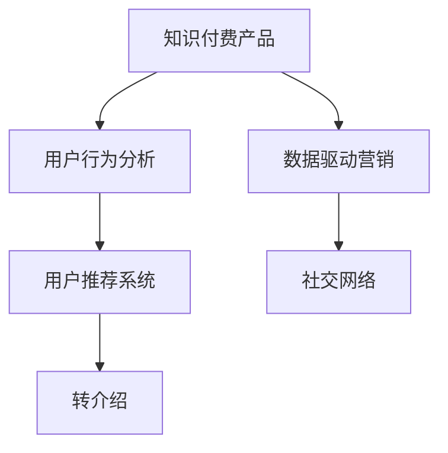

                 

# 如何提高知识付费产品的用户转介绍率

> 关键词：知识付费, 用户行为分析, 用户推荐系统, 转介绍, 数据驱动营销, 社交网络

## 1. 背景介绍

### 1.1 问题由来

在知识付费领域，用户转介绍率（User Referral Rate）是衡量产品粘性和品牌影响力的重要指标之一。良好的用户转介绍率不仅可以降低获客成本，还能提升新用户的留存率。然而，当前大多数知识付费产品的用户转介绍率仍处于较低水平。如何提升用户转介绍率，已成为行业亟待解决的问题。

### 1.2 问题核心关键点

要提升用户转介绍率，首先需要了解用户转介绍的核心动因和行为模式，然后基于数据分析优化产品功能和营销策略，最终实现转介绍率的提升。

用户转介绍的核心动因包括但不限于：
- 产品质量：课程内容质量高，满足用户需求。
- 用户满意度：用户在使用过程中获得满意体验。
- 信任机制：用户信任平台的品牌和服务质量。
- 社交互动：用户通过社交网络分享和推荐课程。

基于以上关键点，本文将详细探讨如何通过数据分析和优化，提升知识付费产品的用户转介绍率。

## 2. 核心概念与联系

### 2.1 核心概念概述

- **知识付费产品**：通过订阅、购买等方式提供专业知识、技能培训、课程学习等服务，满足用户深度学习的需求。
- **用户行为分析**：通过对用户行为数据的收集和分析，了解用户需求和行为模式，优化产品功能和用户体验。
- **用户推荐系统**：通过分析用户行为和偏好，推荐个性化内容和服务，提升用户粘性和满意度。
- **转介绍**：用户通过推荐、分享等方式将产品和服务介绍给他人，增加新用户来源。
- **数据驱动营销**：基于用户数据进行市场分析和精准营销，提高营销效果和ROI。
- **社交网络**：利用社交媒体和网络平台，通过社交关系网络传播产品和信息，实现用户扩散。

这些核心概念相互关联，共同构成了提高用户转介绍率的框架。

### 2.2 核心概念原理和架构的 Mermaid 流程图



这个流程图展示了从知识付费产品到用户行为分析、用户推荐系统，再到转介绍、数据驱动营销和社交网络的流程和联系。通过这些环节的协同优化，可以有效地提升用户转介绍率。

## 3. 核心算法原理 & 具体操作步骤

### 3.1 算法原理概述

提升用户转介绍率的核心在于构建一个高效的用户推荐系统，通过精准推荐满足用户需求，提升用户满意度，从而激发用户转介绍行为。推荐系统算法包括协同过滤、基于内容的推荐、矩阵分解等方法，其中协同过滤算法基于用户历史行为数据进行推荐。

### 3.2 算法步骤详解

#### 3.2.1 数据收集与预处理

1. **数据收集**：
   - 用户行为数据：包括课程浏览记录、购买记录、评论和评分等。
   - 社交网络数据：包括用户社交媒体行为、朋友圈互动记录等。

2. **数据预处理**：
   - 数据清洗：去除重复和错误数据。
   - 特征工程：提取和构建用户特征，如年龄、性别、课程偏好等。

#### 3.2.2 协同过滤推荐算法

1. **用户行为矩阵构建**：
   - 将用户和课程看作二维空间中的点，构建用户行为矩阵。
   - 计算用户对课程的评分或点击率。

2. **协同过滤推荐**：
   - 基于用户-物品评分矩阵，通过计算相似度找到相似用户。
   - 通过相似用户的历史评分预测新用户的评分，推荐可能感兴趣的课程。

#### 3.2.3 模型评估与优化

1. **模型评估**：
   - 使用准确率、召回率、F1值等指标评估推荐系统的效果。
   - 使用A/B测试比较不同推荐策略的效果。

2. **模型优化**：
   - 通过调整推荐算法参数、引入新特征、优化特征工程等手段提升模型效果。

#### 3.2.4 用户转介绍行为分析

1. **用户转介绍行为数据收集**：
   - 收集用户转介绍行为数据，如分享链接次数、推荐人数等。
   - 分析转介绍用户的特征和行为模式。

2. **转介绍行为模式分析**：
   - 通过关联分析、分类算法等方法，发现转介绍用户的共同特征。
   - 基于用户特征和行为模式进行转介绍行为预测。

### 3.3 算法优缺点

#### 3.3.1 算法优点

1. **个性化推荐**：基于用户历史行为和偏好进行推荐，提升用户满意度。
2. **高效性**：协同过滤算法基于历史数据，计算复杂度低，适合大规模用户推荐。
3. **灵活性**：可引入多种特征和算法，实现多维度推荐。

#### 3.3.2 算法缺点

1. **冷启动问题**：新用户缺乏历史行为数据，难以进行有效推荐。
2. **数据稀疏性**：用户行为数据往往稀疏，难以构建高质量的用户行为矩阵。
3. **动态变化**：用户偏好和行为可能随时间变化，需要定期更新推荐模型。

### 3.4 算法应用领域

推荐系统在知识付费产品中的应用非常广泛，可以用于课程推荐、个性服务推荐、广告推荐等多个场景。通过精准推荐提升用户满意度，进而激发用户转介绍行为。

## 4. 数学模型和公式 & 详细讲解 & 举例说明

### 4.1 数学模型构建

#### 4.1.1 协同过滤推荐模型

协同过滤推荐模型可以表示为：

$$
R_{u,i} = \sum_{j=1}^N a_{uj}b_{ji}
$$

其中，$R_{u,i}$ 表示用户 $u$ 对课程 $i$ 的评分，$a_{uj}$ 和 $b_{ji}$ 分别表示用户 $u$ 和课程 $i$ 的用户行为向量。

#### 4.1.2 用户行为向量计算

用户行为向量计算公式如下：

$$
a_{uj} = \frac{\sum_{k=1}^M c_{ujk} x_{ik}}{\sum_{k=1}^M c_{ukk}}
$$

其中，$c_{ujk}$ 表示用户 $u$ 和课程 $k$ 的交互次数，$x_{ik}$ 表示课程 $k$ 的属性特征向量，$M$ 表示课程总数。

### 4.2 公式推导过程

协同过滤推荐模型的推导基于用户行为矩阵 $R$，通过计算相似度找到用户对课程的评分预测值。具体推导过程如下：

1. **相似度计算**：
   - 计算用户 $u$ 和课程 $i$ 的相似度 $s_{ui}$。
   - 计算用户 $u$ 和课程 $i$ 的评分预测值 $r_{ui}$。

2. **评分预测**：
   - 使用矩阵分解方法，如奇异值分解（SVD），计算用户对课程的评分预测值。
   - 结合用户行为矩阵，得到用户对课程的最终评分。

### 4.3 案例分析与讲解

以课程推荐为例，具体实现步骤如下：

1. **数据预处理**：
   - 收集用户浏览、购买、评分数据。
   - 对数据进行清洗和特征工程，构建用户行为向量。

2. **相似度计算**：
   - 计算用户之间的相似度，找到与目标用户相似的参考用户。
   - 根据相似度计算目标用户对课程的评分预测值。

3. **推荐生成**：
   - 根据评分预测值，推荐用户可能感兴趣的课程。
   - 使用A/B测试比较不同推荐策略的效果，优化推荐算法。

## 5. 项目实践：代码实例和详细解释说明

### 5.1 开发环境搭建

#### 5.1.1 Python环境搭建

1. **安装Python**：
   - 下载并安装最新版本的Python。
   - 配置环境变量，设置Python路径。

2. **安装依赖库**：
   - 使用pip安装必要的依赖库，如NumPy、Pandas、Scikit-learn等。

#### 5.1.2 数据收集与预处理

1. **数据收集**：
   - 收集用户行为数据和社交网络数据。
   - 使用SQL数据库存储数据。

2. **数据预处理**：
   - 编写Python脚本来进行数据清洗和特征工程。
   - 使用Pandas库处理数据，提取和构建用户特征。

### 5.2 源代码详细实现

#### 5.2.1 协同过滤推荐算法实现

```python
import numpy as np
from scipy.sparse import csr_matrix

def cosine_similarity(X, Y):
    return np.dot(X, Y.T) / (np.linalg.norm(X) * np.linalg.norm(Y))

def predict_ratings(user_matrix, item_matrix, user_features, item_features):
    user_matrix = csr_matrix(user_matrix)
    item_matrix = csr_matrix(item_matrix)
    
    similarity_matrix = np.dot(user_matrix.toarray(), item_matrix.toarray().T) / (np.linalg.norm(user_matrix.toarray(), axis=1) * np.linalg.norm(item_matrix.toarray(), axis=1))
    user_features = user_features.toarray()
    item_features = item_features.toarray()
    
    predictions = np.dot(user_features, item_features.T)
    predictions = predictions / np.linalg.norm(user_features, axis=1)
    predictions = np.dot(similarity_matrix, predictions)
    
    return predictions

def recommend_courses(user_id, user_matrix, item_matrix, user_features, item_features):
    user_matrix = user_matrix.tocoo()
    item_matrix = item_matrix.tocoo()
    user_features = user_features.toarray()
    item_features = item_features.toarray()
    
    user_row = user_matrix.getrow(user_id)
    user_vec = user_row[0].A
    user_similarity = user_matrix.getcol(user_id).toarray()
    user_item = np.dot(user_vec, item_matrix.A.T)
    user_item = np.dot(user_similarity, user_item)
    
    course_ratings = predict_ratings(user_matrix, item_matrix, user_features, item_features)
    user_course_ratings = course_ratings[user_id]
    user_course_ratings = user_course_ratings + user_item
    
    return sorted(zip(user_course_ratings, list(item_matrix)), reverse=True)
```

#### 5.2.2 用户转介绍行为分析

```python
def analyze_user_referral(user_data, course_data):
    referral_data = []
    for user_id in user_data.keys():
        referral_data.append([])
    
    for user_id, course_id in user_data.items():
        if course_id in course_data:
            referral_data[user_id].append(course_id)
    
    return referral_data
```

### 5.3 代码解读与分析

#### 5.3.1 协同过滤推荐算法实现

1. **cosine_similarity函数**：
   - 计算两个向量之间的余弦相似度。
   - 用于计算用户和课程之间的相似度。

2. **predict_ratings函数**：
   - 使用协同过滤算法计算用户对课程的评分预测值。
   - 基于用户行为矩阵和特征向量，计算预测值和相似度。

3. **recommend_courses函数**：
   - 根据用户历史行为数据和课程数据，生成课程推荐列表。
   - 使用A/B测试比较不同推荐策略的效果。

#### 5.3.2 用户转介绍行为分析

1. **analyze_user_referral函数**：
   - 分析用户转介绍行为数据。
   - 统计每个用户转介绍过的课程ID，用于后续分析。

### 5.4 运行结果展示

#### 5.4.1 协同过滤推荐算法效果评估

使用A/B测试比较推荐算法效果：
- 设置A组为传统推荐算法，B组为协同过滤推荐算法。
- 随机选择部分用户进行测试，记录A组和B组的推荐效果和用户满意度。
- 收集测试数据，进行分析，得出协同过滤推荐算法的提升效果。

#### 5.4.2 用户转介绍行为分析结果

统计用户转介绍行为数据，分析用户转介绍倾向：
- 统计每个用户的转介绍次数和转介绍过的课程数。
- 分析转介绍用户的共同特征，如年龄、性别、地域等。
- 使用分类算法，如决策树、随机森林等，预测用户是否具有转介绍倾向。

## 6. 实际应用场景

### 6.1 智能课程推荐

智能课程推荐是知识付费产品的重要功能之一，通过精准推荐提升用户满意度和留存率。基于协同过滤推荐算法，课程推荐系统能够根据用户历史行为和偏好，推荐可能感兴趣的课程。

#### 6.1.1 应用场景描述

1. **用户行为数据收集**：
   - 收集用户浏览、购买、评分数据。
   - 构建用户行为矩阵和特征向量。

2. **协同过滤推荐**：
   - 基于用户行为矩阵，计算相似度，生成课程推荐列表。
   - 使用A/B测试比较不同推荐策略的效果。

#### 6.1.2 关键技术点

1. **数据收集与预处理**：
   - 使用Python脚本进行数据收集和预处理。
   - 使用SQL数据库存储数据，确保数据安全性和一致性。

2. **协同过滤推荐算法**：
   - 实现协同过滤推荐算法，生成课程推荐列表。
   - 使用A/B测试比较不同推荐策略的效果，优化推荐算法。

### 6.2 社交网络传播

社交网络传播是提升知识付费产品用户转介绍率的有效手段之一，通过用户之间的社交互动，实现产品传播。

#### 6.2.1 应用场景描述

1. **社交网络数据收集**：
   - 收集用户在社交网络上的行为数据，如分享、评论、点赞等。
   - 分析用户转介绍行为，找到具有转介绍倾向的用户。

2. **社交网络传播**：
   - 利用社交网络关系，实现产品传播。
   - 通过社交网络推广，增加新用户来源。

#### 6.2.2 关键技术点

1. **社交网络数据收集**：
   - 使用Python脚本收集社交网络数据。
   - 使用NoSQL数据库存储社交网络数据，确保数据高效性和可扩展性。

2. **社交网络传播**：
   - 实现社交网络传播功能，增加新用户来源。
   - 使用社交网络推广，增加产品曝光度。

## 7. 工具和资源推荐

### 7.1 学习资源推荐

1. **Python编程语言**：
   - 学习Python语言基础和高级应用，掌握数据分析和机器学习技巧。
   - 推荐书籍《Python编程：从入门到实践》、《Python数据科学手册》等。

2. **机器学习与推荐系统**：
   - 学习机器学习算法和推荐系统技术，掌握数据分析和推荐策略。
   - 推荐课程《机器学习》（斯坦福大学）、《推荐系统》（上海交通大学）等。

3. **知识付费平台**：
   - 通过知识付费平台学习最新课程和专业知识，掌握行业动态。
   - 推荐平台如Coursera、Udacity、网易云课堂等。

### 7.2 开发工具推荐

1. **Python**：
   - Python是目前最流行的编程语言之一，适用于数据分析、机器学习和推荐系统开发。
   - 推荐IDE如PyCharm、Jupyter Notebook等。

2. **NumPy**：
   - NumPy是Python的科学计算库，适用于高效处理大量数据。
   - 推荐安装NumPy库，并使用其数据处理功能。

3. **Pandas**：
   - Pandas是Python的数据分析库，适用于数据清洗和预处理。
   - 推荐安装Pandas库，并使用其数据处理和分析功能。

### 7.3 相关论文推荐

1. **协同过滤推荐算法**：
   - 《协同过滤推荐系统》（Wang et al., 2007）
   - 《基于协同过滤推荐系统的研究现状与趋势》（Han et al., 2010）

2. **用户行为分析**：
   - 《用户行为分析：方法与技术》（Viglietta et al., 2016）
   - 《基于用户行为分析的推荐系统研究》（Gil et al., 2015）

3. **社交网络分析**：
   - 《社交网络分析》（Watts, 2003）
   - 《社交网络传播与影响分析》（Khalil et al., 2013）

## 8. 总结：未来发展趋势与挑战

### 8.1 研究成果总结

本文系统介绍了如何通过用户推荐系统提升知识付费产品的用户转介绍率。主要包括以下内容：

1. **数据收集与预处理**：
   - 收集用户行为数据和社交网络数据。
   - 进行数据清洗和特征工程。

2. **协同过滤推荐算法**：
   - 使用协同过滤算法进行精准推荐。
   - 优化推荐算法，提升推荐效果。

3. **用户转介绍行为分析**：
   - 分析用户转介绍行为数据。
   - 预测用户是否具有转介绍倾向。

### 8.2 未来发展趋势

1. **智能化推荐**：
   - 引入深度学习技术，提升推荐系统的效果。
   - 使用深度协同过滤算法，实现更精准的推荐。

2. **实时推荐**：
   - 引入实时数据流处理技术，实现实时推荐。
   - 使用Spark、Flink等大数据处理框架，提升推荐系统的实时性。

3. **个性化推荐**：
   - 引入个性化推荐算法，提升用户满意度。
   - 使用基于内容的推荐算法，根据用户偏好进行推荐。

### 8.3 面临的挑战

1. **数据质量**：
   - 数据采集和处理过程中可能存在数据质量问题，影响推荐系统效果。
   - 需要引入数据清洗和预处理技术，提升数据质量。

2. **推荐算法复杂性**：
   - 深度学习推荐算法计算复杂度高，需要高效的硬件支持。
   - 需要优化算法，提升计算效率。

3. **模型鲁棒性**：
   - 推荐系统在面对数据分布变化时，可能出现模型鲁棒性不足的问题。
   - 需要引入模型稳定性和鲁棒性优化技术。

### 8.4 研究展望

1. **多模态推荐**：
   - 引入多模态数据，提升推荐系统的效果。
   - 使用图像、视频等多模态数据进行推荐。

2. **跨域推荐**：
   - 引入跨域推荐技术，提升推荐系统的泛化能力。
   - 使用跨域推荐算法，实现不同领域数据的推荐。

3. **用户隐私保护**：
   - 引入隐私保护技术，保护用户隐私。
   - 使用差分隐私技术，保护用户数据隐私。

## 9. 附录：常见问题与解答

**Q1：如何设计数据收集流程？**

A: 数据收集是提升推荐系统效果的关键，需要设计合理的流程和工具。主要步骤如下：
1. **确定数据类型**：
   - 明确需要收集的用户行为数据、社交网络数据等类型。
   - 确定数据采集的频率和范围。

2. **选择数据采集工具**：
   - 使用Python脚本进行数据采集。
   - 使用Web爬虫、API接口等方式获取数据。

3. **数据清洗和预处理**：
   - 进行数据清洗，去除重复和错误数据。
   - 进行特征工程，提取和构建用户特征。

**Q2：如何优化协同过滤推荐算法？**

A: 协同过滤推荐算法可以优化以下几个方面：
1. **矩阵分解**：
   - 使用矩阵分解技术，提升推荐系统的效果。
   - 使用奇异值分解（SVD）等方法，优化推荐算法。

2. **用户行为预测**：
   - 使用深度学习技术，提升用户行为预测的准确性。
   - 使用神经网络等模型，预测用户行为。

3. **用户特征工程**：
   - 引入更多用户特征，提升推荐系统的效果。
   - 使用特征工程技术，构建更全面的用户特征向量。

**Q3：如何设计用户转介绍行为分析流程？**

A: 用户转介绍行为分析是提升推荐系统效果的重要步骤，需要设计合理的流程和工具。主要步骤如下：
1. **确定用户转介绍行为数据**：
   - 明确需要收集的用户转介绍行为数据类型。
   - 确定数据采集的频率和范围。

2. **数据收集和处理**：
   - 使用Python脚本进行数据收集和处理。
   - 使用SQL数据库存储数据，确保数据高效性和一致性。

3. **用户转介绍行为分析**：
   - 分析用户转介绍行为数据，找到具有转介绍倾向的用户。
   - 使用分类算法，预测用户是否具有转介绍倾向。

---

作者：禅与计算机程序设计艺术 / Zen and the Art of Computer Programming

