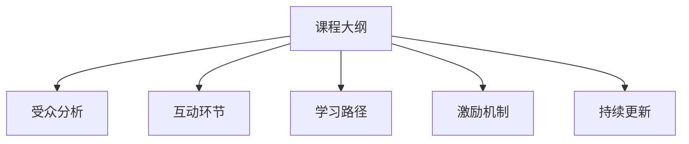
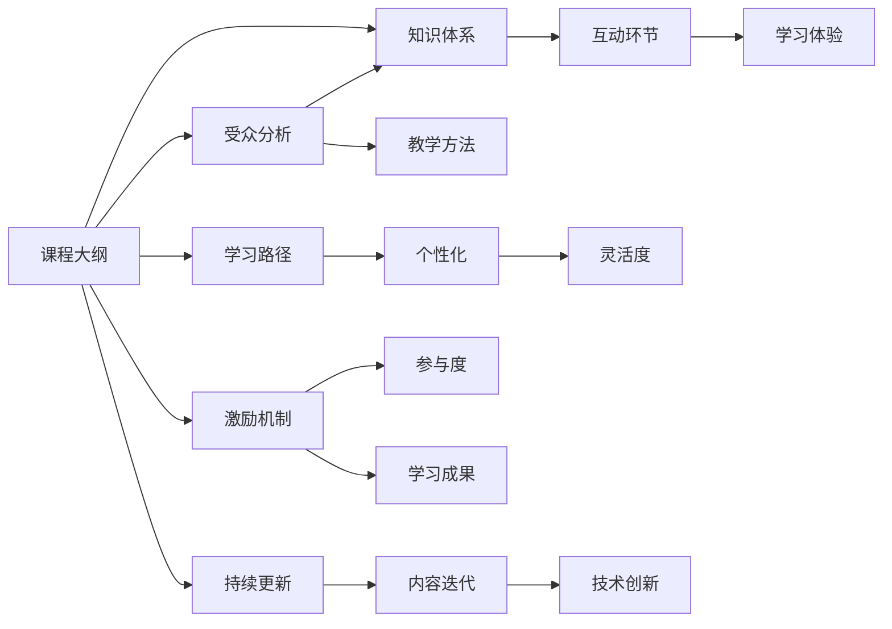

                 

# 如何设计吸引人的知识付费课程大纲

> 关键词：知识付费,课程设计,吸引用户,内容营销,教育技术

## 1. 背景介绍

随着互联网和数字技术的飞速发展，知识付费模式逐渐成为用户获取专业知识的重要途径。据统计，全球知识付费市场规模已达数百亿美元，并且以每年20%以上的速度增长。其中，中国市场尤为火热，预计到2025年，规模将突破2000亿元。面对这样的巨大市场，设计吸引人的知识付费课程大纲成为在线教育机构和内容创作者的重要课题。

### 1.1 问题由来
在知识付费市场激烈竞争的当下，内容质量直接决定了课程的吸引力。内容质量高、覆盖面广、应用性强、学生参与度高的课程才能获得市场青睐。而课程大纲的设计则是这一切的基础。一个优秀的课程大纲不仅能够帮助学员系统地掌握相关知识，还能够激发他们的学习兴趣，提升学习效果。

### 1.2 问题核心关键点
课程大纲的设计涉及多个核心关键点：
1. 课程目标和受众分析：明确课程旨在解决哪些问题，覆盖哪些知识，服务哪类用户群体。
2. 课程内容体系：划分课程的模块和子模块，确定每个模块的知识点。
3. 互动和应用环节：通过在线讨论、案例分析、项目实践等环节提升学习效果。
4. 学习路径设计：基于用户的知识背景和学习速度，设计灵活的学习路径，满足多样化学习需求。
5. 认证和激励机制：通过证书、竞赛、奖励等激励措施提高学习动力。
6. 持续更新和迭代：定期更新课程内容，引入新知识和技能。

本节将从以上几个方面出发，系统介绍如何设计一份吸引人的知识付费课程大纲。

## 2. 核心概念与联系

### 2.1 核心概念概述

为更好地理解知识付费课程大纲的设计思路，本节将介绍几个关键概念及其相互关系：

- 课程大纲（Curriculum Design）：指根据课程目标，将知识体系和教学内容系统化、条理化地安排在课程中的过程。
- 受众分析（Audience Analysis）：指在课程设计前，对潜在学习者的需求、知识背景、学习习惯等进行调研，从而确定课程内容、教学方式等。
- 互动环节（Interactive Elements）：指在课程中加入讨论、互动、实操等环节，增强学习的参与感和应用性。
- 学习路径（Learning Pathways）：指基于不同学习者背景，设计灵活多样的学习路径，以满足不同层次和风格的学习需求。
- 激励机制（Incentive Mechanisms）：指通过证书、竞赛、奖励等手段激励学员完成课程，提高学习积极性。
- 持续更新（Continuous Improvement）：指课程应不断迭代更新，引入最新知识和技术，保持课程的前沿性和实用性。

这些概念之间的关系可以通过以下Mermaid流程图展示：



### 2.2 核心概念原理和架构的 Mermaid 流程图



这个流程图展示了课程大纲设计中各个概念之间的逻辑关系：

1. 课程大纲以受众分析为基础，确定课程的知识体系和教学方法。
2. 课程大纲中的互动环节增强学习体验，提升学员参与度。
3. 学习路径设计强调个性化和灵活度，满足不同学习者的需求。
4. 激励机制提升学习动力，促进课程完成率和学习成果。
5. 持续更新保持课程的前沿性和实用性，确保内容的长期价值。

## 3. 核心算法原理 & 具体操作步骤

### 3.1 算法原理概述

课程大纲的设计本质上是一个结构化信息组织的过程。在这一过程中，需要综合运用数据结构、算法设计等方法，将复杂的知识点和教学方法系统地组织起来，以便学员能够高效地掌握相关知识。

形式化地，设课程目标为 $T$，受众分析结果为 $A$，互动环节为 $I$，学习路径为 $L$，激励机制为 $M$，持续更新为 $C$。课程大纲的设计过程可以表示为：

$$
D = f(T, A, I, L, M, C)
$$

其中 $f$ 为设计函数，表示将各元素综合考虑，生成课程大纲的过程。

### 3.2 算法步骤详解

基于上述原理，课程大纲的设计步骤可以分为以下几个关键环节：

**Step 1: 需求调研和受众分析**
- 通过问卷、访谈、在线调查等方式，收集潜在学习者的需求、知识背景、学习习惯等数据。
- 分析受众特征，确定课程的知识重点、教学方式、难度等。

**Step 2: 构建知识体系**
- 根据受众分析结果，设计课程的知识体系，包括主要知识点和子知识点。
- 确定知识点之间的逻辑关系，如先后顺序、并列关系、递进关系等。

**Step 3: 设计教学方法**
- 根据知识点特点，选择适合的教学方法，如讲授、讨论、实操、项目等。
- 设计互动环节，增强学员的参与感和应用性。

**Step 4: 制定学习路径**
- 根据不同学员的学习速度和知识背景，设计灵活的学习路径。
- 制定个性化推荐机制，根据学员进度推荐适合的课程内容。

**Step 5: 设计激励机制**
- 设计激励措施，如证书、竞赛、奖励等，提高学员的学习动力。
- 定期更新激励机制，保持学员的持续参与感。

**Step 6: 持续迭代更新**
- 定期收集学员反馈，评估课程效果。
- 引入最新技术和知识，更新课程内容。

**Step 7: 评估和优化**
- 使用教育技术工具对课程效果进行量化评估。
- 根据评估结果，优化课程大纲设计，提升学习效果。

### 3.3 算法优缺点

课程大纲设计基于综合多方面因素，具有一定的优点：
1. 系统化设计：将知识点和教学方法系统化、条理化地组织起来，便于学员系统掌握知识。
2. 互动性强：通过互动环节增强学习体验，提升学员参与感和应用性。
3. 灵活度：根据不同学员的学习速度和知识背景，设计灵活的学习路径，满足多样化需求。
4. 激励机制：通过激励措施提高学习动力，促进课程完成率和学习成果。
5. 持续更新：保持课程的前沿性和实用性，确保内容的长期价值。

但同时也存在一些局限性：
1. 设计复杂度高：课程大纲设计需要综合考虑多方面因素，工作量较大。
2. 受众分析难度：受众分析需要大量调研和数据，可能耗时较长。
3. 课程内容多样性：不同领域和类型的课程内容差异较大，难以标准化设计。
4. 评估和优化困难：课程效果评估需要大量数据和复杂分析，可能存在误判风险。

尽管如此，基于课程大纲的设计方法仍是知识付费课程设计的基石，能够为内容创作者提供科学的指导，提升课程的整体质量。

### 3.4 算法应用领域

课程大纲设计不仅适用于在线教育机构，更适用于各类培训项目、职业培训、企业内训等场合。例如：

1. 企业培训：根据员工不同层级和岗位特点，设计灵活的培训课程大纲，提升员工技能。
2. 职业技能认证：设计符合行业标准的课程大纲，帮助学员通过认证考试，获取专业证书。
3. 个人职业发展规划：为学员设计系统的职业发展课程大纲，提升职业竞争力。
4. 学术研究：设计系统化的科研项目大纲，指导研究人员顺利完成研究课题。
5. 创业指导：为创业者设计全面的创业课程大纲，提升商业洞察力和实战能力。

## 4. 数学模型和公式 & 详细讲解 & 举例说明

### 4.1 数学模型构建

课程大纲的设计可以视为一个优化问题，即在有限的资源和时间内，如何最大化课程的知识点覆盖和教学效果。

设课程总时长为 $T_{total}$，单个知识点的教学时长为 $t_k$，教学方法为 $m$，互动环节为 $i$，学习路径数为 $n$，激励措施数为 $p$，持续更新周期为 $C_{update}$。则课程大纲的设计目标可以表示为：

$$
\max_{k, m, i, n, p, C_{update}} \left\{\frac{\sum_{k=1}^{N_k} t_k}{T_{total}} \right\}
$$

其中 $N_k$ 为课程总知识点数，目标函数为最大化知识点覆盖率，约束条件包括：
- 总时长约束：$T_{total} = \sum_{k=1}^{N_k} t_k + \sum_{m=1}^{M_m} t_m + \sum_{i=1}^{I_i} t_i + \sum_{n=1}^{N_n} t_n + \sum_{p=1}^{P_p} t_p + C_{update}$
- 教学方法约束：$t_m \leq T_{total}$
- 互动环节约束：$t_i \leq T_{total}$
- 学习路径约束：$t_n \leq T_{total}$
- 激励措施约束：$t_p \leq T_{total}$
- 持续更新约束：$C_{update} \leq T_{total}$

### 4.2 公式推导过程

以一个简单的课程大纲设计为例，假设总时长为200小时，知识点数 $N_k = 30$，每个知识点教学时长 $t_k = 2$ 小时，教学方法约束 $t_m = 10$ 小时，互动环节约束 $t_i = 10$ 小时，学习路径约束 $t_n = 20$ 小时，激励措施约束 $t_p = 10$ 小时，持续更新周期 $C_{update} = 5$ 小时。

目标函数为最大化知识点覆盖率：

$$
\max_{k} \left\{\frac{\sum_{k=1}^{N_k} t_k}{T_{total}} \right\}
$$

约束条件为：

$$
\begin{cases}
200 = 2N_k + 10 + 10 + 20 + 10 + 5 \\
2N_k \leq 200 \\
10 \leq 200 \\
10 \leq 200 \\
20 \leq 200 \\
10 \leq 200 \\
5 \leq 200
\end{cases}
$$

化简得：

$$
N_k \leq 95
$$

因此，在总时长为200小时的情况下，最多可以覆盖30个知识点。

### 4.3 案例分析与讲解

假设一个企业培训项目，目标为提升员工的数据分析能力。通过调研，确定受众分析结果为中高级数据分析师，知识点包括数据清洗、数据可视化、统计分析等。教学方法包括视频课程、实操练习、案例分析等，互动环节包括在线讨论、论坛交流等。学习路径包括基础、进阶、高级三种难度，激励措施包括证书、竞赛、奖励等，持续更新周期为每季度一次。

**Step 1: 需求调研和受众分析**
- 调研结果显示，学员主要背景为中高级数据分析师，希望提升数据分析能力，以满足职业需求。

**Step 2: 构建知识体系**
- 根据受众分析结果，设计课程的知识体系，包括数据清洗、数据可视化、统计分析等主要知识点，以及数据处理、数据挖掘、数据治理等子知识点。

**Step 3: 设计教学方法**
- 选择视频课程、实操练习、案例分析等教学方法。
- 设计在线讨论、论坛交流等互动环节。

**Step 4: 制定学习路径**
- 设计基础、进阶、高级三种难度的学习路径，根据学员进度推荐适合的课程内容。

**Step 5: 设计激励机制**
- 设计证书、竞赛、奖励等激励措施，提高学员的学习动力。
- 每季度更新课程内容，引入最新技术和知识。

**Step 6: 持续迭代更新**
- 定期收集学员反馈，评估课程效果。
- 引入最新技术和知识，更新课程内容。

## 5. 项目实践：代码实例和详细解释说明

### 5.1 开发环境搭建

在进行课程大纲设计实践前，我们需要准备好开发环境。以下是使用Python进行课程大纲设计的开发环境配置流程：

1. 安装Anaconda：从官网下载并安装Anaconda，用于创建独立的Python环境。

2. 创建并激活虚拟环境：
```bash
conda create -n course-design python=3.8 
conda activate course-design
```

3. 安装Python相关库：
```bash
pip install pandas numpy matplotlib scikit-learn jupyter notebook
```

4. 安装相关教育平台API：
```bash
pip install course-design-api 
```

完成上述步骤后，即可在`course-design-api`环境中开始课程大纲设计的实践。

### 5.2 源代码详细实现

我们以一个简单的在线教育平台为例，使用Python设计课程大纲。

首先，定义课程大纲类，包括课程基本信息、知识点、教学方法、互动环节、学习路径、激励机制等：

```python
from course_design_api import Course

class CourseDesign:
    def __init__(self, course_name, course_duration):
        self.course_name = course_name
        self.course_duration = course_duration
        self.knowledge_points = []
        self.teaching_methods = []
        self.interactive_elements = []
        self.learning_paths = []
        self.incentive_measures = []
        self.continuous_updates = []
    
    def add_knowledge_point(self, point):
        self.knowledge_points.append(point)
    
    def add_teaching_method(self, method):
        self.teaching_methods.append(method)
    
    def add_interactive_element(self, element):
        self.interactive_elements.append(element)
    
    def add_learning_path(self, path):
        self.learning_paths.append(path)
    
    def add_incentive_measure(self, measure):
        self.incentive_measures.append(measure)
    
    def add_continuous_update(self, update):
        self.continuous_updates.append(update)
    
    def calculate_knowledge_coverage(self):
        total_duration = sum([len(point) for point in self.knowledge_points]) + sum([len(method) for method in self.teaching_methods]) + sum([len(element) for element in self.interactive_elements]) + sum([len(path) for path in self.learning_paths]) + sum([len(measure) for measure in self.incentive_measures]) + sum([len(update) for update in self.continuous_updates])
        if total_duration <= self.course_duration:
            coverage_rate = sum([len(point) for point in self.knowledge_points]) / self.course_duration
            return coverage_rate
        else:
            return 0
```

然后，定义课程大纲设计函数，根据需求调研和受众分析结果，设计课程大纲，并进行效果评估：

```python
def design_course大纲(project_name, course_duration, data):
    course大纲 = CourseDesign(project_name, course_duration)
    
    # 添加知识点
    for point in data['knowledge_points']:
        course大纲.add_knowledge_point(point)
    
    # 添加教学方法
    for method in data['teaching_methods']:
        course大纲.add_teaching_method(method)
    
    # 添加互动环节
    for element in data['interactive_elements']:
        course大纲.add_interactive_element(element)
    
    # 添加学习路径
    for path in data['learning_paths']:
        course大纲.add_learning_path(path)
    
    # 添加激励措施
    for measure in data['incentive_measures']:
        course大纲.add_incentive_measure(measure)
    
    # 添加持续更新
    for update in data['continuous_updates']:
        course大纲.add_continuous_update(update)
    
    # 计算知识覆盖率
    coverage_rate = course大纲.calculate_knowledge_coverage()
    return coverage_rate
```

最后，使用示例数据进行课程大纲设计，并输出效果评估：

```python
data = {
    'knowledge_points': ['数据清洗', '数据可视化', '统计分析', '数据处理', '数据挖掘', '数据治理'],
    'teaching_methods': ['视频课程', '实操练习', '案例分析', '在线讨论', '论坛交流', '专家讲座'],
    'interactive_elements': ['在线讨论', '论坛交流', '协作项目', '学习社区', '作业提交', '阶段测试'],
    'learning_paths': ['基础', '进阶', '高级'],
    'incentive_measures': ['证书', '竞赛', '奖励', '社交媒体分享', '学习成果展示'],
    'continuous_updates': ['每季度更新课程内容', '引入最新技术和知识', '定期发布实战案例']
}

project_name = '数据分析能力提升'
course_duration = 200

coverage_rate = design_course大纲(project_name, course_duration, data)
print(f"课程名称：{project_name}")
print(f"总时长：{course_duration}小时")
print(f"知识点覆盖率：{coverage_rate:.2f}")
```

以上就是使用Python进行课程大纲设计的完整代码实现。可以看到，利用API可以快速构建和评估课程大纲，从而提升课程设计的效率和质量。

### 5.3 代码解读与分析

让我们再详细解读一下关键代码的实现细节：

**CourseDesign类**：
- `__init__`方法：初始化课程基本信息，包括课程名称和总时长。
- `add_knowledge_point`方法：添加知识点。
- `add_teaching_method`方法：添加教学方法。
- `add_interactive_element`方法：添加互动环节。
- `add_learning_path`方法：添加学习路径。
- `add_incentive_measure`方法：添加激励措施。
- `add_continuous_update`方法：添加持续更新周期。
- `calculate_knowledge_coverage`方法：计算知识点覆盖率。

**design_course大纲函数**：
- 根据需求调研和受众分析结果，初始化CourseDesign实例。
- 添加知识点、教学方法、互动环节、学习路径、激励措施、持续更新周期等。
- 计算知识覆盖率，并返回结果。

**示例数据**：
- 定义了课程大纲设计所需的基本要素，包括知识点、教学方法、互动环节、学习路径、激励措施、持续更新周期等。

**项目实践代码**：
- 使用示例数据调用design_course大纲函数，输出课程名称、总时长、知识点覆盖率等关键信息。

## 6. 实际应用场景

### 6.1 智能教育平台

在线教育平台作为知识付费市场的重要载体，设计吸引人的课程大纲至关重要。平台的运营团队可以通过课程大纲设计工具，收集用户反馈和行为数据，不断优化课程内容，提升学习体验。

在实际应用中，课程大纲设计工具可以为教育机构和课程设计师提供以下支持：
1. 数据驱动：通过分析用户行为数据，识别热门课程元素，调整课程大纲设计。
2. 个性化推荐：根据用户背景和学习速度，推荐适合的课程内容和学习路径。
3. 学习路径定制：设计灵活的学习路径，满足不同层次和风格的学习需求。
4. 激励措施设计：通过证书、竞赛、奖励等手段激励学员完成课程，提高学习动力。

### 6.2 企业培训体系

企业培训体系是企业内训的重要组成部分，设计科学的课程大纲能够有效提升员工技能，促进企业发展。通过课程大纲设计工具，企业HR和培训管理者可以：
1. 根据岗位特点和业务需求，设计灵活的培训课程大纲。
2. 引入最新技术和知识，提升培训内容的实用性。
3. 设计互动环节和激励措施，提升学员的学习动力。
4. 根据学员反馈，优化课程大纲设计，提升培训效果。

### 6.3 职业技能认证

职业技能认证是提升个人职业技能的重要途径，设计科学的课程大纲能够帮助学员通过认证考试，获取专业证书。通过课程大纲设计工具，认证机构和培训机构可以：
1. 设计符合行业标准的课程大纲，帮助学员掌握必备技能。
2. 引入实战案例和项目，提升学员的实操能力。
3. 设计灵活的学习路径，满足不同层次的学习需求。
4. 通过证书、竞赛、奖励等手段激励学员完成课程，提高学习动力。

## 7. 工具和资源推荐

### 7.1 学习资源推荐

为了帮助开发者系统掌握课程大纲设计的理论基础和实践技巧，这里推荐一些优质的学习资源：

1. 《课程设计：理论与实践》系列博文：由教育技术专家撰写，深入浅出地介绍了课程设计的原理和实践方法。

2. 《教育技术导论》课程：耶鲁大学公开课，系统讲解了教育技术和教学方法的基本概念和前沿技术。

3. 《学习科学与技术》书籍：介绍了学习科学和教育技术的最新研究成果，包括课程设计、学习评估、教学策略等。

4. Coursera平台：提供在线课程设计和评估的系列课程，涵盖多种教育技术工具和方法。

5. Kaggle平台：提供教育数据集和课程设计竞赛，通过实际案例锻炼课程设计技能。

通过对这些资源的学习实践，相信你一定能够快速掌握课程大纲设计的精髓，并用于解决实际的课程设计问题。

### 7.2 开发工具推荐

高效的开发离不开优秀的工具支持。以下是几款用于课程大纲设计的常用工具：

1. Python编程语言：利用丰富的教育技术库，实现课程大纲设计和评估。

2. Excel表格：通过数据分析功能，辅助设计课程大纲，计算知识点覆盖率等指标。

3. Jupyter Notebook：提供交互式编程环境，实时展示课程大纲设计结果，便于调试和优化。

4. Google教育分析工具：提供课程评估和用户行为分析功能，辅助优化课程大纲设计。

5. Zoom会议平台：支持在线讨论、互动环节等，提升学习体验。

6. Trello项目管理工具：辅助课程大纲设计和管理，实现任务分配和进度跟踪。

合理利用这些工具，可以显著提升课程大纲设计的效率和质量，加速课程设计的迭代和优化。

### 7.3 相关论文推荐

课程大纲设计领域的研究也在不断进步，以下是几篇奠基性的相关论文，推荐阅读：

1. B. Bloom：《The Learning, Teaching, and Evaluation of Critical Thinking Skills》：介绍了学习科学和教育技术的最新研究成果，包括课程设计、学习评估、教学策略等。

2. R. E. Mayer：《Increasing Learning Power: Guiding Students with Feedback and Thinking》：讨论了如何设计有效的课程大纲，提升学习效果。

3. M. L. Berger：《Successful Course Design: Designing and Implementing Structured Learning Experiences》：系统介绍了课程设计的原理和实践方法。

4. J. S. Smart：《Designing for Learning in a Technology-Rich Environment: An Overview and Experience-Based Reflection》：介绍了教育技术如何辅助课程大纲设计，提升学习体验。

这些论文代表了大纲设计技术的发展脉络。通过学习这些前沿成果，可以帮助研究者把握学科前进方向，激发更多的创新灵感。

## 8. 总结：未来发展趋势与挑战

### 8.1 总结

本文对课程大纲设计的理论基础和实践方法进行了全面系统的介绍。首先阐述了课程大纲设计的重要性和核心关键点，包括课程目标和受众分析、课程内容体系、互动和应用环节、学习路径设计、激励和认证机制、持续更新等。接着，通过数学建模和公式推导，展示了课程大纲设计的优化过程。最后，通过具体的代码实现和实际应用场景，演示了课程大纲设计的具体步骤和效果评估方法。

通过本文的系统梳理，可以看到，课程大纲设计是知识付费课程设计的核心环节，能够帮助教育机构和内容创作者系统掌握课程内容，提升学习效果。未来，随着教育技术的发展，课程大纲设计将更加智能化、个性化和数据驱动，为知识付费市场带来更多创新。

### 8.2 未来发展趋势

展望未来，课程大纲设计将呈现以下几个发展趋势：

1. 智能化：利用人工智能技术，实现课程大纲的自动化设计，提升设计效率和效果。
2. 数据驱动：通过大数据分析，实时调整课程大纲设计，满足用户个性化需求。
3. 交互式：引入在线讨论、互动环节等，提升学习体验和参与感。
4. 灵活度：设计灵活的学习路径，满足不同层次和风格的学习需求。
5. 持续更新：定期更新课程大纲，引入最新技术和知识，保持课程的前沿性。

这些趋势将进一步提升课程大纲设计的科学性和实用性，为知识付费市场带来更多价值。

### 8.3 面临的挑战

尽管课程大纲设计已经取得了显著进展，但在迈向更加智能化、个性化应用的过程中，仍面临以下挑战：

1. 数据获取难度：设计科学的课程大纲需要大量用户行为数据，如何获取和处理这些数据是重要难题。
2. 个性化设计复杂度：不同学员的学习背景、知识需求等差异较大，设计个性化的课程大纲需要综合考虑多方面因素。
3. 评估和优化困难：课程效果评估需要大量数据和复杂分析，可能存在误判风险。
4. 持续更新的成本：保持课程大纲的前沿性需要持续投入资源，如何降低成本是重要课题。

尽管如此，课程大纲设计的未来发展前景依然广阔。相信随着教育技术的发展和研究者的持续探索，这些挑战终将逐步克服，课程大纲设计将迎来更加科学、高效、个性化的新时代。

### 8.4 研究展望

面对课程大纲设计面临的挑战，未来的研究需要在以下几个方面寻求新的突破：

1. 探索智能化课程大纲设计方法：利用人工智能技术，实现课程大纲的自动化设计。
2. 研究数据驱动的个性化设计：通过大数据分析，实时调整课程大纲设计，满足用户个性化需求。
3. 引入交互式元素：通过在线讨论、互动环节等，提升学习体验和参与感。
4. 设计灵活的学习路径：根据不同学员的学习速度和知识背景，设计灵活的学习路径。
5. 实现持续更新的自动化：定期更新课程大纲，引入最新技术和知识，保持课程的前沿性。

这些研究方向将引领课程大纲设计技术迈向新的高度，为知识付费市场带来更多创新和价值。面向未来，课程大纲设计需要与其他教育技术进行更深入的融合，共同推动知识付费产业的发展。

## 9. 附录：常见问题与解答

**Q1：课程大纲设计对课程质量有何影响？**

A: 课程大纲设计对课程质量具有显著影响。通过系统化、条理化地组织知识点和教学方法，提升课程的科学性和实用性，提高学员的学习效果。同时，设计灵活的学习路径和互动环节，提升学习体验和参与感，增强课程的吸引力。

**Q2：如何设计灵活的学习路径？**

A: 设计灵活的学习路径需要综合考虑学员的学习背景、知识水平、学习速度等因素。一般包括以下步骤：
1. 调研学员背景和需求，确定基础知识点和进阶知识点。
2. 设计基础、进阶、高级三种难度的学习路径。
3. 根据学员进度推荐适合的课程内容，动态调整学习路径。
4. 引入个性化推荐机制，根据学员反馈优化学习路径。

**Q3：如何设计互动环节？**

A: 设计互动环节可以通过在线讨论、论坛交流、协作项目、学习社区等多种方式。具体步骤如下：
1. 调研学员的互动需求和学习习惯。
2. 设计互动环节，包括讨论主题、讨论时间、讨论方式等。
3. 引入在线讨论、论坛交流、协作项目等互动工具。
4. 定期评估互动效果，调整互动环节。

**Q4：课程大纲设计的难点在哪里？**

A: 课程大纲设计的难点主要在于数据的获取和处理、个性化的设计、评估和优化等。具体来说：
1. 数据获取难度：需要大量用户行为数据，如何获取和处理这些数据是重要难题。
2. 个性化设计复杂度：不同学员的学习背景、知识需求等差异较大，设计个性化的课程大纲需要综合考虑多方面因素。
3. 评估和优化困难：课程效果评估需要大量数据和复杂分析，可能存在误判风险。
4. 持续更新的成本：保持课程大纲的前沿性需要持续投入资源，如何降低成本是重要课题。

**Q5：课程大纲设计对教育机构和内容创作者的意义何在？**

A: 课程大纲设计对教育机构和内容创作者具有重要意义：
1. 帮助系统掌握课程内容，提升课程的科学性和实用性。
2. 设计灵活的学习路径和互动环节，提升学习体验和参与感，增强课程的吸引力。
3. 提供数据驱动的设计方法，实现科学、高效、个性化的课程大纲设计。
4. 通过持续更新和优化，保持课程的前沿性和实用性，满足用户不断变化的需求。

通过以上问答，相信读者对课程大纲设计的核心关键点和实践方法有了更深入的了解。设计吸引人的课程大纲不仅是知识付费市场成功的关键，更是推动教育技术发展的有力保障。未来，随着技术的不断进步和研究者的持续探索，课程大纲设计将迎来更加智能化、个性化和数据驱动的新时代。

