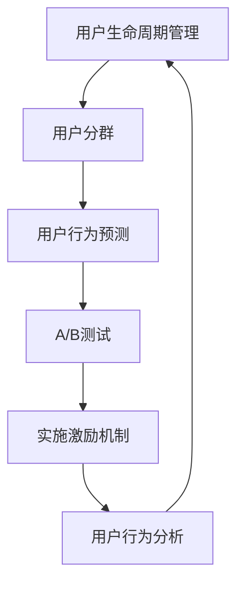

                 

# 如何设计有效的知识付费用户激励机制

在知识付费领域，如何吸引用户持续消费，提高平台黏性，是平台管理者需要深入探讨的问题。用户激励机制作为吸引用户的关键手段，设计合理与否直接关系到知识付费平台的用户留存和转化效果。本文将从用户激励机制的原理、步骤、实施、未来发展趋势和面临的挑战等方面进行详细阐述，以期为知识付费平台的运营提供参考。

## 1. 背景介绍

### 1.1 问题由来

随着互联网技术的发展，知识付费逐渐成为一种重要的内容消费形式。用户可以通过购买内容，获得更深度、更有价值的学习资源。然而，如何持续吸引用户消费，维持平台的稳定发展，成为知识付费平台面临的一个重要挑战。

研究表明，用户对知识付费的持续消费主要受到两个因素的影响：内容质量和用户激励机制。优质的内容能够满足用户的学习需求，而有效的用户激励机制则能够激发用户的付费行为，提升用户黏性。因此，设计合理、有效的用户激励机制，对知识付费平台来说至关重要。

### 1.2 问题核心关键点

设计有效的知识付费用户激励机制，需关注以下几个关键点：

1. **激励机制的目标**：激励机制的最终目的是吸引用户持续消费，提升平台黏性。
2. **激励类型**：包括物质激励（如优惠券、积分、折扣等）和非物质激励（如荣誉感、成就感等）。
3. **激励效果评估**：通过数据分析评估激励机制的实际效果，优化激励策略。
4. **激励机制的可持续性**：确保激励机制的实施成本可控，避免长期激励导致平台亏损。

## 2. 核心概念与联系

### 2.1 核心概念概述

在设计知识付费用户激励机制时，需要理解以下几个核心概念：

- **用户生命周期管理**：通过不同阶段的激励策略，延长用户生命周期，提升用户终身价值。
- **用户分群**：根据用户行为、消费习惯等特征，将用户分为不同的群体，针对性地设计激励措施。
- **用户行为预测**：通过数据分析和机器学习模型，预测用户未来的行为，提前设计激励方案。
- **A/B测试**：通过对比测试不同激励方案的效果，选择最优方案实施。

这些概念之间相互联系，共同构成了知识付费用户激励机制的设计框架。

### 2.2 核心概念原理和架构的 Mermaid 流程图



该图展示了用户激励机制从设计到实施再到评估的完整流程，强调了不同阶段间的逻辑联系和数据反馈的重要性。

## 3. 核心算法原理 & 具体操作步骤

### 3.1 算法原理概述

知识付费用户激励机制的核心算法原理基于用户行为数据分析和预测，通过设计多样化的激励方案，满足不同用户的需求，从而提高用户活跃度和消费频率。

具体来说，激励机制设计遵循以下步骤：

1. **数据收集与预处理**：收集用户行为数据，包括但不限于浏览记录、购买记录、评论等。
2. **用户分群与特征提取**：利用聚类算法、特征工程等技术，将用户分成不同的群体，并提取每个群体的关键特征。
3. **行为预测与模型训练**：构建用户行为预测模型，如回归模型、分类模型等，通过历史数据训练预测模型，预测用户未来的消费行为。
4. **激励方案设计与优化**：基于预测结果，设计多样化的激励方案，并通过A/B测试等手段，优化激励方案效果。
5. **实施与评估**：将最优激励方案实施到平台，并持续监控用户行为，评估激励效果，及时调整策略。

### 3.2 算法步骤详解

以下详细介绍每个步骤的具体实施方法：

**Step 1: 数据收集与预处理**

- **数据收集**：收集平台上的用户行为数据，包括但不限于浏览次数、停留时长、购买金额、评论情感等。
- **数据清洗**：去除重复数据、异常数据，确保数据的质量。
- **特征工程**：提取用户的关键特征，如用户画像、消费习惯等。

**Step 2: 用户分群与特征提取**

- **聚类算法**：利用K-means、层次聚类等算法，将用户分成不同的群体，每个群体具有相似的行为特征。
- **特征提取**：针对不同群体，提取关键特征，如高频用户、潜在购买用户等。

**Step 3: 行为预测与模型训练**

- **回归模型**：通过历史数据训练线性回归模型，预测用户的消费金额。
- **分类模型**：通过逻辑回归、决策树等算法，预测用户的购买意愿。

**Step 4: 激励方案设计与优化**

- **多样化的激励方案**：设计多种激励方案，如优惠券、积分、折扣等。
- **A/B测试**：将不同的激励方案应用于不同用户群体，通过数据分析比较效果，选择最优方案。

**Step 5: 实施与评估**

- **实施激励机制**：将最优激励方案实施到平台，激励用户消费。
- **用户行为分析**：持续监控用户行为，评估激励效果。
- **调整策略**：根据评估结果，及时调整激励策略，优化激励方案。

### 3.3 算法优缺点

**优点**：

- **提高用户活跃度**：多样化的激励方案能够满足不同用户的需求，提高用户活跃度和消费频率。
- **降低运营成本**：通过数据分析和机器学习，设计高效的激励策略，降低激励实施的成本。
- **个性化服务**：基于用户分群和行为预测，提供个性化的激励方案，提升用户满意度。

**缺点**：

- **设计复杂**：激励机制设计需要综合考虑多个因素，实施过程复杂。
- **数据依赖**：激励方案的优化依赖于高质量的数据，数据缺失或不准确会导致方案效果不佳。
- **短期效果显著，长期效果不明**：激励方案可能短期内吸引大量用户，但长期效果如何仍需进一步验证。

### 3.4 算法应用领域

知识付费用户激励机制的应用领域非常广泛，包括但不限于：

- **在线教育平台**：如Coursera、Udacity等，通过激励机制提高用户注册和付费率。
- **专业培训平台**：如LinkedIn Learning、Skillshare等，通过激励方案提升用户的学习频率和深度。
- **知识分享平台**：如Medium、知乎等，通过激励措施鼓励用户生成和分享优质内容。

## 4. 数学模型和公式 & 详细讲解 & 举例说明

### 4.1 数学模型构建

假设平台上有$N$个用户，每个用户的消费行为可以用$x_i$表示，其中$i=1,2,\cdots,N$。平台设计了$K$种激励方案，每种激励方案的效果可以用$y_i$表示。激励方案的效果受到多种因素影响，包括用户特征$x_i$、激励方案类型$y_i$、外部环境因素等。

建模目标为：

$$
\min_{\theta} \sum_{i=1}^N \ell(x_i, y_i)
$$

其中$\ell$为损失函数，$\theta$为模型参数。

### 4.2 公式推导过程

**回归模型**：假设用户消费金额$y_i$与用户特征$x_i$之间存在线性关系，模型为：

$$
y_i = \beta_0 + \beta_1 x_{i1} + \beta_2 x_{i2} + \cdots + \beta_p x_{ip} + \epsilon_i
$$

其中$\beta_j$为回归系数，$\epsilon_i$为误差项。

通过最小二乘法求解回归系数：

$$
\hat{\beta} = (X^T X)^{-1} X^T Y
$$

**分类模型**：假设用户购买意愿$y_i$与用户特征$x_i$之间存在逻辑回归关系，模型为：

$$
\ln \frac{p(y_i=1|x_i)}{p(y_i=0|x_i)} = \beta_0 + \beta_1 x_{i1} + \beta_2 x_{i2} + \cdots + \beta_p x_{ip}
$$

其中$p(y_i=1|x_i)$为购买概率，$\beta_j$为回归系数。

通过最大似然估计法求解回归系数：

$$
\hat{\beta} = \frac{1}{N} \sum_{i=1}^N \frac{y_i}{x_{i1}} \frac{\partial}{\partial \beta_j} \ln p(y_i=1|x_i)
$$

### 4.3 案例分析与讲解

**案例1：优惠券激励**

假设平台推出优惠券激励机制，对用户购买课程给予一定比例的折扣。用户特征包括：

- 注册时间
- 消费频次
- 课程类型

优惠券类型包括：

- 课程折扣
- 全场折扣

模型训练和预测步骤如下：

1. **数据收集**：收集用户注册时间、消费频次、课程类型等数据。
2. **数据清洗**：去除重复数据、异常数据。
3. **特征提取**：提取用户注册时间、消费频次、课程类型等特征。
4. **回归模型训练**：通过历史数据训练回归模型，预测用户购买课程的金额。
5. **分类模型训练**：通过历史数据训练分类模型，预测用户的购买意愿。
6. **激励方案设计**：设计优惠券方案，如5折课程优惠券、全场8折优惠券等。
7. **A/B测试**：将不同的优惠券方案应用于不同用户群体，比较效果。
8. **实施激励机制**：根据A/B测试结果，选择最优方案，实施优惠券激励机制。

**案例2：积分系统**

假设平台引入积分系统，用户每消费一定金额或完成一定学习任务，即可积累积分，积分可以兑换礼品、优惠券等。用户特征包括：

- 注册时间
- 消费金额
- 学习时间

积分类型包括：

- 日常积分
- 学习积分

模型训练和预测步骤如下：

1. **数据收集**：收集用户注册时间、消费金额、学习时间等数据。
2. **数据清洗**：去除重复数据、异常数据。
3. **特征提取**：提取用户注册时间、消费金额、学习时间等特征。
4. **回归模型训练**：通过历史数据训练回归模型，预测用户积分的增长速度。
5. **分类模型训练**：通过历史数据训练分类模型，预测用户的积分兑换行为。
6. **激励方案设计**：设计积分兑换方案，如积分兑换优惠券、积分兑换礼品等。
7. **A/B测试**：将不同的积分兑换方案应用于不同用户群体，比较效果。
8. **实施激励机制**：根据A/B测试结果，选择最优方案，实施积分兑换机制。

## 5. 项目实践：代码实例和详细解释说明

### 5.1 开发环境搭建

在进行知识付费用户激励机制的开发实践前，我们需要准备好开发环境。以下是使用Python进行TensorFlow开发的环境配置流程：

1. 安装Anaconda：从官网下载并安装Anaconda，用于创建独立的Python环境。

2. 创建并激活虚拟环境：
```bash
conda create -n tf-env python=3.8 
conda activate tf-env
```

3. 安装TensorFlow：根据CUDA版本，从官网获取对应的安装命令。例如：
```bash
conda install tensorflow -c conda-forge
```

4. 安装各类工具包：
```bash
pip install numpy pandas scikit-learn matplotlib tqdm jupyter notebook ipython
```

完成上述步骤后，即可在`tf-env`环境中开始开发实践。

### 5.2 源代码详细实现

这里我们以优惠券激励机制为例，给出使用TensorFlow进行模型训练和激励方案设计的PyTorch代码实现。

首先，定义优惠券激励机制的数据处理函数：

```python
import tensorflow as tf
from tensorflow import keras

def process_data(data):
    # 数据预处理，包括清洗、特征提取等
    # ...
    return processed_data
```

然后，定义回归模型和分类模型：

```python
def build_regression_model():
    model = keras.Sequential([
        keras.layers.Dense(64, activation='relu', input_shape=(X.shape[1],)),
        keras.layers.Dense(1)
    ])
    optimizer = keras.optimizers.Adam(learning_rate=0.001)
    model.compile(loss='mse', optimizer=optimizer)
    return model

def build_classification_model():
    model = keras.Sequential([
        keras.layers.Dense(64, activation='relu', input_shape=(X.shape[1],)),
        keras.layers.Dense(1, activation='sigmoid')
    ])
    optimizer = keras.optimizers.Adam(learning_rate=0.001)
    model.compile(loss='binary_crossentropy', optimizer=optimizer)
    return model
```

接着，定义激励方案设计和评估函数：

```python
def design_incentive_scheme(model, X, y):
    # 设计激励方案
    # ...
    return incentive_scheme

def evaluate_incentive_scheme(incentive_scheme, X, y):
    # 评估激励方案效果
    # ...
    return evaluation_result
```

最后，启动模型训练和激励方案评估流程：

```python
# 加载数据
X = ...
y = ...

# 训练模型
regression_model = build_regression_model()
regression_model.fit(X, y)

classification_model = build_classification_model()
classification_model.fit(X, y)

# 设计激励方案
incentive_scheme = design_incentive_scheme(regression_model, X, y)

# 评估激励方案
evaluation_result = evaluate_incentive_scheme(incentive_scheme, X, y)

# 实施激励机制
implement_incentive_scheme(incentive_scheme)
```

以上就是使用TensorFlow进行优惠券激励机制设计的完整代码实现。可以看到，TensorFlow提供了强大的模型构建和训练能力，使得模型设计和激励方案设计变得简洁高效。

### 5.3 代码解读与分析

让我们再详细解读一下关键代码的实现细节：

**process_data函数**：
- 数据预处理：包括数据清洗、特征提取等。
- 数据格式转换：将原始数据转换为TensorFlow模型所需的格式。

**build_regression_model函数**：
- 构建回归模型：使用Keras构建一个简单的全连接神经网络模型。
- 定义损失函数和优化器：采用均方误差损失函数和Adam优化器进行训练。

**build_classification_model函数**：
- 构建分类模型：使用Keras构建一个简单的全连接神经网络模型。
- 定义损失函数和优化器：采用二元交叉熵损失函数和Adam优化器进行训练。

**design_incentive_scheme函数**：
- 激励方案设计：根据回归模型和分类模型预测结果，设计优惠券类型、折扣比例等激励方案。
- 激励方案优化：通过A/B测试等手段，优化激励方案效果。

**evaluate_incentive_scheme函数**：
- 激励方案评估：通过评估激励方案的实际效果，如用户购买率、积分增长率等指标，评估激励方案的效果。
- 激励方案调整：根据评估结果，调整激励方案，优化激励策略。

**实施激励机制**：
- 根据优化后的激励方案，将优惠券、积分等激励措施实施到平台。
- 持续监控用户行为，评估激励效果。

## 6. 实际应用场景

### 6.1 在线教育平台

在线教育平台如Coursera、Udacity等，可以通过优惠券、积分等激励机制，提高用户的注册和付费率。例如，平台可以推出新课程首购优惠券，吸引新用户注册和购买；通过积分系统，奖励用户的持续学习行为，提升用户留存率。

### 6.2 专业培训平台

专业培训平台如LinkedIn Learning、Skillshare等，可以通过激励机制，提高用户的学习频率和深度。例如，平台可以推出学习时长积分，激励用户完成更多的学习任务；通过优惠券等手段，引导用户参加高价值的课程。

### 6.3 知识分享平台

知识分享平台如Medium、知乎等，可以通过激励机制，鼓励用户生成和分享优质内容。例如，平台可以推出优质内容奖励积分，激励用户贡献高质量文章；通过评论、点赞等行为，获得积分和奖励，提高用户参与度。

### 6.4 未来应用展望

随着知识付费平台的不断发展，用户激励机制也将面临新的挑战和机遇。未来，激励机制将更加注重个性化和动态调整，满足用户多样化的需求，提升用户体验。

## 7. 工具和资源推荐

### 7.1 学习资源推荐

为了帮助开发者系统掌握知识付费用户激励机制的理论基础和实践技巧，这里推荐一些优质的学习资源：

1. **《机器学习实战》**：该书介绍了机器学习的基本概念和常用算法，适合入门学习者。
2. **《TensorFlow实战》**：该书介绍了TensorFlow的基本使用和实践技巧，适合TensorFlow开发者。
3. **Coursera《机器学习》课程**：由斯坦福大学开设的机器学习课程，有Lecture视频和配套作业，适合深度学习学习者。
4. **Kaggle**：Kaggle是一个数据科学竞赛平台，提供丰富的数据集和比赛，适合数据分析和机器学习实践。
5. **GitHub**：GitHub是一个代码托管平台，提供大量开源项目和代码库，适合开发者学习和实践。

通过对这些资源的学习实践，相信你一定能够快速掌握知识付费用户激励机制的精髓，并用于解决实际的问题。

### 7.2 开发工具推荐

高效的开发离不开优秀的工具支持。以下是几款用于知识付费用户激励机制开发的常用工具：

1. **TensorFlow**：由Google主导开发的开源深度学习框架，生产部署方便，适合大规模工程应用。
2. **Keras**：Keras是一个高层次的深度学习API，易于上手，适合快速迭代研究。
3. **PyTorch**：由Facebook开发的开源深度学习框架，灵活动态的计算图，适合快速迭代研究。
4. **Jupyter Notebook**：Jupyter Notebook是一个交互式的开发环境，适合数据分析和模型训练。
5. **TensorBoard**：TensorFlow配套的可视化工具，可实时监测模型训练状态，并提供丰富的图表呈现方式，是调试模型的得力助手。

合理利用这些工具，可以显著提升知识付费用户激励机制的开发效率，加快创新迭代的步伐。

### 7.3 相关论文推荐

知识付费用户激励机制的发展源于学界的持续研究。以下是几篇奠基性的相关论文，推荐阅读：

1. **《深度学习》**：Ian Goodfellow、Yoshua Bengio和Aaron Courville所著，介绍了深度学习的基本原理和常用算法，是深度学习领域的经典教材。
2. **《机器学习》**：Tom Mitchell所著，介绍了机器学习的基本概念和常用算法，是机器学习领域的经典教材。
3. **《强化学习：原理、算法和应用》**：Richard S. Sutton和Andrew G. Barto所著，介绍了强化学习的基本原理和常用算法，是强化学习领域的经典教材。

这些论文代表了大数据、深度学习、强化学习等前沿技术的进展，通过学习这些前沿成果，可以帮助研究者把握学科前进方向，激发更多的创新灵感。

## 8. 总结：未来发展趋势与挑战

### 8.1 总结

本文对知识付费用户激励机制进行了全面系统的介绍。首先阐述了激励机制的目标、类型和评估方法，明确了激励机制设计的重要性。其次，从原理到实践，详细讲解了激励机制的数学模型和实现步骤，给出了激励机制设计的完整代码实例。同时，本文还广泛探讨了激励机制在在线教育、专业培训、知识分享等场景中的应用前景，展示了激励机制的广泛应用价值。最后，本文精选了激励机制的学习资源、开发工具和相关论文，力求为开发者提供全方位的技术指引。

通过本文的系统梳理，可以看到，知识付费用户激励机制在设计过程中需要综合考虑多个因素，通过数据分析和机器学习，设计高效、个性化的激励方案，提升用户活跃度和消费频率。未来，随着大数据、深度学习等技术的发展，知识付费平台的用户激励机制也将不断创新和优化，为平台带来更大的商业价值和社会影响力。

### 8.2 未来发展趋势

展望未来，知识付费用户激励机制将呈现以下几个发展趋势：

1. **个性化激励方案**：通过数据分析和用户画像，设计更加个性化的激励方案，满足不同用户的需求。
2. **动态调整激励策略**：根据用户行为和市场变化，动态调整激励策略，优化激励效果。
3. **多渠道激励机制**：结合社交媒体、邮件等渠道，提供多渠道的激励方案，提高激励效果。
4. **人工智能辅助设计**：利用人工智能技术，自动化设计激励方案，提高激励设计的效率和效果。
5. **跨平台激励机制**：将不同平台的激励方案整合，提供跨平台的激励机制，提升用户体验。

以上趋势凸显了知识付费用户激励机制的广阔前景，这些方向的探索发展，必将进一步提升知识付费平台的用户留存和转化效果，为平台带来更大的商业价值。

### 8.3 面临的挑战

尽管知识付费用户激励机制已经取得了一定成效，但在迈向更加智能化、普适化应用的过程中，它仍面临诸多挑战：

1. **数据隐私问题**：激励机制设计需要大量用户行为数据，如何保护用户隐私，确保数据安全，是激励机制设计需要解决的问题。
2. **激励效果难以量化**：激励效果的评估需要长期跟踪和统计，如何量化激励效果，设定合适的指标，是激励机制设计的重要挑战。
3. **激励方案实施成本高**：设计激励方案需要投入大量资源，如何平衡激励效果和成本，是激励机制设计需要考虑的问题。
4. **激励方案效果短期显著，长期效果不明**：激励方案可能在短期内吸引大量用户，但长期效果如何仍需进一步验证。
5. **激励机制的可持续性**：激励机制设计需要考虑长期的可持续性，避免短期激励导致平台亏损。

### 8.4 研究展望

面对知识付费用户激励机制所面临的挑战，未来的研究需要在以下几个方面寻求新的突破：

1. **数据隐私保护技术**：研究如何保护用户隐私，确保数据安全，同时设计有效的激励机制。
2. **激励效果量化方法**：研究如何量化激励效果，设定合适的指标，评估激励方案的效果。
3. **激励方案成本优化**：研究如何优化激励方案，降低实施成本，提高激励效果。
4. **长期激励机制设计**：研究如何设计长期的激励机制，确保激励效果的持续性和稳定性。
5. **激励机制与内容推荐结合**：研究如何将激励机制与内容推荐结合，提升用户活跃度和消费频率。

这些研究方向的探索，必将引领知识付费用户激励机制迈向更高的台阶，为知识付费平台的运营提供更科学、更高效的方法论。

## 9. 附录：常见问题与解答

**Q1：知识付费平台如何设计激励方案？**

A: 设计知识付费平台的激励方案，需要综合考虑多个因素，包括用户行为、消费特征、市场环境等。具体步骤如下：

1. **数据收集**：收集用户行为数据，包括但不限于浏览记录、购买记录、学习时间等。
2. **数据清洗**：去除重复数据、异常数据，确保数据的质量。
3. **特征提取**：提取用户的关键特征，如用户画像、消费习惯等。
4. **模型训练**：构建用户行为预测模型，如回归模型、分类模型等，通过历史数据训练预测模型，预测用户的行为。
5. **激励方案设计**：根据预测结果，设计多样化的激励方案，如优惠券、积分等。
6. **A/B测试**：将不同的激励方案应用于不同用户群体，通过数据分析比较效果，选择最优方案。
7. **实施激励机制**：将最优激励方案实施到平台，持续监控用户行为，评估激励效果。
8. **调整策略**：根据评估结果，及时调整激励策略，优化激励方案。

**Q2：如何评估激励方案的效果？**

A: 评估知识付费平台的激励方案效果，需要设定合适的指标，如用户购买率、学习时长、用户留存率等。具体步骤如下：

1. **设定指标**：根据业务目标，设定合适的评估指标，如用户购买率、学习时长、用户留存率等。
2. **数据收集**：收集用户行为数据，包括但不限于浏览记录、购买记录、学习时间等。
3. **数据清洗**：去除重复数据、异常数据，确保数据的质量。
4. **模型训练**：构建用户行为预测模型，如回归模型、分类模型等，通过历史数据训练预测模型，预测用户的行为。
5. **激励方案评估**：根据预测结果，设计激励方案，并通过A/B测试等手段，评估激励方案的效果。
6. **调整策略**：根据评估结果，及时调整激励策略，优化激励方案。

**Q3：知识付费平台如何保护用户隐私？**

A: 知识付费平台需要采取多种措施保护用户隐私，包括但不限于：

1. **数据匿名化**：将用户数据进行匿名化处理，去除敏感信息。
2. **数据加密**：对用户数据进行加密存储和传输，确保数据安全。
3. **数据访问控制**：限制对用户数据的访问权限，确保数据只能被授权人员访问。
4. **隐私政策透明**：明确告知用户数据的使用方式，获得用户的同意。
5. **定期审查**：定期审查数据使用情况，确保符合隐私政策。

通过以上措施，可以有效地保护用户隐私，同时设计有效的激励机制，提升用户活跃度和消费频率。

**Q4：知识付费平台的激励方案实施成本高，如何平衡激励效果和成本？**

A: 平衡知识付费平台的激励方案实施成本和激励效果，需要综合考虑多个因素，包括用户特征、市场环境等。具体步骤如下：

1. **成本控制**：根据激励方案的实施成本，设定激励方案的上限。
2. **精准投放**：根据用户特征和行为，精准投放激励方案，避免浪费。
3. **优化模型**：通过优化模型，提高预测准确率，降低激励方案的实施成本。
4. **组合激励**：结合多种激励方案，优化激励效果，降低实施成本。
5. **定期评估**：定期评估激励方案的效果，及时调整策略，优化激励方案。

通过以上措施，可以在平衡激励效果和成本的基础上，设计有效的激励方案，提升用户活跃度和消费频率。

**Q5：激励方案实施后，激励效果短期内显著，长期效果不明，如何解决这个问题？**

A: 激励方案实施后，激励效果短期内显著，长期效果不明，可以通过以下措施解决：

1. **多阶段激励**：将激励方案设计为多阶段，逐步实施，观察长期效果。
2. **动态调整**：根据用户行为和市场变化，动态调整激励策略，优化激励效果。
3. **个性化激励**：通过数据分析和用户画像，设计更加个性化的激励方案，提升长期效果。
4. **内容推荐结合**：将激励方案与内容推荐结合，提升用户活跃度和消费频率，增强长期效果。
5. **持续监控**：持续监控用户行为，评估激励效果，及时调整策略，优化激励方案。

通过以上措施，可以在解决激励效果短期显著、长期不明问题的同时，设计更有效的激励方案，提升用户活跃度和消费频率。

---

作者：禅与计算机程序设计艺术 / Zen and the Art of Computer Programming

