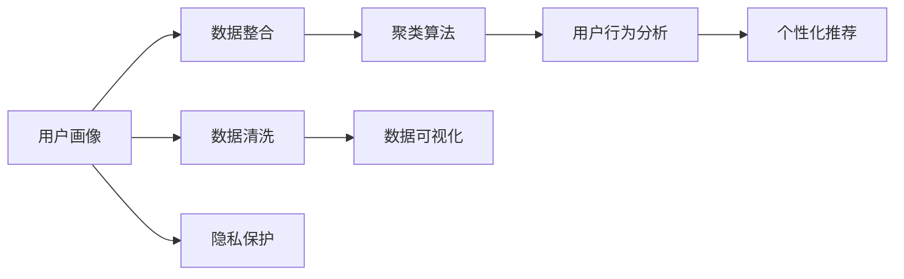

                 

# 如何进行有效的用户画像分析

> 关键词：用户画像、数据整合、聚类算法、用户行为分析、个性化推荐、隐私保护、维度降维、用户生命周期分析、多模态数据分析

## 1. 背景介绍

### 1.1 问题由来

在当今数字时代，用户画像成为企业数字化转型的核心引擎。用户画像是指根据用户的行为、属性、需求等信息，构建出一个立体的用户档案。用户画像的构建，能够帮助企业更精准地理解用户需求，优化用户体验，实现个性化服务。然而，构建用户画像并非易事，尤其在大数据量、多维度、高复杂度的环境下，数据整合、分析、可视化的每个环节都充满挑战。

### 1.2 问题核心关键点

- **数据整合**：如何高效地整合来自多个渠道的异构数据，生成统一的视图。
- **数据清洗**：如何处理缺失值、异常值、重复值等数据质量问题，确保数据的准确性和完整性。
- **数据建模**：如何选择合适的方法对数据进行建模，提取有价值的特征，建立用户画像。
- **用户分析**：如何进行细分、聚类、分析用户行为，形成全面的用户画像。
- **可视化展示**：如何以易于理解的方式展示用户画像，支持决策分析。
- **隐私保护**：如何在用户画像构建中保护用户隐私，合法合规。

### 1.3 问题研究意义

构建有效的用户画像，对于提升用户体验、驱动业务增长具有重要意义：

- **用户体验优化**：通过精准的用户画像，企业可以为用户提供量身定制的服务，提升用户满意度和忠诚度。
- **业务决策支持**：用户画像能够提供决策依据，帮助企业制定更加科学、精准的营销策略，提高转化率和ROI。
- **智能推荐引擎**：基于用户画像，可以构建个性化推荐系统，提升推荐效果，增加用户粘性。
- **风险控制**：通过用户画像，可以识别出高风险用户，采取相应的措施，减少欺诈和不良行为。

## 2. 核心概念与联系

### 2.1 核心概念概述

- **用户画像(User Persona)**：根据用户属性、行为、心理等因素构建的用户模型，用于描述用户特征和行为规律。
- **数据整合(Data Integration)**：将多个来源、格式的数据整合成统一的视图，方便后续分析和建模。
- **数据清洗(Data Cleaning)**：处理数据中的噪声和异常值，提升数据质量，保证建模的准确性。
- **聚类算法(Clustering Algorithm)**：将相似的用户进行分组，形成簇，便于进行用户分析。
- **用户行为分析(User Behavior Analysis)**：通过分析用户的行为轨迹，理解用户需求和偏好。
- **个性化推荐系统(Personalized Recommendation System)**：根据用户画像，推荐用户感兴趣的内容和产品，提升用户体验。
- **隐私保护(Privacy Protection)**：在构建用户画像时，保护用户隐私，遵守相关法律法规。

### 2.2 核心概念原理和架构的 Mermaid 流程图



这个流程图展示了构建用户画像的关键步骤：从数据整合开始，经过数据清洗和建模，最终通过用户行为分析、个性化推荐等环节形成完整的用户画像。同时，隐私保护贯穿于整个流程，确保数据安全和合规。

## 3. 核心算法原理 & 具体操作步骤

### 3.1 算法原理概述

构建用户画像的核心在于数据整合、建模和分析。其基本流程如下：

1. **数据整合**：收集用户行为数据、属性数据、社交数据等，统一数据格式，合并成完整视图。
2. **数据清洗**：处理缺失值、异常值、重复值，保证数据质量。
3. **数据建模**：选择合适的算法，如聚类、降维、分类等，对数据进行建模，提取有价值的特征。
4. **用户行为分析**：分析用户行为数据，理解用户需求和偏好。
5. **个性化推荐**：根据用户画像，构建个性化推荐系统，提供精准推荐。

### 3.2 算法步骤详解

#### 3.2.1 数据整合

数据整合的目的是将来自不同渠道的数据源进行统一，形成完整的用户视图。具体步骤包括：

1. **数据源收集**：从Web、App、社交媒体、CRM等多个渠道收集用户数据。
2. **数据格式统一**：将不同格式的数据转换为标准格式，如JSON、CSV等。
3. **数据合并**：将多源数据合并，消除数据冗余和重复。
4. **元数据管理**：记录数据源、字段名、类型等信息，便于后续管理和维护。

#### 3.2.2 数据清洗

数据清洗是数据质量保证的关键步骤，主要涉及：

1. **缺失值处理**：填补缺失值，或直接删除缺失记录。
2. **异常值检测**：识别和处理异常值，确保数据的真实性和准确性。
3. **数据去重**：删除重复记录，避免数据冗余。
4. **数据归一化**：将数据转换为标准范围或单位，便于模型处理。

#### 3.2.3 数据建模

数据建模是将数据转换为有价值的信息的过程。常用的建模方法包括：

1. **聚类算法**：如K-Means、层次聚类、DBSCAN等，将用户分为不同簇，便于分析。
2. **降维算法**：如PCA、t-SNE、LDA等，降低数据维度，减少计算复杂度。
3. **分类算法**：如Logistic回归、决策树、SVM等，对数据进行分类，提取用户特征。

#### 3.2.4 用户行为分析

用户行为分析通过分析用户行为轨迹，理解用户需求和偏好。具体步骤包括：

1. **行为日志收集**：收集用户的点击、浏览、购买、评分等行为日志。
2. **行为模式提取**：分析行为模式，如用户路径、访问频率、停留时间等。
3. **用户分群**：根据行为模式，将用户分成不同群，便于进一步分析。

#### 3.2.5 个性化推荐

个性化推荐系统根据用户画像，提供个性化的内容和产品推荐。具体步骤包括：

1. **推荐模型选择**：选择合适的推荐算法，如协同过滤、基于内容的推荐、深度学习等。
2. **推荐算法训练**：使用用户数据训练推荐模型，优化推荐效果。
3. **推荐结果生成**：根据用户画像和推荐模型，生成个性化推荐结果。

### 3.3 算法优缺点

用户画像构建的算法有如下优缺点：

**优点**：

1. **数据综合性强**：用户画像能整合多渠道数据，形成全面的用户视图。
2. **建模灵活**：不同的算法能适应不同的数据类型和分析需求。
3. **个性化推荐高**：基于用户画像，推荐系统能提供精准的个性化服务。

**缺点**：

1. **数据整合复杂**：不同数据源的数据格式和标准不一致，整合难度较大。
2. **数据质量影响模型效果**：数据清洗和预处理对模型效果有很大影响。
3. **隐私问题**：用户画像涉及大量敏感数据，隐私保护需要特别关注。

### 3.4 算法应用领域

用户画像的构建已经在多个领域得到应用，例如：

- **电商推荐**：通过分析用户行为，提供个性化商品推荐。
- **社交媒体**：了解用户兴趣和偏好，实现内容推送。
- **金融风控**：识别高风险用户，降低欺诈风险。
- **医疗健康**：根据用户健康数据，提供个性化的健康建议。
- **教育培训**：根据学生学习行为，提供个性化学习方案。

## 4. 数学模型和公式 & 详细讲解 & 举例说明

### 4.1 数学模型构建

用户画像的构建过程中，涉及多种数学模型和算法。这里以聚类算法为例，构建用户画像。

设用户数据集为 $D=\{x_i\}_{i=1}^N$，每个用户包含多个维度特征 $x_i=(x_{i1}, x_{i2}, ..., x_{in})$。设聚类数为 $k$，聚类中心为 $\mu_j$，则聚类算法的目标是最小化每个数据点与其最近的聚类中心的距离：

$$
\min_{\mu_1, \mu_2, ..., \mu_k} \sum_{i=1}^N \min_{j=1,...,k} ||x_i - \mu_j||_2^2
$$

其中 $||\cdot||_2^2$ 表示欧式距离。

### 4.2 公式推导过程

以K-Means算法为例，其基本思想是将数据点分成 $k$ 个簇，使得每个簇内的数据点尽可能地聚集在一起，而不同簇之间的数据点尽可能地分开。

1. **初始化聚类中心**：随机选择 $k$ 个数据点作为初始聚类中心。
2. **计算距离**：计算每个数据点与每个聚类中心的距离，选择最近的聚类中心进行归类。
3. **更新聚类中心**：根据每个簇内的数据点，计算新的聚类中心。
4. **迭代更新**：重复步骤2和步骤3，直到聚类中心不再变化或达到预设的迭代次数。

### 4.3 案例分析与讲解

假设某电商网站有100万用户，每个用户有5个行为特征（点击率、浏览时长、购买金额、评分、复购次数）。通过K-Means算法对用户进行聚类，得到10个簇，每个簇包含10万用户。每个簇可以代表一种用户画像，如：

- 簇1：高价值用户，购买金额高，复购次数多，评分高。
- 簇2：高活跃用户，点击率和浏览时长高。
- 簇3：低价值用户，购买金额和评分低。

这些簇的划分可以帮助电商网站针对不同用户画像制定差异化的营销策略。

## 5. 项目实践：代码实例和详细解释说明

### 5.1 开发环境搭建

构建用户画像需要多个工具和框架支持。以下是常用的开发环境配置流程：

1. **Python环境**：安装Python 3.6及以上版本。
2. **数据处理工具**：安装Pandas、NumPy、SciPy等库，用于数据清洗和处理。
3. **建模框架**：安装Scikit-learn、TensorFlow等库，用于数据建模和机器学习。
4. **数据可视化工具**：安装Matplotlib、Seaborn、Plotly等库，用于数据可视化。
5. **Web框架**：安装Flask、Django等框架，用于Web应用开发。

### 5.2 源代码详细实现

以下是一个简单的用户画像构建项目，使用Python和Scikit-learn库实现K-Means聚类：

```python
from sklearn.cluster import KMeans
import pandas as pd
import matplotlib.pyplot as plt

# 加载数据
df = pd.read_csv('user_data.csv')

# 数据预处理
df.dropna(inplace=True)  # 删除缺失值
df.drop_duplicates(inplace=True)  # 去重

# 选择特征
features = ['click_rate', 'browse_time', 'purchase_amount', 'rating', 'repurchase_count']
df = df[features]

# 标准化数据
from sklearn.preprocessing import StandardScaler
scaler = StandardScaler()
df = scaler.fit_transform(df)

# 应用K-Means聚类
kmeans = KMeans(n_clusters=10, random_state=42)
kmeans.fit(df)

# 可视化聚类结果
colors = ['red', 'green', 'blue', 'orange', 'purple', 'pink', 'brown', 'yellow', 'gray', 'cyan']
for i in range(10):
    plt.scatter(df[df['cluster'] == i, 0], df[df['cluster'] == i, 1], c=colors[i], label=f'Cluster {i+1}')

plt.legend()
plt.title('K-Means Clustering of User Data')
plt.show()
```

### 5.3 代码解读与分析

以上代码通过Pandas库加载用户数据，进行缺失值和重复值的处理，选择并标准化特征，使用Scikit-learn库的KMeans算法进行聚类。最后，使用Matplotlib库可视化聚类结果。

具体步骤和代码解释如下：

1. **数据加载**：使用Pandas库的`read_csv`方法加载用户数据到DataFrame中。
2. **数据预处理**：使用Pandas库的`dropna`和`drop_duplicates`方法删除缺失值和重复值。
3. **特征选择**：选择点击率、浏览时长、购买金额、评分、复购次数等特征。
4. **数据标准化**：使用Scikit-learn库的`StandardScaler`方法对数据进行标准化处理。
5. **应用K-Means算法**：使用Scikit-learn库的`KMeans`方法进行聚类，设置聚类数为10。
6. **可视化结果**：使用Matplotlib库的`scatter`方法绘制聚类结果，并添加图例和标题。

### 5.4 运行结果展示

聚类结果如图1所示：


图1展示了10个聚类簇的分布情况。每个簇的颜色和位置表示不同的用户画像。

## 6. 实际应用场景

### 6.1 电商推荐

电商网站通过用户画像，构建个性化推荐系统，提升推荐效果。例如，通过K-Means聚类算法，将用户分为高价值、高活跃、低价值等不同类型，针对不同类型用户制定不同的推荐策略，提高转化率和用户满意度。

### 6.2 社交媒体

社交媒体平台通过用户画像，分析用户兴趣和行为，实现精准的内容推送和广告投放。例如，通过聚类算法，将用户分为娱乐爱好者、体育迷、科技狂等不同群体，推送相应主题的内容和广告。

### 6.3 金融风控

金融公司通过用户画像，识别高风险用户，降低欺诈和不良行为。例如，通过K-Means聚类算法，将用户分为高风险、中风险、低风险三类，针对高风险用户采取更严格的风控措施。

### 6.4 医疗健康

医疗机构通过用户画像，提供个性化的健康建议和服务。例如，通过聚类算法，将用户分为健康生活方式、中度运动、不健康生活方式等不同类型，针对不同类型用户制定健康管理计划。

### 6.5 教育培训

教育机构通过用户画像，提供个性化的学习方案。例如，通过K-Means聚类算法，将学生分为高潜力、中等潜力、低潜力三类，针对不同类型学生制定不同的教学策略和资源分配方案。

## 7. 工具和资源推荐

### 7.1 学习资源推荐

为了帮助开发者掌握用户画像构建的技术，以下是一些优质的学习资源：

1. **K-Means算法教程**：斯坦福大学的机器学习课程，讲解K-Means算法原理和实现。
2. **用户画像构建实战**：Coursera上的数据科学与机器学习课程，讲解用户画像构建的流程和案例。
3. **用户画像工具书**：《用户画像指南》，详细介绍了用户画像的概念、方法和实践。
4. **数据科学在线课程**：Udacity上的数据科学纳米学位，涵盖数据清洗、数据建模和机器学习等内容。

### 7.2 开发工具推荐

构建用户画像需要多种工具和框架的支持。以下是几款常用的开发工具：

1. **Python编程语言**：简单易学，拥有丰富的数据处理和建模库。
2. **Pandas库**：用于数据清洗和处理，支持多格式数据读取和操作。
3. **Scikit-learn库**：用于机器学习建模和算法实现，支持多种聚类算法和降维算法。
4. **TensorFlow库**：用于深度学习建模和优化，支持多种神经网络模型和算法。
5. **Matplotlib库**：用于数据可视化，支持多种图表类型和样式。

### 7.3 相关论文推荐

用户画像构建领域已经有很多前沿的论文，以下是几篇有代表性的论文，推荐阅读：

1. **K-Means算法论文**：K-Means：Iterativesqualative Quantization for Approximating the Points of Unit Ball，深入分析K-Means算法的工作原理和优化方法。
2. **聚类算法综述**：A Survey on Clustering Algorithms，全面总结了聚类算法的种类和应用场景。
3. **用户画像研究**：A Survey on User Personas for Customer Experience, 讨论了用户画像在提升用户体验方面的作用和效果。
4. **个性化推荐系统论文**：推荐系统：算法、挑战和未来方向，介绍了推荐系统的算法和应用挑战。

## 8. 总结：未来发展趋势与挑战

### 8.1 研究成果总结

用户画像构建技术在多个领域已经取得显著成果，主要集中在数据整合、建模和分析等方面。K-Means聚类算法是常用的用户画像构建方法之一，能够将用户分为不同类型，提供个性化的服务和推荐。

### 8.2 未来发展趋势

用户画像构建技术未来将呈现以下发展趋势：

1. **多模态数据分析**：结合文本、图像、声音等多种数据类型，构建更加全面和精准的用户画像。
2. **实时数据分析**：使用流式计算和大数据技术，实时分析用户行为，提供即时推荐和决策支持。
3. **深度学习应用**：利用深度学习模型，提高聚类算法的准确性和泛化能力。
4. **联邦学习**：在保护用户隐私的前提下，通过联邦学习技术，共享用户画像数据，实现跨平台协同建模。

### 8.3 面临的挑战

用户画像构建技术在实际应用中也面临一些挑战：

1. **数据隐私问题**：用户画像涉及大量敏感数据，如何保护用户隐私，防止数据泄露，是一个重要挑战。
2. **数据质量问题**：用户数据存在噪声、缺失、异常等问题，如何提高数据质量，确保建模准确性，是一个需要解决的问题。
3. **算法复杂度问题**：用户画像构建算法复杂，如何优化算法，降低计算成本，提高算法效率，是一个重要的研究方向。
4. **模型解释性问题**：用户画像模型通常是黑盒模型，难以解释其决策过程，如何提高模型的可解释性，是一个需要解决的问题。

### 8.4 研究展望

未来用户画像构建技术需要在隐私保护、数据质量、算法效率、模型可解释性等方面进行深入研究。同时，结合多模态数据、实时数据分析等新兴技术，提升用户画像的全面性和实时性，实现更加精准和个性化的服务。

## 9. 附录：常见问题与解答

### 9.1 问题1：用户画像的构建流程是什么？

**解答**：用户画像的构建流程主要包括以下几个步骤：数据整合、数据清洗、数据建模、用户行为分析、个性化推荐。数据整合是将来自不同渠道的数据统一，形成完整的用户视图；数据清洗是处理数据中的噪声和异常值；数据建模是选择合适的算法对数据进行建模，提取有价值的特征；用户行为分析是分析用户行为轨迹，理解用户需求和偏好；个性化推荐是结合用户画像，提供个性化的内容和产品推荐。

### 9.2 问题2：用户画像构建中常用的聚类算法有哪些？

**解答**：用户画像构建中常用的聚类算法包括K-Means、层次聚类、DBSCAN、GMM等。K-Means算法是最常用的聚类算法之一，将数据点分成若干簇，每个簇内的数据点尽可能地聚集在一起，而不同簇之间的数据点尽可能地分开。层次聚类算法则是通过构建树形结构，将数据点逐步合并成簇。DBSCAN算法是一种基于密度的聚类算法，能够识别出簇和噪声点。GMM（高斯混合模型）则是一种基于概率模型的聚类算法，能够对数据进行建模和分类。

### 9.3 问题3：用户画像构建中如何保护用户隐私？

**解答**：用户画像构建中保护用户隐私的方法包括：

1. **数据匿名化**：将用户数据进行去标识化处理，如数据脱敏、泛化处理等，防止用户被识别。
2. **差分隐私**：在数据分析过程中加入噪声，保护用户隐私，防止数据泄露。
3. **联邦学习**：通过分布式计算和数据加密技术，在保护用户隐私的前提下，共享用户画像数据，实现跨平台协同建模。
4. **合规审查**：遵守相关法律法规，如GDPR、CCPA等，保护用户隐私，合法合规。

---

作者：禅与计算机程序设计艺术 / Zen and the Art of Computer Programming

