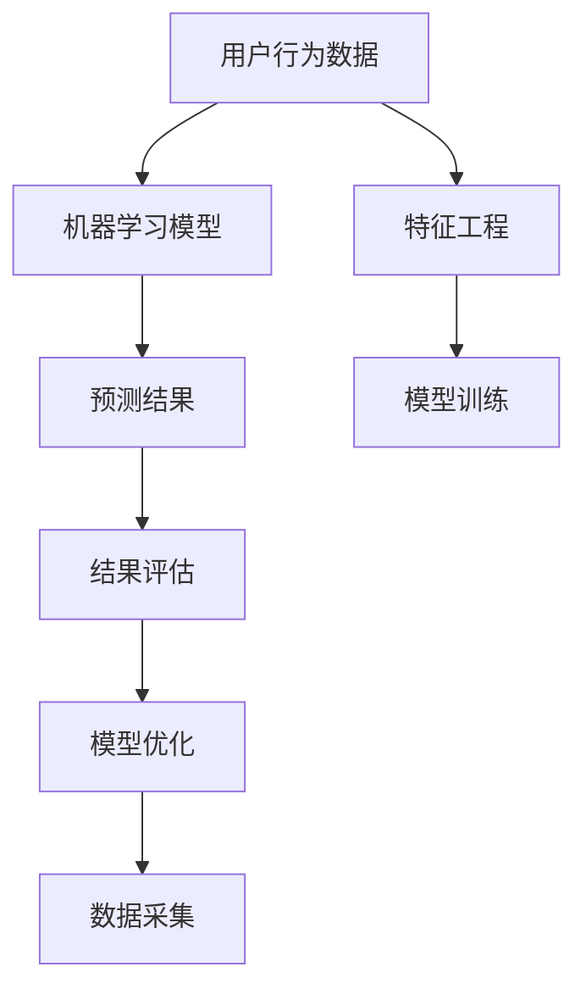

                 

# 如何进行有效的用户需求预测

在数字经济时代，用户需求预测已成为企业决策、产品迭代、市场推广等方面的重要依据。精准、高效的用户需求预测不仅能够提升用户体验，还能为企业带来显著的商业价值。本文将系统探讨如何通过数据分析、机器学习等技术手段，实现对用户需求的有效预测。

## 1. 背景介绍

### 1.1 问题由来

随着互联网和移动互联网的迅猛发展，电商平台、社交媒体、在线服务等多个领域的用户数据量呈现爆炸性增长。如何从海量用户行为数据中挖掘出真实需求，成为各企业面临的重大挑战。传统的市场调研、问卷调查等方法，耗时长、成本高、且容易受主观因素影响，已难以满足快速变化的市场环境。

而基于大数据和机器学习的用户需求预测技术，能够通过用户行为数据自动识别用户需求变化，快速生成预测报告，帮助企业优化产品策略、提升营销效果，从而在激烈的市场竞争中占据优势。

### 1.2 问题核心关键点

用户需求预测的核心在于，基于历史用户行为数据，构建出用户需求与业务变量之间的复杂关系，并利用机器学习模型进行建模预测。关键点包括：

- 数据采集与清洗：收集用户行为数据，去除噪声和异常值，保证数据质量。
- 特征工程：设计、筛选特征变量，提取用户需求与业务变量之间的内在联系。
- 模型选择与训练：选择合适的机器学习模型，并进行训练、调参，获取预测模型。
- 结果评估与优化：对预测结果进行评估，通过反馈循环提升模型性能。

## 2. 核心概念与联系

### 2.1 核心概念概述

用户需求预测主要涉及以下概念：

- 用户行为数据：用户在电商平台、社交媒体、在线服务等方面的操作、点击、浏览、购买等行为记录。
- 特征工程：从用户行为数据中提取、筛选、构造有意义的特征变量。
- 机器学习模型：利用历史用户行为数据，训练出能够预测用户需求的模型，如回归模型、分类模型、神经网络等。
- 预测结果评估：通过实际用户行为与预测结果的比较，评估模型性能，优化模型参数。

这些概念之间通过以下方式相互联系：

1. 用户行为数据是特征工程和模型训练的基础，特征工程的目的是提取有意义的特征变量，模型训练的目的是学习用户需求与特征变量之间的关系。
2. 特征工程和模型训练的结果都是用于生成预测结果，预测结果的准确性是衡量模型性能的关键指标。
3. 预测结果的实际应用，可以进一步反馈给用户行为数据采集，形成数据-模型-应用循环，不断提升预测模型的准确性和泛化能力。

### 2.2 核心概念原理和架构的 Mermaid 流程图(Mermaid 流程节点中不要有括号、逗号等特殊字符)



这个流程图展示了用户需求预测的核心流程：

1. 从用户行为数据中提取特征变量。
2. 使用特征变量训练机器学习模型。
3. 生成预测结果，并进行评估。
4. 根据评估结果对模型进行优化。
5. 反馈优化后的模型用于下一轮预测，形成一个不断迭代的过程。

## 3. 核心算法原理 & 具体操作步骤

### 3.1 算法原理概述

用户需求预测的本质是基于历史用户行为数据，挖掘用户需求变化趋势，从而预测未来需求。常见的方法包括：

- 回归模型：预测用户需求的连续数值，如点击次数、购买量等。
- 分类模型：预测用户需求的类别，如是否购买、是否流失等。
- 神经网络模型：通过多层非线性映射，学习用户需求与业务变量之间的关系。

这些模型的基本原理是，通过训练数据集，学习出输入变量与输出变量之间的映射关系，进而生成预测结果。公式化地，给定训练数据集 $D=\{(x_i, y_i)\}_{i=1}^N$，其中 $x_i$ 为输入变量，$y_i$ 为输出变量（即真实需求）。模型 $f(x; \theta)$ 的训练目标是最小化预测误差，即：

$$
\min_{\theta} \frac{1}{N} \sum_{i=1}^N (y_i - f(x_i; \theta))^2
$$

其中 $\theta$ 为模型参数，$f(x; \theta)$ 为模型映射函数。

### 3.2 算法步骤详解

基于机器学习模型的用户需求预测，主要包括以下步骤：

**Step 1: 数据采集与预处理**

- 收集用户行为数据，包括浏览记录、点击事件、购买历史、评价反馈等。
- 对数据进行清洗，去除噪声、缺失值、异常值，保证数据质量。

**Step 2: 特征工程**

- 设计特征变量，包括用户基本信息（如年龄、性别、地域等）、行为特征（如访问时间、访问频率、停留时长等）、业务变量（如商品价格、促销活动等）。
- 对特征变量进行归一化、编码、组合等处理，提取有意义的特征信息。
- 筛选关键特征变量，去除冗余和无关变量。

**Step 3: 模型选择与训练**

- 选择合适的机器学习模型，如线性回归、决策树、随机森林、神经网络等。
- 对模型进行训练，使用交叉验证等技术进行调参。
- 使用训练集生成预测结果。

**Step 4: 结果评估与优化**

- 对预测结果进行评估，使用均方误差、平均绝对误差、ROC曲线等指标。
- 根据评估结果，优化模型参数，提升预测精度。
- 通过反馈循环，不断优化模型，提升预测效果。

**Step 5: 预测与反馈**

- 使用优化后的模型，对新用户行为数据进行预测。
- 根据预测结果，生成相应业务建议或策略。
- 通过实际应用效果，反馈给模型，进行新一轮迭代优化。

### 3.3 算法优缺点

基于机器学习模型的用户需求预测方法具有以下优点：

- 自动化程度高：模型自动学习特征关系，减轻人工干预。
- 可扩展性强：模型易于部署到不同的业务场景。
- 效果显著：通过大数据和复杂模型，能够实现较高精度的预测。

但同时，这些方法也存在一些局限性：

- 数据质量要求高：模型的训练和预测结果高度依赖于数据质量。
- 模型复杂度高：复杂的模型需要更多的计算资源和时间。
- 黑盒模型：模型的预测结果难以解释，存在一定的不确定性。

### 3.4 算法应用领域

用户需求预测技术广泛应用于多个领域，如：

- 电商平台：预测用户购买意愿、流失率、满意度等，优化商品推荐、促销策略。
- 在线教育：预测用户学习行为、课程偏好、考试成绩，提升个性化教学和辅导效果。
- 社交媒体：预测用户活跃度、内容偏好、互动行为，优化内容推荐和社区管理。
- 旅游行业：预测用户旅游偏好、预订量、消费行为，提升营销和旅游体验。
- 金融服务：预测用户贷款需求、风险等级、交易行为，优化风险管理和客户服务。

## 4. 数学模型和公式 & 详细讲解 & 举例说明

### 4.1 数学模型构建

用户需求预测的核心数学模型是回归模型和分类模型。以线性回归模型为例，模型的目标是最小化预测误差：

$$
\min_{\theta} \frac{1}{N} \sum_{i=1}^N (y_i - f(x_i; \theta))^2
$$

其中 $f(x; \theta) = \theta_0 + \sum_{j=1}^p \theta_j x_{ij}$ 为线性回归模型，$\theta_0, \theta_1, ..., \theta_p$ 为模型参数。

### 4.2 公式推导过程

线性回归模型的预测函数为：

$$
f(x; \theta) = \theta_0 + \sum_{j=1}^p \theta_j x_{ij}
$$

其中 $x_{ij}$ 为第 $i$ 个样本的第 $j$ 个特征变量。

模型的目标是最小化预测误差：

$$
\min_{\theta} \frac{1}{N} \sum_{i=1}^N (y_i - f(x_i; \theta))^2
$$

利用梯度下降等优化算法，求解上述最小化问题，得到最优参数 $\theta^*$：

$$
\theta^* = \mathop{\arg\min}_{\theta} \frac{1}{N} \sum_{i=1}^N (y_i - f(x_i; \theta))^2
$$

通过求解上述优化问题，即可得到线性回归模型的预测函数。

### 4.3 案例分析与讲解

以电商平台用户需求预测为例，假设模型输入为 $x = [\text{用户ID}, \text{浏览时间}, \text{商品ID}, \text{购买次数}]$，目标变量为 $y = \text{购买量}$。

**Step 1: 数据采集与预处理**

- 收集用户浏览记录、点击事件、购买历史等数据。
- 清洗数据，去除噪声、缺失值、异常值。

**Step 2: 特征工程**

- 设计特征变量，包括用户基本信息、行为特征、商品属性等。
- 对特征变量进行编码、归一化等处理。
- 筛选关键特征变量，去除冗余和无关变量。

**Step 3: 模型选择与训练**

- 选择线性回归模型，使用交叉验证进行调参。
- 对模型进行训练，生成预测结果。

**Step 4: 结果评估与优化**

- 使用均方误差等指标评估模型性能。
- 根据评估结果，优化模型参数。

**Step 5: 预测与反馈**

- 使用优化后的模型，对新用户数据进行预测。
- 根据预测结果，优化商品推荐策略。
- 通过实际应用效果，反馈给模型，进行新一轮迭代优化。

## 5. 项目实践：代码实例和详细解释说明

### 5.1 开发环境搭建

进行用户需求预测项目实践，需要搭建好Python开发环境。以下是基本配置步骤：

1. 安装Anaconda：从官网下载并安装Anaconda，用于创建独立的Python环境。

2. 创建并激活虚拟环境：
```bash
conda create -n py_env python=3.8 
conda activate py_env
```

3. 安装相关库：
```bash
pip install pandas numpy scikit-learn statsmodels matplotlib seaborn
```

完成上述步骤后，即可在`py_env`环境中开始项目开发。

### 5.2 源代码详细实现

以下是一个简单的线性回归用户需求预测模型的代码实现，使用Scikit-learn库：

```python
from sklearn.linear_model import LinearRegression
from sklearn.model_selection import train_test_split
from sklearn.metrics import mean_squared_error
import pandas as pd

# 1. 数据采集与预处理
data = pd.read_csv('user_behavior.csv')
X = data[['user_id', 'browse_time', 'product_id', 'purchase_count']]
y = data['purchase_amount']

# 2. 特征工程
X = pd.get_dummies(X, drop_first=True)
X = X.dropna()

# 3. 模型训练
X_train, X_test, y_train, y_test = train_test_split(X, y, test_size=0.2)
model = LinearRegression()
model.fit(X_train, y_train)

# 4. 结果评估
y_pred = model.predict(X_test)
mse = mean_squared_error(y_test, y_pred)
print(f'均方误差: {mse}')

# 5. 预测与反馈
new_data = pd.DataFrame({'user_id': [1001, 1002], 'browse_time': [1800, 2000], 'product_id': [1, 2], 'purchase_count': [5, 3]})
X_new = pd.get_dummies(new_data, drop_first=True)
X_new = X_new.dropna()
y_new = model.predict(X_new)
print(f'预测购买量: {y_new}')
```

### 5.3 代码解读与分析

上述代码实现了一个简单的线性回归用户需求预测模型，通过Scikit-learn库实现。

**Step 1: 数据采集与预处理**

- 使用Pandas库读取用户行为数据。
- 提取特征变量和目标变量，进行数据清洗和处理。

**Step 2: 特征工程**

- 使用Pandas库对特征变量进行编码和归一化处理。
- 使用Pandas库进行特征组合和筛选。

**Step 3: 模型训练**

- 使用Scikit-learn库中的`LinearRegression`模型进行训练。
- 使用交叉验证等技术进行模型调参。

**Step 4: 结果评估**

- 使用Scikit-learn库中的`mean_squared_error`函数计算均方误差，评估模型预测性能。

**Step 5: 预测与反馈**

- 对新用户数据进行特征处理和预测。
- 输出预测结果，供实际应用。

## 6. 实际应用场景

### 6.1 电商平台

电商平台的典型应用场景包括：

- 预测用户购买意愿，优化商品推荐策略。
- 预测用户流失率，进行个性化挽留。
- 预测用户满意度，提升客户服务质量。

通过用户需求预测，电商平台能够实现更精准的个性化推荐，提高用户粘性和交易转化率。

### 6.2 在线教育

在线教育的典型应用场景包括：

- 预测用户学习行为，提供个性化学习建议。
- 预测用户课程偏好，推荐相关课程内容。
- 预测用户考试成绩，进行个性化辅导和支持。

通过用户需求预测，在线教育平台能够提供更符合用户需求的教学内容，提升学习效果。

### 6.3 社交媒体

社交媒体的典型应用场景包括：

- 预测用户活跃度，优化内容推荐策略。
- 预测用户互动行为，提升社区互动效果。
- 预测用户情绪变化，进行情绪管理和风险监控。

通过用户需求预测，社交媒体平台能够提供更符合用户兴趣的内容，提升用户黏性和平台活跃度。

### 6.4 旅游行业

旅游行业的典型应用场景包括：

- 预测用户旅游偏好，优化旅游线路和产品推荐。
- 预测用户预订量，进行库存管理和需求预测。
- 预测用户消费行为，进行精准营销和促销策略。

通过用户需求预测，旅游行业能够实现更精准的市场预测和需求管理，提升用户体验和公司收益。

### 6.5 金融服务

金融服务的典型应用场景包括：

- 预测用户贷款需求，优化贷款审批流程。
- 预测用户风险等级，进行风险管理和信贷评估。
- 预测用户交易行为，优化金融产品和服务策略。

通过用户需求预测，金融服务行业能够提供更符合用户需求的产品和服务，提升客户满意度和公司收益。

## 7. 工具和资源推荐

### 7.1 学习资源推荐

为了帮助开发者系统掌握用户需求预测的理论基础和实践技巧，这里推荐一些优质的学习资源：

1. 《机器学习实战》书籍：介绍机器学习的基本概念和常见算法，适合入门学习。
2. 《Python数据科学手册》书籍：全面介绍Python在数据科学中的应用，包括数据分析、机器学习等。
3. 《深度学习》课程（斯坦福大学）：由吴恩达教授主讲，系统讲解深度学习的基本原理和应用。
4. 《统计学习方法》书籍：由李航教授撰写，全面介绍统计学习的基本方法，包括回归、分类等。
5. Kaggle平台：提供大量数据集和竞赛项目，帮助学习者实践和提升。

通过这些资源的学习实践，相信你一定能够快速掌握用户需求预测的精髓，并用于解决实际的NLP问题。

### 7.2 开发工具推荐

高效的开发离不开优秀的工具支持。以下是几款用于用户需求预测开发的常用工具：

1. Jupyter Notebook：免费的开源编程环境，支持多种语言和库的开发和展示。
2. Google Colab：免费的在线Jupyter Notebook环境，提供GPU/TPU算力，方便快速迭代实验。
3. TensorBoard：TensorFlow配套的可视化工具，实时监测模型训练状态，提供丰富的图表呈现方式。
4. Weights & Biases：模型训练的实验跟踪工具，记录和可视化模型训练过程中的各项指标。
5. PyTorch：基于Python的开源深度学习框架，灵活的计算图，适合快速迭代研究。

合理利用这些工具，可以显著提升用户需求预测任务的开发效率，加快创新迭代的步伐。

### 7.3 相关论文推荐

用户需求预测领域的研究论文众多，以下是几篇代表性的相关论文，推荐阅读：

1. "User Behavior Prediction: A Survey" - 吴军、吴恩达（2010）：综述了用户行为预测的研究进展和应用案例。
2. "Deep Learning for Personalized Recommendation" - Koren（2009）：提出了基于深度学习的推荐系统方法，包括用户行为预测。
3. "A Practical Guide to User Behavior Prediction" - Hensman（2013）：介绍了用户行为预测的常见技术和方法。
4. "Machine Learning Techniques for Predictive Analytics in E-commerce" - Dhillon（2017）：总结了机器学习在电商数据分析中的应用，包括用户需求预测。
5. "Neural Networks for Recommender Systems: A Perspective and an Overview" - Schmid.de Aleixós（2019）：综述了神经网络在推荐系统中的应用，包括用户行为预测。

这些论文代表了大数据和机器学习在用户需求预测领域的研究脉络。通过学习这些前沿成果，可以帮助研究者把握学科前进方向，激发更多的创新灵感。

## 8. 总结：未来发展趋势与挑战

### 8.1 研究成果总结

本文从理论和实践两个层面，系统探讨了用户需求预测的方法和流程。主要研究成果包括：

1. 用户需求预测的核心在于通过历史数据挖掘用户行为与需求之间的复杂关系。
2. 机器学习模型是实现用户需求预测的主要工具，包括回归模型、分类模型、神经网络等。
3. 用户需求预测在电商、教育、社交媒体、旅游、金融等多个领域具有广泛应用前景。

### 8.2 未来发展趋势

展望未来，用户需求预测技术将呈现以下几个发展趋势：

1. 大数据和深度学习技术的进一步发展，将提升预测模型的精度和泛化能力。
2. 多模态数据融合技术的应用，将增强用户需求预测的全面性和准确性。
3. 实时预测和动态调整机制的引入，将实现更高效的个性化推荐和服务。
4. 联邦学习和差分隐私技术的应用，将提升用户隐私保护和数据安全性。
5. 模型解释性和可解释性的提升，将增强用户信任和应用推广。

### 8.3 面临的挑战

尽管用户需求预测技术已经取得了长足进展，但在迈向更加智能化、普适化应用的过程中，仍面临诸多挑战：

1. 数据质量问题：用户数据存在缺失、噪声、异常值等，数据质量不高将影响预测结果的准确性。
2. 特征选择问题：用户需求预测涉及大量特征变量，如何合理选择和组合特征，是提升模型性能的关键。
3. 模型复杂性问题：深度学习模型虽然精度高，但计算资源消耗大，模型难以部署到边缘设备。
4. 用户隐私问题：用户需求预测需要大量数据，数据收集和使用过程中如何保护用户隐私，是亟待解决的重要问题。
5. 模型可解释性问题：复杂模型的预测结果难以解释，缺乏透明性和可信度，影响用户信任。

### 8.4 研究展望

面对用户需求预测面临的挑战，未来的研究需要在以下几个方面寻求新的突破：

1. 数据质量提升：开发高效的数据清洗和处理算法，提升用户数据的质量和可用性。
2. 特征选择优化：结合领域知识，引入自适应特征选择技术，提升模型的预测性能。
3. 模型压缩与优化：开发轻量级模型压缩和优化算法，提升模型在小设备和低功耗环境下的性能。
4. 隐私保护技术：引入差分隐私和联邦学习技术，保护用户隐私，确保数据安全。
5. 模型可解释性提升：开发可解释性算法，提高模型的透明性和可信度。

这些研究方向的探索，必将引领用户需求预测技术迈向更高的台阶，为构建安全、可靠、可解释、可控的智能系统铺平道路。

## 9. 附录：常见问题与解答

**Q1: 如何评估用户需求预测模型的性能？**

A: 用户需求预测模型的性能评估通常使用以下指标：

- 均方误差（Mean Squared Error, MSE）：衡量预测值与真实值之间的平均差异。
- 平均绝对误差（Mean Absolute Error, MAE）：衡量预测值与真实值之间的平均绝对差异。
- 决定系数（R-squared, R²）：衡量模型对数据的拟合程度。
- 准确率（Accuracy）：衡量分类模型的正确预测率。
- 混淆矩阵（Confusion Matrix）：衡量分类模型的精确度和召回率。

通过这些指标，可以全面评估用户需求预测模型的性能。

**Q2: 如何处理缺失值和异常值？**

A: 处理缺失值和异常值是数据预处理的重要环节。常见的方法包括：

- 缺失值填补：使用均值、中位数、插值等方法填补缺失值。
- 异常值检测：使用箱线图、Z-score等方法检测异常值。
- 异常值处理：根据数据分布特点，采用删除、替换等方法处理异常值。

通过这些方法，可以提升数据质量，减少预测误差。

**Q3: 如何选择特征变量？**

A: 特征变量的选择对用户需求预测模型的性能影响很大。常见的方法包括：

- 领域知识法：结合领域知识，选择与预测目标相关的特征变量。
- 逐步回归法：逐步引入特征变量，评估其对预测结果的影响，选择重要变量。
- 正则化方法：引入L1、L2正则化，限制模型复杂度，筛选重要变量。

通过这些方法，可以提升特征变量的选择效率和准确性。

**Q4: 如何提升模型的可解释性？**

A: 提升模型的可解释性是用户需求预测技术的重要方向。常见的方法包括：

- 特征重要性分析：使用LIME、SHAP等方法，分析特征对预测结果的影响。
- 模型可视化：使用TensorBoard、Visdom等工具，可视化模型训练和预测过程。
- 模型解释性算法：引入可解释性算法，如规则提取、决策树等，提升模型透明性。

通过这些方法，可以提高用户对模型的信任和接受度。

**Q5: 如何优化模型的性能？**

A: 优化模型的性能是用户需求预测技术的核心目标。常见的方法包括：

- 超参数调优：使用网格搜索、随机搜索等方法，调整模型的超参数。
- 模型融合：结合多种模型，提升预测性能和泛化能力。
- 模型剪枝：使用剪枝算法，去除冗余参数，提升模型性能和效率。

通过这些方法，可以提升用户需求预测模型的预测精度和实际应用效果。

---

作者：禅与计算机程序设计艺术 / Zen and the Art of Computer Programming

