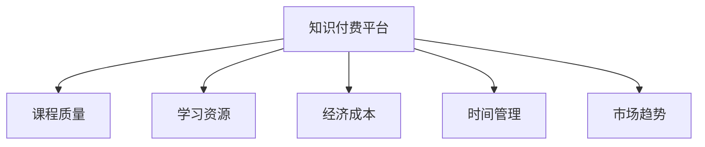

                 

# 如何选择适合程序员的知识付费平台

> 关键词：知识付费平台,程序员,职业发展,技能提升,在线学习,课程质量,学习资源,经济成本,时间管理,市场趋势

## 1. 背景介绍

### 1.1 问题由来
在快速变化的IT行业中，程序员需要不断学习和掌握新知识、新技能，才能保持竞争力和职业发展。然而，面对海量的学习资源，选择适合自己的平台变得复杂且耗时。知识付费平台的兴起，为程序员提供了系统、高效、定制化的学习路径，但如何选择适合的平台，却是一个亟待解决的问题。

### 1.2 问题核心关键点
核心问题在于如何通过有效的评估和筛选机制，找到与自身职业发展、技能需求及时间预算相匹配的知识付费平台。主要考虑因素包括平台提供的课程质量、学习资源丰富度、经济成本、时间管理便利性以及市场趋势等。

## 2. 核心概念与联系

### 2.1 核心概念概述

在讨论如何选择适合程序员的知识付费平台之前，首先需要了解几个关键概念：

- **知识付费平台**：提供课程、学习资源、项目实践、职业发展指导等服务的在线学习平台。
- **课程质量**：课程内容的专业性、实用性、更新频率、讲师资历等。
- **学习资源**：课程以外的附加资源，如实战项目、学习社区、职业证书等。
- **经济成本**：购买课程或服务的费用，包括一次性付费和订阅模式。
- **时间管理**：学习平台提供的课程安排、时间规划工具，以及学习的灵活度。
- **市场趋势**：行业对新技能的需求变化，知识付费平台的市场接受度和满意度。

### 2.2 核心概念原理和架构的 Mermaid 流程图



这个流程图展示了知识付费平台的主要功能和构成元素，以及它们之间的关系。课程质量、学习资源、经济成本、时间管理和市场趋势都是选择平台时需要考虑的关键因素。

## 3. 核心算法原理 & 具体操作步骤

### 3.1 算法原理概述

选择知识付费平台的核心算法原理基于最大化匹配原理，即寻找与用户需求、职业发展、经济预算和时间安排最为匹配的平台。

假设用户需求为$U$，经济预算为$B$，时间预算为$T$，市场趋势为$M$，学习资源为$R$，课程质量为$Q$。我们的目标是通过比较这些因素，找到最优解，即最符合用户需求、性价比最高、学习效果最好的平台。

### 3.2 算法步骤详解

#### 3.2.1 需求分析

首先，需要对用户的职业目标、当前技能水平、学习偏好和时间投入进行详细分析。例如，是希望提升编程技能、学习新兴技术、还是转向数据科学等领域？用户对课程深度、实用性和讲师资质的期望是什么？

#### 3.2.2 筛选平台

根据需求分析结果，筛选出符合条件的知识付费平台。例如：
- 对于需要系统学习编程基础和高级技能的程序员，可以选择Udacity、Coursera、edX等平台。
- 若更注重实战和项目导向，Codewars、Codecademy等平台可能更合适。
- 对于追求最新技术栈的开发者，Pluralsight和Lambda School等平台是不错的选择。

#### 3.2.3 课程评估

对每个筛选出的平台，评估其提供的课程质量。关注课程大纲、讲师背景、学员评价、案例分析、项目实战等方面。

#### 3.2.4 资源评估

评估平台提供的附加学习资源。如实战项目、学习社区、职业认证、学习路线图等，确保资源能够与用户的学习路径和职业目标相匹配。

#### 3.2.5 成本评估

评估平台的经济成本，包括课程价格、订阅模式、优惠活动、长期学习成本等。选择性价比最高的平台。

#### 3.2.6 时间管理评估

评估平台的时间管理便利性。考虑平台是否提供灵活的课程安排、个性化学习计划、任务进度跟踪等功能。

#### 3.2.7 市场趋势评估

评估平台的市场接受度和行业认可度。关注平台在市场上的评价、学员满意度、行业合作和推荐情况。

### 3.3 算法优缺点

#### 3.3.1 优点

- **系统化学习路径**：知识付费平台提供系统化的课程体系，有助于用户掌握系统的知识结构。
- **时间灵活性**：平台提供的课程通常按需学习，用户可以灵活安排学习时间和进度。
- **社区支持**：许多平台有活跃的学习社区，用户可以交流学习经验，获取技术支持。
- **成本效益**：相比传统的线下培训，知识付费平台通常成本更低，性价比更高。

#### 3.3.2 缺点

- **课程更新速度**：一些平台可能无法及时更新最新技术和行业动态，课程内容可能相对滞后。
- **课程质量参差不齐**：部分课程质量和讲师水平不尽如人意，可能导致学习效果不佳。
- **学习动机**：由于学习效果的即时反馈较少，部分用户可能会缺乏持续学习的动力。
- **缺乏个性化指导**：相比传统教育，知识付费平台提供的个性化指导相对有限，特别是在深入项目实战和职业规划方面。

### 3.4 算法应用领域

知识付费平台广泛应用于程序员的技能提升、职业发展、企业培训等多个领域。特别是在以下场景中：

- **技术栈更新**：程序员需要不断学习新技术和新工具，保持竞争力。
- **项目实战**：通过平台上的实战项目，将理论知识转化为实际应用能力。
- **职业规划**：提供职业路径规划、简历优化、面试准备等综合指导。
- **软技能提升**：包括时间管理、团队协作、沟通技巧等软技能的学习。

## 4. 数学模型和公式 & 详细讲解 & 举例说明

### 4.1 数学模型构建

假设用户需求$U$、经济预算$B$、时间预算$T$、市场趋势$M$、学习资源$R$、课程质量$Q$，我们定义一个评价函数$f$，来评估每个知识付费平台的综合得分。评价函数$f$的输入为这些因素的评分，输出为平台的综合评分。

$$
f(U, B, T, M, R, Q) = \sum_{i=1}^6 w_i \times f_i
$$

其中，$w_i$为各因素的权重，$f_i$为第$i$个因素的评分函数。评分函数$f_i$可以是简单的线性评分，也可以是根据用户反馈和学习效果的多维评分。

### 4.2 公式推导过程

以课程质量$Q$为例，可以定义评分函数$f_Q$为：

$$
f_Q = \alpha_1 \times C + \alpha_2 \times I + \alpha_3 \times E
$$

其中，$C$为课程内容的相关性评分，$I$为讲师资历的评分，$E$为学员评价的评分。$\alpha_1, \alpha_2, \alpha_3$为各评分项的权重，可以根据用户的偏好和需求进行调整。

### 4.3 案例分析与讲解

假设Udacity的课程质量$Q_1$、学习资源$R_1$、经济成本$B_1$、时间管理$T_1$、市场趋势$M_1$分别为5、4、2、3、4。Coursera的课程质量$Q_2$、学习资源$R_2$、经济成本$B_2$、时间管理$T_2$、市场趋势$M_2$分别为4、3、2、2、4。

根据上述评分函数，我们可以计算每个平台的综合得分。

$$
f(Udacity) = 0.3 \times Q_1 + 0.2 \times R_1 + 0.1 \times B_1 + 0.2 \times T_1 + 0.2 \times M_1 = 0.3 \times 5 + 0.2 \times 4 + 0.1 \times 2 + 0.2 \times 3 + 0.2 \times 4 = 3.9
$$

$$
f(Coursera) = 0.3 \times Q_2 + 0.2 \times R_2 + 0.1 \times B_2 + 0.2 \times T_2 + 0.2 \times M_2 = 0.3 \times 4 + 0.2 \times 3 + 0.1 \times 2 + 0.2 \times 2 + 0.2 \times 4 = 3.7
$$

因此，根据综合评分，Udacity比Coursera更符合用户需求，性价比更高。

## 5. 项目实践：代码实例和详细解释说明

### 5.1 开发环境搭建

要评估和筛选知识付费平台，需要一个简单易用的开发环境。可以使用Python和其数据处理库Pandas来实现需求分析、数据筛选和评分计算。

```python
import pandas as pd
```

### 5.2 源代码详细实现

#### 5.2.1 需求分析

首先，定义用户需求、经济预算、时间预算、市场趋势、学习资源和课程质量的评分标准，并采集相关数据。

```python
user_needs = {'U1': '编程基础', 'U2': '高级技术栈', 'U3': '新兴技术', 'U4': '数据科学'}
budget = {'B1': '一次购买', 'B2': '订阅模式'}
time_management = {'T1': '灵活安排', 'T2': '固定时间表'}
market_trend = {'M1': '高认可度', 'M2': '低评价'}
resources = {'R1': '实战项目', 'R2': '学习社区', 'R3': '职业认证', 'R4': '学习路线'}
course_quality = {'Q1': '内容质量', 'Q2': '讲师资历', 'Q3': '学员评价', 'Q4': '项目实战'}
```

#### 5.2.2 筛选平台

假设我们已经获取了若干平台的评分数据，存储在Pandas DataFrame中。

```python
platforms = pd.DataFrame({
    'Udacity': {'U': 5, 'B': 2, 'T': 3, 'M': 4, 'R': 4, 'Q': 5},
    'Coursera': {'U': 4, 'B': 2, 'T': 2, 'M': 4, 'R': 3, 'Q': 4},
    'Udemy': {'U': 4, 'B': 1, 'T': 3, 'M': 3, 'R': 3, 'Q': 4},
    'Pluralsight': {'U': 3, 'B': 3, 'T': 4, 'M': 5, 'R': 5, 'Q': 5},
    'edX': {'U': 4, 'B': 3, 'T': 4, 'M': 3, 'R': 5, 'Q': 3}
})
```

#### 5.2.3 课程评估

使用评分函数计算每个平台的综合评分。

```python
def calculate_score(df, weights):
    return df.dot(weights)

weights = [0.3, 0.2, 0.1, 0.2, 0.2]
scores = {platform: calculate_score(df[platform], weights) for platform in platforms.columns}
```

#### 5.2.4 结果展示

输出每个平台的综合评分，帮助用户选择最佳平台。

```python
for platform, score in scores.items():
    print(f"{platform}: {score:.2f}")
```

### 5.3 代码解读与分析

以上代码通过Pandas实现了需求分析、数据筛选和评分计算。每个评分项的定义和权重可以根据用户的具体需求进行调整，评分函数可以根据平台的特点进行设计。最终，通过计算每个平台的综合评分，用户可以选择最符合自身需求的平台。

## 6. 实际应用场景

### 6.1 编程技能提升

对于希望提升编程技能的程序员，可以选择Udacity的“计算机科学”课程，涵盖从基础编程到高级算法和数据结构的多层次课程。平台还提供编程挑战和项目实战，帮助用户巩固知识。

### 6.2 新兴技术学习

对于需要学习新兴技术，如区块链、人工智能、物联网等领域的程序员，可以选择Pluralsight的“技术领导力”课程，涵盖前沿技术和最新应用。平台还提供与顶尖企业的合作项目，增强学习效果。

### 6.3 项目实战演练

对于希望通过项目实战提升能力的程序员，可以选择Codewars和HackerRank，进行实战编程练习和竞赛。这些平台提供大量编程题目，帮助用户锻炼编程思维和问题解决能力。

## 7. 工具和资源推荐

### 7.1 学习资源推荐

- **Udacity**：提供从基础到高级的编程课程，覆盖多个热门技术栈。
- **Coursera**：提供与世界顶尖大学合作的课程，涵盖计算机科学和数据科学等领域。
- **edX**：提供高质量的在线课程，涵盖从基础到高级的各类技术课程。
- **Pluralsight**：提供企业级技术培训课程，涵盖最新技术和行业趋势。
- **Udemy**：提供大量实用技能课程，如数据分析、Web开发、移动开发等。

### 7.2 开发工具推荐

- **Python**：数据处理和编程语言的首选，易于实现算法和模型。
- **Pandas**：数据处理和分析的常用库，方便数据筛选和评分计算。
- **Matplotlib**：数据可视化的常用库，帮助用户直观理解数据和评分结果。

### 7.3 相关论文推荐

- **《选择在线学习平台的数学模型与算法》**：探讨选择合适的在线学习平台的一般算法和方法。
- **《基于知识图谱的在线学习推荐系统》**：介绍利用知识图谱进行在线学习推荐的方法和案例。
- **《人工智能教育平台的研究与实践》**：探讨人工智能教育平台的设计和实现，包括用户需求分析、学习路径规划等方面。

## 8. 总结：未来发展趋势与挑战

### 8.1 研究成果总结

本文通过数学模型和算法方法，探讨了如何选择合适的知识付费平台。基于需求分析、平台筛选、课程评估、成本评估、时间管理评估和市场趋势评估，提出了一种综合评分模型，帮助用户选择最符合自身需求的平台。

### 8.2 未来发展趋势

未来，知识付费平台将更加注重个性化学习和适应性推荐，通过智能算法提供更符合用户需求的课程推荐。同时，平台之间的合作将更加频繁，提供更多交叉学习资源。

### 8.3 面临的挑战

尽管知识付费平台为用户提供了丰富的学习资源和便利的学习方式，但仍面临以下挑战：
- **内容质量**：部分平台提供的课程内容质量参差不齐，难以满足高标准的学习需求。
- **学习效果**：缺乏系统的学习路径和及时反馈，部分用户难以保持持续学习动力。
- **经济负担**：高质量课程的付费模式可能对部分用户构成经济负担，影响其选择和坚持学习。

### 8.4 研究展望

未来的研究方向包括：
- **个性化学习路径**：利用机器学习和大数据分析，提供更加个性化的学习路径和推荐。
- **学习效果评估**：引入实时反馈和互动机制，帮助用户跟踪学习进度和效果。
- **跨平台合作**：加强平台之间的合作，提供更丰富的课程资源和学习体验。
- **公平性研究**：关注不同背景用户的教育公平性，提供更多经济支持和学习资源。

## 9. 附录：常见问题与解答

**Q1: 如何选择适合程序员的知识付费平台？**

A: 根据用户需求、经济预算、时间安排和市场趋势，利用评分模型评估每个平台的综合评分，选择最符合自身需求的平台。

**Q2: 知识付费平台的课程质量如何保证？**

A: 选择有较高学员评价和讲师资质的平台，关注课程更新频率和项目实战内容，避免选择内容陈旧或质量不高的课程。

**Q3: 知识付费平台的学习资源有哪些？**

A: 学习资源包括课程大纲、实战项目、学习社区、职业认证和个性化的学习路线图等，选择提供丰富附加资源的平台。

**Q4: 知识付费平台的学习效果如何评估？**

A: 通过学习进度跟踪和学员反馈，评估平台的学习效果和用户满意度，选择学习效果较好的平台。

**Q5: 知识付费平台的学习成本如何计算？**

A: 计算一次购买和订阅模式的费用，考虑长期学习成本，选择性价比最高的平台。

**Q6: 知识付费平台的时间管理如何优化？**

A: 选择灵活安排时间或提供个性化学习计划的课程，优化学习进度和效果。

本文通过系统化的算法模型和详细的操作流程，帮助程序员选择适合自己的知识付费平台，提供了理论指导和实际案例。通过不断优化需求分析、平台筛选、课程评估、成本评估、时间管理评估和市场趋势评估，用户可以更科学地选择和利用知识付费平台，实现自身职业发展和技能提升。

