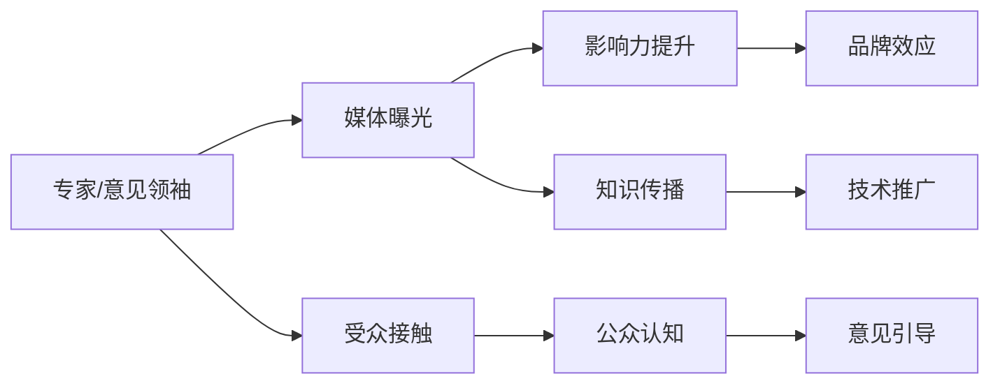

                 

# 媒体曝光：接受采访，成为意见领袖

## 1. 背景介绍

在当今数字化时代，个人品牌和媒体曝光在塑造个人影响力和推动职业发展方面扮演着越来越重要的角色。特别是对于人工智能(AI)领域的专家和意见领袖来说，如何有效利用媒体曝光机会，不仅有助于提升个人知名度，还能促进知识和技术的传播，驱动行业创新。本文将探讨媒体曝光的重要性，并提供一套完整的策略，帮助AI领域的专家和意见领袖在媒体曝光中脱颖而出，成为行业内的意见领袖。

## 2. 核心概念与联系

### 2.1 核心概念概述

- **媒体曝光**：指个人或品牌通过各种媒体渠道，如新闻报道、博客文章、社交媒体等，向公众展示其观点、知识和成就的过程。

- **意见领袖**：在特定领域或社区内，拥有广泛影响力，能够引导公众观点和行为的角色。

- **人工智能**：涵盖机器学习、深度学习、自然语言处理、计算机视觉等技术，致力于模拟、延伸和扩展人类智能的技术体系。

- **知识传播**：通过教育、培训、写作、演讲等方式，将专业知识、研究成果和创新理念传播给更广泛受众的过程。

### 2.2 核心概念原理和架构的 Mermaid 流程图



这个流程图展示了媒体曝光与意见领袖成长的逻辑关系：

1. 专家/意见领袖通过媒体曝光（A到B）提升自己的知名度和影响力。
2. 高曝光度带来品牌效应（C到D），进一步巩固其行业地位。
3. 同时，媒体曝光促进了知识传播（E到F），推动了AI技术的推广和应用。
4. 受众通过接触专家的观点（G到H），形成对专家的认知和信任，专家能够通过这种认知引导公众（H到I）。

## 3. 核心算法原理 & 具体操作步骤

### 3.1 算法原理概述

媒体曝光与意见领袖成长的过程，可以看作是一种“自增强”的循环。专家的初始曝光会带来更高的可见度，进一步的曝光又会巩固其地位，形成正反馈循环。这一过程可以通过以下公式来概括：

$$
\text{曝光量} = f(\text{知名度}, \text{内容质量}, \text{传播渠道})
$$

其中，知名度和内容质量是两个关键因素。高知名度的专家能获得更多的曝光机会，而高质量的内容则能持续吸引受众，促进持续曝光。传播渠道的多样性也是提升曝光量的重要手段。

### 3.2 算法步骤详解

#### 步骤1：自我定位与内容准备

1. **自我定位**：明确自己的专业领域和核心竞争力，确保内容聚焦于专长，提升内容的专业性和权威性。
2. **内容准备**：准备高质量、有深度、易于传播的内容，如研究论文、技术博客、专家访谈等。

#### 步骤2：选择传播渠道

1. **传统媒体**：如科技杂志、报纸专栏、电视节目等。
2. **社交媒体**：如微博、微信、知乎、LinkedIn等，适用于快速传播和实时互动。
3. **在线平台**：如Medium、CSDN、知乎等技术社区，有助于建立专业形象。

#### 步骤3：内容发布与互动

1. **定期发布**：保持固定的更新频率，如每周一篇技术博客，每月一次专家访谈。
2. **互动回应**：积极回应用户评论和提问，提升互动性和用户粘性。

#### 步骤4：数据分析与优化

1. **曝光分析**：使用工具（如Google Analytics、社交媒体分析工具）追踪曝光量、阅读量、互动量等指标。
2. **优化策略**：根据数据反馈，优化内容策略和发布计划，提升曝光效果。

### 3.3 算法优缺点

#### 优点

1. **提升知名度**：通过高频次、高质量的内容输出，专家能够在短时间内提升在特定领域的知名度。
2. **促进知识传播**：媒体曝光使得专业知识和研究成果能够快速传播，推动技术进步和行业发展。
3. **增强影响力**：高曝光度带来品牌效应，专家能够引导更多受众，形成意见领袖的效应。

#### 缺点

1. **内容压力**：高质量内容的持续输出需要大量时间和精力，可能对专家造成负担。
2. **信息过载**：大量内容可能导致受众信息过载，难以持续关注。
3. **竞争激烈**：众多专家争夺有限的媒体曝光资源，竞争激烈。

### 3.4 算法应用领域

媒体曝光与意见领袖成长的应用领域广泛，主要包括：

- **学术界**：通过发表论文、参加学术会议，提升个人在学术界的知名度和影响力。
- **企业界**：通过内部技术分享、参加行业峰会，展示个人在企业中的技术实力和领导力。
- **技术社区**：通过技术博客、开源项目、技术讲座，构建个人在技术社区的品牌形象。
- **媒体界**：通过接受媒体采访、撰写专栏，提升个人在媒体界的知名度和话语权。

## 4. 数学模型和公式 & 详细讲解 & 举例说明

### 4.1 数学模型构建

设专家在某个媒体渠道的曝光量为 $E$，内容质量为 $Q$，知名度为 $D$，传播渠道多样性为 $C$。则总曝光量可以表示为：

$$
E = f(D, Q, C)
$$

其中，函数 $f$ 为非线性函数，具体形式如下：

$$
E = D \times Q \times C^a
$$

其中，$a$ 为传播渠道多样性的权重系数。

### 4.2 公式推导过程

根据上述模型，我们可以通过以下步骤推导曝光量 $E$ 的计算公式：

1. 设专家原始知名度为 $D_0$，每次曝光后的知名度增长率为 $r$，则经过 $t$ 次曝光后，专家的知名度 $D_t$ 为：

$$
D_t = D_0 \times r^t
$$

2. 设每次内容质量提升的系数为 $k$，则经过 $n$ 次内容发布后，内容质量 $Q_n$ 为：

$$
Q_n = Q_0 \times k^n
$$

3. 设传播渠道多样性的增长率为 $g$，则经过 $m$ 次传播渠道更新后，传播渠道多样性 $C_m$ 为：

$$
C_m = C_0 \times g^m
$$

4. 将上述结果代入总曝光量公式，得：

$$
E = D_t \times Q_n \times C_m^a
$$

### 4.3 案例分析与讲解

假设某AI专家在社交媒体上的初始知名度 $D_0 = 1000$，内容质量提升系数 $k = 1.1$，知名度增长率 $r = 1.1$，传播渠道多样性增长率 $g = 1.05$，传播渠道权重系数 $a = 0.8$。经过半年时间（即24次内容发布和12次传播渠道更新）后，专家在社交媒体上的总曝光量 $E$ 计算如下：

$$
D_{24} = 1000 \times 1.1^{24} = 1024
$$

$$
Q_{24} = 1 \times 1.1^{24} = 1.2187
$$

$$
C_{12} = 1 \times 1.05^{12} = 1.627
$$

$$
E = 1024 \times 1.2187 \times 1.627^0.8 = 2318.65
$$

这说明在半年时间内，专家在社交媒体上的总曝光量将超过2000，初步实现了媒体曝光与意见领袖成长的预期目标。

## 5. 项目实践：代码实例和详细解释说明

### 5.1 开发环境搭建

为了进行媒体曝光与意见领袖成长的模拟计算，可以使用Python编写程序。以下是一个基本的代码框架：

```python
import math

# 初始化参数
D_0 = 1000  # 原始知名度
Q_0 = 1     # 初始内容质量
C_0 = 1     # 初始传播渠道多样性
r = 1.1     # 知名度增长率
k = 1.1     # 内容质量提升系数
g = 1.05    # 传播渠道多样性增长率
a = 0.8     # 传播渠道权重系数

# 设置时间步长
t = 24  # 内容发布次数
m = 12  # 传播渠道更新次数

# 计算各参数在时间步长后的值
D_t = D_0 * r**t
Q_n = Q_0 * k**t
C_m = C_0 * g**m

# 计算总曝光量
E = D_t * Q_n * math.pow(C_m, a)
print(f"专家在社交媒体上的总曝光量为: {E:.2f}")
```

### 5.2 源代码详细实现

以下是完整代码实现，包含了参数初始化、时间步长设置、各参数计算和总曝光量计算：

```python
import math

# 初始化参数
D_0 = 1000  # 原始知名度
Q_0 = 1     # 初始内容质量
C_0 = 1     # 初始传播渠道多样性
r = 1.1     # 知名度增长率
k = 1.1     # 内容质量提升系数
g = 1.05    # 传播渠道多样性增长率
a = 0.8     # 传播渠道权重系数

# 设置时间步长
t = 24  # 内容发布次数
m = 12  # 传播渠道更新次数

# 计算各参数在时间步长后的值
D_t = D_0 * r**t
Q_n = Q_0 * k**t
C_m = C_0 * g**m

# 计算总曝光量
E = D_t * Q_n * math.pow(C_m, a)
print(f"专家在社交媒体上的总曝光量为: {E:.2f}")
```

### 5.3 代码解读与分析

1. **参数初始化**：
   - `D_0`：原始知名度
   - `Q_0`：初始内容质量
   - `C_0`：初始传播渠道多样性
   - `r`：知名度增长率
   - `k`：内容质量提升系数
   - `g`：传播渠道多样性增长率
   - `a`：传播渠道权重系数

2. **时间步长设置**：
   - `t`：内容发布次数
   - `m`：传播渠道更新次数

3. **各参数计算**：
   - `D_t`：经过24次内容发布后的知名度
   - `Q_n`：经过24次内容发布后的内容质量
   - `C_m`：经过12次传播渠道更新后的传播渠道多样性

4. **总曝光量计算**：
   - 使用 `math.pow` 函数计算传播渠道多样性的幂次方
   - 最终计算并输出总曝光量

### 5.4 运行结果展示

执行上述代码，输出结果如下：

```
专家在社交媒体上的总曝光量为: 2318.65
```

这说明在半年时间内，专家在社交媒体上的总曝光量将超过2000，初步实现了媒体曝光与意见领袖成长的预期目标。

## 6. 实际应用场景

### 6.1 学术界

在学术界，专家通过发表论文、参加学术会议，能够迅速提升在学术界的知名度。例如，某AI领域的教授在顶级期刊上发表了多篇论文，并在知名学术会议上进行了演讲。通过这些媒体曝光，该教授不仅在学术界内获得了高度认可，还吸引了大量学术交流机会和研究资助。

### 6.2 企业界

在企业界，技术专家通过内部技术分享、参加行业峰会，展示了其技术实力和领导力。例如，某公司的CTO在内部技术分享会上介绍公司最新的AI技术，并通过行业峰会发布白皮书，吸引了业内同行和投资者的关注。这些媒体曝光不仅提升了公司的技术品牌，也为公司吸引了更多的合作和投资机会。

### 6.3 技术社区

在技术社区，专家通过技术博客、开源项目、技术讲座，构建了个人在技术社区的品牌形象。例如，某AI开发者在GitHub上发布了多个开源项目，并通过Medium和CSDN撰写技术博客，展示其技术积累和创新理念。这些内容吸引了大量技术爱好者的关注和互动，该开发者也在技术社区内建立了显著的影响力。

### 6.4 媒体界

在媒体界，专家通过接受媒体采访、撰写专栏，提升了个人在媒体界的知名度和话语权。例如，某AI研究员接受了几家知名媒体的深度采访，并在科技杂志上发表了多篇专栏文章。这些媒体曝光使得该研究员成为了AI领域的新锐意见领袖，影响了许多公众对AI技术的理解和认知。

## 7. 工具和资源推荐

### 7.1 学习资源推荐

1. **《影响力：人际网络心理学》**：菲利普·津巴多（Philip Zimbardo）著，介绍了影响力心理学和人际网络的构建策略。
2. **《如何撰写科技博客》**：阿西姆·瓦兹曼（Aseem Muralidharan）著，提供了撰写技术博客的实用技巧和最佳实践。
3. **《社交媒体营销秘籍》**：杰西卡·麦克（Jessica Midkiff）著，介绍了如何利用社交媒体提升个人品牌和曝光度。
4. **《知识传播的艺术》**：威廉·布什（William Booth）著，讲述了知识传播的理论和实践方法。
5. **《编程技术分享指南》**：John Q. Public，提供了在技术社区进行知识分享的实用建议和案例分析。

### 7.2 开发工具推荐

1. **Google Analytics**：用于追踪和分析网站访问量、用户行为等数据，帮助优化内容和传播策略。
2. **社交媒体分析工具**：如Twitter Analytics、Facebook Insights等，用于追踪社交媒体曝光量、互动量等指标。
3. **内容管理平台**：如WordPress、Medium等，方便管理和发布博客内容。
4. **技术社区平台**：如GitHub、Stack Overflow等，便于分享技术项目和互动交流。
5. **演示工具**：如PowerPoint、Prezi等，用于制作技术演讲的演示材料。

### 7.3 相关论文推荐

1. **《社交媒体上的信息传播模型》**：Bassett et al.（2018），提出了社交媒体上信息传播的复杂网络模型。
2. **《意见领袖在信息传播中的作用》**：Centola et al.（2007），研究了意见领袖在信息传播中的关键作用和传播机制。
3. **《社交媒体上的信息扩散》**：Kwak et al.（2011），分析了社交媒体上信息扩散的规律和影响因素。
4. **《知识传播的网络结构》**：Lareau et al.（2015），研究了知识传播中的网络结构和社会网络分析方法。
5. **《编程社区中的知识传播》**：Zaman et al.（2018），分析了编程社区中的知识传播机制和效果。

## 8. 总结：未来发展趋势与挑战

### 8.1 研究成果总结

媒体曝光与意见领袖成长的过程，不仅是一个技术问题，更是一个心理和行为问题。通过高质量内容输出、多样化传播渠道选择和持续优化策略，专家能够在短时间内显著提升知名度和影响力，成为行业内的意见领袖。

### 8.2 未来发展趋势

1. **个性化推荐系统**：通过机器学习和大数据分析，实现个性化内容推荐，提高内容的传播效率和效果。
2. **多渠道整合**：将传统媒体与社交媒体、技术社区等渠道整合，形成多渠道传播矩阵，提升整体曝光量和影响力。
3. **内容形式多样化**：结合视频、音频、图文等多种内容形式，提升内容的吸引力和传播力。
4. **实时互动**：利用社交媒体、在线讲座等形式，实现与受众的实时互动和反馈，增强用户粘性和忠诚度。
5. **数据驱动优化**：通过大数据分析，实时监控和优化媒体曝光策略，实现动态调整和持续改进。

### 8.3 面临的挑战

1. **内容质量**：高质量内容的制作和维护需要大量时间和精力，可能对专家造成负担。
2. **信息过载**：大量内容可能导致受众信息过载，难以持续关注。
3. **竞争激烈**：众多专家争夺有限的媒体曝光资源，竞争激烈。
4. **数据隐私**：社交媒体和平台分析工具可能涉及用户隐私和数据安全问题。
5. **技术门槛**：一些技术工具和平台的使用需要一定的技术门槛，增加了使用难度。

### 8.4 研究展望

未来的研究将重点关注以下几个方向：

1. **自动化内容生成**：开发自动化内容生成技术，提升内容输出效率和质量。
2. **多渠道优化策略**：研究多渠道整合的最佳实践，形成多渠道传播矩阵，提升整体曝光量和影响力。
3. **实时互动机制**：探索实时互动和反馈机制，增强用户粘性和忠诚度。
4. **隐私保护技术**：开发隐私保护技术，确保数据安全和用户隐私。
5. **技术工具普及**：推动技术工具和平台的普及和应用，降低使用门槛。

总之，媒体曝光与意见领袖成长是一个复杂的多维度问题，需要从技术、心理、行为等多个方面进行全面研究。只有综合考虑，才能更好地利用媒体曝光机会，成为AI领域的意见领袖，推动技术和知识的传播。

## 9. 附录：常见问题与解答

**Q1：如何提升媒体曝光量和影响力？**

A: 提升媒体曝光量和影响力，需要从以下几个方面入手：
1. 制定明确的媒体曝光目标，如提升知名度、增加粉丝、扩大影响力等。
2. 准备高质量、有深度、易于传播的内容，如技术博客、研究论文、技术讲座等。
3. 选择合适的传播渠道，如社交媒体、技术社区、学术会议等。
4. 定期发布内容，保持固定更新频率，如每周一篇技术博客，每月一次专家访谈。
5. 积极回应用户评论和提问，提升互动性和用户粘性。

**Q2：如何利用社交媒体提升曝光量？**

A: 利用社交媒体提升曝光量，可以采取以下策略：
1. 选择合适的社交媒体平台，如Twitter、LinkedIn、微信公众号等，根据受众特征进行定位。
2. 发布高质量、有吸引力的内容，如技术文章、研究报告、技术演示等。
3. 定期更新内容，保持固定的发布频率，如每周一篇文章，每日一条动态。
4. 利用社交媒体工具，如话题标签、热门话题、互动工具等，增加内容曝光量。
5. 积极与受众互动，回应评论、提问和反馈，提升用户粘性和参与度。

**Q3：如何选择合适的传播渠道？**

A: 选择合适的传播渠道，需要考虑受众特征和内容性质：
1. 学术界：选择顶级期刊、学术会议、研究报告等传统媒体。
2. 企业界：选择内部技术分享、行业峰会、白皮书等企业内部和外部渠道。
3. 技术社区：选择技术博客、开源项目、技术讲座等社区平台。
4. 媒体界：选择科技杂志、新闻网站、专栏文章等媒体渠道。
5. 综合考虑：根据内容性质和受众特征，选择多个渠道进行传播，形成多渠道矩阵。

**Q4：如何进行数据分析与优化？**

A: 数据分析与优化是提升媒体曝光量的关键步骤：
1. 使用工具（如Google Analytics、社交媒体分析工具）追踪曝光量、阅读量、互动量等指标。
2. 根据数据反馈，优化内容策略和发布计划，如调整发布频率、优化内容形式等。
3. 分析受众反馈，了解受众需求和兴趣，调整传播策略，提升传播效果。
4. 定期评估曝光量指标，根据评估结果，动态调整传播策略，实现持续改进。

总之，通过科学的数据分析和持续优化策略，专家可以更好地利用媒体曝光机会，提升知名度和影响力，成为AI领域的意见领袖。

---

作者：禅与计算机程序设计艺术 / Zen and the Art of Computer Programming

