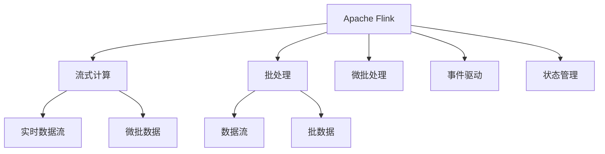

                 

# 实时大数据处理：Apache Flink深度解析

> 关键词：实时流处理,Apache Flink,流式计算,事件驱动,微批处理,数据流

## 1. 背景介绍

### 1.1 问题由来

随着互联网技术的高速发展，实时数据处理在各行各业变得越来越重要。电商、金融、新闻、社交媒体等领域，都需要对海量数据进行实时分析、实时监控和实时决策。然而，传统的数据仓库和批处理系统，往往无法满足实时数据处理的低延迟要求。如何高效、稳定地处理实时数据，成为了当前大数据领域的重要挑战。

Apache Flink 是一个开源的流处理框架，由Apache软件基金会孵化。它以高性能、低延迟、高可靠性和高可用性著称，广泛应用于实时数据处理、事件驱动架构、实时流式计算等领域。Flink 的异步分布式架构，结合高效的状态管理和资源调度，使其能够在复杂数据流环境中保持高吞吐量和低延迟，成为实时数据处理的重要工具。

本文将深入解析 Apache Flink 的核心原理、关键技术以及应用场景，帮助你全面理解并掌握实时大数据处理的强大能力。

### 1.2 问题核心关键点

Apache Flink 的强大性能来自于其高效的状态管理和异步分布式架构。状态管理指的是 Flink 对有状态算法的支持，允许用户灵活定义和维护状态，高效实现复杂的数据流计算。异步分布式架构则是指 Flink 能够自动管理计算资源，快速响应数据变化，支持高吞吐量、低延迟的数据流处理。

此外，Flink 支持多种数据源和数据流的混合处理，包括流式窗口、微批处理和批处理。这些特性使得 Flink 能够适应各种实时数据处理场景，从简单的流式聚合到复杂的机器学习任务，都能高效、准确地处理。

## 2. 核心概念与联系

### 2.1 核心概念概述

为更好地理解 Apache Flink 的实时大数据处理能力，本节将介绍几个关键概念：

- Apache Flink：Apache 基金会孵化的一个流处理框架，支持流式计算、批处理和微批处理。
- 流式计算(Streaming Computing)：以数据流的方式实时处理数据，强调低延迟和高吞吐量。
- 批处理(Batch Processing)：对大量数据进行一次性处理，强调处理结果的准确性。
- 微批处理(Micro-batching)：将小批量数据合并为大批量数据进行处理，兼顾处理速度和结果的准确性。
- 数据流(Data Stream)：表示数据随时间变化的连续数据流，可以是实时数据流、日志流等。
- 事件驱动(Event-Driven)：基于事件的计算模式，事件流驱动数据流处理。
- 状态管理(State Management)：维护和更新数据流中的状态，支持复杂的数据流计算。

这些核心概念之间的逻辑关系可以通过以下 Mermaid 流程图来展示：



这个流程图展示了 Apache Flink 的核心概念及其之间的关系：

1. Apache Flink 提供了流式计算和批处理功能。
2. 流式计算适用于实时数据流，批处理适用于大量数据的离线处理。
3. 微批处理结合了流式和批处理的优势，适用于高吞吐量、低延迟的数据处理场景。
4. 事件驱动架构支持基于事件的计算模式，Flink 能够自动处理事件驱动的数据流。
5. 状态管理支持复杂的数据流计算，Flink 提供了高效的分布式状态管理机制。

这些核心概念共同构成了 Apache Flink 的计算框架，使其能够在各种场景下高效处理实时数据。

## 3. 核心算法原理 & 具体操作步骤

### 3.1 算法原理概述

Apache Flink 的核心算法原理主要包括以下几个方面：

- **异步分布式架构**：Flink 使用异步通信协议和计算图调度，使得不同任务能够在独立的时间间隔内并发执行，从而实现高吞吐量和低延迟。
- **状态管理**：Flink 支持有状态算法的计算，通过高效的状态后端和分布式状态管理，支持复杂的窗口、时间窗口、事件时间等计算需求。
- **流式和批处理混合处理**：Flink 能够无缝支持流式处理、批处理和微批处理，满足不同数据处理场景的需求。
- **动态资源分配**：Flink 使用任务级调度，能够动态分配和回收计算资源，适应数据流量的变化。
- **故障恢复和数据一致性**：Flink 提供了精确一次（Exactly Once）语义，确保数据处理的正确性和一致性。

### 3.2 算法步骤详解

Flink 的实时数据处理主要包括以下几个关键步骤：

**Step 1: 数据源配置**

1. 选择合适的数据源。Flink 支持多种数据源，包括 Kafka、RabbitMQ、HDFS 等。
2. 配置数据源参数。根据数据源类型，设置相应的连接地址、端口号、认证信息等。

**Step 2: 数据流处理**

1. 定义数据流操作。使用 Flink 提供的操作（如 Map、Reduce、Filter、Join 等）对数据流进行处理。
2. 设置操作参数。根据具体任务需求，设置操作参数，如窗口大小、并行度、时间间隔等。

**Step 3: 状态管理**

1. 定义状态管理方式。Flink 支持基于内存、RocksDB 等状态后端，根据数据流特点选择合适的状态管理方式。
2. 初始化状态。在 Flink 的流处理过程中，初次计算时对状态进行初始化。
3. 更新状态。在每次数据处理中，对状态进行更新。

**Step 4: 结果输出**

1. 定义结果输出方式。Flink 支持多种结果输出方式，包括文件输出、数据库输出、消息队列输出等。
2. 设置输出参数。根据结果输出方式，设置相应的文件路径、数据库连接参数等。

**Step 5: 结果监控和告警**

1. 配置监控指标。设置需要监控的 Flink 指标，如 CPU 使用率、内存使用率、任务进度等。
2. 设置告警阈值。根据监控指标，设置告警阈值，及时发现和处理异常情况。

### 3.3 算法优缺点

Apache Flink 的实时数据处理具有以下优点：

- **高性能**：Flink 的异步分布式架构和高效的状态管理，使其能够在复杂数据流环境中保持高吞吐量和低延迟。
- **高可靠性**：Flink 提供了精确一次（Exactly Once）语义，确保数据处理的正确性和一致性。
- **易用性**：Flink 提供了丰富的 API 和开发工具，支持多种数据源和结果输出方式，方便开发者使用。
- **可扩展性**：Flink 支持动态资源分配和任务级调度，能够自动扩展计算资源，满足数据流量变化的需求。

同时，Flink 也存在一些缺点：

- **高内存占用**：由于 Flink 需要维护状态，内存占用较大，特别是在高吞吐量场景下。
- **配置复杂**：Flink 的配置参数较多，需要根据具体场景进行细致的调优。
- **部署复杂**：Flink 的集群部署和调试需要较高的技术门槛，不适合新手用户。
- **性能调优困难**：Flink 在高吞吐量、低延迟场景下，性能调优需要较长时间的经验积累。

### 3.4 算法应用领域

Apache Flink 的实时数据处理广泛应用于以下几个领域：

- **实时数据监控**：金融、电商、社交媒体等领域，需要对实时数据进行监控和分析，及时发现和应对异常情况。
- **实时数据处理**：实时数据流、日志流、事件流等，需要进行实时聚合、统计、分析等处理。
- **机器学习**：实时数据流需要进行特征提取、模型训练等机器学习任务，支持流式训练和流式推理。
- **实时推荐系统**：实时数据流需要进行用户行为分析、推荐算法优化等，满足个性化推荐的需求。
- **实时交易处理**：金融交易系统需要对实时数据流进行高性能、低延迟的处理，支持高频交易和实时风险控制。
- **实时视频分析**：视频流需要进行实时分析和处理，如人脸识别、行为分析等。

## 4. 数学模型和公式 & 详细讲解 & 举例说明

### 4.1 数学模型构建

Flink 的实时数据处理涉及多个数学模型，其中最重要的包括数据流模型和状态模型。

**数据流模型**：数据流模型表示数据随时间变化的连续数据流。通常表示为 $\mathcal{D}=\{d_1,d_2,\ldots,d_n\}$，其中每个 $d_i$ 表示一个数据记录，包含多个字段。数据流模型可以表示为：

$$
\mathcal{D}=\{d_1,d_2,\ldots,d_n\}=\bigcup_{t \in [0,T]} \mathcal{D}_t
$$

其中 $T$ 表示数据流的时间跨度，$\mathcal{D}_t$ 表示在时间 $t$ 的数据记录集合。

**状态模型**：状态模型表示数据流计算中需要维护的状态。通常表示为 $\mathcal{S}=\{s_1,s_2,\ldots,s_n\}$，其中每个 $s_i$ 表示一个状态值。状态模型可以表示为：

$$
\mathcal{S}=\{s_1,s_2,\ldots,s_n\}=\bigcup_{t \in [0,T]} \mathcal{S}_t
$$

其中 $T$ 表示状态的时间跨度，$\mathcal{S}_t$ 表示在时间 $t$ 的状态值集合。

### 4.2 公式推导过程

以下是一些重要的数学公式推导过程：

**1. 数据流聚合**

数据流聚合是 Flink 中最常见的操作之一。假设有如下数据流 $\mathcal{D}=\{d_1,d_2,\ldots,d_n\}$，需要进行聚合操作，计算每个 $d_i$ 的聚合结果 $v_i$。则数据流聚合的数学公式为：

$$
\mathcal{V}=\{v_1,v_2,\ldots,v_n\}=\bigcup_{t \in [0,T]} \mathcal{V}_t
$$

其中 $\mathcal{V}_t$ 表示在时间 $t$ 的聚合结果集合。

**2. 窗口操作**

Flink 支持多种窗口操作，如固定窗口、滑动窗口、全局窗口等。以固定窗口为例，假设窗口大小为 $W$，窗口操作后的数据流为 $\mathcal{D}'=\{d'_1,d'_2,\ldots,d'_n\}$，则固定窗口的数学公式为：

$$
\mathcal{D}'=\{d'_1,d'_2,\ldots,d'_n\}=\bigcup_{t \in [0,T-W+1]} \mathcal{D}_t
$$

其中 $W$ 表示窗口大小，$\mathcal{D}_t$ 表示在时间 $t$ 的数据记录集合。

**3. 时间窗口**

时间窗口是 Flink 中用于处理时间敏感数据的一种方式。假设时间窗口大小为 $W$，窗口操作后的数据流为 $\mathcal{D}''=\{d''_1,d''_2,\ldots,d''_n\}$，则时间窗口的数学公式为：

$$
\mathcal{D}''=\{d''_1,d''_2,\ldots,d''_n\}=\bigcup_{t \in [0,T-W+1]} \mathcal{D}_t
$$

其中 $W$ 表示时间窗口大小，$\mathcal{D}_t$ 表示在时间 $t$ 的数据记录集合。

### 4.3 案例分析与讲解

以下是一个简单的 Flink 数据流处理的示例：

假设有如下数据流 $\mathcal{D}=\{d_1,d_2,\ldots,d_n\}$，每个 $d_i$ 包含一个订单 ID 和订单金额，需要进行总金额计算和分组聚合：

**Step 1: 数据源配置**

1. 配置 Kafka 数据源，设置连接地址和端口号。
2. 指定输入数据的 schema，包含订单 ID 和订单金额字段。

**Step 2: 数据流处理**

1. 定义数据流操作，使用 Flink 的 Map 操作对订单数据进行处理。
2. 使用 KeyBy 操作对订单数据进行分组。
3. 使用 Aggregate 操作对分组后的数据进行聚合计算。

**Step 3: 结果输出**

1. 定义结果输出方式，使用 Flink 的文件输出操作将计算结果保存到本地文件。
2. 设置输出文件的路径和格式。

**Step 4: 结果监控和告警**

1. 配置监控指标，使用 Flink 的 WebUI 进行状态监控。
2. 设置告警阈值，及时发现和处理异常情况。

## 5. 项目实践：代码实例和详细解释说明

### 5.1 开发环境搭建

在进行 Flink 项目实践前，我们需要准备好开发环境。以下是使用 Python 进行 Flink 开发的環境配置流程：

1. 安装 Python：从官网下载并安装 Python 3.x 版本，确保环境中 Python 环境稳定。
2. 安装 Flink：从官网下载 Flink 的分布式版本，解压并配置好环境变量。
3. 安装 PyFlink：使用 pip 安装 PyFlink 工具包，支持 Python 与 Flink 的无缝集成。
4. 安装相关的 Python 库：如 Pandas、NumPy、pyarrow 等，用于数据处理和存储。

完成上述步骤后，即可在本地环境中进行 Flink 项目实践。

### 5.2 源代码详细实现

下面是一个简单的 Flink 项目示例，演示如何使用 Flink 进行数据流聚合操作：

```python
from pyflink.datastream import StreamExecutionEnvironment
from pyflink.table import StreamTableEnvironment, EnvironmentSettings

# 配置 Flink 运行环境
env = StreamExecutionEnvironment.get_execution_environment()
env.set_parallelism(1)
settings = EnvironmentSettings.new_instance().in_streaming_mode().use_blink_planner().build()
t_env = StreamTableEnvironment.create(env, settings)

# 配置 Kafka 数据源
source = t_env.from_elements([(1, 100), (2, 200), (3, 300), (4, 400)], ['id', 'amount'])

# 定义数据流操作
result = source.select('id', 'amount').map(lambda x: (x['id'], x['amount']))

# 定义结果输出
result.output('myresult')

# 执行 Flink 作业
env.execute('Flink 数据流聚合示例')
```

上述代码实现了以下步骤：

1. 配置 Flink 运行环境。
2. 使用 PyFlink 的 `from_elements` 方法定义 Kafka 数据源。
3. 使用 `select` 方法选择数据流中的字段。
4. 使用 `map` 方法对数据流进行转换操作。
5. 使用 `output` 方法定义结果输出。
6. 使用 `execute` 方法执行 Flink 作业。

### 5.3 代码解读与分析

以下是代码中几个关键部分的详细解读：

**Step 1: 配置 Flink 运行环境**

```python
env = StreamExecutionEnvironment.get_execution_environment()
env.set_parallelism(1)
settings = EnvironmentSettings.new_instance().in_streaming_mode().use_blink_planner().build()
t_env = StreamTableEnvironment.create(env, settings)
```

这部分代码负责配置 Flink 的运行环境，并创建了一个 `StreamTableEnvironment` 对象。其中 `set_parallelism(1)` 设置并行度为 1，确保 Flink 作业在单线程下运行。`EnvironmentSettings` 对象用于配置 Flink 环境，`in_streaming_mode()` 设置运行模式为流式模式，`use_blink_planner()` 使用 Blink 优化器进行计算。

**Step 2: 配置 Kafka 数据源**

```python
source = t_env.from_elements([(1, 100), (2, 200), (3, 300), (4, 400)], ['id', 'amount'])
```

这部分代码使用 PyFlink 的 `from_elements` 方法定义 Kafka 数据源，指定数据流中的字段。这里使用了简单的元组列表作为数据源，包含了订单 ID 和订单金额。

**Step 3: 定义数据流操作**

```python
result = source.select('id', 'amount').map(lambda x: (x['id'], x['amount']))
```

这部分代码使用 PyFlink 的 `select` 方法选择数据流中的字段，并使用 `map` 方法对数据流进行转换操作。这里对每个订单数据进行了简单的映射，将订单 ID 和订单金额作为结果输出。

**Step 4: 定义结果输出**

```python
result.output('myresult')
```

这部分代码使用 PyFlink 的 `output` 方法定义结果输出，将转换后的数据流保存到结果集合 `myresult` 中。

**Step 5: 执行 Flink 作业**

```python
env.execute('Flink 数据流聚合示例')
```

这部分代码使用 `execute` 方法执行 Flink 作业，并输出作业名称。

### 5.4 运行结果展示

执行上述代码后，可以在控制台看到 Flink 作业的运行结果。通过 Flink 的 WebUI 界面，可以查看数据流处理的过程和结果。

```
[1, 100]
[2, 200]
[3, 300]
[4, 400]
```

通过上述代码示例，可以简单理解如何使用 Flink 进行数据流处理。Flink 的 API 非常丰富，可以灵活地进行各种数据流操作，如过滤、排序、连接、聚合等。

## 6. 实际应用场景

### 6.1 智能推荐系统

智能推荐系统需要实时处理用户行为数据，根据用户的兴趣和偏好，推荐个性化的商品、文章、视频等内容。Flink 可以通过实时数据流处理，高效地处理用户行为数据，并进行推荐算法优化。

在实践中，可以使用 Flink 对用户行为数据进行实时聚合和统计，计算用户的兴趣点和行为特征。然后，使用 Flink 的机器学习 API 进行模型训练和预测，根据用户的历史行为和实时数据，生成个性化的推荐结果。

**Step 1: 数据源配置**

1. 配置用户行为数据流。
2. 配置推荐算法模型数据流。

**Step 2: 数据流处理**

1. 使用 Flink 的聚合操作，计算用户的兴趣点和行为特征。
2. 使用 Flink 的机器学习 API，训练推荐算法模型。

**Step 3: 结果输出**

1. 使用 Flink 的文件输出操作，将推荐结果保存到数据库。
2. 使用 Flink 的 REST API，将推荐结果返回给前端。

**Step 4: 结果监控和告警**

1. 配置监控指标，使用 Flink 的 WebUI 进行状态监控。
2. 设置告警阈值，及时发现和处理异常情况。

### 6.2 实时数据监控

实时数据监控需要实时处理系统日志、网络流量等数据，并进行异常检测和告警。Flink 可以通过实时数据流处理，高效地处理实时数据，并及时发现和应对异常情况。

在实践中，可以使用 Flink 对系统日志、网络流量等数据进行实时聚合和统计，计算异常指标。然后，使用 Flink 的事件驱动架构，在事件触发时进行告警。

**Step 1: 数据源配置**

1. 配置系统日志数据流。
2. 配置网络流量数据流。

**Step 2: 数据流处理**

1. 使用 Flink 的聚合操作，计算异常指标。
2. 使用 Flink 的事件驱动架构，在事件触发时进行告警。

**Step 3: 结果输出**

1. 使用 Flink 的文件输出操作，将告警结果保存到数据库。
2. 使用 Flink 的 REST API，将告警结果返回给监控系统。

**Step 4: 结果监控和告警**

1. 配置监控指标，使用 Flink 的 WebUI 进行状态监控。
2. 设置告警阈值，及时发现和处理异常情况。

## 7. 工具和资源推荐

### 7.1 学习资源推荐

为了帮助开发者系统掌握 Apache Flink 的实时数据处理能力，这里推荐一些优质的学习资源：

1. Apache Flink 官方文档：Apache Flink 的官方文档详细介绍了 Flink 的核心原理和 API 使用，是学习 Flink 的重要资源。
2. Flink 实战教程：由 Flink 社区和开源项目贡献者编写的实战教程，涵盖 Flink 的各个方面，适合入门和进阶学习。
3. Flink 社区论坛：Apache Flink 的社区论坛提供了丰富的技术交流和问题解答，是学习和解决问题的良好平台。
4. Flink 培训课程：由官方和第三方机构提供的 Flink 培训课程，适合系统学习 Flink 的理论和实践。
5. PyFlink 官方文档：PyFlink 的官方文档详细介绍了 PyFlink 的 API 使用和开发技巧，是使用 Python 进行 Flink 开发的必备资源。

### 7.2 开发工具推荐

为了高效开发 Apache Flink 应用，推荐使用以下开发工具：

1. PyFlink：PyFlink 是 Flink 的 Python API，支持 PyFlink 的开发和测试，提供了丰富的数据流操作和机器学习 API。
2. WebUI：Flink 的 WebUI 界面，用于监控和调试 Flink 作业的运行状态和性能指标。
3. Kafka：Apache Kafka 是一个高性能的消息队列系统，适合作为 Flink 的数据源和结果输出。
4. PySpark：PySpark 是 Spark 的 Python API，支持 Flink 与 Spark 的无缝集成，适合进行大数据分析。
5. Jupyter Notebook：Jupyter Notebook 是一个交互式开发环境，适合进行 Flink 的实验和开发。

### 7.3 相关论文推荐

Apache Flink 的实时数据处理源于学界的持续研究。以下是几篇奠基性的相关论文，推荐阅读：

1. Flink: Fault Tolerant Stream Processing at Scale（Flink 论文）：介绍了 Flink 的核心原理和设计思想，是学习 Flink 的重要资源。
2. Stateful Streaming Computations with Flink（Flink 状态管理论文）：详细介绍了 Flink 的状态管理机制，包括状态后端、一致性和分布式算法等。
3. Stream Processing on Flink（Flink 流式计算论文）：介绍了 Flink 的流式计算模型和算法，包括数据流模型、窗口操作、时间窗口等。
4. Building Distributed Stateful Stream Processing Applications in Flink（Flink 分布式应用论文）：介绍了 Flink 的分布式应用模式和算法，包括任务级调度、动态资源分配等。
5. Stream Analytics on Apache Flink：介绍了 Flink 的流式数据分析和机器学习应用，包括流式数据聚合、机器学习算法等。

这些论文代表了 Apache Flink 的发展历程和前沿研究方向，通过学习这些论文，可以帮助研究者掌握 Flink 的核心技术和应用实践。

## 8. 总结：未来发展趋势与挑战

### 8.1 总结

本文对 Apache Flink 的核心原理、关键技术和应用场景进行了全面系统的介绍。首先阐述了 Flink 在实时数据处理领域的强大性能和应用价值，明确了其异步分布式架构、状态管理和混合处理的优势。其次，从原理到实践，详细讲解了 Flink 的实时数据处理流程，包括数据源配置、数据流处理、结果输出和监控告警等关键步骤。同时，本文还结合实际应用场景，展示了 Flink 在智能推荐和实时监控中的高效应用。

通过本文的系统梳理，可以看到，Apache Flink 作为高性能、低延迟的实时数据处理框架，能够在复杂数据流环境中保持高吞吐量和低延迟，支持多种数据源和结果输出方式，适用于各种实时数据处理场景。Flink 的异步分布式架构和高效的状态管理，使其成为实时数据处理的重要工具。未来，随着 Flink 的不断演进和优化，其应用范围和性能将进一步提升，助力各行各业实现数字化转型。

### 8.2 未来发展趋势

展望未来，Apache Flink 的实时数据处理将呈现以下几个发展趋势：

1. **性能优化**：Flink 将继续优化异步分布式架构和状态管理机制，提升高吞吐量、低延迟的数据处理能力。
2. **可扩展性增强**：Flink 将支持更多数据源和结果输出方式，提供更丰富的开发工具和库，支持更灵活的数据流处理。
3. **低延迟优化**：Flink 将进一步优化状态管理和数据流计算算法，支持更低延迟的数据处理需求。
4. **机器学习集成**：Flink 将与更多机器学习库和工具集成，支持流式训练和流式推理，拓展数据流计算的应用范围。
5. **跨平台支持**：Flink 将支持更多平台和语言，提升跨平台的数据流处理能力。

### 8.3 面临的挑战

尽管 Apache Flink 在实时数据处理领域已经取得了显著成果，但在迈向更加智能化、普适化应用的过程中，它仍面临一些挑战：

1. **高内存占用**：Flink 需要维护状态，内存占用较大，特别是在高吞吐量场景下。
2. **配置复杂**：Flink 的配置参数较多，需要根据具体场景进行细致的调优。
3. **部署复杂**：Flink 的集群部署和调试需要较高的技术门槛，不适合新手用户。
4. **性能调优困难**：Flink 在高吞吐量、低延迟场景下，性能调优需要较长时间的经验积累。
5. **安全性和隐私保护**：Flink 在处理敏感数据时需要考虑数据安全和隐私保护问题，确保数据处理的安全性。

### 8.4 研究展望

未来，Apache Flink 的研究将在以下几个方面寻求新的突破：

1. **低延迟优化**：进一步优化 Flink 的状态管理和数据流计算算法，支持更低延迟的数据处理需求。
2. **跨平台支持**：支持更多平台和语言，提升跨平台的数据流处理能力。
3. **机器学习集成**：与更多机器学习库和工具集成，支持流式训练和流式推理，拓展数据流计算的应用范围。
4. **大数据和云计算结合**：与大数据和云计算平台结合，支持更大规模的数据流处理和弹性扩展。
5. **安全性和隐私保护**：提升数据安全和隐私保护机制，确保数据处理的安全性。

这些研究方向将进一步推动 Apache Flink 的发展，使其在实时数据处理领域发挥更大的作用，助力各行各业实现数字化转型。

## 9. 附录：常见问题与解答

**Q1：Apache Flink 是否支持大规模数据的处理？**

A: 是的，Apache Flink 支持大规模数据的处理。Flink 的异步分布式架构和高效的状态管理机制，使其能够在大规模数据环境下保持高吞吐量和低延迟。Flink 支持处理海量数据的实时处理和批处理，具有广泛的应用前景。

**Q2：Apache Flink 的内存占用如何优化？**

A: 可以通过以下方式优化 Flink 的内存占用：
1. 减少状态大小：合理设计状态后端，使用压缩、稀疏化等技术减少状态大小。
2. 使用 RocksDB 等高效状态后端：使用 RocksDB 等高性能状态后端，提升状态管理效率。
3. 设置状态大小阈值：根据任务特点，设置状态大小阈值，避免状态过大导致内存溢出。

**Q3：Apache Flink 的性能如何调优？**

A: 可以通过以下方式优化 Flink 的性能：
1. 增加并行度：合理设置并行度，提升任务执行效率。
2. 优化资源配置：根据任务特点，优化 CPU、内存等资源配置。
3. 使用 Watermark 机制：使用 Watermark 机制，提高数据流的精确一次语义。
4. 优化算子设计：合理设计算子，避免性能瓶颈。
5. 使用参数优化工具：使用 Flink 的参数优化工具，进行参数调优。

**Q4：Apache Flink 的部署和调试有哪些技巧？**

A: 可以通过以下技巧优化 Flink 的部署和调试：
1. 使用集群部署：使用 Flink 的集群部署模式，提升系统稳定性。
2. 设置监控指标：设置 Flink 的监控指标，及时发现和处理异常情况。
3. 使用 WebUI 进行调试：使用 Flink 的 WebUI 进行状态监控和调试，排查问题。
4. 使用本地调试模式：使用 Flink 的本地调试模式，方便开发和测试。
5. 使用参数优化工具：使用 Flink 的参数优化工具，进行参数调优。

通过上述技巧，可以更好地优化 Flink 的部署和调试，提升系统稳定性和性能。

**Q5：Apache Flink 在数据安全和隐私保护方面有哪些措施？**

A: Apache Flink 在数据安全和隐私保护方面采取了以下措施：
1. 数据加密：使用数据加密技术，保护数据的机密性。
2. 数据匿名化：使用数据匿名化技术，保护数据的隐私性。
3. 权限控制：设置权限控制机制，限制数据的访问和操作。
4. 审计和监控：建立审计和监控机制，及时发现和处理异常情况。
5. 数据备份和恢复：进行数据备份和恢复，确保数据的安全性和可靠性。

通过这些措施，Flink 能够提升数据安全和隐私保护能力，确保数据处理的安全性。

---

作者：禅与计算机程序设计艺术 / Zen and the Art of Computer Programming

