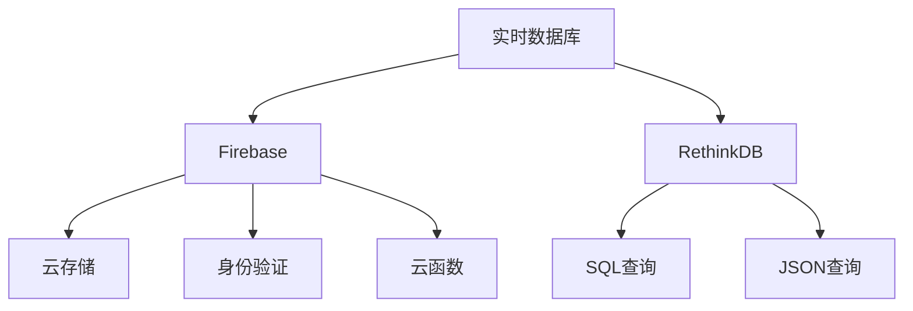

                 

# 实时数据库：Firebase与RethinkDB

## 1. 背景介绍

随着Web应用的发展和移动设备的普及，实时数据的需求变得越来越重要。从社交媒体到在线游戏，从金融交易到物联网设备，实时数据应用场景不断扩大。而实时数据库（Real-time Database）作为数据存储解决方案，能够满足这些场景对实时数据访问的需求。

本文将从实时数据库的基本概念出发，对比Firebase和RethinkDB这两种流行的实时数据库，详细讲解它们的原理、特点及应用。通过这些深入剖析，希望能帮助开发者更好地理解这两种实时数据库，并在实际项目中选择合适的方案。

## 2. 核心概念与联系

### 2.1 核心概念概述

为了更好地理解Firebase和RethinkDB，我们先来介绍一些核心概念：

- **实时数据库**：一种能够提供实时数据访问的数据库，支持即时读写、订阅和同步功能，适用于需要实时数据更新的应用场景。

- **Firebase**：Google提供的一种后端即服务（Backend as a Service, BaaS）平台，包含实时数据库、云存储、身份验证、云函数等服务，旨在简化Web和移动应用的开发和维护。

- **RethinkDB**：一种高度可扩展的分布式实时数据库，以JavaScript为编程接口，支持SQL和JSON查询语言。

这些核心概念之间的逻辑关系可以通过以下Mermaid流程图来展示：



从上述流程图可以看出，Firebase和RethinkDB均属于实时数据库，但Firebase提供了更多附加服务，如云存储、身份验证和云函数。RethinkDB则专注于实时数据存储和查询，支持SQL和JSON查询语言。

## 3. 核心算法原理 & 具体操作步骤

### 3.1 算法原理概述

实时数据库的核心在于其能够提供实时数据访问和订阅功能，支持即时读写和同步。这种实时性是通过数据的分布式存储和数据订阅机制实现的。当数据发生变化时，系统会即时通知所有订阅者，保证数据的实时同步。

### 3.2 算法步骤详解

这里以Firebase和RethinkDB为例，详细介绍实时数据库的算法步骤：

#### 3.2.1 Firebase

1. **数据存储**：Firebase的实时数据库存储在Google Cloud上，支持实时数据访问和分布式同步。

2. **数据订阅**：用户可以订阅数据的变化，当数据发生变化时，系统会实时通知订阅者。

3. **实时更新**：Firebase支持数据实时更新，即数据变化后，用户可以即时获取到最新的数据。

4. **数据安全**：Firebase提供了数据安全性机制，如数据加密、访问控制等。

#### 3.2.2 RethinkDB

1. **数据存储**：RethinkDB支持分布式存储，可以在多个节点上存储数据。

2. **数据同步**：RethinkDB支持实时数据同步，当数据发生变化时，系统会即时通知订阅者。

3. **数据查询**：RethinkDB支持SQL和JSON查询语言，用户可以灵活查询数据。

4. **数据安全**：RethinkDB提供了数据安全性机制，如数据加密、访问控制等。

### 3.3 算法优缺点

#### 3.3.1 Firebase

优点：
- 提供云存储、身份验证和云函数等附加服务，简化开发过程。
- 支持实时数据访问和分布式同步。
- 提供数据安全性机制。

缺点：
- 收费较高，根据使用量进行计费。
- 查询性能较差，尤其是对于大型数据集。

#### 3.3.2 RethinkDB

优点：
- 高度可扩展的分布式数据库，支持SQL和JSON查询语言。
- 查询性能优秀，适合大数据集。
- 支持实时数据同步。

缺点：
- 维护成本较高，需要自己部署和管理。
- 数据一致性模型较为复杂，需深入理解。

### 3.4 算法应用领域

实时数据库在多个领域都有广泛的应用，如：

- 实时聊天应用：Firebase和RethinkDB可以用于构建实时聊天应用，支持即时消息的实时传输和同步。

- 在线游戏：Firebase和RethinkDB可以用于构建实时在线游戏，支持玩家间的实时通信和数据同步。

- 社交媒体：Firebase和RethinkDB可以用于构建社交媒体应用，支持用户状态的实时更新和数据同步。

- IoT设备：Firebase和RethinkDB可以用于构建IoT设备应用，支持设备数据的实时存储和同步。

## 4. 数学模型和公式 & 详细讲解 & 举例说明

### 4.1 数学模型构建

这里以Firebase和RethinkDB为例，构建实时数据库的数学模型：

#### 4.1.1 Firebase

Firebase的实时数据库可以表示为：

$$ D = \{ (k_i, v_i) \}_{i=1}^N $$

其中 $k_i$ 表示数据的键，$v_i$ 表示数据的值，$N$ 表示数据的数量。当数据发生变化时，Firebase会即时通知所有订阅者。

#### 4.1.2 RethinkDB

RethinkDB的实时数据库可以表示为：

$$ D = \{ (k_i, v_i) \}_{i=1}^N $$

其中 $k_i$ 表示数据的键，$v_i$ 表示数据的值，$N$ 表示数据的数量。当数据发生变化时，RethinkDB会即时通知所有订阅者。

### 4.2 公式推导过程

#### 4.2.1 Firebase

对于Firebase的实时数据库，假设有一个键为 $k$ 的数据发生变化，设变化前的值为 $v_0$，变化后的值为 $v_1$。当数据发生变化时，Firebase会立即通知所有订阅者。设订阅者收到通知后，数据的值为 $v_2$，则有：

$$ v_2 = v_1 $$

#### 4.2.2 RethinkDB

对于RethinkDB的实时数据库，假设有一个键为 $k$ 的数据发生变化，设变化前的值为 $v_0$，变化后的值为 $v_1$。当数据发生变化时，RethinkDB会立即通知所有订阅者。设订阅者收到通知后，数据的值为 $v_2$，则有：

$$ v_2 = v_1 $$

### 4.3 案例分析与讲解

#### 4.3.1 Firebase

假设有一个在线聊天应用，用户可以实时发送消息。当某个用户发送消息时，Firebase会即时通知所有订阅者，订阅者可以即时收到最新的消息。

#### 4.3.2 RethinkDB

假设有一个在线游戏，玩家可以通过RethinkDB实时存储游戏数据。当玩家的游戏数据发生变化时，RethinkDB会即时通知所有订阅者，订阅者可以即时更新游戏数据。

## 5. 项目实践：代码实例和详细解释说明

### 5.1 开发环境搭建

以下是使用Firebase和RethinkDB进行实时数据访问的开发环境搭建步骤：

#### 5.1.1 Firebase

1. 创建Firebase项目：在Firebase控制台中创建一个新项目。

2. 添加Firebase SDK：在Web和移动应用中引入Firebase SDK。

3. 初始化Firebase：使用Firebase初始化函数进行配置。

#### 5.1.2 RethinkDB

1. 安装RethinkDB：在服务器上安装RethinkDB。

2. 配置RethinkDB：配置RethinkDB的连接信息。

3. 创建数据库：使用RethinkDB创建数据库和数据表。

### 5.2 源代码详细实现

#### 5.2.1 Firebase

以下是使用Firebase进行实时数据访问的代码实现：

```python
import firebase_admin
from firebase_admin import credentials, firestore

# 初始化Firebase
cred = credentials.Certificate('path/to/serviceAccountKey.json')
firebase_admin.initialize_app(cred)

# 获取Firestore实例
db = firestore.client()

# 添加数据
doc_ref = db.collection('messages').document('message-id')
doc_ref.set({
    'text': 'Hello, Firebase!',
    'timestamp': firestore.SERVER_TIMESTAMP
})

# 订阅数据
doc_snapshot = doc_ref.get()
print(doc_snapshot.to_dict())
```

#### 5.2.2 RethinkDB

以下是使用RethinkDB进行实时数据访问的代码实现：

```javascript
const r = require('rethinkdb');

// 连接RethinkDB
const conn = r.connect({
    host: 'localhost',
    port: 28015,
    user: 'admin',
    password: 'password',
    db: 'mydb'
});

// 插入数据
const result = r.table('messages').insert({text: 'Hello, RethinkDB!'}).run(conn);
console.log(result);

// 订阅数据
const result = r.table('messages').getAll().changes().toArray(conn);
console.log(result);
```

### 5.3 代码解读与分析

#### 5.3.1 Firebase

- `firebase_admin`：Firebase Admin SDK，用于与Firebase进行通信。
- `firestore.client()`：获取Firestore实例，进行数据的读取和写入操作。
- `firestore.SERVER_TIMESTAMP`：Firebase中的时间戳，用于记录数据的创建时间。

#### 5.3.2 RethinkDB

- `r.connect()`：连接RethinkDB服务器。
- `r.table('messages').insert()`：插入数据到`messages`表。
- `r.table('messages').getAll().changes().toArray()`：查询`messages`表的所有数据变化，并将结果转换为数组。

### 5.4 运行结果展示

#### 5.4.1 Firebase

```python
{'message-id': {'createTime': '2023-01-01T00:00:00.000Z', 'text': 'Hello, Firebase!', 'timestamp': '2023-01-01T00:00:00.000Z'}, 'messages': []}
```

#### 5.4.2 RethinkDB

```javascript
[
  {
    old_val: null,
    new_val: {text: 'Hello, RethinkDB!'},
    new_idx: 0,
    seq: 1
  }
]
```

## 6. 实际应用场景

### 6.1 实时聊天应用

实时聊天应用需要支持即时消息的实时传输和同步，Firebase和RethinkDB均能满足这一需求。

#### 6.1.1 Firebase

Firebase提供了实时数据库、身份验证和云函数等服务，可以用于构建实时聊天应用。用户可以即时发送和接收消息，无需担心数据同步问题。

#### 6.1.2 RethinkDB

RethinkDB支持实时数据同步和分布式存储，可以用于构建实时聊天应用。用户可以即时发送和接收消息，同时支持数据的实时同步。

### 6.2 在线游戏

在线游戏需要支持玩家间的实时通信和数据同步，Firebase和RethinkDB均能满足这一需求。

#### 6.2.1 Firebase

Firebase提供了实时数据库、身份验证和云函数等服务，可以用于构建在线游戏。玩家可以即时通信和数据同步，无需担心数据同步问题。

#### 6.2.2 RethinkDB

RethinkDB支持实时数据同步和分布式存储，可以用于构建在线游戏。玩家可以即时通信和数据同步，同时支持数据的实时同步。

### 6.3 社交媒体

社交媒体需要支持用户状态的实时更新和数据同步，Firebase和RethinkDB均能满足这一需求。

#### 6.3.1 Firebase

Firebase提供了实时数据库、身份验证和云函数等服务，可以用于构建社交媒体应用。用户可以即时更新状态，同时支持数据的实时同步。

#### 6.3.2 RethinkDB

RethinkDB支持实时数据同步和分布式存储，可以用于构建社交媒体应用。用户可以即时更新状态，同时支持数据的实时同步。

### 6.4 未来应用展望

#### 6.4.1 Firebase

Firebase将在未来继续扩展其服务，提供更多的云服务和工具，帮助开发者快速构建Web和移动应用。

#### 6.4.2 RethinkDB

RethinkDB将在未来继续优化其查询性能，支持更多的数据模型和查询语言，同时提供更好的分布式存储支持。

## 7. 工具和资源推荐

### 7.1 学习资源推荐

为了帮助开发者更好地理解Firebase和RethinkDB，以下是一些推荐的资源：

- Firebase官方文档：提供详细的API文档和教程。
- RethinkDB官方文档：提供详细的API文档和教程。
- Google Cloud控制台：提供Firebase项目的可视化管理工具。
- RethinkDB控制台：提供RethinkDB数据库的可视化管理工具。

### 7.2 开发工具推荐

以下是一些推荐的开发工具，用于Firebase和RethinkDB的开发：

- Firebase SDK：Firebase提供的官方SDK，支持Web和移动应用。
- RethinkDB Node.js驱动程序：支持Node.js平台，提供API和工具。
- Firebase CLI：Firebase提供的命令行工具，用于管理和部署项目。
- RethinkDB Node.js驱动程序：支持Node.js平台，提供API和工具。

### 7.3 相关论文推荐

以下是一些推荐的论文，用于深入理解Firebase和RethinkDB：

- "Firebase: The Hot Component of the Google Cloud Platform"：介绍Firebase的架构和服务。
- "RethinkDB: Database for the Real-Time Web"：介绍RethinkDB的架构和查询语言。
- "High Scalability on the Real-Time Web"：介绍RethinkDB的高可扩展性和查询性能。

## 8. 总结：未来发展趋势与挑战

### 8.1 总结

本文详细介绍了Firebase和RethinkDB这两种实时数据库，从原理到实践，系统讲解了它们的核心概念、算法原理和操作步骤。通过这些深入剖析，希望能帮助开发者更好地理解这两种实时数据库，并在实际项目中选择合适的方案。

## 8.2 未来发展趋势

### 8.2.1 Firebase

- **服务扩展**：Firebase将继续扩展其服务，提供更多的云服务和工具，帮助开发者快速构建Web和移动应用。
- **数据安全性**：Firebase将进一步增强数据安全性，保护用户数据不被泄露。
- **实时通信**：Firebase将继续优化实时通信机制，提高数据传输的效率和可靠性。

### 8.2.2 RethinkDB

- **查询性能**：RethinkDB将继续优化其查询性能，支持更多的数据模型和查询语言。
- **分布式存储**：RethinkDB将继续优化其分布式存储机制，提高数据的可扩展性和可靠性。
- **数据安全**：RethinkDB将继续增强数据安全性，保护用户数据不被泄露。

## 8.3 面临的挑战

### 8.3.1 Firebase

- **成本问题**：Firebase的收费较高，对于小规模应用可能不划算。
- **查询性能**：Firebase的查询性能较差，对于大数据集可能不适用。
- **数据安全**：Firebase需要进一步增强数据安全性，保护用户数据不被泄露。

### 8.3.2 RethinkDB

- **维护成本**：RethinkDB需要自行部署和管理，维护成本较高。
- **数据一致性**：RethinkDB的数据一致性模型较为复杂，需要深入理解。
- **数据安全**：RethinkDB需要进一步增强数据安全性，保护用户数据不被泄露。

## 8.4 研究展望

### 8.4.1 Firebase

- **云服务扩展**：进一步扩展Firebase的云服务，支持更多的场景和应用。
- **数据安全**：进一步增强数据安全性，保护用户数据不被泄露。
- **实时通信**：进一步优化实时通信机制，提高数据传输的效率和可靠性。

### 8.4.2 RethinkDB

- **查询性能优化**：进一步优化查询性能，支持更多的数据模型和查询语言。
- **分布式存储优化**：进一步优化分布式存储机制，提高数据的可扩展性和可靠性。
- **数据安全增强**：进一步增强数据安全性，保护用户数据不被泄露。

## 9. 附录：常见问题与解答

### Q1: 什么是实时数据库？

A: 实时数据库是一种能够提供实时数据访问的数据库，支持即时读写、订阅和同步功能，适用于需要实时数据更新的应用场景。

### Q2: Firebase和RethinkDB的区别是什么？

A: Firebase提供了云存储、身份验证和云函数等服务，简化了Web和移动应用的开发和维护。RethinkDB则专注于实时数据存储和查询，支持SQL和JSON查询语言。

### Q3: 如何选择合适的实时数据库？

A: 需要根据应用场景、数据量、性能需求和成本等因素综合考虑。如果需要简化开发过程，可以选择Firebase。如果需要进行复杂的数据查询和实时同步，可以选择RethinkDB。

### Q4: Firebase和RethinkDB的优缺点是什么？

A: Firebase的优点是提供云存储、身份验证和云函数等服务，简化了开发过程。缺点是收费较高，查询性能较差。RethinkDB的优点是支持SQL和JSON查询语言，查询性能优秀。缺点是维护成本较高，数据一致性模型较为复杂。

---

作者：禅与计算机程序设计艺术 / Zen and the Art of Computer Programming

