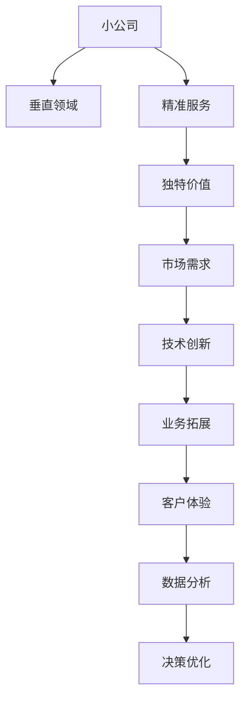

                 

# 小公司的生存之道：精准服务垂直领域，满足独特价值需求

> 关键词：小公司,垂直领域,精准服务,独特价值,市场需求,技术创新,业务拓展,客户体验,数据分析,决策优化

## 1. 背景介绍

在当今竞争激烈的市场环境中，小公司面临着来自大公司的激烈竞争，如何在市场中脱颖而出，是每一个小公司都必须面对的难题。传统的规模化、标准化生产模式已经难以满足市场的多样化需求，小公司需要通过差异化战略，寻找市场中的细分领域，实现精准服务，满足客户的独特价值需求。

### 1.1 市场挑战与机遇

随着市场环境的快速变化，消费者需求也呈现出多样化和个性化的趋势。消费者不再满足于通用化的产品和服务，而是寻求更加个性化、定制化的解决方案。这对小公司而言，既是挑战也是机遇。小公司可以通过深入挖掘市场需求，找到独特的业务切入点，实现精准服务，满足客户的需求。

### 1.2 技术驱动的变革

技术的发展为小公司提供了更多可能。云计算、大数据、人工智能等新兴技术的普及，使得小公司可以借助先进的工具和算法，提升运营效率和服务质量。特别是人工智能技术，通过数据分析和模型优化，可以实现对市场需求的精准预测和客户行为的深度理解。

## 2. 核心概念与联系

### 2.1 核心概念概述

为更好地理解小公司如何通过精准服务实现市场突围，本节将介绍几个密切相关的核心概念：

- **小公司**：指规模相对较小，资源有限，但具有一定专业性和创新能力的企业。小公司往往在市场细分领域具有较强的竞争力。

- **垂直领域**：指企业专注于某一特定领域或细分市场，提供专门化的产品或服务。垂直领域可以涵盖行业、地区、产品线等多个层面。

- **精准服务**：指企业通过深入了解客户需求，提供高度定制化的产品或服务，满足客户的独特价值需求。精准服务强调服务的精细化和个性化。

- **独特价值**：指企业通过差异化策略，提供与众不同的产品或服务，满足客户的特定需求，从而获得竞争优势。

- **市场需求**：指市场中消费者对产品或服务的需求量和需求结构的总称。市场需求受多种因素影响，如经济环境、技术进步、文化变迁等。

- **技术创新**：指通过技术研发和应用，实现产品或服务的创新，提升企业的竞争力。技术创新包括但不限于软件开发、算法优化、生产工艺改进等。

这些核心概念之间的逻辑关系可以通过以下Mermaid流程图来展示：



这个流程图展示从小公司到客户体验的整个过程，强调了技术创新在其中的关键作用。通过不断进行技术创新，小公司可以提供精准服务，满足独特价值需求，最终提升客户体验和业务收益。

## 3. 核心算法原理 & 具体操作步骤
### 3.1 算法原理概述

小公司通过精准服务实现市场突围的核心在于对市场需求的精准把握和个性化服务的设计。这一过程涉及数据分析、用户行为建模、个性化推荐等多个环节。算法原理如下：

1. **数据分析**：通过收集和分析市场数据，了解消费者的需求和行为特征。
2. **用户行为建模**：利用机器学习模型，对用户行为进行建模，预测用户的兴趣和需求。
3. **个性化推荐**：根据用户行为和兴趣，提供个性化的产品或服务推荐。

这一过程可以通过以下步骤实现：

1. 收集用户数据：通过问卷调查、网站行为数据、社交媒体互动等方式，收集用户信息。
2. 数据预处理：对收集到的数据进行清洗、去重、归一化等预处理工作。
3. 特征工程：提取有用的特征，如用户年龄、性别、地域、消费习惯等。
4. 建模和训练：选择合适的机器学习模型（如协同过滤、深度学习等），对用户数据进行建模和训练。
5. 个性化推荐：根据用户历史行为和当前行为，提供个性化的产品或服务推荐。

### 3.2 算法步骤详解

以电商平台为例，介绍个性化推荐算法的详细步骤：

1. **用户画像建立**：根据用户的购买历史、浏览记录、搜索关键词等行为数据，建立用户画像。用户画像包括用户的兴趣偏好、行为特征等。
2. **商品画像建立**：根据商品的销售数据、评价信息、用户反馈等数据，建立商品画像。商品画像包括商品属性、价格、用户评价等。
3. **相似度计算**：利用相似度计算算法（如余弦相似度、Jaccard相似度等），计算用户画像和商品画像之间的相似度。
4. **推荐模型训练**：利用协同过滤算法、深度学习模型等，对用户画像和商品画像进行训练，得到推荐模型。
5. **个性化推荐**：根据用户的当前行为和历史行为，结合推荐模型，生成个性化的产品推荐列表。

### 3.3 算法优缺点

个性化推荐算法的优点包括：

- 提高用户满意度：通过个性化推荐，用户能够更快地找到感兴趣的产品，提升购物体验。
- 增加用户粘性：个性化推荐能够提高用户对平台的忠诚度，减少用户流失率。
- 提升销售额：个性化推荐能够增加用户购买意愿，提升销售额。

同时，个性化推荐算法也存在一些缺点：

- 数据隐私问题：个性化推荐依赖大量的用户数据，可能引发用户隐私保护问题。
- 推荐算法公平性：个性化推荐算法可能存在偏见，导致某些用户被忽略或歧视。
- 过度推荐：过度推荐可能增加用户选择负担，降低用户体验。

### 3.4 算法应用领域

个性化推荐算法已经在多个领域得到了广泛应用，例如：

- 电子商务：通过个性化推荐，提升用户购物体验，增加销售额。
- 内容分发：根据用户兴趣，推荐新闻、文章、视频等内容，提升用户粘性。
- 金融服务：通过个性化推荐，为用户提供合适的金融产品，提升客户满意度。
- 健康医疗：根据用户健康数据，推荐个性化的健康管理方案，提升用户健康水平。

## 4. 数学模型和公式 & 详细讲解 & 举例说明

### 4.1 数学模型构建

个性化推荐算法本质上是一个多目标优化问题，目标是最大化用户满意度、提升用户粘性和增加销售额。数学模型构建如下：

设用户 $u$ 对商品 $i$ 的评分 $r_{ui} = \alpha_{ui} \cdot x_i + \beta_{ui} \cdot y_u$，其中 $\alpha_{ui}$ 和 $\beta_{ui}$ 分别为用户 $u$ 对商品 $i$ 的兴趣程度和商品 $i$ 的特征评分。设推荐算法为 $f(u, i)$，目标函数为：

$$
\max_{f} \sum_{u \in U} \sum_{i \in I} r_{ui} \cdot f(u, i)
$$

其中 $U$ 为所有用户集合，$I$ 为所有商品集合。

### 4.2 公式推导过程

以协同过滤算法为例，推导用户 $u$ 对商品 $i$ 的兴趣评分公式：

设用户 $u$ 对商品 $i$ 的兴趣评分 $r_{ui} = \frac{\sum_{j \in N_u} \alpha_{ij} r_{uj}}{\sqrt{\sum_{j \in N_u} \alpha_{ij}^2 + \epsilon}}$，其中 $\alpha_{ij}$ 为商品 $i$ 和商品 $j$ 的相似度，$N_u$ 为与用户 $u$ 共同购买过商品 $i$ 的用户集合，$\epsilon$ 为避免分母为零的平滑项。

该公式表示用户 $u$ 对商品 $i$ 的评分，主要由用户 $u$ 对与商品 $i$ 相似的商品 $j$ 的评分加权平均得到，平滑项 $\epsilon$ 用于防止分母为零，保证评分连续性。

### 4.3 案例分析与讲解

以一家小型旅游公司为例，展示个性化推荐在旅游行程规划中的应用：

1. **用户画像建立**：通过问卷调查和网站行为数据，收集用户偏好和行为特征。
2. **行程推荐**：根据用户的偏好和行为特征，结合目的地信息、旅游评价等数据，生成个性化的行程推荐。
3. **反馈优化**：收集用户对推荐行程的反馈数据，不断优化推荐模型。

通过个性化推荐，该旅游公司能够提供高度定制化的行程方案，满足用户的独特价值需求，提升用户满意度和忠诚度。

## 5. 项目实践：代码实例和详细解释说明
### 5.1 开发环境搭建

在进行个性化推荐算法开发前，我们需要准备好开发环境。以下是使用Python进行TensorFlow开发的环境配置流程：

1. 安装Anaconda：从官网下载并安装Anaconda，用于创建独立的Python环境。

2. 创建并激活虚拟环境：
```bash
conda create -n tf-env python=3.7 
conda activate tf-env
```

3. 安装TensorFlow：根据CUDA版本，从官网获取对应的安装命令。例如：
```bash
conda install tensorflow tensorflow-cpu=cuda11.1 -c pytorch -c conda-forge
```

4. 安装各类工具包：
```bash
pip install numpy pandas scikit-learn tensorflow_datasets scikit-learn
```

完成上述步骤后，即可在`tf-env`环境中开始开发。

### 5.2 源代码详细实现

以下是使用TensorFlow实现个性化推荐算法的示例代码：

```python
import tensorflow as tf
from tensorflow.keras import layers
from tensorflow_datasets import builder as tfds_builder

# 定义模型架构
class Recommender(tf.keras.Model):
    def __init__(self, vocab_size, embedding_dim, hidden_units):
        super().__init__()
        self.embedding = layers.Embedding(vocab_size, embedding_dim)
        self.dense = layers.Dense(hidden_units, activation='relu')
        self.fc = layers.Dense(vocab_size, activation='softmax')

    def call(self, inputs):
        x = self.embedding(inputs)
        x = self.dense(x)
        return self.fc(x)

# 构建模型并编译
model = Recommender(vocab_size=1000, embedding_dim=100, hidden_units=200)
model.compile(optimizer='adam', loss='categorical_crossentropy', metrics=['accuracy'])

# 加载数据集
train_dataset, test_dataset = tfds_builder.load('recommender_system', split=['train', 'test'], as_supervised=True, shuffle_files=True).as_numpy_iterator()

# 训练模型
model.fit(train_dataset, epochs=10, validation_data=test_dataset)
```

### 5.3 代码解读与分析

让我们再详细解读一下关键代码的实现细节：

**Recommender类**：
- `__init__`方法：定义模型的各个组件，包括嵌入层、全连接层和输出层。
- `call`方法：定义前向传播过程，将输入数据经过嵌入、全连接和输出层的处理，返回预测结果。

**模型编译与训练**：
- `compile`方法：设置优化器、损失函数和评价指标，为模型训练做准备。
- `fit`方法：对模型进行训练，使用训练集数据和验证集数据。

**数据加载**：
- `tfds_builder.load`方法：从TensorFlow数据集库中加载推荐系统数据集。
- `as_numpy_iterator`方法：将数据集转换为numpy迭代器，方便模型训练。

### 5.4 运行结果展示

在训练完成后，可以使用以下代码对模型进行测试：

```python
# 加载测试集数据
test_dataset = tfds_builder.load('recommender_system', split='test', as_supervised=True, shuffle_files=True).as_numpy_iterator()

# 进行预测
test_input = next(test_dataset)[0]
predictions = model.predict(test_input)
```

得到预测结果后，可以进行后续的分析与评估，以验证模型的性能。

## 6. 实际应用场景
### 6.1 电子商务

个性化推荐在电子商务中的应用最为广泛。通过分析用户的历史购买行为、浏览记录等数据，电商平台可以为用户推荐感兴趣的商品，提升用户购物体验和销售额。例如，亚马逊、淘宝等电商巨头都采用了个性化推荐技术，实现了高效的个性化推荐。

### 6.2 内容分发

在内容分发领域，个性化推荐技术同样发挥着重要作用。通过分析用户的阅读历史、观看记录等数据，内容分发平台可以为用户推荐相关的文章、视频等内容，提升用户粘性和平台收益。例如，Netflix、YouTube等平台都采用了个性化推荐技术，实现了高效的个性化内容分发。

### 6.3 金融服务

在金融服务领域，个性化推荐技术可以为用户提供合适的金融产品，提升用户满意度和平台收益。例如，银行、证券公司等金融企业可以基于用户的理财偏好、投资风格等数据，推荐合适的理财产品、投资组合等。

### 6.4 健康医疗

在健康医疗领域，个性化推荐技术可以为用户提供个性化的健康管理方案，提升用户健康水平和平台收益。例如，医院、健康管理平台可以根据用户的健康数据、生活习惯等，推荐合适的健康管理方案、体检项目等。

## 7. 工具和资源推荐
### 7.1 学习资源推荐

为了帮助开发者系统掌握个性化推荐技术的理论基础和实践技巧，这里推荐一些优质的学习资源：

1. 《推荐系统实战》系列博文：由推荐系统专家撰写，深入浅出地介绍了推荐系统原理、算法实现、工程实践等。

2. CS229《机器学习》课程：斯坦福大学开设的机器学习明星课程，有Lecture视频和配套作业，带你入门推荐系统领域的基本概念和经典算法。

3. 《推荐系统》书籍：Recommender Systems的作者所著，全面介绍了推荐系统的构建和优化，包括个性化推荐在内的多种推荐方法。

4. TensorFlow官方文档：TensorFlow的官方文档，提供了丰富的推荐系统教程和样例代码，是上手实践的必备资料。

5. KDD开放数据集：KDD竞赛中提供的推荐系统数据集，包含多个推荐算法实现，可进行对比学习和分析。

通过对这些资源的学习实践，相信你一定能够快速掌握个性化推荐技术的精髓，并用于解决实际的推荐问题。

### 7.2 开发工具推荐

高效的开发离不开优秀的工具支持。以下是几款用于个性化推荐系统开发的常用工具：

1. TensorFlow：基于Python的开源深度学习框架，灵活动态的计算图，适合快速迭代研究。大部分推荐系统算法都有TensorFlow版本的实现。

2. PyTorch：基于Python的开源深度学习框架，灵活多变的模型构建方式，适合复杂算法的实现。

3. TensorFlow Recommenders库：HuggingFace开发的推荐系统工具库，集成了多种SOTA推荐算法，支持TensorFlow和PyTorch，是进行推荐系统开发的利器。

4. Weights & Biases：模型训练的实验跟踪工具，可以记录和可视化模型训练过程中的各项指标，方便对比和调优。与主流深度学习框架无缝集成。

5. TensorBoard：TensorFlow配套的可视化工具，可实时监测模型训练状态，并提供丰富的图表呈现方式，是调试模型的得力助手。

6. Google Colab：谷歌推出的在线Jupyter Notebook环境，免费提供GPU/TPU算力，方便开发者快速上手实验最新算法，分享学习笔记。

合理利用这些工具，可以显著提升个性化推荐系统的开发效率，加快创新迭代的步伐。

### 7.3 相关论文推荐

个性化推荐技术的发展源于学界的持续研究。以下是几篇奠基性的相关论文，推荐阅读：

1. A Factorization Approach to Recommendation：提出了基于矩阵分解的推荐算法，奠定了推荐系统算法的基础。

2. collaborative filtering for implicit feedback datasets：提出协同过滤算法，通过分析用户与物品的共现关系进行推荐。

3. Deep Personalized Recommendation using Neural Networks：提出深度学习在推荐系统中的应用，通过神经网络进行推荐。

4. Interest-aware Recommender Systems：提出基于用户兴趣的推荐算法，进一步提升了推荐系统的个性化能力。

5. Attention-Based Recommender Systems：提出基于注意力机制的推荐算法，能够更好地处理长尾推荐问题。

这些论文代表了个性化推荐技术的发展脉络。通过学习这些前沿成果，可以帮助研究者把握学科前进方向，激发更多的创新灵感。

## 8. 总结：未来发展趋势与挑战
### 8.1 总结

本文对个性化推荐技术进行了全面系统的介绍。首先阐述了小公司如何通过精准服务实现市场突围，明确了个性化推荐在其中的关键作用。其次，从原理到实践，详细讲解了个性化推荐的数学模型和实现步骤，给出了推荐系统开发的完整代码实例。同时，本文还探讨了个性化推荐在多个行业领域的应用前景，展示了个性化推荐技术的广阔前景。

通过本文的系统梳理，可以看到，个性化推荐技术正在成为推荐系统的重要范式，极大地拓展了推荐系统的应用边界，催生了更多的落地场景。得益于大规模数据和先进算法的支持，推荐系统能够更好地理解用户需求，提供更加精准的推荐服务。

### 8.2 未来发展趋势

展望未来，个性化推荐技术将呈现以下几个发展趋势：

1. 数据质量提升：随着数据采集和处理技术的进步，推荐系统将能够获取更加全面、高质量的用户数据，提升推荐的精度。
2. 算法多样化：推荐算法将更加多样化和灵活，包括深度学习、图神经网络、强化学习等多种技术。
3. 推荐系统集成：推荐系统将与其他系统集成，如搜索系统、广告系统等，实现更全面、更智能的推荐。
4. 实时推荐：推荐系统将实现实时推荐，根据用户实时行为进行动态调整，提升用户体验。
5. 多模态推荐：推荐系统将结合多种模态数据，如文本、图像、语音等，提升推荐的准确性和多样性。

以上趋势凸显了个性化推荐技术的巨大潜力。这些方向的探索发展，必将进一步提升推荐系统的性能和应用范围，为推荐系统的智能化和普及化提供更多可能。

### 8.3 面临的挑战

尽管个性化推荐技术已经取得了瞩目成就，但在迈向更加智能化、普适化应用的过程中，它仍面临着诸多挑战：

1. 数据隐私问题：推荐系统依赖大量的用户数据，可能引发用户隐私保护问题。如何在保护隐私的同时，提升推荐效果，仍需进一步探索。
2. 推荐算法公平性：推荐算法可能存在偏见，导致某些用户被忽略或歧视。如何实现推荐算法的公平性，仍需深入研究。
3. 推荐系统透明性：推荐系统的内部机制和决策过程缺乏透明度，用户难以理解和信任。如何增强推荐系统的透明性，仍需更多努力。
4. 推荐算法鲁棒性：推荐算法可能受到恶意攻击或数据噪声的影响，如何提升推荐算法的鲁棒性，仍需深入研究。

### 8.4 研究展望

面对个性化推荐技术所面临的挑战，未来的研究需要在以下几个方面寻求新的突破：

1. 数据隐私保护：通过差分隐私、联邦学习等技术，保护用户隐私，提升推荐系统的可信度。
2. 推荐算法公平性：引入公平性约束和优化目标，确保推荐算法的公平性和透明性。
3. 推荐系统透明性：利用可解释AI技术，增强推荐系统的透明性和可理解性。
4. 推荐算法鲁棒性：引入鲁棒性优化目标，提升推荐算法对恶意攻击和噪声的抵抗能力。

这些研究方向的探索，必将引领个性化推荐技术迈向更高的台阶，为构建安全、可靠、可解释、可控的推荐系统提供更多可能。面向未来，个性化推荐技术还需要与其他人工智能技术进行更深入的融合，如知识表示、因果推理、强化学习等，多路径协同发力，共同推动推荐系统的进步。只有勇于创新、敢于突破，才能不断拓展推荐系统的边界，让推荐系统更好地服务于用户，实现推荐系统的普适化和智能化。

## 9. 附录：常见问题与解答

**Q1：个性化推荐算法是否适用于所有用户？**

A: 个性化推荐算法适用于绝大多数用户，但对于一些特殊用户，如未成年用户、敏感数据用户等，可能需要进行限制或匿名化处理。

**Q2：个性化推荐如何处理长尾推荐问题？**

A: 长尾推荐问题可以通过引入基于注意力的推荐算法、多模态推荐算法等方式解决。这些方法能够更好地处理稀疏数据和长尾数据，提升推荐系统的效果。

**Q3：个性化推荐算法如何处理用户行为变化？**

A: 个性化推荐算法可以通过引入自适应学习算法、在线学习算法等方式，实时更新用户模型，及时捕捉用户行为变化，提升推荐精度。

**Q4：个性化推荐算法如何处理数据冷启动问题？**

A: 数据冷启动问题可以通过引入基于内容的推荐算法、协同过滤算法等方式解决。这些方法能够利用先验知识和相似性，快速对新用户进行推荐。

**Q5：个性化推荐算法如何处理多模态数据？**

A: 个性化推荐算法可以通过引入多模态融合算法、跨模态推荐算法等方式，实现对多模态数据的整合，提升推荐系统的准确性和多样性。

通过回答这些问题，我们能够更深入地理解个性化推荐算法的实现细节，从而更好地应用于实际场景中。

---

作者：禅与计算机程序设计艺术 / Zen and the Art of Computer Programming

