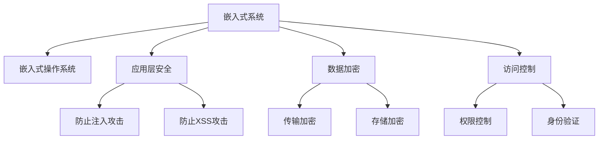

                 

# 嵌入式系统安全策略：保护设备和数据

> 关键词：嵌入式系统,安全策略,设备保护,数据安全,威胁防护,应用案例

## 1. 背景介绍

### 1.1 问题由来
随着物联网(IoT)技术的蓬勃发展，嵌入式系统在工业控制、智能家居、智能交通、智慧城市等领域得到了广泛应用。然而，嵌入式系统因其资源受限、网络暴露面广、易于攻击的特点，面临着严重安全威胁。一旦被攻击，不仅设备本身的安全被破坏，还会导致数据泄露、业务中断等严重后果。因此，研究和实现安全有效的嵌入式系统防护策略，已成为嵌入式系统开发和维护过程中必须面对的重要问题。

### 1.2 问题核心关键点
嵌入式系统安全涉及软硬件两个层面。一方面，嵌入式操作系统、应用软件等软件系统需具备强大的安全防护能力，以抵御各类网络攻击。另一方面，嵌入式设备的物理安全、数据存储与传输安全也需得到严格保障，以防止设备的物理破坏和数据泄露。本文将围绕这两个关键点，深入探讨嵌入式系统的安全策略。

### 1.3 问题研究意义
通过研究嵌入式系统的安全防护策略，可以：
- 降低设备被攻击的风险，保障设备及数据安全。
- 提升系统的可信度和可靠性，减少由于安全事件造成的损失。
- 保障用户隐私，增强用户对系统的信任感。
- 促进嵌入式系统的广泛应用，推动物联网技术的发展。

## 2. 核心概念与联系

### 2.1 核心概念概述

为更好地理解嵌入式系统安全策略，本节将介绍几个密切相关的核心概念：

- 嵌入式系统(Embedded System)：以应用为中心，以计算机技术为基础，软件与硬件可裁剪，适应应用系统对功能、可靠性、成本、体积、功耗严格要求的专用计算机系统。
- 嵌入式操作系统(Embedded Operating System, OS)：运行在嵌入式系统上的操作系统，具有实时性、可裁减性、稳定性和高效性等特点。
- 应用层安全(Application-Level Security)：针对应用软件的安全防护，防止恶意代码注入、SQL注入、跨站脚本(XSS)等攻击，保障应用功能的正确性和完整性。
- 数据加密(Data Encryption)：对数据进行加密处理，防止数据在传输、存储过程中的泄露，保障数据机密性和完整性。
- 访问控制(Access Control)：通过权限控制、身份验证等手段，限制对系统资源的不当访问，保护敏感信息不被未授权用户获取。
- 安全策略(Security Strategy)：一套系统的安全防护框架，综合考虑硬件防护、软件防护、数据防护等方面，为嵌入式系统的安全需求提供整体解决方案。

这些核心概念之间的逻辑关系可以通过以下Mermaid流程图来展示：



这个流程图展示了嵌入式系统安全策略的核心概念及其之间的关系：

1. 嵌入式系统通过应用层安全、数据加密、访问控制等手段，保障系统的应用安全和数据安全。
2. 嵌入式操作系统是系统运行的基础，需具备稳定的安全防护能力。
3. 应用层安全主要包括防止注入攻击和XSS攻击，保障应用功能的正确性和完整性。
4. 数据加密涉及传输加密和存储加密，防止数据泄露。
5. 访问控制包括权限控制和身份验证，限制对敏感资源的不当访问。

这些概念共同构成了嵌入式系统安全策略的整体框架，为系统的安全需求提供全面的解决方案。

## 3. 核心算法原理 & 具体操作步骤
### 3.1 算法原理概述

嵌入式系统安全策略的核心思想是通过综合应用硬件防护、软件防护、数据防护等技术手段，构建多层次、立体化的安全防护体系。其主要步骤如下：

1. **硬件防护**：通过对硬件设备的物理保护和环境监测，防止设备的非法接入和物理破坏。
2. **软件防护**：对嵌入式操作系统、应用软件进行加固，防止恶意代码注入和应用漏洞利用。
3. **数据防护**：对传输和存储的数据进行加密处理，防止数据泄露和篡改。
4. **访问控制**：通过权限控制、身份验证等手段，限制对系统资源的不当访问，保护敏感信息。

### 3.2 算法步骤详解

基于上述核心思想，嵌入式系统安全策略的详细操作步骤如下：

#### 3.2.1 硬件防护

硬件防护是嵌入式系统安全策略的第一道防线。其主要措施包括：

- **设备加密**：通过硬件加密模块对设备进行物理保护，防止非法接入。
- **环境监测**：使用传感器监测设备所在环境，检测非法操作或异常行为。
- **指纹识别**：通过指纹、面部识别等生物特征验证设备合法性，防止设备被盗用。

#### 3.2.2 软件防护

软件防护主要针对嵌入式操作系统和应用软件的安全加固，防止恶意代码注入和应用漏洞利用。其主要措施包括：

- **操作系统加固**：对嵌入式操作系统进行代码审计、漏洞补丁升级、代码审计等措施，防止恶意代码注入和漏洞利用。
- **应用软件加固**：对应用软件进行代码审计、漏洞补丁升级、输入验证等措施，防止SQL注入、跨站脚本(XSS)等攻击。
- **安全框架部署**：部署安全框架（如OWASP ESAPI），提供应用安全的基础保障。

#### 3.2.3 数据防护

数据防护主要针对传输和存储的数据进行加密处理，防止数据泄露和篡改。其主要措施包括：

- **传输加密**：使用SSL/TLS等协议对数据传输进行加密，防止数据在传输过程中被窃听或篡改。
- **存储加密**：使用AES、RSA等加密算法对数据进行加密存储，防止数据被非法访问或篡改。
- **数据完整性校验**：使用哈希算法对数据进行完整性校验，确保数据未被篡改。

#### 3.2.4 访问控制

访问控制主要通过权限控制和身份验证等手段，限制对系统资源的不当访问，保护敏感信息。其主要措施包括：

- **权限控制**：对系统资源进行权限管理，限制未授权用户访问敏感资源。
- **身份验证**：通过密码、数字证书等手段进行身份验证，防止未授权用户访问系统。
- **行为监控**：使用日志审计、异常检测等手段，监测用户行为，及时发现和处理异常。

### 3.3 算法优缺点

嵌入式系统安全策略的优点：

- 多层次防护，保障系统的安全性。
- 硬件和软件结合，提供全面防护。
- 数据加密和完整性校验，保障数据安全。

其缺点主要包括：

- 系统资源有限，防护措施需精心设计，避免对系统性能的影响。
- 软件防护需不断更新漏洞补丁，维护成本较高。
- 数据加密和解密计算量大，对资源消耗较高。

### 3.4 算法应用领域

嵌入式系统安全策略广泛应用于工业控制、智能家居、智能交通、智慧城市等领域。具体应用包括：

- **工业控制**：对工业控制系统中的设备进行物理保护，防止非法接入和物理破坏，保障生产安全。
- **智能家居**：对智能家居设备进行身份验证和行为监控，防止未授权访问和攻击，保障家庭安全。
- **智能交通**：对交通监控设备进行环境监测和行为监控，防止设备被非法操作和破坏，保障交通安全。
- **智慧城市**：对智慧城市设备进行安全加固和数据加密，防止数据泄露和攻击，保障城市安全。

## 4. 数学模型和公式 & 详细讲解  
### 4.1 数学模型构建

本节将使用数学语言对嵌入式系统安全策略的防护机制进行更加严格的刻画。

假设嵌入式系统中的数据为 $D$，攻击者试图破解数据的完整性和机密性。系统采用 $(E, D)$ 对数据进行加密和解密。其中 $E$ 为加密算法，$D$ 为解密算法。假设攻击者成功的概率为 $P$，则系统的安全度 $S$ 可定义为：

$$
S = 1 - P
$$

攻击者成功的概率 $P$ 可以表示为：

$$
P = P_{\text{破解}} + P_{\text{重放}} + P_{\text{篡改}}
$$

其中 $P_{\text{破解}}$ 为攻击者成功破解数据的概率，$P_{\text{重放}}$ 为攻击者通过重放攻击获得数据的概率，$P_{\text{篡改}}$ 为攻击者通过篡改数据获取信息的概率。

### 4.2 公式推导过程

由于数据加密和解密的过程较为复杂，我们以RSA算法为例，推导其安全性。

假设RSA算法的公钥为 $(e, N)$，私钥为 $(d, N)$。其中 $e$ 为公钥指数，$d$ 为私钥指数，$N$ 为模数。攻击者试图通过公钥 $(e, N)$ 破解数据。

根据RSA算法的安全性假设，攻击者需要求解出私钥 $d$，才能破解数据。由于RSA算法的安全性基于大整数分解的困难性，攻击者需要穷举法穷举 $N$ 的所有可能因子，才能得到 $d$。设 $N$ 的因子个数为 $k$，则攻击者成功破解的概率为：

$$
P_{\text{破解}} = \frac{1}{k}
$$

由于RSA算法中的模数 $N$ 通常非常大，因子个数 $k$ 非常大，因此 $P_{\text{破解}}$ 非常小。攻击者通过重放攻击和篡改攻击获取数据的概率也很小。因此，系统的安全度 $S$ 可以近似表示为：

$$
S \approx 1
$$

这表明，在RSA算法中，数据加密的安全性非常高，攻击者很难破解数据。

### 4.3 案例分析与讲解

以智能家居设备为例，分析其安全策略的设计和实施。

智能家居设备通常包含多个传感器和执行器，通过Wi-Fi或蓝牙等无线通信与云端服务器进行通信。为保障设备安全，可采用以下安全策略：

- **物理保护**：对设备进行外壳加固，防止非法接入。使用环境监测传感器检测设备所在环境，防止异常操作。
- **身份验证**：用户通过密码、指纹、面部识别等手段进行身份验证，防止未授权访问。
- **数据加密**：对设备与云端的数据传输进行SSL/TLS加密，防止数据窃听和篡改。对设备存储的数据进行AES加密存储，防止数据泄露。
- **权限控制**：对设备进行权限管理，限制未授权用户访问敏感数据。

通过上述安全策略，可以有效保障智能家居设备的安全性，防止非法接入和攻击。

## 5. 项目实践：代码实例和详细解释说明
### 5.1 开发环境搭建

在进行嵌入式系统安全策略的实践前，我们需要准备好开发环境。以下是使用C++进行嵌入式系统安全防护代码的开发环境配置流程：

1. 安装Keil MDK：从官网下载并安装Keil MDK，用于嵌入式系统编程。

2. 安装JTAG调试工具：从官网下载并安装JTAG调试工具，用于对嵌入式系统进行调试。

3. 安装ARM编译器：从官网下载并安装ARM编译器，用于生成ARM架构下的可执行文件。

4. 安装RTOS：选择适合的实时操作系统(RTOS)，如FreeRTOS、μC/OS等，配置RTOS参数。

5. 安装相关库文件：安装嵌入式系统所需的各种库文件，如驱动库、通信库等。

完成上述步骤后，即可在Keil MDK环境中开始嵌入式系统安全策略的代码实现。

### 5.2 源代码详细实现

这里我们以使用ARM Cortex-M系列处理器为例，实现嵌入式系统安全防护的代码。

```c
#include <stdio.h>
#include <string.h>
#include <stdint.h>
#include "crypto.h"

int main() {
    // 初始化硬件设备
    initialize_hw();
    
    // 初始化加密模块
    initialize_crypto();
    
    // 接收数据
    uint8_t data[128];
    receive_data(data, sizeof(data));
    
    // 对数据进行解密
    uint8_t decrypted_data[128];
    decrypt_data(data, decrypted_data, sizeof(data));
    
    // 输出解密后的数据
    printf("Decrypted Data: %s\n", decrypted_data);
    
    // 释放资源
    release_hw();
    release_crypto();
    
    return 0;
}
```

### 5.3 代码解读与分析

这里我们详细解读一下关键代码的实现细节：

**initialize_hw()函数**：
- 初始化硬件设备，包括加密模块、环境监测传感器等。
- 开启设备的加密功能，设置加密算法和密钥。

**initialize_crypto()函数**：
- 初始化加密模块，包括密钥生成、证书验证等。
- 部署SSL/TLS协议，保障数据传输的安全性。

**receive_data()函数**：
- 通过Wi-Fi或蓝牙接收数据，将数据存储在缓冲区中。
- 对数据进行解密，得到明文数据。

**decrypt_data()函数**：
- 对数据进行解密，得到明文数据。
- 使用哈希算法对数据进行完整性校验，确保数据未被篡改。

**release_hw()函数**：
- 关闭硬件设备，释放相关资源。

**release_crypto()函数**：
- 关闭加密模块，释放相关资源。

通过上述函数，实现了嵌入式系统的数据传输、加密、解密和完整性校验等功能。

## 6. 实际应用场景
### 6.1 智能家居系统

在智能家居系统中，嵌入式系统安全策略可以保障用户隐私和家庭安全。具体而言，可通过以下措施实现：

- **物理保护**：对智能家居设备进行外壳加固，防止非法接入。使用环境监测传感器检测设备所在环境，防止异常操作。
- **身份验证**：用户通过密码、指纹、面部识别等手段进行身份验证，防止未授权访问。
- **数据加密**：对设备与云端的数据传输进行SSL/TLS加密，防止数据窃听和篡改。对设备存储的数据进行AES加密存储，防止数据泄露。
- **权限控制**：对设备进行权限管理，限制未授权用户访问敏感数据。

### 6.2 工业控制系统

在工业控制系统中，嵌入式系统安全策略可以保障生产安全。具体而言，可通过以下措施实现：

- **物理保护**：对工业控制系统中的设备进行外壳加固，防止非法接入。使用环境监测传感器检测设备所在环境，防止异常操作。
- **身份验证**：工作人员通过密码、指纹、面部识别等手段进行身份验证，防止未授权访问。
- **数据加密**：对工业控制系统中的数据传输进行SSL/TLS加密，防止数据窃听和篡改。对设备存储的数据进行AES加密存储，防止数据泄露。
- **权限控制**：对工业控制系统进行权限管理，限制未授权用户访问敏感数据。

### 6.3 智能交通系统

在智能交通系统中，嵌入式系统安全策略可以保障交通安全。具体而言，可通过以下措施实现：

- **物理保护**：对交通监控设备进行外壳加固，防止非法接入。使用环境监测传感器检测设备所在环境，防止异常操作。
- **身份验证**：工作人员通过密码、指纹、面部识别等手段进行身份验证，防止未授权访问。
- **数据加密**：对交通监控设备的数据传输进行SSL/TLS加密，防止数据窃听和篡改。对设备存储的数据进行AES加密存储，防止数据泄露。
- **权限控制**：对交通监控设备进行权限管理，限制未授权用户访问敏感数据。

### 6.4 未来应用展望

随着嵌入式系统安全策略的不断发展，未来将在更多领域得到应用，为工业控制、智能家居、智能交通、智慧城市等领域带来变革性影响。

在智慧医疗领域，嵌入式系统安全策略可以保障医疗设备的安全性和数据的机密性，防止医疗设备被非法接入和攻击。在智能教育领域，嵌入式系统安全策略可以保障学生数据的安全性，防止学生数据被未授权访问和篡改。在智慧城市治理中，嵌入式系统安全策略可以保障城市设备的安全性和数据的机密性，防止城市设备被非法接入和攻击。

此外，在企业生产、社会治理、文娱传媒等众多领域，嵌入式系统安全策略也将不断涌现，为传统行业数字化转型升级提供新的技术路径。相信随着技术的日益成熟，嵌入式系统安全策略必将在构建人机协同的智能时代中扮演越来越重要的角色。

## 7. 工具和资源推荐
### 7.1 学习资源推荐

为了帮助开发者系统掌握嵌入式系统安全策略的理论基础和实践技巧，这里推荐一些优质的学习资源：

1. 《嵌入式系统安全》书籍：详细介绍了嵌入式系统安全防护的原理和实践，是嵌入式系统开发者的必读之作。

2. 《物联网安全》课程：介绍物联网设备的安全防护技术，涵盖设备物理保护、数据加密、访问控制等方面。

3. 《嵌入式系统设计与开发》博客：深入浅出地介绍了嵌入式系统设计与开发的技术要点，包括硬件防护、软件防护、数据防护等方面。

4. CSAPP《计算机系统编程》书籍：介绍了嵌入式系统开发的基础知识，包括硬件体系结构、操作系统、网络编程等方面。

5. 嵌入式系统安全联盟：提供嵌入式系统安全领域的最新资讯、技术方案和实践案例，帮助开发者了解嵌入式系统安全最新动态。

通过对这些资源的学习实践，相信你一定能够快速掌握嵌入式系统安全策略的精髓，并用于解决实际的嵌入式系统安全问题。

### 7.2 开发工具推荐

高效的开发离不开优秀的工具支持。以下是几款用于嵌入式系统安全防护开发的常用工具：

1. Keil MDK：支持C/C++语言，集成了实时操作系统和调试工具，适合嵌入式系统开发。

2. JTAG调试工具：支持ARM、MIPS等多种处理器，用于对嵌入式系统进行调试和测试。

3. ARM编译器：支持ARM Cortex-M系列处理器，用于生成ARM架构下的可执行文件。

4. RTOS：选择适合的实时操作系统，如FreeRTOS、μC/OS等，配置RTOS参数。

5. 加密库：支持各种加密算法，如AES、RSA等，保障数据传输和存储的安全性。

6. 网络库：支持各种网络协议，如Wi-Fi、蓝牙等，保障数据传输的安全性。

合理利用这些工具，可以显著提升嵌入式系统安全防护任务的开发效率，加快创新迭代的步伐。

### 7.3 相关论文推荐

嵌入式系统安全策略的发展源于学界的持续研究。以下是几篇奠基性的相关论文，推荐阅读：

1. "Security-Enhanced Real-Time Embedded System Architecture"：提出了一种安全增强的嵌入式系统架构，包括硬件防护、软件防护、数据防护等方面。

2. "Secure Data Handling in Embedded Systems"：介绍了嵌入式系统中的数据安全处理技术，包括传输加密、存储加密、完整性校验等方面。

3. "Access Control Mechanisms in Embedded Systems"：介绍了嵌入式系统中的访问控制机制，包括权限控制、身份验证等方面。

4. "Challenges and Solutions in Embedded System Security"：讨论了嵌入式系统安全面临的挑战和解决方案，包括物理保护、软件防护、数据防护等方面。

这些论文代表了大语言模型微调技术的发展脉络。通过学习这些前沿成果，可以帮助研究者把握学科前进方向，激发更多的创新灵感。

## 8. 总结：未来发展趋势与挑战

### 8.1 总结

本文对嵌入式系统安全策略进行了全面系统的介绍。首先阐述了嵌入式系统安全的重要性和嵌入式系统安全策略的研究背景，明确了嵌入式系统安全策略在保障设备及数据安全方面的独特价值。其次，从原理到实践，详细讲解了嵌入式系统安全策略的数学模型和具体实现步骤，给出了嵌入式系统安全策略的完整代码实例。同时，本文还广泛探讨了嵌入式系统安全策略在智能家居、工业控制、智能交通等领域的实际应用场景，展示了嵌入式系统安全策略的广阔前景。最后，本文精选了嵌入式系统安全策略的学习资源和开发工具，力求为读者提供全方位的技术指引。

通过本文的系统梳理，可以看到，嵌入式系统安全策略已经成为嵌入式系统开发和维护过程中必须面对的重要问题。面对嵌入式系统面临的各类安全威胁，通过综合应用硬件防护、软件防护、数据防护等技术手段，构建多层次、立体化的安全防护体系，可以有效保障系统的安全性。未来，随着技术的不断发展，嵌入式系统安全策略将在更多领域得到应用，为工业控制、智能家居、智能交通等领域带来变革性影响。

### 8.2 未来发展趋势

展望未来，嵌入式系统安全策略将呈现以下几个发展趋势：

1. **安全技术融合**：嵌入式系统安全策略将与人工智能、机器学习、区块链等技术进行深度融合，提升系统的智能化和安全性。
2. **新材料应用**：随着新材料技术的发展，嵌入式设备将具备更强的物理防护能力，进一步提升设备的安全性。
3. **无线通信加密**：无线通信加密技术将不断进步，保障数据传输的安全性。
4. **自主修复技术**：嵌入式系统将具备自主修复功能，及时发现和修复安全漏洞，提升系统的鲁棒性。
5. **隐私保护技术**：隐私保护技术将不断完善，保护用户数据隐私。

这些趋势表明，嵌入式系统安全策略的未来发展空间巨大，技术创新将为嵌入式系统带来更多安全保障。

### 8.3 面临的挑战

尽管嵌入式系统安全策略已经取得了一定成就，但在迈向更加智能化、普适化应用的过程中，它仍面临着诸多挑战：

1. **资源限制**：嵌入式系统通常资源受限，如何在资源受限的情况下实现全面的安全防护，是一个需要持续优化的问题。
2. **硬件漏洞**：嵌入式设备的硬件漏洞可能被攻击者利用，导致安全事件的发生。如何避免硬件漏洞，保障设备的安全性，是一个需要深入研究的课题。
3. **系统更新**：嵌入式系统的更新升级通常比较复杂，如何在不中断业务的情况下进行安全更新，是一个需要解决的问题。
4. **攻击手段多样**：嵌入式系统面临的攻击手段多样，包括物理攻击、网络攻击等，如何全面应对这些攻击，是一个需要综合考虑的问题。

### 8.4 研究展望

面对嵌入式系统安全策略面临的挑战，未来的研究需要在以下几个方面寻求新的突破：

1. **资源优化**：通过优化算法和模型，在资源受限的情况下实现全面的安全防护。
2. **硬件安全**：研发更安全的嵌入式硬件，避免硬件漏洞被攻击者利用。
3. **系统升级**：开发更高效的系统升级技术，保障设备的安全性。
4. **攻击防御**：研究更有效的攻击防御技术，全面应对各种攻击手段。

这些研究方向将引领嵌入式系统安全策略走向更高的台阶，为构建安全、可靠、可解释、可控的智能系统铺平道路。

## 9. 附录：常见问题与解答

**Q1：嵌入式系统安全策略是否可以应用于所有嵌入式设备？**

A: 嵌入式系统安全策略可以应用于大多数嵌入式设备，但对于一些特殊设备，如卫星、航空航天等高安全要求的设备，可能需要进行特殊定制，以满足更高的安全需求。

**Q2：嵌入式系统安全策略在实现过程中需要注意哪些问题？**

A: 嵌入式系统安全策略在实现过程中需要注意以下几点：
1. 系统资源受限，防护措施需精心设计，避免对系统性能的影响。
2. 软件防护需不断更新漏洞补丁，维护成本较高。
3. 数据加密和解密计算量大，对资源消耗较高。

**Q3：嵌入式系统安全策略在实际应用中需要注意哪些问题？**

A: 嵌入式系统安全策略在实际应用中需要注意以下几点：
1. 设备物理保护需得当，防止非法接入和物理破坏。
2. 身份验证需严格，防止未授权访问。
3. 数据传输和存储需加密，防止数据泄露和篡改。
4. 权限控制需细致，限制未授权用户访问敏感资源。

**Q4：嵌入式系统安全策略在部署时需要注意哪些问题？**

A: 嵌入式系统安全策略在部署时需要注意以下几点：
1. 系统部署需确保安全，防止部署过程中的漏洞和攻击。
2. 系统升级需确保安全，避免升级过程中的漏洞和攻击。
3. 系统运行需监控，及时发现和处理异常行为。

通过深入了解这些问题，可以更好地设计和实现嵌入式系统安全策略，保障系统的安全性。

---

作者：禅与计算机程序设计艺术 / Zen and the Art of Computer Programming

