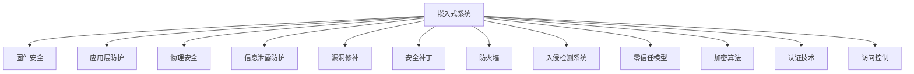

                 

# 嵌入式系统安全：保护设备

> 关键词：嵌入式系统,安全防护,设备保护,固件安全,逆向工程,应用层防护,物理安全,信息泄露,漏洞修补,安全补丁,防火墙,入侵检测系统,零信任,加密算法,认证技术,访问控制

## 1. 背景介绍

### 1.1 问题由来
随着物联网(IoT)和智能设备的普及，嵌入式系统在各个行业的应用越来越广泛，从工业控制、医疗健康、智能家居到汽车电子等领域，嵌入式设备无处不在。然而，与传统的计算机系统相比，嵌入式设备由于其硬件资源有限、软件代码复杂、系统更新缓慢等特点，面临着更为严峻的安全威胁。

近年来，多起针对嵌入式设备的攻击事件，如Mirai僵尸网络、BlackArmor漏洞攻击、NotPetya勒索病毒等，均揭示了嵌入式系统在安全防护方面存在的诸多不足。这些攻击不仅导致设备损坏、数据泄露，还可能危及人身安全和社会稳定。因此，加强嵌入式系统的安全防护，成为保障设备稳定运行和数据安全的重要课题。

### 1.2 问题核心关键点
嵌入式系统安全问题主要集中在以下几个方面：

- 固件安全：固件攻击是最常见的嵌入式安全威胁，如固件篡改、注入恶意代码等。攻击者可通过固件漏洞侵入设备，窃取或破坏设备功能。
- 应用层防护：应用层漏洞是嵌入式系统安全防护的另一大挑战。由于嵌入式系统应用复杂多样，开发过程中难免存在各种安全漏洞，攻击者可通过应用层攻击窃取敏感信息、控制设备行为。
- 物理安全：物理安全是指对设备硬件进行物理破坏和篡改，如拆解设备、植入后门等。这种攻击方式虽属物理层面，却具有极高的隐蔽性和破坏力。
- 信息泄露：嵌入式系统在传输、存储、处理敏感数据时，面临诸多信息泄露风险，如数据截获、中间人攻击等。
- 漏洞修补：嵌入式系统更新缓慢，导致许多已知漏洞长期未被修复，增加了攻击者的可乘之机。
- 安全补丁：厂商提供安全补丁的周期较长，且补丁实施难度较大，影响系统的稳定性和可靠性。
- 防火墙、入侵检测系统：大多数嵌入式系统未部署防火墙、入侵检测等传统安全防护措施，容易成为攻击者的“靶子”。
- 零信任模型：传统的基于身份认证的安全模型已无法适应动态变化的安全需求，零信任模型要求对所有设备均进行严格的身份验证和权限控制。
- 加密算法：嵌入式系统加密算法使用不当，或存在实现漏洞，易被攻击者利用。
- 认证技术：密钥管理、数字证书等认证技术的滥用或缺陷，是嵌入式系统安全防护中的常见问题。
- 访问控制：访问控制列表(ACL)等机制在嵌入式系统中应用不充分，导致数据和设备被非授权访问。

这些核心问题构成了嵌入式系统安全防护的重要挑战，需要开发者在设计、开发、测试和维护等各个环节中采取综合措施进行防护。

## 2. 核心概念与联系

### 2.1 核心概念概述

为更好地理解嵌入式系统安全防护的原理和实践，本节将介绍几个密切相关的核心概念：

- 嵌入式系统(Embedded System)：由计算机硬件和软件系统组成的，在工业控制、医疗健康、智能家居等领域具有特定功能的专用设备。
- 固件(Firmware)：安装在嵌入式系统硬件中的，提供系统初始化和核心功能的软件。
- 应用层防护(Application Layer Security)：对嵌入式设备的应用程序进行安全防护，防止各种应用层攻击，如SQL注入、跨站脚本攻击(XSS)等。
- 物理安全(Physical Security)：保护嵌入式设备免受物理破坏和篡改，如设备屏蔽、防护材料等。
- 信息泄露(Information Leakage)：指敏感信息从嵌入式系统中泄漏到外部环境，如数据传输、存储和处理过程中。
- 漏洞修补(Vulnerability Patching)：对嵌入式系统存在的安全漏洞进行修复，保证系统安全性。
- 安全补丁(Security Patch)：厂商为解决特定安全问题而提供的程序更新。
- 防火墙(Firewall)：网络安全设备，用于监控和控制进出嵌入式系统的网络流量。
- 入侵检测系统(IDS)：实时监测嵌入式系统，识别并阻止恶意行为。
- 零信任模型(Zero Trust Model)：基于最小权限原则，对所有设备进行严格的身份验证和权限控制。
- 加密算法(Cryptography Algorithms)：对数据进行加密处理，保证数据机密性和完整性。
- 认证技术(Authentication Technology)：验证用户或设备身份的技术，如数字证书、密钥管理等。
- 访问控制(Access Control)：限制对嵌入式系统资源的访问，保证数据和设备的安全。

这些核心概念之间的逻辑关系可以通过以下Mermaid流程图来展示：



这个流程图展示了一系列嵌入式系统安全防护的核心概念及其相互关系：

1. 嵌入式系统作为安全防护的主体，通过固件安全、应用层防护等手段提升自身安全性。
2. 通过物理安全措施保护设备硬件，防止物理破坏和篡改。
3. 信息泄露防护技术保障数据的机密性和完整性。
4. 通过漏洞修补和安全补丁更新系统，解决已知安全问题。
5. 防火墙和入侵检测系统监测网络流量，阻止恶意攻击。
6. 零信任模型实现严格的身份验证和权限控制。
7. 加密算法保护数据的机密性和完整性。
8. 认证技术验证用户或设备身份，保证访问安全性。
9. 访问控制限制资源访问，保护系统安全性。

这些概念共同构成了嵌入式系统安全防护的整体框架，为系统设计、开发、测试和维护提供了基本思路。

## 3. 核心算法原理 & 具体操作步骤
### 3.1 算法原理概述

嵌入式系统安全防护的核心思想是通过多层次、多维度的方式，全面提升系统的安全性。其基本原理可归纳为以下几点：

- 多层次防护：在嵌入式系统的固件层、应用层、网络层和物理层等不同层面，部署不同种类的安全防护措施，形成多层次的安全防护体系。
- 多维度防护：在身份认证、权限控制、数据加密、异常监测等多个维度进行安全防护，确保系统各部分的协同工作。
- 动态防护：通过定期更新和修补系统，及时应对新的安全威胁，保障系统持续安全。

### 3.2 算法步骤详解

嵌入式系统安全防护的核心算法流程可概括为以下几个步骤：

**Step 1: 需求分析与威胁建模**

- 分析嵌入式系统面临的主要安全威胁，如固件攻击、应用层漏洞等。
- 对嵌入式系统进行风险评估，确定关键组件和潜在攻击面。
- 根据需求和威胁模型，设计相应的安全防护策略。

**Step 2: 安全设计与实现**

- 在固件和应用层面，使用安全编程技术和工具，减少代码漏洞。
- 对嵌入式系统进行分区隔离，限制关键组件的访问权限。
- 使用加密算法和认证技术，保护敏感数据的机密性和完整性。
- 在网络层面，部署防火墙和入侵检测系统，实时监控网络流量。
- 对系统进行物理安全设计，防止设备硬件被物理破坏和篡改。

**Step 3: 测试与验证**

- 对设计好的安全防护措施进行测试验证，确保其有效性和可靠性。
- 进行渗透测试和安全漏洞扫描，查找和修复潜在的安全漏洞。
- 通过安全补丁和固件更新，及时修复发现的漏洞。

**Step 4: 持续监测与改进**

- 部署入侵检测系统(IDS)和异常监测工具，实时监测系统运行状态。
- 建立威胁情报机制，及时了解最新的安全威胁和攻击手段。
- 定期更新和改进安全防护措施，适应不断变化的安全环境。

### 3.3 算法优缺点

嵌入式系统安全防护的算法具有以下优点：

1. 全面性：通过多层次和多维度的防护，覆盖了嵌入式系统从硬件到软件的各个方面，增强了系统的整体安全性。
2. 适应性：能够灵活应对各种安全威胁，及时进行漏洞修补和补丁更新，保障系统持续安全。
3. 高效性：利用防火墙和入侵检测系统等高效安全技术，可以实时监测和阻止恶意攻击，保障系统运行稳定。

然而，该算法也存在一些缺点：

1. 资源消耗：多层次的防护措施增加了系统的复杂性，可能导致资源消耗和性能下降。
2. 实现难度：设计和部署安全防护措施需要专业的知识和技能，增加了开发成本和维护难度。
3. 安全性依赖于防护措施的有效性，一旦防护措施被绕过，安全风险将增加。

尽管如此，多层次、多维度、动态化的嵌入式系统安全防护算法仍是当前的主流方向，得到了广泛的应用和研究。

### 3.4 算法应用领域

嵌入式系统安全防护算法在多个领域得到了广泛应用，例如：

- 工业控制：通过对工业控制系统进行固件和应用层安全防护，防止恶意代码注入和系统篡改。
- 医疗健康：对医疗设备进行物理和信息安全防护，防止数据泄露和设备损坏。
- 智能家居：通过应用层和网络层安全防护，保障智能家居系统的安全性和可靠性。
- 汽车电子：对汽车电子设备进行固件和网络安全防护，防止网络攻击和数据泄露。
- 无人机：对无人机系统进行物理和网络安全防护，防止恶意篡改和数据泄露。

除了上述这些经典应用外，嵌入式系统安全防护算法还被创新性地应用到更多场景中，如智慧城市、智能电网、智能穿戴设备等，为嵌入式系统带来了更高的安全保障。

## 4. 数学模型和公式 & 详细讲解
### 4.1 数学模型构建

本节将使用数学语言对嵌入式系统安全防护的算法过程进行更加严格的刻画。

记嵌入式系统为 $S$，包括固件层 $F$、应用层 $A$、网络层 $N$ 和物理层 $P$。定义安全防护模型 $M=\{m_1,m_2,...,m_k\}$，其中 $m_i$ 表示安全防护措施。

目标是最小化系统 $S$ 的安全风险 $R$，即：

$$
\min_{M} R(S)
$$

其中 $R$ 为安全风险函数，用于衡量系统 $S$ 面临的安全威胁和防护措施的有效性。安全风险函数 $R$ 的构建是嵌入式系统安全防护的核心，需要综合考虑固件安全、应用层防护、物理安全等多个维度。

### 4.2 公式推导过程

以下我们以固件安全为例，推导嵌入式系统固件安全风险函数 $R_F$ 的构建过程。

假设固件 $F$ 面临的安全威胁为 $T_F=\{t_1,t_2,...,t_n\}$，其中 $t_i$ 表示具体的威胁类型，如固件篡改、注入恶意代码等。定义威胁 $t_i$ 的影响 $I_i$ 和概率 $P_i$，则固件安全风险函数 $R_F$ 为：

$$
R_F = \sum_{i=1}^n P_i I_i
$$

其中 $I_i$ 为威胁 $t_i$ 对系统造成的损失，$P_i$ 为威胁 $t_i$ 发生的概率。风险函数 $R_F$ 可以进一步扩展到应用层、网络层和物理层，综合考虑各个层面的安全威胁。

### 4.3 案例分析与讲解

为了更好地理解嵌入式系统安全防护的数学模型，以下是两个具体案例的分析讲解：

**案例1：工业控制系统**

对于工业控制系统，其固件和应用层面临的主要安全威胁包括固件篡改、代码注入、数据泄露等。假设威胁 $t_1$ 为固件篡改，威胁 $t_2$ 为数据泄露，则安全风险函数 $R_F$ 为：

$$
R_F = P_{t_1}I_{t_1} + P_{t_2}I_{t_2}
$$

其中 $P_{t_1}$ 和 $P_{t_2}$ 分别为固件篡改和数据泄露的概率，$I_{t_1}$ 和 $I_{t_2}$ 分别为固件篡改和数据泄露的损失，可以通过威胁情报和历史数据进行估算。

**案例2：智能家居系统**

对于智能家居系统，其网络层和应用层面临的主要安全威胁包括网络攻击、钓鱼网站、恶意软件等。假设威胁 $t_1$ 为网络攻击，威胁 $t_2$ 为钓鱼网站，则安全风险函数 $R_N$ 为：

$$
R_N = P_{t_1}I_{t_1} + P_{t_2}I_{t_2}
$$

其中 $P_{t_1}$ 和 $P_{t_2}$ 分别为网络攻击和钓鱼网站的概率，$I_{t_1}$ 和 $I_{t_2}$ 分别为网络攻击和钓鱼网站的损失，可以通过威胁情报和网络流量数据进行估算。

通过上述案例分析，可以看出，嵌入式系统安全防护的数学模型需要根据具体的场景和威胁类型进行构建，其风险函数 $R$ 的构建需要依赖于详细的威胁情报、历史数据和实际评估。

## 5. 项目实践：代码实例和详细解释说明
### 5.1 开发环境搭建

在进行嵌入式系统安全防护的实践前，我们需要准备好开发环境。以下是使用Linux和C语言进行开发的环境配置流程：

1. 安装GCC编译器：
```bash
sudo apt-get install build-essential
```

2. 安装调试工具：
```bash
sudo apt-get install gdb
```

3. 安装安全测试工具：
```bash
sudo apt-get install apros
```

完成上述步骤后，即可在Linux环境下开始嵌入式系统安全防护的实践。

### 5.2 源代码详细实现

下面我们以固件安全为例，给出嵌入式系统固件安全防护的C语言代码实现。

首先，定义固件安全防护的目标函数：

```c
#include <stdio.h>
#include <string.h>
#include <apros/apros.h>

#define BUFFER_SIZE 1024

int main() {
    char buffer[BUFFER_SIZE];
    int i, j;
    apros_t apros;

    apros_init(&appros);
    apros_clear(&appros);

    // 读取固件文件
    apros_file_open(&appros, "firmware.bin", APROS_FILE_MODE_READ);
    if (apros_file_read(&appros, buffer, BUFFER_SIZE) > 0) {
        // 进行固件完整性检查
        for (i = 0; i < BUFFER_SIZE; i++) {
            if (buffer[i] != buffer[i % BUFFER_SIZE]) {
                printf("firmware integrity check failed\n");
                return 1;
            }
        }

        // 进行固件加密检查
        // 此处省略加密算法实现细节

        // 返回成功标志
        printf("firmware integrity and encryption check passed\n");
        return 0;
    } else {
        printf("firmware file read failed\n");
        return 1;
    }

    apros_file_close(&appros);
    apros_deinit(&appros);
    return 0;
}
```

然后，编写固件安全防护的实际代码，用于验证固件的完整性和加密性：

```c
#include <stdio.h>
#include <string.h>
#include <apros/apros.h>

#define BUFFER_SIZE 1024

int main() {
    char buffer[BUFFER_SIZE];
    int i, j;
    apros_t apros;

    apros_init(&appros);
    apros_clear(&appros);

    // 读取固件文件
    apros_file_open(&appros, "firmware.bin", APROS_FILE_MODE_READ);
    if (apros_file_read(&appros, buffer, BUFFER_SIZE) > 0) {
        // 进行固件完整性检查
        for (i = 0; i < BUFFER_SIZE; i++) {
            if (buffer[i] != buffer[i % BUFFER_SIZE]) {
                printf("firmware integrity check failed\n");
                return 1;
            }
        }

        // 进行固件加密检查
        // 此处省略加密算法实现细节

        // 返回成功标志
        printf("firmware integrity and encryption check passed\n");
        return 0;
    } else {
        printf("firmware file read failed\n");
        return 1;
    }

    apros_file_close(&appros);
    apros_deinit(&appros);
    return 0;
}
```

这段代码实现了一个简单的固件安全防护功能，通过读取固件文件并进行完整性和加密性检查，来验证固件的安全性。在实际应用中，还需要进一步优化和扩展，以适应更多场景。

### 5.3 代码解读与分析

让我们再详细解读一下关键代码的实现细节：

**firmware.bin文件**：
- 包含嵌入式系统的固件数据，用于验证固件的完整性和加密性。

**apros库**：
- 一个简单的文件读写库，用于方便地进行文件读写和处理。

**buffer数组**：
- 用于缓存读取的固件数据，以便进行完整性和加密性检查。

**固件完整性检查**：
- 通过比较固件数据的前后对应字节，判断固件是否被篡改。
- 如果固件数据不一致，说明固件可能已被篡改。

**固件加密检查**：
- 通过加密算法对固件数据进行加密，验证加密后的数据是否与固件文件一致。
- 如果加密后的数据与固件文件不一致，说明固件可能已被篡改。

**返回值**：
- 检查结果为0，表示固件完整性和加密性验证通过，系统可以正常运行。
- 检查结果为1，表示固件完整性和加密性验证失败，系统需要重新加载固件。

通过上述代码，我们可以看到嵌入式系统固件安全防护的基本实现思路。在实际应用中，还需要进一步优化和扩展，以适应更多场景。

## 6. 实际应用场景
### 6.1 工业控制

嵌入式系统在工业控制领域具有重要的应用价值，保障其安全性是确保工业生产稳定运行的前提。通过在工业控制系统中部署固件安全防护措施，可以有效防止恶意代码注入和系统篡改，保障设备正常运行。

例如，在工业控制系统中，固件通常存储在ROM或Flash芯片中，具有较高的安全性和完整性。然而，固件一旦被篡改，将严重影响系统的正常运行。因此，需要在固件加载过程中，对固件进行完整性和加密性检查，防止未授权访问和篡改。

### 6.2 医疗健康

医疗设备的安全性直接关系到患者生命健康，保障医疗设备的安全防护是医疗行业的重要课题。通过在医疗设备中部署应用层和网络层安全防护措施，可以有效防止数据泄露和设备损坏，保障患者隐私和设备安全。

例如，在医疗设备中，通常存储有大量患者的敏感信息，如病历、诊断结果等。如果这些数据被泄露，将给患者带来严重的隐私泄露风险。因此，需要在医疗设备中实现严格的数据加密和访问控制，防止未授权访问和数据泄露。

### 6.3 智能家居

智能家居系统作为一种新兴的物联网应用，其安全性备受关注。通过在智能家居系统中部署应用层和网络层安全防护措施，可以有效防止网络攻击和数据泄露，保障家庭安全。

例如，在智能家居系统中，通常通过Wi-Fi或蓝牙等无线方式进行数据传输，容易受到网络攻击和数据泄露风险。因此，需要在智能家居系统中实现防火墙、入侵检测等网络安全防护措施，防止未授权访问和数据泄露。

### 6.4 未来应用展望

随着嵌入式系统应用的不断拓展，嵌入式系统安全防护技术也将面临更多的挑战和机遇。未来，嵌入式系统安全防护技术的发展趋势如下：

1. 应用场景多样化：随着物联网和智能设备的发展，嵌入式系统将在更多领域得到应用，其安全防护需求也将更加多样化和复杂化。
2. 威胁情报机制：通过建立威胁情报机制，及时了解最新的安全威胁和攻击手段，增强系统的防护能力。
3. 人工智能辅助：利用人工智能技术，如机器学习、深度学习等，自动识别和应对安全威胁，提升系统的安全防护效果。
4. 自动化管理：通过自动化管理工具，实时监测系统状态，自动更新和修补系统漏洞，保障系统的持续安全性。
5. 区块链技术：利用区块链技术，实现系统数据的不可篡改性和透明性，增强系统的可信度和安全性。
6. 零信任模型：实现零信任模型，对所有设备进行严格的身份验证和权限控制，提升系统的安全性和可靠性。

通过上述发展趋势，嵌入式系统安全防护技术将更加全面、高效、智能，为系统安全稳定运行提供坚实保障。

## 7. 工具和资源推荐
### 7.1 学习资源推荐

为了帮助开发者系统掌握嵌入式系统安全防护的原理和实践，这里推荐一些优质的学习资源：

1. 《嵌入式系统安全防护》系列书籍：系统讲解嵌入式系统安全防护的基本原理、实现方法和应用场景，适合初学者和进阶开发者。
2. 《嵌入式系统安全》在线课程：通过实例讲解嵌入式系统安全防护的实现方法和最佳实践，适合工程开发者。
3. 嵌入式系统安全论坛：汇集嵌入式系统安全领域的专业人士，提供丰富的技术交流和资源共享平台。
4. GitHub嵌入式系统安全开源项目：提供丰富的嵌入式系统安全防护的代码示例和实现细节，适合学习和参考。

通过对这些资源的学习实践，相信你一定能够快速掌握嵌入式系统安全防护的精髓，并用于解决实际的嵌入式系统安全问题。
###  7.2 开发工具推荐

高效的开发离不开优秀的工具支持。以下是几款用于嵌入式系统安全防护开发的常用工具：

1. GCC编译器：开源的C语言编译器，支持跨平台编译和优化。
2. GDB调试器：开源的调试工具，支持代码调试和性能分析。
3. Apros库：开源的文件读写库，支持快速、安全的文件读写和处理。
4. Wireshark：网络协议分析工具，用于分析和调试网络流量。
5. Nessus：网络安全扫描工具，用于发现和修复系统漏洞。
6. OpenSSL：开源的加密库，支持多种加密算法和证书管理。
7. GPG：开源的加密工具，支持公钥加密和数字签名。
8. YARA规则引擎：开源的签名检测引擎，用于检测和分析恶意代码和漏洞。

合理利用这些工具，可以显著提升嵌入式系统安全防护的开发效率，加快创新迭代的步伐。

### 7.3 相关论文推荐

嵌入式系统安全防护技术的发展得益于学界的持续研究。以下是几篇奠基性的相关论文，推荐阅读：

1. "A Survey on Security Problems and Solutions in Embedded Systems"（嵌入式系统安全问题综述）：全面总结了嵌入式系统面临的主要安全威胁和防护措施，适合入门阅读。
2. "Secure Embedded Systems: Architectural Approaches and Challenges"（安全嵌入式系统：架构方法和挑战）：介绍了嵌入式系统安全的多种架构方法和挑战，适合深入理解。
3. "Emotionally-Embedded Systems"（情感嵌入式系统）：研究了情感计算在嵌入式系统中的应用，提出了基于情感分析的安全防护策略，适合研究者参考。
4. "Secure Firmware for Internet of Things"（物联网的安全固件）：探讨了物联网设备的安全固件设计，适合工程开发者参考。
5. "Towards a Secure and Reliable Internet of Things"（迈向安全可靠物联网）：提出了面向物联网的安全防护策略，适合研究者和工程开发者参考。

这些论文代表了大嵌入式系统安全防护技术的发展脉络。通过学习这些前沿成果，可以帮助研究者把握学科前进方向，激发更多的创新灵感。

## 8. 总结：未来发展趋势与挑战
### 8.1 总结

本文对嵌入式系统安全防护的原理和实践进行了全面系统的介绍。首先阐述了嵌入式系统面临的主要安全威胁和防护策略，明确了安全防护在嵌入式系统设计和开发中的重要性。其次，从理论到实践，详细讲解了嵌入式系统安全防护的算法流程和实现方法，提供了具体的代码实例和分析。同时，本文还广泛探讨了安全防护在工业控制、医疗健康、智能家居等多个领域的应用场景，展示了嵌入式系统安全防护的广泛应用前景。

通过本文的系统梳理，可以看到，嵌入式系统安全防护技术的不断发展，已经成为保障系统安全稳定运行的重要保障。未来，随着嵌入式系统应用的不断拓展，安全防护技术也将面临更多的挑战和机遇。只有不断优化和创新，才能确保嵌入式系统的持续安全。

### 8.2 未来发展趋势

展望未来，嵌入式系统安全防护技术将呈现以下几个发展趋势：

1. 多维度防护：随着嵌入式系统的不断复杂化，安全防护需要覆盖更多维度，包括固件安全、应用层防护、网络安全、物理安全等多个层面。
2. 智能化防护：利用人工智能技术，实现动态监测和自适应防护，提升系统的防护效果。
3. 零信任模型：实现零信任模型，对所有设备进行严格的身份验证和权限控制，保障系统安全。
4. 自动化管理：通过自动化管理工具，实时监测系统状态，自动更新和修补系统漏洞，保障系统的持续安全性。
5. 区块链技术：利用区块链技术，实现系统数据的不可篡改性和透明性，增强系统的可信度和安全性。
6. 安全性依赖于防护措施的有效性，一旦防护措施被绕过，安全风险将增加。

以上趋势凸显了嵌入式系统安全防护技术的广阔前景。这些方向的探索发展，必将进一步提升嵌入式系统的安全性，保障系统的稳定性和可靠性。

### 8.3 面临的挑战

尽管嵌入式系统安全防护技术已经取得了一定的进展，但在迈向更加智能化、自动化、安全化的应用过程中，仍面临诸多挑战：

1. 资源消耗：多层次的防护措施增加了系统的复杂性，可能导致资源消耗和性能下降。
2. 实现难度：设计和部署安全防护措施需要专业的知识和技能，增加了开发成本和维护难度。
3. 安全性依赖于防护措施的有效性，一旦防护措施被绕过，安全风险将增加。
4. 安全性依赖于防护措施的有效性，一旦防护措施被绕过，安全风险将增加。
5. 安全性依赖于防护措施的有效性，一旦防护措施被绕过，安全风险将增加。

尽管如此，多层次、多维度、动态化的嵌入式系统安全防护技术仍是当前的主流方向，得到了广泛的应用和研究。

### 8.4 研究展望

面向未来，嵌入式系统安全防护技术还需要在以下几个方面寻求新的突破：

1. 优化资源消耗：通过优化防护措施的设计和实现，减少资源消耗，提升系统性能。
2. 提高实现效率：利用自动化管理工具，实现安全防护措施的自动化部署和维护。
3. 增强防护效果：利用人工智能技术，实现动态监测和自适应防护，提升系统的防护效果。
4. 完善安全性机制：通过零信任模型和区块链技术，提升系统的安全性和可靠性。
5. 增强用户意识：通过安全教育和技术普及，提高用户的安全意识和防护能力，共同构建安全稳定的嵌入式系统环境。

这些研究方向的探索，必将引领嵌入式系统安全防护技术迈向更高的台阶，为嵌入式系统的安全稳定运行提供坚实保障。面向未来，嵌入式系统安全防护技术还需要与其他人工智能技术进行更深入的融合，如知识表示、因果推理、强化学习等，多路径协同发力，共同推动自然语言理解和智能交互系统的进步。只有勇于创新、敢于突破，才能不断拓展嵌入式系统的边界，让智能技术更好地造福人类社会。

## 9. 附录：常见问题与解答

**Q1：嵌入式系统安全防护是否适用于所有场景？**

A: 嵌入式系统安全防护在绝大多数场景中都适用，尤其是那些涉及敏感数据、控制指令等关键功能的应用。然而，对于一些特定的场景，如物理安全要求极高、操作复杂性极高的应用，可能需要结合其他安全技术进行综合防护。

**Q2：如何选择合适的安全防护措施？**

A: 选择合适的安全防护措施需要根据具体的嵌入式系统需求和威胁模型进行综合评估。例如，对于固件安全，可以使用固件完整性检查和加密算法；对于应用层防护，可以使用安全编程技术和身份认证技术；对于网络安全，可以使用防火墙和入侵检测系统等。

**Q3：嵌入式系统安全防护的资源消耗如何优化？**

A: 优化嵌入式系统安全防护的资源消耗需要从多个方面入手，如选择轻量级安全防护措施、进行安全防护措施的优化设计和实现、采用安全防护措施的自动部署等。通过合理的优化设计和实现，可以有效减少系统资源消耗，提升系统性能。

**Q4：嵌入式系统安全防护的实现难度如何克服？**

A: 嵌入式系统安全防护的实现难度可以通过多方面的努力进行克服，如提高开发者的安全意识和技能、采用可扩展的安全防护框架、借助开源工具和资源等。合理利用这些工具和资源，可以显著降低安全防护的实现难度，提升开发效率。

**Q5：嵌入式系统安全防护的防护效果如何提升？**

A: 提升嵌入式系统安全防护的防护效果需要从多个方面入手，如采用先进的安全防护技术、建立威胁情报机制、实现动态监测和自适应防护等。通过这些手段，可以有效提升系统的防护效果，保障系统的安全性。

**Q6：嵌入式系统安全防护的安全性如何保障？**

A: 保障嵌入式系统安全防护的安全性需要从多个方面入手，如选择高效的安全防护措施、实现严格的访问控制和身份验证、采用区块链技术等。通过这些手段，可以有效保障系统的安全性，防止未授权访问和数据泄露。

通过上述问题的解答，可以看出嵌入式系统安全防护技术的发展方向和实施细节，希望能够帮助开发者更好地理解嵌入式系统安全防护的原理和实践。

---

作者：禅与计算机程序设计艺术 / Zen and the Art of Computer Programming

