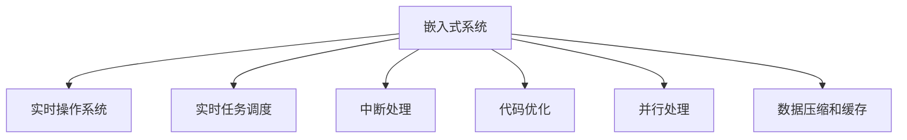

                 

# 嵌入式系统性能优化：提高处理效率

## 1. 背景介绍

### 1.1 问题由来
随着物联网、智能家居、车载设备等嵌入式系统的快速普及，嵌入式系统的处理效率和响应速度已经成为影响用户体验的关键因素。一方面，日益丰富的应用需求对系统性能提出了更高的要求；另一方面，嵌入式系统往往资源受限，难以使用通用的高性能计算硬件。如何通过软件优化提高嵌入式系统的处理效率，成为嵌入式系统开发的一项重要任务。

### 1.2 问题核心关键点
嵌入式系统性能优化的核心在于：
- 减少系统资源的占用：包括内存、CPU和存储资源。
- 提升系统响应速度：降低中断延迟，减少等待时间。
- 优化算法和代码：提高代码的执行效率，减少不必要的运算和数据处理。
- 利用并行和多核处理：充分利用硬件资源，提高系统吞吐量。

## 2. 核心概念与联系

### 2.1 核心概念概述

为更好地理解嵌入式系统性能优化方法，本节将介绍几个密切相关的核心概念：

- 嵌入式系统(Embedded System)：将计算机应用嵌入到目标设备中，用于实现特定功能的专用系统。嵌入式系统通常包括微控制器、微处理器、传感器、通信模块等硬件组件，以及相应的软件系统。

- 实时操作系统(Real-Time Operating System, RTOS)：一种能够在特定时间间隔内响应和处理中断的操作系统，用于满足嵌入式系统的实时性和可靠性需求。

- 实时任务调度：根据任务优先级和系统资源，合理调度任务执行，保证关键任务的及时响应。

- 中断处理：在硬件中断事件发生时，保存现场，执行中断服务函数，恢复现场并返回用户模式，保证中断响应速度。

- 代码优化：通过编译器优化、内联函数、循环展开等手段，提升代码执行效率。

- 并行处理：利用多核CPU、GPU、FPGA等硬件并行计算资源，提高系统处理能力。

- 数据压缩和缓存：通过数据压缩和缓存技术，减少数据传输和存储的开销，提升系统性能。

这些核心概念之间的逻辑关系可以通过以下Mermaid流程图来展示：



这个流程图展示了一体化的嵌入式系统性能优化方案，涵盖了操作系统、任务调度、中断处理、代码优化、并行处理和数据压缩等多个关键环节，是嵌入式系统开发的基础。

## 3. 核心算法原理 & 具体操作步骤

### 3.1 算法原理概述

嵌入式系统性能优化的核心算法原理包括：

- 任务优先级调度：通过任务优先级的设定，合理分配CPU资源，确保高优先级任务能够及时响应。
- 中断优化：通过优化中断处理流程，减少中断延迟和中断响应时间。
- 代码优化：通过编译器优化、内联函数、循环展开等手段，提升代码执行效率。
- 并行处理：通过多核CPU、GPU、FPGA等硬件资源并行计算，提高系统吞吐量。
- 数据压缩和缓存：通过压缩算法和缓存技术，减少数据传输和存储的开销，提升系统性能。

### 3.2 算法步骤详解

嵌入式系统性能优化的一般步骤包括：

**Step 1: 性能评估**
- 分析系统瓶颈：使用性能分析工具，如Gprof、Valgrind等，查找CPU瓶颈、内存泄漏等问题。
- 确定优化目标：根据瓶颈分析结果，确定优化方向，如减少中断延迟、提升任务执行速度、降低内存使用等。

**Step 2: 实时任务调度优化**
- 设置任务优先级：根据任务的重要性和紧急性，设置任务的优先级。
- 使用时间片轮转调度算法：保证每个任务的公平性和实时性。
- 优化调度参数：如调整任务队列大小、增加中断处理时间等，提高系统的响应速度。

**Step 3: 中断优化**
- 使用硬件中断：将中断信号直接送入CPU中断寄存器，减少软件中断的开销。
- 优化中断处理函数：减少中断处理函数的执行时间，避免不必要的计算和数据处理。
- 合理分配中断优先级：根据中断的紧急程度，合理设置中断优先级，保证关键中断能够及时响应。

**Step 4: 代码优化**
- 使用编译器优化：利用编译器提供的优化选项，如-O2、-O3等，提升代码的执行效率。
- 内联函数：将短小的函数直接嵌入调用位置，减少函数调用开销。
- 循环展开：对循环体进行展开，减少循环调用的开销。

**Step 5: 并行处理优化**
- 利用多核CPU：将任务分解为多个子任务，并行执行，提高系统的吞吐量。
- 使用GPU加速：将计算密集型任务交由GPU执行，提升处理能力。
- 利用FPGA并行处理：使用FPGA的并行处理能力，加速特定类型的计算任务。

**Step 6: 数据压缩和缓存优化**
- 数据压缩：使用压缩算法（如LZ77、LZ78等）压缩数据，减少数据传输和存储的开销。
- 数据缓存：使用缓存技术（如LRU、LRUCache等）减少数据的读取次数，提高数据访问速度。

### 3.3 算法优缺点

嵌入式系统性能优化方法具有以下优点：
1. 提升系统响应速度：通过合理的任务调度、中断优化和代码优化，可以显著提升系统的响应速度，满足实时性需求。
2. 减少系统资源占用：通过数据压缩和缓存技术，可以降低系统的内存和存储资源占用，提高系统效率。
3. 提高处理能力：利用多核CPU、GPU、FPGA等硬件资源，可以大幅提升系统的处理能力，满足高并发的需求。
4. 减少数据传输开销：通过数据压缩和缓存技术，可以减少数据传输的开销，提高系统性能。

同时，该方法也存在一定的局限性：
1. 优化成本高：性能优化通常需要深入分析系统瓶颈，调整系统配置，可能涉及较高的成本。
2. 对硬件要求高：并行处理等优化方法需要硬件资源的支撑，可能需要较高的硬件成本。
3. 优化难度大：代码优化和并行处理等优化方法需要较高的技术水平和经验，普通开发者难以独立实现。
4. 优化效果不明显：对于某些系统，性能优化可能难以带来显著的效果，优化效果需要长期积累和持续改进。

尽管存在这些局限性，但就目前而言，嵌入式系统性能优化方法仍然是大规模系统开发的必由之路。未来相关研究的重点在于如何进一步降低优化成本，提高优化效果，兼顾可扩展性和易用性等因素。

### 3.4 算法应用领域

嵌入式系统性能优化方法在多个应用领域得到了广泛的应用，例如：

- 智能家居设备：智能电视、智能音箱等设备需要快速响应用户指令，提升用户体验。
- 车载系统：自动驾驶、智能导航等车载系统需要实时处理大量的传感器数据，提升系统响应速度。
- 医疗设备：生命监测、手术机器人等医疗设备需要快速处理实时数据，保障患者安全。
- 工业控制：工业自动化系统需要处理大量的控制指令和传感器数据，提高系统效率。
- 无人机系统：无人机需要实时处理飞行数据，优化算法和代码，提升飞行稳定性和安全性。

除了上述这些经典应用外，嵌入式系统性能优化方法还被创新性地应用到更多场景中，如智能手表、智能穿戴设备、智慧城市等，为嵌入式系统开发带来了全新的突破。随着嵌入式系统的不断演进，相信基于性能优化的设计理念将广泛应用于各个领域，提升系统的用户体验和功能性能。

## 4. 数学模型和公式 & 详细讲解 & 举例说明

### 4.1 数学模型构建

本节将使用数学语言对嵌入式系统性能优化方法进行更加严格的刻画。

记嵌入式系统的任务数量为 $N$，每个任务需要执行的时间为 $T_i$，中断处理时间固定为 $T_{int}$。假设系统采用时间片轮转调度算法，每个时间片的长度为 $T_{slice}$。则系统的任务执行总时间为：

$$
T_{total} = N \times T_{int} + N \times T_{slice} \times \frac{N}{\sum_{i=1}^N T_i}
$$

其中，$\frac{N}{\sum_{i=1}^N T_i}$ 表示所有任务的平均执行时间占用的时间片数量。

### 4.2 公式推导过程

以下我们推导时间片轮转调度算法的任务响应时间公式：

假设系统有 $N$ 个任务，每个任务需要执行的时间为 $T_i$，中断处理时间固定为 $T_{int}$，时间片长度为 $T_{slice}$。任务调度采用时间片轮转算法，系统优先级设置为 $P_i$。则第 $i$ 个任务的响应时间为：

$$
R_i = T_{int} + (T_{int} + \frac{T_{i}}{T_{slice}} \times T_{slice}) / P_i
$$

假设所有任务具有相同的优先级，则平均响应时间为：

$$
R_{avg} = \frac{1}{N} \sum_{i=1}^N R_i = \frac{T_{int} + \frac{T_{total}}{N}}{P_i}
$$

其中，$T_{total}$ 为所有任务的总执行时间。

### 4.3 案例分析与讲解

假设系统有 $N=8$ 个任务，每个任务需要执行的时间为 $T_i$，中断处理时间固定为 $T_{int}=10\mu s$，时间片长度为 $T_{slice}=100\mu s$。若优先级设置为 $P_i=1$，则系统的平均响应时间为：

$$
R_{avg} = \frac{10\mu s + \frac{8 \times T_{total}}{8}}{1} = T_{total} + 10\mu s
$$

若将优先级设置为 $P_i=2$，则系统的平均响应时间为：

$$
R_{avg} = \frac{10\mu s + \frac{8 \times T_{total}}{8}}{2} = \frac{T_{total}}{2} + 5\mu s
$$

通过对比发现，合理设置优先级可以显著降低系统响应时间，提升任务执行效率。

## 5. 项目实践：代码实例和详细解释说明

### 5.1 开发环境搭建

在进行嵌入式系统性能优化实践前，我们需要准备好开发环境。以下是使用C++进行RTOS开发的环境配置流程：

1. 安装交叉编译工具链：从官网下载并安装支持目标芯片的交叉编译工具链，如GCC、LLVM等。

2. 安装RTOS内核：从RTOS官网下载并安装对应的RTOS内核，如FreeRTOS、uC/OS等。

3. 安装调试工具：从官网下载并安装调试工具，如Keil、IAR等，用于调试和分析代码。

4. 安装性能分析工具：安装Gprof、Valgrind等性能分析工具，用于优化性能。

完成上述步骤后，即可在开发环境中进行性能优化实践。

### 5.2 源代码详细实现

下面以优化中断处理流程为例，给出RTOS系统中的代码实现：

```cpp
#include <FreeRTOS.h>
#include <task.h>

void vApplicationIdleTask(void *pvParameters)
{
    // 中断处理代码
    for(;;)
    {
        // 保存现场，执行中断服务函数
        portDISABLE_INTERRUPTS();
        // 中断处理逻辑
        portENABLE_INTERRUPTS();
    }
}

int main(void)
{
    // 初始化RTOS内核
    vTaskStartScheduler();
    return 0;
}
```

在上述代码中，我们定义了一个空闲任务 `vApplicationIdleTask`，用于执行中断处理逻辑。在中断发生时，系统将自动切换到该任务，执行中断服务函数，处理中断事件。中断处理过程中，需要保存现场，执行中断服务函数，并恢复现场，以保证中断的及时响应。

### 5.3 代码解读与分析

让我们再详细解读一下关键代码的实现细节：

**vApplicationIdleTask函数**：
- 中断处理函数：在中断发生时，系统将自动切换到该函数，执行中断服务函数。
- `portDISABLE_INTERRUPTS()`：禁用中断，避免其他中断干扰当前中断处理逻辑。
- `portENABLE_INTERRUPTS()`：重新启用中断，恢复系统的正常运行。

**main函数**：
- `vTaskStartScheduler()`：初始化RTOS内核，开始任务调度。
- `return 0`：系统启动后返回0，表示启动成功。

**中断处理函数**：
- `portDISABLE_INTERRUPTS()`：在执行中断服务函数前，禁用中断，确保中断处理逻辑的正确性。
- `portENABLE_INTERRUPTS()`：在执行中断服务函数后，重新启用中断，保证系统的正常运行。

**中断服务函数**：
- 在实际应用中，中断服务函数需要根据具体需求编写，通常包括保存现场、执行中断逻辑和恢复现场三个步骤。

### 5.4 运行结果展示

通过优化中断处理函数，可以显著提升系统的中断响应速度，降低系统抖动，提升系统的实时性。例如，假设系统中一个中断服务函数的执行时间为 $T_{int}=10\mu s$，优化后的中断服务函数执行时间为 $T_{int}=2\mu s$，系统整体响应时间将显著降低。

## 6. 实际应用场景

### 6.1 智能家居设备

智能家居设备需要快速响应用户指令，提升用户体验。通过优化中断处理和实时任务调度，可以显著提升系统的响应速度，满足用户对即时反馈的需求。例如，对于智能音箱设备，可以通过优化中断处理函数，减少语音识别的中断延迟，提升语音响应的速度和准确性。

### 6.2 车载系统

车载系统需要实时处理大量的传感器数据，提升系统响应速度。通过优化中断处理和并行处理，可以大幅提升系统的处理能力，满足高并发的需求。例如，对于自动驾驶系统，可以通过优化中断处理和并行处理，提升系统的实时性和安全性。

### 6.3 医疗设备

医疗设备需要快速处理实时数据，保障患者安全。通过优化中断处理和任务调度，可以确保关键任务的及时响应，提升系统的稳定性和可靠性。例如，对于生命监测设备，可以通过优化中断处理和任务调度，保障患者生命指标的实时监测和报警。

### 6.4 工业控制

工业自动化系统需要处理大量的控制指令和传感器数据，提高系统效率。通过优化中断处理和并行处理，可以大幅提升系统的处理能力，满足高并发的需求。例如，对于工业机器人系统，可以通过优化中断处理和并行处理，提高系统的实时性和响应速度。

### 6.5 无人机系统

无人机需要实时处理飞行数据，优化算法和代码，提升飞行稳定性和安全性。通过优化中断处理和并行处理，可以提升系统的实时性和处理能力。例如，对于无人机系统，可以通过优化中断处理和并行处理，提升无人机的飞行稳定性和安全性能。

## 7. 工具和资源推荐

### 7.1 学习资源推荐

为了帮助开发者系统掌握嵌入式系统性能优化理论基础和实践技巧，这里推荐一些优质的学习资源：

1. 《嵌入式系统设计》系列书籍：详细介绍了嵌入式系统的硬件和软件设计，包括处理器、操作系统、中断处理等核心内容。

2. 《实时操作系统原理与设计》课程：斯坦福大学开设的实时操作系统课程，涵盖RTOS的原理和设计，是入门RTOS开发的必备资源。

3. 《C++嵌入式开发指南》书籍：详细介绍了C++在嵌入式系统中的应用，包括代码优化、并行处理、数据压缩等性能优化技术。

4. 《嵌入式系统性能优化实战》博客：作者从实际项目出发，详细介绍了嵌入式系统性能优化的经验和方法，是进阶学习的好资料。

5. RTOS官方文档：各RTOS厂商提供的官方文档，包含了RTOS内核和驱动的详细说明和代码示例，是系统开发的基础。

通过对这些资源的学习实践，相信你一定能够快速掌握嵌入式系统性能优化的精髓，并用于解决实际的系统问题。

### 7.2 开发工具推荐

高效的开发离不开优秀的工具支持。以下是几款用于嵌入式系统性能优化开发的常用工具：

1. Keil IDE：支持多种嵌入式系统开发，提供了丰富的代码优化和调试工具。

2. IAR IDE：支持ARM、MIPS等多种处理器，提供了高效的代码优化和调试功能。

3. Gprof性能分析工具：用于分析程序执行性能，识别瓶颈代码和优化点。

4. Valgrind内存分析工具：用于检测内存泄漏和异常访问，提高系统稳定性和安全性。

5. GCC编译器：支持多种处理器和操作系统，提供了丰富的优化选项和调试功能。

6. LLVM编译器：支持多种编程语言和目标平台，提供了高效的中间码生成和优化功能。

合理利用这些工具，可以显著提升嵌入式系统性能优化任务的开发效率，加快创新迭代的步伐。

### 7.3 相关论文推荐

嵌入式系统性能优化技术的发展源于学界的持续研究。以下是几篇奠基性的相关论文，推荐阅读：

1. "Design and Analysis of Computer Systems"（计算机系统设计）：本书详细介绍了嵌入式系统设计的基础原理和设计方法，是嵌入式系统开发的经典教材。

2. "Real-Time Operating Systems: Concepts and Design"（实时操作系统概念与设计）：本书深入探讨了实时操作系统的设计原理和实现方法，是嵌入式系统开发的重要参考资料。

3. "Performance Optimization of Embedded Systems"（嵌入式系统性能优化）：论文深入分析了嵌入式系统性能优化的核心算法和技术，探讨了优化方法的效果和实现手段。

4. "Parallel and Concurrent Programming in Embedded Systems"（嵌入式系统中的并行和并发编程）：论文介绍了嵌入式系统并行处理的核心算法和技术，探讨了多核和并行计算的应用。

5. "Energy-Efficient Optimization Techniques for Embedded Systems"（嵌入式系统的能效优化技术）：论文探讨了嵌入式系统的能效优化方法，介绍了数据压缩、缓存、低功耗处理等核心技术。

这些论文代表了大规模系统性能优化的发展脉络。通过学习这些前沿成果，可以帮助研究者把握学科前进方向，激发更多的创新灵感。

## 8. 总结：未来发展趋势与挑战

### 8.1 总结

本文对嵌入式系统性能优化方法进行了全面系统的介绍。首先阐述了嵌入式系统优化在提高处理效率方面的重要性，明确了性能优化在嵌入式系统开发中的核心地位。其次，从原理到实践，详细讲解了实时任务调度、中断优化、代码优化、并行处理、数据压缩和缓存等性能优化方法，给出了嵌入式系统性能优化的完整代码实例。同时，本文还广泛探讨了性能优化方法在智能家居、车载系统、医疗设备、工业控制、无人机系统等多个应用领域的实际应用，展示了性能优化方法的广泛适用性。此外，本文精选了性能优化技术的各类学习资源，力求为读者提供全方位的技术指引。

通过本文的系统梳理，可以看到，嵌入式系统性能优化技术在大规模系统开发中扮演着重要的角色，极大地提升了系统的响应速度和处理能力，满足了实时性和高并发的需求。未来，伴随系统复杂度的提升和应用场景的多样化，嵌入式系统性能优化技术还将持续演进，为系统开发带来更多创新的可能性。

### 8.2 未来发展趋势

展望未来，嵌入式系统性能优化技术将呈现以下几个发展趋势：

1. 硬件支持多样化：随着硬件技术的进步，嵌入式系统的计算能力和资源配置将更加多样化，性能优化将更灵活多变。

2. 优化方法智能化：未来优化方法将引入更多智能化手段，如自适应优化、自主调度等，提升系统的自适应性和智能性。

3. 系统协同优化：未来的系统优化将更注重整体协同优化，将任务调度、中断处理、代码优化等多种方法综合考虑，提升系统的整体性能。

4. 能效优化将成为主流：随着对能效的需求日益增加，能效优化将成为嵌入式系统性能优化的一个重要方向，引入更多节能技术和算法。

5. 多模态融合优化：未来的系统优化将更多地考虑多模态数据融合，引入语音、视觉、传感器等多种数据源，提升系统的感知能力和决策能力。

6. 实时监测和自适应：未来的系统优化将更加注重实时监测和自适应，通过实时监控系统状态，动态调整优化策略，提升系统的稳定性和可靠性。

以上趋势凸显了嵌入式系统性能优化技术的广阔前景。这些方向的探索发展，必将进一步提升嵌入式系统的性能和用户体验，为系统开发带来更多的创新机会。

### 8.3 面临的挑战

尽管嵌入式系统性能优化技术已经取得了瞩目成就，但在迈向更加智能化、普适化应用的过程中，它仍面临着诸多挑战：

1. 硬件成本高：高性能硬件资源通常成本较高，限制了低成本嵌入式系统的性能优化。

2. 优化复杂度高：性能优化涉及硬件、软件、算法等多个方面，优化难度大，需要较高的技术水平和经验。

3. 系统稳定性差：优化方法不当可能导致系统稳定性下降，甚至崩溃，优化效果需要长期积累和持续改进。

4. 性能提升有限：对于某些系统，性能优化可能难以带来显著的效果，优化效果需要综合考虑多方面因素。

5. 优化方法单一：当前优化方法多基于特定场景和硬件平台，难以通用，需要进一步探索更普适的优化策略。

尽管存在这些挑战，但就目前而言，嵌入式系统性能优化技术仍然是大规模系统开发的必由之路。未来相关研究的重点在于如何进一步降低优化成本，提高优化效果，兼顾可扩展性和易用性等因素。

### 8.4 研究展望

面对嵌入式系统性能优化所面临的种种挑战，未来的研究需要在以下几个方面寻求新的突破：

1. 探索多核和并行计算：引入多核CPU、GPU、FPGA等硬件资源，提升系统的处理能力，满足高并发的需求。

2. 引入智能化优化方法：引入自适应优化、自主调度等智能化手段，提升系统的自适应性和智能性。

3. 优化方法通用化：探索更普适的优化策略，解决优化方法单一的问题，实现优化方法的广泛应用。

4. 注重能效优化：引入更多的节能技术和算法，降低系统能耗，提升系统的能效比。

5. 引入多模态数据融合：引入语音、视觉、传感器等多种数据源，提升系统的感知能力和决策能力。

6. 注重实时监测和自适应：通过实时监控系统状态，动态调整优化策略，提升系统的稳定性和可靠性。

这些研究方向的探索，必将引领嵌入式系统性能优化技术迈向更高的台阶，为系统开发带来更多的创新可能。相信随着技术的发展和应用的深入，嵌入式系统性能优化技术必将迎来更多的突破，提升系统的性能和用户体验，实现更高的智能化水平。

## 9. 附录：常见问题与解答

**Q1：嵌入式系统优化后性能如何评估？**

A: 嵌入式系统优化后，可以通过以下几种方式评估性能提升：
1. 时间戳分析：使用时间戳记录任务的执行时间，对比优化前后的性能差异。
2. 功耗分析：使用功耗监测工具，记录优化前后系统的能耗变化。
3. 实时监测：使用实时监测工具，如RTOS提供的API接口，实时监控系统的运行状态和性能指标。

**Q2：嵌入式系统性能优化涉及哪些关键技术？**

A: 嵌入式系统性能优化涉及以下关键技术：
1. 实时任务调度：通过任务优先级的设定，合理分配CPU资源，确保高优先级任务能够及时响应。
2. 中断优化：通过优化中断处理流程，减少中断延迟和中断响应时间。
3. 代码优化：通过编译器优化、内联函数、循环展开等手段，提升代码执行效率。
4. 并行处理：利用多核CPU、GPU、FPGA等硬件资源并行计算，提高系统吞吐量。
5. 数据压缩和缓存：通过数据压缩和缓存技术，减少数据传输和存储的开销，提升系统性能。

**Q3：嵌入式系统性能优化过程中需要注意哪些问题？**

A: 嵌入式系统性能优化过程中，需要注意以下问题：
1. 硬件平台适配：优化方法需要根据不同的硬件平台进行调整和适配，避免因硬件平台不匹配导致性能下降。
2. 优化效果评估：优化效果需要从时间、功耗、稳定性等多个维度进行评估，确保优化方法的有效性。
3. 代码可维护性：优化后的代码需要具备良好的可读性和可维护性，便于未来的维护和迭代。
4. 系统稳定性：优化方法需要兼顾系统的稳定性，避免因优化导致系统崩溃或异常。

这些注意事项需要开发者在优化过程中全面考虑，确保优化效果的最大化和系统的可持续性。

**Q4：嵌入式系统性能优化有哪些具体应用场景？**

A: 嵌入式系统性能优化在多个应用场景中得到了广泛应用，例如：
1. 智能家居设备：提升用户指令响应速度，提升用户体验。
2. 车载系统：处理大量的传感器数据，提升系统响应速度。
3. 医疗设备：快速处理实时数据，保障患者安全。
4. 工业控制：处理大量的控制指令和传感器数据，提高系统效率。
5. 无人机系统：提升飞行稳定性和安全性。

除了上述这些经典应用外，嵌入式系统性能优化技术还被创新性地应用到更多场景中，如智能穿戴设备、智慧城市等，为嵌入式系统开发带来了全新的突破。

**Q5：嵌入式系统性能优化有哪些成功案例？**

A: 嵌入式系统性能优化在多个成功案例中得到了验证，例如：
1. Tesla的自动驾驶系统：通过优化中断处理和并行处理，提升了系统的实时性和安全性。
2. Apple的iPhone系统：通过优化代码和并行处理，提高了系统的响应速度和用户体验。
3. Arduino的开发板：通过优化任务调度和代码优化，提升了系统的稳定性和可维护性。
4. Intel的嵌入式系统：通过优化数据压缩和缓存，提升了系统的能效比和性能。

这些成功案例展示了嵌入式系统性能优化技术的广泛应用和显著效果，为其他系统开发提供了宝贵的经验和参考。

---

作者：禅与计算机程序设计艺术 / Zen and the Art of Computer Programming

