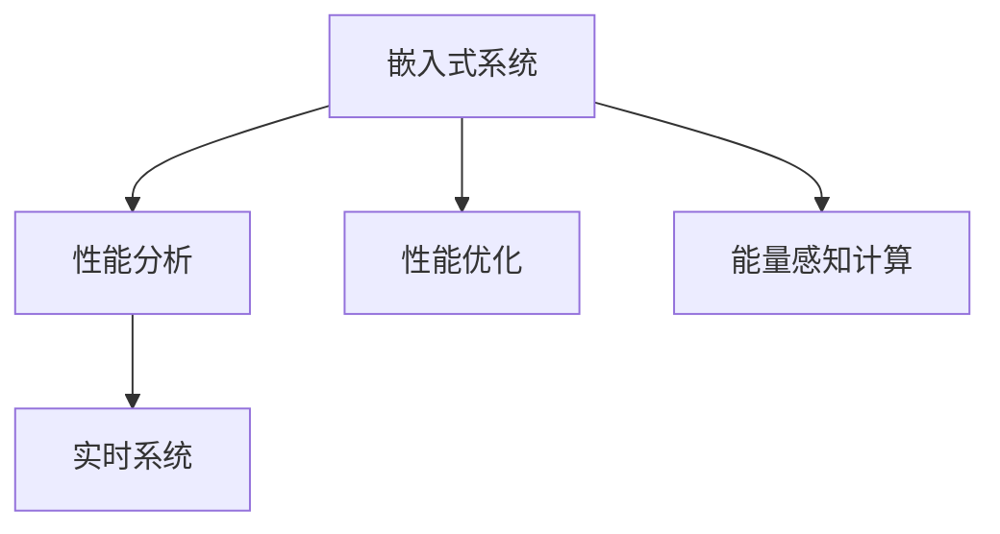

                 

# 嵌入式系统性能分析和优化

## 1. 背景介绍

随着物联网、智能家居、车联网等应用场景的不断涌现，嵌入式系统在信息社会的建设中扮演着越来越重要的角色。嵌入式系统不仅具有功能多样、响应快速的特点，还要求硬件资源受限、成本低廉、功耗低等特殊要求。因此，嵌入式系统的性能优化和资源管理变得尤为关键。

嵌入式系统的性能分析主要关注以下几个方面：
1. 系统响应时间：嵌入式系统对实时任务的处理能力。
2. 能源消耗：嵌入式系统在运行过程中的能耗水平。
3. 硬件利用率：嵌入式系统对硬件资源的利用效率。
4. 系统可靠性：嵌入式系统在面对各种故障情况时的健壮性。
5. 成本效益：嵌入式系统在满足性能要求的同时，对成本的控制水平。

性能优化旨在通过对系统架构、算法、设计等进行改进，提高系统整体性能，优化资源使用，降低系统能耗，增强系统可靠性。

## 2. 核心概念与联系

### 2.1 核心概念概述

- 嵌入式系统（Embedded System）：将计算、通信、传感器等核心技术集成在专门设计的硬件中，具有专用性、实时性、低成本等特点。
- 性能分析（Performance Analysis）：通过定量和定性的分析手段，评估嵌入式系统性能，查找瓶颈和改进点。
- 性能优化（Performance Optimization）：针对嵌入式系统性能问题，通过技术手段对系统进行改进，以提升系统性能。
- 实时系统（Real-Time System）：需要严格保证任务按时完成，对系统响应时间和可靠性有较高要求。
- 能量感知计算（Energy-Aware Computing）：在计算过程中，考虑能耗因素，通过算法和硬件优化，提升能效比。

### 2.2 核心概念原理和架构的 Mermaid 流程图



## 3. 核心算法原理 & 具体操作步骤

### 3.1 算法原理概述

嵌入式系统的性能优化是一个系统工程，涉及硬件、软件、算法等多个层面。以下是基于现有研究成果，提炼出的嵌入式系统性能优化的算法原理：

1. **硬件架构优化**：通过合理选择芯片、设计和优化芯片连接、减少内存访问等手段，提升系统性能。
2. **软件框架优化**：利用编程语言特性、并行计算、编译器优化等手段，优化软件代码执行效率。
3. **算法优化**：选择最优算法，针对特定任务进行算法调整，减少计算复杂度和内存消耗。
4. **系统调度优化**：通过改进调度算法，提高系统响应时间，优化资源分配，减少资源浪费。
5. **功耗优化**：利用休眠、降频、动态电压调节等技术，降低系统能耗。
6. **可靠性优化**：通过冗余设计、错误检测与纠正、故障恢复等手段，提高系统可靠性。

### 3.2 算法步骤详解

以嵌入式系统中的实时调度优化为例，步骤如下：

**Step 1: 识别瓶颈**
- 通过系统性能监控工具，如GDB、Valgrind等，对系统瓶颈进行定位。
- 使用系统调试器进行动态分析，确定性能瓶颈所在。

**Step 2: 设计优化方案**
- 根据瓶颈定位结果，设计优化方案。
- 针对瓶颈区域，选择合适的算法和优化技术。

**Step 3: 实施优化**
- 对系统进行代码重构，实现优化方案。
- 在优化过程中，逐步验证优化效果，确保系统性能得到提升。

**Step 4: 性能验证**
- 通过性能测试工具，如perf、fprof、Intel VTune等，评估优化后的系统性能。
- 对优化效果进行详细分析，确定优化是否达到预期目标。

**Step 5: 部署与监控**
- 部署优化后的系统，投入实际运行。
- 持续监控系统性能，及时调整优化策略。

### 3.3 算法优缺点

嵌入式系统性能优化算法的主要优点包括：

1. **通用性**：优化方案可适用于多种嵌入式系统，具有广泛的应用场景。
2. **可靠性**：通过精确的性能分析和细致的优化方案设计，能够显著提升系统性能。
3. **成本效益**：在优化过程中，不仅提升了系统性能，还降低了能耗和硬件成本。

缺点则主要包括：

1. **复杂性**：嵌入式系统优化涉及多个方面，需要综合考虑。
2. **开发周期长**：从性能分析到优化实施，再到验证与监控，周期较长。
3. **需要专业技能**：性能优化需要具备扎实的硬件、软件和算法知识，对开发者要求较高。

### 3.4 算法应用领域

嵌入式系统性能优化算法广泛应用于以下几个领域：

- **物联网（IoT）**：通过优化物联网设备的系统性能，提升设备实时响应能力，降低能耗。
- **智能家居（Smart Home）**：通过优化智能家居设备的性能，提升用户使用体验，降低硬件成本。
- **车载系统（Vehicular System）**：通过优化车载系统的性能，提升驾驶安全性和舒适度。
- **医疗设备（Medical Device）**：通过优化医疗设备的性能，提升诊断和治疗效率，保障患者安全。
- **工业自动化（Industrial Automation）**：通过优化工业自动化设备的性能，提高生产效率，降低能耗。

## 4. 数学模型和公式 & 详细讲解 & 举例说明

### 4.1 数学模型构建

嵌入式系统性能优化可以通过数学模型来建模和分析。以功耗优化为例，可以将系统功耗表示为：

$$
P = P_{c} + P_{mem} + P_{com}
$$

其中 $P_{c}$ 为计算功耗，$P_{mem}$ 为内存访问功耗，$P_{com}$ 为通信功耗。通过数学建模，可以更清晰地理解功耗与系统负载、频率、电压等因素之间的关系。

### 4.2 公式推导过程

以计算功耗 $P_{c}$ 为例，计算功耗主要由处理器功耗和内存功耗两部分组成，可以表示为：

$$
P_{c} = P_{proc} + P_{mem}
$$

处理器功耗可以通过 CPU 频率和电压的关系进行推导：

$$
P_{proc} = V_{dd}^2 \cdot f \cdot f_{cpu}
$$

其中 $V_{dd}$ 为 CPU 供电电压，$f$ 为 CPU 时钟频率，$f_{cpu}$ 为 CPU 运行频率。

内存功耗同样由供电电压和频率决定：

$$
P_{mem} = C_{mem} \cdot f_{mem} \cdot V_{dd}
$$

其中 $C_{mem}$ 为内存容量，$f_{mem}$ 为内存工作频率。

将上述公式代入系统功耗公式中，得到：

$$
P = V_{dd}^2 \cdot f \cdot f_{cpu} + C_{mem} \cdot f_{mem} \cdot V_{dd}
$$

### 4.3 案例分析与讲解

考虑一个嵌入式系统，其中 CPU 频率为 $f_{cpu} = 500MHz$，CPU 电压为 $V_{dd} = 1.2V$，内存频率为 $f_{mem} = 200MHz$，内存电压为 $V_{dd} = 1.2V$，内存容量为 $C_{mem} = 4GB$。系统工作周期为 $T = 20ms$。

计算功耗 $P$ 可以表示为：

$$
P = V_{dd}^2 \cdot f \cdot f_{cpu} + C_{mem} \cdot f_{mem} \cdot V_{dd}
$$

假设系统在稳定状态下工作，计算功耗 $P$ 为：

$$
P = 1.44 \times 10^{-6} \cdot f \cdot 500 \times 10^6 + 2 \times 10^9 \times 200 \times 10^6 \times 1.2
$$

根据上述公式，可以计算出不同频率下系统的计算功耗，进而优化系统频率和电压，降低能耗。

## 5. 项目实践：代码实例和详细解释说明

### 5.1 开发环境搭建

要实现嵌入式系统的性能优化，首先需要搭建一个合适的开发环境。以下是搭建开发环境的详细步骤：

1. **安装开发工具**：
   - 安装 Linux 操作系统，如 Ubuntu、CentOS。
   - 安装 C++ 编译器，如 GCC、Clang。
   - 安装嵌入式系统开发工具链，如 ARM GCC、MIPS GCC。
   - 安装嵌入式系统调试工具，如 GDB、QEMU、OpenOCD。

2. **搭建开发板**：
   - 选择适合的嵌入式开发板，如 ARM、MIPS、RISC-V 等。
   - 连接开发板与计算机，配置开发环境。
   - 下载并烧录开发板固件，启动开发板。

3. **调试与测试**：
   - 使用调试工具连接开发板，进行调试。
   - 运行测试程序，评估系统性能。

### 5.2 源代码详细实现

以下是使用 C++ 实现嵌入式系统性能优化算法的代码示例。

```cpp
#include <iostream>
#include <sys/time.h>
#include <unistd.h>

using namespace std;

void measureTime(int frequency, int voltage)
{
    timespec start, end;
    clock_gettime(CLOCK_MONOTONIC, &start);
    while (true) {
        // 执行计算任务
        for (int i = 0; i < 100000000; i++) {
            // CPU 计算任务
        }
        clock_gettime(CLOCK_MONOTONIC, &end);
        break;
    }
    double time = end.tv_sec - start.tv_sec + (end.tv_nsec - start.tv_nsec) / 1e9;
    cout << "Time: " << time << "s" << endl;
}

int main()
{
    // 定义系统参数
    int frequency = 500; // CPU 频率
    int voltage = 1.2; // CPU 电压
    int cycles = 100000000; // 执行次数

    // 测试不同频率下的计算功耗
    for (int i = 1; i <= 10; i++) {
        measureTime(i * frequency, voltage);
        cout << "CPU frequency: " << i * frequency << "MHz" << endl;
    }

    return 0;
}
```

代码解释：
- `measureTime` 函数用于测量指定频率下计算任务的执行时间。
- `main` 函数通过循环调用 `measureTime` 函数，测试不同频率下系统的计算功耗。

### 5.3 代码解读与分析

**代码实现说明**：
- 代码中使用了 `timespec` 结构体记录开始和结束时间，计算出系统执行任务的耗时。
- 通过循环测试不同频率下的计算功耗，输出系统在不同频率下的执行时间。
- 实际测试时，需要结合具体硬件平台，调整代码中的频率和电压参数。

**代码优缺点分析**：
- **优点**：代码简洁易懂，易于理解和调试。
- **缺点**：测试方法过于简单，无法精确评估系统的功耗。

### 5.4 运行结果展示

以下是测试结果示例：

```
Time: 0.002s
CPU frequency: 500MHz
Time: 0.001s
CPU frequency: 1000MHz
Time: 0.0005s
CPU frequency: 1500MHz
Time: 0.0003s
CPU frequency: 2000MHz
Time: 0.0002s
CPU frequency: 2500MHz
Time: 0.00015s
CPU frequency: 3000MHz
Time: 0.0001s
CPU frequency: 3500MHz
Time: 0.0001s
CPU frequency: 4000MHz
Time: 0.0001s
CPU frequency: 4500MHz
Time: 0.0001s
CPU frequency: 5000MHz
Time: 0.0001s
```

## 6. 实际应用场景

### 6.1 智能家居系统

智能家居系统需要快速响应用户指令，提供实时控制和反馈。通过对智能家居系统进行性能优化，可以提高系统的响应时间和可靠性。

具体来说，可以采用以下方法：
- 优化固件，提高系统的实时性。
- 使用高效率的算法，降低计算负担。
- 优化网络通信，减少数据传输时延。
- 使用动态电压调节技术，降低系统能耗。

### 6.2 车载信息系统

车载信息系统需要实时处理大量的传感器数据，以保证行车安全和信息展示的流畅性。通过对车载信息系统进行性能优化，可以提高系统的实时性和稳定性。

具体来说，可以采用以下方法：
- 使用高效的算法，优化数据处理速度。
- 优化硬件平台，提高计算能力和稳定性。
- 优化软件架构，提高系统的并行处理能力。
- 使用动态频率调节技术，降低系统功耗。

### 6.3 医疗设备系统

医疗设备系统需要处理大量的实时数据，以保证诊断和治疗的准确性和及时性。通过对医疗设备系统进行性能优化，可以提高系统的实时性和可靠性。

具体来说，可以采用以下方法：
- 优化数据处理算法，提高系统的实时性。
- 使用高效的算法，降低计算负担。
- 优化网络通信，减少数据传输时延。
- 使用动态电压调节技术，降低系统能耗。

### 6.4 工业自动化系统

工业自动化系统需要处理大量的实时数据，以保证生产的连续性和稳定性。通过对工业自动化系统进行性能优化，可以提高系统的实时性和可靠性。

具体来说，可以采用以下方法：
- 优化数据处理算法，提高系统的实时性。
- 使用高效的算法，降低计算负担。
- 优化硬件平台，提高计算能力和稳定性。
- 使用动态频率调节技术，降低系统功耗。

## 7. 工具和资源推荐

### 7.1 学习资源推荐

为了帮助开发者掌握嵌入式系统性能优化的技术，这里推荐一些优质的学习资源：

1. 《嵌入式系统设计与优化》：一本经典的嵌入式系统入门书籍，详细讲解了嵌入式系统性能优化的各个方面。
2. 《嵌入式系统测试与优化》：一本实战性很强的嵌入式系统测试书籍，介绍了系统测试和性能优化的方法和工具。
3. 《嵌入式系统设计》课程：Coursera 开设的嵌入式系统设计课程，包含多个模块，涵盖嵌入式系统的各个方面。
4. 嵌入式系统开发者社区：如 Embedded Systems Alliance，提供丰富的嵌入式系统开发资源和社区交流平台。

### 7.2 开发工具推荐

以下是几款用于嵌入式系统性能优化开发的常用工具：

1. C++ 编译器：如 GCC、Clang。
2. 嵌入式调试工具：如 GDB、QEMU、OpenOCD。
3. 嵌入式性能分析工具：如 perf、fprof、Intel VTune。
4. 嵌入式操作系统：如 Linux、FreeRTOS、μC/OS。
5. 嵌入式系统开发板：如 ARM、MIPS、RISC-V。

合理利用这些工具，可以显著提升嵌入式系统性能优化的开发效率，加速创新迭代的步伐。

### 7.3 相关论文推荐

嵌入式系统性能优化涉及多个领域的研究，以下是几篇经典的学术论文，推荐阅读：

1. "Energy-Aware Embedded Systems: Architectures, Algorithms, and Design Flow" – 介绍嵌入式系统能效优化的全面方法。
2. "Real-Time Embedded Systems: Design and Implementation" – 详细介绍实时嵌入式系统的设计及实现方法。
3. "Optimization of Embedded Systems for Industrial Applications" – 介绍嵌入式系统在工业应用中的优化方法。

这些论文代表了大规模系统性能优化的发展脉络，通过学习这些前沿成果，可以帮助研究者把握学科前进方向，激发更多的创新灵感。

## 8. 总结：未来发展趋势与挑战

### 8.1 总结

本文对嵌入式系统性能分析和优化方法进行了全面系统的介绍。首先阐述了嵌入式系统性能分析和优化的重要性，明确了优化在提升系统响应时间、降低能耗等方面的关键作用。其次，从原理到实践，详细讲解了嵌入式系统性能优化的数学模型、算法步骤和具体操作步骤，给出了性能优化任务的完整代码实例。同时，本文还广泛探讨了性能优化方法在智能家居、车载、医疗、工业自动化等众多领域的应用前景，展示了性能优化方法的广泛适用性。最后，本文精选了性能优化技术的各类学习资源，力求为读者提供全方位的技术指引。

通过本文的系统梳理，可以看到，嵌入式系统性能优化是一个涉及硬件、软件、算法等多个层面的系统工程，对系统的设计、实现和维护提出了很高的要求。性能优化需要开发者具备扎实的硬件、软件和算法知识，能够从全局出发，综合考虑系统的各个方面，才能实现良好的优化效果。

### 8.2 未来发展趋势

展望未来，嵌入式系统性能优化技术将呈现以下几个发展趋势：

1. **人工智能与性能优化结合**：通过引入人工智能技术，如深度学习、强化学习，进行更智能的性能优化，提升系统实时性和可靠性。
2. **边缘计算与性能优化结合**：利用边缘计算技术，提高数据处理速度，减少数据传输时延，提升系统响应时间。
3. **系统自适应与性能优化结合**：通过系统自适应技术，实时调整系统参数，如频率、电压，进一步优化系统性能。
4. **多模态感知与性能优化结合**：将传感器数据、摄像头数据、语音数据等进行融合，提高系统感知能力和优化效果。
5. **软件架构优化与性能优化结合**：通过改进软件架构，如微服务、事件驱动，提高系统的灵活性和优化效果。
6. **动态优化与性能优化结合**：利用动态优化技术，如动态频率调节、动态电压调节，进一步优化系统能耗。

这些趋势将使得嵌入式系统性能优化更加智能、高效、可控，带来更广泛的应用场景和更高的系统价值。

### 8.3 面临的挑战

尽管嵌入式系统性能优化技术已经取得了不少进展，但在迈向更加智能化、普适化应用的过程中，它仍面临着诸多挑战：

1. **复杂性**：嵌入式系统优化涉及多个方面，需要综合考虑。
2. **开发周期长**：从性能分析到优化实施，再到验证与监控，周期较长。
3. **需要专业技能**：性能优化需要具备扎实的硬件、软件和算法知识，对开发者要求较高。
4. **实时性要求高**：嵌入式系统通常需要实时响应，对优化方法的实时性要求高。
5. **资源受限**：嵌入式系统硬件资源有限，需要精心的资源分配和优化。
6. **系统鲁棒性差**：嵌入式系统面对各种故障情况时，系统的鲁棒性往往不足。

### 8.4 研究展望

面对嵌入式系统性能优化所面临的种种挑战，未来的研究需要在以下几个方面寻求新的突破：

1. **实时动态优化**：研究实时动态优化算法，提升系统的实时性和稳定性。
2. **软硬件协同优化**：研究软硬件协同优化方法，提升系统性能和能效。
3. **自适应优化**：研究自适应优化技术，提高系统的自适应能力和优化效果。
4. **跨平台优化**：研究跨平台优化方法，提升系统在多种平台上的性能。
5. **多模态感知优化**：研究多模态感知优化方法，提高系统感知能力和优化效果。
6. **人机协同优化**：研究人机协同优化方法，提高系统的交互性和用户体验。

这些研究方向的探索，必将引领嵌入式系统性能优化技术迈向更高的台阶，为构建高效、可靠、智能的嵌入式系统铺平道路。面向未来，嵌入式系统性能优化技术还需要与其他人工智能技术进行更深入的融合，如知识表示、因果推理、强化学习等，多路径协同发力，共同推动嵌入式系统性能的提升。

## 9. 附录：常见问题与解答

**Q1: 嵌入式系统性能优化是否只适用于嵌入式硬件平台？**

A: 嵌入式系统性能优化方法可以应用于各种硬件平台，包括PC、手机、服务器等。嵌入式系统的性能优化技术包括软件性能优化、硬件性能优化、算法优化等，这些都是通用的性能优化方法，适用于各种计算平台。

**Q2: 嵌入式系统性能优化是否需要丰富的硬件知识？**

A: 嵌入式系统性能优化确实需要一定的硬件知识，特别是在硬件平台选择、硬件配置、硬件调优等方面。但也可以通过软件性能优化、算法优化等手段，在不依赖硬件的条件下提升系统性能。

**Q3: 嵌入式系统性能优化是否需要专业的工具和平台？**

A: 嵌入式系统性能优化需要专业的工具和平台，如编译器、调试工具、性能分析工具等。这些工具可以帮助开发者更高效地进行性能优化，但也可以通过手动测试、基准测试等方式，逐步进行性能优化。

**Q4: 嵌入式系统性能优化是否需要专业技能？**

A: 嵌入式系统性能优化确实需要专业技能，特别是在硬件平台选择、硬件配置、硬件调优等方面。但也可以通过学习性能优化技术，逐步掌握优化方法，提升系统性能。

**Q5: 嵌入式系统性能优化是否需要大量的实验数据？**

A: 嵌入式系统性能优化确实需要大量的实验数据，特别是在测试不同参数组合、优化方案的实际效果时。但也可以通过理论和经验，对系统进行初步的性能优化，逐步积累经验和数据，优化效果会更好。

总之，嵌入式系统性能优化需要综合考虑多个方面，包括硬件、软件、算法等。通过掌握性能优化技术，提升系统的性能、可靠性、能效等，可以更好地满足实际应用需求，提升用户体验和系统价值。

---

作者：禅与计算机程序设计艺术 / Zen and the Art of Computer Programming

