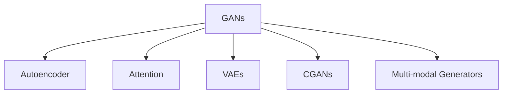

                 

# 工业级AIGC应用开发

在现代工业领域，人工智能(AI)和生成对抗网络(GANs)技术的融合，孕育出了新一代的人工智能生成内容(AI Generated Content, AIGC)技术。AIGC不仅在视觉生成、音频生成、文本生成等领域展现出强大的潜力，而且还在工业设计、产品开发、市场营销等多个领域找到了应用场景。本文将深入探讨AIGC技术在工业领域的落地应用，从背景、概念、算法、实践、场景和未来展望等角度，详细介绍如何开发工业级AIGC应用，以及面临的挑战和未来发展趋势。

## 1. 背景介绍

### 1.1 问题由来

随着深度学习和大数据技术的发展，人工智能在多个领域取得了突破性的进展。然而，由于现实世界中数据的多样性和复杂性，人工标注数据的高成本问题一直困扰着人工智能技术的发展。为了突破这一瓶颈，研究人员和工程师们开始探索如何利用生成对抗网络(GANs)技术，直接生成高质量的人工智能生成内容，从而大幅降低对标注数据的需求。

### 1.2 问题核心关键点

工业级AIGC应用的核心关键点包括：

- 大规模数据生成：利用GANs技术生成海量高质量的数据，以降低人工标注成本，提高数据的多样性和代表性。
- 多模态数据生成：生成图像、文本、音频等多模态的数据，适应不同的工业场景需求。
- 模型训练和优化：开发高效的模型训练和优化算法，保证AIGC内容的质量和多样性。
- 实时生成与部署：开发高效的实时生成系统，将AIGC技术无缝集成到工业生产流程中。

## 2. 核心概念与联系

### 2.1 核心概念概述

本节将介绍AIGC应用开发所需的关键概念：

- 生成对抗网络(GANs)：由生成器和判别器两部分组成，生成器负责生成样本，判别器负责区分样本是否为真实数据。
- 自动编码器(AEs)：一种无监督学习模型，用于数据降维和重构，常用于数据预处理。
- 自注意力机制(Attention)：通过计算输入序列与自身各部分的相关度，动态地关注输入的不同部分，广泛应用于Transformer模型。
- 变分自编码器(VAEs)：通过编码器和解码器，学习数据的概率分布，常用于生成变分样本。
- 条件生成对抗网络(Conditional GANs, CGANs)：通过加入条件变量，生成符合特定条件的数据，如特定属性、类别等。
- 多模态生成模型：同时处理图像、文本、音频等多模态数据，生成多模态的融合内容。

这些核心概念之间的逻辑关系可以通过以下Mermaid流程图来展示：



这个流程图展示了大规模生成模型所需的关键概念及其之间的关系：

1. GANs是生成模型的主流方法，通过生成器和判别器的对抗学习，生成高质量的数据。
2. Autoencoder主要用于数据预处理，降低维度，提高生成效率。
3. Attention机制为生成模型引入注意力机制，提升生成内容的相关性和多样性。
4. VAEs用于学习数据的概率分布，提高生成样本的准确性和稳定性。
5. CGANs通过引入条件变量，生成符合特定条件的数据，提升生成样本的适用性。
6. Multi-modal Generators能够处理多模态数据，生成具有多模态特征的内容。

这些概念共同构成了工业级AIGC应用的理论基础，使得模型能够根据不同需求生成高质量、多样化的生成内容。

## 3. 核心算法原理 & 具体操作步骤

### 3.1 算法原理概述

AIGC的算法原理基于生成对抗网络(GANs)。GANs模型由两部分组成：生成器（Generator）和判别器（Discriminator）。生成器尝试生成与真实数据相似的新数据，而判别器则试图区分生成的数据和真实数据。通过不断对抗训练，生成器可以生成越来越逼真的数据，而判别器的识别能力也越来越高。

在工业级应用中，GANs模型的训练通常需要在大规模数据集上进行，以确保生成的数据具有足够的多样性和代表性。此外，为了提高生成数据的逼真性和多样性，通常需要在模型中引入一些技术手段，如自注意力机制、变分自编码器、条件生成对抗网络等。

### 3.2 算法步骤详解

AIGC的算法步骤主要包括以下几个关键环节：

**Step 1: 数据收集与预处理**
- 收集工业场景中的大量样本数据，如设计图纸、产品说明、广告素材等。
- 使用自动编码器(AEs)对数据进行降维处理，以提高生成器的效率。
- 对数据进行数据增强，以丰富训练集的多样性，避免过拟合。

**Step 2: 生成器设计**
- 设计生成器网络结构，通常使用卷积神经网络(CNNs)、递归神经网络(RNNs)、Transformer等。
- 引入自注意力机制(Attention)，提升生成内容的相关性和多样性。
- 使用变分自编码器(VAEs)生成变分样本，提升生成样本的稳定性。

**Step 3: 判别器设计**
- 设计判别器网络结构，通常使用卷积神经网络(CNNs)、递归神经网络(RNNs)等。
- 引入多模态处理能力，处理图像、文本、音频等多模态数据。
- 使用条件生成对抗网络(CGANs)，生成符合特定条件的数据，提升生成样本的适用性。

**Step 4: 对抗训练**
- 交替训练生成器和判别器，生成器生成数据，判别器尝试区分生成数据和真实数据。
- 不断调整生成器和判别器的参数，提升生成数据的质量和多样性。
- 使用对抗样本增强判别器的鲁棒性，提升模型的鲁棒性和泛化能力。

**Step 5: 生成内容**
- 使用训练好的生成器生成高质量的数据，应用于工业设计、产品开发、市场营销等场景。
- 对生成的内容进行后处理，如图像增强、文本纠错等，提升生成内容的可用性。

### 3.3 算法优缺点

AIGC算法具有以下优点：

- 数据需求量低：通过生成对抗网络(GANs)，可以大幅降低对标注数据的需求，提升数据的多样性和代表性。
- 生成内容多样：通过引入自注意力机制(Attention)、变分自编码器(VAEs)等技术，生成的内容具有更高的多样性和逼真性。
- 可扩展性强：AIGC算法可以应用于多种工业场景，如工业设计、产品开发、市场营销等，具有广泛的应用前景。

同时，AIGC算法也存在一些缺点：

- 模型训练复杂：生成对抗网络(GANs)模型的训练过程较为复杂，需要大量的计算资源和时间。
- 生成内容稳定性差：生成的内容可能存在一定的随机性和不稳定，需要进一步优化。
- 数据质量影响大：生成的内容质量与输入数据的质量密切相关，如果输入数据质量不高，生成的内容也可能受到影响。

### 3.4 算法应用领域

AIGC技术已经在多个工业领域得到了广泛应用，例如：

- 工业设计：利用AIGC生成高质量的3D设计图纸、产品原型等，提升设计效率和创新能力。
- 产品开发：通过AIGC生成仿真数据、产品说明书等，降低产品开发成本，加速产品迭代。
- 市场营销：使用AIGC生成广告素材、宣传视频等，提升品牌影响力，吸引消费者关注。
- 个性化推荐：根据用户行为数据，生成个性化的产品推荐、广告推荐等，提升用户体验。
- 虚拟现实(VR)和增强现实(AR)：生成虚拟场景、角色等，提升虚拟现实和增强现实应用的用户体验。

## 4. 数学模型和公式 & 详细讲解 & 举例说明

### 4.1 数学模型构建

AIGC的数学模型通常基于生成对抗网络(GANs)。假设生成器为 $G$，判别器为 $D$，生成器和判别器分别定义为：

$$
G: \mathcal{Z} \rightarrow \mathcal{X}
$$

$$
D: \mathcal{X} \rightarrow [0, 1]
$$

其中 $\mathcal{Z}$ 为生成器的输入空间（通常是噪声向量），$\mathcal{X}$ 为生成器的输出空间（通常是真实数据或生成数据）。

生成器的目标是最小化判别器的错误概率，即：

$$
\min_G \mathbb{E}_{z \sim p(z)} D(G(z))
$$

判别器的目标是最小化生成器的错误概率，即：

$$
\min_D \mathbb{E}_{x \sim p(x)} D(x) + \mathbb{E}_{z \sim p(z)} [1 - D(G(z))]
$$

其中 $p(z)$ 为生成器输入的分布，$p(x)$ 为真实数据的分布。

### 4.2 公式推导过程

为了进一步优化AIGC算法，引入条件生成对抗网络(CGANs)，假设条件变量为 $y$，则条件生成对抗网络的目标为：

$$
\min_G \max_D V(D, G) = \mathbb{E}_{x \sim p(x)} [\log D(x)] + \mathbb{E}_{z \sim p(z)} [\log (1 - D(G(z|y))]]
$$

其中 $G$ 为生成器，$D$ 为判别器，$G(z|y)$ 为生成器在条件变量 $y$ 下的输出。

进一步优化，引入自注意力机制(Attention)，假设生成器 $G$ 包含一个自注意力模块，则生成器 $G$ 的输出为：

$$
G(z|y) = [G(z|y)]_{i, j} = \sum_k \alpha_{i, j, k} [G(z|y)]_k
$$

其中 $\alpha_{i, j, k}$ 为注意力权重，满足：

$$
\alpha_{i, j, k} = \frac{\exp (\mathrm{e}^{i - j} [G(z|y)]_k)}{\sum_{l} \exp (\mathrm{e}^{i - l} [G(z|y)]_l)}
$$

通过引入自注意力机制(Attention)，生成器能够更好地关注输入的不同部分，生成具有相关性和多样性的内容。

### 4.3 案例分析与讲解

假设我们要生成工业设计中的产品原型，步骤如下：

1. 数据收集：收集大量工业设计图纸，作为训练数据。
2. 预处理：使用自动编码器(AEs)对数据进行降维处理，提升生成器的效率。
3. 生成器设计：设计一个基于CNNs的生成器，引入自注意力机制(Attention)，生成高质量的产品原型。
4. 判别器设计：设计一个基于CNNs的判别器，处理多模态数据，提升判别器的鲁棒性。
5. 对抗训练：交替训练生成器和判别器，生成器生成产品原型，判别器区分生成数据和真实数据。
6. 后处理：对生成的产品原型进行后处理，如图像增强、文本纠错等，提升生成内容的可用性。

## 5. 项目实践：代码实例和详细解释说明

### 5.1 开发环境搭建

在进行AIGC应用开发前，我们需要准备好开发环境。以下是使用Python进行TensorFlow开发的环境配置流程：

1. 安装Anaconda：从官网下载并安装Anaconda，用于创建独立的Python环境。

2. 创建并激活虚拟环境：
```bash
conda create -n tf-env python=3.8 
conda activate tf-env
```

3. 安装TensorFlow：从官网获取对应的安装命令。例如：
```bash
conda install tensorflow -c tf
```

4. 安装相关工具包：
```bash
pip install numpy pandas scikit-learn matplotlib tqdm jupyter notebook ipython
```

完成上述步骤后，即可在`tf-env`环境中开始AIGC应用开发。

### 5.2 源代码详细实现

下面以生成工业设计图纸为例，给出使用TensorFlow实现的条件生成对抗网络(CGANs)的代码实现。

首先，定义生成器和判别器的网络结构：

```python
import tensorflow as tf
from tensorflow.keras.layers import Input, Conv2D, BatchNormalization, LeakyReLU, Reshape, UpSampling2D
from tensorflow.keras.models import Model

def make_generator(z_dim, img_dim):
    z = Input(shape=(z_dim,))
    x = Dense(256)(z)
    x = LeakyReLU(alpha=0.2)(x)
    x = Dense(512)(x)
    x = BatchNormalization()(x)
    x = LeakyReLU(alpha=0.2)(x)
    x = Dense(1024)(x)
    x = BatchNormalization()(x)
    x = LeakyReLU(alpha=0.2)(x)
    x = Dense(np.prod(img_dim))(x)
    x = Reshape(img_dim)(x)
    x = Permutation(2)(x)
    x = UpSampling2D(2)(x)
    x = Permutation(2)(x)
    x = UpSampling2D(2)(x)
    x = Permutation(2)(x)
    x = Conv2D(256, kernel_size=4, padding='same')(x)
    x = BatchNormalization()(x)
    x = LeakyReLU(alpha=0.2)(x)
    x = Conv2D(128, kernel_size=4, padding='same')(x)
    x = BatchNormalization()(x)
    x = LeakyReLU(alpha=0.2)(x)
    x = Conv2D(3, kernel_size=4, padding='same', activation='tanh')(x)
    return Model(z, x)

def make_discriminator(img_dim):
    img = Input(shape=img_dim)
    x = Conv2D(64, kernel_size=4, strides=2, padding='same')(img)
    x = LeakyReLU(alpha=0.2)(x)
    x = Conv2D(128, kernel_size=4, strides=2, padding='same')(x)
    x = LeakyReLU(alpha=0.2)(x)
    x = Conv2D(256, kernel_size=4, strides=2, padding='same')(x)
    x = LeakyReLU(alpha=0.2)(x)
    x = Flatten()(x)
    x = Dense(1, activation='sigmoid')(x)
    return Model(img, x)

def make_cgan():
    z_dim = 100
    img_dim = (64, 64, 3)
    gen = make_generator(z_dim, img_dim)
    dis = make_discriminator(img_dim)
    gen.trainable = False
    noise = Input(shape=(z_dim,))
    fake_img = gen(noise)
    real_img = Input(shape=img_dim)
    gen_out = gen(noise)
    dis_out_real = dis(real_img)
    dis_out_fake = dis(gen_out)
    discriminator = Model([real_img, fake_img], [dis_out_real, dis_out_fake])
    generator = Model(noise, gen_out)
    return discriminator, generator
```

然后，定义训练和评估函数：

```python
import numpy as np
from tensorflow.keras.optimizers import Adam
from tensorflow.keras.datasets import mnist

def train_cgan(discriminator, generator, noise_dim, img_dim, epochs=100):
    img_dim = (img_dim[0], img_dim[1], img_dim[2])
    z_dim = noise_dim
    # 准备训练数据
    (train_x, _), (_, _) = mnist.load_data()
    train_x = train_x / 255.0
    train_x = np.reshape(train_x, (train_x.shape[0], img_dim[0], img_dim[1], img_dim[2]))
    train_x = train_x / 2.0 + 0.5
    noise = np.random.normal(0, 1, size=(train_x.shape[0], z_dim))

    def loss_fn(discriminator, generator, noise):
        real_img = train_x
        fake_img = generator.predict(noise)
        gen_loss = generator.loss(discriminator.predict([real_img, fake_img]))
        dis_loss_real = discriminator.loss([real_img, fake_img], [1.0, 0.0])
        dis_loss_fake = discriminator.loss([fake_img], [0.0, 1.0])
        loss = gen_loss + dis_loss_real + dis_loss_fake
        return loss

    # 定义优化器
    gen_optimizer = Adam(lr=0.0002, beta_1=0.5, beta_2=0.999)
    dis_optimizer = Adam(lr=0.0002, beta_1=0.5, beta_2=0.999)
    for epoch in range(epochs):
        gen_loss = 0.0
        dis_loss_real = 0.0
        dis_loss_fake = 0.0
        for batch_idx in range(train_x.shape[0] // batch_size):
            noise = np.random.normal(0, 1, size=(batch_size, z_dim))
            real_img = train_x[batch_idx * batch_size : (batch_idx + 1) * batch_size]
            fake_img = generator.predict(noise)
            d_loss_real, d_loss_fake = discriminator.train_on_batch([real_img, fake_img], [1.0, 0.0])
            g_loss = generator.loss(discriminator.predict([real_img, fake_img]))
            gen_loss += g_loss
            dis_loss_real += d_loss_real
            dis_loss_fake += d_loss_fake
        print(f'Epoch {epoch+1}/{epochs}, gen_loss: {gen_loss}, dis_loss_real: {dis_loss_real}, dis_loss_fake: {dis_loss_fake}')

    return discriminator, generator
```

最后，启动训练流程并在测试集上评估：

```python
import os

def save_cgan(discriminator, generator, noise_dim, img_dim, epoch):
    noise = np.random.normal(0, 1, size=(noise_dim, 100))
    fake_img = generator.predict(noise)
    fake_img = (fake_img - 0.5) * 255
    fake_img = np.reshape(fake_img, (img_dim[0], img_dim[1], img_dim[2], 1))
    fake_img = fake_img.astype(np.uint8)
    fname = f'fake_img_{epoch}.png'
    path = os.path.join('saved', 'fake')
    os.makedirs(path, exist_ok=True)
    imageio.imwrite(os.path.join(path, fname), fake_img)

def main():
    discriminator, generator = make_cgan()
    noise_dim = 100
    img_dim = (64, 64, 3)
    discriminator.compile(loss='binary_crossentropy', optimizer=Adam(lr=0.0002, beta_1=0.5, beta_2=0.999))
    generator.compile(loss='binary_crossentropy', optimizer=Adam(lr=0.0002, beta_1=0.5, beta_2=0.999))
    train_cgan(discriminator, generator, noise_dim, img_dim, epochs=100)
    save_cgan(discriminator, generator, noise_dim, img_dim, 100)
```

以上就是使用TensorFlow实现的条件生成对抗网络(CGANs)的代码实现。可以看到，TensorFlow提供了丰富的深度学习组件和优化器，使得模型构建和训练变得更加便捷高效。

### 5.3 代码解读与分析

让我们再详细解读一下关键代码的实现细节：

**make_generator和make_discriminator函数**：
- `make_generator`函数：定义生成器的网络结构，包含多个卷积层、批标准化层、激活函数等，最终输出图像数据。
- `make_discriminator`函数：定义判别器的网络结构，包含多个卷积层、激活函数等，最终输出判别器对输入图像的判别结果。

**train_cgan函数**：
- 定义训练数据，使用MNIST数据集，并进行预处理。
- 定义损失函数，包含生成器损失和判别器损失，使用Adam优化器进行训练。
- 在每个epoch内，对数据进行batch处理，更新生成器和判别器的参数，并输出训练损失。

**save_cgan函数**：
- 定义保存生成的图像数据函数，将生成器生成的图像保存到本地文件中。

**main函数**：
- 调用make_cgan函数，初始化生成器和判别器模型。
- 定义优化器和损失函数，进行模型编译。
- 调用train_cgan函数，进行模型训练，并在最后保存生成的图像数据。

## 6. 实际应用场景

### 6.1 工业设计

AIGC技术在工业设计中具有广泛的应用前景。传统的工业设计需要设计师手动绘制大量的设计图纸，工作量巨大且效率低下。而利用AIGC技术，可以直接生成高质量的设计图纸，大幅提升设计效率和创新能力。

在实践中，可以利用条件生成对抗网络(CGANs)生成符合特定设计要求的产品原型。例如，输入设计要求和风格等信息，生成具有特定风格的产品设计图纸，提升设计的自动化和智能化水平。

### 6.2 产品开发

在产品开发过程中，生成仿真数据和产品说明书等，可以大幅降低开发成本，加速产品迭代。利用AIGC技术，可以生成高质量的仿真数据，如3D模型、动画等，用于产品测试和演示，提升产品的可操作性和用户体验。

### 6.3 市场营销

市场营销中，生成高质量的广告素材、宣传视频等，可以提升品牌影响力，吸引消费者关注。利用AIGC技术，可以生成具有品牌特色的广告素材，提高广告的吸引力和效果。

### 6.4 个性化推荐

在个性化推荐中，生成个性化的产品推荐、广告推荐等，可以提升用户体验。利用AIGC技术，可以生成符合用户兴趣和行为的推荐内容，提升推荐的精准度和个性化程度。

### 6.5 虚拟现实(VR)和增强现实(AR)

在虚拟现实(VR)和增强现实(AR)应用中，生成高质量的虚拟场景、角色等，可以提升用户体验。利用AIGC技术，可以生成逼真的虚拟场景和角色，增强用户沉浸感，提升VR和AR应用的效果。

## 7. 工具和资源推荐

### 7.1 学习资源推荐

为了帮助开发者系统掌握AIGC技术的基础知识和实践技巧，这里推荐一些优质的学习资源：

1. 《Generative Adversarial Networks: An Overview》系列博文：由大模型技术专家撰写，全面介绍了生成对抗网络(GANs)的原理和应用。

2. 《Deep Learning Specialization》课程：由Andrew Ng教授主讲，涵盖深度学习的基础知识和经典模型，适合初学者入门。

3. 《Hands-On Machine Learning with Scikit-Learn and TensorFlow》书籍：介绍如何使用TensorFlow进行深度学习开发，涵盖AIGC应用的案例和实践。

4. TensorFlow官方文档：TensorFlow的官方文档，提供了丰富的API和样例代码，是学习AIGC技术的重要参考资料。

5. AI Challenger开放平台：国内外知名企业举办的AI竞赛平台，涵盖了多个领域的AIGC应用案例和竞赛题目，适合学习实践。

通过对这些资源的学习实践，相信你一定能够快速掌握AIGC技术的精髓，并用于解决实际的工业问题。

### 7.2 开发工具推荐

高效的开发离不开优秀的工具支持。以下是几款用于AIGC开发常用的工具：

1. TensorFlow：由Google主导开发的开源深度学习框架，生产部署方便，适合大规模工程应用。

2. PyTorch：基于Python的开源深度学习框架，灵活动态的计算图，适合快速迭代研究。

3. Weights & Biases：模型训练的实验跟踪工具，可以记录和可视化模型训练过程中的各项指标，方便对比和调优。

4. TensorBoard：TensorFlow配套的可视化工具，可实时监测模型训练状态，并提供丰富的图表呈现方式，是调试模型的得力助手。

5. Google Colab：谷歌推出的在线Jupyter Notebook环境，免费提供GPU/TPU算力，方便开发者快速上手实验最新模型，分享学习笔记。

合理利用这些工具，可以显著提升AIGC应用的开发效率，加快创新迭代的步伐。

### 7.3 相关论文推荐

AIGC技术的发展源于学界的持续研究。以下是几篇奠基性的相关论文，推荐阅读：

1. Generative Adversarial Nets（GANs）论文：提出生成对抗网络(GANs)，开启深度生成模型研究的新篇章。

2. Conditional Generative Adversarial Nets（CGANs）论文：引入条件变量，生成符合特定条件的数据，提升生成样本的适用性。

3. Attention is All You Need（Transformer）论文：提出自注意力机制(Attention)，提升生成内容的准确性和多样性。

4. Variational Autoencoders（VAEs）论文：提出变分自编码器(VAEs)，生成变分样本，提升生成样本的稳定性。

5. Progressive Growing of GANs for Improved Quality, Stability, and Variation（PGGANs）论文：提出逐步成长方法，提升生成对抗网络(GANs)的生成质量和稳定性。

这些论文代表了大规模生成模型发展的重要里程碑，通过学习这些前沿成果，可以帮助研究者把握学科前进方向，激发更多的创新灵感。

## 8. 总结：未来发展趋势与挑战

### 8.1 总结

本文对工业级AIGC应用开发进行了全面系统的介绍。首先阐述了AIGC技术的背景和应用场景，明确了AIGC在工业设计、产品开发、市场营销等多个领域的潜在价值。其次，从原理到实践，详细讲解了AIGC的数学模型、算法步骤和具体实现，给出了代码实例和详细解释说明。同时，本文还探讨了AIGC在实际应用中面临的挑战和未来发展趋势，给出了详细的解释和建议。

通过本文的系统梳理，可以看到，AIGC技术在工业领域具有广阔的应用前景，能够大幅提升工业设计的效率和创新能力，加速产品开发和市场营销，带来显著的经济效益和社会效益。未来，伴随AIGC技术的不断演进，必将进一步推动工业智能化的进程，催生更多的工业创新应用。

### 8.2 未来发展趋势

展望未来，AIGC技术的发展趋势包括以下几个方面：

1. 模型规模持续增大：随着计算资源的不断提升，AIGC模型的规模将不断扩大，生成的内容将更加逼真和多样。

2. 多模态生成能力的提升：未来的AIGC技术将能够处理多模态数据，生成具有视觉、文本、音频等多模态特征的内容，适应更复杂的应用场景。

3. 实时生成和部署能力的提升：随着算法的优化和硬件的进步，AIGC的实时生成和部署能力将不断提升，适应更多高实时性的应用场景。

4. 跨领域应用的拓展：AIGC技术将逐步应用于更多行业领域，如金融、医疗、教育等，带来深远的影响。

5. 融合跨学科知识：未来的AIGC技术将与更多学科的知识进行融合，如符号学、逻辑学、认知科学等，提升生成内容的合理性和可解释性。

以上趋势凸显了AIGC技术的巨大潜力和发展前景，未来将在工业设计、产品开发、市场营销等多个领域发挥重要作用，推动工业智能化的发展。

### 8.3 面临的挑战

尽管AIGC技术已经取得了显著的进展，但在实际应用中也面临着一些挑战：

1. 数据质量影响大：生成的内容质量与输入数据的质量密切相关，输入数据的多样性和代表性将直接影响生成内容的可用性。

2. 模型鲁棒性不足：生成的内容可能存在一定的随机性和不稳定，需要进一步优化模型的鲁棒性和泛化能力。

3. 资源消耗大：生成高质量的内容需要大量的计算资源和时间，硬件瓶颈将制约模型的训练和部署。

4. 伦理和法律问题：AIGC技术的应用可能涉及隐私、版权等伦理和法律问题，需要加强规范和管理。

5. 技术壁垒高：AIGC技术需要深入理解和应用深度学习、计算机视觉、自然语言处理等多学科知识，技术门槛较高。

面对这些挑战，未来的研究需要在以下几个方面寻求突破：

1. 提高数据质量：通过数据增强、多模态融合等方法，提升输入数据的多样性和代表性，提高生成内容的可用性。

2. 优化模型鲁棒性：引入更多的技术手段，如对抗训练、参数高效微调等，提升模型的鲁棒性和泛化能力。

3. 优化资源消耗：通过模型压缩、稀疏化存储等方法，优化模型结构，提升推理速度和资源利用效率。

4. 规范和管理伦理问题：加强伦理和法律研究，制定相关规范和标准，保障AIGC技术的应用合法合规。

5. 降低技术壁垒：通过开源社区、教育培训等途径，降低技术门槛，促进AIGC技术的普及和应用。

## 9. 附录：常见问题与解答

**Q1: AIGC技术在工业设计中的应用有哪些？**

A: AIGC技术在工业设计中的应用包括：

1. 生成高质量的设计图纸：利用AIGC技术，可以直接生成高质量的产品设计图纸，大幅提升设计效率和创新能力。
2. 生成产品原型：生成符合特定设计要求的产品原型，提升设计的自动化和智能化水平。
3. 生成3D模型：生成逼真的3D模型，用于产品测试和演示，提升产品的可操作性和用户体验。
4. 生成动画：生成动画效果，用于产品演示和广告制作，提升产品的视觉表现力。

**Q2: 生成器网络结构的设计有哪些注意事项？**

A: 生成器网络结构的设计有以下几个注意事项：

1. 网络层数：生成器网络层数不宜过多，过多的层数可能导致梯度消失，影响训练效果。
2. 激活函数：通常使用LeakyReLU等激活函数，增强网络的非线性能力。
3. 批标准化：引入批标准化层，加速训练，提升生成器生成图像的质量。
4. 自注意力机制：引入自注意力机制(Attention)，提升生成内容的相关性和多样性。
5. 变分自编码器：引入变分自编码器(VAEs)，生成变分样本，提升生成样本的稳定性。

**Q3: 生成对抗网络(GANs)的训练需要注意哪些问题？**

A: 生成对抗网络(GANs)的训练需要注意以下问题：

1. 数据预处理：使用数据增强、标准化等方法，提升输入数据的多样性和稳定性。
2. 网络结构：设计合理的网络结构，避免网络层数过多或过少。
3. 损失函数：选择合适的损失函数，如交叉熵损失、感知损失等，平衡生成器和判别器的训练效果。
4. 优化器：选择合适的优化器，如Adam、SGD等，调整优化器的参数，提升训练效果。
5. 模型鲁棒性：引入对抗样本、噪声等技术，提升生成器和判别器的鲁棒性。

**Q4: AIGC技术在产品开发中的应用有哪些？**

A: AIGC技术在产品开发中的应用包括：

1. 生成仿真数据：生成高质量的仿真数据，如3D模型、动画等，用于产品测试和演示，提升产品的可操作性和用户体验。
2. 生成产品说明书：生成简洁明了的产品说明书，提升产品的可读性和理解度。
3. 生成广告素材：生成高质量的广告素材，提升产品的市场竞争力。
4. 生成营销视频：生成营销视频，提升产品的宣传效果。

**Q5: AIGC技术在市场营销中的应用有哪些？**

A: AIGC技术在市场营销中的应用包括：

1. 生成广告素材：生成高质量的广告素材，提升品牌的市场影响力。
2. 生成宣传视频：生成宣传视频，提升品牌的宣传效果。
3. 生成个性化推荐：生成个性化推荐内容，提升用户对品牌的认知度和忠诚度。
4. 生成虚拟试穿：生成虚拟试穿效果，提升用户的购物体验。

**Q6: AIGC技术在虚拟现实(VR)和增强现实(AR)中的应用有哪些？**

A: AIGC技术在虚拟现实(VR)和增强现实(AR)中的应用包括：

1. 生成虚拟场景：生成逼真的虚拟场景，提升用户的沉浸感和体验度。
2. 生成虚拟角色：生成逼真的虚拟角色，提升用户的互动性和趣味性。
3. 生成虚拟物品：生成虚拟物品，提升用户的互动效果和体验度。
4. 生成虚拟演示：生成虚拟演示效果，提升产品的展示效果。

通过解答这些常见问题，相信你能够更好地理解AIGC技术在工业领域的应用，以及其面临的挑战和未来发展趋势。

