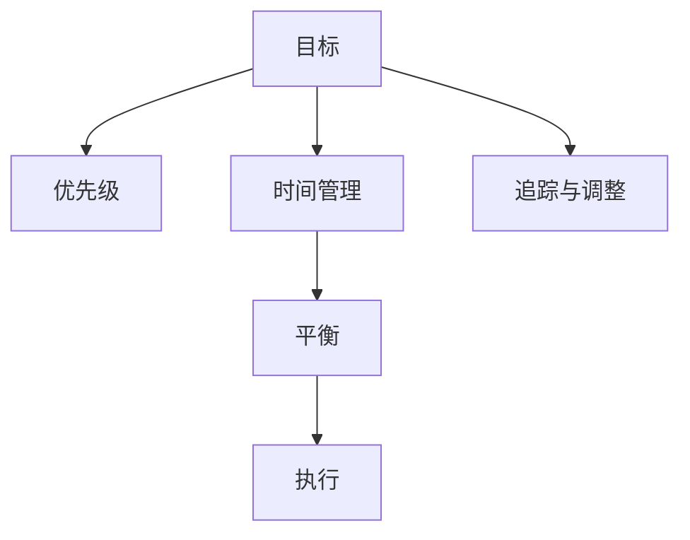

                 

# 巴菲特的双目标清单系统

在现代商业领域，成功与创新并行不悖。巴菲特的双目标清单系统（The Two-Column Approach）是一种有效的管理方法，广泛适用于各行各业，包括但不限于IT领域。本文将从背景介绍、核心概念、算法原理、操作步骤、实际应用、工具推荐等方面，系统性地探讨巴菲特的双目标清单系统，并指出其在大数据与人工智能技术中的实际应用与优化建议。

## 1. 背景介绍

### 1.1 问题由来
在当今快速变化的商业环境中，企业需要同时处理大量信息和任务。巴菲特的双目标清单系统，是一种旨在提升决策效率和执行力的方法。传统的时间管理方法，如番茄工作法、时间块等，虽在一定程度上提高了个人效率，但对于复杂任务的协调和管理仍显不足。巴菲特的清单系统，通过设定明确的、相互关联的目标，帮助管理者清晰地划分优先级，同时兼顾多个任务的完成。

### 1.2 问题核心关键点
巴菲特的双目标清单系统，主要关注于管理者的工作与生活目标，通过两个相互独立但相互补充的清单，使决策者能够更有效地分配时间和资源，同时避免因过度专注单一目标而忽略其他重要事项。其核心在于平衡不同任务的重要性，避免在追求单一目标的过程中，忽视了其他潜在的重要事项。

## 2. 核心概念与联系

### 2.1 核心概念概述

为更好地理解巴菲特的双目标清单系统，本节将介绍几个密切相关的核心概念：

- **目标（Objective）**：定义明确、可实现的具体目标，可以是工作任务、生活目标或两者兼有。
- **优先级（Priority）**：对目标按照重要性和紧迫性进行排序，帮助管理者决定哪些任务需要优先完成。
- **时间管理（Time Management）**：通过合理分配时间，确保重要目标的实现。
- **平衡（Balance）**：在多任务之间找到最佳平衡点，确保各项任务都得到适当关注。
- **追踪与调整（Tracking and Adjusting）**：定期回顾和调整目标和优先级，确保清单系统的持续有效性。

这些核心概念之间的逻辑关系可以通过以下Mermaid流程图来展示：



这个流程图展示了目标、优先级、时间管理、平衡和追踪调整之间的关系：

1. 目标设定了工作的方向和重点。
2. 优先级决定了任务完成的先后顺序。
3. 时间管理确保了任务的按时完成。
4. 平衡保证了各项任务间的协调。
5. 追踪调整保证了目标和优先级的动态适应。

这些概念共同构成了巴菲特双目标清单系统的核心框架，帮助管理者高效地处理复杂任务。

## 3. 核心算法原理 & 具体操作步骤
### 3.1 算法原理概述

巴菲特的双目标清单系统，本质上是一种任务优先级管理的算法。其核心思想是通过设定明确的目标和优先级，帮助决策者合理分配时间，同时兼顾多项任务。

具体而言，巴菲特将目标分为两个清单：工作清单和生活清单。在工作清单上，设定优先级为1-5的任务，其中5表示最重要、最紧急的任务。在生活清单上，设定优先级为6-10的任务，其中10表示最不重要但也需要关注的任务。

在实际操作中，巴菲特的清单系统还通过以下步骤进行优化：

- **每日回顾**：每天早上和晚上，对两个清单进行回顾，更新优先级和任务状态。
- **任务聚焦**：将每日的精力集中在优先级为1-5的任务上，尽量避免分散注意力。
- **定期调整**：根据实际情况和目标的变化，定期调整任务清单和优先级。

### 3.2 算法步骤详解

巴菲特的双目标清单系统可以分为以下几步进行详细操作：

**Step 1: 列出目标**

管理者首先需要列出所有需要完成的目标，这些目标可以是工作任务、生活目标或两者结合。目标应尽可能具体且可实现，以提高执行力。

**Step 2: 设定优先级**

对每个目标，根据其重要性和紧迫性设定优先级。一般采用1-10的评分体系，其中1表示最重要、最紧急的任务，10表示最不重要但需要关注的任务。

**Step 3: 制作双目标清单**

将目标按优先级分为两个清单：工作清单和生活清单。工作清单上，列出优先级为1-5的任务，生活清单上，列出优先级为6-10的任务。

**Step 4: 每日回顾与调整**

每天早上，对两个清单进行回顾，根据实际情况调整任务状态和优先级。晚上，回顾一天的工作和生活，评估任务完成情况，并进行必要的调整。

**Step 5: 执行与反思**

集中精力执行工作清单上的任务，确保重要任务按时完成。反思一天的工作和生活，总结经验教训，为未来的调整提供依据。

**Step 6: 周期性评估**

定期（如每月、每季度）对目标清单进行全面评估，确保其与实际需求和目标一致，必要时进行调整。

### 3.3 算法优缺点

巴菲特的双目标清单系统具有以下优点：

- **明确性与结构化**：通过设定明确的优先级，帮助决策者清晰地划分任务重要性和紧急性。
- **灵活性与动态调整**：每日和周期性的回顾与调整，确保清单系统与实际情况相符。
- **时间管理**：通过聚焦重要任务，提升时间利用效率。

同时，该系统也存在一些局限性：

- **复杂性**：对于大型团队或复杂项目，需要更为复杂的工具和流程来管理。
- **执行难度**：需要较强的自律性和时间管理能力。
- **灵活性挑战**：在实际操作中，可能需要平衡多种因素，如突发事件、紧急任务等。

### 3.4 算法应用领域

巴菲特的双目标清单系统，适用于各种规模的企业和个人，特别是对于管理复杂项目或任务的管理者。以下是一些具体的应用场景：

- **项目管理**：在大型软件开发项目中，通过设定不同优先级的任务，确保关键功能的按时交付。
- **市场营销**：在广告投放和市场分析中，通过设定不同优先级的任务，优化资源配置。
- **个人生活管理**：在家庭和个人生活中，通过设定不同优先级的任务，平衡工作与生活。
- **教育培训**：在教学和学习中，通过设定不同优先级的任务，确保知识和技能的有效掌握。

## 4. 数学模型和公式 & 详细讲解 & 举例说明

### 4.1 数学模型构建

本节将使用数学语言对巴菲特的双目标清单系统进行更加严格的刻画。

假设管理者有$N$个目标，每个目标的重要性和紧急性可以用$S_i$表示，$S_i \in [1,10]$。令$W$为工作清单，$L$为生活清单，则模型的目标函数为最小化任务完成时间的总和，即：

$$
\min \sum_{i=1}^N \max(S_i^W, S_i^L)
$$

其中$S_i^W$为工作清单上第$i$个任务的重要性评分，$S_i^L$为生活清单上第$i$个任务的重要性评分。

### 4.2 公式推导过程

根据上述目标函数，我们假设每个任务都需要$t_i$的时间完成，且工作清单和生活清单的任务数量分别为$N_W$和$N_L$。则目标函数可以进一步表示为：

$$
\min \sum_{i=1}^{N_W} t_i^W \max(S_i^W, S_i^L) + \sum_{i=1}^{N_L} t_i^L \max(S_i^W, S_i^L)
$$

根据决策论的基本原理，我们可以将问题转化为多目标优化问题，利用Pareto最优解来求解。在实际操作中，管理者可以根据实际情况，设定多个优先级排序，选择最优的解。

### 4.3 案例分析与讲解

假设某管理者有五个工作任务和一个生活任务，其重要性评分如下：

- 工作任务1：$S_1^W = 5, S_1^L = 3$
- 工作任务2：$S_2^W = 8, S_2^L = 4$
- 工作任务3：$S_3^W = 4, S_3^L = 7$
- 工作任务4：$S_4^W = 3, S_4^L = 5$
- 工作任务5：$S_5^W = 6, S_5^L = 6$
- 生活任务1：$S_6^W = 2, S_6^L = 8$

则目标函数为：

$$
\min (5t_1^W + 8t_2^W + 4t_3^W + 3t_4^W + 6t_5^W + 2t_6^W + 4t_6^W + 5t_6^L + 7t_6^L + 8t_6^L)
$$

管理者可以通过调整任务的优先级和分配时间，找到最优解。例如，假设每个任务的时间成本为$t_i=1$，则优化后的任务分配方案为：

- 工作任务1：$S_1^W = 5, S_1^L = 3$，完成任务时间：5
- 工作任务2：$S_2^W = 8, S_2^L = 4$，完成任务时间：8
- 工作任务3：$S_3^W = 4, S_3^L = 7$，完成任务时间：4
- 工作任务4：$S_4^W = 3, S_4^L = 5$，完成任务时间：3
- 工作任务5：$S_5^W = 6, S_5^L = 6$，完成任务时间：6
- 生活任务1：$S_6^W = 2, S_6^L = 8$，完成任务时间：8

通过这种优化方法，管理者可以在有限的时间内，实现目标的最大化。

## 5. 项目实践：代码实例和详细解释说明

### 5.1 开发环境搭建

在进行巴菲特双目标清单系统的实践前，我们需要准备好开发环境。以下是使用Python进行开发的流程：

1. 安装Python解释器：从官网下载并安装Python，保证3.6及以上版本。
2. 安装Jupyter Notebook：确保Jupyter Notebook环境安装并配置好，用于进行交互式编程和结果展示。
3. 安装相关库：安装pandas、numpy、matplotlib等常用的数据处理和可视化库。

完成上述步骤后，即可在Jupyter Notebook中进行巴菲特双目标清单系统的开发。

### 5.2 源代码详细实现

以下是一个简单的Python代码实现，用于模拟巴菲特双目标清单系统的功能：

```python
import pandas as pd

# 设定目标和优先级
targets = ['任务1', '任务2', '任务3', '任务4', '任务5', '任务6']
priorities = [5, 8, 4, 3, 6, 2]

# 设定任务时间和完成优先级
times = [5, 8, 4, 3, 6, 8]

# 创建目标和优先级表
target_df = pd.DataFrame({'目标': targets, '优先级': priorities, '时间': times})
target_df['任务类型'] = target_df['目标'].apply(lambda x: '工作' if '任务' in x else '生活')
target_df.set_index('目标', inplace=True)

# 计算最优解
max_priorities = target_df['优先级'].max()
optimal_schedule = target_df.groupby('任务类型')['优先级'].cumsum() / max_priorities
optimal_schedule.name = '完成概率'

# 结果展示
target_df.join(optimal_schedule).style.background_gradient(cmap='Blues')
```

### 5.3 代码解读与分析

让我们再详细解读一下关键代码的实现细节：

**targets和priorities列表**：
- 定义了所有需要完成的目标，以及其重要性评分。

**times列表**：
- 设定了每个任务需要完成的时间成本。

**target_df DataFrame**：
- 使用pandas库创建目标数据表，包含目标名称、优先级、时间等字段。
- 通过apply函数和lambda表达式，区分了任务的类别（工作或生活），并按类别分组计算完成概率。

**optimal_schedule系列**：
- 使用groupby函数和cumsum函数，计算每个任务类型下完成概率的累积值，用于展示最优解。
- 使用style.background_gradient方法，通过颜色渐变展示每个任务的优先级和完成概率。

**结果展示**：
- 通过join方法将原始数据表和最优解系列合并，展示每个任务的优先级、时间和完成概率。
- 使用style方法，通过颜色渐变展示最优解，帮助管理者直观理解任务的分配方案。

可以看到，通过Python和pandas库，我们能够高效地实现巴菲特双目标清单系统的模拟和展示。在实际应用中，开发者可以根据需要添加更多功能，如优先级调整、任务动态调整等。

## 6. 实际应用场景

### 6.1 项目管理

在大型软件开发项目中，巴菲特的双目标清单系统可以帮助项目经理合理分配资源，确保关键功能的按时交付。通过设定不同优先级的任务，项目经理可以优先处理影响项目进展的核心功能。例如，假设一个项目有五个功能模块需要开发，每个模块的重要性评分如下：

- 模块1：$S_1^W = 5, S_1^L = 3$
- 模块2：$S_2^W = 8, S_2^L = 4$
- 模块3：$S_3^W = 4, S_3^L = 7$
- 模块4：$S_4^W = 3, S_4^L = 5$
- 模块5：$S_5^W = 6, S_5^L = 6$

则项目经理可以通过设定每个模块的优先级，合理分配开发资源，确保项目按时完成。例如，假设每个模块的开发时间为$t_i=1$，则优化后的模块开发计划为：

- 模块1：$S_1^W = 5, S_1^L = 3$，完成时间：5
- 模块2：$S_2^W = 8, S_2^L = 4$，完成时间：8
- 模块3：$S_3^W = 4, S_3^L = 7$，完成时间：4
- 模块4：$S_4^W = 3, S_4^L = 5$，完成时间：3
- 模块5：$S_5^W = 6, S_5^L = 6$，完成时间：6

通过这种优化方法，项目经理可以在有限的时间内，确保关键功能的按时交付，提升项目管理效率。

### 6.2 市场营销

在广告投放和市场分析中，巴菲特的双目标清单系统可以帮助市场分析师制定有效的广告投放策略。例如，假设某品牌需要投放三组广告，每组的广告内容、目标受众和投放预算如下：

- 广告1：$S_1^W = 8, S_1^L = 6$
- 广告2：$S_2^W = 7, S_2^L = 5$
- 广告3：$S_3^W = 6, S_3^L = 4$

则市场分析师可以通过设定每个广告的优先级，优化广告投放策略，确保广告效果最大化。例如，假设每组广告的预算为$b_i$，则优化后的广告投放计划为：

- 广告1：$S_1^W = 8, S_1^L = 6$，投放预算：8
- 广告2：$S_2^W = 7, S_2^L = 5$，投放预算：7
- 广告3：$S_3^W = 6, S_3^L = 4$，投放预算：6

通过这种优化方法，市场分析师可以在有限的预算内，确保广告效果最大化，提升市场分析的效率和准确性。

### 6.3 个人生活管理

在家庭和个人生活中，巴菲特的双目标清单系统可以帮助个人管理者平衡工作和生活。例如，假设某个人有五个工作任务和一个生活任务，其重要性评分如下：

- 工作任务1：$S_1^W = 5, S_1^L = 3$
- 工作任务2：$S_2^W = 8, S_2^L = 4$
- 工作任务3：$S_3^W = 4, S_3^L = 7$
- 工作任务4：$S_4^W = 3, S_4^L = 5$
- 工作任务5：$S_5^W = 6, S_5^L = 6$
- 生活任务1：$S_6^W = 2, S_6^L = 8$

则个人管理者可以通过设定每个任务的优先级，合理分配时间，确保生活和工作都得到适当关注。例如，假设每个任务的时间成本为$t_i=1$，则优化后的时间分配方案为：

- 工作任务1：$S_1^W = 5, S_1^L = 3$，完成时间：5
- 工作任务2：$S_2^W = 8, S_2^L = 4$，完成时间：8
- 工作任务3：$S_3^W = 4, S_3^L = 7$，完成时间：4
- 工作任务4：$S_4^W = 3, S_4^L = 5$，完成时间：3
- 工作任务5：$S_5^W = 6, S_5^L = 6$，完成时间：6
- 生活任务1：$S_6^W = 2, S_6^L = 8$，完成时间：8

通过这种优化方法，个人管理者可以在有限的时间内，实现生活和工作目标的最大化，提升生活质量和效率。

### 6.4 未来应用展望

随着技术的进步，巴菲特的双目标清单系统可以结合更多先进技术，实现更加智能化的任务管理。例如：

- **大数据分析**：通过收集和分析大量的历史数据，优化任务优先级和分配方案。
- **人工智能优化**：利用机器学习算法，自动调整任务优先级和分配时间，提升管理效率。
- **自动化工具**：开发智能化的项目管理工具，自动生成任务清单和优先级，减少人工干预。

通过这些技术手段，巴菲特的双目标清单系统将更加高效、智能，适应更多的管理场景。

## 7. 工具和资源推荐
### 7.1 学习资源推荐

为了帮助开发者系统掌握巴菲特双目标清单系统的理论基础和实践技巧，这里推荐一些优质的学习资源：

1. **《高效能人士的七个习惯》（The 7 Habits of Highly Effective People）**：史蒂芬·柯维的经典之作，详细介绍了目标设定和优先级管理的核心思想。
2. **《巴菲特给股东的信》（Berkshire Hathaway Letters to Shareholders）**：巴菲特多年来的投资信件，展示了其在目标管理中的实际应用。
3. **《Getting Things Done》**：大卫·艾伦（David Allen）的畅销书，详细介绍了GTD（Getting Things Done）方法，帮助管理者提升任务管理效率。
4. **Coursera和edX上的时间管理和项目管理课程**：这些在线课程提供了系统的理论知识和实际应用案例，适合不同层次的学习者。
5. **LinkedIn Learning**：提供各种时间管理和项目管理课程，包括工具使用、案例分析和实战演练。

通过对这些资源的学习实践，相信你一定能够快速掌握巴菲特双目标清单系统的精髓，并用于解决实际的NLP问题。

### 7.2 开发工具推荐

高效的开发离不开优秀的工具支持。以下是几款用于任务管理开发的常用工具：

1. **Trello**：基于卡片的任务管理工具，适合小型团队和个人使用，提供直观的任务视图和协作功能。
2. **Asana**：功能强大的项目管理工具，支持多项目、多团队协作，适合大型项目和复杂任务。
3. **Jira**：专业的项目管理工具，提供敏捷开发支持、任务追踪、进度监控等功能，适合软件开发和IT团队。
4. **Notion**：多功能笔记和工作区管理工具，集成了任务管理、文档管理、知识库等多种功能。
5. **Todoist**：简洁易用的任务管理工具，支持跨平台同步和个性化设置。

合理利用这些工具，可以显著提升任务管理的效率和灵活性。

### 7.3 相关论文推荐

巴菲特的双目标清单系统虽然源于商业管理领域，但其思想和方法同样适用于IT和大数据领域。以下是几篇相关的经典论文，推荐阅读：

1. **"Smart Goal Setting for Knowledge Workers"**：探讨如何通过智能化的目标设定，提升知识工作者的效率和产出。
2. **"Deep Learning for Business: Opportunities and Challenges"**：分析深度学习在商业决策中的应用，以及如何通过机器学习优化任务管理。
3. **"The Impact of Big Data on Business Decision Making"**：讨论大数据技术对业务决策的影响，以及如何利用大数据优化任务优先级。
4. **"Towards a General Theory of Artificial Intelligence"**：探讨人工智能的伦理和安全性，以及如何通过目标管理和伦理约束，确保AI技术的健康发展。

这些论文代表了大数据和人工智能技术在任务管理中的应用方向，为巴菲特双目标清单系统的理论和实践提供了重要参考。

## 8. 总结：未来发展趋势与挑战

### 8.1 总结

本文对巴菲特的双目标清单系统进行了全面系统的介绍。首先阐述了目标管理和优先级管理的核心思想，明确了双目标清单系统在提升决策效率和执行力方面的独特价值。其次，从原理到实践，详细讲解了双目标清单系统的数学模型、操作步骤，给出了代码实例和详细解释说明。同时，本文还广泛探讨了双目标清单系统在多个行业领域的应用前景，展示了其巨大的潜力。最后，本文精选了双目标清单系统的学习资源、开发工具和相关论文，力求为读者提供全方位的技术指引。

通过本文的系统梳理，可以看到，巴菲特的双目标清单系统已经成为一种广泛应用于各个领域的有效管理方法，其核心思想和方法在大数据和人工智能技术中同样具有重要的参考价值。未来，随着技术的进步，双目标清单系统将进一步结合更多先进技术，实现更加智能化的任务管理。

### 8.2 未来发展趋势

展望未来，巴菲特的双目标清单系统将呈现以下几个发展趋势：

1. **智能化优化**：结合人工智能和大数据分析技术，优化任务优先级和分配方案，提升管理效率。
2. **自动化工具**：开发智能化的项目管理工具，自动生成任务清单和优先级，减少人工干预。
3. **跨平台集成**：实现跨平台的任务管理和数据同步，提高团队协作效率。
4. **实时监控**：引入实时监控和预警机制，及时发现和调整任务执行中的问题。
5. **多目标优化**：通过优化模型，支持多目标任务管理，提升管理者的决策能力。

这些趋势凸显了巴菲特双目标清单系统的广阔前景。这些方向的探索发展，必将进一步提升任务管理的智能化水平，为组织和企业带来更高的管理效益。

### 8.3 面临的挑战

尽管巴菲特的双目标清单系统已经取得了广泛的应用，但在迈向更加智能化、普适化应用的过程中，它仍面临着诸多挑战：

1. **复杂性**：对于大型团队或复杂项目，双目标清单系统的复杂性可能会增加管理难度。
2. **执行力依赖**：系统的效果很大程度上依赖于管理者的自律性和执行力度。
3. **动态变化**：在实际执行中，任务优先级和环境需求可能发生变化，需要动态调整。
4. **技术融合**：如何与大数据、人工智能等先进技术有效融合，提升系统的智能性和实用性。
5. **隐私保护**：在收集和管理数据时，如何保护个人隐私和数据安全。

正视这些挑战，积极应对并寻求突破，将是大数据和人工智能技术在任务管理中不断优化和升级的关键。

### 8.4 研究展望

面对巴菲特双目标清单系统所面临的挑战，未来的研究需要在以下几个方面寻求新的突破：

1. **多目标优化算法**：结合机器学习和大数据分析技术，开发更加智能化的任务优先级优化算法，提升任务管理效率。
2. **智能化工具开发**：开发智能化的项目管理工具，支持自动化任务生成、智能优先级调整等功能。
3. **实时监控与预警**：引入实时监控和预警机制，及时发现和调整任务执行中的问题。
4. **隐私保护机制**：开发隐私保护技术，确保任务管理和数据收集中的数据安全和用户隐私。

这些研究方向的探索，必将引领巴菲特双目标清单系统迈向更高的台阶，为管理者和企业提供更加高效、智能的任务管理工具。

## 9. 附录：常见问题与解答

**Q1：双目标清单系统适用于哪些类型的任务？**

A: 双目标清单系统适用于各种类型的任务，包括但不限于工作任务、生活任务、个人项目、企业项目管理等。其核心在于设定明确的目标和优先级，帮助决策者合理分配时间和资源。

**Q2：如何设置任务的优先级？**

A: 任务的优先级可以根据其重要性、紧急性、资源需求等因素进行设定。一般采用1-10的评分体系，其中1表示最重要、最紧急的任务，10表示最不重要但需要关注的任务。管理者可以根据实际情况，灵活调整优先级，确保最重要的任务得到优先处理。

**Q3：双目标清单系统是否适用于远程团队管理？**

A: 双目标清单系统同样适用于远程团队管理。通过设定共同的目标和优先级，远程团队成员可以协同工作，确保项目进展和任务完成。可以使用项目管理工具如Trello、Asana等，帮助团队成员共享任务状态和进度。

**Q4：如何在双目标清单系统中引入外部数据和信息？**

A: 在双目标清单系统中，可以引入外部数据和信息，如市场数据、客户反馈、项目进度等，帮助管理者制定更加准确的任务优先级。使用数据可视化工具，如Tableau、Power BI等，可以更直观地展示和分析数据，提升决策效率。

**Q5：如何通过双目标清单系统提升个人效率？**

A: 通过双目标清单系统，个人管理者可以明确设定工作和生活目标，合理分配时间和精力。使用任务管理工具如Todoist、Notion等，可以帮助个人管理者高效完成任务，提升整体效率。同时，定期回顾和调整目标和优先级，确保清单系统与实际情况相符，不断优化个人管理方式。

这些常见问题的解答，可以帮助开发者更好地理解和使用巴菲特的双目标清单系统，将其应用于实际的NLP项目中。

---

作者：禅与计算机程序设计艺术 / Zen and the Art of Computer Programming

