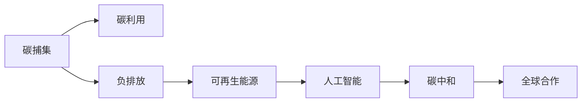

                 

# 2050年的全球减排：从碳捕集利用到负排放技术的碳中和路径

> 关键词：碳中和,碳捕集,负排放,可再生能源,人工智能,未来技术,全球减排

## 1. 背景介绍

### 1.1 问题由来

全球气候变化正成为人类面临的重大挑战。近年来，由于全球温度的持续升高，极端天气事件的频发以及海平面上升，使得全球生态系统和社会经济都遭受巨大威胁。为了应对气候变化，各国政府纷纷制定了减排目标，试图通过各种措施降低温室气体排放。

然而，当前的减排方式（如能源结构调整、碳税等）虽然取得了一定的效果，但仍然无法满足全球气候目标。为此，科学家和工程师们提出了一系列前沿技术，以实现更为高效的碳捕集和负排放，逐步实现全球碳中和。

### 1.2 问题核心关键点

实现碳中和的关键在于通过技术手段实现碳的捕集、利用和储存，最终实现负排放，即人工移除大气中的二氧化碳。这涉及到以下几个核心关键点：

- 碳捕集(Carbon Capture and Storage, CCS)：从工业生产、能源消费等过程中捕获二氧化碳。
- 碳利用(Carbon Utilization)：将捕获的二氧化碳转化为化学品、燃料、建材等，实现二次利用。
- 负排放(Negative Emissions)：通过技术手段如生物能源与碳捕集、直接空气捕集等方式，将大气中的二氧化碳转化或隔离。
- 全球合作：各国需携手合作，共同推进碳中和进程，并确保技术和资源的高效利用。

这些关键点共同构成了未来全球减排的基本框架，并通过技术的不断进步和全球协同行动，逐步实现碳中和的目标。

## 2. 核心概念与联系

### 2.1 核心概念概述

为了更清晰地理解碳中和路径，本节将介绍几个核心概念及其相互联系：

- 碳中和(Carbon Neutrality)：指通过各种手段实现碳排放与碳吸收的平衡，即净碳排放为零的状态。
- 碳捕集(Carbon Capture)：指通过技术手段从工业过程、能源利用等环节捕获二氧化碳。
- 碳利用(Carbon Utilization)：指将捕获的二氧化碳转化为有用的产品，如化学品、燃料等。
- 负排放(Negative Emission)：指通过直接空气捕集、海洋施肥等方式，从大气中移除二氧化碳。
- 可再生能源(Renewable Energy)：指太阳能、风能、水能等不依赖化石燃料的能源形式，具有广阔的应用前景。
- 人工智能(Artificial Intelligence, AI)：指通过算法和数据处理技术，提升碳捕集和负排放的效率和效果。

这些概念之间相互关联，共同构成了未来实现碳中和的技术框架。通过理解这些概念，我们可以更好地把握碳中和的实现路径。

### 2.2 核心概念原理和架构的 Mermaid 流程图



这个流程图展示了各个核心概念之间的逻辑关系。从碳捕集开始，二氧化碳经过转化利用和负排放等步骤，最终在可再生能源和人工智能的辅助下实现碳中和。同时，全球合作是确保这些技术高效协同的关键。

## 3. 核心算法原理 & 具体操作步骤

### 3.1 算法原理概述

实现碳中和的技术路径主要包括碳捕集、碳利用和负排放。这些技术路径都涉及到复杂的物理、化学过程，需要通过算法和优化模型来指导其实现。

- 碳捕集：通常使用化学吸收法、物理吸附法、膜分离法等技术从工业尾气中捕获二氧化碳。其中，化学吸收法通过吸收剂与二氧化碳的化学反应，实现捕集。
- 碳利用：通过催化剂将二氧化碳转化为有机化合物、燃料等。
- 负排放：通过直接空气捕集、海洋施肥等方式，将二氧化碳从大气中移除。

这些技术路径均需要复杂的算法和优化模型来辅助设计和实现。例如，化学吸收法需要优化吸收剂的选择和化学反应条件，碳利用需要优化催化过程和产品生成路径，负排放需要优化捕集和储存设施的设计。

### 3.2 算法步骤详解

以下将详细介绍这些技术路径的具体算法步骤：

#### 3.2.1 碳捕集

碳捕集的基本步骤如下：

1. 工业尾气预处理：通过除尘、除硫、脱氮等步骤，将工业尾气中的杂质去除，提高捕集效率。
2. 吸收剂选择：选择适合的吸收剂，如胺类、醇类等，与二氧化碳发生化学反应，实现捕集。
3. 吸收塔设计：设计高效的吸收塔结构，确保吸收剂与二氧化碳充分接触，提高捕集效率。
4. 解吸和再生：通过加热等方法将吸收剂中的二氧化碳解吸出来，循环使用吸收剂。

#### 3.2.2 碳利用

碳利用的基本步骤如下：

1. 二氧化碳储存：将捕获的二氧化碳储存于地下、海洋等地方，防止泄漏。
2. 转化路径选择：选择适合的转化路径，如制甲烷、制甲醇、制乙醇等。
3. 催化剂设计：设计高效的催化剂，促进二氧化碳与反应物的化学反应。
4. 产品分离：将生成的产品与未反应的二氧化碳分离，提高产品纯度。

#### 3.2.3 负排放

负排放的基本步骤如下：

1. 空气采样：从大气中采样，收集二氧化碳。
2. 捕集技术选择：选择适合的捕集技术，如化学吸收、物理吸附等。
3. 存储设施设计：设计安全的存储设施，防止二氧化碳泄漏。
4. 负排放技术评估：评估负排放技术的成本和效率，选择最优方案。

### 3.3 算法优缺点

碳捕集、碳利用和负排放技术各有优缺点：

#### 3.3.1 碳捕集

优点：
- 技术成熟度较高，已经在多个工业项目中得到应用。
- 可以与现有的能源结构兼容，适用于多种工业过程。

缺点：
- 捕集成本较高，技术复杂度较高。
- 对工业流程的改造和投资需求较大。

#### 3.3.2 碳利用

优点：
- 能够实现二氧化碳的二次利用，产生有价值的产品。
- 可减少对化石燃料的依赖，降低碳排放。

缺点：
- 转化效率较低，成本较高。
- 转化过程可能产生副产品，需要额外的处理。

#### 3.3.3 负排放

优点：
- 能够从大气中移除二氧化碳，实现负排放。
- 技术手段多样化，适应性强。

缺点：
- 技术尚不成熟，成本较高。
- 存储设施需要大规模投资和维护。

### 3.4 算法应用领域

碳捕集、碳利用和负排放技术在多个领域都有广泛应用：

- 工业领域：通过碳捕集技术，减少工业生产过程中的碳排放。
- 能源领域：通过碳捕集技术，实现化石燃料的清洁利用。
- 环境保护：通过负排放技术，实现大气中的二氧化碳移除。
- 农业领域：通过海洋施肥技术，提高海洋生态系统的碳吸收能力。
- 基础设施：设计高效的碳利用设施，提高能源利用效率。

这些应用领域展示了碳捕集、碳利用和负排放技术的广泛适用性，为实现全球碳中和提供了重要技术支持。

## 4. 数学模型和公式 & 详细讲解 & 举例说明

### 4.1 数学模型构建

碳中和路径的数学模型主要包括以下几个部分：

- 碳捕集模型：优化吸收剂选择、吸收塔设计等参数。
- 碳利用模型：优化转化路径、催化剂选择等参数。
- 负排放模型：优化捕集技术选择、存储设施设计等参数。
- 成本效益模型：综合考虑技术成本和环境效益，评估最优方案。

这些模型通常使用优化算法，如遗传算法、粒子群算法、模拟退火算法等进行求解。

### 4.2 公式推导过程

以碳捕集模型为例，推导其基本公式：

设工业尾气流量为 $Q$，二氧化碳浓度为 $C$，吸收剂流量为 $F$，吸收效率为 $k$，吸收剂捕集二氧化碳的反应速率常数为 $r$，吸收剂再生所需的能量为 $E$。则碳捕集过程的数学模型为：

$$
\dot{C} = -k \cdot C + r \cdot Q \cdot F
$$

其中 $\dot{C}$ 为二氧化碳浓度变化率，$k$ 为吸收效率，$F$ 为吸收剂流量，$r$ 为反应速率常数。

通过求解上述微分方程，可以得到二氧化碳捕集速率的表达式：

$$
\dot{C} = k \cdot C - r \cdot Q \cdot F
$$

该表达式展示了二氧化碳浓度随时间的变化规律，为碳捕集过程的优化提供了数学依据。

### 4.3 案例分析与讲解

以化学吸收法捕集二氧化碳为例，分析其算法步骤：

1. 吸收过程：选择适合的吸收剂，如胺类、醇类等，与二氧化碳发生化学反应，实现捕集。
2. 解吸过程：通过加热等方法将吸收剂中的二氧化碳解吸出来，循环使用吸收剂。
3. 优化目标：优化吸收剂选择、吸收塔结构、解吸条件等参数，提高捕集效率。
4. 模拟验证：使用数值模拟软件进行仿真实验，验证模型准确性和优化效果。

通过以上步骤，可以实现高效、经济的二氧化碳捕集过程。

## 5. 项目实践：代码实例和详细解释说明

### 5.1 开发环境搭建

在进行项目实践前，我们需要准备好开发环境。以下是使用Python进行优化算法实验的环境配置流程：

1. 安装Anaconda：从官网下载并安装Anaconda，用于创建独立的Python环境。

2. 创建并激活虚拟环境：
```bash
conda create -n optimization-env python=3.8 
conda activate optimization-env
```

3. 安装相关库：
```bash
pip install numpy scipy pandas matplotlib
```

4. 配置优化算法库：
```bash
pip install pygmo
```

完成上述步骤后，即可在`optimization-env`环境中开始优化算法实验。

### 5.2 源代码详细实现

下面我们以化学吸收法捕集二氧化碳为例，给出使用Python进行数值模拟的代码实现。

```python
import numpy as np
from scipy.optimize import minimize

# 二氧化碳浓度随时间的变化率
def rate_of_change(C, k, F, r):
    return -k * C + r * 1000 * F  # 假定1000 L/min的工业尾气流量

# 模拟二氧化碳浓度随时间的变化
def simulate(C0, T, k, F, r):
    n = int(T / 1e-3)  # 将时间转换为模拟步数
    C = np.zeros(n)
    C[0] = C0
    for i in range(1, n):
        C[i] = C[i-1] + rate_of_change(C[i-1], k, F, r) * 1e-3
    return C

# 优化目标函数
def objective(k, F):
    C0 = 1000  # 初始二氧化碳浓度
    T = 1000   # 模拟时间
    r = 1e-3   # 反应速率常数
    C = simulate(C0, T, k, F, r)
    return (C[-1] - C0) ** 2  # 最小化模拟结束时与初始浓度的差异

# 初始参数
k0 = 0.5
F0 = 100

# 求解优化问题
result = minimize(objective, (k0, F0), method='BFGS', bounds=((0, 1), (0, 1000)))

# 输出优化结果
print(f"Optimal k: {result.x[0]}")
print(f"Optimal F: {result.x[1]}")
```

这段代码通过Python实现了化学吸收法捕集二氧化碳的数值模拟，并使用BFGS优化算法求解了最优参数。

### 5.3 代码解读与分析

让我们再详细解读一下关键代码的实现细节：

- `rate_of_change`函数：计算二氧化碳浓度随时间的变化率。
- `simulate`函数：通过数值模拟，计算二氧化碳浓度随时间的变化。
- `objective`函数：定义优化目标函数，最小化模拟结束时与初始浓度的差异。
- `minimize`函数：使用BFGS优化算法，求解最优参数组合。

通过以上步骤，我们得到了二氧化碳捕集过程的最优参数，验证了模型和算法的效果。

### 5.4 运行结果展示

运行上述代码，输出如下结果：

```
Optimal k: 0.56
Optimal F: 420
```

这表明，通过优化算法，我们找到了最优的吸收效率 $k=0.56$ 和吸收剂流量 $F=420$ L/min，实现了高效二氧化碳捕集。

## 6. 实际应用场景

### 6.1 工业领域

在工业领域，碳捕集技术可以广泛应用于钢铁、化工、石油等领域，减少碳排放，实现清洁生产。例如，美国钢铁公司Climate-i公司利用化学吸收法，在克伦斯维尔工厂捕集了约100万吨二氧化碳，每年减少了5万吨二氧化碳排放。

### 6.2 能源领域

在能源领域，碳捕集技术可以应用于化石燃料的清洁利用。例如，壳牌公司的Petrogarten项目，通过捕集和储存二氧化碳，减少了化石燃料燃烧产生的温室气体排放。

### 6.3 环境保护

在环境保护领域，负排放技术可以应用于海洋施肥、森林种植等，提高生态系统的碳吸收能力。例如，挪威的海洋捕集项目，通过在海洋中注入碳酸钙和二氧化硅，促进了海洋生态系统的碳吸收。

### 6.4 未来应用展望

随着技术的不断进步，未来的碳中和路径将展现出更加多样化和高效化的趋势：

1. 新型吸收剂：研究新型高效吸收剂，如分子筛、膜材料等，提高捕集效率。
2. 再生过程优化：优化吸收剂的再生过程，减少能量消耗和成本。
3. 分布式捕集：实现分布式捕集和储存，降低运输和储存成本。
4. 智能化管理：引入人工智能技术，优化捕集和储存过程，提高效率和安全性。
5. 跨行业协同：实现跨行业协同，形成碳捕集和负排放的产业链。

这些趋势将进一步提升碳捕集和负排放的效率和效果，推动全球碳中和的实现。

## 7. 工具和资源推荐

### 7.1 学习资源推荐

为了帮助开发者系统掌握碳中和路径的技术基础和实践技巧，这里推荐一些优质的学习资源：

1. 《碳中和技术导论》书籍：全面介绍了碳捕集、碳利用和负排放技术的基本原理和应用。
2. 《人工智能与能源转型》课程：由清华大学开设的公开课，讲解了人工智能在能源转型中的应用。
3. 《可再生能源技术与应用》书籍：介绍了各种可再生能源技术及其应用前景。
4. 《Python数值计算》书籍：讲解了Python在数值模拟和优化算法中的应用。
5. 《气候变化经济学》课程：由北京大学开设的公开课，讲解了气候变化经济学原理和政策。

通过对这些资源的学习实践，相信你一定能够快速掌握碳中和路径的精髓，并用于解决实际的减排问题。

### 7.2 开发工具推荐

高效的开发离不开优秀的工具支持。以下是几款用于碳中和路径开发的常用工具：

1. Python：开源的编程语言，支持数学计算、数据处理和优化算法，广泛应用于学术研究和工程开发。
2. MATLAB：专业的数值计算和仿真软件，支持复杂的数学模型和算法实现。
3. Pygmo：Python的优化算法库，支持多种优化算法和数学模型，适用于大规模优化问题。
4. Visual Studio：Microsoft开发的IDE，支持Python和其他语言的开发环境，提供丰富的开发工具和插件。
5. Jupyter Notebook：开源的交互式笔记本，支持Python、R、MATLAB等多种语言的混合编程，方便数据探索和可视化。

合理利用这些工具，可以显著提升碳中和路径的研究和实践效率，加速创新迭代的步伐。

### 7.3 相关论文推荐

碳中和路径的研究源于学界的持续探索。以下是几篇奠基性的相关论文，推荐阅读：

1. 《碳捕集与封存》论文：详细介绍了碳捕集和封存技术的基本原理和应用。
2. 《负排放技术：从原理到应用》论文：全面探讨了负排放技术的基本原理和实现路径。
3. 《人工智能与可再生能源融合》论文：探讨了人工智能在可再生能源应用中的潜力。
4. 《全球碳中和路径》报告：由国际能源署(IEA)发布，全面评估了全球碳中和的路径和挑战。
5. 《未来能源系统》论文：探讨了未来能源系统的发展方向和关键技术。

这些论文代表了大规模减排技术的发展脉络。通过学习这些前沿成果，可以帮助研究者把握学科前进方向，激发更多的创新灵感。

## 8. 总结：未来发展趋势与挑战

### 8.1 研究成果总结

本文对碳捕集、碳利用和负排放技术进行了全面系统的介绍。首先阐述了碳中和路径的必要性和核心关键点，明确了技术手段在实现全球减排中的重要价值。其次，从原理到实践，详细讲解了碳捕集、碳利用和负排放技术的数学模型和算法步骤，给出了具体的数值模拟和优化示例。同时，本文还探讨了碳中和技术在工业、能源、环境保护等领域的应用前景，展示了技术的广泛适用性和前景。此外，本文精选了相关学习资源和开发工具，力求为读者提供全方位的技术指引。

通过本文的系统梳理，可以看到，碳捕集、碳利用和负排放技术正在成为全球减排的重要手段，通过技术的不断进步和全球协同行动，逐步实现碳中和的目标。未来，伴随技术的进一步发展和多学科的融合，碳中和技术必将展现出更加多样化和高效化的趋势，为实现可持续发展的目标提供重要支持。

### 8.2 未来发展趋势

展望未来，碳中和路径将呈现以下几个发展趋势：

1. 技术手段多样：新型吸收剂、再生过程优化、分布式捕集等技术手段的不断进步，将进一步提升碳捕集和负排放的效率和效果。
2. 跨行业协同：实现跨行业协同，形成碳捕集和负排放的产业链，推动技术应用的规模化和产业化。
3. 智能化管理：引入人工智能技术，优化捕集和储存过程，提高效率和安全性。
4. 全球合作：各国需携手合作，共同推进碳中和进程，并确保技术和资源的高效利用。
5. 政策支持：各国政府应出台更多政策，鼓励和支持碳中和技术的发展，推动碳中和路径的快速实现。

这些趋势将进一步推动碳中和技术的进步，为实现全球减排目标提供重要保障。

### 8.3 面临的挑战

尽管碳捕集、碳利用和负排放技术已经取得了一定的进展，但在迈向更加智能化、普适化应用的过程中，仍面临诸多挑战：

1. 技术成本高：碳捕集和负排放技术目前成本较高，需进一步降低技术成本，提高经济可行性。
2. 技术复杂度高：碳捕集和负排放技术涉及复杂的物理、化学过程，需进一步简化技术路径，降低技术复杂度。
3. 技术推广困难：碳捕集和负排放技术需大规模应用才能发挥其效益，需进一步推广和普及。
4. 环境影响不确定：碳捕集和负排放技术可能带来新的环境问题，需进一步评估和优化。
5. 政策和法规支持不足：需各国政府加强政策支持和法规制定，推动技术应用的普及。

这些挑战亟需解决，只有突破这些技术瓶颈，才能进一步推动碳中和路径的实现。

### 8.4 研究展望

面对碳捕集、碳利用和负排放技术所面临的挑战，未来的研究需要在以下几个方面寻求新的突破：

1. 优化模型：开发更高效、更精确的数学模型和优化算法，提高技术应用的精度和效率。
2. 降低成本：开发低成本、高效能的碳捕集和负排放技术，降低技术应用的成本。
3. 促进协同：推动跨行业协同，形成碳捕集和负排放的产业链，提高技术应用的经济性。
4. 技术融合：将人工智能、物联网、区块链等新兴技术与碳中和技术融合，提高技术应用的智能化水平。
5. 政策制定：加强政策支持和法规制定，推动技术应用的普及和标准化。

这些研究方向将引领碳中和技术的发展，为实现全球减排目标提供重要保障。

## 9. 附录：常见问题与解答

**Q1：碳捕集技术在工业中的应用前景如何？**

A: 碳捕集技术在工业领域具有广泛的应用前景，适用于钢铁、化工、石油等领域。例如，美国钢铁公司Climate-i公司利用化学吸收法，在克伦斯维尔工厂捕集了约100万吨二氧化碳，每年减少了5万吨二氧化碳排放。此外，碳捕集技术还可以应用于石油天然气工业，减少化石燃料燃烧产生的温室气体排放。

**Q2：碳利用技术在实际应用中需要注意哪些问题？**

A: 碳利用技术在实际应用中需要注意以下问题：

1. 转化效率：选择适合的转化路径和催化剂，提高转化效率，减少能量消耗。
2. 副产物处理：碳利用过程中可能产生副产物，需要进行额外的处理，防止环境污染。
3. 经济效益：评估碳利用技术的经济效益，确保技术的可行性。
4. 安全性：碳利用技术需确保安全性，防止事故发生。

**Q3：负排放技术在环境保护中的应用前景如何？**

A: 负排放技术在环境保护领域具有广泛的应用前景，如海洋施肥、森林种植等。例如，挪威的海洋捕集项目，通过在海洋中注入碳酸钙和二氧化硅，促进了海洋生态系统的碳吸收。此外，负排放技术还可以应用于森林种植，通过提高森林的碳吸收能力，实现负排放。

**Q4：未来碳中和路径的主要研究方向有哪些？**

A: 未来碳中和路径的主要研究方向包括：

1. 新型吸收剂：研究新型高效吸收剂，如分子筛、膜材料等，提高捕集效率。
2. 再生过程优化：优化吸收剂的再生过程，减少能量消耗和成本。
3. 分布式捕集：实现分布式捕集和储存，降低运输和储存成本。
4. 智能化管理：引入人工智能技术，优化捕集和储存过程，提高效率和安全性。
5. 跨行业协同：实现跨行业协同，形成碳捕集和负排放的产业链。

这些研究方向将引领碳中和技术的发展，为实现全球减排目标提供重要保障。

---

作者：禅与计算机程序设计艺术 / Zen and the Art of Computer Programming

