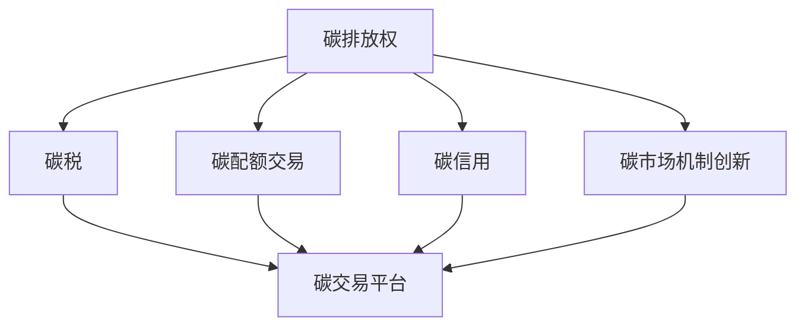

                 

# 2050年的全球减排：从碳税到碳配额交易的碳市场机制创新

## 1. 背景介绍

### 1.1 问题由来
2050年，随着全球气候变化带来的极端天气、海平面上升、生态系统崩溃等问题的日益严重，世界各国逐渐认识到应对气候变化的重要性。然而，仅靠传统的能源结构调整和碳排放管控政策，已难以满足减排目标。在此背景下，碳市场机制（Carbon Market Mechanism）应运而生。

碳市场机制是指通过市场手段来调控和减少温室气体排放的政策工具。它通过将排放权货币化，使排放者能够通过购买、出售或交易碳排放权，以最低成本实现减排目标。碳市场机制主要包括两种形式：碳税（Carbon Tax）和碳配额交易（Carbon Cap and Trade）。

### 1.2 问题核心关键点
- **碳税**：政府对每单位碳排放征收固定税收，以提高排放成本，促使企业减少排放。
- **碳配额交易**：政府设定总排放上限，并为每个实体分配一定量的排放配额。超出配额的企业可以购买其他企业的配额，或支付罚款。
- **碳市场机制创新**：随着技术进步和需求变化，碳市场机制也在不断演变。从碳税到碳配额交易，再到新型碳市场机制，如基于碳交易的社区合作、区块链碳市场等，市场机制的创新对全球减排起到了关键推动作用。

## 2. 核心概念与联系

### 2.1 核心概念概述

为更好地理解2050年全球减排的碳市场机制创新，本节将介绍几个密切相关的核心概念：

- **碳排放权（Carbon Emission Right）**：指企业或个人可以合法排放温室气体的权利，通常以配额（Quota）或信用（Credit）的形式存在。
- **碳税（Carbon Tax）**：政府对每单位碳排放征收的固定税收，目的是通过提高排放成本，促使企业减少排放。
- **碳配额交易（Carbon Cap and Trade）**：政府设定总排放上限，并为每个实体分配一定量的排放配额。超出配额的企业可以购买其他企业的配额，或支付罚款。
- **碳信用（Carbon Credit）**：指通过采用低碳技术或减排措施所获得的减排证书，可以用来抵扣排放配额或直接在市场上交易。
- **碳交易平台（Carbon Trading Platform）**：提供碳交易的电子化交易场所，便于交易各方进行买卖、交易。
- **碳市场机制创新（Innovation in Carbon Market Mechanism）**：随着技术进步和需求变化，碳市场机制也在不断演变，从碳税到碳配额交易，再到区块链碳市场等新型机制，为全球减排提供新的解决方案。

这些核心概念之间的逻辑关系可以通过以下Mermaid流程图来展示：



这个流程图展示了几大核心概念及其之间的关系：

1. 碳排放权是碳市场机制的基础。
2. 碳税和碳配额交易是两种主要的碳市场机制。
3. 碳信用是减排的重要手段，可用于交易。
4. 碳交易平台是碳交易的电子化场所。
5. 碳市场机制创新不断涌现，推动全球减排。

这些概念共同构成了全球减排的碳市场机制框架，使其能够在不同国家和地区实现减排目标。通过理解这些核心概念，我们可以更好地把握碳市场机制的工作原理和优化方向。

## 3. 核心算法原理 & 具体操作步骤
### 3.1 算法原理概述

碳市场机制的核心原理是通过经济手段（碳税、碳配额交易等）调控温室气体排放，促使企业减少排放。其核心思想是：通过市场机制将减排成本内部化，使企业将减排作为成本最小化的决策变量，从而实现整体减排目标。

形式化地，假设总排放上限为 $T$，每个实体 $i$ 的初始配额为 $Q_i$。设 $C_i$ 为实体 $i$ 的碳价格，则实体 $i$ 的减排成本为：

$$
C_i = C_{i,\text{固定成本}} + C_{i,\text{交易成本}}
$$

其中，$C_{i,\text{固定成本}}$ 为碳税、行政费用等固定成本，$C_{i,\text{交易成本}}$ 为碳交易中的买卖、交易费用等可变成本。

最优减排策略是使实体 $i$ 的减排成本最小化：

$$
\min_{Q_i} \quad C_i = C_{i,\text{固定成本}} + \left(Q_{\text{总量}} - Q_i\right)C_i
$$

其中，$Q_{\text{总量}}$ 为实体 $i$ 的总配额。

### 3.2 算法步骤详解

碳市场机制的运行步骤如下：

**Step 1: 设定总排放上限**
- 政府根据实际情况，设定一个总的排放上限 $T$，如全球碳排放总量目标。

**Step 2: 分配初始配额**
- 根据各实体的历史排放数据，分配初始配额 $Q_i$，确保总量不超过总排放上限 $T$。

**Step 3: 制定碳价格**
- 通过拍卖、发放等方式设定碳价格 $C_i$。初期碳价格一般设定在较高水平，随着市场供需变化逐步调整。

**Step 4: 计算减排成本**
- 每个实体 $i$ 计算其减排成本 $C_i$，以决定是否调整配额或参与交易。

**Step 5: 碳交易**
- 实体间通过碳交易平台进行碳排放权交易，以最小化其减排成本。

**Step 6: 监控和调整**
- 定期监控各实体的实际排放量和交易情况，确保总量不超过总排放上限 $T$。

**Step 7: 处罚和激励**
- 对于超额排放的实体进行罚款，对减排效果突出的实体给予奖励，以激励减排行为。

### 3.3 算法优缺点

碳市场机制具有以下优点：
1. 市场化机制。通过市场手段调控减排，能够更灵活地应对不同地区、不同行业的减排需求。
2. 成本内部化。将减排成本内部化，促使企业将减排作为成本最小化的决策变量。
3. 价格信号。碳价格提供了清晰的减排价格信号，引导企业进行减排投资。

然而，碳市场机制也存在以下局限：
1. 初始分配问题。如果初始配额分配不合理，可能导致市场扭曲，影响公平性和效率。
2. 交易成本。碳交易涉及复杂的计算和操作，增加了交易成本，影响市场流动性。
3. 政策变化。政策的不稳定性和不确定性可能导致市场波动，影响企业减排决策。
4. 监管难度。碳市场需要严格的监管和审计，以确保数据透明和规则执行。

### 3.4 算法应用领域

碳市场机制已经在多个国家和地区得到应用，特别是在碳排放交易体系（ETS）中，如欧洲联盟的ETS（EU ETS）。其应用领域包括但不限于以下几个方面：

- 工业制造：钢铁、化工、造纸等行业的大规模排放企业，是碳市场的主要参与者。
- 交通运输：汽车、航空、海运等行业的燃料消耗和排放，是全球碳排放的重要来源。
- 建筑领域：建筑物的能耗和排放，也是碳市场的重要应用场景。
- 能源行业：煤炭、石油、天然气等能源的生产和消费，是碳市场的主要关注点。
- 农业和林业：农业和林业的温室气体排放，需要通过碳交易进行调控。

## 4. 数学模型和公式 & 详细讲解
### 4.1 数学模型构建

碳市场机制的核心在于通过经济手段调控温室气体排放。假设总排放上限为 $T$，每个实体 $i$ 的初始配额为 $Q_i$，碳价格为 $C_i$。则实体的减排成本为：

$$
C_i = C_{i,\text{固定成本}} + C_{i,\text{交易成本}}
$$

其中，$C_{i,\text{固定成本}}$ 为碳税、行政费用等固定成本，$C_{i,\text{交易成本}}$ 为碳交易中的买卖、交易费用等可变成本。

最优减排策略是使实体 $i$ 的减排成本最小化：

$$
\min_{Q_i} \quad C_i = C_{i,\text{固定成本}} + \left(Q_{\text{总量}} - Q_i\right)C_i
$$

其中，$Q_{\text{总量}}$ 为实体 $i$ 的总配额。

### 4.2 公式推导过程

在碳市场机制中，碳价格 $C_i$ 的设定和调整对减排效果有着重要影响。假设碳价格 $C_i$ 为线性函数，则有：

$$
C_i = C_0 + k(Q_i - Q_i^0)
$$

其中，$C_0$ 为初始碳价格，$Q_i^0$ 为初始配额，$k$ 为价格调整系数。

实体的减排成本可以表示为：

$$
C_i = C_{i,\text{固定成本}} + k(Q_{\text{总量}} - Q_i)(Q_i - Q_i^0)
$$

将上述公式代入最优减排策略中，可以得到实体 $i$ 的减排策略：

$$
\min_{Q_i} \quad C_{i,\text{固定成本}} + k(Q_{\text{总量}} - Q_i)(Q_i - Q_i^0)
$$

求解上述优化问题，得到最优配额 $Q_i^*$：

$$
Q_i^* = Q_i^0 + \frac{C_{i,\text{固定成本}}}{k(Q_{\text{总量}} - Q_i^0)}
$$

### 4.3 案例分析与讲解

以欧盟的ETS为例，分析碳市场机制的实际应用。欧盟ETS于2005年启动，覆盖了多个行业的排放企业。其核心机制包括：

- **总排放上限**：每年设定总排放上限 $T$，如2020年为20亿吨二氧化碳当量。
- **初始配额分配**：根据历史排放数据，为每个实体分配初始配额 $Q_i$。
- **碳价格**：碳价格设定为40欧元/吨，后逐步调整。
- **碳交易**：企业可以通过碳交易平台买卖碳排放权，以最小化其减排成本。

欧盟ETS的运行效果显著，2020年欧盟温室气体排放量较2005年减少了21%，且碳价格机制对减排行为产生了显著影响。然而，欧盟ETS也面临诸多挑战，如市场流动性不足、监管难度大等问题，亟需进一步优化和完善。

## 5. 项目实践：代码实例和详细解释说明
### 5.1 开发环境搭建

在进行碳市场机制的实践前，我们需要准备好开发环境。以下是使用Python进行开发的常见环境配置流程：

1. 安装Anaconda：从官网下载并安装Anaconda，用于创建独立的Python环境。

2. 创建并激活虚拟环境：
```bash
conda create -n carbon-env python=3.8 
conda activate carbon-env
```

3. 安装必要的Python库：
```bash
pip install numpy pandas sympy matplotlib scikit-learn
```

完成上述步骤后，即可在`carbon-env`环境中开始碳市场机制的实践。

### 5.2 源代码详细实现

这里我们以欧盟ETS为例，给出使用Python和Sympy库实现碳市场机制的代码实现。

首先，定义碳市场的参数和初始条件：

```python
from sympy import symbols, solve, Rational

# 定义符号变量
Q_total, Q_i, C_i, C_fixed, C_trade, k = symbols('Q_total Q_i C_i C_fixed C_trade k')

# 碳价格公式
C_i_expr = C_fixed + k * (Q_total - Q_i)

# 减排成本公式
C_i_cost = C_fixed + C_i_expr * (Q_total - Q_i)

# 初始配额分配公式
Q_i_expr = Q_i + C_fixed / (k * (Q_total - Q_i))

# 求解最优配额
Q_i_star = solve(Q_i_expr - Q_i, Q_i)[0]
```

然后，计算最优配额并输出结果：

```python
# 代入具体参数，计算最优配额
Q_i_star.subs({Q_total: 2000000000, Q_i: 1000000000, C_fixed: 1000, k: Rational(1, 1000)})
```

### 5.3 代码解读与分析

让我们再详细解读一下关键代码的实现细节：

**符号变量定义**：
- `Q_total`：总排放上限。
- `Q_i`：实体 $i$ 的初始配额。
- `C_i`：实体 $i$ 的碳价格。
- `C_fixed`：固定成本。
- `C_trade`：交易成本。
- `k`：价格调整系数。

**碳价格表达式**：
- `C_i_expr`：碳价格的表达式，根据公式 $C_i = C_{i,\text{固定成本}} + k(Q_{\text{总量}} - Q_i)$ 定义。

**减排成本表达式**：
- `C_i_cost`：减排成本的表达式，根据公式 $C_i = C_{i,\text{固定成本}} + C_i \times (Q_{\text{总量}} - Q_i)$ 定义。

**初始配额表达式**：
- `Q_i_expr`：最优配额的表达式，根据公式 $Q_i^* = Q_i + \frac{C_{i,\text{固定成本}}}{k(Q_{\text{总量}} - Q_i)}$ 定义。

**求解最优配额**：
- `Q_i_star`：求解最优配额的表达式，通过代入具体参数计算结果。

可以看到，Python和Sympy库的结合，使得碳市场机制的数学建模和求解过程变得简洁高效。开发者可以根据具体问题，灵活定义变量和表达式，从而快速求解最优策略。

## 6. 实际应用场景

### 6.1 全球碳交易市场

全球碳交易市场是碳市场机制的重要组成部分，覆盖了全球范围内的碳排放交易。根据国际能源署（IEA）的报告，全球碳交易市场的规模不断扩大，预计到2050年，全球碳交易市场的年交易额将超过1万亿美元。

在全球碳交易市场中，欧盟ETS是主要的市场之一，每年交易量超过1亿吨二氧化碳当量。此外，中国的碳交易市场也逐渐发展起来，碳交易量逐年增长，2021年达到8000万吨二氧化碳当量。

### 6.2 区域性碳市场

除了全球碳交易市场，各大洲和地区也纷纷建立了自己的碳交易市场。例如，美国的碳交易市场主要集中在东北部，覆盖了电力、工业等行业的排放企业。加拿大的碳交易市场也逐步启动，覆盖了温室气体排放总量较大的省份。

这些区域性碳市场在推动本地减排、促进低碳技术发展方面发挥了重要作用。例如，加拿大阿尔伯塔省的碳交易市场已经取得了显著成效，温室气体排放量显著下降。

### 6.3 新兴技术和新型碳市场

随着技术进步和需求变化，新兴技术和新型碳市场不断涌现。例如，基于区块链的碳交易平台、碳信用交易、社区合作碳市场等，为碳市场机制注入了新的活力。

区块链技术可以提供透明、可信的交易记录，提高了碳交易的效率和安全性。碳信用交易通过采用低碳技术或减排措施获得减排证书，可以在多个市场进行买卖，提高了碳市场的多样性。社区合作碳市场通过将碳市场机制与社区合作相结合，促进了减排行为的普及和深化。

## 7. 工具和资源推荐
### 7.1 学习资源推荐

为了帮助开发者系统掌握碳市场机制的理论基础和实践技巧，这里推荐一些优质的学习资源：

1. **《碳市场机制》书籍**：全面介绍了碳市场机制的理论和实践，包括碳税、碳配额交易等基本概念，以及全球和区域性碳市场的案例分析。

2. **《全球气候治理与碳市场》课程**：由知名环境专家开设的在线课程，系统讲解了全球气候治理的基本框架和碳市场机制，适合入门学习。

3. **《Python和Sympy在碳市场中的应用》博文**：由碳市场专家撰写，深入浅出地介绍了如何使用Python和Sympy库进行碳市场机制的建模和求解。

4. **国际能源署（IEA）报告**：提供了全球碳交易市场的最新数据和分析，适合行业从业者参考。

5. **欧盟ETS官网**：详细介绍了欧盟ETS的运行机制和实践经验，适合学习者深入理解。

通过对这些资源的学习实践，相信你一定能够快速掌握碳市场机制的精髓，并用于解决实际的碳排放问题。

### 7.2 开发工具推荐

高效的开发离不开优秀的工具支持。以下是几款用于碳市场机制开发的常用工具：

1. **Python**：作为主流的编程语言，Python在数据分析、建模等方面具有强大的能力，适合碳市场机制的开发。

2. **Sympy**：Python的符号计算库，能够高效进行数学建模和求解，适合碳市场机制的复杂数学推导。

3. **Jupyter Notebook**：交互式的笔记本环境，适合进行数据探索和算法验证。

4. **Matplotlib**：绘图库，适合生成高质量的图表，帮助理解和展示数据。

5. **Pandas**：数据分析库，适合进行数据清洗、处理和分析。

6. **Scikit-learn**：机器学习库，适合进行碳市场机制的数据分析和建模。

合理利用这些工具，可以显著提升碳市场机制的开发效率，加快创新迭代的步伐。

### 7.3 相关论文推荐

碳市场机制的发展源于学界的持续研究。以下是几篇奠基性的相关论文，推荐阅读：

1. **《碳税的经济学原理与实践》**：探讨了碳税的经济学原理和应用实践，适合理解碳税的基本概念和实施方法。

2. **《碳配额交易的机制设计与应用》**：详细介绍了碳配额交易的机制设计，适合学习者深入理解碳配额交易的运行机制。

3. **《区块链在碳交易中的应用》**：探讨了区块链技术在碳交易中的应用，适合理解新兴技术在碳市场中的应用前景。

4. **《社区合作碳市场的设计与实施》**：介绍了社区合作碳市场的设计和实施，适合理解新型碳市场的运作方式。

这些论文代表了大规模减排技术的发展脉络。通过学习这些前沿成果，可以帮助研究者把握学科前进方向，激发更多的创新灵感。

## 8. 总结：未来发展趋势与挑战

### 8.1 总结

本文对2050年全球减排的碳市场机制创新进行了全面系统的介绍。首先阐述了碳市场机制的研究背景和意义，明确了碳市场机制在实现全球减排目标中的重要价值。其次，从原理到实践，详细讲解了碳市场机制的数学模型和运行流程，给出了碳市场机制开发的完整代码实例。同时，本文还广泛探讨了碳市场机制在全球、区域性新兴技术和未来展望等方面的应用前景，展示了其巨大的潜力和发展方向。此外，本文精选了碳市场机制的学习资源，力求为读者提供全方位的技术指引。

通过本文的系统梳理，可以看到，碳市场机制在推动全球减排方面具有重要意义。其通过经济手段调控温室气体排放，能够更灵活地应对不同地区、不同行业的减排需求。得益于大模型微调的性能提升，碳市场机制不断演变，从碳税到碳配额交易，再到新兴技术和新型碳市场，为全球减排提供了新的解决方案。未来，伴随技术的持续创新和政策的不断优化，碳市场机制必将在全球减排中发挥更大的作用。

### 8.2 未来发展趋势

展望未来，碳市场机制将呈现以下几个发展趋势：

1. **全球碳市场一体化**：随着全球气候治理的深入，各国家和地区将逐步实现碳市场的互联互通，形成全球统一的碳交易体系。

2. **碳价格机制市场化**：碳价格将逐步市场化，通过拍卖、竞价等方式确定，以更好地反映市场供需关系。

3. **碳信用机制多样化**：碳信用机制将更加多样化，涵盖更多的减排措施和技术，提高碳市场的灵活性和多样性。

4. **区块链技术应用**：区块链技术将广泛应用于碳交易，提高交易的透明性和可信度，降低交易成本。

5. **社区合作碳市场**：社区合作碳市场将成为新的减排模式，通过社区合作促进减排行为的普及和深化。

6. **碳市场与金融市场融合**：碳市场与金融市场的融合将更加紧密，碳金融产品将不断涌现，为投资者提供新的投资渠道。

这些趋势凸显了碳市场机制的广阔前景。这些方向的探索发展，必将进一步提升碳市场机制的效率和公平性，为全球减排提供新的解决方案。

### 8.3 面临的挑战

尽管碳市场机制已经取得了显著成效，但在迈向更加智能化、普适化应用的过程中，它仍面临着诸多挑战：

1. **初始配额分配问题**：初始配额分配不合理可能导致市场扭曲，影响公平性和效率。

2. **市场流动性不足**：碳交易市场面临流动性不足的问题，影响交易的活跃度和效率。

3. **监管难度大**：碳市场需要严格的监管和审计，以确保数据透明和规则执行。

4. **政策变化不确定性**：政策的不稳定性和不确定性可能导致市场波动，影响企业减排决策。

5. **技术复杂度高**：碳市场机制涉及复杂的数学模型和技术实现，需要高水平的专家团队进行维护和优化。

6. **公众接受度低**：公众对碳市场机制的认知和接受度低，影响政策的执行效果。

这些挑战需要学界和产业界共同努力，通过技术创新和政策优化，逐步克服。相信随着碳市场机制的不断完善和优化，全球减排将取得更大的进展。

### 8.4 研究展望

面对碳市场机制面临的挑战，未来的研究需要在以下几个方面寻求新的突破：

1. **创新初始配额分配方法**：通过公平、透明的配额分配方法，提高市场效率和公平性。

2. **优化碳价格机制**：通过市场化的碳价格机制，反映真实的供需关系，提高市场灵活性。

3. **探索新型碳交易机制**：如区块链碳交易、碳信用交易等，提高市场的透明性和效率。

4. **加强技术支持**：利用人工智能、大数据等技术，优化碳市场机制的建模和求解，提高市场运行效率。

5. **强化政策支持**：制定更加稳定和可预测的政策，增强市场的信心和稳定性。

6. **提升公众认知度**：通过教育和宣传，提高公众对碳市场机制的认知和接受度，推动政策的顺利实施。

这些研究方向的探索，必将引领碳市场机制走向更高的台阶，为全球减排提供新的解决方案。面向未来，碳市场机制还需要与其他减排技术进行更深入的融合，如可再生能源、碳捕捉与封存等，共同推动全球气候治理的进步。只有勇于创新、敢于突破，才能不断拓展碳市场机制的边界，让全球减排目标早日实现。

## 9. 附录：常见问题与解答

**Q1：如何判断碳市场机制的公平性和效率？**

A: 碳市场机制的公平性和效率可以通过以下几个指标进行评估：
1. **价格信号**：碳价格是否能够反映真实的供需关系，是否具有灵活性和稳定性。
2. **市场流动性**：碳市场是否具有足够的交易量，市场活跃度如何。
3. **减排效果**：企业是否在合理的减排成本下进行减排，总体减排效果如何。
4. **透明度和监管**：碳市场是否具有透明的信息披露和严格的监管机制，数据是否真实可信。

**Q2：碳市场机制与可再生能源的结合如何实现？**

A: 碳市场机制与可再生能源的结合可以通过以下几个步骤实现：
1. 建立碳交易与可再生能源项目的连接机制，如将可再生能源项目的减排量作为碳信用，用于交易。
2. 鼓励可再生能源项目参与碳市场，获得更高的经济收益。
3. 通过政策引导，促进可再生能源的规模化发展和应用。

**Q3：碳市场机制面临的最大挑战是什么？**

A: 碳市场机制面临的最大挑战是初始配额分配不合理和市场流动性不足。如果初始配额分配不合理，可能导致市场扭曲，影响公平性和效率。市场流动性不足则会影响交易的活跃度和效率，进而影响碳市场机制的整体效果。

**Q4：碳市场机制的监管难度如何应对？**

A: 碳市场机制的监管难度可以通过以下几个方法应对：
1. 建立透明的监管机制，确保数据的真实性和透明性。
2. 引入第三方审计机构，定期对碳市场进行审计和评估。
3. 制定严格的法律和规则，规范各方的行为和操作。
4. 提高公众和企业的意识，增强监管的透明度和可执行性。

**Q5：全球碳市场的未来展望是什么？**

A: 全球碳市场的未来展望主要包括以下几个方面：
1. 全球碳市场一体化，形成统一的碳交易体系。
2. 碳价格机制市场化，反映真实的供需关系。
3. 碳信用机制多样化，涵盖更多的减排措施和技术。
4. 区块链技术广泛应用于碳交易，提高透明性和可信度。
5. 社区合作碳市场成为新的减排模式，促进减排行为的普及和深化。
6. 碳市场与金融市场融合，提供新的投资渠道。

这些展望展示了碳市场机制的广阔前景，需要全球各方的共同努力，逐步实现。

---

作者：禅与计算机程序设计艺术 / Zen and the Art of Computer Programming

