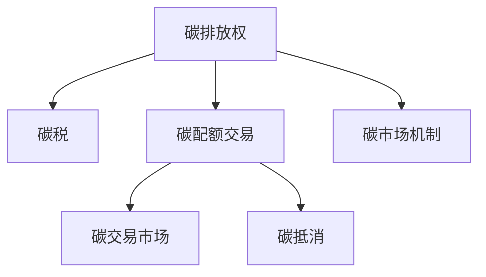

                 

# 2050年的全球减排：从碳税到碳配额交易的碳市场机制创新

## 1. 背景介绍

### 1.1 问题由来
全球气候变化已成为一个不可回避的严峻挑战。2021年，联合国政府间气候变化专门委员会（IPCC）报告指出，全球平均气温已比工业化前水平上升了约1.2摄氏度，极端天气事件频发，对人类生存环境造成了巨大的威胁。为应对这一挑战，各国政府、企业和公民社会纷纷提出减排目标，采取了一系列措施。然而，减排工作进展缓慢，成效有限。为加速减排进程，需要创新减排机制，引入市场化手段，推动低碳转型。

### 1.2 问题核心关键点
当前，全球减排机制主要包括碳税和碳配额交易两种模式。碳税是一种直接减排手段，通过征收碳排放税，抑制高碳排放行为，促进低碳转型。而碳配额交易则是一种市场化减排手段，通过发放碳配额，实现排放总量控制，激励企业减少碳排放。文章将重点探讨这两种减排机制的原理、应用和创新，以期为2050年的全球减排提供有价值的借鉴。

## 2. 核心概念与联系

### 2.1 核心概念概述

为更好地理解碳税和碳配额交易的机制，本节将介绍几个密切相关的核心概念：

- **碳排放权**：指一定时间内，单位主体（如企业、国家）可以排放的二氧化碳总量。其单位为二氧化碳当量（CO2e）。
- **碳税**：指政府对单位主体的碳排放行为征收的一种税收。碳税的税率根据排放量确定，旨在抑制高碳排放行为，促进低碳转型。
- **碳配额**：指政府根据国家或地区的减排目标，发放给单位主体的一定数量的碳排放权，单位为吨二氧化碳当量（ton CO2e）。
- **碳交易市场**：指买卖碳排放权的交易市场。参与者通过购买或卖出碳排放权，实现碳排放总量控制，促进低碳转型。
- **碳市场机制**：指政府为实现减排目标，采取的一系列市场化手段，包括碳税、碳配额交易、碳抵消等。

这些核心概念之间的逻辑关系可以通过以下Mermaid流程图来展示：



这个流程图展示了碳税和碳配额交易的机制联系：

1. 碳排放权是碳税和碳配额交易的基础，政府通过发放碳排放权，控制整体排放总量。
2. 碳税是通过税收手段直接抑制高碳排放行为。
3. 碳配额交易通过市场化手段，实现碳排放总量控制。
4. 碳抵消是指单位主体购买或获得一定数量的碳抵消额，抵消其自身的碳排放量。
5. 碳市场机制通过碳税、碳配额交易等手段，推动低碳转型。

## 3. 核心算法原理 & 具体操作步骤

### 3.1 算法原理概述

碳税和碳配额交易的原理，本质上是通过价格机制调节碳排放行为，促进低碳转型。

#### 碳税原理
碳税的核心理念是通过价格机制抑制高碳排放行为。政府根据单位主体的碳排放量征收碳税，单位主体的碳排放成本增加，从而抑制其高碳排放行为。碳税的计算公式为：

$$
T = \alpha \times M \times E
$$

其中，$T$为碳税总额，$\alpha$为碳税税率，$M$为单位主体在一定期间内的碳排放量，$E$为二氧化碳当量。

#### 碳配额交易原理
碳配额交易的核心理念是通过市场化手段控制整体碳排放量。政府根据减排目标，分配一定数量的碳排放权给单位主体，单位主体通过购买或出售碳排放权，实现减排目标。碳配额交易的计算公式为：

$$
C = \sum_{i=1}^N C_i
$$

其中，$C$为碳配额总额，$C_i$为第$i$个单位主体的碳配额。

### 3.2 算法步骤详解

#### 碳税操作步骤
1. **数据收集**：收集单位主体在一定期间内的碳排放数据。
2. **计算碳税**：根据单位主体的碳排放量和碳税税率，计算应缴纳的碳税总额。
3. **征收碳税**：单位主体缴纳碳税，减少碳排放行为。
4. **调整税率**：根据经济状况和减排效果，调整碳税税率。

#### 碳配额交易操作步骤
1. **发放碳配额**：根据减排目标，政府分配一定数量的碳配额给单位主体。
2. **建立碳交易市场**：建立碳交易市场，允许单位主体买卖碳排放权。
3. **碳交易操作**：单位主体在碳交易市场上买卖碳排放权，实现减排目标。
4. **调整配额数量**：根据减排效果，政府调整碳配额数量。

### 3.3 算法优缺点

#### 碳税优点
1. **简单直接**：碳税机制简单易懂，不需要建立复杂的市场体系。
2. **公平性**：碳税按排放量征收，体现了排放者支付原则。
3. **灵活性**：政府可以根据经济状况和减排效果，灵活调整碳税税率。

#### 碳税缺点
1. **对小企业不利**：小企业因排放量少，税负较重。
2. **收入再分配问题**：碳税收入如何分配，需要慎重考虑。
3. **存在逃税空间**：部分企业可能通过非法手段逃避碳税。

#### 碳配额交易优点
1. **市场化**：通过市场机制激励单位主体减少碳排放，促进低碳转型。
2. **灵活性**：碳配额交易市场灵活，单位主体可以根据自身需求买卖碳排放权。
3. **激励机制**：碳配额交易机制具有较强的激励作用，鼓励单位主体减少碳排放。

#### 碳配额交易缺点
1. **市场风险**：碳配额交易市场存在价格波动风险，可能导致价格失控。
2. **监管难度大**：碳配额交易需要建立严格的监管体系，避免市场操纵。
3. **实施成本高**：建立碳配额交易市场需要投入大量的人力、物力和财力。

### 3.4 算法应用领域

碳税和碳配额交易机制在多个领域已得到应用。

#### 碳税应用领域
1. **能源行业**：通过对化石能源征收碳税，抑制高碳排放行为，推动能源结构调整。
2. **制造业**：通过对工业排放征收碳税，促进工业减排，提高生产效率。
3. **交通运输**：通过对交通排放征收碳税，减少碳排放，推动绿色出行。

#### 碳配额交易应用领域
1. **电力行业**：通过对电力公司发放碳配额，实现电力行业的减排目标。
2. **工业生产**：通过对工业企业发放碳配额，控制工业排放总量，推动绿色生产。
3. **建筑行业**：通过对建筑企业发放碳配额，促进建筑领域的低碳转型。

## 4. 数学模型和公式 & 详细讲解 & 举例说明

### 4.1 数学模型构建

#### 碳税数学模型
碳税机制的核心在于计算单位主体的碳税总额。根据公式$$T = \alpha \times M \times E$$，单位主体的碳税总额为：

$$
T = \alpha \times M \times E
$$

其中，$\alpha$为碳税税率，$M$为单位主体的碳排放量，$E$为二氧化碳当量。

#### 碳配额交易数学模型
碳配额交易的核心在于计算单位主体的碳配额需求量和供应量。根据公式$$C = \sum_{i=1}^N C_i$$，碳配额总额为：

$$
C = \sum_{i=1}^N C_i
$$

其中，$C_i$为第$i$个单位主体的碳配额，$N$为单位主体数量。

### 4.2 公式推导过程

#### 碳税公式推导
碳税总额$T$可以推导为：

$$
T = \alpha \times M \times E
$$

其中，$\alpha$为碳税税率，$M$为单位主体的碳排放量，$E$为二氧化碳当量。

#### 碳配额交易公式推导
碳配额总额$C$可以推导为：

$$
C = \sum_{i=1}^N C_i
$$

其中，$C_i$为第$i$个单位主体的碳配额，$N$为单位主体数量。

### 4.3 案例分析与讲解

#### 碳税案例分析
以某地区的火力发电厂为例，假设其碳排放量为$M=100,000$吨二氧化碳当量，碳税税率为$\alpha=50$元/吨二氧化碳当量，则该发电厂需缴纳的碳税总额为：

$$
T = 50 \times 100,000 \times 1 = 5,000,000 \text{元}
$$

#### 碳配额交易案例分析
假设某工业园区内有10个工厂，政府分配的碳配额总量为$C=1,000,000$吨二氧化碳当量，其中第1个工厂碳排放量为$C_1=100,000$吨二氧化碳当量，第2个工厂碳排放量为$C_2=80,000$吨二氧化碳当量。则第1个工厂的碳配额需求量为$C_1-C=90,000$吨二氧化碳当量，第2个工厂的碳配额需求量为$C_2-C=20,000$吨二氧化碳当量。

## 5. 项目实践：代码实例和详细解释说明

### 5.1 开发环境搭建

在进行碳税和碳配额交易的代码实现前，我们需要准备好开发环境。以下是使用Python进行PyTorch开发的环境配置流程：

1. 安装Anaconda：从官网下载并安装Anaconda，用于创建独立的Python环境。

2. 创建并激活虚拟环境：
```bash
conda create -n pytorch-env python=3.8 
conda activate pytorch-env
```

3. 安装PyTorch：根据CUDA版本，从官网获取对应的安装命令。例如：
```bash
conda install pytorch torchvision torchaudio cudatoolkit=11.1 -c pytorch -c conda-forge
```

4. 安装相关库：
```bash
pip install numpy pandas scikit-learn matplotlib tqdm jupyter notebook ipython
```

完成上述步骤后，即可在`pytorch-env`环境中开始开发。

### 5.2 源代码详细实现

这里我们以碳税的计算为例，给出使用PyTorch进行碳税计算的代码实现。

首先，定义碳税计算函数：

```python
import torch

def calculate_tax(alpha, M, E):
    T = alpha * M * E
    return T
```

然后，使用Python代码实现碳税计算：

```python
alpha = 50  # 碳税税率
M = 100000  # 碳排放量
E = 1  # 二氧化碳当量

T = calculate_tax(alpha, M, E)
print(f"碳税总额为：{T} 元")
```

### 5.3 代码解读与分析

这里我们详细解读一下关键代码的实现细节：

**calculate_tax函数**：
- `__init__`方法：初始化碳税计算所需的参数。
- `calculate_tax`方法：根据公式计算碳税总额。

**计算过程**：
- 输入碳税税率、碳排放量和二氧化碳当量，计算出应缴纳的碳税总额。
- 输出计算结果，显示碳税总额。

**测试代码**：
- 定义碳税税率、碳排放量和二氧化碳当量。
- 调用`calculate_tax`函数，计算碳税总额。
- 输出计算结果。

可以看到，使用PyTorch进行碳税计算的代码实现非常简单，主要依赖于函数的设计和数学公式的计算。在实际应用中，可以进一步扩展函数的功能，实现更复杂的碳税计算逻辑。

## 6. 实际应用场景

### 6.1 碳税应用场景

碳税在多个领域已得到应用，以下是几个典型的应用场景：

#### 能源行业
碳税在能源行业得到了广泛应用。通过对化石能源征收碳税，抑制高碳排放行为，推动能源结构调整。以某地区的火力发电厂为例，征收碳税后，发电成本增加，推动企业转向可再生能源，减少碳排放。

#### 制造业
碳税在制造业同样得到了应用。通过对工业排放征收碳税，促进工业减排，提高生产效率。以某工业企业为例，征收碳税后，企业需支付高额碳税，推动企业采用清洁生产工艺，减少碳排放。

#### 交通运输
碳税在交通运输领域也有应用。通过对交通排放征收碳税，减少碳排放，推动绿色出行。以某城市为例，征收碳税后，汽车使用成本增加，推动市民选择公共交通工具出行，减少碳排放。

### 6.2 碳配额交易应用场景

碳配额交易在多个领域已得到应用，以下是几个典型的应用场景：

#### 电力行业
碳配额交易在电力行业得到了广泛应用。通过对电力公司发放碳配额，实现电力行业的减排目标。以某电力公司为例，发放碳配额后，公司需控制碳排放总量，减少碳排放，推动低碳转型。

#### 工业生产
碳配额交易在工业生产领域同样得到了应用。通过对工业企业发放碳配额，控制工业排放总量，推动绿色生产。以某工业企业为例，发放碳配额后，企业需控制碳排放总量，减少碳排放，提高生产效率。

#### 建筑行业
碳配额交易在建筑行业也有应用。通过对建筑企业发放碳配额，促进建筑领域的低碳转型。以某建筑企业为例，发放碳配额后，企业需控制碳排放总量，减少碳排放，提高建筑质量。

## 7. 工具和资源推荐

### 7.1 学习资源推荐

为帮助开发者系统掌握碳税和碳配额交易的理论基础和实践技巧，这里推荐一些优质的学习资源：

1. 《气候经济学》系列博文：由气候经济专家撰写，深入浅出地介绍了碳税和碳配额交易的原理和应用。

2. 《气候变化经济学》课程：由知名大学开设的气候变化经济学课程，有Lecture视频和配套作业，带你入门气候变化和减排的经济分析。

3. 《全球气候治理》书籍：系统介绍了全球气候治理的现状和未来发展趋势，涵盖碳税和碳配额交易等关键议题。

4. 联合国气候变化框架公约网站：提供全球气候治理的最新动态和政策文件，是了解全球气候变化治理的权威平台。

5. 气候变化研究网：提供最新的气候变化研究论文和政策分析，是研究气候变化和减排的重要资源。

通过对这些资源的学习实践，相信你一定能够快速掌握碳税和碳配额交易的精髓，并用于解决实际的减排问题。

### 7.2 开发工具推荐

高效的开发离不开优秀的工具支持。以下是几款用于碳税和碳配额交易开发的常用工具：

1. Python：Python是开发碳税和碳配额交易的核心语言，简单易用，拥有丰富的库和框架。

2. PyTorch：基于Python的开源深度学习框架，灵活的计算图，适合快速迭代研究。

3. Scikit-learn：Python机器学习库，提供丰富的统计和机器学习工具，可用于数据处理和模型训练。

4. Matplotlib：Python绘图库，可用于生成图表和可视化结果，方便数据分析和展示。

5. Jupyter Notebook：Python交互式笔记本，适合快速原型设计和代码测试。

合理利用这些工具，可以显著提升碳税和碳配额交易的开发效率，加快创新迭代的步伐。

### 7.3 相关论文推荐

碳税和碳配额交易的研究源于学界的持续研究。以下是几篇奠基性的相关论文，推荐阅读：

1. The Economics of Carbon Taxes（《碳税的经济分析》）：讨论了碳税的经济效应和政策设计，是碳税研究的重要文献。

2. The Economics of Carbon Markets（《碳市场的经济分析》）：讨论了碳配额交易的市场机制和经济效应，是碳配额交易研究的重要文献。

3. Carbon Taxes and Environmental Protection（《碳税与环境保护》）：讨论了碳税对环境和社会的影响，提供了政策设计和实施的建议。

4. Carbon Emissions Trading（《碳排放交易》）：讨论了碳配额交易的机制设计和市场运作，是碳配额交易研究的重要文献。

5. The Impacts of Carbon Pricing on Energy Markets（《碳价格对能源市场的影响》）：讨论了碳税和碳配额交易对能源市场的影响，提供了政策建议。

这些论文代表了大规模减排机制的研究发展脉络。通过学习这些前沿成果，可以帮助研究者把握学科前进方向，激发更多的创新灵感。

## 8. 总结：未来发展趋势与挑战

### 8.1 总结

本文对碳税和碳配额交易的原理和操作步骤进行了全面系统的介绍。首先阐述了碳税和碳配额交易的研究背景和意义，明确了减排机制在推动低碳转型中的重要作用。其次，从原理到实践，详细讲解了碳税和碳配额交易的数学原理和关键步骤，给出了减排任务开发的完整代码实例。同时，本文还广泛探讨了碳税和碳配额交易在多个领域的应用前景，展示了其广阔的实施空间。

通过本文的系统梳理，可以看到，碳税和碳配额交易在推动全球减排中发挥了重要作用，成为实现低碳转型的重要手段。未来，伴随全球气候变化形势的不断变化，碳税和碳配额交易机制还需进一步优化和创新，以更好地应对全球减排的挑战。

### 8.2 未来发展趋势

展望未来，碳税和碳配额交易机制将呈现以下几个发展趋势：

1. **全球化和区域化并行**：碳税和碳配额交易机制将在全球和区域两个层面并行推进，结合不同地区的实际情况，设计合理的减排政策。

2. **灵活性和可操作性提升**：碳税和碳配额交易机制将更加灵活，可以根据不同行业的特点和需求，设计差异化的减排方案，提高政策的可操作性。

3. **数字化和智能化**：碳税和碳配额交易机制将进一步数字化和智能化，通过大数据和人工智能技术，实现减排过程的精准管理和高效优化。

4. **透明度和问责机制加强**：碳税和碳配额交易机制将更加透明和可问责，建立完善的监管体系，确保减排政策的公平性和有效性。

5. **公众参与和政策协同**：碳税和碳配额交易机制将更加注重公众参与和政策协同，通过公众参与和多方协同，推动减排政策的顺利实施。

以上趋势凸显了碳税和碳配额交易机制的未来发展方向。这些方向的探索发展，必将进一步提升减排政策的精准度和有效性，为全球低碳转型提供有力保障。

### 8.3 面临的挑战

尽管碳税和碳配额交易机制已经取得了一定的进展，但在迈向更加智能化、普适化应用的过程中，仍面临诸多挑战：

1. **政策协调和国际合作**：全球碳税和碳配额交易机制的实施需要各国政策协调和国际合作，存在一定的协调难度。

2. **经济成本和市场风险**：碳税和碳配额交易机制的实施需投入大量经济成本，且存在市场风险，可能导致部分企业负担过重。

3. **技术复杂性和监管难度**：碳税和碳配额交易机制的技术复杂性较高，且监管难度大，需要建立完善的监管体系，避免市场操纵。

4. **公众接受度和政策设计**：碳税和碳配额交易机制的实施需获得公众接受，且政策设计需科学合理，以避免社会反弹。

5. **数据收集和处理**：碳税和碳配额交易机制的实施需大量收集和处理数据，存在数据质量和安全风险。

正视碳税和碳配额交易机制面临的这些挑战，积极应对并寻求突破，将是大规模减排机制走向成熟的必由之路。相信随着学界和产业界的共同努力，这些挑战终将一一被克服，碳税和碳配额交易机制必将在推动全球减排中发挥更大的作用。

### 8.4 研究展望

面对碳税和碳配额交易机制面临的种种挑战，未来的研究需要在以下几个方面寻求新的突破：

1. **全球减排机制创新**：探索新的减排机制，如碳信用、碳排放权利交易等，推动全球减排。

2. **区域合作与政策协调**：加强国际合作，建立区域合作机制，共同推进减排政策的实施。

3. **政策与技术的融合**：将减排政策与大数据、人工智能等技术融合，实现减排过程的智能化和精准化。

4. **公众参与和政策协同**：加强公众参与和政策协同，推动减排政策的顺利实施。

5. **监管体系和数据安全**：建立完善的监管体系，确保减排政策的可问责性和数据安全。

这些研究方向的探索，必将引领碳税和碳配额交易机制走向更高的台阶，为全球低碳转型提供新的思路和解决方案。面向未来，减排机制还需进一步优化和创新，以更好地应对全球气候变化的挑战。

## 9. 附录：常见问题与解答

**Q1：如何衡量碳税和碳配额交易的效果？**

A: 碳税和碳配额交易的效果可以通过以下指标进行衡量：

1. **碳排放量变化**：通过测量碳排放量变化情况，评估碳税和碳配额交易的减排效果。

2. **能源结构变化**：通过测量化石能源和可再生能源的使用比例，评估减排政策的能源结构调整效果。

3. **企业减排成本**：通过测量企业的减排成本变化情况，评估减排政策的经济效益。

4. **市场价格变化**：通过测量碳排放权的市场价格变化情况，评估碳交易市场的活跃程度。

5. **公众接受度**：通过调查公众对减排政策的接受程度，评估政策的社会影响。

这些指标综合反映了碳税和碳配额交易的效果，可以帮助政策制定者和执行者进行评估和调整。

**Q2：如何设计合理的碳税税率？**

A: 碳税税率的设计需要考虑以下几个因素：

1. **经济状况**：根据国家的经济状况，合理设计碳税税率。高收入国家可以设计较高的碳税税率，而低收入国家需要设计较低的碳税税率。

2. **行业特点**：根据不同行业的特点，设计差异化的碳税税率。高污染行业应设计较高的碳税税率，而低污染行业应设计较低的碳税税率。

3. **减排目标**：根据减排目标，设计合理的碳税税率。如果减排目标较高，应设计较高的碳税税率；如果减排目标较低，应设计较低的碳税税率。

4. **社会影响**：根据碳税税率对社会的影响，设计合理的碳税税率。如果碳税税率过高，可能导致企业负担过重，影响社会稳定。

5. **市场反应**：根据碳税税率对市场反应的监测，设计合理的碳税税率。如果碳税税率过低，可能无法达到减排效果；如果碳税税率过高，可能导致市场反应不足。

通过综合考虑以上因素，可以设计出合理的碳税税率，促进低碳转型。

**Q3：碳配额交易市场如何规避市场操纵风险？**

A: 碳配额交易市场规避市场操纵风险需要采取以下几个措施：

1. **建立完善的监管体系**：建立透明的监管体系，确保交易的公开、公平、公正，避免市场操纵。

2. **引入交易限制机制**：引入交易限制机制，如交易量限制、交易时间限制等，避免市场波动。

3. **设计合理的碳配额数量**：根据市场供需情况，设计合理的碳配额数量，避免市场供需失衡。

4. **引入价格调节机制**：引入价格调节机制，如价格上限、价格下限等，避免市场价格失控。

5. **加强市场监管**：加强市场监管，定期对市场行为进行监测和评估，及时发现和处理市场操纵行为。

通过采取以上措施，可以规避碳配额交易市场的市场操纵风险，确保市场的健康和稳定。

**Q4：碳配额交易市场如何确保交易的合法性？**

A: 碳配额交易市场确保交易合法性需要采取以下几个措施：

1. **建立严格的交易规则**：建立严格的交易规则，明确交易的程序和流程，确保交易的合法性。

2. **引入第三方监管机构**：引入第三方监管机构，对交易行为进行监督和审查，确保交易的合法性。

3. **建立交易平台**：建立交易平台，确保交易的透明和可追溯，避免交易的非法行为。

4. **引入交易验证机制**：引入交易验证机制，对交易的合法性进行验证和确认，确保交易的合法性。

5. **加强法律监管**：加强法律监管，对违法行为进行打击和惩罚，确保交易的合法性。

通过采取以上措施，可以确保碳配额交易市场的交易合法性，维护市场的健康和稳定。

**Q5：如何设计合理的碳配额交易规则？**

A: 碳配额交易规则的设计需要考虑以下几个因素：

1. **减排目标**：根据减排目标，设计合理的碳配额数量，确保交易能够实现减排目标。

2. **行业特点**：根据不同行业的特点，设计差异化的碳配额规则，确保交易的公平性和有效性。

3. **市场供需情况**：根据市场供需情况，设计合理的碳配额规则，避免市场供需失衡。

4. **交易方式**：根据交易方式，设计合理的碳配额规则，确保交易的便捷性和高效性。

5. **监管机制**：引入完善的监管机制，确保交易的合法性和透明性。

6. **政策协调**：加强政策协调，确保碳配额交易规则与其他政策的衔接和协调。

通过综合考虑以上因素，可以设计出合理的碳配额交易规则，推动碳配额交易市场的健康发展。

通过本文的系统梳理，可以看到，碳税和碳配额交易机制在推动全球减排中发挥了重要作用，成为实现低碳转型的重要手段。未来，伴随全球气候变化形势的不断变化，碳税和碳配额交易机制还需进一步优化和创新，以更好地应对全球减排的挑战。相信随着学界和产业界的共同努力，这些挑战终将一一被克服，碳税和碳配额交易机制必将在推动全球减排中发挥更大的作用。

