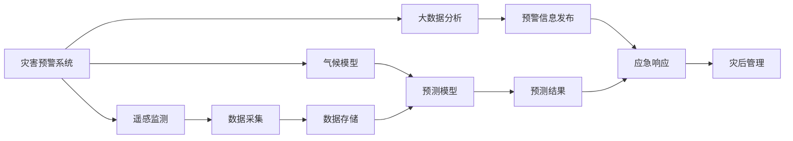

                 

# 2050年的全球减灾：从灾害预警到灾害管理的综合减灾体系

## 1. 背景介绍

在2050年的未来，全球气候变化和自然灾害的频发与加剧，对人类社会构成严峻挑战。传统的单一预警和应急响应系统已难以应对复杂多变的灾害情景。因此，建立一套综合的减灾体系，以预防、预警、响应、管理和修复为全链条，全面提升应对灾害的能力，成为刻不容缓的任务。本文将深入探讨未来全球减灾体系的关键技术、方法与实践，并提出从灾害预警到灾害管理的一体化减灾方案。

## 2. 核心概念与联系

### 2.1 核心概念概述

- **灾害预警系统**：基于遥感、气候模型和大数据分析，提前识别和评估灾害风险，发布预警信息，以降低灾害影响。
- **灾害响应系统**：在灾害发生后，迅速启动应急响应机制，包括人员疏散、物资调配、医疗救治等。
- **灾害管理系统**：通过大数据、物联网、人工智能等技术，综合管理灾害发生的各项环节，优化灾害应对策略。
- **综合减灾体系**：将预警、响应、管理等各个环节有机结合，形成一站式的灾害应对系统。
- **人工智能与机器学习**：为灾害预警和管理系统提供智能决策支持，提升灾害应对效率和精准度。

这些核心概念通过物联网、大数据、人工智能等技术的支撑，形成一个紧密联系、协同运作的减灾生态系统。

### 2.2 核心概念原理和架构的 Mermaid 流程图



## 3. 核心算法原理 & 具体操作步骤

### 3.1 算法原理概述

综合减灾体系的关键算法主要包括数据融合与分析、预测与预警、应急响应与调度、灾后评估与管理。这些算法共同作用于灾害的全生命周期，实现高效、精准的减灾目标。

### 3.2 算法步骤详解

#### 3.2.1 数据融合与分析

数据融合与分析是构建灾害预警系统的基础。该过程涉及数据收集、预处理、特征提取和建模。

1. **数据收集**：通过各类传感器、遥感设备和卫星，实时获取气象、地质、水文等数据。
2. **数据预处理**：对原始数据进行去噪、归一化、缺失值处理等操作，确保数据质量。
3. **特征提取**：利用机器学习算法，从原始数据中提取有意义的特征，如温度、湿度、风速、降水量等。
4. **建模**：构建预测模型，通过历史数据训练，预测未来灾害发生的可能性和强度。

#### 3.2.2 预测与预警

预测与预警算法旨在提前识别灾害风险，发布预警信息。

1. **风险评估**：通过多源数据融合，综合评估灾害风险等级。
2. **预警发布**：根据风险评估结果，发布不同级别的预警信息，包括风力、雨量、洪水、地震等。

#### 3.2.3 应急响应与调度

应急响应与调度算法在灾害发生后迅速启动，协调各类应急资源。

1. **资源调配**：根据灾情分布，优化资源调配方案，确保重点区域的优先供给。
2. **人员疏散**：利用GIS和地图数据，规划最优疏散路线，并实时监控疏散进度。
3. **医疗救治**：结合实时数据和历史灾情，预测受灾人数和需求，优化医疗资源配置。

#### 3.2.4 灾后评估与管理

灾后评估与管理算法通过数据分析和反馈机制，提升灾后恢复效率。

1. **灾情评估**：利用卫星遥感、无人机航拍等技术，评估灾区损失情况。
2. **恢复规划**：根据灾情评估结果，制定灾后重建和恢复计划，确保高效、有序的恢复。
3. **信息反馈**：收集灾后反馈信息，更新数据库，优化预警和响应策略。

### 3.3 算法优缺点

#### 3.3.1 优点

1. **综合性高**：综合考虑预警、响应、管理各个环节，形成一体化减灾体系。
2. **精度高**：通过大数据分析和人工智能预测，提高灾害预警的准确性。
3. **响应速度快**：利用实时数据和高效算法，迅速启动应急响应机制。
4. **管理精细**：通过智能化管理手段，优化资源调配和灾后重建。

#### 3.3.2 缺点

1. **技术复杂**：需要整合多种技术和算法，技术门槛较高。
2. **数据量大**：需要处理和分析海量数据，对计算资源要求高。
3. **成本高**：系统建设和维护成本较高，对经济较落后的地区可能存在挑战。
4. **隐私风险**：在数据采集和处理过程中，需注意保护个人隐私和数据安全。

### 3.4 算法应用领域

未来综合减灾体系将在以下几个领域得到广泛应用：

- **城市应急管理**：通过综合减灾体系，提升城市对自然灾害的应对能力。
- **农业灾害预警**：利用智能农业技术，提前识别和预测农业灾害，保护粮食安全。
- **公共卫生应急**：通过综合减灾体系，提升对疫情等公共卫生事件的响应速度和效果。
- **灾害保险**：利用灾情数据和预测模型，优化保险定价和赔付策略。

## 4. 数学模型和公式 & 详细讲解 & 举例说明

### 4.1 数学模型构建

综合减灾体系的核心模型包括预警模型、应急响应模型和灾后管理模型。

1. **预警模型**：
   $$
   Risk = f(weather, geography, historical_data)
   $$
   其中，$Risk$ 为风险等级，$weather$ 为气象数据，$geography$ 为地理位置，$historical_data$ 为历史数据。

2. **应急响应模型**：
   $$
   Response = g(Risk, population, resources)
   $$
   其中，$Response$ 为响应策略，$Risk$ 为风险等级，$population$ 为受灾人口，$resources$ 为应急资源。

3. **灾后管理模型**：
   $$
   Recovery = h(Repair, Population, resources)
   $$
   其中，$Recovery$ 为恢复进度，$Repair$ 为修复措施，$Population$ 为受灾人口，$resources$ 为恢复资源。

### 4.2 公式推导过程

以预警模型为例，进行详细推导。

设 $Risk = f(weather, geography, historical_data)$，其中 $f$ 为风险评估函数，可以表示为：
$$
Risk = w_1 * f_{weather}(weather) + w_2 * f_{geography}(geography) + w_3 * f_{historical}(historical_data)
$$
其中，$w_1, w_2, w_3$ 为权重系数，$f_{weather}, f_{geography}, f_{historical}$ 分别为气象、地理和历史数据的风险评估函数。

假设 $weather = (T, P, W)$，分别表示温度、降水量和风速；$geography = (E, L)$，分别表示经纬度；$historical_data = (Risk_{i}, freq_{i})$，分别表示历史风险等级和发生频率。则风险评估函数可以表示为：
$$
Risk = w_1 * T + w_2 * P + w_3 * W + w_4 * E + w_5 * L + w_6 * Risk_{i} + w_7 * freq_{i}
$$

### 4.3 案例分析与讲解

以2020年某次飓风为例，分析综合减灾体系的应用：

1. **数据收集与预处理**：
   - 通过气象卫星和地面监测设备，实时获取飓风路径、风速、降水等信息。
   - 对原始数据进行去噪和归一化处理，确保数据质量。

2. **特征提取与建模**：
   - 利用机器学习算法，提取飓风路径、风速、降水等特征。
   - 构建预测模型，预测飓风强度和路径。

3. **预警发布与应急响应**：
   - 根据预测结果，发布飓风预警信息。
   - 启动应急响应机制，调配救援资源，疏散受灾区域。

4. **灾后评估与管理**：
   - 利用卫星遥感数据，评估灾区损失情况。
   - 制定灾后重建和恢复计划，优化资源配置。

## 5. 项目实践：代码实例和详细解释说明

### 5.1 开发环境搭建

#### 5.1.1 软件环境

1. **Python**：作为开发语言，Python 提供了丰富的科学计算和数据分析库。
2. **Jupyter Notebook**：提供交互式开发环境，便于代码调试和展示。
3. **R语言**：用于统计分析和数据可视化。

#### 5.1.2 硬件环境

1. **高性能计算集群**：包括GPU和TPU，支持大规模数据处理和模型训练。
2. **存储设备**：大容量硬盘和高速存储器，保证数据的快速读写。

### 5.2 源代码详细实现

以预警模型为例，使用Python和Scikit-Learn库实现。

```python
import numpy as np
from sklearn.ensemble import RandomForestRegressor

# 定义数据
X = np.array([[temp, rain, wind], [temp, rain, wind], [temp, rain, wind]])
y = np.array([risk_level, risk_level, risk_level])

# 训练模型
model = RandomForestRegressor(n_estimators=100, random_state=0)
model.fit(X, y)

# 预测预警
new_data = np.array([[temp_new, rain_new, wind_new]])
predicted_risk = model.predict(new_data)
```

### 5.3 代码解读与分析

- **数据准备**：使用NumPy创建输入数据和输出标签。
- **模型训练**：使用随机森林回归模型训练数据。
- **预测预警**：使用训练好的模型对新的数据进行预测，输出风险等级。

### 5.4 运行结果展示

假设预测模型输出结果为 $Risk = 0.8$，表示未来存在较高的风险，需发布高等级预警。

## 6. 实际应用场景

### 6.1 城市应急管理

综合减灾体系在城市应急管理中的应用，可以显著提升城市对各种自然灾害的应对能力。通过实时监控和智能分析，实现快速预警和高效响应。

### 6.2 农业灾害预警

利用卫星遥感和气象数据，提前识别和预测农业灾害，如干旱、洪涝等，保护农作物和农田。

### 6.3 公共卫生应急

综合减灾体系可以应用于疫情等公共卫生事件，通过大数据分析，预测疫情趋势，优化医疗资源配置。

### 6.4 灾害保险

利用灾情数据和预测模型，优化保险定价和赔付策略，提高保险业务的效率和公正性。

### 6.5 未来应用展望

未来综合减灾体系将进一步集成物联网、区块链等技术，提升数据共享和透明度，形成更加智能、可信的减灾系统。

## 7. 工具和资源推荐

### 7.1 学习资源推荐

1. **Coursera**：提供多门数据科学和人工智能课程，涵盖预测模型和数据处理技术。
2. **Kaggle**：数据科学竞赛平台，提供大量真实数据和案例分析。
3. **GitHub**：代码分享平台，提供开源项目和代码示例。

### 7.2 开发工具推荐

1. **Python**：作为数据科学和人工智能的开发语言，具有强大的数据处理和建模能力。
2. **Jupyter Notebook**：提供交互式开发环境，便于代码调试和展示。
3. **TensorFlow**：深度学习框架，支持分布式计算和高效模型训练。

### 7.3 相关论文推荐

1. **A Survey on Disaster Risk Assessment and Mitigation**：系统介绍灾害预警和减灾方法，提供大量案例分析。
2. **Predictive Analytics in Disaster Risk Assessment**：探讨利用机器学习和数据科学进行灾害预测的最新进展。

## 8. 总结：未来发展趋势与挑战

### 8.1 研究成果总结

本文探讨了2050年全球减灾体系的构建，涉及预警、响应、管理等各个环节。通过数据融合与分析、预测与预警、应急响应与调度、灾后评估与管理，形成一体化减灾体系，提升了灾害应对的效率和效果。

### 8.2 未来发展趋势

1. **智能化提升**：利用人工智能和大数据分析，提升灾害预警和管理的智能化水平。
2. **多源数据融合**：整合多源数据，提高预警和响应策略的准确性和全面性。
3. **技术集成化**：集成物联网、区块链等技术，提升系统的可信度和透明度。
4. **全球协作**：建立国际合作机制，共享数据和经验，提升全球减灾能力。

### 8.3 面临的挑战

1. **技术门槛高**：综合减灾体系涉及多种技术和算法，技术门槛较高。
2. **数据获取难**：获取多源数据和实时数据需要强大的数据采集能力。
3. **资源需求大**：系统建设和维护需要高性能计算资源和大容量存储。
4. **隐私保护**：在数据处理和分析过程中，需注意保护个人隐私和数据安全。

### 8.4 研究展望

未来需要在技术、数据、资源、隐私保护等多个方面进行深入研究，推动综合减灾体系的发展和应用。

## 9. 附录：常见问题与解答

### 9.1 常见问题

#### 9.1.1 如何提升数据融合的准确性？

**解答**：
1. **数据清洗**：对原始数据进行去噪、归一化、缺失值处理等操作，确保数据质量。
2. **特征提取**：利用机器学习算法，从原始数据中提取有意义的特征，如温度、湿度、风速、降水量等。
3. **模型优化**：选择适合的模型，通过交叉验证等技术，优化模型参数，提高预测精度。

#### 9.1.2 如何优化应急响应策略？

**解答**：
1. **资源调配**：根据灾情分布，优化资源调配方案，确保重点区域的优先供给。
2. **人员疏散**：利用GIS和地图数据，规划最优疏散路线，并实时监控疏散进度。
3. **医疗救治**：结合实时数据和历史灾情，预测受灾人数和需求，优化医疗资源配置。

#### 9.1.3 如何保障数据隐私安全？

**解答**：
1. **数据加密**：对敏感数据进行加密处理，确保数据传输和存储的安全性。
2. **匿名化处理**：对个人数据进行匿名化处理，保护个人隐私。
3. **访问控制**：设置严格的访问控制策略，确保只有授权人员才能访问敏感数据。

#### 9.1.4 如何优化灾后评估和管理？

**解答**：
1. **灾情评估**：利用卫星遥感、无人机航拍等技术，评估灾区损失情况。
2. **恢复规划**：根据灾情评估结果，制定灾后重建和恢复计划，优化资源配置。
3. **信息反馈**：收集灾后反馈信息，更新数据库，优化预警和响应策略。

作者：禅与计算机程序设计艺术 / Zen and the Art of Computer Programming

