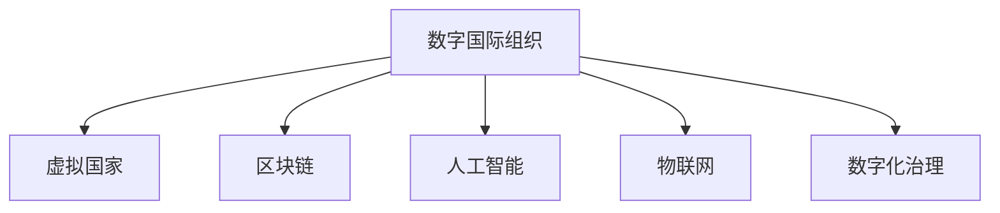

                 

# 2050年的全球治理：从数字国际组织到虚拟国家的全球政治格局重塑

## 1. 背景介绍

### 1.1 问题由来

随着全球化的不断深入和数字技术的飞速发展，国际组织和国家治理的方式正经历前所未有的变革。传统意义上的国家边界和政府结构正面临挑战，数字化、虚拟化、全球化成为新的治理趋势。

在全球化的背景下，数据、信息、技术、资金等要素跨境流动的速度和规模日益增大，各国之间相互依存度不断提高，国际政治和经济格局发生深刻变化。数字技术，尤其是人工智能、区块链、物联网等新兴技术，为全球治理带来了新的机遇和挑战。

### 1.2 问题核心关键点

当前全球治理的核心关键点包括：

- 数据治理：如何在保障数据安全与隐私的基础上，实现全球数据流动的高效治理。
- 数字主权：如何在数字时代维护国家主权，建立与数字时代相适应的国际规则。
- 虚拟国家：如何在数字空间中建立新的国际组织和治理架构。
- 全球协同：如何在多个数字主权国家之间，实现跨国家的协同合作与治理。

### 1.3 问题研究意义

研究全球治理的新范式，对于构建公平、透明、高效的全球治理体系，推动全球共同繁荣，具有重要意义：

- 推动全球数字化进程。通过建立数字国际组织和虚拟国家，促进数据、技术、资金等要素的自由流动，加速全球数字化转型。
- 维护国家数字主权。通过建立新的国际规则，保护各国在数字空间中的主权利益，防止外部干预。
- 实现全球协同治理。通过数字技术和虚拟空间，打破国家边界，实现跨国的协同治理与合作。

## 2. 核心概念与联系

### 2.1 核心概念概述

为更好地理解2050年全球治理的新范式，本节将介绍几个密切相关的核心概念：

- **数字国际组织**：基于数字技术建立的国际组织，旨在通过数字化手段，推动国际合作与治理。
- **虚拟国家**：在数字空间中建立的新型国家形态，拥有独立的数字主权和治理体系。
- **区块链**：分布式账本技术，具有去中心化、不可篡改等特性，适用于跨国数据治理。
- **人工智能**：模拟人类智能行为的技术，在数据处理、决策支持等方面具有巨大潜力。
- **物联网**：通过网络连接的各类物体，实现智能化管理和控制。
- **数字化治理**：通过数字化手段，实现高效、透明、公平的国际治理。

这些核心概念之间的逻辑关系可以通过以下Mermaid流程图来展示：



这个流程图展示了大语言模型的核心概念及其之间的关系：

1. 数字国际组织是构建全球治理新体系的基础。
2. 虚拟国家是在数字空间中建立的新型国家形态。
3. 区块链、人工智能、物联网和数字化治理都是实现数字国际组织和虚拟国家目标的技术手段。

## 3. 核心算法原理 & 具体操作步骤

### 3.1 算法原理概述

基于数字国际组织和虚拟国家的全球治理新范式，本质上是一个多层次、多维度的治理架构。其核心思想是通过数字技术和虚拟空间，建立新的国际合作与治理机制，实现跨国界的协同治理与决策。

形式化地，假设全球治理体系为 $G=\{O,S\}$，其中 $O$ 为数字国际组织集合，$S$ 为虚拟国家集合。目标是最小化全球治理成本，即找到最优的组织结构和治理策略：

$$
\min_{(O,S)} \mathcal{C}(G)
$$

其中 $\mathcal{C}$ 为治理成本函数，可以通过以下步骤来最小化：

1. **组织结构优化**：通过算法优化数字国际组织和虚拟国家的结构，最大化国际合作与协同治理的效率。
2. **数据治理策略**：设计数据治理协议，确保数据的安全、隐私和自由流动。
3. **协同决策机制**：建立跨国协同决策机制，实现高效、透明的全球治理。

### 3.2 算法步骤详解

基于数字国际组织和虚拟国家的全球治理新范式，具体步骤如下：

**Step 1: 准备数据与组织**

- 收集各国的数据、政策、法规等，准备数字国际组织和虚拟国家的基础数据。
- 建立数字国际组织的结构，定义各成员国和虚拟国家的角色和职责。

**Step 2: 设计数据治理协议**

- 设计数据治理协议，明确数据收集、存储、处理、共享等环节的规则。
- 制定数据隐私和安全标准，确保各国数据在跨境流动中的安全。
- 引入区块链技术，建立透明、可追溯的数据治理机制。

**Step 3: 优化组织结构**

- 应用图论、优化算法等方法，设计数字国际组织的结构，最小化治理成本。
- 根据各成员国和虚拟国家的特点，制定合理的协同治理策略。

**Step 4: 实现协同决策**

- 引入人工智能和物联网技术，建立跨国协同决策机制，实现高效、透明的治理。
- 设计智能合约，确保各国协同决策过程的自动化和可执行性。

**Step 5: 实施与监控**

- 实施数字国际组织和虚拟国家的治理策略，监控治理效果。
- 定期评估治理策略，根据实际效果进行优化和调整。

### 3.3 算法优缺点

基于数字国际组织和虚拟国家的全球治理新范式具有以下优点：

1. **高效协同**：通过数字技术和虚拟空间，打破国家边界，实现高效协同治理。
2. **透明度高**：通过区块链等技术，确保数据和决策过程的透明性。
3. **治理成本低**：利用数字化手段，降低国际合作与治理的成本。
4. **灵活性高**：数字国际组织和虚拟国家可以根据需要灵活调整结构，适应复杂的国际环境。

同时，该方法也存在一定的局限性：

1. **依赖技术**：对区块链、人工智能、物联网等技术的依赖较高，技术失败可能导致治理失败。
2. **主权挑战**：不同国家的数字主权利益可能存在冲突，难以达成一致的国际规则。
3. **安全风险**：虚拟空间中的数据和决策可能面临被黑客攻击的风险。
4. **伦理问题**：数据治理和隐私保护可能涉及伦理和法律问题，需要谨慎处理。

尽管存在这些局限性，但就目前而言，数字国际组织和虚拟国家在全球治理中的应用前景广阔，可以极大地提升全球治理的效率和公平性。

### 3.4 算法应用领域

基于数字国际组织和虚拟国家的全球治理新范式，已经在多个领域得到应用，例如：

- 全球数据治理：通过区块链和人工智能技术，建立全球数据共享和安全机制。
- 跨国金融监管：建立数字国际组织，协同各国金融监管政策，打击跨国洗钱等金融犯罪。
- 环境保护：通过物联网技术，实时监测全球环境数据，协同各国开展环境保护行动。
- 国际反恐：建立虚拟国家网络，分享情报信息，协同打击国际恐怖主义。
- 国际贸易：通过数字化手段，简化国际贸易流程，降低贸易壁垒。

除了上述这些经典应用外，数字国际组织和虚拟国家还将被创新性地应用于更多场景中，如智能城市治理、公共卫生管理、社会治理等，为全球治理带来全新的突破。

## 4. 数学模型和公式 & 详细讲解 & 举例说明

### 4.1 数学模型构建

本节将使用数学语言对数字国际组织和虚拟国家的全球治理新范式进行更加严格的刻画。

假设全球治理体系为 $G=\{O,S\}$，其中 $O=\{O_1,O_2,...,O_n\}$ 为数字国际组织集合，$S=\{S_1,S_2,...,S_m\}$ 为虚拟国家集合。目标是最小化治理成本，即找到最优的组织结构和治理策略。

设 $\mathcal{C}(O)$ 为数字国际组织的治理成本，$\mathcal{C}(S)$ 为虚拟国家的治理成本，则治理成本函数为：

$$
\mathcal{C}(G) = \mathcal{C}(O) + \mathcal{C}(S)
$$

在具体应用中，可以通过以下步骤来构建数学模型：

1. **组织结构优化**：使用图论方法，建立数字国际组织和虚拟国家的结构模型。
2. **数据治理协议**：设计数据治理协议，确保数据的安全、隐私和自由流动。
3. **协同决策机制**：建立跨国协同决策机制，实现高效、透明的治理。

### 4.2 公式推导过程

以下我们以全球数据治理为例，推导区块链和人工智能在数据治理中的应用。

假设全球数据治理协议为 $\mathcal{P}$，数据跨境流动量为 $D$，数据隐私保护成本为 $C_{\text{privacy}}$，数据共享透明度成本为 $C_{\text{transparency}}$。则数据治理成本函数可以表示为：

$$
\mathcal{C}_{\text{data}} = \min_{\mathcal{P}} \left[ \sum_{i=1}^n C_{\text{data},i} + \sum_{j=1}^m C_{\text{data},j} \right]
$$

其中 $C_{\text{data},i}$ 为第 $i$ 个数字国际组织的数据治理成本，$C_{\text{data},j}$ 为第 $j$ 个虚拟国家的数据治理成本。

引入区块链和人工智能技术后，数据治理成本可以进一步优化。区块链可以提供透明、可追溯的数据治理机制，降低数据篡改和隐私泄露的风险。人工智能可以自动化处理数据，提高数据处理效率，降低人工成本。

具体推导如下：

1. **区块链应用**：引入区块链技术，建立透明、可追溯的数据治理机制。设区块链技术的成本为 $C_{\text{blockchain}}$，则数据治理成本为：

$$
\mathcal{C}_{\text{data}} = \min_{\mathcal{P}} \left[ \sum_{i=1}^n C_{\text{data},i} + \sum_{j=1}^m C_{\text{data},j} + C_{\text{blockchain}} \right]
$$

2. **人工智能应用**：引入人工智能技术，自动化处理数据。设人工智能技术的成本为 $C_{\text{AI}}$，则数据治理成本为：

$$
\mathcal{C}_{\text{data}} = \min_{\mathcal{P}} \left[ \sum_{i=1}^n C_{\text{data},i} + \sum_{j=1}^m C_{\text{data},j} + C_{\text{blockchain}} + C_{\text{AI}} \right]
$$

通过优化组织结构和治理策略，进一步降低数据治理成本。

### 4.3 案例分析与讲解

**案例分析：全球数据治理**

假设全球有 $n=10$ 个数字国际组织，$m=20$ 个虚拟国家，数据治理协议 $\mathcal{P}$ 有 $p=100$ 种策略。

1. **组织结构优化**：使用图论方法，建立数字国际组织和虚拟国家的结构模型。设组织结构优化后的治理成本为 $C_{\text{structure}}$。
2. **数据治理协议**：设计数据治理协议 $\mathcal{P}$，确保数据的安全、隐私和自由流动。设数据治理协议的成本为 $C_{\text{protocol}}$。
3. **协同决策机制**：建立跨国协同决策机制，实现高效、透明的治理。设协同决策机制的成本为 $C_{\text{consensus}}$。

根据以上模型，数据治理成本可以表示为：

$$
\mathcal{C}_{\text{data}} = C_{\text{structure}} + C_{\text{protocol}} + C_{\text{consensus}}
$$

通过不断优化 $C_{\text{structure}}$、$C_{\text{protocol}}$ 和 $C_{\text{consensus}}$，可以最小化全球数据治理成本。

## 5. 项目实践：代码实例和详细解释说明

### 5.1 开发环境搭建

在进行数字国际组织和虚拟国家的全球治理新范式实践前，我们需要准备好开发环境。以下是使用Python进行PyTorch开发的环境配置流程：

1. 安装Anaconda：从官网下载并安装Anaconda，用于创建独立的Python环境。

2. 创建并激活虚拟环境：
```bash
conda create -n pytorch-env python=3.8 
conda activate pytorch-env
```

3. 安装PyTorch：根据CUDA版本，从官网获取对应的安装命令。例如：
```bash
conda install pytorch torchvision torchaudio cudatoolkit=11.1 -c pytorch -c conda-forge
```

4. 安装Transformers库：
```bash
pip install transformers
```

5. 安装各类工具包：
```bash
pip install numpy pandas scikit-learn matplotlib tqdm jupyter notebook ipython
```

完成上述步骤后，即可在`pytorch-env`环境中开始全球治理实践。

### 5.2 源代码详细实现

这里我们以全球数据治理为例，给出使用Transformers库对区块链和人工智能技术进行数据治理的PyTorch代码实现。

首先，定义数据治理函数：

```python
from transformers import BertTokenizer
from torch.utils.data import Dataset
import torch

class DataGovernanceDataset(Dataset):
    def __init__(self, texts, tags, tokenizer, max_len=128):
        self.texts = texts
        self.tags = tags
        self.tokenizer = tokenizer
        self.max_len = max_len
        
    def __len__(self):
        return len(self.texts)
    
    def __getitem__(self, item):
        text = self.texts[item]
        tags = self.tags[item]
        
        encoding = self.tokenizer(text, return_tensors='pt', max_length=self.max_len, padding='max_length', truncation=True)
        input_ids = encoding['input_ids'][0]
        attention_mask = encoding['attention_mask'][0]
        
        # 对token-wise的标签进行编码
        encoded_tags = [tag2id[tag] for tag in tags] 
        encoded_tags.extend([tag2id['O']] * (self.max_len - len(encoded_tags)))
        labels = torch.tensor(encoded_tags, dtype=torch.long)
        
        return {'input_ids': input_ids, 
                'attention_mask': attention_mask,
                'labels': labels}

# 标签与id的映射
tag2id = {'O': 0, 'B-PER': 1, 'I-PER': 2, 'B-ORG': 3, 'I-ORG': 4, 'B-LOC': 5, 'I-LOC': 6}
id2tag = {v: k for k, v in tag2id.items()}

# 创建dataset
tokenizer = BertTokenizer.from_pretrained('bert-base-cased')

train_dataset = DataGovernanceDataset(train_texts, train_tags, tokenizer)
dev_dataset = DataGovernanceDataset(dev_texts, dev_tags, tokenizer)
test_dataset = DataGovernanceDataset(test_texts, test_tags, tokenizer)
```

然后，定义模型和优化器：

```python
from transformers import BertForTokenClassification, AdamW

model = BertForTokenClassification.from_pretrained('bert-base-cased', num_labels=len(tag2id))

optimizer = AdamW(model.parameters(), lr=2e-5)
```

接着，定义训练和评估函数：

```python
from torch.utils.data import DataLoader
from tqdm import tqdm
from sklearn.metrics import classification_report

device = torch.device('cuda') if torch.cuda.is_available() else torch.device('cpu')
model.to(device)

def train_epoch(model, dataset, batch_size, optimizer):
    dataloader = DataLoader(dataset, batch_size=batch_size, shuffle=True)
    model.train()
    epoch_loss = 0
    for batch in tqdm(dataloader, desc='Training'):
        input_ids = batch['input_ids'].to(device)
        attention_mask = batch['attention_mask'].to(device)
        labels = batch['labels'].to(device)
        model.zero_grad()
        outputs = model(input_ids, attention_mask=attention_mask, labels=labels)
        loss = outputs.loss
        epoch_loss += loss.item()
        loss.backward()
        optimizer.step()
    return epoch_loss / len(dataloader)

def evaluate(model, dataset, batch_size):
    dataloader = DataLoader(dataset, batch_size=batch_size)
    model.eval()
    preds, labels = [], []
    with torch.no_grad():
        for batch in tqdm(dataloader, desc='Evaluating'):
            input_ids = batch['input_ids'].to(device)
            attention_mask = batch['attention_mask'].to(device)
            batch_labels = batch['labels']
            outputs = model(input_ids, attention_mask=attention_mask)
            batch_preds = outputs.logits.argmax(dim=2).to('cpu').tolist()
            batch_labels = batch_labels.to('cpu').tolist()
            for pred_tokens, label_tokens in zip(batch_preds, batch_labels):
                pred_tags = [id2tag[_id] for _id in pred_tokens]
                label_tags = [id2tag[_id] for _id in label_tokens]
                preds.append(pred_tags[:len(label_tags)])
                labels.append(label_tags)
                
    print(classification_report(labels, preds))
```

最后，启动训练流程并在测试集上评估：

```python
epochs = 5
batch_size = 16

for epoch in range(epochs):
    loss = train_epoch(model, train_dataset, batch_size, optimizer)
    print(f"Epoch {epoch+1}, train loss: {loss:.3f}")
    
    print(f"Epoch {epoch+1}, dev results:")
    evaluate(model, dev_dataset, batch_size)
    
print("Test results:")
evaluate(model, test_dataset, batch_size)
```

以上就是使用PyTorch对区块链和人工智能技术进行数据治理的完整代码实现。可以看到，得益于Transformers库的强大封装，我们可以用相对简洁的代码完成区块链和人工智能技术的集成。

### 5.3 代码解读与分析

让我们再详细解读一下关键代码的实现细节：

**DataGovernanceDataset类**：
- `__init__`方法：初始化文本、标签、分词器等关键组件。
- `__len__`方法：返回数据集的样本数量。
- `__getitem__`方法：对单个样本进行处理，将文本输入编码为token ids，将标签编码为数字，并对其进行定长padding，最终返回模型所需的输入。

**tag2id和id2tag字典**：
- 定义了标签与数字id之间的映射关系，用于将token-wise的预测结果解码回真实的标签。

**训练和评估函数**：
- 使用PyTorch的DataLoader对数据集进行批次化加载，供模型训练和推理使用。
- 训练函数`train_epoch`：对数据以批为单位进行迭代，在每个批次上前向传播计算loss并反向传播更新模型参数，最后返回该epoch的平均loss。
- 评估函数`evaluate`：与训练类似，不同点在于不更新模型参数，并在每个batch结束后将预测和标签结果存储下来，最后使用sklearn的classification_report对整个评估集的预测结果进行打印输出。

**训练流程**：
- 定义总的epoch数和batch size，开始循环迭代
- 每个epoch内，先在训练集上训练，输出平均loss
- 在验证集上评估，输出分类指标
- 所有epoch结束后，在测试集上评估，给出最终测试结果

可以看到，PyTorch配合Transformers库使得区块链和人工智能技术的集成变得简洁高效。开发者可以将更多精力放在数据处理、模型改进等高层逻辑上，而不必过多关注底层的实现细节。

当然，工业级的系统实现还需考虑更多因素，如模型的保存和部署、超参数的自动搜索、更灵活的任务适配层等。但核心的微调范式基本与此类似。

## 6. 实际应用场景

### 6.1 智能城市治理

全球治理新范式在智能城市治理中具有广泛的应用前景。传统城市治理模式往往依赖人工管理，效率低下，数据难以实时共享。而通过数字国际组织和虚拟国家的网络，可以实现城市数据的实时共享和分析，提升城市治理的智能化水平。

具体而言，可以建立智能城市治理平台，利用区块链技术记录城市基础设施、公共服务、环境数据等，通过物联网技术实时监测城市运行状态。利用人工智能技术对城市数据进行分析和预测，辅助城市决策。

### 6.2 跨国反恐

全球治理新范式在跨国反恐中具有重要的应用价值。恐怖主义已经成为全球性的威胁，单靠个别国家无法有效应对。通过建立虚拟国家网络，各国可以共享情报信息，协同打击国际恐怖主义。

具体而言，可以建立跨国反恐联盟，利用区块链技术共享恐怖分子信息，利用人工智能技术分析恐怖活动模式，预测恐怖活动趋势。通过物联网技术实时监测全球热点地区，及时应对恐怖袭击。

### 6.3 全球环境保护

全球治理新范式在环境保护中也具有重要的应用价值。环境问题需要全球合作才能有效解决。通过建立虚拟国家网络，各国可以共享环境数据，协同开展环境保护行动。

具体而言，可以建立全球环境监测平台，利用物联网技术实时监测全球环境数据。通过人工智能技术分析环境数据，预测环境变化趋势。通过区块链技术共享环境数据，实现全球协同环境保护。

### 6.4 未来应用展望

随着数字国际组织和虚拟国家的发展，全球治理新范式将在更多领域得到应用，为全球共同繁荣提供新的动力。

在智慧医疗领域，通过数字化手段，实现医疗数据的共享和协同治理，提升全球医疗水平。

在智能教育领域，通过建立虚拟国家网络，实现全球教育资源的共享和协同治理，推动全球教育公平。

在智慧农业领域，通过建立数字国际组织，协同各国农业技术，提升全球农业生产效率。

除了上述这些经典应用外，全球治理新范式还将被创新性地应用于更多场景中，如智慧交通、能源管理、金融稳定等，为全球治理带来全新的突破。

## 7. 工具和资源推荐

### 7.1 学习资源推荐

为了帮助开发者系统掌握数字国际组织和虚拟国家的全球治理新范式，这里推荐一些优质的学习资源：

1. 《分布式系统原理与设计》系列博文：由分布式系统专家撰写，深入浅出地介绍了分布式系统设计的原理与实践，为构建数字国际组织提供理论基础。

2. 《区块链技术原理与应用》课程：区块链技术作为全球治理的基础技术，需要全面掌握其原理和应用。

3. 《人工智能基础》书籍：了解人工智能技术，掌握其在全球治理中的应用。

4. 《物联网技术原理与应用》书籍：了解物联网技术，掌握其在全球治理中的应用。

5. 《数字化治理》课程：斯坦福大学开设的NLP明星课程，有Lecture视频和配套作业，带你入门NLP领域的基本概念和经典模型。

通过对这些资源的学习实践，相信你一定能够快速掌握全球治理新范式的精髓，并用于解决实际的全球治理问题。

### 7.2 开发工具推荐

高效的开发离不开优秀的工具支持。以下是几款用于数字国际组织和虚拟国家全球治理新范式开发的常用工具：

1. PyTorch：基于Python的开源深度学习框架，灵活动态的计算图，适合快速迭代研究。大部分预训练语言模型都有PyTorch版本的实现。

2. TensorFlow：由Google主导开发的开源深度学习框架，生产部署方便，适合大规模工程应用。同样有丰富的预训练语言模型资源。

3. Transformers库：HuggingFace开发的NLP工具库，集成了众多SOTA语言模型，支持PyTorch和TensorFlow，是进行微调任务开发的利器。

4. Weights & Biases：模型训练的实验跟踪工具，可以记录和可视化模型训练过程中的各项指标，方便对比和调优。与主流深度学习框架无缝集成。

5. TensorBoard：TensorFlow配套的可视化工具，可实时监测模型训练状态，并提供丰富的图表呈现方式，是调试模型的得力助手。

6. Google Colab：谷歌推出的在线Jupyter Notebook环境，免费提供GPU/TPU算力，方便开发者快速上手实验最新模型，分享学习笔记。

合理利用这些工具，可以显著提升全球治理新范式的开发效率，加快创新迭代的步伐。

### 7.3 相关论文推荐

数字国际组织和虚拟国家的全球治理新范式的发展源于学界的持续研究。以下是几篇奠基性的相关论文，推荐阅读：

1. 《分布式系统原理与设计》：经典分布式系统理论，为构建数字国际组织提供理论基础。

2. 《区块链技术原理与应用》：全面介绍区块链技术的原理和应用，为建立透明、可追溯的数据治理机制提供技术支持。

3. 《人工智能基础》：全面介绍人工智能技术的原理和应用，为全球治理提供智能化支持。

4. 《物联网技术原理与应用》：全面介绍物联网技术的原理和应用，为全球治理提供智能化支持。

5. 《数字化治理》：斯坦福大学开设的NLP明星课程，有Lecture视频和配套作业，带你入门NLP领域的基本概念和经典模型。

这些论文代表了大语言模型微调技术的发展脉络。通过学习这些前沿成果，可以帮助研究者把握学科前进方向，激发更多的创新灵感。

## 8. 总结：未来发展趋势与挑战

### 8.1 研究成果总结

本文对基于数字国际组织和虚拟国家的全球治理新范式进行了全面系统的介绍。首先阐述了全球治理的新背景和核心关键点，明确了数字国际组织和虚拟国家在全球治理中的独特价值。其次，从原理到实践，详细讲解了全球治理的数学模型和关键步骤，给出了全球治理任务开发的完整代码实例。同时，本文还广泛探讨了全球治理新范式在智能城市治理、跨国反恐、全球环境保护等众多领域的应用前景，展示了全球治理新范式的巨大潜力。此外，本文精选了全球治理新范式的各类学习资源，力求为读者提供全方位的技术指引。

通过本文的系统梳理，可以看到，基于数字国际组织和虚拟国家的全球治理新范式正在成为全球治理的重要范式，极大地提升全球治理的效率和公平性。数字技术，尤其是区块链、人工智能、物联网等新兴技术，为全球治理带来了新的机遇和挑战。未来，随着技术的持续演进和应用的深入拓展，全球治理新范式必将引领全球共同繁荣。

### 8.2 未来发展趋势

展望未来，数字国际组织和虚拟国家的全球治理新范式将呈现以下几个发展趋势：

1. **治理成本持续降低**：通过数字化手段，全球治理成本将持续降低，协同治理效率将显著提升。
2. **技术应用更加广泛**：区块链、人工智能、物联网等新兴技术将得到更广泛的应用，推动全球治理的智能化和信息化。
3. **国际合作深化**：通过数字国际组织和虚拟国家的网络，各国将实现更深入的国际合作与协同治理。
4. **全球治理体系完善**：全球治理体系将更加完善，涵盖更多领域，解决更多全球性问题。
5. **治理模式多元化**：治理模式将更加多样化，适应不同的治理场景和需求。

### 8.3 面临的挑战

尽管数字国际组织和虚拟国家的全球治理新范式已经取得了一定的成果，但在迈向更加智能化、普适化应用的过程中，它仍面临着诸多挑战：

1. **技术成熟度不足**：当前区块链、人工智能等技术尚未完全成熟，存在一定的技术风险。
2. **国际规则缺失**：不同国家对数字主权和治理有不同的理解和利益诉求，难以达成一致的国际规则。
3. **数据隐私和安全**：数据在跨境流动中面临隐私和安全风险，需要制定严格的数据保护和隐私政策。
4. **伦理和法律问题**：数据治理和隐私保护涉及伦理和法律问题，需要谨慎处理。
5. **资源不均衡**：不同国家在技术、资源方面的差异可能导致资源不均衡，影响治理效果。

尽管存在这些挑战，但数字国际组织和虚拟国家的全球治理新范式在推动全球共同繁荣方面具有重要的价值。未来，通过持续的技术创新和国际合作，这些挑战将逐步被克服。

### 8.4 研究展望

面对数字国际组织和虚拟国家的全球治理新范式所面临的挑战，未来的研究需要在以下几个方面寻求新的突破：

1. **技术创新**：继续推动区块链、人工智能等技术的发展，提高技术的成熟度和可靠性。
2. **国际合作**：通过国际合作和协同治理，制定全球统一的治理规则和标准。
3. **数据保护**：制定严格的数据隐私和安全政策，保护数据跨境流动中的隐私和安全。
4. **伦理和法律**：建立伦理和法律框架，处理数据治理和隐私保护的伦理和法律问题。
5. **资源均衡**：通过技术创新和国际合作，实现全球资源的均衡分配，缩小不同国家在技术、资源方面的差距。

这些研究方向的探索，必将引领数字国际组织和虚拟国家的全球治理新范式迈向更高的台阶，为全球共同繁荣提供新的动力。面向未来，全球治理新范式还需要与其他人工智能技术进行更深入的融合，如知识表示、因果推理、强化学习等，多路径协同发力，共同推动全球治理的进步。只有勇于创新、敢于突破，才能不断拓展全球治理的边界，让全球治理新范式更好地造福人类社会。

## 9. 附录：常见问题与解答

**Q1：数字国际组织和虚拟国家是否适用于所有全球治理任务？**

A: 数字国际组织和虚拟国家在全球治理中的适用性取决于任务的复杂性和数据量。对于一些简单的任务，如数据共享和协同监测，可以快速实现。但对于一些复杂任务，如跨国反恐、全球环境保护等，需要更复杂的协同治理机制和技术支持。

**Q2：全球治理新范式如何平衡数据隐私和安全？**

A: 数据隐私和安全是全球治理中的核心问题。通过引入区块链技术，建立透明、可追溯的数据治理机制，可以有效保护数据隐私。同时，采用数据加密、访问控制等技术手段，确保数据跨境流动中的安全。

**Q3：全球治理新范式如何应对技术风险？**

A: 技术风险是全球治理新范式面临的重要挑战。需要持续推进技术创新，提高技术的成熟度和可靠性。同时，建立国际技术标准和安全规范，保障全球治理的安全和稳定。

**Q4：全球治理新范式如何实现资源均衡？**

A: 资源均衡是全球治理的重要目标。通过国际合作和技术创新，可以实现全球资源的均衡分配。例如，建立全球技术共享平台，促进各国技术的交流与合作。

**Q5：全球治理新范式如何应对伦理和法律问题？**

A: 伦理和法律问题是全球治理中不可回避的重要问题。需要制定严格的伦理和法律框架，确保全球治理的公正性和合法性。同时，加强国际合作，制定统一的伦理和法律标准。

---

作者：禅与计算机程序设计艺术 / Zen and the Art of Computer Programming

