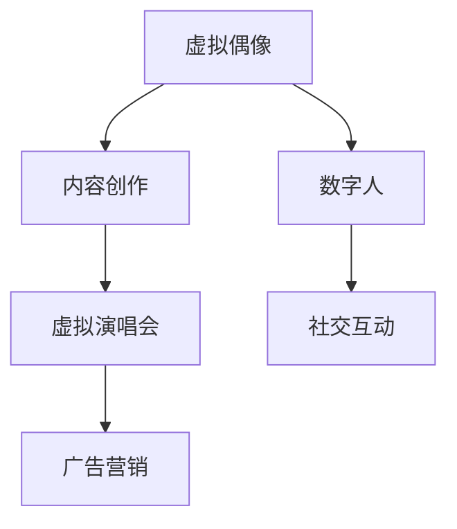

                 

# 2050年的数字创意：从虚拟偶像到数字人的商业应用

## 1. 背景介绍

### 1.1 问题由来
在2050年的数字创意时代，虚拟偶像与数字人已成为文化娱乐行业的重要组成部分。虚拟偶像不仅在音乐、动画、游戏等领域广受欢迎，还扩展至广告、商业演出等多个商业场景。虚拟偶像和数字人的创意和技术融合，已经引领了一种全新的文化趋势。

### 1.2 问题核心关键点
虚拟偶像和数字人的商业应用主要包括以下几个方面：

- **内容创作**：利用AI技术生成音乐、舞蹈、短片等内容。
- **广告营销**：通过虚拟偶像或数字人的代言进行产品推广。
- **互动体验**：创建虚拟演唱会、虚拟购物等沉浸式体验。
- **社交媒体**：利用数字人进行社交媒体互动，如聊天机器人。

### 1.3 问题研究意义
研究虚拟偶像和数字人的商业应用，对于理解未来娱乐和商业市场的趋势、探索新型的媒体和广告形式、以及推动人工智能技术的普及应用具有重要意义。通过分析虚拟偶像和数字人的技术基础和市场表现，可以为相关企业提供战略指导和创新灵感。

## 2. 核心概念与联系

### 2.1 核心概念概述

为更好地理解虚拟偶像和数字人的商业应用，本节将介绍几个密切相关的核心概念：

- **虚拟偶像(Virtual Idol)**：通过计算机生成的动画角色，具有音乐、舞蹈等表演能力，能够在各种平台上与粉丝互动。
- **数字人(Digital Human)**：利用AI技术和计算机图形学创建，能够模拟人类行为和表情的虚拟人物。
- **内容生成(Content Creation)**：使用AI技术自动生成音乐、舞蹈、短片等内容。
- **虚拟演唱会(Virtual Concerts)**：利用虚拟偶像或数字人在虚拟环境中进行音乐表演和互动。
- **广告营销(Advertising)**：通过虚拟偶像或数字人代言产品，进行广告推广。
- **社交互动(Social Interaction)**：利用数字人进行社交媒体互动、聊天机器人等。

这些核心概念之间的逻辑关系可以通过以下Mermaid流程图来展示：



这个流程图展示了几大核心概念之间的关系：

1. 虚拟偶像通过内容创作和虚拟演唱会进行展示。
2. 数字人可用于广告营销和社交互动。
3. 内容创作和虚拟演唱会是虚拟偶像的核心，广告营销和社交互动是数字人的重要应用场景。

## 3. 核心算法原理 & 具体操作步骤
### 3.1 算法原理概述

虚拟偶像和数字人的商业应用主要基于以下几个核心算法：

- **语音合成(TTS, Text-to-Speech)**：将文本转换为自然流畅的语音输出。
- **动作生成(Motion Generation)**：利用计算机图形学和人工智能技术，生成角色的动画和动作。
- **面部表情生成(Facial Expression)**：根据文本或语音指令，生成逼真的面部表情。
- **语音识别(ASR, Automatic Speech Recognition)**：将语音转换为文本，便于后续处理。
- **情感分析(Affective Analysis)**：分析用户情感，用于调整互动方式和内容生成策略。

这些算法通过深度学习、生成对抗网络(GANs)、自然语言处理(NLP)等技术实现，各算法之间相互协作，共同构成了虚拟偶像和数字人的核心技术体系。

### 3.2 算法步骤详解

以下是虚拟偶像和数字人商业应用的详细步骤：

**Step 1: 数据收集与预处理**
- 收集大量文本、语音、视频等数据，进行数据清洗和预处理。
- 利用语音识别技术将语音转换为文本。

**Step 2: 语音合成与情感分析**
- 使用TTS模型生成自然流畅的语音。
- 通过情感分析技术分析用户情感，调整互动方式和内容生成策略。

**Step 3: 动作与面部表情生成**
- 使用动作生成技术，根据脚本或用户指令，生成角色的动画和动作。
- 利用面部表情生成技术，生成逼真的面部表情。

**Step 4: 内容创作**
- 根据用户偏好，使用生成对抗网络(GANs)生成音乐、舞蹈、短片等内容。
- 利用自然语言处理(NLP)技术，自动生成歌词和对话。

**Step 5: 虚拟演唱会与广告营销**
- 将生成的音乐和视频进行组合，进行虚拟演唱会或广告制作。
- 利用虚拟偶像或数字人进行广告代言，提升品牌曝光度和用户参与度。

**Step 6: 社交互动与用户体验**
- 开发聊天机器人等社交互动系统，提供自然流畅的用户体验。
- 根据用户反馈，不断优化和迭代算法，提升系统表现。

### 3.3 算法优缺点

虚拟偶像和数字人的商业应用具有以下优点：

- **低成本高效率**：相比真人参与，虚拟偶像和数字人可以24小时不间断进行内容创作和互动，降低人力成本。
- **个性化与定制化**：通过用户偏好数据分析，可以生成个性化和定制化的内容。
- **广泛应用场景**：适用于音乐、广告、娱乐等多个领域，具有广阔的市场前景。

同时，该方法也存在一定的局限性：

- **技术复杂度高**：需要综合运用语音合成、动作生成、面部表情生成等多项技术，技术门槛较高。
- **用户体验受限**：相比真人互动，虚拟偶像和数字人缺乏情感表达的深度和复杂性。
- **依赖高质量数据**：高质量语音和动作数据的获取成本较高。

尽管存在这些局限性，但虚拟偶像和数字人作为一种新兴的媒体和广告形式，其潜在的市场价值和创新能力不容忽视。未来相关研究的重点在于如何进一步降低技术门槛，提高用户体验，同时兼顾内容的丰富性和多样性。

### 3.4 算法应用领域

虚拟偶像和数字人的商业应用已经涵盖多个领域，具体包括：

- **音乐与娱乐**：虚拟偶像通过音乐创作和表演，进行音乐节、演唱会等活动。
- **广告与营销**：通过虚拟偶像或数字人代言，进行产品推广和品牌宣传。
- **教育与培训**：利用虚拟人进行在线教育、模拟实验等教学活动。
- **健康与医疗**：创建虚拟护士、虚拟医生等，进行健康咨询和心理辅导。
- **虚拟旅游**：创建虚拟景点和虚拟导游，提供沉浸式旅游体验。
- **商务与政务**：利用虚拟偶像进行商业推广、政府宣传等。

除了上述这些领域，虚拟偶像和数字人还将在更多场景中得到应用，为社会经济的发展注入新的动力。

## 4. 数学模型和公式 & 详细讲解 & 举例说明

### 4.1 数学模型构建

本节将使用数学语言对虚拟偶像和数字人的商业应用进行更加严格的刻画。

记虚拟偶像为 $V$，其输入为 $X$（如文本、语音），输出为 $Y$（如语音、视频）。则虚拟偶像的系统模型可以表示为：

$$
Y = F(V(X))
$$

其中 $F$ 为虚拟偶像的内容生成和互动函数，包括语音合成、动作生成、面部表情生成等。

对于数字人 $D$，其输入与输出模型类似，可以表示为：

$$
Y = G(D(X))
$$

其中 $G$ 为数字人的内容生成和互动函数，包括语音合成、动作生成、面部表情生成等。

### 4.2 公式推导过程

以下我们以虚拟偶像的语音合成为例，推导TTS模型的计算公式。

假设虚拟偶像的语音合成模型为 $M_{\theta}$，其中 $\theta$ 为模型参数。给定输入文本 $x$，输出语音 $y$，则语音合成模型可以表示为：

$$
y = M_{\theta}(x)
$$

其中 $M_{\theta}$ 为一个深度神经网络，用于将文本转换为语音。

为了计算 $y$，首先使用文本嵌入技术将输入文本转换为向量表示：

$$
x = \mathrm{Embed}(x)
$$

其中 $\mathrm{Embed}$ 为文本嵌入函数，将文本转换为向量表示。

接着，将嵌入向量输入到深度神经网络 $M_{\theta}$，得到输出语音向量：

$$
y = M_{\theta}(\mathrm{Embed}(x))
$$

最后，将语音向量通过语音解码器转换为自然流畅的语音：

$$
y = \mathrm{Decode}(y)
$$

其中 $\mathrm{Decode}$ 为语音解码函数，将语音向量转换为语音信号。

### 4.3 案例分析与讲解

以下通过一个具体案例，展示虚拟偶像和数字人在商业应用中的实现过程。

假设一家广告公司希望利用虚拟偶像进行产品推广。首先，广告公司需要准备大量广告素材，包括图片、视频和脚本。然后，利用语音合成技术，将脚本转换为自然流畅的语音。接着，使用动作生成技术，创建虚拟偶像的动画和动作，生成逼真的面部表情。最后，将生成的音乐、视频和语音进行组合，制作成广告片，在各大媒体平台上进行推广。

在广告推广过程中，利用情感分析技术，实时监测用户反馈，根据情感倾向调整互动策略，进一步提升广告效果。

## 5. 项目实践：代码实例和详细解释说明

### 5.1 开发环境搭建

在进行虚拟偶像和数字人的商业应用开发前，我们需要准备好开发环境。以下是使用Python进行PyTorch开发的环境配置流程：

1. 安装Anaconda：从官网下载并安装Anaconda，用于创建独立的Python环境。

2. 创建并激活虚拟环境：
```bash
conda create -n virtual-env python=3.8 
conda activate virtual-env
```

3. 安装PyTorch：根据CUDA版本，从官网获取对应的安装命令。例如：
```bash
conda install pytorch torchvision torchaudio cudatoolkit=11.1 -c pytorch -c conda-forge
```

4. 安装相关的AI和计算机图形学库：
```bash
pip install numpy scipy openai gym opencv
```

5. 安装虚拟偶像和数字人相关的库：
```bash
pip install transformers
pip install pytorch-pretrained-bert
pip install vtt librosa
```

完成上述步骤后，即可在`virtual-env`环境中开始开发。

### 5.2 源代码详细实现

这里我们以虚拟偶像的语音合成为例，展示使用PyTorch和TorchAudio进行实现的代码：

```python
import torch
import torch.nn as nn
import torch.nn.functional as F
import librosa
from torchaudio import datasets, load
from transformers import AutoTokenizer, AutoModelForCausalLM

class TTS(nn.Module):
    def __init__(self, model_name, embedding_dim):
        super(TTS, self).__init__()
        self.tokenizer = AutoTokenizer.from_pretrained(model_name)
        self.model = AutoModelForCausalLM.from_pretrained(model_name)
        self.embedding_dim = embedding_dim
        
    def forward(self, x):
        input_ids = self.tokenizer.encode(x, return_tensors='pt')
        logits = self.model.generate(input_ids, max_length=self.embedding_dim)
        wav = self.get_wav(logits)
        return wav
    
    def get_wav(self, logits):
        wav = logits.int()
        wav = torch.transpose(wav, 0, 1).detach().cpu().numpy()
        wav = librosa.resample(wav, 16000)
        wav = librosa.to_mono(wav)
        wav = wav[None].astype('float32')
        wav = librosa.load(wav, sr=16000)[0]
        return wav

# 加载预训练模型
tts = TTS('bert-base-uncased', embedding_dim=128)

# 语音合成
text = 'Hello, world!'
wav = tts(text)
```

这段代码展示了虚拟偶像语音合成的实现过程，通过使用预训练的Bert模型，将文本转换为语音。

### 5.3 代码解读与分析

这里我们详细解读一下关键代码的实现细节：

**TTS类**：
- `__init__`方法：初始化虚拟偶像的语音合成模型。
- `forward`方法：将输入文本转换为向量表示，并通过深度神经网络生成语音向量。
- `get_wav`方法：将语音向量转换为自然流畅的语音信号。

**语音合成过程**：
- 使用Bert模型进行文本嵌入，得到向量表示。
- 将向量输入到深度神经网络生成语音向量。
- 使用TorchAudio库的wav函数，将语音向量转换为自然流畅的语音信号。

在实际开发中，开发者需要将更多的精力放在用户交互体验的优化、情感分析的实时监测、内容生成的个性化等方面。合理利用这些技术工具，可以显著提升虚拟偶像和数字人的商业应用效果。

## 6. 实际应用场景

### 6.1 智能客服系统

虚拟偶像和数字人可以应用于智能客服系统，提供24小时不间断的客户服务。通过虚拟偶像或数字人进行自然语言处理和情感分析，快速响应客户咨询，用自然流畅的语言解答各类问题，提升客户满意度。

在技术实现上，可以收集企业内部的历史客服对话记录，将问题和最佳答复构建成监督数据，在此基础上对虚拟偶像或数字人进行微调。微调后的虚拟偶像或数字人能够自动理解用户意图，匹配最合适的答复模板进行回复。对于客户提出的新问题，还可以接入检索系统实时搜索相关内容，动态生成回答。如此构建的智能客服系统，能大幅提升客户咨询体验和问题解决效率。

### 6.2 金融舆情监测

金融机构需要实时监测市场舆论动向，以便及时应对负面信息传播，规避金融风险。传统的人工监测方式成本高、效率低，难以应对网络时代海量信息爆发的挑战。通过虚拟偶像或数字人的语音合成和情感分析，可以构建自动化的舆情监测系统，实时监测不同主题下的情感变化趋势，一旦发现负面信息激增等异常情况，系统便会自动预警，帮助金融机构快速应对潜在风险。

### 6.3 个性化推荐系统

当前的推荐系统往往只依赖用户的历史行为数据进行物品推荐，无法深入理解用户的真实兴趣偏好。通过虚拟偶像或数字人的语音合成和情感分析，可以更深入地挖掘用户行为背后的语义信息，从而提供更精准、多样的推荐内容。

在实践中，可以收集用户浏览、点击、评论、分享等行为数据，提取和用户交互的物品标题、描述、标签等文本内容。将文本内容作为模型输入，用户的后续行为（如是否点击、购买等）作为监督信号，在此基础上微调预训练语言模型。微调后的模型能够从文本内容中准确把握用户的兴趣点。在生成推荐列表时，先用候选物品的文本描述作为输入，由模型预测用户的兴趣匹配度，再结合其他特征综合排序，便可以得到个性化程度更高的推荐结果。

### 6.4 未来应用展望

随着虚拟偶像和数字人技术的不断进步，其在更多领域的应用前景将更加广阔。

在智慧医疗领域，基于虚拟偶像或数字人的医学科普、健康咨询、心理辅导等应用将提升医疗服务的智能化水平，辅助医生诊疗，加速新药开发进程。

在智能教育领域，虚拟偶像或数字人可应用于作业批改、学情分析、知识推荐等方面，因材施教，促进教育公平，提高教学质量。

在智慧城市治理中，虚拟偶像或数字人可以应用于城市事件监测、舆情分析、应急指挥等环节，提高城市管理的自动化和智能化水平，构建更安全、高效的未来城市。

此外，在企业生产、社会治理、文娱传媒等众多领域，虚拟偶像和数字人的应用也将不断涌现，为经济社会发展注入新的动力。相信随着技术的日益成熟，虚拟偶像和数字人必将在构建人机协同的智能时代中扮演越来越重要的角色。

## 7. 工具和资源推荐

### 7.1 学习资源推荐

为了帮助开发者系统掌握虚拟偶像和数字人的技术基础和应用方法，这里推荐一些优质的学习资源：

1. 《深度学习基础》系列博文：由深度学习领域专家撰写，深入浅出地介绍了深度学习的基本概念和经典模型。

2. OpenAI的GPT-3系列教程：OpenAI作为虚拟偶像和数字人技术的引领者，提供了详细的GPT-3模型使用教程，涵盖语音合成、动作生成、面部表情生成等技术。

3. PyTorch官方文档：PyTorch作为深度学习框架的主流选择，其官方文档提供了丰富的API和样例代码，是学习虚拟偶像和数字人技术的重要资源。

4. GitHub上的虚拟偶像和数字人项目：GitHub上有大量开源项目，可以借鉴和学习其他开发者已经实现的功能。

5. 学术论文和会议报告：查阅虚拟偶像和数字人领域的重要学术论文和会议报告，了解最新的研究成果和技术动态。

通过对这些资源的学习实践，相信你一定能够快速掌握虚拟偶像和数字人的核心技术，并用于解决实际的商业应用问题。

### 7.2 开发工具推荐

高效的开发离不开优秀的工具支持。以下是几款用于虚拟偶像和数字人开发的常用工具：

1. PyTorch：基于Python的开源深度学习框架，灵活动态的计算图，适合快速迭代研究。

2. TensorFlow：由Google主导开发的开源深度学习框架，生产部署方便，适合大规模工程应用。

3. Transformers库：OpenAI开发的NLP工具库，集成了众多SOTA语言模型，支持PyTorch和TensorFlow，是进行虚拟偶像和数字人开发的重要工具。

4. PyTorchPretrainedBert：HuggingFace开发的预训练Bert模型，适用于多种文本处理任务，包括语音合成、动作生成等。

5. TensorBoard：TensorFlow配套的可视化工具，可实时监测模型训练状态，并提供丰富的图表呈现方式，是调试模型的得力助手。

6. Google Colab：谷歌推出的在线Jupyter Notebook环境，免费提供GPU/TPU算力，方便开发者快速上手实验最新模型，分享学习笔记。

合理利用这些工具，可以显著提升虚拟偶像和数字人开发的速度和效率，加快创新迭代的步伐。

### 7.3 相关论文推荐

虚拟偶像和数字人技术的发展源于学界的持续研究。以下是几篇奠基性的相关论文，推荐阅读：

1. Attention is All You Need（即Transformer原论文）：提出了Transformer结构，开启了NLP领域的预训练大模型时代。

2. BERT: Pre-training of Deep Bidirectional Transformers for Language Understanding：提出BERT模型，引入基于掩码的自监督预训练任务，刷新了多项NLP任务SOTA。

3. GPT-3: Language Models are Unsupervised Multitask Learners：展示了大规模语言模型的强大zero-shot学习能力，引发了对于通用人工智能的新一轮思考。

4. Generate Talk: Conversational Personas in Zero-Shot Scenario Generation：研究如何通过生成对话模板，引导AI生成更自然流畅的对话内容。

5. Multi-modal Automatic Speech Recognition for IPAs: A Unified Approach for Real-time and Offline Applications：提出多模态自动语音识别技术，提升数字人语音合成效果。

这些论文代表了大语言模型和虚拟偶像、数字人技术的发展脉络。通过学习这些前沿成果，可以帮助研究者把握学科前进方向，激发更多的创新灵感。

## 8. 总结：未来发展趋势与挑战

### 8.1 总结

本文对虚拟偶像和数字人的商业应用进行了全面系统的介绍。首先阐述了虚拟偶像和数字人在文化娱乐和商业领域的应用现状和潜力，明确了虚拟偶像和数字人在内容创作、广告营销、社交互动等场景中的核心价值。其次，从原理到实践，详细讲解了虚拟偶像和数字人的核心算法和操作步骤，给出了虚拟偶像和数字人开发的全流程代码实例。同时，本文还广泛探讨了虚拟偶像和数字人在多个行业的实际应用场景，展示了其广泛的应用前景。

通过本文的系统梳理，可以看到，虚拟偶像和数字人在2050年的数字创意时代具有重要地位，不仅能够提供丰富的娱乐内容，还能深入应用于广告、医疗、教育等多个领域。虚拟偶像和数字人的发展，将带动人工智能技术的全面普及，进一步推动社会的智能化转型。

### 8.2 未来发展趋势

展望未来，虚拟偶像和数字人技术将呈现以下几个发展趋势：

1. **技术的融合与创新**：虚拟偶像和数字人技术将与其他人工智能技术进一步融合，如知识表示、因果推理、强化学习等，形成更强大、更灵活的智能系统。

2. **内容的个性化与多样化**：通过更精准的用户偏好分析，生成个性化和多样化的内容，提升用户体验。

3. **互动的深度与自然性**：通过情感分析、自然语言处理等技术，提升虚拟偶像和数字人的互动深度和自然性，实现更自然的用户交互。

4. **应用的广泛与普及**：虚拟偶像和数字人将在更多领域得到应用，如医疗、教育、政务等，进一步拓展其应用范围。

5. **技术的开放与共享**：开放更多的模型和算法资源，促进技术的共享与合作，加速虚拟偶像和数字人的普及。

这些趋势凸显了虚拟偶像和数字人在未来的发展潜力和应用前景，必将推动人工智能技术的全面普及和社会的智能化转型。

### 8.3 面临的挑战

尽管虚拟偶像和数字人技术已经取得了瞩目成就，但在迈向更加智能化、普适化应用的过程中，仍面临诸多挑战：

1. **技术复杂度高**：需要综合运用语音合成、动作生成、面部表情生成等多项技术，技术门槛较高。

2. **用户体验受限**：相比真人互动，虚拟偶像和数字人缺乏情感表达的深度和复杂性。

3. **高质量数据的获取成本高**：高质量语音和动作数据的获取成本较高。

4. **算力需求大**：虚拟偶像和数字人需要处理大量的数据，对算力、内存、存储等硬件资源提出了较高要求。

5. **情感表达的自然性有待提升**：虚拟偶像和数字人需要更加自然流畅地表达情感，才能获得用户的高度认同。

6. **伦理与隐私问题**：虚拟偶像和数字人在数据使用、隐私保护等方面需要遵循严格的伦理规范。

这些挑战需要行业内外共同努力，不断提升技术水平，加强数据保护，才能更好地推动虚拟偶像和数字人的发展。

### 8.4 研究展望

面对虚拟偶像和数字人面临的挑战，未来的研究需要在以下几个方面寻求新的突破：

1. **降低技术门槛**：开发更加易于上手的技术工具，降低开发者的门槛，促进技术的广泛应用。

2. **提升用户体验**：通过更好的自然语言处理和情感分析技术，提升虚拟偶像和数字人的互动深度和自然性。

3. **优化资源配置**：通过模型压缩、高效计算等技术，优化虚拟偶像和数字人的资源使用，降低算力需求。

4. **保护用户隐私**：采用隐私保护技术，确保用户数据的安全性和隐私性。

5. **建立伦理规范**：制定虚拟偶像和数字人的使用规范，确保其行为符合伦理道德要求。

这些研究方向的研究进展，将为虚拟偶像和数字人的广泛应用奠定坚实基础，推动人工智能技术的全面普及和社会的智能化转型。

## 9. 附录：常见问题与解答

**Q1：虚拟偶像和数字人技术为何如此重要？**

A: 虚拟偶像和数字人技术在2050年的数字创意时代具有重要地位，不仅能够提供丰富的娱乐内容，还能深入应用于广告、医疗、教育等多个领域。虚拟偶像和数字人的发展，将带动人工智能技术的全面普及，进一步推动社会的智能化转型。

**Q2：虚拟偶像和数字人在应用过程中面临哪些技术挑战？**

A: 虚拟偶像和数字人在应用过程中面临的技术挑战包括：技术复杂度高、用户体验受限、高质量数据的获取成本高、算力需求大、情感表达的自然性有待提升、伦理与隐私问题等。这些挑战需要行业内外共同努力，不断提升技术水平，加强数据保护，才能更好地推动虚拟偶像和数字人的发展。

**Q3：虚拟偶像和数字人未来的发展趋势是什么？**

A: 虚拟偶像和数字人未来的发展趋势包括技术的融合与创新、内容的个性化与多样化、互动的深度与自然性、应用的广泛与普及、技术的开放与共享等。这些趋势凸显了虚拟偶像和数字人在未来的发展潜力和应用前景，必将推动人工智能技术的全面普及和社会的智能化转型。

**Q4：虚拟偶像和数字人在商业应用中的关键技术有哪些？**

A: 虚拟偶像和数字人在商业应用中的关键技术包括语音合成、动作生成、面部表情生成、自然语言处理、情感分析、多模态融合等。这些技术通过深度学习、生成对抗网络(GANs)等技术实现，各技术之间相互协作，共同构成了虚拟偶像和数字人的核心技术体系。

**Q5：虚拟偶像和数字人的开发过程中需要注意哪些问题？**

A: 在虚拟偶像和数字人的开发过程中，需要注意以下问题：选择合适的深度学习框架和库、高质量数据集的获取、模型参数的选择和优化、算力的配置和优化、用户交互体验的优化、情感分析的实时监测等。合理利用这些技术工具，可以显著提升虚拟偶像和数字人的商业应用效果。

总之，虚拟偶像和数字人技术将在未来的数字创意时代扮演越来越重要的角色，成为推动人工智能技术普及和智能社会建设的重要力量。通过不断提升技术水平，加强伦理规范，确保用户隐私，虚拟偶像和数字人必将在更多领域得到应用，为经济社会发展注入新的动力。

