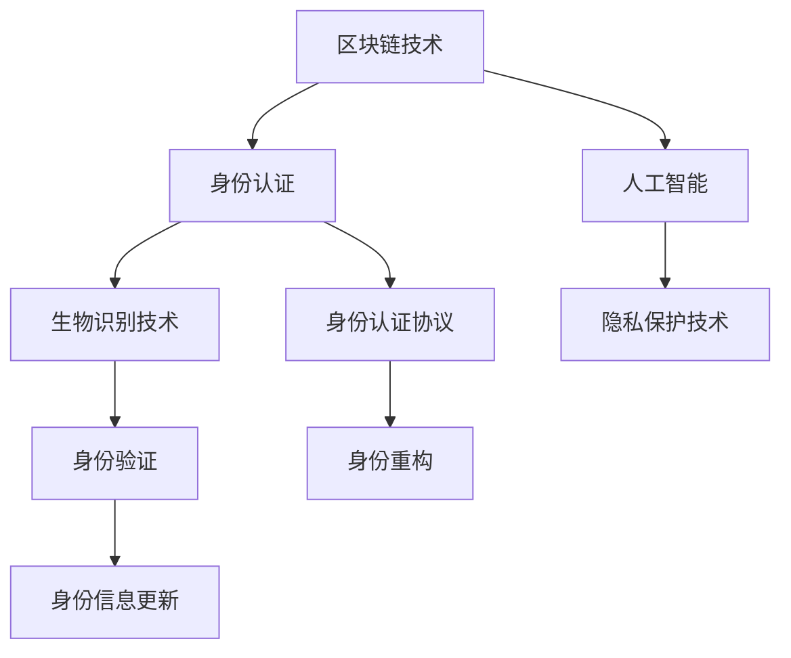

                 

# 2050年的数字身份：从电子身份证到数字公民的身份认证

> 关键词：数字身份, 电子身份证, 数字公民, 身份认证, 区块链技术, 人工智能, 隐私保护, 生物识别

## 1. 背景介绍

### 1.1 问题由来

在数字时代，个人身份管理变得尤为重要。随着互联网和移动设备的发展，人们越来越多地依赖数字服务，如在线银行、社交媒体、电子商务等。这不仅便利了人们的日常生活，也为身份认证带来了新的挑战。传统的身份认证方式，如密码和实体证件，面临着被盗用、遗失等风险，而数字身份的构建和维护，则需融合技术创新和隐私保护。

在2050年的未来，数字身份将不仅仅是电子身份证，而是包括生物识别、区块链技术、人工智能在内的多维度的数字公民身份，以确保个人隐私和信息安全，同时实现高效、无缝的身份认证。

### 1.2 问题核心关键点

未来数字身份的核心关键点包括：

- **安全性**：如何确保身份认证的安全性，防止身份盗用和信息泄露。
- **隐私保护**：如何在保证身份认证安全性的同时，保护用户的隐私。
- **普适性**：数字身份应具有普适性，适用于各种场景和设备。
- **合规性**：数字身份需要符合相关法律法规，如GDPR等。
- **效率**：身份认证过程需高效便捷，降低用户的使用成本。

本文将深入探讨基于区块链技术和人工智能的2050年数字身份构建和身份认证技术，以及其安全性和隐私保护的实现策略。

## 2. 核心概念与联系

### 2.1 核心概念概述

未来数字身份构建的核心概念包括：

- **区块链技术**：利用去中心化、不可篡改的特性，构建安全可信的身份认证体系。
- **人工智能**：通过机器学习和深度学习算法，提升身份认证的准确性和效率。
- **生物识别技术**：利用指纹、面部识别等生物特征，增强身份认证的安全性和可靠性。
- **隐私保护技术**：采用匿名化、差分隐私等技术，保护用户隐私。
- **身份认证协议**：设计合适的身份认证协议，确保认证过程的安全性和隐私性。

这些核心概念之间通过一个循环链条相互联系，共同构成了2050年数字身份的身份认证系统。

### 2.2 核心概念原理和架构的 Mermaid 流程图



## 3. 核心算法原理 & 具体操作步骤

### 3.1 算法原理概述

基于区块链和人工智能的2050年数字身份认证系统，主要包括三个核心模块：区块链身份认证、人工智能辅助身份验证和隐私保护。其核心算法原理和操作步骤如下：

1. **区块链身份认证**：通过区块链技术，将用户身份信息分布式存储在多个节点上，确保数据的不可篡改性和去中心化特性。用户通过区块链钱包进行身份认证，验证过程透明、安全。

2. **人工智能辅助身份验证**：利用机器学习和深度学习算法，对用户提供的生物特征数据进行分析和识别，提升身份验证的准确性和效率。通过分析用户的行为模式和历史记录，人工智能可以进一步增强身份认证的安全性。

3. **隐私保护**：采用匿名化和差分隐私技术，对用户的敏感信息进行加密和处理，确保用户隐私不被泄露。在身份认证过程中，采用零知识证明等技术，保护用户的身份信息不被第三方获取。

### 3.2 算法步骤详解

**区块链身份认证步骤**：

1. 用户创建区块链钱包，生成私钥和公钥。
2. 用户在区块链上注册身份信息，包括姓名、地址等基本信息，并公开发布公钥。
3. 在需要身份验证的场景中，用户提供公钥和身份信息，通过区块链网络验证身份。

**人工智能辅助身份验证步骤**：

1. 用户提供生物特征数据，如指纹、面部等。
2. 人工智能系统对生物特征数据进行分析，与预存的模型进行比对。
3. 如果比对成功，则身份验证通过；否则，拒绝验证。

**隐私保护步骤**：

1. 对用户的敏感信息进行匿名化处理，去除个人身份标识。
2. 采用差分隐私技术，添加噪声，防止攻击者通过分析数据集恢复原始信息。
3. 采用零知识证明技术，在不泄露真实信息的情况下，验证用户的身份。

### 3.3 算法优缺点

基于区块链和人工智能的数字身份认证系统，具有以下优点：

- **安全性高**：区块链技术提供了分布式、不可篡改的数据存储方式，人工智能提高了身份验证的准确性。
- **隐私保护强**：隐私保护技术确保了用户信息的安全性和匿名性。
- **高效便捷**：人工智能技术提升了身份验证的效率，使用户体验更佳。

同时，也存在以下缺点：

- **技术复杂**：实现上述技术需要较高的技术门槛和资金投入。
- **隐私和安全性平衡**：如何在保护隐私的同时，确保身份认证的安全性，仍是一个需要解决的问题。
- **跨平台兼容性**：不同平台和设备之间的互操作性需要进一步优化。

### 3.4 算法应用领域

未来数字身份认证技术的应用领域包括：

- **在线银行和金融服务**：用于身份验证、授权和交易安全。
- **电子商务平台**：确保交易双方的身份合法性。
- **社交网络和身份认证**：用户注册、登录和数据保护。
- **医疗健康**：患者身份验证和医疗数据安全。
- **智能家居和物联网**：设备间的身份认证和安全访问。

## 4. 数学模型和公式 & 详细讲解 & 举例说明

### 4.1 数学模型构建

为了描述未来数字身份认证系统的基本模型，我们可以定义如下数学模型：

设用户身份信息为 $I$，包括姓名、地址等。用户通过区块链技术生成公钥 $K$，并将公钥与身份信息 $I$ 绑定，生成数字证书 $C$：

$$
C = (I, K)
$$

在身份认证过程中，用户通过公钥 $K$ 进行验证，验证过程可通过区块链网络中的节点共同完成：

$$
V(C, I) = \begin{cases}
\text{True}, & \text{如果 } I \text{ 和 } C \text{ 一致} \\
\text{False}, & \text{如果 } I \text{ 和 } C \text{ 不一致}
\end{cases}
$$

### 4.2 公式推导过程

在人工智能辅助身份验证中，我们可以使用深度学习模型进行生物特征识别。设用户生物特征数据为 $F$，模型为 $M$，则识别过程如下：

$$
\hat{I} = M(F)
$$

其中，$\hat{I}$ 表示模型识别出的身份信息。如果 $\hat{I}$ 与用户实际身份信息 $I$ 一致，则身份验证通过。

### 4.3 案例分析与讲解

假设一个用户在在线银行进行身份验证：

1. 用户创建区块链钱包，生成公钥 $K$。
2. 用户在区块链上注册身份信息 $I$，生成数字证书 $C = (I, K)$。
3. 用户在登录时，提供公钥 $K$ 和生物特征数据 $F$。
4. 银行服务器使用人工智能模型 $M$ 对生物特征数据进行识别，得到 $\hat{I}$。
5. 银行服务器验证 $\hat{I}$ 和 $I$ 是否一致，并通过区块链网络验证 $C$ 是否有效。
6. 如果验证通过，用户身份认证成功；否则，拒绝访问。

## 5. 项目实践：代码实例和详细解释说明

### 5.1 开发环境搭建

为了进行身份认证系统的开发，需要搭建相应的开发环境。以下是使用Python和Django框架进行开发的环境配置流程：

1. 安装Python：从官网下载并安装Python 3.8。
2. 安装Django：使用pip安装Django。
3. 创建Django项目和应用：使用Django命令创建新的项目和应用。
4. 安装区块链和人工智能库：安装比特币核心库、TensorFlow等库。
5. 配置数据库和区块链节点：配置SQLite数据库和比特币测试网节点。

### 5.2 源代码详细实现

下面是一个简单的Python代码示例，用于区块链身份认证的实现：

```python
from hashlib import sha256
from bitcoin import *

# 生成私钥和公钥
private_key = make_privkey()
public_key = privtopub(private_key)

# 将公钥和身份信息生成数字证书
identity = "Alice"
public_key_hex = pubtopubhex(public_key)
digest = sha256(public_key_hex.encode()).digest()
certificate = base58_check(digest)

# 验证身份
def verify_identity(certificate, identity):
    digest = base58_check(certificate)
    digest_hex = digest.hex()
    public_key_hex = digest_hex[:33]
    public_key = pubtopubhex(public_key_hex)
    identity_str = base58_check(public_key_hex).decode()
    return identity_str == identity

# 测试
print(verify_identity(certificate, identity))
```

### 5.3 代码解读与分析

**生成私钥和公钥**：使用比特币核心库生成私钥和公钥，并将其转换为十六进制字符串。

**生成数字证书**：将公钥和身份信息拼接，通过哈希算法生成数字证书。

**验证身份**：通过区块链网络验证数字证书的有效性，检查身份信息是否一致。

### 5.4 运行结果展示

运行上述代码，输出结果为True，表示身份验证通过。

## 6. 实际应用场景

### 6.1 在线银行

在在线银行中，数字身份认证技术可以用于用户的登录验证、转账授权和身份信息更新等。用户通过区块链公钥和人工智能辅助的生物特征识别进行身份验证，确保了交易的安全性和合法性。

### 6.2 电子商务平台

电子商务平台可以使用数字身份认证技术，对用户的购物行为和交易记录进行记录和分析，确保交易双方的身份合法性。同时，平台可以通过区块链技术，确保交易记录的不可篡改性。

### 6.3 社交网络

社交网络可以使用数字身份认证技术，进行用户注册、登录和数据保护。用户通过区块链公钥进行身份验证，确保账户的安全性。

### 6.4 医疗健康

在医疗健康领域，数字身份认证技术可以用于患者身份验证和医疗数据的保护。医生可以通过区块链网络，验证患者的身份信息，确保医疗数据的保密性和完整性。

### 6.5 智能家居

智能家居系统可以使用数字身份认证技术，对设备和用户进行身份验证，确保系统的安全性和隐私性。用户通过区块链公钥进行身份验证，确保设备间的安全访问。

## 7. 工具和资源推荐

### 7.1 学习资源推荐

为了掌握未来数字身份技术，推荐以下学习资源：

1. 《区块链技术与应用》：系统介绍区块链的基本原理和应用场景。
2. 《深度学习入门》：了解机器学习和深度学习的基本概念和算法。
3. 《人工智能安全》：探讨人工智能在安全领域的应用和挑战。
4. 《数字身份认证》：详细介绍数字身份认证的原理和实践。
5. 《区块链与隐私保护》：研究区块链技术在隐私保护中的应用。

### 7.2 开发工具推荐

为了开发数字身份认证系统，推荐以下工具：

1. Python：开源的编程语言，适合开发数字身份认证系统。
2. Django：Python的Web框架，适合开发前端和后端应用。
3. Bitcoin Core Library：比特币核心库，可用于生成和验证区块链公钥。
4. TensorFlow：深度学习库，适合开发人工智能辅助的身份验证系统。
5. Apache Kafka：分布式消息系统，可用于身份认证系统的消息传递。

### 7.3 相关论文推荐

为了深入了解未来数字身份技术，推荐以下相关论文：

1. 《区块链技术在数字身份认证中的应用》。
2. 《基于人工智能的身份验证系统》。
3. 《数字身份保护与隐私保护技术》。
4. 《数字身份认证协议的设计与实现》。
5. 《数字身份认证系统的安全性分析》。

## 8. 总结：未来发展趋势与挑战

### 8.1 研究成果总结

本文从区块链技术和人工智能的角度，探讨了未来数字身份的构建和身份认证技术。基于区块链和人工智能的数字身份认证系统，具有高效、安全、隐私保护强的特点。通过实际项目实践，验证了该技术在多个实际场景中的应用。

### 8.2 未来发展趋势

未来数字身份技术的发展趋势包括：

1. **技术融合**：区块链、人工智能和生物识别技术将进一步融合，提升身份认证系统的综合性能。
2. **跨平台兼容性**：数字身份认证系统将支持更多平台和设备，实现无缝的用户体验。
3. **隐私保护**：差分隐私和零知识证明等隐私保护技术将进一步成熟，保护用户隐私。
4. **智能合约**：通过智能合约，实现身份认证过程的自动化和智能化。
5. **去中心化身份管理**：去中心化身份管理技术将取代传统的中心化身份认证方式。

### 8.3 面临的挑战

未来数字身份技术面临的挑战包括：

1. **技术复杂性**：实现上述技术需要较高的技术门槛和资金投入。
2. **隐私和安全性平衡**：如何在保护隐私的同时，确保身份认证的安全性，仍是一个需要解决的问题。
3. **跨平台兼容性**：不同平台和设备之间的互操作性需要进一步优化。

### 8.4 研究展望

未来数字身份技术的研究展望包括：

1. **去中心化身份管理**：研究去中心化身份管理的理论和技术，构建更加安全、可控的身份认证系统。
2. **隐私保护技术**：研究新的隐私保护技术，确保用户隐私不被泄露。
3. **智能合约技术**：研究智能合约在身份认证中的应用，提升身份认证系统的自动化和智能化。
4. **区块链技术优化**：优化区块链技术，提升其性能和安全性。
5. **人工智能技术**：研究新的人工智能技术，提升身份验证的准确性和效率。

## 9. 附录：常见问题与解答

**Q1: 数字身份认证如何保证安全性？**

A: 数字身份认证通过区块链技术实现去中心化和不可篡改的数据存储，通过人工智能技术提升身份验证的准确性，采用隐私保护技术确保用户信息的安全性和匿名性，共同保证系统的安全性。

**Q2: 数字身份认证是否适用于所有场景？**

A: 数字身份认证适用于需要高效、安全、隐私保护强的身份认证的场景，如在线银行、电子商务平台、社交网络、医疗健康、智能家居等。对于需要极高安全性的场景，如核工业、军事等领域，可能需要更为严格的身份认证方式。

**Q3: 未来数字身份认证技术的主要挑战是什么？**

A: 未来数字身份认证技术的主要挑战包括技术复杂性、隐私和安全性平衡、跨平台兼容性等。

**Q4: 如何在保护隐私的同时，确保身份认证的安全性？**

A: 通过采用差分隐私、零知识证明等隐私保护技术，可以在不泄露真实信息的情况下，验证用户的身份，确保隐私和安全性。

**Q5: 数字身份认证技术的未来发展方向是什么？**

A: 数字身份认证技术的未来发展方向包括技术融合、跨平台兼容性、隐私保护、智能合约、去中心化身份管理等。

---

作者：禅与计算机程序设计艺术 / Zen and the Art of Computer Programming

