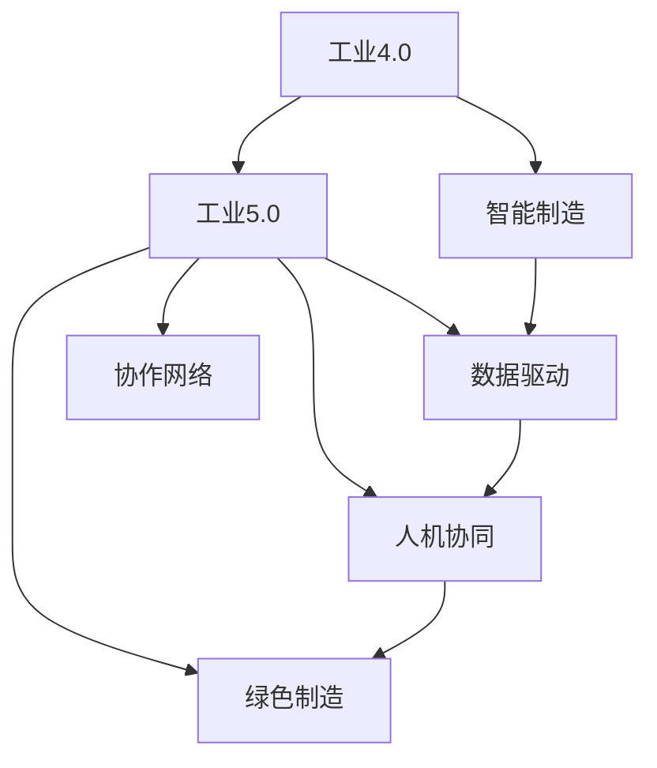

                 

# 2050年的智能制造：从工业4.0到工业5.0的制造业升级

> 关键词：智能制造,工业5.0,工业4.0,制造业升级,自动化,数字化,人工智能,机器学习

## 1. 背景介绍

### 1.1 问题的由来
自工业革命以来，制造业一直是社会经济发展的重要支柱。然而，传统的制造业模式以机械化、标准化、批量化为特点，资源消耗大，环境污染严重，缺乏灵活性和创新性。随着技术的发展，特别是信息技术的普及，制造业正逐步迈向智能化、网络化和协同化的新阶段。这一转变不仅带来生产效率的大幅提升，也为未来工业的可持续发展奠定了坚实基础。

### 1.2 问题核心关键点
从工业4.0到工业5.0，制造业的升级转型正面临新的挑战和机遇。核心关键点包括：
- 自动化与智能化的融合
- 数字化转型的深入应用
- 数据驱动的决策优化
- 人机协同与协作
- 绿色制造与可持续发展的追求

这些关键点贯穿于工业升级的各个环节，推动制造业向更高效、更智能、更可持续的方向发展。

### 1.3 问题研究意义
实现从工业4.0到工业5.0的转型，对于提升制造业的竞争力、推动经济结构优化升级、实现可持续发展具有重要意义：
- 提升生产效率和质量：通过自动化和智能化，大幅提升生产线的响应速度和精度。
- 降低成本与资源消耗：优化生产流程，减少能源和物料的浪费。
- 增强市场响应速度：数据驱动的决策支持，使企业能够快速响应市场变化。
- 促进绿色制造：采用可再生能源和环保材料，减少对环境的影响。
- 推动创新与发展：新兴技术的应用，为企业提供更多创新机会。

## 2. 核心概念与联系

### 2.1 核心概念概述

为了更好地理解工业5.0的概念和技术框架，本节将介绍几个核心概念：

- **工业4.0**：基于信息物理系统的智能制造，通过工业互联网平台，实现人机物全面互联和信息深度融合，推动制造业智能化转型。
- **工业5.0**：在工业4.0的基础上，进一步引入人工智能、大数据、物联网、区块链等前沿技术，构建全要素、全过程、全链条协同优化的智能制造生态系统。
- **智能制造**：通过自动化、数字化、网络化、智能化技术，实现资源配置优化、生产过程优化和产品质量提升。
- **数据驱动**：利用大数据分析，优化生产计划和决策过程，提升制造过程的灵活性和透明度。
- **人机协同**：通过人机交互技术和智能化工具，实现生产工人和智能系统的无缝协作。
- **绿色制造**：采用可再生能源和环保材料，减少生产过程中的环境污染和资源浪费。
- **协作网络**：基于工业互联网平台，构建企业间、企业与用户间的互联互通，实现资源共享和协同创新。

这些概念之间的联系可以通过以下Mermaid流程图来展示：



这个流程图展示出各个概念之间的关系：

1. **工业4.0**是智能制造的基础，强调了信息物理系统的应用。
2. **工业5.0**在工业4.0的基础上，进一步引入了人工智能、大数据等前沿技术，推动了智能制造的深化。
3. **智能制造**涵盖了自动化、数字化、网络化和智能化等关键要素。
4. **数据驱动**利用大数据分析优化生产过程。
5. **人机协同**强调了人机交互的重要性。
6. **绿色制造**追求环保和可持续的发展路径。
7. **协作网络**搭建了企业间和用户间的互动平台。

这些概念共同构成了工业5.0的完整框架，为制造业的升级转型提供了全面的技术支持。

## 3. 核心算法原理 & 具体操作步骤
### 3.1 算法原理概述

基于人工智能和物联网技术的智能制造，其核心在于实现生产过程的自动化、数字化、智能化和集成化。核心算法包括：

- **自动化控制算法**：用于优化生产线的自动化调度和管理。
- **机器学习算法**：通过大数据分析，实现生产过程的预测和优化。
- **传感器数据融合算法**：将传感器采集的数据进行融合处理，实现生产过程的全面监控。
- **云计算和大数据处理算法**：实现海量数据的存储、分析和处理。

这些算法的协同工作，构成了工业5.0的核心技术架构。

### 3.2 算法步骤详解

**Step 1: 数据采集与处理**
- 部署各类传感器和智能设备，实时采集生产过程中的各项数据。
- 利用数据清洗和预处理技术，确保数据的准确性和一致性。

**Step 2: 数据存储与分析**
- 将采集到的数据存储到云端或本地数据库中。
- 利用大数据分析技术，对数据进行统计、分析和预测，为生产优化提供决策支持。

**Step 3: 自动化控制**
- 将分析结果反馈到生产系统，通过自动化控制算法，优化生产流程。
- 通过机器人和智能设备，实现生产的自动化和柔性化。

**Step 4: 人工智能与模型训练**
- 利用机器学习算法，构建预测模型，优化生产过程。
- 通过模型训练和参数优化，提升模型的准确性和泛化能力。

**Step 5: 人机协同与协作网络**
- 通过人机交互技术，实现生产工人和智能系统的高效协作。
- 利用工业互联网平台，构建企业间和用户间的协作网络，实现资源共享和协同创新。

### 3.3 算法优缺点

工业5.0的算法具有以下优点：
1. 提升生产效率：通过自动化和智能化技术，大幅提升生产线的响应速度和精度。
2. 降低成本与资源消耗：优化生产流程，减少能源和物料的浪费。
3. 增强市场响应速度：数据驱动的决策支持，使企业能够快速响应市场变化。
4. 促进绿色制造：采用可再生能源和环保材料，减少对环境的影响。
5. 推动创新与发展：新兴技术的应用，为企业提供更多创新机会。

但同时也存在以下缺点：
1. 技术复杂度高：涉及多个领域的技术融合，开发和部署难度较大。
2. 数据安全问题：海量数据的存储和分析，存在数据泄露和隐私保护的风险。
3. 系统成本高：高质量的传感器和智能设备，以及云计算资源，成本较高。
4. 维护和升级难度大：系统复杂，维护和升级需要专业知识和技术支持。

### 3.4 算法应用领域

工业5.0的算法已经在多个领域得到广泛应用，例如：

- **智能制造**：通过自动化和智能化技术，实现生产线的优化和高效运行。
- **智慧工厂**：通过物联网和传感器技术，实现生产过程的全面监控和优化。
- **智能供应链**：利用大数据和机器学习技术，优化供应链管理，提高物流效率。
- **智能产品设计**：通过数字化建模和仿真技术，实现产品设计的自动化和优化。
- **绿色制造**：采用可再生能源和环保材料，减少生产过程中的环境污染和资源浪费。

除了这些应用外，工业5.0的算法还在智能仓储、智能检测、智能服务等更多领域展现出广阔的应用前景。

## 4. 数学模型和公式 & 详细讲解 & 举例说明

### 4.1 数学模型构建

工业5.0的数学模型构建涉及多个领域，包括控制论、优化理论、数据科学和机器学习等。这里以智能制造中的预测控制为例，构建数学模型。

假设生产线上某个工序的输入为 $u(t)$，输出为 $y(t)$，存在干扰 $w(t)$，则系统的动态方程为：

$$
y(t) = f(u(t),w(t))
$$

其中 $f$ 为系统的动态函数。通过控制系统理论，可以设计控制器 $u(t)$，使系统输出 $y(t)$ 逼近目标值 $y_d(t)$：

$$
y(t) = u(t) - w(t)
$$

即通过控制器 $u(t)$ 抵消干扰 $w(t)$，使系统输出与目标值一致。

### 4.2 公式推导过程

考虑一个简单的线性系统，其动态方程为：

$$
y(t) = k_1 u(t) + k_2 w(t) + \epsilon(t)
$$

其中 $k_1$ 和 $k_2$ 为系统参数，$\epsilon(t)$ 为系统噪声。设计控制器 $u(t)$ 为：

$$
u(t) = k_u y_d(t) - k_w w(t)
$$

代入系统动态方程，得：

$$
y(t) = k_1 (k_u y_d(t) - k_w w(t)) + k_2 w(t) + \epsilon(t)
$$

化简得：

$$
y(t) = k_u k_1 y_d(t) - k_w (k_1 + k_2) w(t) + \epsilon(t)
$$

由此可知，通过控制器 $u(t)$，可以有效地抵消干扰 $w(t)$，使系统输出 $y(t)$ 逼近目标值 $y_d(t)$。

### 4.3 案例分析与讲解

以智能仓储中的自动化调度为例，考虑一个仓库中的多台AGV（自动导引车）协同作业的问题。假设有 $n$ 台AGV和 $m$ 个货箱，目标是将货箱从仓库中的某个位置运输到目标位置。

**Step 1: 数据采集与处理**
- 部署传感器和智能设备，实时采集AGV位置、货箱位置和状态等信息。
- 利用数据清洗和预处理技术，确保数据的准确性和一致性。

**Step 2: 数据存储与分析**
- 将采集到的数据存储到云端或本地数据库中。
- 利用大数据分析技术，对数据进行统计、分析和预测，为AGV调度提供决策支持。

**Step 3: 自动化控制**
- 将分析结果反馈到AGV控制系统，通过优化算法，计算最优路径和调度方案。
- 通过AGV的自动导航和避障技术，实现货箱的自动化运输。

**Step 4: 人工智能与模型训练**
- 利用机器学习算法，构建路径优化模型，预测最优调度方案。
- 通过模型训练和参数优化，提升模型的准确性和泛化能力。

**Step 5: 人机协同与协作网络**
- 通过人机交互技术，实现AGV操作员与智能系统的协作。
- 利用工业互联网平台，构建企业间的协作网络，实现资源共享和协同创新。

## 5. 项目实践：代码实例和详细解释说明
### 5.1 开发环境搭建

在进行工业5.0项目实践前，我们需要准备好开发环境。以下是使用Python进行PyTorch开发的环境配置流程：

1. 安装Anaconda：从官网下载并安装Anaconda，用于创建独立的Python环境。

2. 创建并激活虚拟环境：
```bash
conda create -n pytorch-env python=3.8 
conda activate pytorch-env
```

3. 安装PyTorch：根据CUDA版本，从官网获取对应的安装命令。例如：
```bash
conda install pytorch torchvision torchaudio cudatoolkit=11.1 -c pytorch -c conda-forge
```

4. 安装各类工具包：
```bash
pip install numpy pandas scikit-learn matplotlib tqdm jupyter notebook ipython
```

完成上述步骤后，即可在`pytorch-env`环境中开始项目实践。

### 5.2 源代码详细实现

这里以智能制造中的路径优化为例，使用PyTorch进行模型的设计和训练。

首先，定义路径优化问题的数学模型：

```python
import torch
from torch import nn

class PathOptimizationModel(nn.Module):
    def __init__(self, n_agvs, m_cargo, d):
        super(PathOptimizationModel, self).__init__()
        self.n_agvs = n_agvs
        self.m_cargo = m_cargo
        self.d = d
        self.fc1 = nn.Linear(n_agvs + m_cargo, 64)
        self.fc2 = nn.Linear(64, n_agvs)
        
    def forward(self, x, y):
        x = self.fc1(torch.cat([x, y], dim=1))
        x = nn.functional.relu(x)
        x = self.fc2(x)
        return x
```

然后，定义损失函数和优化器：

```python
from torch.optim import Adam

def path_loss(model, x, y):
    x_pred = model(x, y)
    loss = torch.mean((x_pred - y)**2)
    return loss

optimizer = Adam(model.parameters(), lr=0.001)
```

接着，定义训练和评估函数：

```python
def train_epoch(model, x_train, y_train, optimizer):
    optimizer.zero_grad()
    loss = path_loss(model, x_train, y_train)
    loss.backward()
    optimizer.step()
    return loss.item()

def evaluate(model, x_val, y_val):
    loss = path_loss(model, x_val, y_val)
    return loss.item()
```

最后，启动训练流程并在验证集上评估：

```python
epochs = 100
x_train, y_train = ... # 训练数据
x_val, y_val = ... # 验证数据

model = PathOptimizationModel(n_agvs, m_cargo, d)
loss_train = 0
loss_val = 0

for epoch in range(epochs):
    loss_train += train_epoch(model, x_train, y_train, optimizer)
    loss_val += evaluate(model, x_val, y_val)
    
    if epoch % 10 == 0:
        print(f"Epoch {epoch+1}, train loss: {loss_train/10:.3f}, val loss: {loss_val/10:.3f}")
        
    loss_train = 0
    loss_val = 0

print(f"Final train loss: {loss_train/epochs:.3f}, final val loss: {loss_val/epochs:.3f}")
```

以上就是使用PyTorch对智能制造中的路径优化模型进行训练的完整代码实现。可以看到，通过PyTorch的强大计算图和自动微分功能，路径优化模型的设计和训练变得相对简洁高效。

### 5.3 代码解读与分析

让我们再详细解读一下关键代码的实现细节：

**PathOptimizationModel类**：
- `__init__`方法：初始化模型参数，包括AGV数量、货箱数量和模型层数。
- `forward`方法：定义模型的前向传播过程，通过全连接层进行路径优化。

**path_loss函数**：
- 计算预测路径和实际路径之间的均方误差损失，用于模型训练。

**optimizer**：
- 定义Adam优化器，用于模型参数的优化更新。

**train_epoch函数**：
- 计算模型在训练集上的损失，并反向传播更新参数。

**evaluate函数**：
- 计算模型在验证集上的损失，评估模型性能。

**训练流程**：
- 定义总的训练轮数和训练集、验证集数据。
- 每轮训练中，调用`train_epoch`函数进行模型训练，并记录损失。
- 每10个epoch输出一次训练和验证集上的损失。
- 最终输出模型训练和验证集上的最终损失。

可以看到，PyTorch框架通过封装模型、损失函数和优化器，简化了路径优化模型的设计和训练流程，使得开发者可以专注于问题本身的解决。

当然，工业级的系统实现还需考虑更多因素，如模型的保存和部署、超参数的自动搜索、更灵活的任务适配层等。但核心的算法流程基本与此类似。

## 6. 实际应用场景
### 6.1 智能制造

智能制造是工业5.0的核心应用场景之一，涵盖从产品设计、生产制造到供应链管理等多个环节。具体应用包括：

- **智能设计**：利用计算机辅助设计(CAD)和仿真技术，实现产品的数字化设计和虚拟验证。
- **智能生产**：通过自动化控制和机器人技术，实现生产线的柔性化和智能化。
- **智能检测**：利用机器视觉和传感器技术，实现生产过程中的实时监控和质量控制。
- **智能仓储**：通过AGV和无人机技术，实现货物的自动化存储和调度。
- **智能供应链**：利用大数据和机器学习技术，优化供应链管理，提高物流效率。

这些应用场景展示了智能制造在提升生产效率、降低成本和提高产品质量方面的巨大潜力。

### 6.2 智慧工厂

智慧工厂通过物联网和云计算技术，实现生产过程的全面监控和优化。具体应用包括：

- **设备监控与维护**：通过传感器和智能设备，实时监控生产设备的运行状态，实现故障预测和预防性维护。
- **能耗管理**：利用智能控制系统，优化能源消耗，降低生产成本。
- **供应链管理**：通过实时数据采集和分析，优化供应链的各个环节，提升物流效率。

智慧工厂的应用场景展示了工业5.0在实现生产过程的全面监控和优化方面的优势。

### 6.3 智能服务

智能服务通过人工智能和物联网技术，提供个性化的生产服务。具体应用包括：

- **智能客服**：利用自然语言处理和语音识别技术，提供7x24小时的智能客服服务。
- **个性化推荐**：通过数据分析和机器学习技术，提供个性化的产品推荐和营销服务。
- **智能维修**：利用预测性维护和远程诊断技术，实现设备的智能化维修。

这些应用场景展示了工业5.0在提升生产服务体验和效率方面的优势。

### 6.4 未来应用展望

展望未来，工业5.0的应用场景将更加广泛，技术水平也将不断提升：

- **全要素智能化**：通过人工智能和物联网技术，实现生产过程的全要素智能化。
- **全球化协同制造**：利用工业互联网平台，实现全球范围内的协同制造和资源共享。
- **可持续发展**：采用可再生能源和环保材料，实现绿色制造和可持续发展。
- **智能运维**：利用大数据和机器学习技术，实现设备的智能运维和故障预测。
- **人机协同**：通过人机交互技术和智能化工具，实现生产工人和智能系统的无缝协作。

这些应用场景展示了工业5.0在提升生产效率、降低成本和提高产品质量方面的巨大潜力。

## 7. 工具和资源推荐
### 7.1 学习资源推荐

为了帮助开发者系统掌握工业5.0的理论基础和实践技巧，这里推荐一些优质的学习资源：

1. **《工业4.0与智能制造》系列博文**：由工业互联网专家撰写，深入浅出地介绍了工业4.0和智能制造的核心理念和技术框架。

2. **《工业5.0：未来的智能制造》课程**：各大高校和在线教育平台开设的工业5.0课程，涵盖智能制造、智慧工厂、智能服务等核心内容。

3. **《工业5.0白皮书》书籍**：由工业互联网权威机构发布的工业5.0白皮书，详细介绍了工业5.0的体系架构和关键技术。

4. **工业互联网标准联盟官网**：提供工业互联网相关标准、规范和指南，帮助开发者理解和遵循工业5.0的规范体系。

5. **工业互联网产学研用联盟**：提供工业互联网领域的最新研究成果、技术进展和应用案例，帮助开发者了解前沿动态。

通过对这些资源的学习实践，相信你一定能够快速掌握工业5.0的理论基础和实践技巧，并用于解决实际的智能制造问题。

### 7.2 开发工具推荐

高效的开发离不开优秀的工具支持。以下是几款用于工业5.0开发的常用工具：

1. **Python**：工业5.0开发的主流编程语言，具有丰富的开源库和工具支持。

2. **PyTorch**：基于Python的开源深度学习框架，适用于大规模深度学习模型的开发和训练。

3. **TensorFlow**：由Google主导开发的开源深度学习框架，支持分布式计算和深度学习模型的优化。

4. **工业互联网平台**：如工业互联网标识解析系统(IDaaS)、工业互联网大数据平台(IDP)等，提供工业数据存储、管理和分析功能。

5. **IoT平台**：如ThingWorx、Kepware等，提供物联网设备的连接、监控和管理功能。

6. **云平台**：如AWS、Azure、Google Cloud等，提供云计算资源和云原生应用的支持。

合理利用这些工具，可以显著提升工业5.0开发的效率，加快创新迭代的步伐。

### 7.3 相关论文推荐

工业5.0的发展源于学界的持续研究。以下是几篇奠基性的相关论文，推荐阅读：

1. **《智能制造的概念、发展方向与实施策略》**：详细介绍了智能制造的概念、发展方向和实施策略。

2. **《工业5.0：制造模式的未来》**：提出了工业5.0的概念和关键技术，探讨了工业5.0的发展方向。

3. **《人工智能在工业制造中的应用》**：介绍了人工智能在工业制造中的各种应用，包括智能设计、智能生产等。

4. **《工业互联网与智能制造的融合》**：探讨了工业互联网与智能制造的融合路径和应用场景。

5. **《智能制造中的大数据分析》**：详细介绍了大数据分析在智能制造中的应用，包括生产优化、设备维护等。

这些论文代表了大规模工业制造技术的发展脉络。通过学习这些前沿成果，可以帮助研究者把握学科前进方向，激发更多的创新灵感。

## 8. 总结：未来发展趋势与挑战

### 8.1 总结

本文对工业5.0的智能制造进行了全面系统的介绍。首先阐述了智能制造和工业5.0的概念和发展历程，明确了其在提升生产效率、降低成本和推动可持续发展方面的重要意义。其次，从原理到实践，详细讲解了工业5.0的核心算法和技术实现，给出了工业5.0项目开发的完整代码实例。同时，本文还广泛探讨了工业5.0在智能制造、智慧工厂、智能服务等多个领域的应用前景，展示了其广阔的应用前景。最后，本文精选了工业5.0的学习资源、开发工具和相关论文，力求为读者提供全方位的技术指引。

通过本文的系统梳理，可以看到，工业5.0的智能制造正在成为制造业转型升级的重要方向，极大地提升了生产效率和产品质量，推动了经济结构优化升级，具有深远的社会和经济意义。

### 8.2 未来发展趋势

展望未来，工业5.0的发展趋势包括：

1. **全要素智能化**：通过人工智能和物联网技术，实现生产过程的全要素智能化。
2. **全球化协同制造**：利用工业互联网平台，实现全球范围内的协同制造和资源共享。
3. **可持续发展**：采用可再生能源和环保材料，实现绿色制造和可持续发展。
4. **智能运维**：利用大数据和机器学习技术，实现设备的智能运维和故障预测。
5. **人机协同**：通过人机交互技术和智能化工具，实现生产工人和智能系统的无缝协作。

这些趋势凸显了工业5.0在提升生产效率、降低成本和推动可持续发展方面的巨大潜力。

### 8.3 面临的挑战

尽管工业5.0的技术进步带来了诸多机遇，但发展过程中仍面临以下挑战：

1. **技术复杂度高**：涉及多个领域的技术融合，开发和部署难度较大。
2. **数据安全问题**：海量数据的存储和分析，存在数据泄露和隐私保护的风险。
3. **系统成本高**：高质量的传感器和智能设备，以及云计算资源，成本较高。
4. **维护和升级难度大**：系统复杂，维护和升级需要专业知识和技术支持。
5. **跨领域协同难度大**：工业5.0涉及工业、IT、互联网等多个领域，协同合作难度大。

正视这些挑战，积极应对并寻求突破，将是大规模工业制造技术走向成熟的必由之路。

### 8.4 研究展望

面向未来，工业5.0的研究需要在以下几个方面寻求新的突破：

1. **探索无监督和半监督学习范式**：摆脱对大规模标注数据的依赖，利用自监督学习、主动学习等无监督和半监督范式，最大限度利用非结构化数据，实现更加灵活高效的智能制造。
2. **开发更加参数高效的微调方法**：开发更加参数高效的微调方法，在固定大部分预训练参数的同时，只更新极少量的任务相关参数。同时优化微调模型的计算图，减少前向传播和反向传播的资源消耗，实现更加轻量级、实时性的部署。
3. **引入因果推断和对比学习思想**：通过引入因果推断和对比学习思想，增强智能制造模型建立稳定因果关系的能力，学习更加普适、鲁棒的语言表征，从而提升模型泛化性和抗干扰能力。
4. **融合符号化先验知识**：将符号化的先验知识，如知识图谱、逻辑规则等，与神经网络模型进行巧妙融合，引导微调过程学习更准确、合理的语言模型。同时加强不同模态数据的整合，实现视觉、语音等多模态信息与文本信息的协同建模。
5. **结合因果分析和博弈论工具**：将因果分析方法引入智能制造模型，识别出模型决策的关键特征，增强输出解释的因果性和逻辑性。借助博弈论工具刻画人机交互过程，主动探索并规避模型的脆弱点，提高系统稳定性。
6. **纳入伦理道德约束**：在模型训练目标中引入伦理导向的评估指标，过滤和惩罚有偏见、有害的输出倾向。同时加强人工干预和审核，建立模型行为的监管机制，确保输出符合人类价值观和伦理道德。

这些研究方向的探索，必将引领工业5.0的智能制造技术迈向更高的台阶，为构建安全、可靠、可解释、可控的智能系统铺平道路。面向未来，大规模工业制造技术还需要与其他人工智能技术进行更深入的融合，如知识表示、因果推理、强化学习等，多路径协同发力，共同推动智能制造技术的进步。只有勇于创新、敢于突破，才能不断拓展智能制造的边界，让智能技术更好地造福人类社会。

## 9. 附录：常见问题与解答

**Q1: 什么是工业5.0?**

A: 工业5.0是工业4.0的进一步发展，融合了人工智能、大数据、物联网、区块链等前沿技术，构建全要素、全过程、全链条协同优化的智能制造生态系统。它通过智能化、网络化、协同化、绿色化等手段，实现生产过程的全面优化，提升生产效率和产品质量，推动经济结构优化升级和可持续发展。

**Q2: 工业5.0的应用场景有哪些?**

A: 工业5.0的应用场景广泛，涵盖智能制造、智慧工厂、智能服务等多个领域。具体应用包括智能设计、智能生产、智能检测、智能仓储、智能供应链、智能客服、个性化推荐、智能维修等。

**Q3: 工业5.0面临的主要挑战是什么?**

A: 工业5.0面临的主要挑战包括技术复杂度高、数据安全问题、系统成本高、维护和升级难度大、跨领域协同难度大等。需要从技术创新、数据安全、成本控制、系统维护和协同合作等多个方面进行改进和优化。

**Q4: 如何实现工业5.0的可持续发展?**

A: 实现工业5.0的可持续发展需要采用可再生能源和环保材料，减少生产过程中的环境污染和资源浪费。同时，利用大数据和机器学习技术，优化生产过程，提高能源利用效率，降低生产成本。

**Q5: 工业5.0的未来发展趋势是什么?**

A: 工业5.0的未来发展趋势包括全要素智能化、全球化协同制造、可持续发展、智能运维和人机协同。这些趋势将推动制造业向更高质量、更高效率、更智能化的方向发展。

---

作者：禅与计算机程序设计艺术 / Zen and the Art of Computer Programming

