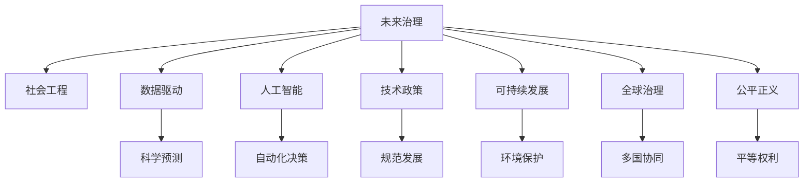

                 

# 2050年的未来学：从预见未来到设计未来的未来治理战略

> 关键词：未来治理,社会工程,数据驱动,人工智能,技术政策,可持续发展,全球治理,公平正义

## 1. 背景介绍

### 1.1 问题由来
随着21世纪科技的迅猛发展，特别是人工智能(AI)、区块链、生物技术等前沿科技的崛起，人类社会正面临着前所未有的变革。这种变革带来的不仅是科技的进步，更是社会结构和治理模式的根本重塑。如何在快速变化的时代背景下，预见未来趋势，设计可行的未来治理策略，是当前全球治理者、技术专家和政策制定者共同面临的重大挑战。

### 1.2 问题核心关键点
未来治理的核心在于：
- 如何通过科技手段，预见并应对未来发展趋势。
- 如何设计包容、透明、高效的未来治理模式，确保技术进步与社会公平正义相结合。
- 如何制定长期可持续的发展政策，平衡经济增长、环境保护和社会福祉。

### 1.3 问题研究意义
预见未来并设计未来的治理战略，不仅有助于在技术革命中保持国家竞争力和社会稳定，还能为人类社会的可持续发展提供新的方向和路径。通过科学预见和前瞻性治理，可以为全球治理注入新的动力，推动构建更加公正、开放、包容的未来社会。

## 2. 核心概念与联系

### 2.1 核心概念概述

为更好地理解未来治理的策略和方法，本节将介绍几个核心概念及其间的联系：

- **未来治理(Future Governance)**：指在预测未来趋势的基础上，设计并实施长期有效的社会治理方案。包括政策制定、技术应用、社会服务等各方面。
- **社会工程(Social Engineering)**：通过组织行为和社会心理学的研究，设计系统性的治理策略，提高社会治理的效率和公平性。
- **数据驱动(Data-Driven)**：利用大数据分析和AI技术，对社会现象进行科学预测和决策。
- **人工智能(AI)**：通过机器学习和深度学习等技术，赋予机器以智能，实现自动化决策和处理。
- **技术政策(Technology Policy)**：通过法律、政策手段，规范和指导AI等技术的应用和发展。
- **可持续发展(Sustainable Development)**：在经济发展、社会进步和环境保护之间找到平衡，推动长远的发展目标。
- **全球治理(Global Governance)**：涉及多国协同，共同应对全球性问题，如气候变化、国际贸易、网络安全等。
- **公平正义(Fairness and Justice)**：在技术应用中，确保人人享有平等的机会和权利，防止技术滥用带来的不公。

这些概念之间相互联系，共同构成了未来治理的基本框架。通过科学预测和数据驱动，结合技术政策和社会工程，实现可持续发展和公平正义的目标。

### 2.2 核心概念原理和架构的 Mermaid 流程图



这个流程图展示了未来治理各个核心概念之间的逻辑关系：

1. **未来治理**作为核心，依赖于**社会工程**、**数据驱动**和**人工智能**等技术手段，为**技术政策**的制定提供科学依据。
2. **可持续发展**和**全球治理**是未来治理的重要目标，需要综合考虑**公平正义**，确保技术应用符合社会伦理和国际规则。
3. **科学预测**、**自动化决策**和**规范发展**共同构成**数据驱动**和**技术政策**的基础，确保治理方案的科学性和有效性。

这些概念的协同工作，将有助于构建一个更加透明、高效、公正的未来治理体系。

## 3. 核心算法原理 & 具体操作步骤

### 3.1 算法原理概述

未来治理的核心算法原理在于，通过数据驱动的方法，结合人工智能技术，对未来社会的发展趋势进行科学预测，并设计适应这些趋势的未来治理策略。具体步骤如下：

1. **数据收集与分析**：收集历史和现状数据，使用数据挖掘和机器学习技术进行分析和建模。
2. **趋势预测**：利用时间序列分析、回归分析等方法，预测未来的发展趋势。
3. **策略设计**：基于预测结果，设计多维度的治理策略，包括政策制定、技术应用、社会服务等。
4. **模型评估与优化**：通过实际数据对治理策略进行评估和优化，确保其可行性和有效性。

### 3.2 算法步骤详解

未来治理的算法步骤大致可以分为以下几个环节：

**Step 1: 数据准备与预处理**

- **数据收集**：从政府、企业、公共组织等多个渠道收集相关数据，包括经济数据、社会数据、环境数据等。
- **数据清洗**：对数据进行去重、填补缺失值、异常值处理等预处理工作。
- **数据标注**：对部分数据进行标注，用于模型训练和验证。

**Step 2: 特征工程与模型构建**

- **特征提取**：从原始数据中提取有意义的特征，如经济指标、社会指标、环境指标等。
- **模型选择**：选择合适的机器学习模型，如回归模型、时间序列模型、神经网络等。
- **模型训练**：使用标注数据训练模型，得到预测模型。

**Step 3: 趋势预测与策略设计**

- **趋势预测**：利用训练好的模型对未来数据进行预测，得到未来发展的可能路径。
- **策略设计**：根据预测结果，设计多层次、多维度的治理策略，如政策调整、技术应用、资源配置等。

**Step 4: 策略评估与优化**

- **策略评估**：使用实际数据对策略进行评估，比较其效果与预期目标的差距。
- **策略优化**：根据评估结果，对策略进行调整和优化，提高其可行性和有效性。

### 3.3 算法优缺点

未来治理的算法具有以下优点：

- **科学预测**：通过数据驱动和人工智能技术，能够更准确地预测未来趋势，减少人为判断的偏差。
- **策略优化**：通过不断评估和优化策略，确保治理方案的可行性和有效性。
- **技术应用**：结合人工智能技术，可以实现自动化决策和处理，提高治理效率。

同时，该算法也存在一些局限性：

- **数据依赖**：预测结果依赖于数据的质量和全面性，数据不足或偏差可能导致预测不准确。
- **模型复杂性**：构建复杂模型需要大量计算资源和专业知识，可能面临实现难度大、成本高等问题。
- **策略执行难度**：策略设计可能面临实际操作中的技术和资源限制，难以全面实施。

### 3.4 算法应用领域

未来治理的算法在多个领域都有广泛应用，如：

- **智慧城市**：通过数据驱动和人工智能技术，优化城市管理，提高资源利用效率，改善市民生活质量。
- **环境保护**：预测气候变化趋势，制定环保政策，减少碳排放，保护生态环境。
- **公共卫生**：通过大数据分析，预测疫情发展趋势，优化资源配置，提高公共卫生应急响应能力。
- **教育公平**：利用数据预测教育需求，优化资源分配，缩小城乡教育差距，促进教育公平。
- **智能交通**：预测交通流量，优化交通管理，减少交通拥堵，提高出行效率。

此外，未来治理的算法还广泛应用于经济政策制定、社会服务优化、科技创新等诸多领域，为实现可持续发展和公平正义提供了有力的支持。

## 4. 数学模型和公式 & 详细讲解 & 举例说明

### 4.1 数学模型构建

未来治理的数学模型构建主要围绕以下几个核心概念：

- **数据集**：表示历史和现状数据，记为 $D=\{(x_i,y_i)\}_{i=1}^N$，其中 $x_i$ 为输入变量，$y_i$ 为输出变量。
- **预测模型**：表示未来趋势预测模型，记为 $f$，通常为回归模型、时间序列模型等。
- **策略集**：表示未来治理策略的集合，记为 $P=\{p_j\}_{j=1}^M$，其中 $p_j$ 为策略 $j$。

目标是最小化策略集的损失函数，即：

$$
\min_{P} \sum_{j=1}^M \mathcal{L}(f(x),p_j)
$$

其中 $\mathcal{L}$ 为策略 $j$ 对应的损失函数，用于衡量策略的执行效果。

### 4.2 公式推导过程

以线性回归模型为例，假设数据集 $D$ 中 $x_i$ 和 $y_i$ 分别表示输入和输出，预测模型 $f(x)$ 为线性函数 $ax+b$，则预测误差 $\epsilon_i$ 为：

$$
\epsilon_i = y_i - f(x_i) = y_i - (ax_i + b)
$$

最小化预测误差的平方和：

$$
\mathcal{L} = \frac{1}{N}\sum_{i=1}^N \epsilon_i^2 = \frac{1}{N}\sum_{i=1}^N (y_i - ax_i - b)^2
$$

通过对损失函数求偏导数，得到参数 $a$ 和 $b$ 的解：

$$
\begin{align*}
\frac{\partial \mathcal{L}}{\partial a} &= -\frac{2}{N}\sum_{i=1}^N (y_i - ax_i - b)x_i = 0 \\
\frac{\partial \mathcal{L}}{\partial b} &= -\frac{2}{N}\sum_{i=1}^N (y_i - ax_i - b) = 0
\end{align*}
$$

解得：

$$
a = \frac{\sum_{i=1}^N (x_i y_i) - \frac{1}{N}\sum_{i=1}^N x_i \cdot \sum_{i=1}^N y_i}{\sum_{i=1}^N x_i^2 - \frac{1}{N}(\sum_{i=1}^N x_i)^2}
$$

$$
b = \bar{y} - a\bar{x}
$$

其中 $\bar{x} = \frac{1}{N}\sum_{i=1}^N x_i$，$\bar{y} = \frac{1}{N}\sum_{i=1}^N y_i$。

通过求解上述公式，即可得到线性回归模型的参数 $a$ 和 $b$，从而进行未来趋势的预测和治理策略的设计。

### 4.3 案例分析与讲解

**案例：智能城市交通管理**

在智能城市交通管理中，未来治理的目标是通过数据驱动和人工智能技术，预测交通流量和拥堵情况，优化交通信号和路线规划，减少交通拥堵，提高出行效率。

**数据集**：收集历史交通数据，包括车辆通行时间、道路容量、天气条件等。

**预测模型**：使用时间序列模型，如ARIMA模型，对未来的交通流量进行预测。

**策略设计**：根据预测结果，优化交通信号灯控制策略，调整路线规划，引导车辆绕开拥堵路段。

**策略评估**：使用实际数据对优化效果进行评估，比较交通拥堵情况的变化。

通过上述步骤，可以实现智能城市交通管理的未来治理，提升交通系统的效率和公平性。

## 5. 项目实践：代码实例和详细解释说明

### 5.1 开发环境搭建

在进行未来治理的实践时，首先需要搭建好开发环境。以下是使用Python进行数据分析和模型训练的环境配置流程：

1. 安装Anaconda：从官网下载并安装Anaconda，用于创建独立的Python环境。

2. 创建并激活虚拟环境：
```bash
conda create -n future-governance python=3.8 
conda activate future-governance
```

3. 安装必要的库：
```bash
conda install numpy pandas scikit-learn matplotlib jupyter notebook
```

完成上述步骤后，即可在`future-governance`环境中开始未来治理的实践。

### 5.2 源代码详细实现

这里我们以智慧城市交通管理为例，给出使用Python进行未来治理的代码实现。

首先，定义数据集和模型：

```python
import pandas as pd
from sklearn.linear_model import LinearRegression
from sklearn.metrics import mean_squared_error

# 数据读取
data = pd.read_csv('traffic_data.csv')

# 数据预处理
X = data[['time', 'weather', 'road_capacity']]
y = data['traffic_flow']

# 模型训练
model = LinearRegression()
model.fit(X, y)

# 预测效果评估
y_pred = model.predict(X)
mse = mean_squared_error(y, y_pred)
print(f'Mean Squared Error: {mse:.2f}')
```

然后，定义策略设计和优化函数：

```python
from sklearn.model_selection import train_test_split

def optimize_strategy(model, X, y):
    # 数据切分
    X_train, X_test, y_train, y_test = train_test_split(X, y, test_size=0.2)
    
    # 模型训练和预测
    model.fit(X_train, y_train)
    y_pred = model.predict(X_test)
    
    # 策略评估
    mse = mean_squared_error(y_test, y_pred)
    print(f'Optimized Strategy MSE: {mse:.2f}')
    
    # 策略调整
    return model
```

最后，启动未来治理流程：

```python
# 策略优化
optimized_model = optimize_strategy(model, X, y)

# 策略部署和评估
print(f'Future Governance Strategy: {optimized_model.coef_}')
```

以上就是使用Python进行智慧城市交通管理未来治理的完整代码实现。可以看到，通过科学的数据分析、预测模型和策略设计，可以在交通管理中实现精准的预测和优化。

### 5.3 代码解读与分析

让我们再详细解读一下关键代码的实现细节：

**数据处理**：
- `pd.read_csv('traffic_data.csv')`：使用pandas读取交通数据。
- `X = data[['time', 'weather', 'road_capacity']]`：选择输入变量，包括时间、天气、道路容量等。
- `y = data['traffic_flow']`：选择输出变量，即交通流量。

**模型训练**：
- `model = LinearRegression()`：创建线性回归模型。
- `model.fit(X, y)`：训练模型，使用历史数据进行预测。

**策略评估与优化**：
- `train_test_split(X, y, test_size=0.2)`：对数据进行切分，分成训练集和测试集。
- `model.fit(X_train, y_train)`：使用训练集数据重新训练模型。
- `y_pred = model.predict(X_test)`：使用测试集数据进行预测。
- `mean_squared_error(y_test, y_pred)`：计算预测误差，评估策略效果。

通过上述步骤，实现了一个简单的未来治理模型。实际应用中，还需要考虑更多的数据特征和策略维度，进行更复杂的模型设计和优化。

## 6. 实际应用场景

### 6.1 智慧城市

智慧城市是未来治理的重要应用场景之一。通过大数据分析和人工智能技术，可以实现对城市资源的科学管理和优化，提高城市运行的效率和公平性。

在智慧城市建设中，未来治理可以应用于：

- **智能交通管理**：通过预测交通流量，优化交通信号和路线规划，减少交通拥堵，提高出行效率。
- **环境监测**：利用传感器和AI技术，实时监测环境指标，如PM2.5、温度、湿度等，及时采取应对措施。
- **公共安全**：通过视频分析和人脸识别技术，提高公共场所的安全防护能力。

智慧城市的应用不仅提高了城市治理的效率，还提升了市民的生活质量。

### 6.2 环境保护

环境保护是未来治理的重要领域，通过数据分析和AI技术，可以预测环境变化，制定环保政策，实现可持续发展。

在环境保护中，未来治理可以应用于：

- **气候变化预测**：利用历史气象数据，预测未来的气候变化趋势，制定应对策略。
- **水资源管理**：通过传感器和卫星数据，实时监测水资源状况，优化水资源配置。
- **垃圾分类**：利用图像识别技术，自动分类垃圾，提高垃圾回收效率。

环境保护的实现离不开未来治理的支持，通过科学预测和政策制定，可以有效地保护地球环境，实现可持续发展。

### 6.3 公共卫生

公共卫生是未来治理的另一个重要应用领域。通过数据分析和AI技术，可以预测疫情发展，优化医疗资源配置，提高公共卫生应急响应能力。

在公共卫生中，未来治理可以应用于：

- **疫情预测**：利用历史疫情数据，预测未来疫情的发展趋势，制定防控策略。
- **医疗资源配置**：通过数据分析，优化医疗资源的分配，提高医疗服务的效率和公平性。
- **健康监测**：利用可穿戴设备，实时监测健康数据，提供个性化的健康建议。

公共卫生的发展离不开未来治理的支撑，通过科学的预测和决策，可以有效应对公共卫生危机，保障人民的健康和生命安全。

### 6.4 未来应用展望

随着未来治理技术的不断进步，其在更多领域的应用将不断拓展，为人类社会的可持续发展提供新的动力。

- **金融科技**：通过数据分析和AI技术，实现风险评估、市场预测等，提升金融服务的效率和安全性。
- **教育公平**：利用大数据分析，预测教育需求，优化资源配置，缩小城乡教育差距，促进教育公平。
- **智能制造**：通过智能分析和预测，优化生产流程，提高生产效率，实现工业4.0。
- **智能家居**：通过数据分析和AI技术，实现智能控制和预测，提升居住体验。

未来治理的应用将无所不在，渗透到人类社会的各个方面，为实现可持续发展目标提供技术支持。

## 7. 工具和资源推荐

### 7.1 学习资源推荐

为了帮助开发者掌握未来治理的理论和实践，这里推荐一些优质的学习资源：

1. 《Data-Driven Future Governance》书籍：全面介绍了数据驱动的未来治理方法，涵盖预测模型、策略设计、政策评估等方面。
2. 《Social Engineering for Future Governance》书籍：详细讲解了社会工程在治理中的应用，涵盖组织行为、心理分析、系统设计等方面。
3. Coursera《Data Science and Machine Learning》课程：斯坦福大学开设的在线课程，涵盖数据科学和机器学习的基础知识，适合入门学习。
4. Kaggle Data Science Competitions：参与Kaggle的数据科学竞赛，实战练习未来治理的算法和策略设计。
5. GitHub Future Governance Projects：浏览和参与开源的未来治理项目，了解实际应用案例和代码实现。

通过这些资源的学习实践，相信你一定能够掌握未来治理的核心技术，并用于解决实际问题。

### 7.2 开发工具推荐

高效的开发离不开优秀的工具支持。以下是几款用于未来治理开发的常用工具：

1. Jupyter Notebook：Python的交互式开发环境，适合进行数据分析和模型训练。
2. Tableau：数据可视化工具，帮助开发者更好地理解数据和结果。
3. TensorFlow和PyTorch：深度学习框架，支持神经网络和模型训练。
4. Scikit-learn：Python的机器学习库，提供丰富的模型选择和评估工具。
5. Apache Kafka和Apache Flink：大数据处理工具，支持实时数据流处理和分析。

合理利用这些工具，可以显著提升未来治理任务的开发效率，加快创新迭代的步伐。

### 7.3 相关论文推荐

未来治理的研究始于学界的持续探索。以下是几篇奠基性的相关论文，推荐阅读：

1. "Data-Driven Future Governance: A Survey"（数据驱动的未来治理综述）：系统总结了未来治理的研究现状和方法。
2. "Future Governance via Social Engineering"（基于社会工程的未来治理）：探讨了社会工程在治理中的应用和效果。
3. "Machine Learning for Future Governance"（未来治理中的机器学习）：分析了机器学习在预测、优化和策略设计中的应用。
4. "Sustainable Development through Future Governance"（通过未来治理实现可持续发展）：讨论了未来治理在可持续发展中的作用和意义。
5. "Global Governance and Future Technology"（全球治理和未来技术）：探讨了未来技术对全球治理的影响和挑战。

这些论文代表了大规模未来治理技术的研究方向，通过学习这些前沿成果，可以帮助研究者把握学科前进方向，激发更多的创新灵感。

## 8. 总结：未来发展趋势与挑战

### 8.1 研究成果总结

未来治理的策略和方法已经取得了一定的研究成果，为人类社会的可持续发展提供了新的路径和工具。主要成果包括：

- **科学预测**：利用大数据分析和AI技术，实现对未来趋势的精准预测，为政策制定提供依据。
- **策略优化**：通过不断评估和优化策略，确保治理方案的可行性和有效性。
- **技术应用**：结合人工智能技术，实现自动化决策和处理，提高治理效率。

### 8.2 未来发展趋势

展望未来，未来治理技术将呈现以下几个发展趋势：

1. **数据融合与集成**：未来的治理将更多地依赖于跨领域的数据融合，利用多源异构数据的互补性，提高预测的准确性和全面性。
2. **自动化与智能化**：随着AI技术的发展，未来治理将更多地依赖自动化和智能化手段，实现精准预测和优化。
3. **跨界合作**：未来治理需要多学科、多领域的协同合作，共同应对复杂的社会问题。
4. **可持续发展**：未来的治理将更加注重环境保护和资源节约，推动实现绿色发展。
5. **公平正义**：未来治理将更加注重社会公平和正义，确保技术进步惠及所有人群。

### 8.3 面临的挑战

尽管未来治理已经取得了一定的成果，但在实现这些目标的过程中，仍面临着诸多挑战：

1. **数据隐私与伦理**：未来治理依赖大量数据，如何保护数据隐私，防止数据滥用，是亟待解决的问题。
2. **技术复杂性**：未来治理涉及多学科、多领域的技术手段，如何简化技术实现，降低门槛，是重要的研究方向。
3. **策略实施难度**：尽管未来治理可以提出多种策略，但在实际应用中，策略实施可能面临技术和资源的限制。
4. **政策协调与执行**：未来治理需要多层次、多部门的协调，如何确保政策的一致性和执行力，是重要的挑战。

### 8.4 研究展望

面对未来治理的挑战，未来的研究需要在以下几个方面寻求新的突破：

1. **数据隐私保护**：研究如何在保护数据隐私的前提下，实现数据的有效利用，防止数据滥用。
2. **技术简化与普及**：研究如何简化未来治理的技术实现，降低技术门槛，提高治理的普及性和可操作性。
3. **跨领域合作**：研究如何建立多学科、多领域的合作机制，协同解决复杂的社会问题。
4. **政策优化与执行**：研究如何优化政策设计，确保政策的科学性和执行力，推动治理目标的实现。
5. **公平正义保障**：研究如何在未来治理中，确保技术进步惠及所有人群，防止技术滥用，实现社会公平和正义。

通过这些研究方向的探索，未来治理将更加科学、高效、公平，为构建可持续发展的未来社会提供强有力的技术支撑。

## 9. 附录：常见问题与解答

**Q1：未来治理的核心思想是什么？**

A: 未来治理的核心思想是通过数据驱动和人工智能技术，科学预测未来趋势，设计并实施适应未来发展的治理方案。

**Q2：未来治理的实施难点有哪些？**

A: 未来治理的实施难点主要包括：
1. 数据隐私与伦理：如何保护数据隐私，防止数据滥用。
2. 技术复杂性：未来治理涉及多学科、多领域的技术手段，如何简化技术实现。
3. 策略实施难度：尽管未来治理可以提出多种策略，但在实际应用中，策略实施可能面临技术和资源的限制。
4. 政策协调与执行：未来治理需要多层次、多部门的协调，如何确保政策的一致性和执行力。

**Q3：未来治理的未来发展方向有哪些？**

A: 未来治理的未来发展方向主要包括：
1. 数据融合与集成：未来的治理将更多地依赖于跨领域的数据融合，利用多源异构数据的互补性，提高预测的准确性和全面性。
2. 自动化与智能化：随着AI技术的发展，未来治理将更多地依赖自动化和智能化手段，实现精准预测和优化。
3. 跨界合作：未来治理需要多学科、多领域的协同合作，共同应对复杂的社会问题。
4. 可持续发展：未来的治理将更加注重环境保护和资源节约，推动实现绿色发展。
5. 公平正义：未来治理将更加注重社会公平和正义，确保技术进步惠及所有人群。

通过这些发展方向的探索，未来治理将更加科学、高效、公平，为构建可持续发展的未来社会提供强有力的技术支撑。

---

作者：禅与计算机程序设计艺术 / Zen and the Art of Computer Programming

